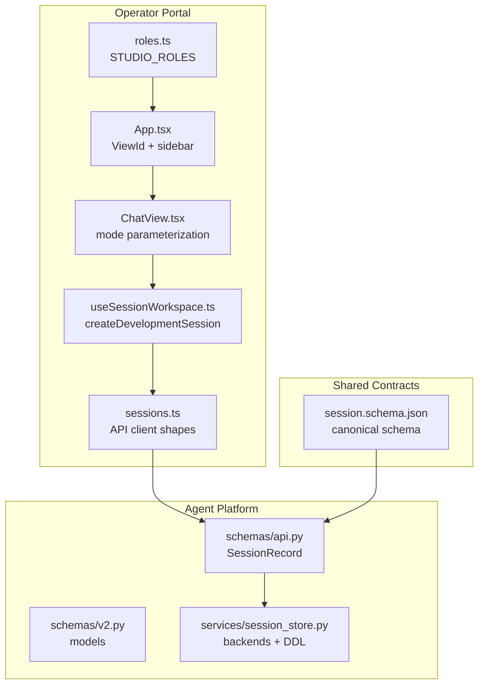
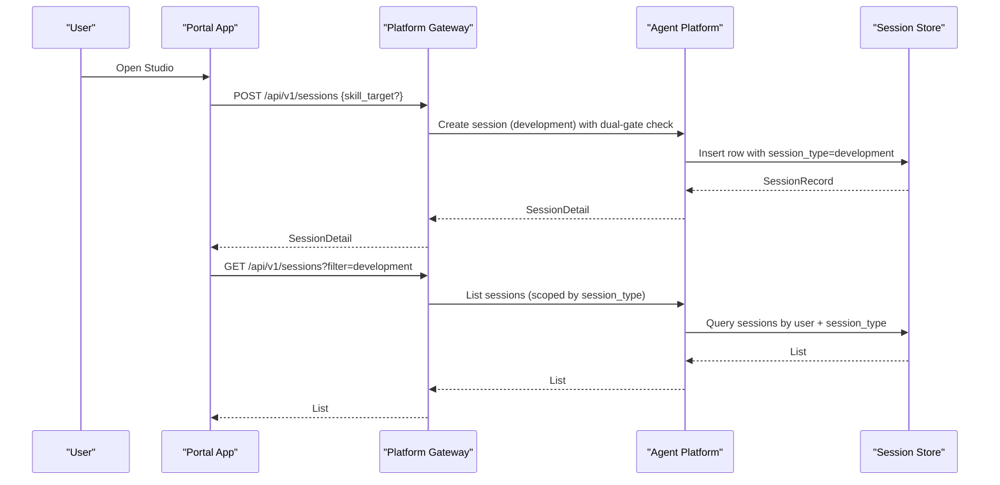
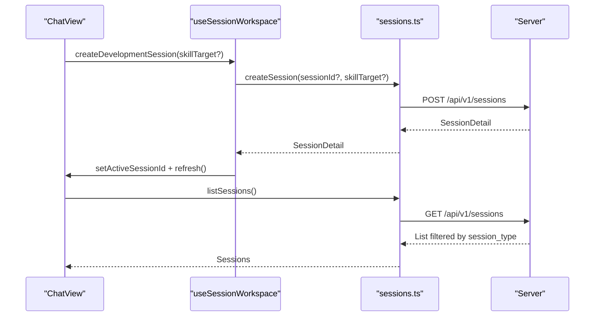
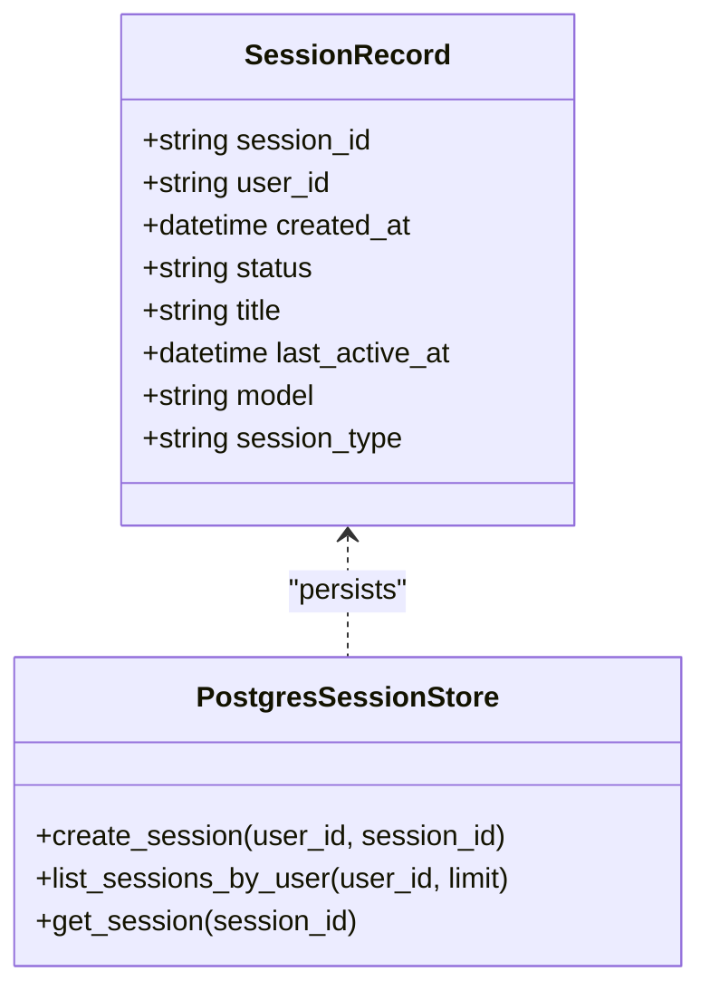
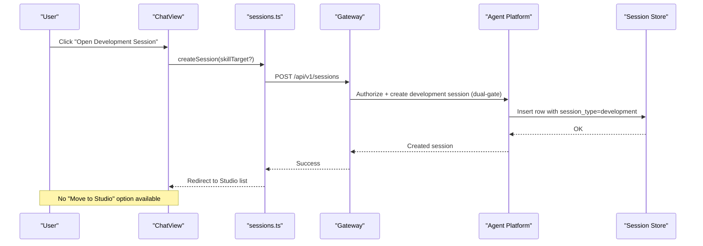
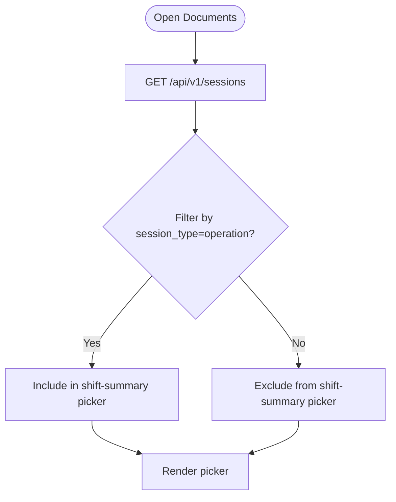
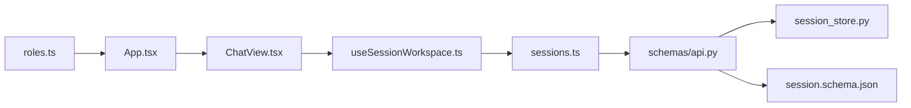

# SPEC-056: Studio Skill Development Workspace

<cite>
**Referenced Files in This Document**
- [spec.md](file://docs/specs/SPEC-056-studio-skill-development-workspace/spec.md)
- [App.tsx](file://products/operator-portal/web-ui/app/src/App.tsx)
- [roles.ts](file://products/operator-portal/web-ui/app/src/roles.ts)
- [ChatView.tsx](file://products/operator-portal/web-ui/app/src/chat/ChatView.tsx)
- [useSessionWorkspace.ts](file://products/operator-portal/web-ui/app/src/sessions/useSessionWorkspace.ts)
- [sessions.ts](file://products/operator-portal/web-ui/app/src/api/sessions.ts)
- [api.py](file://products/agent-platform/src/agent_service/schemas/api.py)
- [v2.py](file://products/agent-platform/src/agent_service/schemas/v2.py)
- [session_store.py](file://products/agent-platform/src/agent_service/services/session_store.py)
- [session.schema.json](file://shared/shared-contracts/schemas/session.schema.json)
</cite>

## Update Summary
**Changes Made**
- Updated status from draft to approved based on formal approval on 2026-09-12
- Resolved all three open questions (OQ-1, OQ-2, OQ-3) with final architectural decisions
- Updated implementation guidance to reflect immutable session_type discriminator at birth
- Clarified role-based Studio access through route-level dual-gate mechanism
- Enhanced legacy backfill inference strategy for existing sessions
- Refined per-entry session type scoping for Chat vs Studio separation

## Table of Contents
1. [Introduction](#introduction)
2. [Project Structure](#project-structure)
3. [Core Components](#core-components)
4. [Architecture Overview](#architecture-overview)
5. [Detailed Component Analysis](#detailed-component-analysis)
6. [Dependency Analysis](#dependency-analysis)
7. [Performance Considerations](#performance-considerations)
8. [Troubleshooting Guide](#troubleshooting-guide)
9. [Conclusion](#conclusion)

## Introduction
SPEC-056 introduces a dedicated Studio workspace for skill development alongside the existing Chat workspace for operations. It splits one undifferentiated surface into two mode-parameterized views over a shared chat core, and adds an additive session contract discriminator to distinguish operation vs development sessions. **The spec enforces strict immutability of session_type at birth — there is no promotion or conversion between session types.** The spec enforces role-based visibility (authoring roles access Studio), filters operational document generation to operation sessions only, and preserves blast-radius by keeping security-critical paths shared and identical across modes.

**Status**: Approved (2026-09-12) - All open questions resolved with final architectural decisions implemented.

Key outcomes:
- Two distinct entries: Chat (operation) and Studio (development).
- One shared chat implementation parameterized by mode.
- **Strictly immutable** session_type discriminator fixed at birth with **no promotion**.
- Role-gated Studio entry aligned with authoring roles via route-level dual-gate.
- Server-side filtering of operational documents to operation sessions.
- Single-target skill model with no multi-target conversion.

**Section sources**
- [spec.md:3-10](file://docs/specs/SPEC-056-studio-skill-development-workspace/spec.md#L3-L10)
- [spec.md:31-51](file://docs/specs/SPEC-056-studio-skill-development-workspace/spec.md#L31-L51)
- [spec.md:86-116](file://docs/specs/SPEC-056-studio-skill-development-workspace/spec.md#L86-L116)

## Project Structure
The Studio split touches three layers:
- Operator portal UI: navigation, role gating, session creation, and chat controls.
- Agent platform contracts and storage: session schema, models, and backends.
- Shared contracts: canonical JSON schema for sessions.

**Diagram sources**
- [App.tsx:51-60](file://products/operator-portal/web-ui/app/src/App.tsx#L51-L60)
- [roles.ts:70-81](file://products/operator-portal/web-ui/app/src/roles.ts#L70-L81)
- [ChatView.tsx:1572-1609](file://products/operator-portal/web-ui/app/src/chat/ChatView.tsx#L1572-L1609)
- [useSessionWorkspace.ts:127-151](file://products/operator-portal/web-ui/app/src/sessions/useSessionWorkspace.ts#L127-L151)
- [sessions.ts:135-158](file://products/operator-portal/web-ui/app/src/api/sessions.ts#L135-L158)
- [api.py:8-22](file://products/agent-platform/src/agent_service/schemas/api.py#L8-L22)
- [session_store.py:443-463](file://products/agent-platform/src/agent_service/services/session_store.py#L443-L463)
- [session.schema.json:1-25](file://shared/shared-contracts/schemas/session.schema.json#L1-L25)

**Section sources**
- [App.tsx:51-60](file://products/operator-portal/web-ui/app/src/App.tsx#L51-L60)
- [roles.ts:70-81](file://products/operator-portal/web-ui/app/src/roles.ts#L70-L81)
- [ChatView.tsx:1572-1609](file://products/operator-portal/web-ui/app/src/chat/ChatView.tsx#L1572-L1609)
- [useSessionWorkspace.ts:127-151](file://products/operator-portal/web-ui/app/src/sessions/useSessionWorkspace.ts#L127-L151)
- [sessions.ts:135-158](file://products/operator-portal/web-ui/app/src/api/sessions.ts#L135-L158)
- [api.py:8-22](file://products/agent-platform/src/agent_service/schemas/api.py#L8-L22)
- [session_store.py:443-463](file://products/agent-platform/src/agent_service/services/session_store.py#L443-L463)
- [session.schema.json:1-25](file://shared/shared-contracts/schemas/session.schema.json#L1-L25)

## Core Components
- ViewId union and sidebar: Adds a Studio entry gated by authoring roles; Chat remains broad.
- Role sets: STUDIO_ROLES align with authoring roles that hold graduation authority.
- ChatView parameterization: One view renders both modes; mode selects visible controls and list scoping.
- Session workspace: createDevelopmentSession opens a development session and refreshes lists.
- API client: SessionSummary/SessionDetail interfaces mirror server contracts; createSession supports skill_target at birth.
- Session schema and models: Additive session_type discriminator on SessionRecord and mirrors; default operation.
- Storage backends: Postgres DDL and mappers updated to include session_type; backfill strategy per OQ-2.

**Updated** All open questions resolved with final implementation decisions:
- **OQ-1**: Route-level dual-gate using existing `session:skill_graduate` action for Studio entry gating
- **OQ-2**: Legacy backfill infers `development` for sessions with declared authoring-trace targets
- **OQ-3**: Per-entry session type scoping - each entry lists only its own session_type

Acceptance criteria highlights:
- R-1: session_type is additive, **strictly immutable at birth**, no promotion or conversion.
- R-2: Studio entry exists, role-gated, one shared ChatView with mode.
- R-3: Controls split; **no "Move to Studio"** - development sessions are created directly in Studio.
- R-4: Shift-summary picker filters to operation sessions server-side.
- R-5: Security-critical core is shared and identical across modes.
- R-6: No new policy action or audit event type; dual-gate on session:create for development.

**Section sources**
- [spec.md:86-116](file://docs/specs/SPEC-056-studio-skill-development-workspace/spec.md#L86-L116)
- [spec.md:118-143](file://docs/specs/SPEC-056-studio-skill-development-workspace/spec.md#L118-L143)
- [spec.md:144-183](file://docs/specs/SPEC-056-studio-skill-development-workspace/spec.md#L144-L183)
- [spec.md:333-377](file://docs/specs/SPEC-056-studio-skill-development-workspace/spec.md#L333-L377)
- [App.tsx:51-60](file://products/operator-portal/web-ui/app/src/App.tsx#L51-L60)
- [roles.ts:70-81](file://products/operator-portal/web-ui/app/src/roles.ts#L70-L81)
- [ChatView.tsx:1572-1609](file://products/operator-portal/web-ui/app/src/chat/ChatView.tsx#L1572-L1609)
- [useSessionWorkspace.ts:127-151](file://products/operator-portal/web-ui/app/src/sessions/useSessionWorkspace.ts#L127-L151)
- [sessions.ts:135-158](file://products/operator-portal/web-ui/app/src/api/sessions.ts#L135-L158)
- [api.py:8-22](file://products/agent-platform/src/agent_service/schemas/api.py#L8-L22)
- [session_store.py:443-463](file://products/agent-platform/src/agent_service/services/session_store.py#L443-L463)

## Architecture Overview
Studio and Chat share the same chat core; differences are limited to:
- Entry visibility and role gating.
- Mode passed to ChatView.
- session_type written at creation and used for list scoping.
- **No promotion mechanism** - sessions are created with their final type from birth.

**Diagram sources**
- [useSessionWorkspace.ts:127-151](file://products/operator-portal/web-ui/app/src/sessions/useSessionWorkspace.ts#L127-L151)
- [sessions.ts:193-204](file://products/operator-portal/web-ui/app/src/api/sessions.ts#L193-L204)
- [api.py:8-22](file://products/agent-platform/src/agent_service/schemas/api.py#L8-L22)
- [session_store.py:595-626](file://products/agent-platform/src/agent_service/services/session_store.py#L595-L626)
- [session_store.py:655-684](file://products/agent-platform/src/agent_service/services/session_store.py#L655-L684)

## Detailed Component Analysis

### Portal Navigation and Role Gating
- ViewId union gains studio; sidebar item added for Studio.
- STUDIO_ROLES set equals authoring roles (operator/approver/platform-admin).
- Chat entry remains broadly accessible; Studio is narrowed.

**Diagram sources**
- [App.tsx:51-60](file://products/operator-portal/web-ui/app/src/App.tsx#L51-L60)
- [roles.ts:70-81](file://products/operator-portal/web-ui/app/src/roles.ts#L70-L81)

**Section sources**
- [App.tsx:51-60](file://products/operator-portal/web-ui/app/src/App.tsx#L51-L60)
- [roles.ts:70-81](file://products/operator-portal/web-ui/app/src/roles.ts#L70-L81)

### ChatView Mode Parameterization
- One ChatView renders both entries; mode selects controls and list scope.
- Operation mode keeps Draft as skill; development mode exposes Declare target and Graduate.
- **No "Move to Studio" control** - development sessions are created directly in Studio.

**Diagram sources**
- [ChatView.tsx:1572-1609](file://products/operator-portal/web-ui/app/src/chat/ChatView.tsx#L1572-L1609)
- [useSessionWorkspace.ts:127-151](file://products/operator-portal/web-ui/app/src/sessions/useSessionWorkspace.ts#L127-L151)
- [sessions.ts:193-204](file://products/operator-portal/web-ui/app/src/api/sessions.ts#L193-L204)

**Section sources**
- [ChatView.tsx:1572-1609](file://products/operator-portal/web-ui/app/src/chat/ChatView.tsx#L1572-L1609)
- [useSessionWorkspace.ts:127-151](file://products/operator-portal/web-ui/app/src/sessions/useSessionWorkspace.ts#L127-L151)
- [sessions.ts:193-204](file://products/operator-portal/web-ui/app/src/api/sessions.ts#L193-L204)

### Session Contract and Storage
- Additive session_type field on SessionRecord and mirrors.
- Default operation; development set at creation from Studio.
- Postgres DDL includes session_type; mappers read/write it consistently.
- Backfill legacy sessions per OQ-2 recommendation (infer development if already has declared target).

**Diagram sources**
- [api.py:8-22](file://products/agent-platform/src/agent_service/schemas/api.py#L8-L22)
- [session_store.py:443-463](file://products/agent-platform/src/agent_service/services/session_store.py#L443-L463)
- [session_store.py:595-626](file://products/agent-platform/src/agent_service/services/session_store.py#L595-L626)
- [session_store.py:655-684](file://products/agent-platform/src/agent_service/services/session_store.py#L655-L684)

**Section sources**
- [api.py:8-22](file://products/agent-platform/src/agent_service/schemas/api.py#L8-L22)
- [session_store.py:443-463](file://products/agent-platform/src/agent_service/services/session_store.py#L443-L463)
- [session_store.py:595-626](file://products/agent-platform/src/agent_service/services/session_store.py#L595-L626)
- [session_store.py:655-684](file://products/agent-platform/src/agent_service/services/session_store.py#L655-L684)

### Session Lifecycle: Immutable at Birth
- **No promotion mechanism exists** - sessions are created with their final type.
- Development sessions are opened directly in Studio with skill_target at birth.
- Operation sessions remain in Chat with no conversion path.
- Multi-target operation sessions cannot be converted to single-target development sessions due to trust model constraints.

**Diagram sources**
- [sessions.ts:193-204](file://products/operator-portal/web-ui/app/src/api/sessions.ts#L193-L204)
- [spec.md:144-183](file://docs/specs/SPEC-056-studio-skill-development-workspace/spec.md#L144-L183)
- [session_store.py:595-626](file://products/agent-platform/src/agent_service/services/session_store.py#L595-L626)

**Section sources**
- [sessions.ts:193-204](file://products/operator-portal/web-ui/app/src/api/sessions.ts#L193-L204)
- [spec.md:144-183](file://docs/specs/SPEC-056-studio-skill-development-workspace/spec.md#L144-L183)

### Operational Document Filtering
- Shift-summary picker lists only operation sessions.
- Filter enforced server-side on session list query.
- Incident-report documents unaffected (anchored by incident_id).

**Diagram sources**
- [spec.md:184-201](file://docs/specs/SPEC-056-studio-skill-development-workspace/spec.md#L184-L201)
- [sessions.ts:164-169](file://products/operator-portal/web-ui/app/src/api/sessions.ts#L164-L169)

**Section sources**
- [spec.md:184-201](file://docs/specs/SPEC-056-studio-skill-development-workspace/spec.md#L184-L201)
- [sessions.ts:164-169](file://products/operator-portal/web-ui/app/src/api/sessions.ts#L164-L169)

## Dependency Analysis
- Portal depends on role sets for visibility and on useSessionWorkspace for session lifecycle.
- useSessionWorkspace depends on sessions.ts API client for create/list/rename/delete.
- sessions.ts types depend on agent-platform schemas and shared JSON schema.
- Agent platform schemas depend on shared JSON schema; storage backends implement persistence with consistent mappers.

**Diagram sources**
- [roles.ts:70-81](file://products/operator-portal/web-ui/app/src/roles.ts#L70-L81)
- [App.tsx:51-60](file://products/operator-portal/web-ui/app/src/App.tsx#L51-L60)
- [ChatView.tsx:1572-1609](file://products/operator-portal/web-ui/app/src/chat/ChatView.tsx#L1572-L1609)
- [useSessionWorkspace.ts:127-151](file://products/operator-portal/web-ui/app/src/sessions/useSessionWorkspace.ts#L127-L151)
- [sessions.ts:135-158](file://products/operator-portal/web-ui/app/src/api/sessions.ts#L135-L158)
- [api.py:8-22](file://products/agent-platform/src/agent_service/schemas/api.py#L8-L22)
- [session_store.py:443-463](file://products/agent-platform/src/agent_service/services/session_store.py#L443-L463)
- [session.schema.json:1-25](file://shared/shared-contracts/schemas/session.schema.json#L1-L25)

**Section sources**
- [roles.ts:70-81](file://products/operator-portal/web-ui/app/src/roles.ts#L70-L81)
- [App.tsx:51-60](file://products/operator-portal/web-ui/app/src/App.tsx#L51-L60)
- [ChatView.tsx:1572-1609](file://products/operator-portal/web-ui/app/src/chat/ChatView.tsx#L1572-L1609)
- [useSessionWorkspace.ts:127-151](file://products/operator-portal/web-ui/app/src/sessions/useSessionWorkspace.ts#L127-L151)
- [sessions.ts:135-158](file://products/operator-portal/web-ui/app/src/api/sessions.ts#L135-L158)
- [api.py:8-22](file://products/agent-platform/src/agent_service/schemas/api.py#L8-L22)
- [session_store.py:443-463](file://products/agent-platform/src/agent_service/services/session_store.py#L443-L463)
- [session.schema.json:1-25](file://shared/shared-contracts/schemas/session.schema.json#L1-L25)

## Performance Considerations
- Session listing uses bounded queries and TTL-aware reads; avoid unnecessary re-fetches by leveraging workspace refresh sequence.
- Postgres backend sweeps expired rows opportunistically on writes to keep lists lean.
- Keep mode-specific control rendering minimal to avoid extra state churn in ChatView.
- **Immutable session_type eliminates runtime type-checking overhead** since type is known at creation time.

## Troubleshooting Guide
Common issues and resolutions:
- Studio entry not visible: verify user has an authoring role; check role set mapping.
- Development session appears in Chat list: ensure session_type was set at creation and list filter scopes by session_type.
- **Cannot convert operation to development**: This is by design - sessions are immutable at birth. Use Studio directly for development work.
- **Cannot promote existing session**: No promotion mechanism exists - create a new development session in Studio instead.
- Shift-summary includes development sessions: validate server-side filter on session:list; ensure client does not bypass filter.
- **Legacy sessions misclassified**: Backfill migration should infer development for sessions with declared authoring-trace targets.

**Section sources**
- [roles.ts:70-81](file://products/operator-portal/web-ui/app/src/roles.ts#L70-L81)
- [spec.md:144-183](file://docs/specs/SPEC-056-studio-skill-development-workspace/spec.md#L144-L183)
- [spec.md:184-201](file://docs/specs/SPEC-056-studio-skill-development-workspace/spec.md#L184-L201)
- [spec.md:356-367](file://docs/specs/SPEC-056-studio-skill-development-workspace/spec.md#L356-L367)

## Conclusion
SPEC-056 cleanly separates operational and development workflows while preserving a single secure chat core. **The strict immutability of session_type at birth ensures clear mental models and safer blast radius** - there is no ambiguity about whether a session can be promoted or converted. The role-gated Studio entry, server-side filtering, and single-target skill model provide a clean separation between operation and development concerns. The removal of promotion mechanisms simplifies the trust model and eliminates potential security vulnerabilities from in-place session type changes.

**Approved Status**: The spec was formally approved on 2026-09-12 with all open questions resolved:
- **OQ-1**: Route-level dual-gate using existing `session:skill_graduate` action for Studio entry gating
- **OQ-2**: Legacy backfill infers `development` for sessions with declared authoring-trace targets  
- **OQ-3**: Per-entry session type scoping - each entry lists only its own session_type

**Deferred Features**: The Chat→Studio spawn bridge ("Continue in Studio"), composition/runbook-of-skills construct, and assisted trace-extraction are deferred to SPEC-057, allowing SPEC-056 to focus on the fundamental separation of concerns without additional complexity.

[No sources needed since this section summarizes without analyzing specific files]