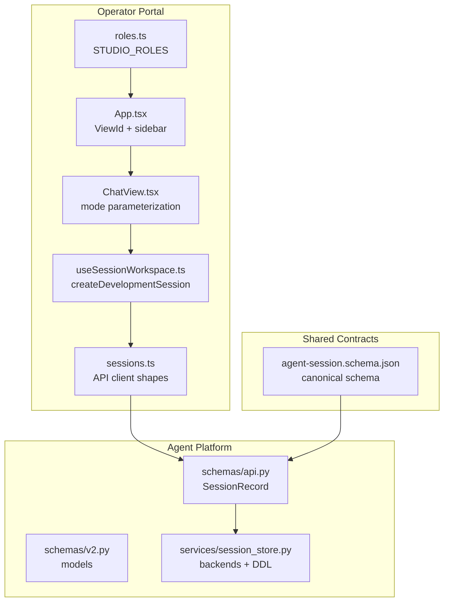
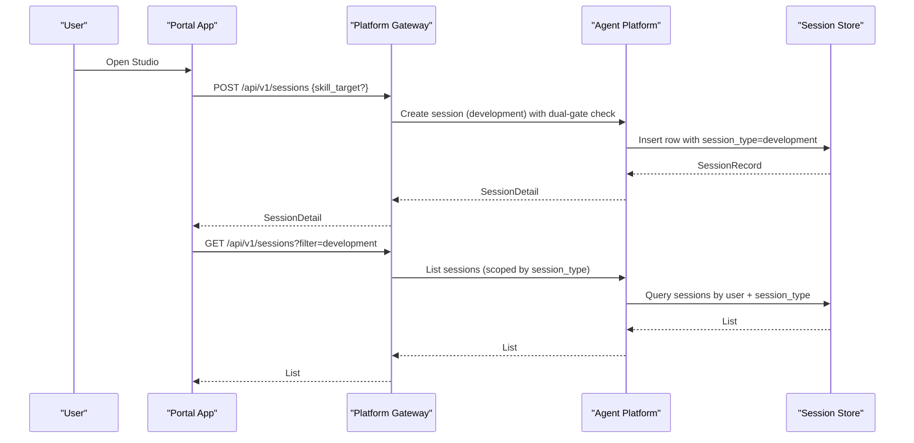
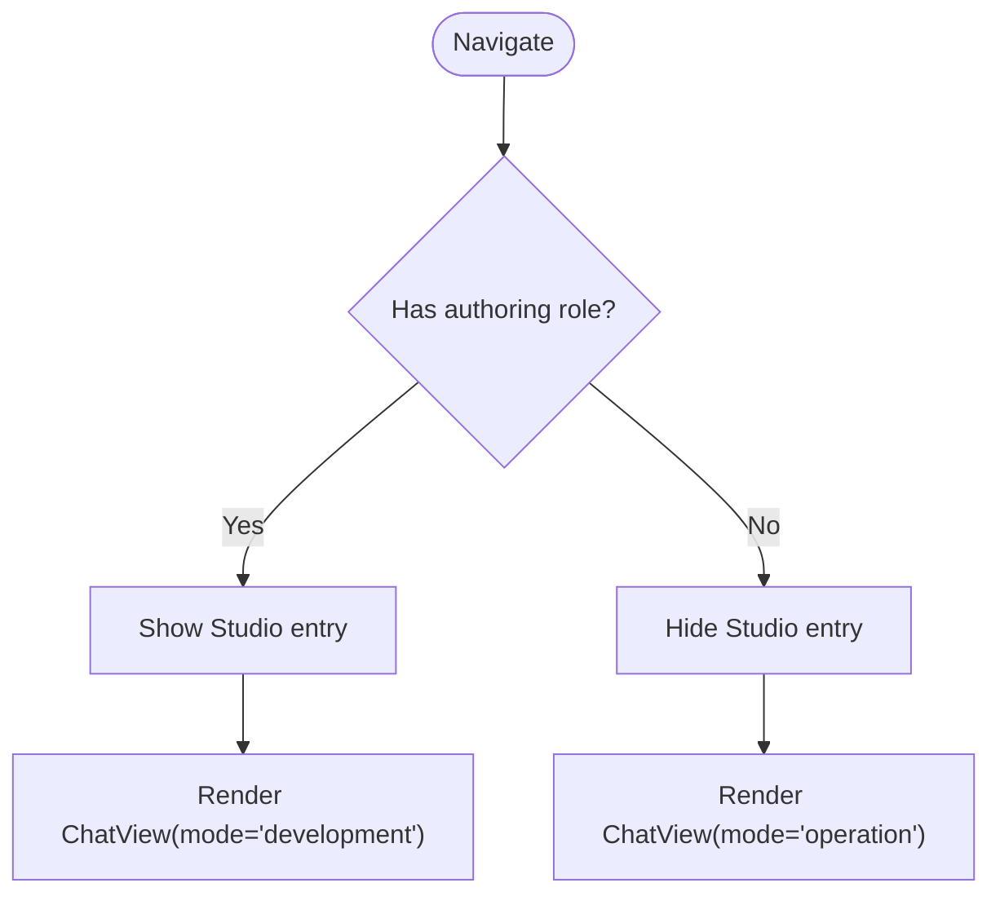
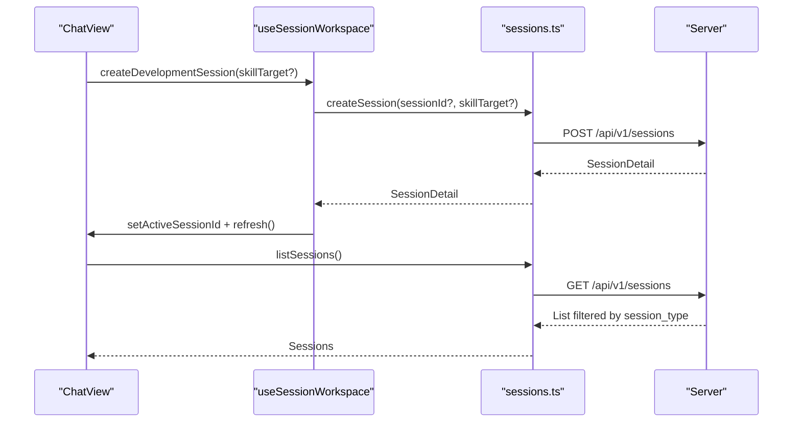
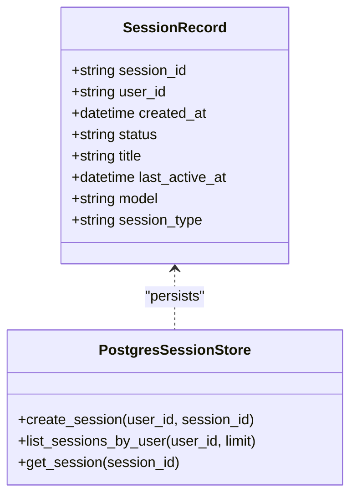
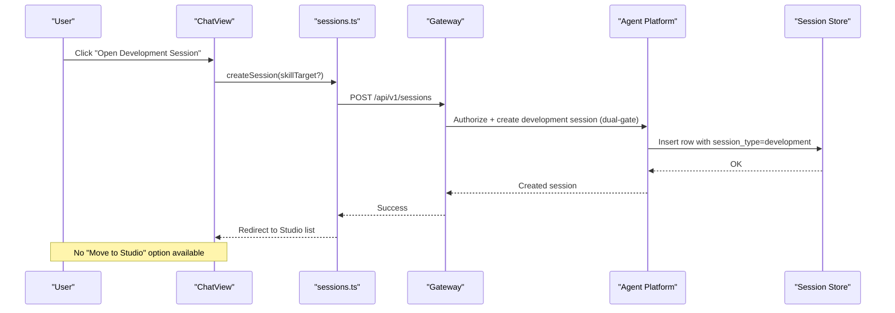
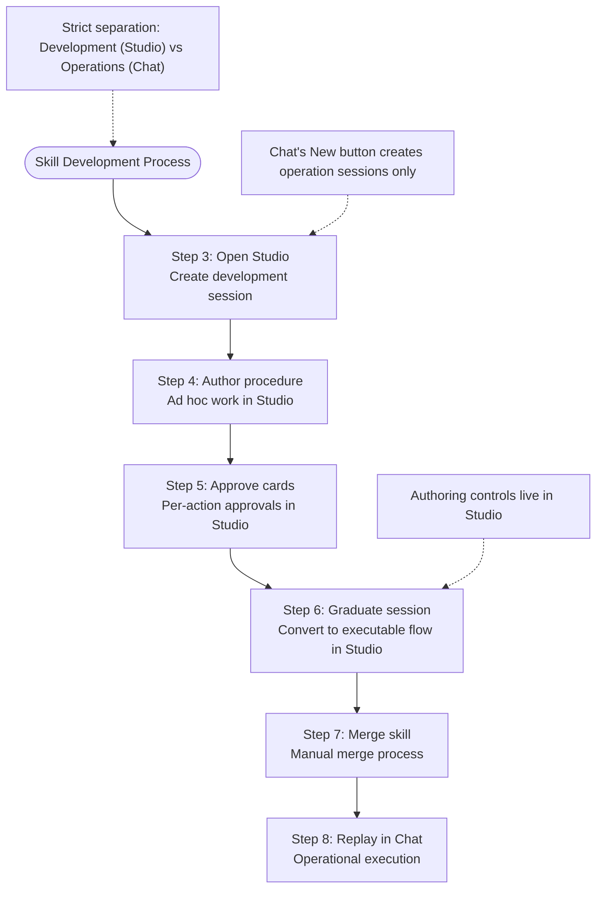

# SPEC-056: Studio Skill Development Workspace

<cite>
**Referenced Files in This Document**
- [spec.md](file://docs/specs/SPEC-056-studio-skill-development-workspace/spec.md)
- [plan.md](file://docs/specs/SPEC-056-studio-skill-development-workspace/plan.md)
- [tasks.md](file://docs/specs/SPEC-056-studio-skill-development-workspace/tasks.md)
- [App.tsx](file://products/operator-portal/web-ui/app/src/App.tsx)
- [roles.ts](file://products/operator-portal/web-ui/app/src/roles.ts)
- [ChatView.tsx](file://products/operator-portal/web-ui/app/src/chat/ChatView.tsx)
- [useSessionWorkspace.ts](file://products/operator-portal/web-ui/app/src/sessions/useSessionWorkspace.ts)
- [api.py](file://products/agent-platform/src/agent_service/schemas/api.py)
- [agent-session.schema.json](file://shared/shared-contracts/schemas/agent-session.schema.json)
- [2026-09-13-studio-skill-development-workspace.md](file://docs/agentic-aiops-platform/release-notes/2026-09-13-studio-skill-development-workspace.md)
- [Makefile](file://Makefile)
- [image.mk](file://mk/image.mk)
- [defaults.mk](file://mk/defaults.mk)
- [WALKTHROUGH.md](file://samples/web-checks/skill-graduation/WALKTHROUGH.md)
- [studio-guide.md](file://docs/guides/studio-guide.md)
</cite>

## Update Summary
**Changes Made**
- Enhanced graduation workflow section with explicit Studio-first approach guidance
- Added clear clarification about why Chat's New button cannot substitute for Studio's development session creation
- Strengthened documentation of the strict separation between development and operational workflows
- Updated troubleshooting guidance to address common confusion points between Chat and Studio usage
- Clarified that steps 3-6 (skill development) must occur exclusively in Studio

## Table of Contents
1. [Introduction](#introduction)
2. [Project Structure](#project-structure)
3. [Core Components](#core-components)
4. [Architecture Overview](#architecture-overview)
5. [Detailed Component Analysis](#detailed-component-analysis)
6. [Delivery Verification](#delivery-verification)
7. [Build System and Image Management](#build-system-and-image-management)
8. [Performance Considerations](#performance-considerations)
9. [Troubleshooting Guide](#troubleshooting-guide)
10. [Conclusion](#conclusion)

## Introduction
SPEC-056 introduces a dedicated Studio workspace for skill development alongside the existing Chat workspace for operations. It splits one undifferentiated surface into two mode-parameterized views over a shared chat core, and adds an additive session contract discriminator to distinguish operation vs development sessions. **The spec enforces strict immutability of session_type at birth — there is no promotion or conversion between session types.** The spec enforces role-based visibility (authoring roles access Studio), filters operational document generation to operation sessions only, and preserves blast-radius by keeping security-critical paths shared and identical across modes.

**Status**: **Delivered** (2026-09-13, v0.37.0) - All seven requirements shipped with comprehensive implementation and verification.

Key outcomes:
- Two distinct entries: Chat (operation) and Studio (development).
- One shared chat implementation parameterized by mode.
- **Strictly immutable** session_type discriminator fixed at birth with **no promotion**.
- Role-gated Studio entry aligned with authoring roles via route-level dual-gate.
- Server-side filtering of operational documents to operation sessions.
- Single-target skill model with no multi-target conversion.

**Section sources**
- [spec.md:3-10](file://docs/specs/SPEC-056-studio-skill-development-workspace/spec.md#L3-L10)
- [spec.md:32-52](file://docs/specs/SPEC-056-studio-skill-development-workspace/spec.md#L32-L52)
- [spec.md:87-117](file://docs/specs/SPEC-056-studio-skill-development-workspace/spec.md#L87-L117)

## Project Structure
The Studio split touches three layers:
- Operator portal UI: navigation, role gating, session creation, and chat controls.
- Agent platform contracts and storage: session schema, models, and backends.
- Shared contracts: canonical JSON schema for sessions.

**Diagram sources**
- [App.tsx:53-63](file://products/operator-portal/web-ui/app/src/App.tsx#L53-L63)
- [roles.ts:83-90](file://products/operator-portal/web-ui/app/src/roles.ts#L83-L90)
- [ChatView.tsx:1641-1651](file://products/operator-portal/web-ui/app/src/chat/ChatView.tsx#L1641-L1651)
- [useSessionWorkspace.ts:151-175](file://products/operator-portal/web-ui/app/src/sessions/useSessionWorkspace.ts#L151-L175)
- [api.py:9-20](file://products/agent-platform/src/agent_service/schemas/api.py#L9-L20)
- [agent-session.schema.json:25-30](file://shared/shared-contracts/schemas/agent-session.schema.json#L25-L30)

**Section sources**
- [App.tsx:53-63](file://products/operator-portal/web-ui/app/src/App.tsx#L53-L63)
- [roles.ts:83-90](file://products/operator-portal/web-ui/app/src/roles.ts#L83-L90)
- [ChatView.tsx:1641-1651](file://products/operator-portal/web-ui/app/src/chat/ChatView.tsx#L1641-L1651)
- [useSessionWorkspace.ts:151-175](file://products/operator-portal/web-ui/app/src/sessions/useSessionWorkspace.ts#L151-L175)
- [api.py:9-20](file://products/agent-platform/src/agent_service/schemas/api.py#L9-L20)
- [agent-session.schema.json:25-30](file://shared/shared-contracts/schemas/agent-session.schema.json#L25-L30)

## Core Components
- ViewId union and sidebar: Adds a Studio entry gated by authoring roles; Chat remains broad.
- Role sets: STUDIO_ROLES align with authoring roles that hold graduation authority.
- ChatView parameterization: One view renders both modes; mode selects visible controls and list scoping.
- Session workspace: createDevelopmentSession opens a development session and refreshes lists.
- API client: SessionSummary/SessionDetail interfaces mirror server contracts; createSession supports skill_target at birth.
- Session schema and models: Additive session_type discriminator on SessionRecord and mirrors; default operation.
- Storage backends: Postgres DDL and mappers updated to include session_type; backfill strategy per OQ-2.

**Updated** All requirements delivered with comprehensive implementation:
- **R-1**: Additive `session_type` discriminator, fixed at birth and immutable
- **R-2**: Studio as distinct, role-gated entry over shared core
- **R-3**: Control placement split, no in-place conversion
- **R-4**: Document generation filters by `session_type`
- **R-5**: Shared-core invariant (blast-radius control)
- **R-6**: Authorization posture — Option A, no new policy vocabulary
- **R-7**: Delivery traceability per ADR-0008

**Section sources**
- [spec.md:87-117](file://docs/specs/SPEC-056-studio-skill-development-workspace/spec.md#L87-L117)
- [spec.md:119-143](file://docs/specs/SPEC-056-studio-skill-development-workspace/spec.md#L119-L143)
- [spec.md:145-183](file://docs/specs/SPEC-056-studio-skill-development-workspace/spec.md#L145-L183)
- [spec.md:185-202](file://docs/specs/SPEC-056-studio-skill-development-workspace/spec.md#L185-L202)
- [spec.md:204-221](file://docs/specs/SPEC-056-studio-skill-development-workspace/spec.md#L204-L221)
- [spec.md:223-247](file://docs/specs/SPEC-056-studio-skill-development-workspace/spec.md#L223-L247)
- [spec.md:249-265](file://docs/specs/SPEC-056-studio-skill-development-workspace/spec.md#L249-L265)

## Architecture Overview
Studio and Chat share the same chat core; differences are limited to:
- Entry visibility and role gating.
- Mode passed to ChatView.
- session_type written at creation and used for list scoping.
- **No promotion mechanism** - sessions are created with their final type from birth.

**Diagram sources**
- [useSessionWorkspace.ts:151-175](file://products/operator-portal/web-ui/app/src/sessions/useSessionWorkspace.ts#L151-L175)
- [api.py:9-20](file://products/agent-platform/src/agent_service/schemas/api.py#L9-L20)
- [agent-session.schema.json:25-30](file://shared/shared-contracts/schemas/agent-session.schema.json#L25-L30)

## Detailed Component Analysis

### Portal Navigation and Role Gating
- ViewId union gains studio; sidebar item added for Studio.
- STUDIO_ROLES set equals authoring roles (operator/approver/platform-admin).
- Chat entry remains broadly accessible; Studio is narrowed.

**Diagram sources**
- [App.tsx:105-143](file://products/operator-portal/web-ui/app/src/App.tsx#L105-L143)
- [roles.ts:83-90](file://products/operator-portal/web-ui/app/src/roles.ts#L83-L90)

**Section sources**
- [App.tsx:105-143](file://products/operator-portal/web-ui/app/src/App.tsx#L105-L143)
- [roles.ts:83-90](file://products/operator-portal/web-ui/app/src/roles.ts#L83-L90)

### ChatView Mode Parameterization
- One ChatView renders both entries; mode selects controls and list scope.
- Operation mode keeps Draft as skill; development mode exposes Declare target and Graduate.
- **No "Move to Studio" control** - development sessions are created directly in Studio.

**Diagram sources**
- [ChatView.tsx:1641-1651](file://products/operator-portal/web-ui/app/src/chat/ChatView.tsx#L1641-L1651)
- [useSessionWorkspace.ts:151-175](file://products/operator-portal/web-ui/app/src/sessions/useSessionWorkspace.ts#L151-L175)

**Section sources**
- [ChatView.tsx:1641-1651](file://products/operator-portal/web-ui/app/src/chat/ChatView.tsx#L1641-L1651)
- [useSessionWorkspace.ts:151-175](file://products/operator-portal/web-ui/app/src/sessions/useSessionWorkspace.ts#L151-L175)

### Session Contract and Storage
- Additive session_type field on SessionRecord and mirrors.
- Default operation; development set at creation from Studio.
- Postgres DDL includes session_type; mappers read/write it consistently.
- Backfill legacy sessions per OQ-2 recommendation (infer development if already has declared target).

**Diagram sources**
- [api.py:9-20](file://products/agent-platform/src/agent_service/schemas/api.py#L9-L20)
- [agent-session.schema.json:25-30](file://shared/shared-contracts/schemas/agent-session.schema.json#L25-L30)

**Section sources**
- [api.py:9-20](file://products/agent-platform/src/agent_service/schemas/api.py#L9-L20)
- [agent-session.schema.json:25-30](file://shared/shared-contracts/schemas/agent-session.schema.json#L25-L30)

### Session Lifecycle: Immutable at Birth
- **No promotion mechanism exists** - sessions are created with their final type.
- Development sessions are opened directly in Studio with skill_target at birth.
- Operation sessions remain in Chat with no conversion path.
- Multi-target operation sessions cannot be converted to single-target development sessions due to trust model constraints.

**Diagram sources**
- [useSessionWorkspace.ts:151-175](file://products/operator-portal/web-ui/app/src/sessions/useSessionWorkspace.ts#L151-L175)
- [spec.md:145-183](file://docs/specs/SPEC-056-studio-skill-development-workspace/spec.md#L145-L183)

**Section sources**
- [useSessionWorkspace.ts:151-175](file://products/operator-portal/web-ui/app/src/sessions/useSessionWorkspace.ts#L151-L175)
- [spec.md:145-183](file://docs/specs/SPEC-056-studio-skill-development-workspace/spec.md#L145-L183)

### Operational Document Filtering
- Shift-summary picker lists only operation sessions.
- Filter enforced server-side on session list query.
- Incident-report documents unaffected (anchored by incident_id).

**Diagram sources**
- [spec.md:185-202](file://docs/specs/SPEC-056-studio-skill-development-workspace/spec.md#L185-L202)

**Section sources**
- [spec.md:185-202](file://docs/specs/SPEC-056-studio-skill-development-workspace/spec.md#L185-L202)

### Graduation Workflow: Studio-First Approach
**Enhanced** The graduation workflow now provides explicit Studio-first guidance with clear separation between development and operational phases:

- **Steps 3-6 must occur exclusively in Studio**: Opening a skill-development session, authoring procedures ad hoc, approving per-action cards, and graduating the session all happen exclusively in Studio
- **Chat's New button cannot substitute**: Chat creates operation sessions only and offers "Draft as skill" rather than development capabilities
- **Clear workflow boundaries established**: Steps 3-6 (skill development) happen in Studio; Step 8 (replay) happens in Chat after graduation
- **Explicit rationale documented**: The develop-as-you-go opener moved to Studio so that nothing in Chat can create a session that could later graduate a captured flow

**Diagram sources**
- [WALKTHROUGH.md:81-132](file://samples/web-checks/skill-graduation/WALKTHROUGH.md#L81-L132)
- [WALKTHROUGH.md:209-233](file://samples/web-checks/skill-graduation/WALKTHROUGH.md#L209-L233)
- [WALKTHROUGH.md:327-362](file://samples/web-checks/skill-graduation/WALKTHROUGH.md#L327-362)
- [studio-guide.md:155-179](file://docs/guides/studio-guide.md#L155-L179)

**Section sources**
- [WALKTHROUGH.md:81-132](file://samples/web-checks/skill-graduation/WALKTHROUGH.md#L81-L132)
- [WALKTHROUGH.md:209-233](file://samples/web-checks/skill-graduation/WALKTHROUGH.md#L209-L233)
- [WALKTHROUGH.md:327-362](file://samples/web-checks/skill-graduation/WALKTHROUGH.md#L327-362)
- [studio-guide.md:155-179](file://docs/guides/studio-guide.md#L155-L179)

## Delivery Verification
**Comprehensive verification completed for all seven requirements:**

### R-1: Additive `session_type` discriminator
- ✅ Schema validation against both `agent-session.schema.json` and `agent-session-list.schema.json`
- ✅ Enum-value parity drift guard prevents vocabulary divergence
- ✅ Round-trips on all three backends (memory, Redis, Postgres)
- ✅ Immutability enforced - no setter exists on store protocol
- ✅ Legacy backfill infers development for sessions with declared targets

### R-2: Studio as distinct, role-gated entry
- ✅ Studio nav item visible only to `platform-admin`, `approver`, `operator`
- ✅ Chat remains broadly accessible to all signed-in roles
- ✅ Each entry lists only its own session type via server-side filtering
- ✅ Namespaced active-session keys prevent conflicts between modes

### R-3: Control placement split
- ✅ Chat shows only "Draft as skill"
- ✅ Studio shows "Declare target" + "Graduate as skill"
- ✅ No conversion controls exist in either mode
- ✅ Develop-as-you-go opener moved exclusively to Studio

### R-4: Document generation filtering
- ✅ Shift-summary picker lists only operation sessions
- ✅ Create-path guard rejects development sessions in coverage lists
- ✅ Incident-report path remains unaffected

### R-5: Shared-core invariant
- ✅ Byte-for-byte identical rendering of transcript surface in both modes
- ✅ SSE stream, secret masking, and HITL confirmation paths unchanged
- ✅ Regression test ensures no divergence between modes

### R-6: Authorization posture
- ✅ Route-level dual-gate using existing `session:skill_graduate` action
- ✅ No new policy actions or audit event types
- ✅ Zero policy bundle changes confirmed by `make policy-diff`

### R-7: Delivery traceability
- ✅ All acceptance criteria mapped to automated tests
- ✅ Real Postgres 16.14 backfill verification completed
- ✅ Browser live check confirmed on deployed 0.37.0

**Section sources**
- [tasks.md:110-161](file://docs/specs/SPEC-056-studio-skill-development-workspace/tasks.md#L110-L161)
- [2026-09-13-studio-skill-development-workspace.md:263-303](file://docs/agentic-aiops-platform/release-notes/2026-09-13-studio-skill-development-workspace.md#L263-L303)

## Build System and Image Management
**Enhanced build system verification with clean-image rebuild and redeploy process:**

### Image Tagging Mechanism Resolution
- **Coordinated tag system**: The build system uses a coordinated tag format `<semver>-<prefix>[-<profile>]-<gitsha>[-dirty-<timestamp>]` derived from the root VERSION file and git state
- **Dirty tree detection**: When `git status --porcelain` returns non-empty output, images are tagged with `-dirty-<timestamp>` suffix to indicate uncommitted changes
- **Clean rebuild success**: After committing delivery changes, the build produced clean images under coordinated tag `0.37.0-dev-k8s-19b25b7` without dirty suffix

### Deployment Verification
- **All nine Luban services deployed successfully**: agent-service, audit-service, execution-runtime, identity-service, incident-service, platform-gateway, skills-hub, tool-gateway (2/2 with browser sidecar), web-ui
- **Zero restarts achieved**: Every service reached `1/1 READY` state with `RESTARTS=0`
- **Image coordination**: All nine images built under single coordinated tag and written to `shared/platform-ops/gitops/dev-k8s/.images.env`

### OQ-2 Database Migration Idempotency
- **Real Postgres 16.14 verification**: Migration executed against actual legacy database with genuine pre-SPEC-056 schema (seven columns, no `session_type`)
- **Idempotent behavior confirmed**: Second run of migration resulted in `UPDATE 0` (no rows processed), proving true idempotency
- **Legacy data classification verified**: Both real legacy rows classified correctly - session with declared target → `development`, session without → `operation`
- **Production driver path tested**: Same DDL driven through production psycopg path with `DRIVER_CHECK=OK`, validating nested dollar-quoting in PL/pgSQL blocks

### Live Cluster Validation
- **Agent-service bootstrap**: Successfully bootstrapped shipped DDL against real legacy `sessions` database across six rollouts with zero errors
- **No relation reference failures**: The `to_regclass` guard fix prevented `relation "authoring_trace_target" does not exist` errors during schema bootstrap
- **Post-deployment state**: Live table carried `session_type text` nullable with five rows classified (one `development`, four `operation`) and none NULL

**Section sources**
- [Makefile:48-64](file://Makefile#L48-L64)
- [image.mk:24-29](file://mk/image.mk#L24-L29)
- [defaults.mk:27-34](file://mk/defaults.mk#L27-L34)
- [tasks.md:135-139](file://docs/specs/SPEC-056-studio-skill-development-workspace/tasks.md#L135-L139)

## Performance Considerations
- Session listing uses bounded queries and TTL-aware reads; avoid unnecessary re-fetches by leveraging workspace refresh sequence.
- Postgres backend sweeps expired rows opportunistically on writes to keep lists lean.
- Keep mode-specific control rendering minimal to avoid extra state churn in ChatView.
- **Immutable session_type eliminates runtime type-checking overhead** since type is known at creation time.
- **Dual workspace instances** reduce polling overhead by only activating development workspace for authorized users.
- **Clean image builds** ensure consistent deployment artifacts without dirty-state contamination.

## Troubleshooting Guide
Common issues and resolutions:
- Studio entry not visible: verify user has an authoring role; check role set mapping.
- Development session appears in Chat list: ensure session_type was set at creation and list filter scopes by session_type.
- **Cannot convert operation to development**: This is by design - sessions are immutable at birth. Use Studio directly for development work.
- **Cannot promote existing session**: No promotion mechanism exists - create a new development session in Studio instead.
- Shift-summary includes development sessions: validate server-side filter on session:list; ensure client does not bypass filter.
- **Legacy sessions misclassified**: Backfill migration should infer development for sessions with declared authoring-trace targets.
- **Development session creation denied**: Verify user has `session:skill_graduate` permission; gateway dual-gate requires this action for development sessions.
- **Image build shows dirty tag**: Check `git status --porcelain` for uncommitted changes; commit changes before building clean images.
- **Deployment restarts occur**: Verify image tags match coordinated tag in `.images.env`; check for configuration drift between deployments.
- **Using Chat's New button for skill development**: This creates operation sessions only. Use Studio's flask icon New button for skill development sessions.
- **Confusion between Chat and Studio workflows**: Remember that steps 3-6 (skill development) happen in Studio, while step 8 (replay) happens in Chat.
- **Graduate as skill button missing**: You are in Chat, whose header offers only Draft as skill. The authoring controls live in Studio.
- **Studio missing from sidebar**: Your role lacks `session:skill_graduate`. Sign in as operator, approver or platform-admin.

**Section sources**
- [roles.ts:83-90](file://products/operator-portal/web-ui/app/src/roles.ts#L83-L90)
- [spec.md:145-183](file://docs/specs/SPEC-056-studio-skill-development-workspace/spec.md#L145-L183)
- [spec.md:185-202](file://docs/specs/SPEC-056-studio-skill-development-workspace/spec.md#L185-L202)
- [spec.md:223-247](file://docs/specs/SPEC-056-studio-skill-development-workspace/spec.md#L223-L247)
- [WALKTHROUGH.md:91-95](file://samples/web-checks/skill-graduation/WALKTHROUGH.md#L91-L95)
- [studio-guide.md:155-179](file://docs/guides/studio-guide.md#L155-L179)

## Conclusion
SPEC-056 cleanly separates operational and development workflows while preserving a single secure chat core. **The strict immutability of session_type at birth ensures clear mental models and safer blast radius** - there is no ambiguity about whether a session can be promoted or converted. The role-gated Studio entry, server-side filtering, and single-target skill model provide a clean separation between operation and development concerns. The removal of promotion mechanisms simplifies the trust model and eliminates potential security vulnerabilities from in-place session type changes.

**Delivered Status**: Successfully delivered on 2026-09-13 as v0.37.0 with comprehensive verification:
- **All seven requirements** fully implemented and tested
- **Real Postgres 16.14 backfill** verified with actual legacy data classification
- **Zero policy bundle changes** confirmed through `make policy-diff`
- **Browser live check** validated on deployed environment
- **2616 product tests** passed with green verification status
- **Clean-image rebuild** completed successfully with coordinated tagging mechanism
- **All nine Luban services** deployed with zero restarts
- **OQ-2 migration idempotency** verified against live dev-k8s cluster

**Enhanced** The graduation workflow now provides clear, explicit guidance for the Studio-first approach:
- **Steps 3-6 explicitly require Studio**: Opening skill-development sessions, authoring procedures, approving cards, and graduation all happen in Studio
- **Chat limitations clearly documented**: Chat's New button creates operation sessions only and cannot substitute for Studio's development capabilities
- **Workflow boundaries firmly established**: Clear separation between development (Studio) and operational replay (Chat) phases
- **Rationale thoroughly documented**: The restriction prevents Chat from creating sessions that could later graduate captured flows

**Deferred Features**: The Chat→Studio spawn bridge ("Continue in Studio"), composition/runbook-of-skills construct, and assisted trace-extraction remain deferred to SPEC-057, allowing SPEC-056 to focus on the fundamental separation of concerns without additional complexity.

[No sources needed since this section summarizes without analyzing specific files]