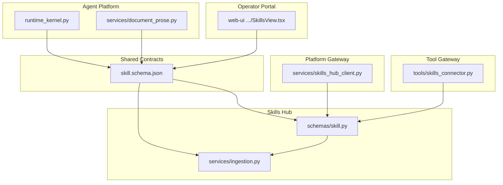
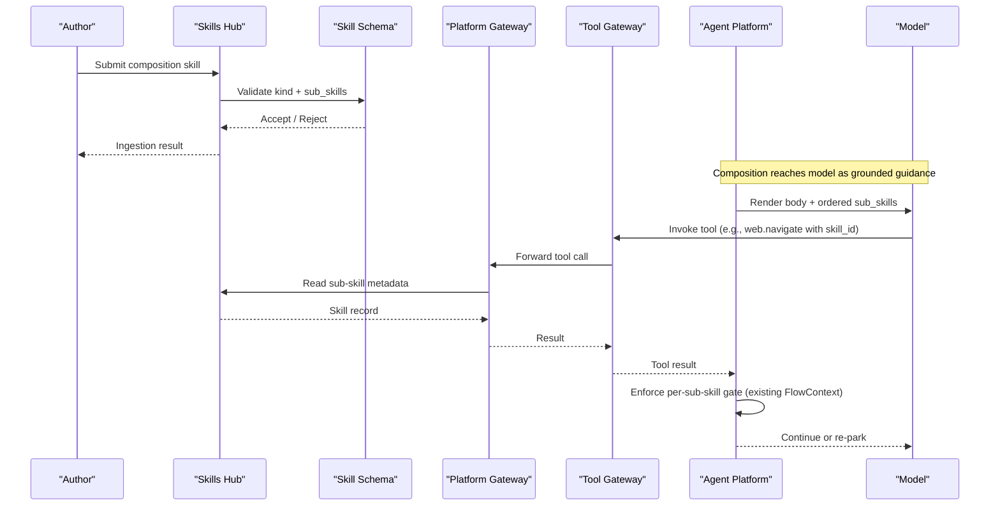
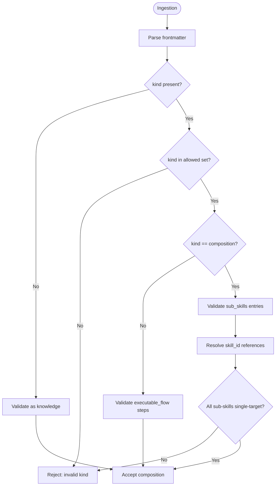
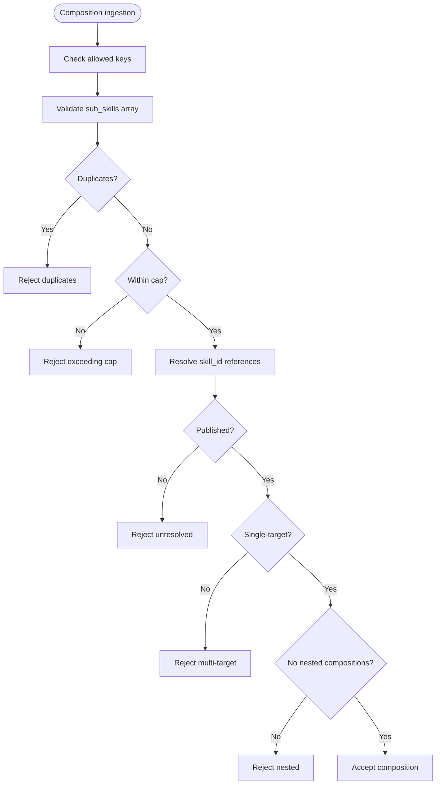
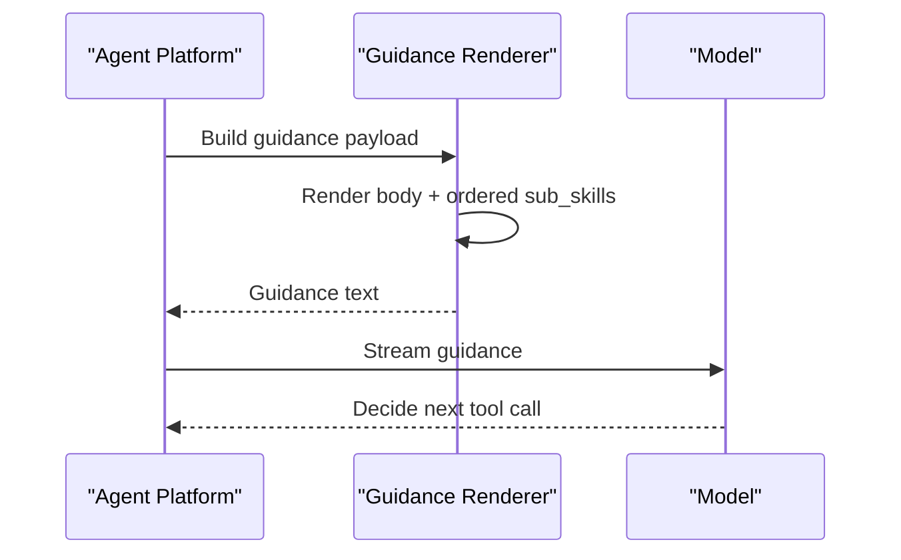
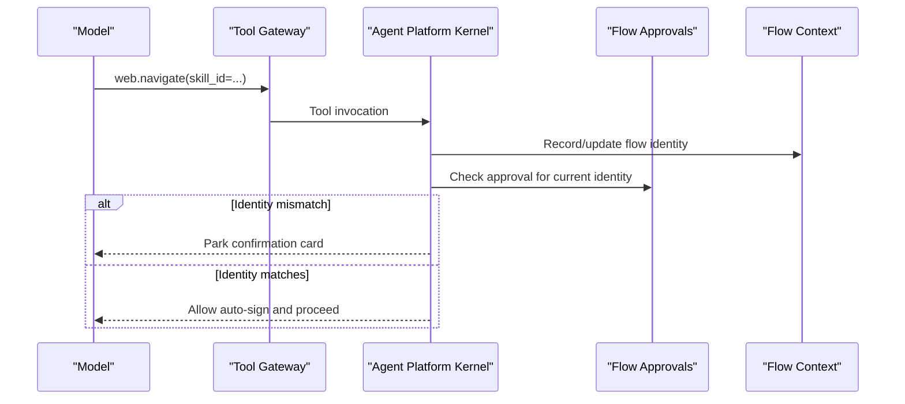
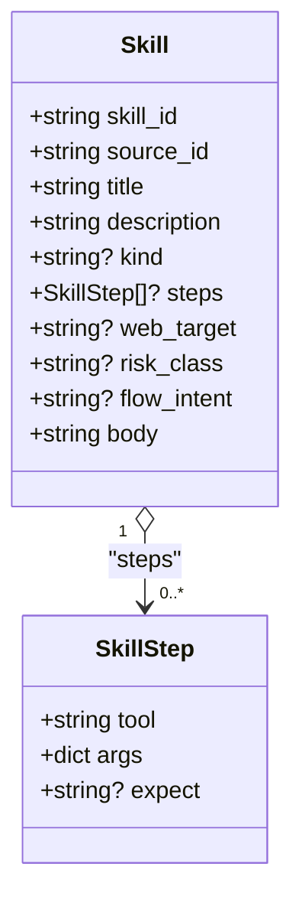
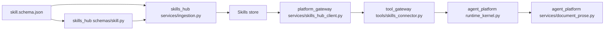

# SPEC-057: Skill Composition Runbooks

<cite>
**Referenced Files in This Document**
- [spec.md](file://docs/specs/SPEC-057-skill-composition-runbooks/spec.md)
- [skill.schema.json](file://shared/shared-contracts/schemas/skill.schema.json)
- [skill.py](file://products/skills-hub/src/skills_hub/schemas/skill.py)
- [ingestion.py](file://products/skills-hub/src/skills_hub/services/ingestion.py)
- [skills_hub_client.py](file://products/platform-gateway/src/platform_gateway/services/skills_hub_client.py)
- [skills_connector.py](file://products/tool-gateway/src/tool_gateway/tools/skills_connector.py)
- [runtime_kernel.py](file://products/agent-platform/src/agent_service/runtime_kernel.py)
- [document_prose.py](file://products/agent-platform/src/agent_service/services/document_prose.py)
- [composition-trust-model-spike.md](file://docs/workspace/composition-trust-model-spike.md)
- [test_browser_connector.py](file://products/tool-gateway/tests/test_browser_connector.py)
- [SkillView.tsx](file://products/operator-portal/web-ui/app/src/views/control/SkillsView.tsx)
</cite>

## Table of Contents
1. [Introduction](#introduction)
2. [Project Structure](#project-structure)
3. [Core Components](#core-components)
4. [Architecture Overview](#architecture-overview)
5. [Detailed Component Analysis](#detailed-component-analysis)
6. [Dependency Analysis](#dependency-analysis)
7. [Performance Considerations](#performance-considerations)
8. [Troubleshooting Guide](#troubleshooting-guide)
9. [Conclusion](#conclusion)

## Introduction
This document specifies and explains the design, implementation boundaries, and operational behavior for SPEC-057: Skill Composition — validated runbooks composed from single-target skills. A composition is a new skill kind that declares an ordered list of sub-skills to guide an operator or model through multi-target remediation without granting any authority to the composite itself. Each referenced sub-skill retains its own gate and blast radius; the platform enforces no control flow and provides no transaction semantics.

The spec extends existing ingestion, grounding, and authorization paths rather than introducing new enforcement machinery. It adds a third `kind` value and one optional `sub_skills` array to the skill contract, validates references at ingestion, renders compositions as grounded guidance, and relies on the existing browser flow identity guard and per-action infra approvals to enforce gates per sub-skill.

**Section sources**
- [spec.md:34-79](file://docs/specs/SPEC-057-skill-composition-runbooks/spec.md#L34-L79)
- [composition-trust-model-spike.md:94-120](file://docs/workspace/composition-trust-model-spike.md#L94-L120)

## Project Structure
SPEC-057 touches several products and shared contracts while keeping most services unchanged:

- Shared contracts define the canonical skill schema and evolve it additively.
- Skills Hub ingests, validates, stores, and serves skills, including validation rules for the new composition kind.
- Platform Gateway proxies skill reads and forwards requests to Skills Hub.
- Tool Gateway exposes tools that can read skills during execution.
- Agent Platform delivers grounded guidance to models and enforces per-sub-skill gating via existing flow identity and approval mechanisms.
- Operator Portal renders skills and will render composition details when implemented.

**Diagram sources**
- [skill.schema.json:1-125](file://shared/shared-contracts/schemas/skill.schema.json#L1-L125)
- [skill.py:1-66](file://products/skills-hub/src/skills_hub/schemas/skill.py#L1-L66)
- [ingestion.py:1-559](file://products/skills-hub/src/skills_hub/services/ingestion.py#L1-L559)
- [skills_hub_client.py:71-99](file://products/platform-gateway/src/platform_gateway/services/skills_hub_client.py#L71-L99)
- [skills_connector.py:287-314](file://products/tool-gateway/src/tool_gateway/tools/skills_connector.py#L287-L314)
- [runtime_kernel.py:1542-1857](file://products/agent-platform/src/agent_service/runtime_kernel.py#L1542-L1857)
- [document_prose.py:1-198](file://products/agent-platform/src/agent_service/services/document_prose.py#L1-L198)
- [SkillView.tsx:46-119](file://products/operator-portal/web-ui/app/src/views/control/SkillsView.tsx#L46-L119)

**Section sources**
- [skill.schema.json:1-125](file://shared/shared-contracts/schemas/skill.schema.json#L1-L125)
- [skill.py:1-66](file://products/skills-hub/src/skills_hub/schemas/skill.py#L1-L66)
- [ingestion.py:1-559](file://products/skills-hub/src/skills_hub/services/ingestion.py#L1-L559)
- [skills_hub_client.py:71-99](file://products/platform-gateway/src/platform_gateway/services/skills_hub_client.py#L71-L99)
- [skills_connector.py:287-314](file://products/tool-gateway/src/tool_gateway/tools/skills_connector.py#L287-L314)
- [runtime_kernel.py:1542-1857](file://products/agent-platform/src/agent_service/runtime_kernel.py#L1542-L1857)
- [document_prose.py:1-198](file://products/agent-platform/src/agent_service/services/document_prose.py#L1-L198)
- [SkillView.tsx:46-119](file://products/operator-portal/web-ui/app/src/views/control/SkillsView.tsx#L46-L119)

## Core Components
- Composition skill kind: Adds a third `kind` value and an optional `sub_skills` array to the skill contract. The array holds ordered references to single-target skills with display-only notes.
- Ingestion validation: Validates that each referenced sub-skill resolves to a published, single-target skill, rejects nesting, duplicates, and extra keys, and enforces a composite-wide sub-skill cap.
- Grounded guidance delivery: Renders the composition’s body plus an ordered view of sub-skills (title, target, note) into the existing guidance path; order is guidance only, not enforced sequencing.
- Authorization posture: No new policy action or audit event type. Compositions are authored under existing postures and read under existing read permissions.
- Gate semantics: Each sub-skill keeps its own gate. Browser legs re-park on identity change; infra legs park per-action. There is no composite-level gate.
- Transaction semantics: No rollback or compensation. On failure, report which sub-skill failed and stop. Re-entry derives completed prefix from signed receipts within the retention window.

**Section sources**
- [spec.md:85-112](file://docs/specs/SPEC-057-skill-composition-runbooks/spec.md#L85-L112)
- [spec.md:114-157](file://docs/specs/SPEC-057-skill-composition-runbooks/spec.md#L114-L157)
- [spec.md:158-214](file://docs/specs/SPEC-057-skill-composition-runbooks/spec.md#L158-L214)
- [spec.md:216-239](file://docs/specs/SPEC-057-skill-composition-runbooks/spec.md#L216-L239)
- [spec.md:246-280](file://docs/specs/SPEC-057-skill-composition-runbooks/spec.md#L246-L280)

## Architecture Overview
The composition feature rides existing surfaces:

- Schema evolution: The canonical skill schema gains a new `kind` enum value and an optional `sub_skills` property. All mirrors must stay in lockstep.
- Ingestion pipeline: Skills Hub parses frontmatter, validates against the schema and additional composition rules, and rejects invalid compositions before publication.
- Guidance rendering: Agent Platform composes grounded guidance by combining the composition’s body with a rendered list of sub-skills in declared order.
- Execution and gating: When the model navigates to a sub-skill, existing flow identity and approval logic apply per sub-skill. Infra actions continue to park per-action.
- Observability: No new audit event types; existing events carry outcomes.

**Diagram sources**
- [skill.schema.json:1-125](file://shared/shared-contracts/schemas/skill.schema.json#L1-L125)
- [ingestion.py:149-460](file://products/skills-hub/src/skills_hub/services/ingestion.py#L149-L460)
- [skills_hub_client.py:71-99](file://products/platform-gateway/src/platform_gateway/services/skills_hub_client.py#L71-L99)
- [skills_connector.py:287-314](file://products/tool-gateway/src/tool_gateway/tools/skills_connector.py#L287-L314)
- [runtime_kernel.py:1542-1857](file://products/agent-platform/src/agent_service/runtime_kernel.py#L1542-L1857)

## Detailed Component Analysis

### Composition Contract and Schema
- The canonical schema defines the skill envelope and currently enumerates `knowledge` and `executable_flow`. SPEC-057 proposes extending `kind` to include `composition` and adding an optional `sub_skills` array.
- Because the schema sets `additionalProperties: False`, any addition requires coordinated changes across all mirrors: the shared schema, Python model, ingestion validation, and portal types.
- A v2 consumer ignoring `kind` and `sub_skills` still treats the skill as knowledge guidance, preserving backward compatibility.

**Diagram sources**
- [skill.schema.json:1-125](file://shared/shared-contracts/schemas/skill.schema.json#L1-L125)
- [skill.py:1-66](file://products/skills-hub/src/skills_hub/schemas/skill.py#L1-L66)
- [ingestion.py:149-460](file://products/skills-hub/src/skills_hub/services/ingestion.py#L149-L460)

**Section sources**
- [skill.schema.json:1-125](file://shared/shared-contracts/schemas/skill.schema.json#L1-L125)
- [skill.py:1-66](file://products/skills-hub/src/skills_hub/schemas/skill.py#L1-L66)
- [ingestion.py:149-460](file://products/skills-hub/src/skills_hub/services/ingestion.py#L149-L460)
- [spec.md:85-112](file://docs/specs/SPEC-057-skill-composition-runbooks/spec.md#L85-L112)

### Ingestion Validation Rules
- Reject unknown keys and enforce caps on titles, descriptions, tags, versions, URLs, and bodies.
- For executable flows, validate step lists, JSON compatibility, and required declarations.
- For compositions (per SPEC-057), validate:
  - Each `sub_skills[].skill_id` resolves to a published, single-target skill.
  - No nested compositions in Phase 1.
  - No duplicate sub-skills.
  - No `web_target` or `steps` on the composition itself.
  - Composite-wide sub-skill count bounded by configuration.

**Diagram sources**
- [ingestion.py:149-460](file://products/skills-hub/src/skills_hub/services/ingestion.py#L149-L460)
- [spec.md:114-157](file://docs/specs/SPEC-057-skill-composition-runbooks/spec.md#L114-L157)

**Section sources**
- [ingestion.py:149-460](file://products/skills-hub/src/skills_hub/services/ingestion.py#L149-L460)
- [spec.md:114-157](file://docs/specs/SPEC-057-skill-composition-runbooks/spec.md#L114-L157)

### Grounded Guidance Delivery
- A composition reaches the model through the existing grounded guidance path: its body plus a rendered view of `sub_skills` in declared order, each with its note and sub-skill title/target.
- The platform never pre-binds a sub-skill or enforces order; order is guidance with the same standing as other non-binding hints.
- Rendering names each sub-skill’s declared target so transcripts remain interpretable.

**Diagram sources**
- [document_prose.py:1-198](file://products/agent-platform/src/agent_service/services/document_prose.py#L1-L198)
- [spec.md:202-214](file://docs/specs/SPEC-057-skill-composition-runbooks/spec.md#L202-L214)

**Section sources**
- [document_prose.py:1-198](file://products/agent-platform/src/agent_service/services/document_prose.py#L1-L198)
- [spec.md:202-214](file://docs/specs/SPEC-057-skill-composition-runbooks/spec.md#L202-L214)

### Authorization and Gating Per Sub-Skill
- A composition carries no authority; each sub-skill keeps its own gate.
- Browser legs: binding a sub-skill updates session-scoped flow identity; if identity no longer matches recorded approvals, the next write-tier call re-parks.
- Infra legs: park per-action under existing per-action approval semantics.
- Gate count equals distinct assessable decisions encountered; there is no composite-level card.

**Diagram sources**
- [runtime_kernel.py:1542-1857](file://products/agent-platform/src/agent_service/runtime_kernel.py#L1542-L1857)
- [test_browser_connector.py:1166-1288](file://products/tool-gateway/tests/test_browser_connector.py#L1166-L1288)
- [spec.md:158-184](file://docs/specs/SPEC-057-skill-composition-runbooks/spec.md#L158-L184)

**Section sources**
- [runtime_kernel.py:1542-1857](file://products/agent-platform/src/agent_service/runtime_kernel.py#L1542-L1857)
- [test_browser_connector.py:1166-1288](file://products/tool-gateway/tests/test_browser_connector.py#L1166-L1288)
- [spec.md:158-184](file://docs/specs/SPEC-057-skill-composition-runbooks/spec.md#L158-L184)

### Studio and Portal Integration
- Authoring home is Studio; compositions are development artifacts created in development sessions.
- The portal Skills viewer will render `sub_skills` as an ordered list with title, target, and note, following the rendered/raw pattern already used for skills.
- Existing skill listing and detail views provide the foundation for composition rendering.

**Diagram sources**
- [skill.py:1-66](file://products/skills-hub/src/skills_hub/schemas/skill.py#L1-L66)
- [SkillView.tsx:46-119](file://products/operator-portal/web-ui/app/src/views/control/SkillsView.tsx#L46-L119)

**Section sources**
- [SkillView.tsx:46-119](file://products/operator-portal/web-ui/app/src/views/control/SkillsView.tsx#L46-L119)
- [spec.md:216-233](file://docs/specs/SPEC-057-skill-composition-runbooks/spec.md#L216-L233)

## Dependency Analysis
- Schema dependency: All product mirrors depend on the canonical skill schema; changes propagate through validation and serialization layers.
- Ingestion dependency: Skills Hub ingestion depends on schema and internal validators; composition validation builds on existing frontmatter and step validation.
- Runtime dependency: Agent Platform relies on existing flow identity and approval mechanisms; no new trust state is introduced.
- Tool integration: Tool Gateway reads skills via existing connectors; composition fields do not alter tool behavior beyond guidance.

**Diagram sources**
- [skill.schema.json:1-125](file://shared/shared-contracts/schemas/skill.schema.json#L1-L125)
- [skill.py:1-66](file://products/skills-hub/src/skills_hub/schemas/skill.py#L1-L66)
- [ingestion.py:1-559](file://products/skills-hub/src/skills_hub/services/ingestion.py#L1-L559)
- [skills_hub_client.py:71-99](file://products/platform-gateway/src/platform_gateway/services/skills_hub_client.py#L71-L99)
- [skills_connector.py:287-314](file://products/tool-gateway/src/tool_gateway/tools/skills_connector.py#L287-L314)
- [runtime_kernel.py:1542-1857](file://products/agent-platform/src/agent_service/runtime_kernel.py#L1542-L1857)
- [document_prose.py:1-198](file://products/agent-platform/src/agent_service/services/document_prose.py#L1-L198)

**Section sources**
- [skill.schema.json:1-125](file://shared/shared-contracts/schemas/skill.schema.json#L1-L125)
- [ingestion.py:1-559](file://products/skills-hub/src/skills_hub/services/ingestion.py#L1-L559)
- [skills_hub_client.py:71-99](file://products/platform-gateway/src/platform_gateway/services/skills_hub_client.py#L71-L99)
- [skills_connector.py:287-314](file://products/tool-gateway/src/tool_gateway/tools/skills_connector.py#L287-L314)
- [runtime_kernel.py:1542-1857](file://products/agent-platform/src/agent_service/runtime_kernel.py#L1542-L1857)
- [document_prose.py:1-198](file://products/agent-platform/src/agent_service/services/document_prose.py#L1-L198)

## Performance Considerations
- Ingestion cost scales with number of sub-skills due to reference resolution and validation; keep composition size within configured bounds.
- Guidance rendering includes sub-skill metadata; avoid excessively large bodies or deep lists to keep payloads manageable.
- Execution remains per-sub-skill; no composite interpreter means no additional runtime overhead beyond normal tool invocations.
- Receipt-based re-entry depends on retention windows; plan operator workflows accordingly.

[No sources needed since this section provides general guidance]

## Troubleshooting Guide
Common issues and where to look:

- Ingestion rejection:
  - Unknown keys or invalid values in frontmatter.
  - Invalid or missing `kind`, `steps`, or `sub_skills`.
  - Duplicate or unresolvable sub-skill references.
  - Exceeding sub-skill cap.
  - Inspect ingestion logs and rejection reasons returned by Skills Hub.

- Gating surprises:
  - Unexpected re-parking after navigating between sub-skills indicates identity changed; check flow context and approvals.
  - Infra actions parking per-action is expected; ensure per-action approvals are available.

- Guidance confusion:
  - If order appears ignored, remember order is guidance only; confirm model behavior and transcript context.

- Re-entry limits:
  - Outside receipt retention window, restart from beginning; consult operator documentation for re-entry expectations.

**Section sources**
- [ingestion.py:149-460](file://products/skills-hub/src/skills_hub/services/ingestion.py#L149-L460)
- [runtime_kernel.py:1542-1857](file://products/agent-platform/src/agent_service/runtime_kernel.py#L1542-L1857)
- [spec.md:185-214](file://docs/specs/SPEC-057-skill-composition-runbooks/spec.md#L185-L214)

## Conclusion
SPEC-057 introduces a safe, additive way to author multi-target runbooks using validated compositions of single-target skills. It preserves existing authorization and gating semantics, avoids new trust state, and leverages grounded guidance to inform operators and models. By enforcing strict ingestion validation, limiting scope, and relying on per-sub-skill gates, the platform enables compositional workflows without compromising blast radius or auditability. Future phases may extend authoring ergonomics and trace extraction, but the core trust model remains unchanged.

[No sources needed since this section summarizes without analyzing specific files]