# Technology Stack & Frameworks

<cite>
**Referenced Files in This Document**
- [pyproject.toml](file://products/agent-platform/pyproject.toml)
- [uv.lock](file://products/agent-platform/uv.lock)
- [Dockerfile](file://products/agent-platform/Dockerfile)
- [Makefile](file://products/agent-platform/Makefile)
- [image.mk](file://mk/image.mk)
- [python.mk](file://mk/python.mk)
- [main.py](file://products/agent-platform/src/agent_service/main.py)
- [app.py](file://products/agent-platform/src/agent_service/app.py)
- [config.py](file://products/agent-platform/src/agent_service/core/config.py)
- [metrics.py](file://products/agent-platform/src/agent_service/core/metrics.py)
- [observability.py](file://products/agent-platform/src/agent_service/core/observability.py)
- [session_store.py](file://products/agent-platform/src/agent_service/services/session_store.py)
- [runtime_kernel.py](file://products/agent-platform/src/agent_service/runtime_kernel.py)
- [openai.py](file://products/agent-platform/src/agent_service/providers/openai.py)
- [dashscope.py](file://products/agent-platform/src/agent_service/providers/dashscope.py)
- [deepseek.py](file://products/agent-platform/src/agent_service/providers/deepseek.py)
- [registry.py](file://products/agent-platform/src/agent_service/providers/registry.py)
- [auth.py](file://products/tool-gateway/src/api_gateway/api/routes/auth.py)
- [token_verifier.py](file://products/tool-gateway/src/api_gateway/services/token_verifier.py)
- [gateway_service.py](file://products/tool-gateway/src/api_gateway/services/gateway_service.py)
- [policy_engine.py](file://products/tool-gateway/src/api_gateway/services/policy_engine.py)
- [k8s_connector.py](file://products/tool-gateway/src/api_gateway/tools/k8s_connector.py)
- [redis-deployment.yaml](file://shared/platform-ops/gitops/dev-k8s/base/infra/redis-deployment.yaml)
- [redis-service.yaml](file://shared/platform-ops/gitops/dev-k8s/base/infra/redis-service.yaml)
- [agent-service-deployment.yaml](file://shared/platform-ops/gitops/dev-k8s/base/agent-platform/agent-service-deployment.yaml)
- [api-gateway-deployment.yaml](file://shared/platform-ops/gitops/dev-k8s/base/tool-gateway/api-gateway-deployment.yaml)
- [identity-service-deployment.yaml](file://shared/platform-ops/gitops/dev-k8s/base/identity-broker/identity-service-deployment.yaml)
- [web-ui-deployment.yaml](file://shared/platform-ops/gitops/dev-k8s/base/operator-portal/web-ui-deployment.yaml)
- [kustomization.yaml](file://shared/platform-ops/gitops/dev-k8s/base/kustomization.yaml)
- [deploy-overlay.sh](file://shared/platform-ops/gitops/deploy-overlay.sh)
- [select-runtime-profile.sh](file://shared/platform-ops/gitops/select-runtime-profile.sh)
- [sync-runtime-secret.sh](file://shared/platform-ops/gitops/sync-runtime-secret.sh)
- [verify-runtime-profile.sh](file://shared/platform-ops/gitops/verify-runtime-profile.sh)
- [README.md](file://README.md)
</cite>

## Table of Contents
1. [Introduction](#introduction)
2. [Project Structure](#project-structure)
3. [Core Components](#core-components)
4. [Architecture Overview](#architecture-overview)
5. [Detailed Component Analysis](#detailed-component-analysis)
6. [Dependency Analysis](#dependency-analysis)
7. [Performance Considerations](#performance-considerations)
8. [Troubleshooting Guide](#troubleshooting-guide)
9. [Conclusion](#conclusion)
10. [Appendices](#appendices)

## Introduction
This document describes the complete technology stack powering the Luban AIOps Platform. It covers core frameworks (FastAPI, Pydantic), session storage (Redis), orchestration (Kubernetes), authentication (JWT), observability (Prometheus), and AI provider integrations (OpenAI SDK). It also details containerization with Docker, build tooling via Makefile and uv, and CI/CD practices using GitOps overlays and shell utilities. Version compatibility matrices, dependency management strategies, and upgrade procedures are provided for each component to guide safe operations and upgrades.

## Project Structure
The platform is organized as a multi-product repository:
- Agent Platform: FastAPI-based runtime service with providers, sessions, and observability.
- Tool Gateway: API gateway enforcing policies, verifying tokens, and orchestrating tool invocations.
- Identity Broker: Authentication and identity services.
- Operator Portal: Web UI served by Nginx.
- Shared resources: GitOps Kubernetes manifests, schemas, and contracts.

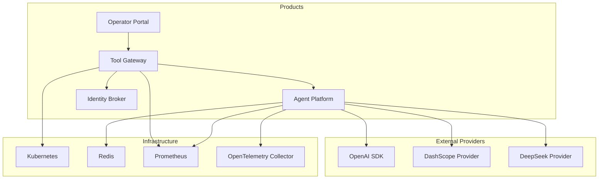

**Diagram sources**
- [agent-service-deployment.yaml](file://shared/platform-ops/gitops/dev-k8s/base/agent-platform/agent-service-deployment.yaml)
- [api-gateway-deployment.yaml](file://shared/platform-ops/gitops/dev-k8s/base/tool-gateway/api-gateway-deployment.yaml)
- [identity-service-deployment.yaml](file://shared/platform-ops/gitops/dev-k8s/base/identity-broker/identity-service-deployment.yaml)
- [redis-deployment.yaml](file://shared/platform-ops/gitops/dev-k8s/base/infra/redis-deployment.yaml)
- [redis-service.yaml](file://shared/platform-ops/gitops/dev-k8s/base/infra/redis-service.yaml)

**Section sources**
- [README.md](file://README.md)

## Core Components
- Web Services: FastAPI applications for Agent Platform and Tool Gateway.
- Data Validation: Pydantic models for request/response schemas across services.
- Session Storage: Redis-backed session store for durable state.
- Orchestration: Kubernetes deployments and services managed via Kustomize overlays.
- Authentication: JWT-based token verification and identity flows.
- Observability: Prometheus metrics and OpenTelemetry instrumentation.
- AI Providers: Pluggable providers (OpenAI, DashScope, DeepSeek) via a registry.
- Containerization: Docker images built per product.
- Build Tools: Makefile targets and uv for Python dependency resolution and packaging.
- CI/CD: GitOps-driven deployment with overlays and helper scripts.

**Section sources**
- [main.py](file://products/agent-platform/src/agent_service/main.py)
- [app.py](file://products/agent-platform/src/agent_service/app.py)
- [config.py](file://products/agent-platform/src/agent_service/core/config.py)
- [metrics.py](file://products/agent-platform/src/agent_service/core/metrics.py)
- [observability.py](file://products/agent-platform/src/agent_service/core/observability.py)
- [session_store.py](file://products/agent-platform/src/agent_service/services/session_store.py)
- [auth.py](file://products/tool-gateway/src/api_gateway/api/routes/auth.py)
- [token_verifier.py](file://products/tool-gateway/src/api_gateway/services/token_verifier.py)
- [gateway_service.py](file://products/tool-gateway/src/api_gateway/services/gateway_service.py)
- [policy_engine.py](file://products/tool-gateway/src/api_gateway/services/policy_engine.py)
- [k8s_connector.py](file://products/tool-gateway/src/api_gateway/tools/k8s_connector.py)
- [openai.py](file://products/agent-platform/src/agent_service/providers/openai.py)
- [dashscope.py](file://products/agent-platform/src/agent_service/providers/dashscope.py)
- [deepseek.py](file://products/agent-platform/src/agent_service/providers/deepseek.py)
- [registry.py](file://products/agent-platform/src/agent_service/providers/registry.py)
- [Dockerfile](file://products/agent-platform/Dockerfile)
- [Makefile](file://products/agent-platform/Makefile)
- [image.mk](file://mk/image.mk)
- [python.mk](file://mk/python.mk)
- [kustomization.yaml](file://shared/platform-ops/gitops/dev-k8s/base/kustomization.yaml)
- [deploy-overlay.sh](file://shared/platform-ops/gitops/deploy-overlay.sh)
- [select-runtime-profile.sh](file://shared/platform-ops/gitops/select-runtime-profile.sh)
- [sync-runtime-secret.sh](file://shared/platform-ops/gitops/sync-runtime-secret.sh)
- [verify-runtime-profile.sh](file://shared/platform-ops/gitops/verify-runtime-profile.sh)

## Architecture Overview
The platform uses a layered architecture:
- API Gateway enforces policies, verifies tokens, and routes requests to the Agent Platform.
- Agent Platform manages runtime kernels, sessions, and AI provider calls.
- Identity Broker issues and validates tokens.
- Redis provides session persistence.
- Kubernetes orchestrates all components.
- Prometheus collects metrics; OpenTelemetry instruments traces.

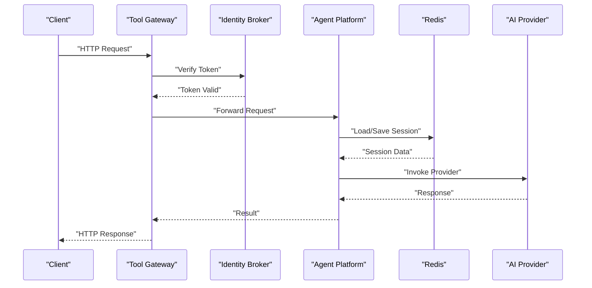

**Diagram sources**
- [auth.py](file://products/tool-gateway/src/api_gateway/api/routes/auth.py)
- [token_verifier.py](file://products/tool-gateway/src/api_gateway/services/token_verifier.py)
- [gateway_service.py](file://products/tool-gateway/src/api_gateway/services/gateway_service.py)
- [session_store.py](file://products/agent-platform/src/agent_service/services/session_store.py)
- [openai.py](file://products/agent-platform/src/agent_service/providers/openai.py)

## Detailed Component Analysis

### FastAPI Web Services
- Entry points initialize FastAPI apps, configure middleware, and mount routers.
- Metrics and observability are integrated at startup.
- Configuration is loaded from environment variables and validated via Pydantic.

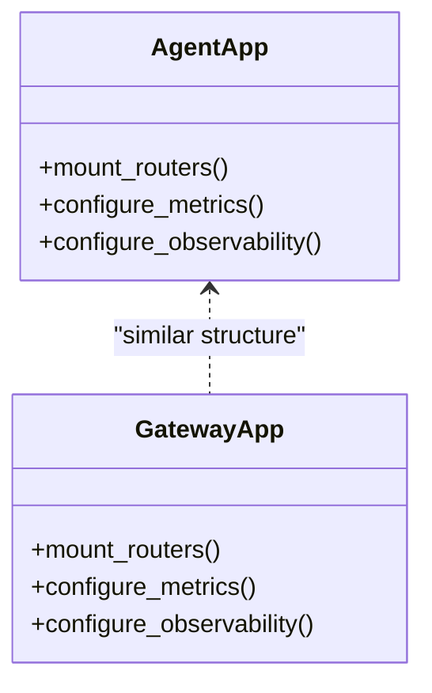

**Diagram sources**
- [main.py](file://products/agent-platform/src/agent_service/main.py)
- [app.py](file://products/agent-platform/src/agent_service/app.py)

**Section sources**
- [main.py](file://products/agent-platform/src/agent_service/main.py)
- [app.py](file://products/agent-platform/src/agent_service/app.py)

### Pydantic Data Validation
- Schemas define request/response models for APIs.
- Centralized validation ensures contract compliance across services.

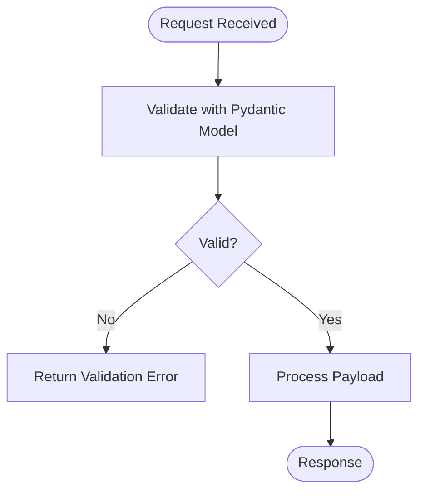

**Diagram sources**
- [config.py](file://products/agent-platform/src/agent_service/core/config.py)

**Section sources**
- [config.py](file://products/agent-platform/src/agent_service/core/config.py)

### Redis Session Storage
- Sessions are persisted in Redis for durability and scalability.
- Service layer abstracts session CRUD operations.

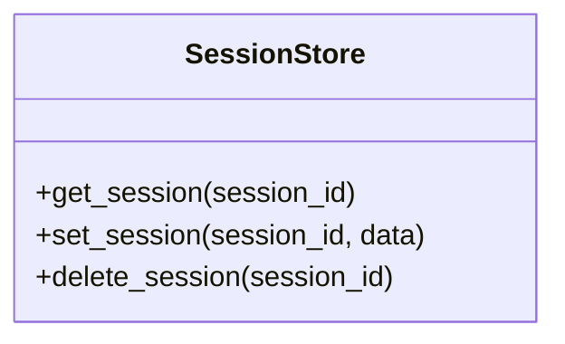

**Diagram sources**
- [session_store.py](file://products/agent-platform/src/agent_service/services/session_store.py)

**Section sources**
- [session_store.py](file://products/agent-platform/src/agent_service/services/session_store.py)

### Kubernetes Orchestration
- Deployments and services are defined under GitOps base overlays.
- Kustomization ties together namespaces, configmaps, and secrets.

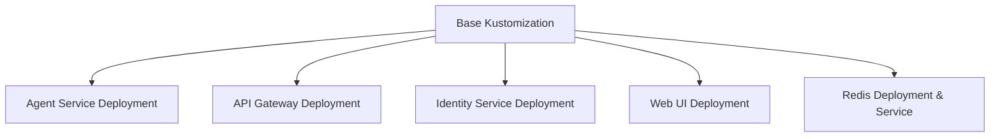

**Diagram sources**
- [kustomization.yaml](file://shared/platform-ops/gitops/dev-k8s/base/kustomization.yaml)
- [agent-service-deployment.yaml](file://shared/platform-ops/gitops/dev-k8s/base/agent-platform/agent-service-deployment.yaml)
- [api-gateway-deployment.yaml](file://shared/platform-ops/gitops/dev-k8s/base/tool-gateway/api-gateway-deployment.yaml)
- [identity-service-deployment.yaml](file://shared/platform-ops/gitops/dev-k8s/base/identity-broker/identity-service-deployment.yaml)
- [web-ui-deployment.yaml](file://shared/platform-ops/gitops/dev-k8s/base/operator-portal/web-ui-deployment.yaml)
- [redis-deployment.yaml](file://shared/platform-ops/gitops/dev-k8s/base/infra/redis-deployment.yaml)
- [redis-service.yaml](file://shared/platform-ops/gitops/dev-k8s/base/infra/redis-service.yaml)

**Section sources**
- [kustomization.yaml](file://shared/platform-ops/gitops/dev-k8s/base/kustomization.yaml)
- [agent-service-deployment.yaml](file://shared/platform-ops/gitops/dev-k8s/base/agent-platform/agent-service-deployment.yaml)
- [api-gateway-deployment.yaml](file://shared/platform-ops/gitops/dev-k8s/base/tool-gateway/api-gateway-deployment.yaml)
- [identity-service-deployment.yaml](file://shared/platform-ops/gitops/dev-k8s/base/identity-broker/identity-service-deployment.yaml)
- [web-ui-deployment.yaml](file://shared/platform-ops/gitops/dev-k8s/base/operator-portal/web-ui-deployment.yaml)
- [redis-deployment.yaml](file://shared/platform-ops/gitops/dev-k8s/base/infra/redis-deployment.yaml)
- [redis-service.yaml](file://shared/platform-ops/gitops/dev-k8s/base/infra/redis-service.yaml)

### JWT Authentication
- Token verification occurs in the gateway before forwarding requests.
- Identity broker handles issuance and validation endpoints.

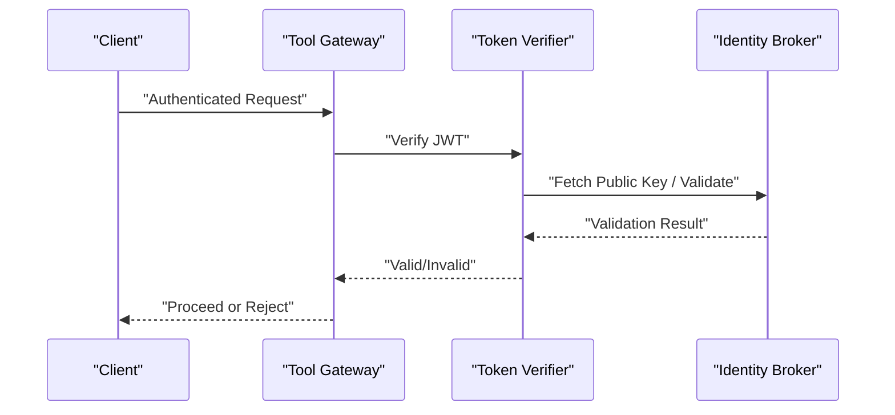

**Diagram sources**
- [auth.py](file://products/tool-gateway/src/api_gateway/api/routes/auth.py)
- [token_verifier.py](file://products/tool-gateway/src/api_gateway/services/token_verifier.py)

**Section sources**
- [auth.py](file://products/tool-gateway/src/api_gateway/api/routes/auth.py)
- [token_verifier.py](file://products/tool-gateway/src/api_gateway/services/token_verifier.py)

### Prometheus Metrics and Observability
- Metrics endpoints expose counters, histograms, and gauges.
- OpenTelemetry instrumentation enables tracing and logging correlation.

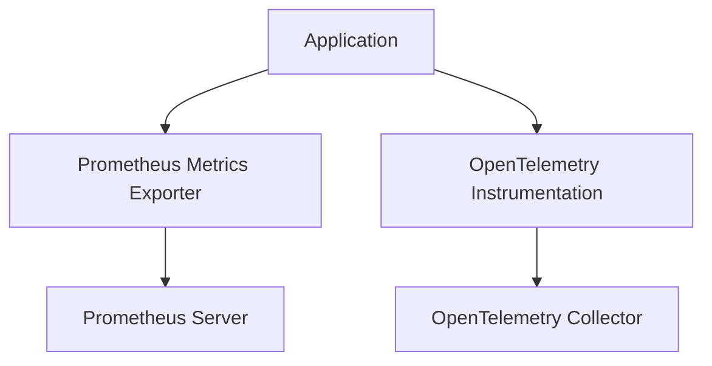

**Diagram sources**
- [metrics.py](file://products/agent-platform/src/agent_service/core/metrics.py)
- [observability.py](file://products/agent-platform/src/agent_service/core/observability.py)

**Section sources**
- [metrics.py](file://products/agent-platform/src/agent_service/core/metrics.py)
- [observability.py](file://products/agent-platform/src/agent_service/core/observability.py)

### AI Provider Integration
- Providers implement a common interface and are registered dynamically.
- OpenAI SDK integrates with external LLM endpoints.

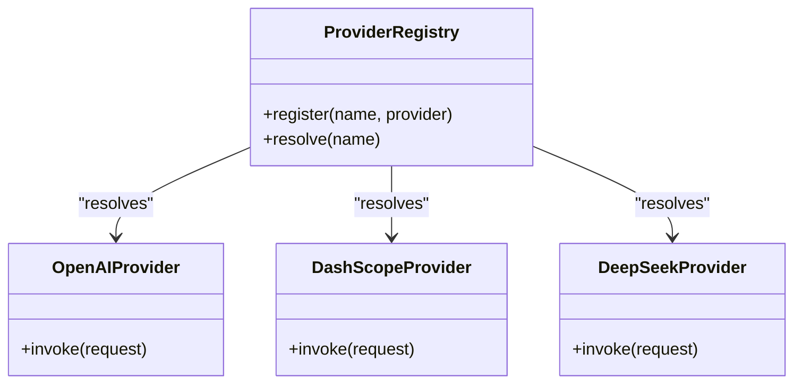

**Diagram sources**
- [registry.py](file://products/agent-platform/src/agent_service/providers/registry.py)
- [openai.py](file://products/agent-platform/src/agent_service/providers/openai.py)
- [dashscope.py](file://products/agent-platform/src/agent_service/providers/dashscope.py)
- [deepseek.py](file://products/agent-platform/src/agent_service/providers/deepseek.py)

**Section sources**
- [registry.py](file://products/agent-platform/src/agent_service/providers/registry.py)
- [openai.py](file://products/agent-platform/src/agent_service/providers/openai.py)
- [dashscope.py](file://products/agent-platform/src/agent_service/providers/dashscope.py)
- [deepseek.py](file://products/agent-platform/src/agent_service/providers/deepseek.py)

### Containerization Strategy
- Each product has a Dockerfile defining its runtime image.
- Multi-stage builds optimize image size and security posture.

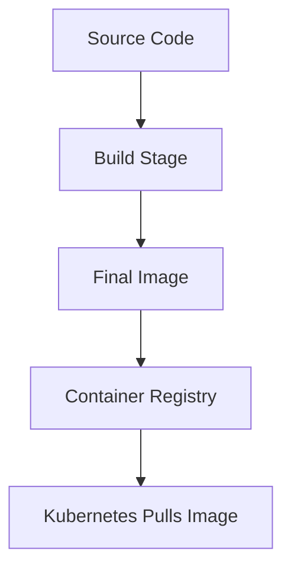

**Diagram sources**
- [Dockerfile](file://products/agent-platform/Dockerfile)

**Section sources**
- [Dockerfile](file://products/agent-platform/Dockerfile)

### Build Tools: Makefile and uv
- Makefile centralizes build, test, and deploy targets.
- uv manages Python dependencies and lockfiles for reproducibility.

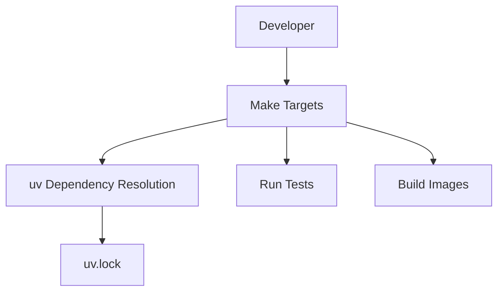

**Diagram sources**
- [Makefile](file://products/agent-platform/Makefile)
- [python.mk](file://mk/python.mk)
- [image.mk](file://mk/image.mk)
- [pyproject.toml](file://products/agent-platform/pyproject.toml)
- [uv.lock](file://products/agent-platform/uv.lock)

**Section sources**
- [Makefile](file://products/agent-platform/Makefile)
- [python.mk](file://mk/python.mk)
- [image.mk](file://mk/image.mk)
- [pyproject.toml](file://products/agent-platform/pyproject.toml)
- [uv.lock](file://products/agent-platform/uv.lock)

### CI/CD Pipeline Technologies
- GitOps overlays manage environment-specific configurations.
- Helper scripts select runtime profiles, sync secrets, and verify configurations.

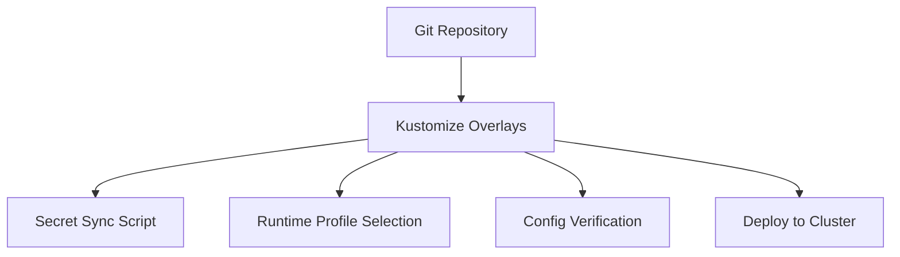

**Diagram sources**
- [kustomization.yaml](file://shared/platform-ops/gitops/dev-k8s/base/kustomization.yaml)
- [deploy-overlay.sh](file://shared/platform-ops/gitops/deploy-overlay.sh)
- [select-runtime-profile.sh](file://shared/platform-ops/gitops/select-runtime-profile.sh)
- [sync-runtime-secret.sh](file://shared/platform-ops/gitops/sync-runtime-secret.sh)
- [verify-runtime-profile.sh](file://shared/platform-ops/gitops/verify-runtime-profile.sh)

**Section sources**
- [kustomization.yaml](file://shared/platform-ops/gitops/dev-k8s/base/kustomization.yaml)
- [deploy-overlay.sh](file://shared/platform-ops/gitops/deploy-overlay.sh)
- [select-runtime-profile.sh](file://shared/platform-ops/gitops/select-runtime-profile.sh)
- [sync-runtime-secret.sh](file://shared/platform-ops/gitops/sync-runtime-secret.sh)
- [verify-runtime-profile.sh](file://shared/platform-ops/gitops/verify-runtime-profile.sh)

## Dependency Analysis
- FastAPI depends on Pydantic for schema validation and middleware support.
- Redis client libraries integrate with session stores.
- Prometheus client exposes metrics endpoints.
- OpenAI SDK communicates with external AI services.
- Kubernetes connector interacts with cluster APIs.

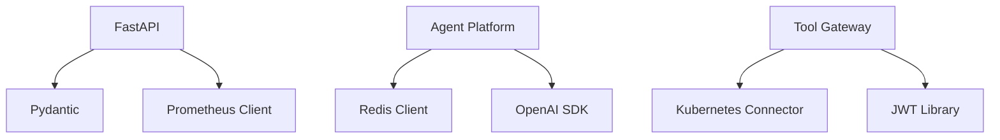

**Diagram sources**
- [pyproject.toml](file://products/agent-platform/pyproject.toml)
- [uv.lock](file://products/agent-platform/uv.lock)
- [metrics.py](file://products/agent-platform/src/agent_service/core/metrics.py)
- [session_store.py](file://products/agent-platform/src/agent_service/services/session_store.py)
- [openai.py](file://products/agent-platform/src/agent_service/providers/openai.py)
- [k8s_connector.py](file://products/tool-gateway/src/api_gateway/tools/k8s_connector.py)
- [token_verifier.py](file://products/tool-gateway/src/api_gateway/services/token_verifier.py)

**Section sources**
- [pyproject.toml](file://products/agent-platform/pyproject.toml)
- [uv.lock](file://products/agent-platform/uv.lock)
- [metrics.py](file://products/agent-platform/src/agent_service/core/metrics.py)
- [session_store.py](file://products/agent-platform/src/agent_service/services/session_store.py)
- [openai.py](file://products/agent-platform/src/agent_service/providers/openai.py)
- [k8s_connector.py](file://products/tool-gateway/src/api_gateway/tools/k8s_connector.py)
- [token_verifier.py](file://products/tool-gateway/src/api_gateway/services/token_verifier.py)

## Performance Considerations
- Use connection pooling for Redis and HTTP clients to reduce latency.
- Enable response streaming for long-running AI provider calls.
- Configure Prometheus scrape intervals appropriately to balance granularity and overhead.
- Optimize Docker images by minimizing layers and removing unnecessary dependencies.
- Scale horizontally via Kubernetes replicas based on CPU/memory metrics.

[No sources needed since this section provides general guidance]

## Troubleshooting Guide
- Authentication failures: Inspect token verification logs and identity broker connectivity.
- Session errors: Check Redis availability and network policies.
- Provider timeouts: Validate API keys and endpoint reachability.
- Metrics missing: Ensure Prometheus scraping configuration and exporter endpoints are exposed.
- Deployment issues: Review Kustomize overlays and secret synchronization scripts.

**Section sources**
- [token_verifier.py](file://products/tool-gateway/src/api_gateway/services/token_verifier.py)
- [session_store.py](file://products/agent-platform/src/agent_service/services/session_store.py)
- [openai.py](file://products/agent-platform/src/agent_service/providers/openai.py)
- [metrics.py](file://products/agent-platform/src/agent_service/core/metrics.py)
- [sync-runtime-secret.sh](file://shared/platform-ops/gitops/sync-runtime-secret.sh)

## Conclusion
The Luban AIOps Platform leverages modern Python web frameworks, robust data validation, scalable session storage, and cloud-native orchestration. Its modular design supports multiple AI providers, strong authentication, comprehensive observability, and reproducible builds. The GitOps approach ensures consistent deployments across environments, while clear upgrade procedures maintain stability during evolution.

[No sources needed since this section summarizes without analyzing specific files]

## Appendices

### Version Compatibility Matrix
- FastAPI: Compatible with Python 3.x versions specified in pyproject.toml.
- Pydantic: Aligns with FastAPI requirements; pin versions via uv.lock.
- Redis: Use supported major version aligned with client library.
- Kubernetes: Match cluster version with connector capabilities.
- Prometheus: Use stable client versions compatible with exporters.
- OpenAI SDK: Follow provider’s recommended SDK version.

**Section sources**
- [pyproject.toml](file://products/agent-platform/pyproject.toml)
- [uv.lock](file://products/agent-platform/uv.lock)

### Dependency Management Strategy
- Use uv for deterministic builds and lockfiles.
- Pin critical dependencies in pyproject.toml and validate with uv.lock.
- Regularly update dependencies and run tests to ensure compatibility.

**Section sources**
- [pyproject.toml](file://products/agent-platform/pyproject.toml)
- [uv.lock](file://products/agent-platform/uv.lock)

### Upgrade Procedures
- Update dependencies via uv and regenerate lockfile.
- Run unit and integration tests to validate changes.
- Rebuild Docker images and push to registry.
- Apply updated Kustomize overlays and verify deployments.
- Monitor metrics and logs post-upgrade for anomalies.

**Section sources**
- [Makefile](file://products/agent-platform/Makefile)
- [python.mk](file://mk/python.mk)
- [image.mk](file://mk/image.mk)
- [deploy-overlay.sh](file://shared/platform-ops/gitops/deploy-overlay.sh)
- [verify-runtime-profile.sh](file://shared/platform-ops/gitops/verify-runtime-profile.sh)