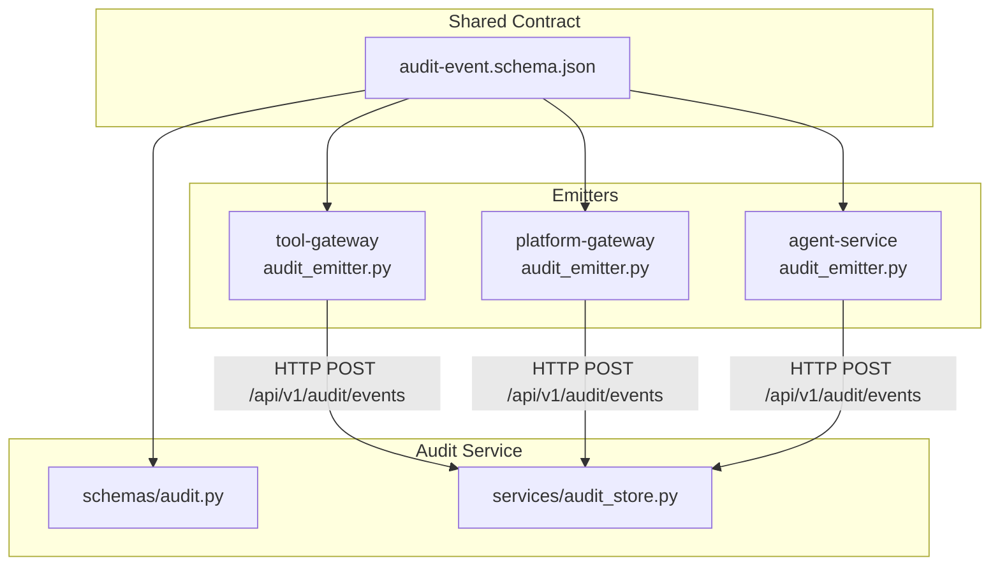
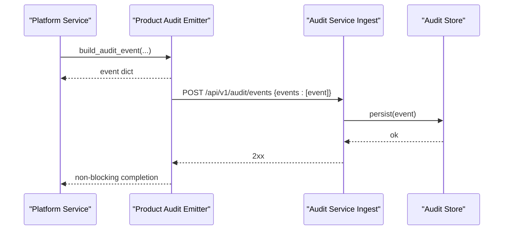
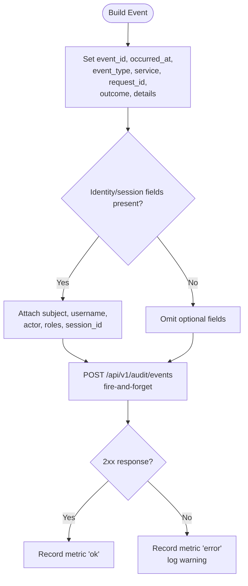
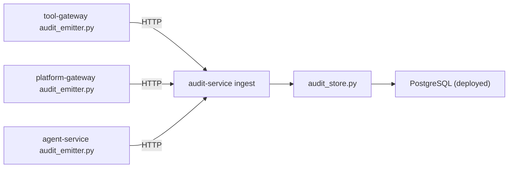

# Audit Event Model

<cite>
**Referenced Files in This Document**
- [audit-event.schema.json](file://shared/shared-contracts/schemas/audit-event.schema.json)
- [audit.py](file://products/audit-service/src/audit_service/schemas/audit.py)
- [audit_store.py](file://products/audit-service/src/audit_service/services/audit_store.py)
- [SPEC-013 spec.md](file://docs/specs/SPEC-013-durable-audit-trail/spec.md)
- [SPEC-037 spec.md](file://docs/specs/SPEC-037-signed-execution-requests/spec.md)
- [tool-gateway audit_emitter.py](file://products/tool-gateway/src/tool_gateway/services/audit_emitter.py)
- [platform-gateway audit_emitter.py](file://products/platform-gateway/src/platform_gateway/services/audit_emitter.py)
- [agent-service audit_emitter.py](file://products/agent-platform/src/agent_service/services/audit_emitter.py)
- [test_chat_confirm.py](file://products/platform-gateway/tests/test_chat_confirm.py)
- [runtime_kernel.py](file://products/agent-platform/src/agent_service/runtime_kernel.py)
</cite>

## Table of Contents
1. [Introduction](#introduction)
2. [Project Structure](#project-structure)
3. [Core Components](#core-components)
4. [Architecture Overview](#architecture-overview)
5. [Detailed Component Analysis](#detailed-component-analysis)
6. [Dependency Analysis](#dependency-analysis)
7. [Performance Considerations](#performance-considerations)
8. [Troubleshooting Guide](#troubleshooting-guide)
9. [Conclusion](#conclusion)

## Introduction
This document defines the platform-wide audit event data model used to record activities for compliance and debugging. The canonical envelope is defined by a shared JSON schema and enforced by Pydantic models in the audit service. Emitter services (tool-gateway, platform-gateway, identity-broker, agent-service, skills-hub, incident-service) create events using a consistent builder, then deliver them asynchronously to the audit service, which persists and exposes them via a query API.

The model supports correlation across sessions, requests, approvals, tool executions, and incidents through well-defined fields and per-event-type details payloads.

## Project Structure
Audit-related code spans three layers:
- Shared contract: the authoritative JSON schema that all emitters and consumers bind to.
- Emitters: one per product, building envelopes and delivering them over HTTP without blocking the user path.
- Audit service: validates, stores, and serves audit events with retention and query filters.



**Diagram sources**
- [audit-event.schema.json:1-94](file://shared/shared-contracts/schemas/audit-event.schema.json#L1-L94)
- [audit.py:1-83](file://products/audit-service/src/audit_service/schemas/audit.py#L1-L83)
- [audit_store.py:263-285](file://products/audit-service/src/audit_service/services/audit_store.py#L263-L285)
- [tool-gateway audit_emitter.py:1-98](file://products/tool-gateway/src/tool_gateway/services/audit_emitter.py#L1-L98)
- [platform-gateway audit_emitter.py:1-99](file://products/platform-gateway/src/platform_gateway/services/audit_emitter.py#L1-L99)
- [agent-service audit_emitter.py:1-99](file://products/agent-platform/src/agent_service/services/audit_emitter.py#L1-L99)

**Section sources**
- [SPEC-013 spec.md:30-73](file://docs/specs/SPEC-013-durable-audit-trail/spec.md#L30-L73)

## Core Components
The audit event envelope has the following fields:

- event_id: Unique identifier minted by the emitter; correlates stored records with structured logs.
- occurred_at: UTC timestamp when the audited action happened (RFC 3339).
- event_type: Closed vocabulary describing the kind of activity. Includes tool_invoked, policy_decision, token_exchange, session_created, session_deleted, chat_started, chat_completed, confirmation_decided, incident_triaged, skill_searched, skill_retrieved, skills_synced, execution_requested, execution_completed, execution_rejected, document_created, document_published, document_read, skill_draft_generated, incident_skill_draft_generated, skill_graduated.
- service: Emitting service name (e.g., tool-gateway, platform-gateway, identity-service).
- request_id: Correlation ID for the originating request.
- subject: Token subject (sub) of the user attributed to the event, when applicable.
- username: Human-readable username, when applicable.
- actor: Delegation actor (act.sub), i.e., the service acting on behalf of the user, when applicable.
- roles: Roles of the attributed identity at event time, when applicable.
- session_id: Agent session identifier, when the event belongs to a session.
- outcome: Result of the audited action; allowed values are allow, deny, success, error.
- details: Per-event-type payload object carrying additional context. Its shape varies by event_type.

Constraints and validation rules:
- Required fields: event_id, occurred_at, event_type, service, request_id, outcome.
- Additional properties are forbidden at the envelope level; only the listed fields may be present.
- event_type must be one of the enumerated values.
- outcome must be one of the enumerated values.
- Optional identity fields (subject, username, actor, roles, session_id) are omitted rather than nulled when absent to keep payloads valid against the schema.
- The audit service enforces these constraints via a Pydantic model configured to forbid extra fields and validate types/enums.

Data types:
- Strings for identifiers and names.
- DateTime for occurred_at.
- Array of strings for roles.
- Object for details.

Relationships to other platform concepts:
- Sessions: Many events carry session_id to group activity within a single agent session.
- Tool executions: tool_invoked events describe tool calls; execution_requested/completed/rejected events correlate approvals to actual tool runs.
- Approvals: confirmation_decided events capture human-in-the-loop decisions and link to tool_names and confirm_id.
- Incidents: incident_triaged and incident_skill_draft_generated events tie actions to incident contexts.

**Section sources**
- [audit-event.schema.json:7-90](file://shared/shared-contracts/schemas/audit-event.schema.json#L7-L90)
- [audit.py:14-58](file://products/audit-service/src/audit_service/schemas/audit.py#L14-L58)
- [audit_store.py:263-285](file://products/audit-service/src/audit_service/services/audit_store.py#L263-L285)

## Architecture Overview
Emission flow:
1. A platform service performs an auditable action.
2. It builds an audit event using its product-specific emitter helper, which sets event_id, occurred_at, service, request_id, outcome, and optional identity/session fields.
3. The emitter delivers the event asynchronously over HTTP to the audit service’s ingest endpoint. Delivery is fire-and-forget with a short timeout; failures do not block or fail the originating request.
4. The audit service validates the envelope against the shared schema and Pydantic model, persists it, and exposes it via a query API.



**Diagram sources**
- [tool-gateway audit_emitter.py:29-98](file://products/tool-gateway/src/tool_gateway/services/audit_emitter.py#L29-L98)
- [platform-gateway audit_emitter.py:30-99](file://products/platform-gateway/src/platform_gateway/services/audit_emitter.py#L30-L99)
- [agent-service audit_emitter.py:30-99](file://products/agent-platform/src/agent_service/services/audit_emitter.py#L30-L99)
- [audit_store.py:263-285](file://products/audit-service/src/audit_service/services/audit_store.py#L263-L285)

**Section sources**
- [SPEC-013 spec.md:52-62](file://docs/specs/SPEC-013-durable-audit-trail/spec.md#L52-L62)

## Detailed Component Analysis

### AuditEvent Schema and Enforcement
- The shared JSON schema defines the canonical envelope, required fields, allowed event_type and outcome values, and forbids additional properties.
- The audit service’s Pydantic model mirrors the schema, adds strict configuration to forbid extra fields, and provides typed enums for event_type and outcome.
- Row mapping from storage to model ensures roles and details are normalized when read back.

```mermaid
classDiagram
class AuditEvent {
+string event_id
+datetime occurred_at
+EventType event_type
+string service
+string request_id
+string subject
+string username
+string actor
+string[] roles
+string session_id
+Outcome outcome
+dict details
}
class EventType {
<<enum>>
"tool_invoked"
"policy_decision"
"token_exchange"
"session_created"
"session_deleted"
"chat_started"
"chat_completed"
"confirmation_decided"
"incident_triaged"
"skill_searched"
"skill_retrieved"
"skills_synced"
"execution_requested"
"execution_completed"
"execution_rejected"
"document_created"
"document_published"
"document_read"
"skill_draft_generated"
"incident_skill_draft_generated"
"skill_graduated"
}
class Outcome {
<<enum>>
"allow"
"deny"
"success"
"error"
}
AuditEvent --> EventType : "uses"
AuditEvent --> Outcome : "uses"
```

**Diagram sources**
- [audit-event.schema.json:15-90](file://shared/shared-contracts/schemas/audit-event.schema.json#L15-L90)
- [audit.py:14-58](file://products/audit-service/src/audit_service/schemas/audit.py#L14-L58)

**Section sources**
- [audit-event.schema.json:1-94](file://shared/shared-contracts/schemas/audit-event.schema.json#L1-L94)
- [audit.py:1-83](file://products/audit-service/src/audit_service/schemas/audit.py#L1-L83)
- [audit_store.py:263-285](file://products/audit-service/src/audit_service/services/audit_store.py#L263-L285)

### Emitter Pattern Across Services
Each product implements an identical emitter pattern:
- build_audit_event constructs the envelope, setting required fields and conditionally adding identity/session fields only when present.
- emit_audit_event sends the event asynchronously on a daemon thread with a bounded timeout; if the audit service URL is unset, emission is a no-op to preserve log-only behavior.
- _deliver posts to /api/v1/audit/events with service credentials; errors are logged and counted but never propagated to the caller.



**Diagram sources**
- [tool-gateway audit_emitter.py:29-98](file://products/tool-gateway/src/tool_gateway/services/audit_emitter.py#L29-L98)
- [platform-gateway audit_emitter.py:30-99](file://products/platform-gateway/src/platform_gateway/services/audit_emitter.py#L30-L99)
- [agent-service audit_emitter.py:30-99](file://products/agent-platform/src/agent_service/services/audit_emitter.py#L30-L99)

**Section sources**
- [tool-gateway audit_emitter.py:1-98](file://products/tool-gateway/src/tool_gateway/services/audit_emitter.py#L1-L98)
- [platform-gateway audit_emitter.py:1-99](file://products/platform-gateway/src/platform_gateway/services/audit_emitter.py#L1-L99)
- [agent-service audit_emitter.py:1-99](file://products/agent-platform/src/agent_service/services/audit_emitter.py#L1-L99)

### Event Types and Examples

#### confirmation_decided
Purpose: Records a human-in-the-loop decision on a pending confirmation card.
Key fields:
- event_type: confirmation_decided
- outcome: allow or deny based on the decision
- session_id: links to the session where the confirmation was raised
- details: includes confirm_id, decision, tool_names, and approval metadata when applicable

Example scenario:
- An operator approves or denies a browser write batch. The platform gateway emits confirmation_decided with allow/deny and attaches tool_names such as web.click, web.type, etc.

Validation notes:
- outcome must match the decision semantics.
- details must include confirm_id and decision; tool_names reflect the tools involved in the batch.

**Section sources**
- [test_chat_confirm.py:374-403](file://products/platform-gateway/tests/test_chat_confirm.py#L374-L403)
- [audit-event.schema.json:25-50](file://shared/shared-contracts/schemas/audit-event.schema.json#L25-L50)

#### execution_requested
Purpose: Captures the initiation of a signed execution after approval.
Key fields:
- event_type: execution_requested
- details: includes confirm_id, execution_id, call_id, tool_name, args_digest, decider_user_id, owner_user_id
- request_id: forwarded correlation ID

Example scenario:
- After a confirmation is approved, the runtime prepares and persists a signed execution request and emits execution_requested before invoking the tool.

**Section sources**
- [SPEC-037 spec.md:130-139](file://docs/specs/SPEC-037-signed-execution-requests/spec.md#L130-L139)
- [audit-event.schema.json:86-90](file://shared/shared-contracts/schemas/audit-event.schema.json#L86-L90)

#### execution_completed
Purpose: Records the final status of an execution attempt.
Key fields:
- event_type: execution_completed
- details: includes confirm_id, execution_id, call_id, tool_name, status (succeeded/failed/timeout), duration_ms, request_id
- outcome: success or error based on status

Example scenario:
- After a tool invocation completes, the runtime emits execution_completed with the result and timing information.

**Section sources**
- [runtime_kernel.py:1881-1905](file://products/agent-platform/src/agent_service/runtime_kernel.py#L1881-L1905)
- [SPEC-037 spec.md:130-139](file://docs/specs/SPEC-037-signed-execution-requests/spec.md#L130-L139)

#### execution_rejected
Purpose: Records cases where an execution could not proceed (e.g., signing unavailable, argument digest mismatch, missing request).
Key fields:
- event_type: execution_rejected
- details: includes confirm_id, call_id, tool_name, reason

Example scenario:
- If the execution request cannot be validated or signed, the system emits execution_rejected with a reason.

**Section sources**
- [SPEC-037 spec.md:130-139](file://docs/specs/SPEC-037-signed-execution-requests/spec.md#L130-L139)
- [audit-event.schema.json:86-90](file://shared/shared-contracts/schemas/audit-event.schema.json#L86-L90)

### Relationships to Platform Concepts
- Sessions: Events like session_created, chat_started, chat_completed, and many others carry session_id to associate activity with a specific session.
- Tool executions: tool_invoked events describe individual tool calls; execution_requested/completed/rejected events bridge approvals to concrete tool invocations.
- Approvals: confirmation_decided events capture who decided what and which tools were affected.
- Incidents: incident_triaged and incident_skill_draft_generated events tie operations to incident contexts and reports.

**Section sources**
- [audit-event.schema.json:25-50](file://shared/shared-contracts/schemas/audit-event.schema.json#L25-L50)
- [SPEC-037 spec.md:110-139](file://docs/specs/SPEC-037-signed-execution-requests/spec.md#L110-L139)

## Dependency Analysis
- Emitter modules depend on shared schema conventions and product metadata (SERVICE_NAME) to set service fields consistently.
- The audit service depends on the shared schema for validation and on a store backend for persistence.
- Query filters rely on stored columns matching the envelope fields.



**Diagram sources**
- [tool-gateway audit_emitter.py:67-98](file://products/tool-gateway/src/tool_gateway/services/audit_emitter.py#L67-L98)
- [platform-gateway audit_emitter.py:68-99](file://products/platform-gateway/src/platform_gateway/services/audit_emitter.py#L68-L99)
- [agent-service audit_emitter.py:68-99](file://products/agent-platform/src/agent_service/services/audit_emitter.py#L68-L99)
- [audit_store.py:263-285](file://products/audit-service/src/audit_service/services/audit_store.py#L263-L285)

**Section sources**
- [SPEC-013 spec.md:41-73](file://docs/specs/SPEC-013-durable-audit-trail/spec.md#L41-L73)

## Performance Considerations
- Emission is fire-and-forget with a short timeout; audit service unreachability degrades to local logging and metrics without impacting user-facing latency.
- The audit service should use efficient indexing on frequently filtered columns (username, session_id, request_id, event_type, service, occurred_at) to support portal queries and pagination.
- Retention policies prevent unbounded growth; ensure eviction runs periodically and does not block ingest.

[No sources needed since this section provides general guidance]

## Troubleshooting Guide
Common issues and checks:
- Missing events: Verify *_AUDIT_SERVICE_URL is configured in the emitting service; if unset, emission is intentionally a no-op.
- Rejected ingestion: Check HTTP status codes returned by the audit service; 4xx indicates malformed or unauthorized requests.
- Authentication failures: Ensure service credentials are correctly configured for audit ingest.
- Storage errors: Inspect audit service metrics and logs for store errors; Postgres connectivity issues will surface as ingest failures.
- Query limitations: Confirm filter parameters match stored field names and value formats.

**Section sources**
- [tool-gateway audit_emitter.py:67-98](file://products/tool-gateway/src/tool_gateway/services/audit_emitter.py#L67-L98)
- [platform-gateway audit_emitter.py:68-99](file://products/platform-gateway/src/platform_gateway/services/audit_emitter.py#L68-L99)
- [agent-service audit_emitter.py:68-99](file://products/agent-platform/src/agent_service/services/audit_emitter.py#L68-L99)
- [SPEC-013 spec.md:52-73](file://docs/specs/SPEC-013-durable-audit-trail/spec.md#L52-L73)

## Conclusion
The audit event model provides a stable, cross-service contract for recording platform activities. By enforcing a shared schema, consistent emitter patterns, and durable storage, the platform enables reliable compliance reporting, debugging, and operational visibility. Maintaining consistent schemas across services ensures that events remain queryable, correlatable, and actionable across sessions, approvals, tool executions, and incidents.