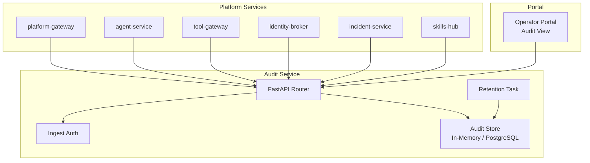
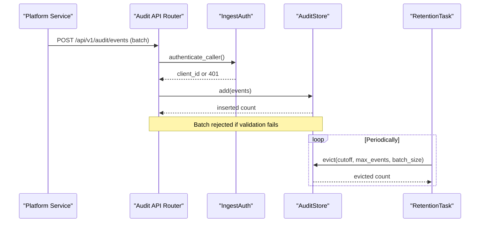
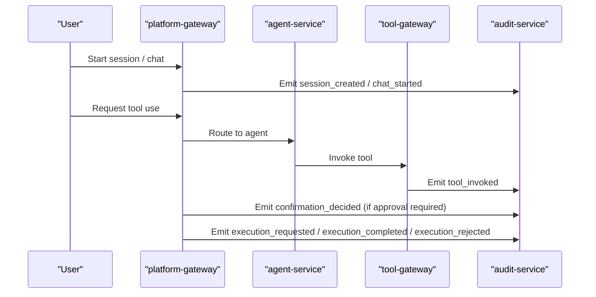
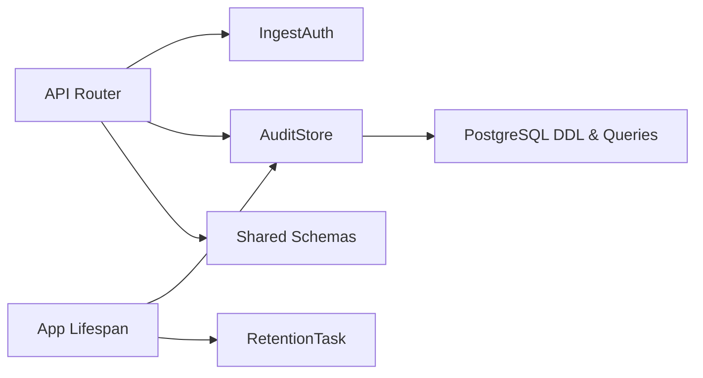

# Audit Trail and Compliance

<cite>
**Referenced Files in This Document**
- [main.py](file://products/audit-service/src/audit_service/main.py)
- [app.py](file://products/audit-service/src/audit_service/app.py)
- [config.py](file://products/audit-service/src/audit_service/core/config.py)
- [ingest_auth.py](file://products/audit-service/src/audit_service/services/ingest_auth.py)
- [audit_store.py](file://products/audit-service/src/audit_service/services/audit_store.py)
- [ingest.py](file://products/audit-service/src/audit_service/api/routes/ingest.py)
- [export.py](file://products/audit-service/src/audit_service/api/routes/export.py)
- [summary.py](file://products/audit-service/src/audit_service/api/routes/summary.py)
- [query.py](file://products/audit-service/src/audit_service/api/routes/query.py)
- [audit-event.schema.json](file://shared/shared-contracts/schemas/audit-event.schema.json)
- [audit-summary.schema.json](file://shared/shared-contracts/schemas/audit-summary.schema.json)
- [gateway_service.py](file://products/platform-gateway/src/platform_gateway/services/gateway_service.py)
- [approval-and-hitl.md](file://docs/guides/approval-and-hitl.md)
- [portal-user-guide.md](file://docs/guides/portal-user-guide.md)
- [SPEC-046-audit-reporting-and-export/spec.md](file://docs/specs/SPEC-046-audit-reporting-and-export/spec.md)
- [SPEC-047-audit-summary-drilldown/spec.md](file://docs/specs/SPEC-047-audit-summary-drilldown/spec.md)
- [test_reporting.py](file://products/audit-service/tests/test_reporting.py)
</cite>

## Table of Contents
1. Introduction
2. Project Structure
3. Core Components
4. Architecture Overview
5. Detailed Component Analysis
6. Dependency Analysis
7. Performance Considerations
8. Troubleshooting Guide
9. Conclusion
10. Appendices

## Introduction
This document explains the durable audit trail system that provides tamper-evident logging of platform activities for compliance and debugging. It covers how the audit-service ingests authenticated events from all platform services, stores them under bounded retention policies, and serves permission-scoped queries. It documents the audit event schema, retention configuration options, export capabilities for compliance reporting, and the operator portal’s Audit view for searching, filtering, and analyzing audit events. It also clarifies how audit events relate to sessions, tool executions, approvals, and incidents, and provides guidance on configuring retention, setting up audit consumers, and implementing custom audit event types.

## Project Structure
The audit trail spans several components:
- Audit service: FastAPI application providing ingestion, querying, summarization, and CSV export endpoints.
- Shared schemas: Canonical JSON Schema definitions for audit events and summaries.
- Platform services: Emit audit events during identity operations, session lifecycle, policy decisions, tool invocations, approvals, and incident handling.
- Operator portal: Provides an Audit view with Events and Summary tabs, shared filters, and CSV export.

**Diagram sources**
- [app.py:20-40](file://products/audit-service/src/audit_service/app.py#L20-L40)
- [ingest.py:33-41](file://products/audit-service/src/audit_service/api/routes/ingest.py#L33-L41)
- [audit_store.py:224-249](file://products/audit-service/src/audit_service/services/audit_store.py#L224-L249)

**Section sources**
- [app.py:20-74](file://products/audit-service/src/audit_service/app.py#L20-L74)
- [config.py:60-111](file://products/audit-service/src/audit_service/core/config.py#L60-L111)

## Core Components
- Ingestion endpoint: Accepts batches of audit events from registered platform services. Callers authenticate via static credentials or workload tokens; malformed batches are rejected wholesale.
- Authentication: Supports two paths:
  - Static HTTP Basic against a configured registry.
  - Workload Bearer token validated against cluster OIDC issuer JWKS with audience and subject mapping checks.
- Storage: Strategy pattern selects between in-memory (dev/test) and PostgreSQL (production). Events are stored verbatim with no field rewriting.
- Retention: Background task evicts events older than a configurable cutoff and enforces a hard cap on total stored events, both batched to avoid long-running transactions.
- Query and summary: Cursor-based pagination over newest-first events; deterministic aggregation over envelope columns only (event_type, outcome, service, username), plus a decision-chain projection.
- Export: Server-side RFC-4180 CSV streaming with a hard row cap and truncation headers; filtered by the same query parameters as the UI.

**Section sources**
- [ingest.py:33-41](file://products/audit-service/src/audit_service/api/routes/ingest.py#L33-L41)
- [ingest_auth.py:34-118](file://products/audit-service/src/audit_service/services/ingest_auth.py#L34-L118)
- [audit_store.py:93-157](file://products/audit-service/src/audit_service/services/audit_store.py#L93-L157)
- [audit_store.py:324-546](file://products/audit-service/src/audit_service/services/audit_store.py#L324-L546)
- [config.py:60-111](file://products/audit-service/src/audit_service/core/config.py#L60-L111)

## Architecture Overview
The audit trail is a sidecar durability layer: platform services emit tamper-evident events after redaction; the audit-service persists them under bounded retention; operators and compliance tools query and export the trail.

**Diagram sources**
- [ingest.py:33-41](file://products/audit-service/src/audit_service/api/routes/ingest.py#L33-L41)
- [ingest_auth.py:105-118](file://products/audit-service/src/audit_service/services/ingest_auth.py#L105-L118)
- [audit_store.py:357-384](file://products/audit-service/src/audit_service/services/audit_store.py#L357-L384)
- [audit_store.py:498-533](file://products/audit-service/src/audit_service/services/audit_store.py#L498-L533)

## Detailed Component Analysis

### Audit Event Schema
The canonical audit event envelope defines required fields, a closed vocabulary of event types, and per-type details. The schema ensures consistent correlation identifiers, timestamps, outcomes, and actor context across all emitting services.

Key aspects:
- Required envelope fields: event_id, occurred_at, event_type, service, request_id, outcome.
- Closed event_type vocabulary includes tool_invoked, policy_decision, token_exchange, session_created, session_deleted, chat_started, chat_completed, confirmation_decided, incident_triaged, skill_searched, skill_retrieved, skills_synced, execution_requested, execution_completed, execution_rejected, document_created, document_published, document_read, skill_draft_generated, incident_skill_draft_generated, skill_graduated.
- Outcome values: allow, deny, success, error.
- Details payload varies by event type; for example, execution_requested/completed/rejected carry confirm_id, execution_id, call_id, tool_name, status, duration_ms, and request_id to correlate approval-to-execution chains.

**Section sources**
- [audit-event.schema.json:1-94](file://shared/shared-contracts/schemas/audit-event.schema.json#L1-L94)

### Retention Configuration
Retention is controlled by environment-driven settings:
- AUDIT_RETENTION_DAYS: cutoff window for eviction.
- AUDIT_MAX_EVENTS: hard cap on stored events.
- AUDIT_EVICTION_INTERVAL_SECONDS: frequency of background eviction runs.
- AUDIT_EVICTION_BATCH_SIZE: number of rows deleted per eviction step.
- AUDIT_STORE_BACKEND and AUDIT_DB_URL: select backend and connection string.

Eviction is implemented in batches to avoid long-running transactions and enforces both time-based and count-based bounds.

**Section sources**
- [config.py:60-111](file://products/audit-service/src/audit_service/core/config.py#L60-L111)
- [audit_store.py:498-533](file://products/audit-service/src/audit_service/services/audit_store.py#L498-L533)

### Ingest Authentication
Two authentication paths protect ingestion:
- Static path: HTTP Basic against AUDIT_INGEST_CLIENTS registry.
- Workload path: Bearer token validated against cluster OIDC issuer JWKS with audience and subject mapping checks.

Failure modes return 401 with descriptive errors.

**Section sources**
- [ingest_auth.py:34-118](file://products/audit-service/src/audit_service/services/ingest_auth.py#L34-L118)

### Query, Summary, and Export
- Query: Cursor-based pagination returning newest-first events, filtered by username, session_id, request_id, event_type, service, outcome, since/until.
- Summary: Deterministic aggregates over envelope columns only, including top actors and a decision-chain projection with explicit zeros.
- Export: Streams RFC-4180 CSV with fixed envelope columns, capped at AUDIT_EXPORT_MAX_ROWS, with truncation headers and server-chosen filename.

Tests verify export behavior, filter adherence, and outcome dimension support.

**Section sources**
- [audit_store.py:188-219](file://products/audit-service/src/audit_service/services/audit_store.py#L188-L219)
- [audit_store.py:386-489](file://products/audit-service/src/audit_service/services/audit_store.py#L386-L489)
- [test_reporting.py:181-263](file://products/audit-service/tests/test_reporting.py#L181-L263)

### Operator Portal Audit View
The portal exposes an Audit view gated by roles requiring audit:read. It features:
- A shared toolbar with filters: username, event type, outcome, emitter service, and since/until window.
- Two tabs:
  - Events: newest-first table with cursor pagination and expandable envelopes.
  - Summary: headline statistic, buckets (by event type, outcome, service), top actors, and decision chain strip. Drill-down merges selected values into filters.
- Export CSV: downloads current filtered envelope columns; truncation notice when caps apply.

**Section sources**
- [portal-user-guide.md:395-426](file://docs/guides/portal-user-guide.md#L395-L426)
- [SPEC-046-audit-reporting-and-export/spec.md:158-180](file://docs/specs/SPEC-046-audit-reporting-and-export/spec.md#L158-L180)
- [SPEC-047-audit-summary-drilldown/spec.md:91-188](file://docs/specs/SPEC-047-audit-summary-drilldown/spec.md#L91-L188)

### Relationship to Sessions, Tool Executions, Approvals, and Incidents
- Sessions: session_created/session_deleted and chat_started/chat_completed events tie activity to sessions; many events include session_id for correlation.
- Tool executions: tool_invoked events record invocation outcomes; execution_requested/completed/rejected extend the trail around approved actions.
- Approvals: confirmation_decided emits when a human or policy decides on pending calls; subsequent execution events correlate via confirm_id and x-request-id.
- Incidents: incident_triaged events capture triage outcomes; incident-linked skill drafts generate specific draft events.

**Diagram sources**
- [gateway_service.py:1331-1362](file://products/platform-gateway/src/platform_gateway/services/gateway_service.py#L1331-L1362)
- [approval-and-hitl.md:290-328](file://docs/guides/approval-and-hitl.md#L290-L328)
- [audit-event.schema.json:27-49](file://shared/shared-contracts/schemas/audit-event.schema.json#L27-L49)

## Dependency Analysis
The audit-service depends on:
- FastAPI router for HTTP endpoints.
- Ingest auth module for caller verification.
- Audit store strategy for persistence and querying.
- Retention task for bounded storage.
- Shared schemas for contract enforcement.

**Diagram sources**
- [app.py:20-40](file://products/audit-service/src/audit_service/app.py#L20-L40)
- [audit_store.py:224-249](file://products/audit-service/src/audit_service/services/audit_store.py#L224-L249)

**Section sources**
- [app.py:20-74](file://products/audit-service/src/audit_service/app.py#L20-L74)
- [audit_store.py:556-565](file://products/audit-service/src/audit_service/services/audit_store.py#L556-L565)

## Performance Considerations
- Bounded retention prevents unbounded growth; eviction runs periodically and deletes in batches.
- Hard event cap ensures memory/disk usage stays within limits even under high ingestion rates.
- Summary aggregation uses envelope columns only, avoiding expensive JSONB excavation.
- Cursor pagination reduces payload size and enables efficient traversal of large trails.
- Export streams CSV with a hard row cap to protect downstream consumers.

[No sources needed since this section provides general guidance]

## Troubleshooting Guide
Common issues and diagnostics:
- Ingest authentication failures: Check whether the caller uses a valid static credential or a workload token with correct issuer, audience, and subject mapping. Errors map to 401 responses.
- Rejected batches: Malformed batches are rejected entirely; validate event payloads against the canonical schema before sending.
- Missing events: Verify retention settings and ensure the event timestamp falls within the retention window; check eviction logs for batch deletions.
- Export truncation: If exports are truncated, narrow filters or increase AUDIT_EXPORT_MAX_ROWS carefully while considering downstream capacity.

Operational checks:
- Health and readiness endpoints can be used to verify service availability.
- Metrics and structured logs provide visibility into ingestion, rejections, and store growth.

**Section sources**
- [ingest_auth.py:34-118](file://products/audit-service/src/audit_service/services/ingest_auth.py#L34-L118)
- [audit_store.py:498-533](file://products/audit-service/src/audit_service/services/audit_store.py#L498-L533)
- [app.py:49-65](file://products/audit-service/src/audit_service/app.py#L49-L65)

## Conclusion
The durable audit trail provides a robust, tamper-evident record of platform activity with strong guarantees around authentication, bounded retention, and permission-scoped access. Operators can search and analyze events through the portal, while compliance workflows can export filtered trails as CSV. The design emphasizes envelope-only aggregation, deterministic outputs, and clear correlations across sessions, approvals, tool executions, and incidents.

[No sources needed since this section summarizes without analyzing specific files]

## Appendices

### Configuring Retention Policies
Set the following environment variables to control retention and eviction:
- AUDIT_RETENTION_DAYS
- AUDIT_MAX_EVENTS
- AUDIT_EVICTION_INTERVAL_SECONDS
- AUDIT_EVICTION_BATCH_SIZE
- AUDIT_STORE_BACKEND and AUDIT_DB_URL

These values determine the time window, hard cap, and eviction cadence.

**Section sources**
- [config.py:60-111](file://products/audit-service/src/audit_service/core/config.py#L60-L111)

### Setting Up Audit Consumers
Consumers should:
- Authenticate using either static credentials or workload tokens as supported by ingest auth.
- Use the query endpoint with appropriate filters and cursor pagination.
- Use the summary endpoint for aggregated views and the export endpoint for CSV downloads.
- Respect truncation headers and row caps on exports.

**Section sources**
- [ingest_auth.py:105-118](file://products/audit-service/src/audit_service/services/ingest_auth.py#L105-L118)
- [test_reporting.py:181-263](file://products/audit-service/tests/test_reporting.py#L181-L263)

### Implementing Custom Audit Event Types
To introduce a new event type:
- Add the new value to the closed event_type vocabulary in the shared schema.
- Update details payload expectations in emitting services to match the new type.
- Ensure emitters set required envelope fields and meaningful outcome values.
- Validate changes with tests and schema validation before deployment.

**Section sources**
- [audit-event.schema.json:27-49](file://shared/shared-contracts/schemas/audit-event.schema.json#L27-L49)

### Approval-to-Execution Correlation
Approved actions produce a correlated chain:
- confirmation_decided records the approver’s decision.
- execution_requested, execution_completed, and execution_rejected extend the trail with confirm_id and request_id linkage.
- Signed execution requests and receipts enforce integrity between approval and execution.

**Section sources**
- [approval-and-hitl.md:290-328](file://docs/guides/approval-and-hitl.md#L290-L328)
- [gateway_service.py:1331-1362](file://products/platform-gateway/src/platform_gateway/services/gateway_service.py#L1331-L1362)