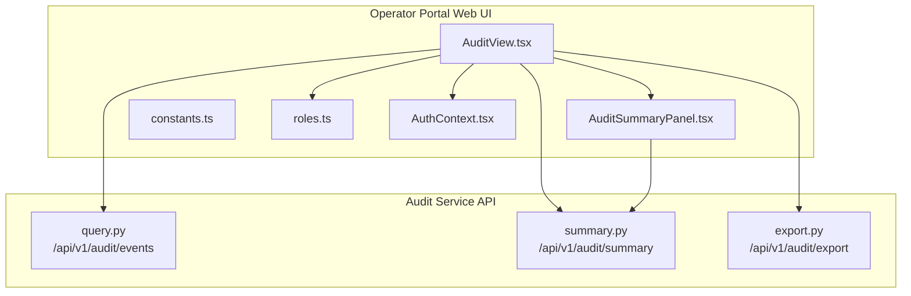
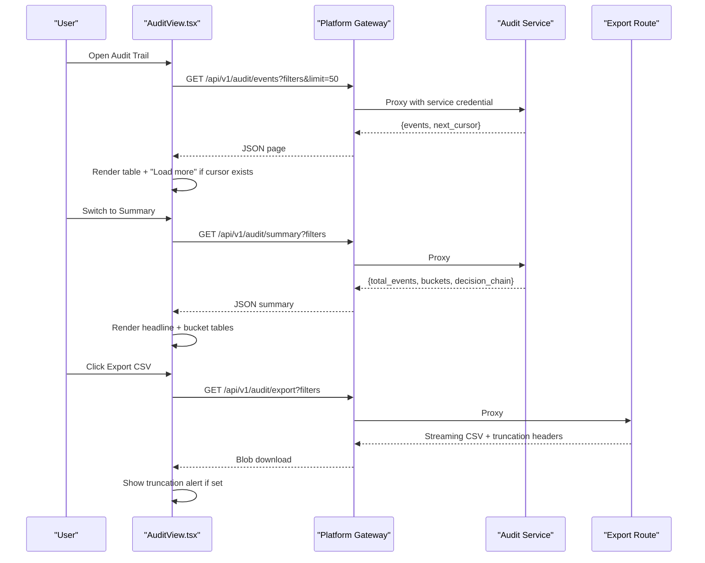
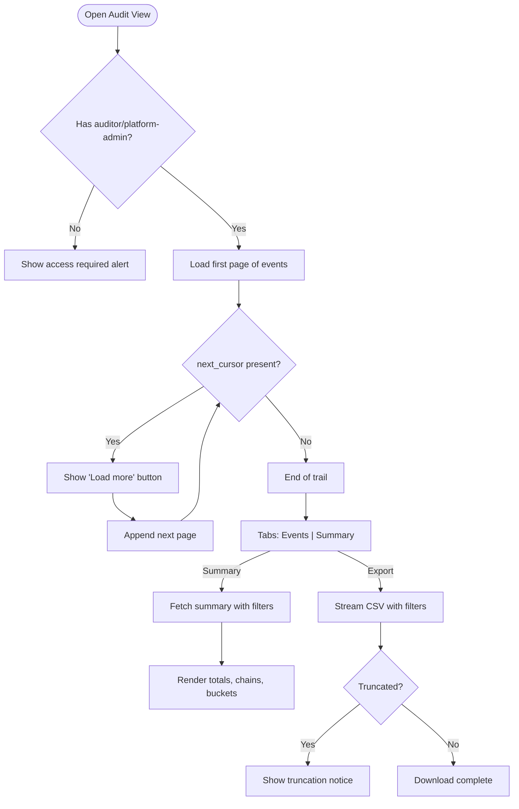
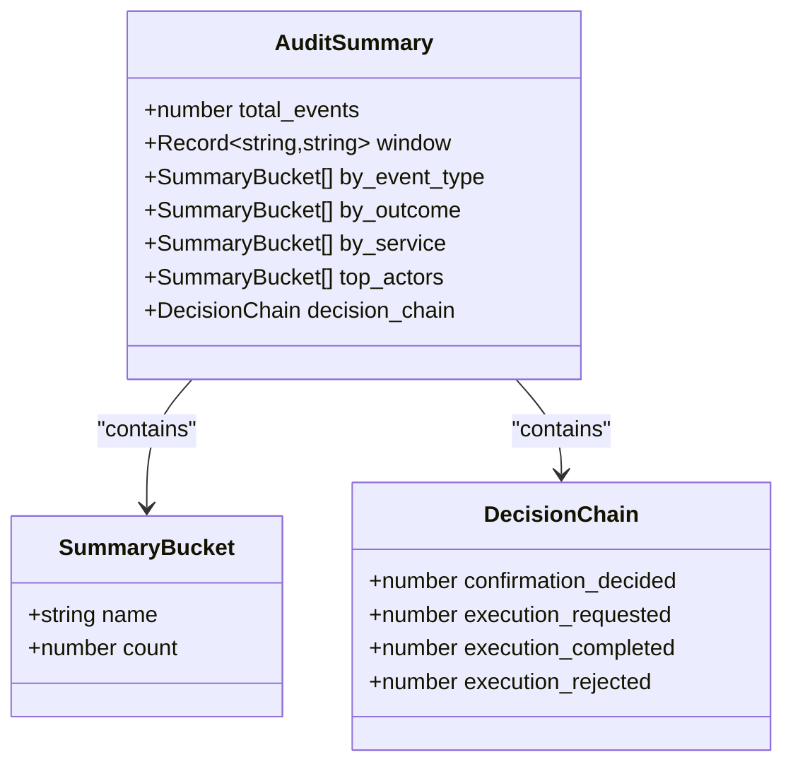
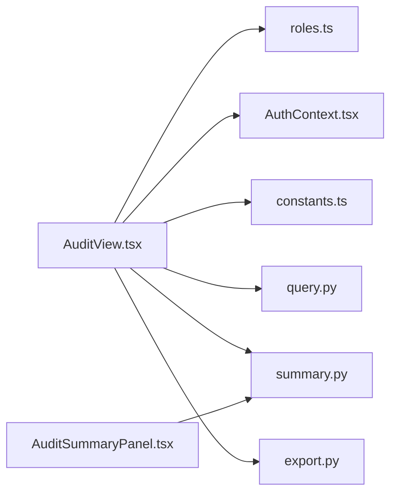

# Portal Interface

<cite>
**Referenced Files in This Document**
- [AuditView.tsx](file://products/operator-portal/web-ui/app/src/views/audit/AuditView.tsx)
- [AuditSummaryPanel.tsx](file://products/operator-portal/web-ui/app/src/views/audit/AuditSummaryPanel.tsx)
- [constants.ts](file://products/operator-portal/web-ui/app/src/views/audit/constants.ts)
- [roles.ts](file://products/operator-portal/web-ui/app/src/roles.ts)
- [AuthContext.tsx](file://products/operator-portal/web-ui/app/src/auth/AuthContext.tsx)
- [export.py](file://products/audit-service/src/audit_service/api/routes/export.py)
- [query.py](file://products/audit-service/src/audit_service/api/routes/query.py)
- [summary.py](file://products/audit-service/src/audit_service/api/routes/summary.py)
</cite>

## Table of Contents
1. Introduction
2. Project Structure
3. Core Components
4. Architecture Overview
5. Detailed Component Analysis
6. Dependency Analysis
7. Performance Considerations
8. Troubleshooting Guide
9. Conclusion

## Introduction
This document explains the operator portal’s audit trail interface, focusing on how operators search, filter, and analyze audit events. It covers the main AuditView component, the summary panel with aggregated metrics, filtering controls, CSV export for compliance reporting, drill-down into event details, and role-based access controls that govern who can view and act within the audit interface.

## Project Structure
The audit trail UI lives under the operator portal web application and consumes backend endpoints exposed by the audit service. The UI is organized around:
- A primary view (AuditView) that hosts a shared filter toolbar, an Events tab, a Summary tab, and export controls.
- A summary panel (AuditSummaryPanel) that renders headline statistics, decision-chain metrics, and bucket tables with drill-down links.
- Shared constants that pin filter vocabulary to the schema.
- Role checks and authentication context integration for access control.
- Backend routes for querying events, computing summaries, and exporting CSV.

**Diagram sources**
- [AuditView.tsx:101-483](file://products/operator-portal/web-ui/app/src/views/audit/AuditView.tsx#L101-L483)
- [AuditSummaryPanel.tsx:112-206](file://products/operator-portal/web-ui/app/src/views/audit/AuditSummaryPanel.tsx#L112-L206)
- [constants.ts:15-49](file://products/operator-portal/web-ui/app/src/views/audit/constants.ts#L15-L49)
- [roles.ts:1-95](file://products/operator-portal/web-ui/app/src/roles.ts#L1-L95)
- [AuthContext.tsx:19-110](file://products/operator-portal/web-ui/app/src/auth/AuthContext.tsx#L19-L110)
- [query.py:35-94](file://products/audit-service/src/audit_service/api/routes/query.py#L35-L94)
- [summary.py:34-78](file://products/audit-service/src/audit_service/api/routes/summary.py#L34-L78)
- [export.py:87-163](file://products/audit-service/src/audit_service/api/routes/export.py#L87-L163)

**Section sources**
- [AuditView.tsx:1-483](file://products/operator-portal/web-ui/app/src/views/audit/AuditView.tsx#L1-L483)
- [AuditSummaryPanel.tsx:1-206](file://products/operator-portal/web-ui/app/src/views/audit/AuditSummaryPanel.tsx#L1-L206)
- [constants.ts:1-50](file://products/operator-portal/web-ui/app/src/views/audit/constants.ts#L1-L50)
- [roles.ts:1-95](file://products/operator-portal/web-ui/app/src/roles.ts#L1-L95)
- [AuthContext.tsx:1-110](file://products/operator-portal/web-ui/app/src/auth/AuthContext.tsx#L1-L110)
- [query.py:1-95](file://products/audit-service/src/audit_service/api/routes/query.py#L1-L95)
- [summary.py:1-79](file://products/audit-service/src/audit_service/api/routes/summary.py#L1-L79)
- [export.py:1-164](file://products/audit-service/src/audit_service/api/routes/export.py#L1-L164)

## Core Components
- AuditView: Central UI component providing a shared filter toolbar, two tabs (Events and Summary), pagination via cursor, expandable verbatim envelopes, refresh, and CSV export. It enforces client-side role gating and delegates server-side authorization to the gateway and audit service.
- AuditSummaryPanel: Renders total events, decision-chain steps, and four collapsible bucket tables (by event type, outcome, service, top actors). Each aggregate value supports drill-down into the Events tab with merged filters.
- Filter Vocabulary: Pinned constants for event types, emitter services, and outcomes ensure UI selects remain synchronized with the shared schema.
- Roles and Auth: Uses roles.ts sets and AuthContext to determine visibility and behavior; the gateway re-enforces policy actions on every request.

Key responsibilities:
- Real-time-like display: The Events tab loads initial data and supports “Load more” via cursor pagination. Refresh re-fetches current tab content.
- Advanced filtering: Username, event type, outcome, service, and time range are applied consistently across both tabs and export.
- Export: Streams CSV from the audit service with truncation notices when limits are hit.
- Drill-down: Clicking any summary bucket or chain step navigates to the Events tab with merged filters.

**Section sources**
- [AuditView.tsx:101-483](file://products/operator-portal/web-ui/app/src/views/audit/AuditView.tsx#L101-L483)
- [AuditSummaryPanel.tsx:10-206](file://products/operator-portal/web-ui/app/src/views/audit/AuditSummaryPanel.tsx#L10-L206)
- [constants.ts:15-49](file://products/operator-portal/web-ui/app/src/views/audit/constants.ts#L15-L49)
- [roles.ts:1-95](file://products/operator-portal/web-ui/app/src/roles.ts#L1-L95)
- [AuthContext.tsx:19-110](file://products/operator-portal/web-ui/app/src/auth/AuthContext.tsx#L19-L110)

## Architecture Overview
The UI requests data through the platform gateway, which proxies to the audit service. The audit service authenticates callers and serves three endpoints:
- /api/v1/audit/events: Returns stored audit envelopes newest-first with keyset cursor pagination.
- /api/v1/audit/summary: Returns deterministic aggregates over the filtered trail.
- /api/v1/audit/export: Streams bounded CSV with truncation headers.

**Diagram sources**
- [AuditView.tsx:134-240](file://products/operator-portal/web-ui/app/src/views/audit/AuditView.tsx#L134-L240)
- [query.py:35-94](file://products/audit-service/src/audit_service/api/routes/query.py#L35-L94)
- [summary.py:34-78](file://products/audit-service/src/audit_service/api/routes/summary.py#L34-L78)
- [export.py:87-163](file://products/audit-service/src/audit_service/api/routes/export.py#L87-L163)

## Detailed Component Analysis

### AuditView Component
Responsibilities:
- Role gate: Displays an informational alert when the user lacks auditor or platform-admin roles.
- Shared filter toolbar: Inputs for username, event type, outcome, service, since/until; drives Events, Summary, and Export.
- Events tab: Loads initial page, shows loading states, handles errors, supports “Load more” via cursor, and expands rows to show verbatim envelopes.
- Summary tab: Fetches summary lazily when activated; displays structured error messages for upstream failures.
- Export: Streams CSV blob, honors server-provided filename, and shows truncation warning when applicable.
- Drill-down: Merges selected dimension into existing filters and reloads the Events tab without resetting other dimensions.

Error handling:
- Maps 403 to a clear message about missing audit:read policy action.
- Maps 503/502 to actionable messages about audit service configuration or availability.
- Generalizes unknown errors while preserving user-friendly messaging.

**Diagram sources**
- [AuditView.tsx:101-483](file://products/operator-portal/web-ui/app/src/views/audit/AuditView.tsx#L101-L483)

**Section sources**
- [AuditView.tsx:72-88](file://products/operator-portal/web-ui/app/src/views/audit/AuditView.tsx#L72-L88)
- [AuditView.tsx:134-240](file://products/operator-portal/web-ui/app/src/views/audit/AuditView.tsx#L134-L240)
- [AuditView.tsx:260-483](file://products/operator-portal/web-ui/app/src/views/audit/AuditView.tsx#L260-L483)

### AuditSummaryPanel Component
Responsibilities:
- Headline row: Total events plus four decision-chain steps (confirmation_decided, execution_requested, execution_completed, execution_rejected).
- Bucket tables: By event type, by outcome, by service, top actors — each with count and share percentage.
- Drill-down: Every aggregate value is clickable and merges its dimension into the parent filters before navigating to the Events tab.
- Zero-total posture: When no events match, shows a clear empty state without division math.

Data model highlights:
- Summary includes total_events, window, by_event_type, by_outcome, by_service, top_actors, and decision_chain.
- Share calculation uses one-decimal rounding and guards against zero totals.

**Diagram sources**
- [AuditSummaryPanel.tsx:10-28](file://products/operator-portal/web-ui/app/src/views/audit/AuditSummaryPanel.tsx#L10-L28)

**Section sources**
- [AuditSummaryPanel.tsx:10-206](file://products/operator-portal/web-ui/app/src/views/audit/AuditSummaryPanel.tsx#L10-L206)

### Filtering Interface
- Fields: username, event type, outcome, service, since, until.
- Behavior: All fields are serialized into query parameters and applied uniformly to Events, Summary, and Export.
- Vocabulary pinning: Event types, emitter services, and outcomes are pinned to constants that mirror the shared schema to prevent drift.

Interpretation guidance:
- Use event type to isolate specific operations (e.g., tool_invoked, execution_requested).
- Use outcome to focus on success/error/deny patterns.
- Use service to attribute activity to components like agent-service, execution-runtime, identity-service, incident-service, platform-gateway, skills-hub, tool-gateway.
- Time range narrows windows for incident response or shift handover reviews.

**Section sources**
- [AuditView.tsx:54-99](file://products/operator-portal/web-ui/app/src/views/audit/AuditView.tsx#L54-L99)
- [AuditView.tsx:320-382](file://products/operator-portal/web-ui/app/src/views/audit/AuditView.tsx#L320-L382)
- [constants.ts:15-49](file://products/operator-portal/web-ui/app/src/views/audit/constants.ts#L15-L49)

### Export Functionality
- Endpoint: Streams CSV with fixed columns including envelope fields and a sorted-key JSON details payload.
- Bounded size: Hard-capped at AUDIT_EXPORT_MAX_ROWS; pages are read up front to decide truncation before streaming begins.
- Headers: Content-Disposition provides a timestamped filename; X-Audit-Export-Truncated and X-Audit-Export-Rows inform consumers about completeness.
- Client behavior: Downloads the blob using the server filename and shows a warning banner when truncated.

Operational use:
- Generate compliance reports by applying filters (user, service, time range) and exporting CSV.
- If truncated, narrow filters to obtain a complete dataset.

**Section sources**
- [export.py:1-164](file://products/audit-service/src/audit_service/api/routes/export.py#L1-L164)
- [AuditView.tsx:201-240](file://products/operator-portal/web-ui/app/src/views/audit/AuditView.tsx#L201-L240)

### Drill-Down and Event Details
- From Summary: Clicking any bucket or chain step merges that dimension into filters and reloads the Events tab.
- From Events: Expand any row to see the verbatim event envelope for deep inspection.

Troubleshooting workflow:
- Identify anomalies in Summary (e.g., high deny rate).
- Drill down to the relevant dimension to list matching events.
- Expand rows to inspect payloads and correlate request IDs.

**Section sources**
- [AuditView.tsx:242-258](file://products/operator-portal/web-ui/app/src/views/audit/AuditView.tsx#L242-L258)
- [AuditView.tsx:422-438](file://products/operator-portal/web-ui/app/src/views/audit/AuditView.tsx#L422-L438)
- [AuditSummaryPanel.tsx:160-178](file://products/operator-portal/web-ui/app/src/views/audit/AuditSummaryPanel.tsx#L160-L178)

### Role-Based Access Controls
- Allowed roles: auditor and platform-admin.
- Client-side gate: Shows an informational alert when access is denied; prevents unnecessary network calls.
- Server-side enforcement: The gateway re-enforces audit:read on every request; the audit service also authenticates callers.

Best practices:
- Ensure users have the correct role assigned in the identity system.
- If access is denied, verify both client role assignment and gateway policy configuration.

**Section sources**
- [roles.ts:1-95](file://products/operator-portal/web-ui/app/src/roles.ts#L1-L95)
- [AuditView.tsx:101-104](file://products/operator-portal/web-ui/app/src/views/audit/AuditView.tsx#L101-L104)
- [AuditView.tsx:260-268](file://products/operator-portal/web-ui/app/src/views/audit/AuditView.tsx#L260-L268)
- [query.py:1-95](file://products/audit-service/src/audit_service/api/routes/query.py#L1-L95)
- [summary.py:1-79](file://products/audit-service/src/audit_service/api/routes/summary.py#L1-L79)
- [export.py:1-164](file://products/audit-service/src/audit_service/api/routes/export.py#L1-L164)

## Dependency Analysis
The UI depends on:
- Authentication context for session and roles.
- Constants for filter options aligned with the shared schema.
- Backend routes for data retrieval and export.

**Diagram sources**
- [AuditView.tsx:101-483](file://products/operator-portal/web-ui/app/src/views/audit/AuditView.tsx#L101-L483)
- [AuditSummaryPanel.tsx:112-206](file://products/operator-portal/web-ui/app/src/views/audit/AuditSummaryPanel.tsx#L112-L206)
- [roles.ts:1-95](file://products/operator-portal/web-ui/app/src/roles.ts#L1-L95)
- [AuthContext.tsx:19-110](file://products/operator-portal/web-ui/app/src/auth/AuthContext.tsx#L19-L110)
- [constants.ts:15-49](file://products/operator-portal/web-ui/app/src/views/audit/constants.ts#L15-L49)
- [query.py:35-94](file://products/audit-service/src/audit_service/api/routes/query.py#L35-L94)
- [summary.py:34-78](file://products/audit-service/src/audit_service/api/routes/summary.py#L34-L78)
- [export.py:87-163](file://products/audit-service/src/audit_service/api/routes/export.py#L87-L163)

**Section sources**
- [AuditView.tsx:101-483](file://products/operator-portal/web-ui/app/src/views/audit/AuditView.tsx#L101-L483)
- [AuditSummaryPanel.tsx:112-206](file://products/operator-portal/web-ui/app/src/views/audit/AuditSummaryPanel.tsx#L112-L206)
- [roles.ts:1-95](file://products/operator-portal/web-ui/app/src/roles.ts#L1-L95)
- [AuthContext.tsx:19-110](file://products/operator-portal/web-ui/app/src/auth/AuthContext.tsx#L19-L110)
- [constants.ts:15-49](file://products/operator-portal/web-ui/app/src/views/audit/constants.ts#L15-L49)
- [query.py:35-94](file://products/audit-service/src/audit_service/api/routes/query.py#L35-L94)
- [summary.py:34-78](file://products/audit-service/src/audit_service/api/routes/summary.py#L34-L78)
- [export.py:87-163](file://products/audit-service/src/audit_service/api/routes/export.py#L87-L163)

## Performance Considerations
- Cursor pagination: Limits initial load to a fixed page size and appends additional pages only when requested, reducing memory and network overhead.
- Lazy summary fetch: Summary data is loaded only when the Summary tab is active and when filters change, avoiding unnecessary work.
- Bounded export: CSV export caps rows and decides truncation before streaming, preventing large in-memory builds.
- Deterministic rendering: Summary uses fixed column widths and stable share calculations to avoid layout thrashing.

[No sources needed since this section provides general guidance]

## Troubleshooting Guide
Common issues and resolutions:
- Access denied: If you see a message indicating the audit surface requires the audit:read policy action, confirm your role assignment and gateway policy configuration.
- Audit service unavailable: A 502 indicates temporary unavailability; retry after a short delay or check service health.
- Audit service not configured: A 503 suggests the audit service is not enabled on the gateway; coordinate with platform administrators.
- Export truncated: Narrow filters (time range, user, service) to reduce result size and obtain a complete export.
- Empty results: Verify filters and time range; try removing constraints to confirm baseline data exists.

Operational insights from summaries:
- High deny or error rates may indicate policy misconfiguration or failing tools; drill down by outcome and service to pinpoint.
- Spikes in execution_requested without corresponding execution_completed suggest pending approvals or worker backlogs; investigate confirmation_decided and execution_rejected.
- Top actors with unusual volumes may warrant review for automation misuse or misconfigured scripts.

**Section sources**
- [AuditView.tsx:72-88](file://products/operator-portal/web-ui/app/src/views/audit/AuditView.tsx#L72-L88)
- [AuditView.tsx:383-398](file://products/operator-portal/web-ui/app/src/views/audit/AuditView.tsx#L383-L398)
- [export.py:120-163](file://products/audit-service/src/audit_service/api/routes/export.py#L120-L163)
- [AuditSummaryPanel.tsx:160-178](file://products/operator-portal/web-ui/app/src/views/audit/AuditSummaryPanel.tsx#L160-L178)

## Conclusion
The audit trail interface provides a robust, user-friendly way for operators to monitor, investigate, and report on platform activity. With a shared filter toolbar, real-time-like event listing, comprehensive summary metrics, and bounded CSV export, it supports both day-to-day operations and compliance workflows. Role-based access ensures only authorized users can view audit data, while server-side enforcement guarantees consistent policy adherence. Use drill-down capabilities to move from high-level insights to granular event details efficiently.

[No sources needed since this section summarizes without analyzing specific files]