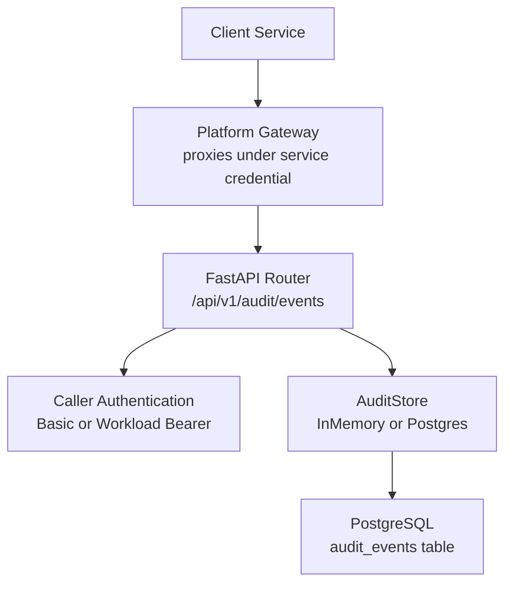
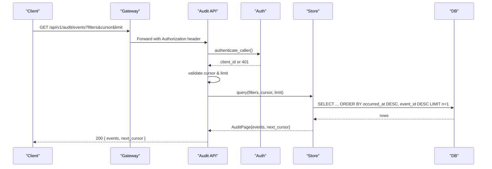
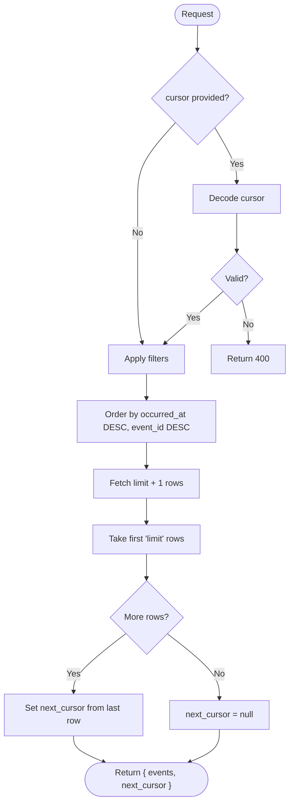
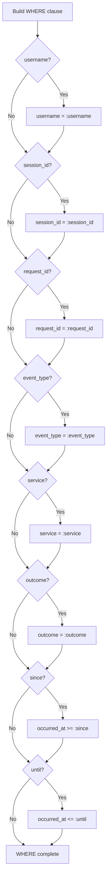
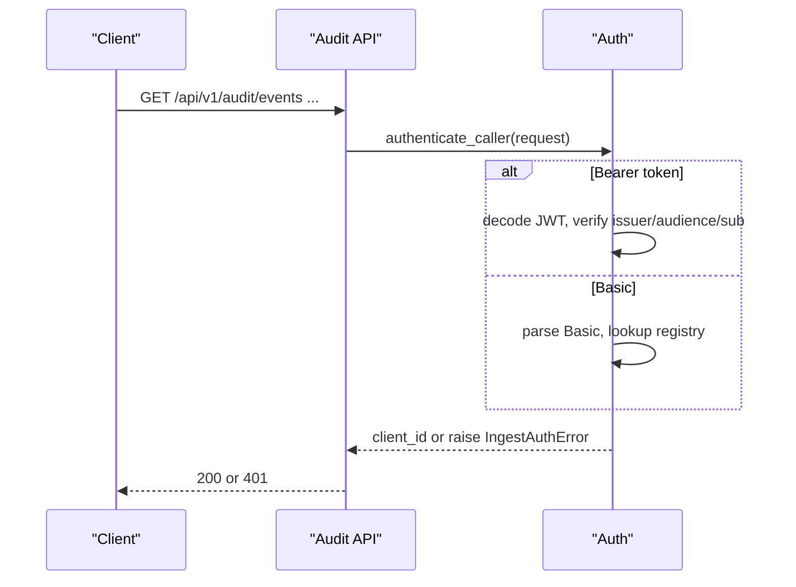
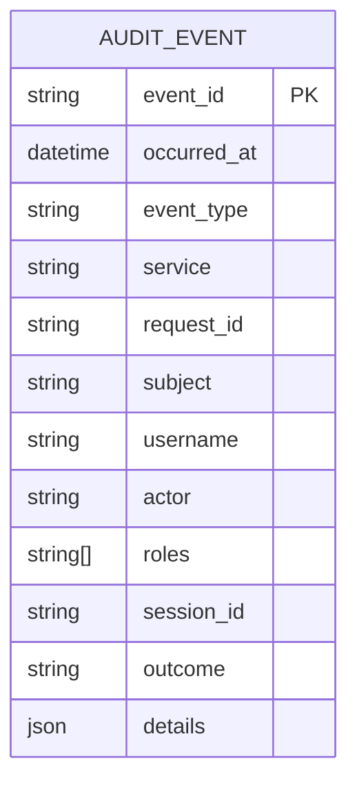
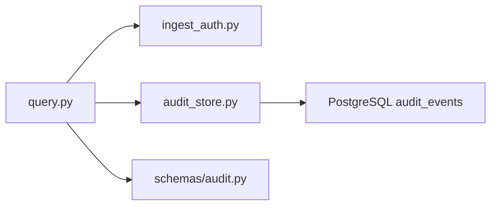

# Query API

<cite>
**Referenced Files in This Document**
- [query.py](file://products/audit-service/src/audit_service/api/routes/query.py)
- [router.py](file://products/audit-service/src/audit_service/api/router.py)
- [app.py](file://products/audit-service/src/audit_service/app.py)
- [audit.py](file://products/audit-service/src/audit_service/schemas/audit.py)
- [audit_store.py](file://products/audit-service/src/audit_service/services/audit_store.py)
- [ingest_auth.py](file://products/audit-service/src/audit_service/services/ingest_auth.py)
- [audit-event.schema.json](file://shared/shared-contracts/schemas/audit-event.schema.json)
</cite>

## Table of Contents
1. [Introduction](#introduction)
2. [Project Structure](#project-structure)
3. [Core Components](#core-components)
4. [Architecture Overview](#architecture-overview)
5. [Detailed Component Analysis](#detailed-component-analysis)
6. [Dependency Analysis](#dependency-analysis)
7. [Performance Considerations](#performance-considerations)
8. [Troubleshooting Guide](#troubleshooting-guide)
9. [Conclusion](#conclusion)

## Introduction
This document specifies the audit query interface that allows authorized services to search and retrieve audit events. It focuses on the GET /api/v1/audit/events endpoint, its query parameters, filtering behavior, cursor-based pagination, response format, authentication requirements, and practical usage patterns. The implementation is provided by the audit-service and enforces service-level authentication before querying a pluggable store (in-memory for development/testing or PostgreSQL for production).

## Project Structure
The audit query feature spans a small set of focused modules:
- API route definition and request handling
- Schema definitions for queries and event envelopes
- Store abstraction with in-memory and PostgreSQL backends
- Caller authentication for service-to-service calls

**Diagram sources**
- [router.py:1-11](file://products/audit-service/src/audit_service/api/router.py#L1-L11)
- [query.py:35-94](file://products/audit-service/src/audit_service/api/routes/query.py#L35-L94)
- [ingest_auth.py:105-117](file://products/audit-service/src/audit_service/services/ingest_auth.py#L105-L117)
- [audit_store.py:324-415](file://products/audit-service/src/audit_service/services/audit_store.py#L324-L415)

**Section sources**
- [router.py:1-11](file://products/audit-service/src/audit_service/api/router.py#L1-L11)
- [app.py:43-70](file://products/audit-service/src/audit_service/app.py#L43-L70)

## Core Components
- Endpoint: GET /api/v1/audit/events
- Filters: username, session_id, request_id, event_type, service, outcome, since, until
- Pagination: cursor-based using next_cursor; limit with bounds
- Response: { events: [...], next_cursor: string | null }
- Authentication: service credentials via Basic or workload Bearer token
- Storage: in-memory (tests/dev) or PostgreSQL (production)

Key behaviors:
- Filters are combined with AND logic; empty fields mean no constraint.
- Events are returned newest-first by occurred_at, then by event_id for stability.
- Cursor encodes the last event’s occurred_at and event_id to resume pagination.
- Envelope schema is preserved verbatim between ingest and query.

**Section sources**
- [query.py:35-94](file://products/audit-service/src/audit_service/api/routes/query.py#L35-L94)
- [audit.py:67-83](file://products/audit-service/src/audit_service/schemas/audit.py#L67-L83)
- [audit-store.py:36-40](file://products/audit-service/src/audit_service/services/audit_store.py#L36-L40)
- [audit-store.py:69-87](file://products/audit-service/src/audit_service/services/audit_store.py#L69-L87)
- [audit-event.schema.json:1-94](file://shared/shared-contracts/schemas/audit-event.schema.json#L1-L94)

## Architecture Overview
The request flow authenticates the caller, validates optional pagination inputs, applies filters, executes a keyset-paginated query, and returns a page with a continuation cursor when more results exist.

**Diagram sources**
- [query.py:35-94](file://products/audit-service/src/audit_service/api/routes/query.py#L35-L94)
- [ingest_auth.py:105-117](file://products/audit-service/src/audit_service/services/ingest_auth.py#L105-L117)
- [audit_store.py:386-415](file://products/audit-service/src/audit_service/services/audit_store.py#L386-L415)

## Detailed Component Analysis

### GET /api/v1/audit/events
- Path: /api/v1/audit/events
- Method: GET
- Purpose: Retrieve audit events matching filters with cursor-based pagination.

Query parameters:
- username: string | optional — match envelope username
- session_id: string | optional — match envelope session_id
- request_id: string | optional — match envelope request_id
- event_type: string | optional — match envelope event_type from the closed vocabulary
- service: string | optional — match emitting service name
- outcome: enum | optional — filter by allow, deny, success, error
- since: datetime | optional — include events at or after this time
- until: datetime | optional — include events at or before this time
- cursor: string | optional — base64-encoded keyset token (occurred_at|event_id)
- limit: integer | default 50, range 1..200 — page size

Response:
- 200 OK: JSON object with
  - events: array of audit event envelopes
  - next_cursor: string | null — pass this value as cursor to fetch the next page

Filter semantics:
- All provided filters are combined with AND.
- Empty or omitted filters impose no constraint.
- outcome is an additive dimension over the envelope outcome field.

Pagination mechanics:
- Keyset pagination based on (occurred_at, event_id) ordering.
- next_cursor is present only when there are additional pages.
- Use the returned next_cursor exactly as-is for subsequent requests.

Authentication and authorization:
- Requires a registered service caller.
- Supports two modes:
  - Static Basic credentials against a configured registry
  - Workload Bearer token validated against cluster OIDC issuer JWKS with audience and subject mapping
- Unauthorized requests return 401 with a detail message.

Error responses:
- 400 Bad Request: invalid cursor format
- 401 Unauthorized: missing or invalid service credentials

Rate limiting:
- No explicit rate limiting is implemented in the audit-service routes.
- Consumers should implement client-side retry/backoff and respect any platform gateway limits if enforced upstream.

Practical examples:
- User activity: ?username=alice&since=2024-01-01T00:00:00Z&until=2024-01-01T23:59:59Z
- Session investigation: ?session_id=abc-123
- Failed actions: ?outcome=deny
- Time-range analysis: ?since=...&until=...&limit=200
- Event type drill-down: ?event_type=tool_invoked&service=tool-gateway

Notes:
- The endpoint returns envelopes verbatim per the shared audit-event schema.
- The platform gateway typically proxies this endpoint under its own service credential; callers must still provide valid credentials accepted by the audit-service.

**Section sources**
- [query.py:35-94](file://products/audit-service/src/audit_service/api/routes/query.py#L35-L94)
- [audit.py:67-83](file://products/audit-service/src/audit_service/schemas/audit.py#L67-L83)
- [ingest_auth.py:105-117](file://products/audit-service/src/audit_service/services/ingest_auth.py#L105-L117)
- [audit-event.schema.json:1-94](file://shared/shared-contracts/schemas/audit-event.schema.json#L1-L94)

### Cursor-Based Pagination
- Encoding: cursor = base64(occurred_at|event_id), where occurred_at is timezone-aware ISO 8601.
- Decoding: validates presence of both timestamp and event_id; raises an error for malformed input.
- Ordering: events are ordered by occurred_at DESC, event_id DESC to ensure deterministic pagination.
- Behavior:
  - If cursor is provided, only events strictly preceding the cursor position are returned.
  - next_cursor is computed from the last event on the page when more data remains.

**Diagram sources**
- [audit_store.py:69-87](file://products/audit-service/src/audit_service/services/audit_store.py#L69-L87)
- [audit_store.py:113-131](file://products/audit-service/src/audit_service/services/audit_store.py#L113-L131)
- [audit_store.py:386-415](file://products/audit-service/src/audit_service/services/audit_store.py#L386-L415)

**Section sources**
- [audit_store.py:69-87](file://products/audit-service/src/audit_service/services/audit_store.py#L69-L87)
- [audit_store.py:113-131](file://products/audit-service/src/audit_service/services/audit_store.py#L113-L131)
- [audit_store.py:386-415](file://products/audit-service/src/audit_service/services/audit_store.py#L386-L415)

### Filtering Model
- Equality filters: username, session_id, request_id, event_type, service, outcome
- Range filters: since (>=), until (<=)
- Combined with AND; unspecified filters are ignored
- outcome is additive and matches the envelope outcome field exactly

**Diagram sources**
- [audit_store.py:288-321](file://products/audit-service/src/audit_service/services/audit_store.py#L288-L321)

**Section sources**
- [audit_store.py:288-321](file://products/audit-service/src/audit_service/services/audit_store.py#L288-L321)
- [audit.py:67-83](file://products/audit-service/src/audit_service/schemas/audit.py#L67-L83)

### Authentication and Authorization
- Two supported methods:
  - Static Basic: client_id:secret against a configured registry
  - Workload Bearer: Kubernetes projected service-account token validated against cluster OIDC issuer JWKS with audience and subject mapping
- Missing or invalid credentials result in 401 Unauthorized
- Platform gateway may enforce additional policy-level access control before proxying to the audit-service

**Diagram sources**
- [ingest_auth.py:105-117](file://products/audit-service/src/audit_service/services/ingest_auth.py#L105-L117)
- [ingest_auth.py:34-43](file://products/audit-service/src/audit_service/services/ingest_auth.py#L34-L43)
- [ingest_auth.py:69-93](file://products/audit-service/src/audit_service/services/ingest_auth.py#L69-L93)

**Section sources**
- [ingest_auth.py:105-117](file://products/audit-service/src/audit_service/services/ingest_auth.py#L105-L117)
- [ingest_auth.py:34-43](file://products/audit-service/src/audit_service/services/ingest_auth.py#L34-L43)
- [ingest_auth.py:69-93](file://products/audit-service/src/audit_service/services/ingest_auth.py#L69-L93)

### Data Model and Envelope
- Events follow the shared audit-event schema
- Required fields include event_id, occurred_at, event_type, service, request_id, outcome
- Optional fields include subject, username, actor, roles, session_id, details
- The API returns envelopes verbatim without rewriting

**Diagram sources**
- [audit-event.schema.json:1-94](file://shared/shared-contracts/schemas/audit-event.schema.json#L1-L94)

**Section sources**
- [audit-event.schema.json:1-94](file://shared/shared-contracts/schemas/audit-event.schema.json#L1-L94)

## Dependency Analysis
- Route depends on:
  - FastAPI router registration
  - Caller authentication module
  - Audit store abstraction
  - Schema models for query and events
- Store abstraction supports:
  - In-memory backend for tests/dev
  - PostgreSQL backend for production with indexes on frequently filtered columns

**Diagram sources**
- [query.py:35-94](file://products/audit-service/src/audit_service/api/routes/query.py#L35-L94)
- [audit_store.py:324-415](file://products/audit-service/src/audit_service/services/audit_store.py#L324-L415)

**Section sources**
- [query.py:35-94](file://products/audit-service/src/audit_service/api/routes/query.py#L35-L94)
- [audit_store.py:224-249](file://products/audit-service/src/audit_service/services/audit_store.py#L224-L249)

## Performance Considerations
- Use specific filters to reduce scan scope:
  - Prefer exact equality filters (username, session_id, request_id, event_type, service, outcome)
  - Narrow time windows with since/until
- Keep limit within 1..200; larger values increase payload and processing
- Leverage cursor-based pagination for large datasets; avoid offset-based approaches
- Ensure indexes are present for frequent filters (implemented in PostgreSQL backend)
- Avoid overly broad queries across long time ranges without additional constraints
- Implement client-side retries with exponential backoff for transient errors
- Monitor query latency and adjust filters or limits accordingly

[No sources needed since this section provides general guidance]

## Troubleshooting Guide
Common issues and resolutions:
- 401 Unauthorized:
  - Missing or invalid Authorization header
  - For Basic: ensure client_id and secret are registered
  - For Bearer: ensure token is issued by the configured issuer, has correct audience, and subject is mapped
- 400 Bad Request:
  - Malformed cursor; regenerate using next_cursor from previous response
- No results:
  - Verify filters are correct and time window includes expected events
  - Confirm event_type and service values match emitted data
- Slow queries:
  - Add more selective filters (e.g., session_id, request_id)
  - Reduce time range with since/until
  - Lower limit and paginate with cursor

Operational notes:
- Health checks and metrics are available through other routes; use them to confirm service readiness and observe request volume and latency.

**Section sources**
- [query.py:51-63](file://products/audit-service/src/audit_service/api/routes/query.py#L51-L63)
- [ingest_auth.py:105-117](file://products/audit-service/src/audit_service/services/ingest_auth.py#L105-L117)
- [audit_store.py:69-87](file://products/audit-service/src/audit_service/services/audit_store.py#L69-L87)

## Conclusion
The GET /api/v1/audit/events endpoint provides a secure, efficient way to retrieve audit events with precise filtering and stable cursor-based pagination. By combining targeted filters with appropriate limits and cursors, consumers can efficiently explore user activity, investigate sessions, and perform time-range analyses while adhering to strict authentication requirements and returning canonical audit envelopes.

[No sources needed since this section summarizes without analyzing specific files]