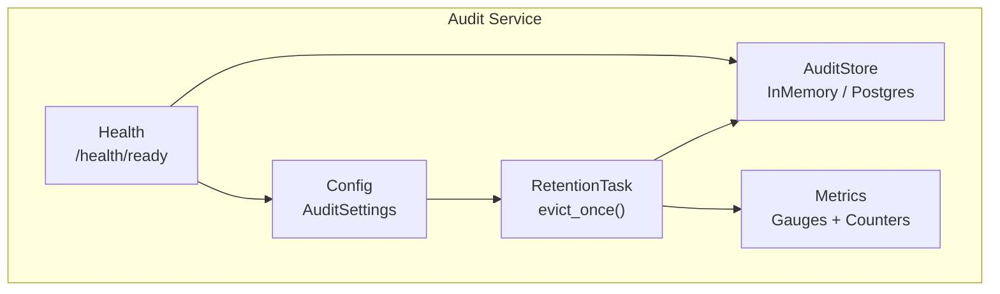
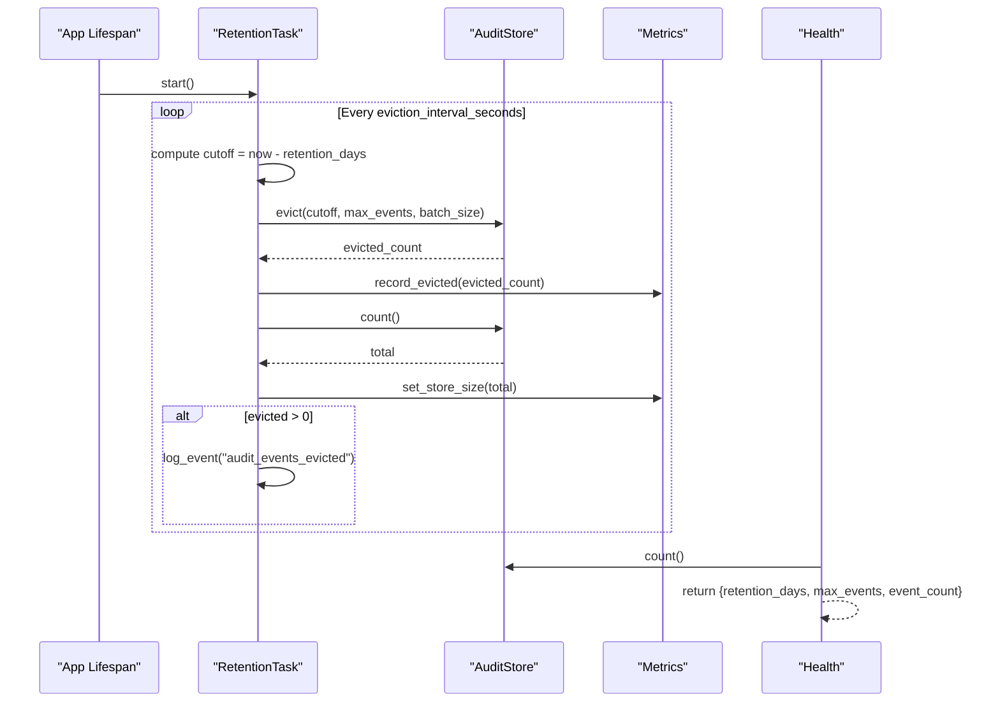
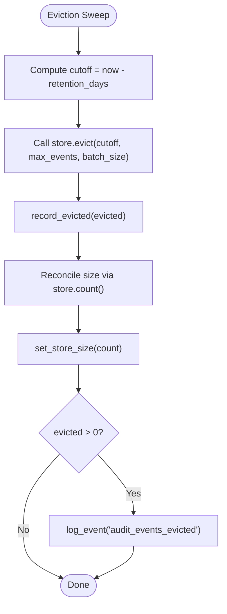
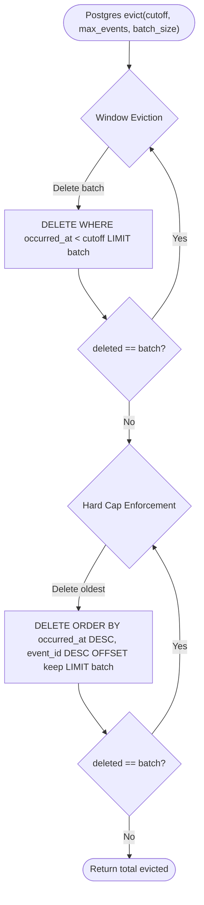
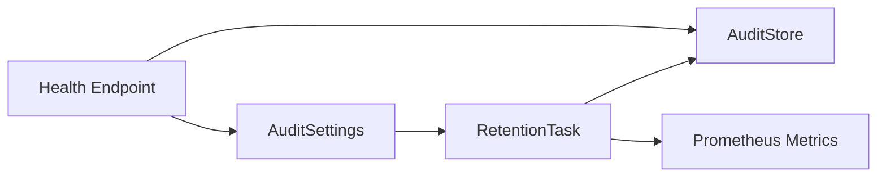

# Retention Policies

<cite>
**Referenced Files in This Document**
- [retention.py](file://products/audit-service/src/audit_service/services/retention.py)
- [config.py](file://products/audit-service/src/audit_service/core/config.py)
- [audit_store.py](file://products/audit-service/src/audit_service/services/audit_store.py)
- [metrics.py](file://products/audit-service/src/audit_service/core/metrics.py)
- [health.py](file://products/audit-service/src/audit_service/api/routes/health.py)
- [test_retention.py](file://products/audit-service/tests/test_retention.py)
- [runtime-config.env](file://shared/platform-ops/gitops/dev-k8s/base/audit-service/runtime-config.env)
- [configuration-reference.md](file://docs/guides/configuration-reference.md)
- [SPEC-013 spec.md](file://docs/specs/SPEC-013-durable-audit-trail/spec.md)
</cite>

## Table of Contents
1. Introduction
2. Project Structure
3. Core Components
4. Architecture Overview
5. Detailed Component Analysis
6. Dependency Analysis
7. Performance Considerations
8. Troubleshooting Guide
9. Conclusion
10. Appendices

## Introduction
This document explains the audit retention policy system that bounds audit event storage growth. It enforces two complementary limits:
- Time-based retention: removes events older than a configured number of days.
- Hard cap enforcement: keeps only the most recent N events, regardless of age.

The system runs a background eviction task on a bounded schedule to delete expired and excess events in small batches so ingestion is never blocked beyond normal database contention. Configuration is driven by environment variables, primarily AUDIT_RETENTION_DAYS and AUDIT_MAX_EVENTS, with additional knobs for scheduling and batching. Monitoring and alerting are provided via Prometheus metrics and health endpoints.

## Project Structure
The retention feature spans a small set of focused modules within the audit-service product:
- Configuration loading from environment variables into a frozen settings object.
- A periodic background task that computes a cutoff time and delegates deletion to the store.
- Store implementations (in-memory and PostgreSQL) that implement batched window eviction and hard-cap enforcement.
- Metrics and health endpoints that expose retention configuration and store size.

**Diagram sources**
- [config.py:60-105](file://products/audit-service/src/audit_service/core/config.py#L60-L105)
- [retention.py:27-75](file://products/audit-service/src/audit_service/services/retention.py#L27-L75)
- [audit_store.py:42-63](file://products/audit-service/src/audit_service/services/audit_store.py#L42-L63)
- [metrics.py:62-76](file://products/audit-service/src/audit_service/core/metrics.py#L62-L76)
- [health.py:19-35](file://products/audit-service/src/audit_service/api/routes/health.py#L19-L35)

**Section sources**
- [config.py:60-105](file://products/audit-service/src/audit_service/core/config.py#L60-L105)
- [retention.py:27-75](file://products/audit-service/src/audit_service/services/retention.py#L27-L75)
- [audit_store.py:42-63](file://products/audit-service/src/audit_service/services/audit_store.py#L42-L63)
- [metrics.py:62-76](file://products/audit-service/src/audit_service/core/metrics.py#L62-L76)
- [health.py:19-35](file://products/audit-service/src/audit_service/api/routes/health.py#L19-L35)

## Core Components
- AuditSettings: Frozen dataclass loaded from environment variables. Key fields for retention include retention_days, max_events, eviction_interval_seconds, and eviction_batch_size. Defaults are defined in code and can be overridden at runtime.
- RetentionTask: Background asyncio task that sleeps for the configured interval, then calls evict_once(). It catches exceptions to ensure the loop continues even if a single sweep fails.
- AuditStore (Protocol): Defines add, query, summarize, count, evict, ready, close. Two implementations exist:
  - InMemoryAuditStore: For tests and development; applies both time-based and hard-cap pruning in memory.
  - PostgresAuditStore: WAL-durable backend; implements batched deletes for window eviction and hard-cap enforcement using LIMIT/OFFSET patterns.
- Metrics: Prometheus counters and gauges record evicted counts, store errors, and current store size.
- Health: Exposes retention configuration and approximate store size for operational visibility.

**Section sources**
- [config.py:60-105](file://products/audit-service/src/audit_service/core/config.py#L60-L105)
- [retention.py:27-75](file://products/audit-service/src/audit_service/services/retention.py#L27-L75)
- [audit_store.py:42-63](file://products/audit-service/src/audit_service/services/audit_store.py#L42-L63)
- [audit_store.py:93-150](file://products/audit-service/src/audit_service/services/audit_store.py#L93-L150)
- [audit_store.py:324-546](file://products/audit-service/src/audit_service/services/audit_store.py#L324-L546)
- [metrics.py:62-76](file://products/audit-service/src/audit_service/core/metrics.py#L62-L76)
- [health.py:19-35](file://products/audit-service/src/audit_service/api/routes/health.py#L19-L35)

## Architecture Overview
The retention architecture ensures bounded storage through a periodic background process that coordinates with the store to remove old and excess events without blocking ingestion.

**Diagram sources**
- [retention.py:33-75](file://products/audit-service/src/audit_service/services/retention.py#L33-L75)
- [audit_store.py:498-533](file://products/audit-service/src/audit_service/services/audit_store.py#L498-L533)
- [metrics.py:129-147](file://products/audit-service/src/audit_service/core/metrics.py#L129-L147)
- [health.py:19-35](file://products/audit-service/src/audit_service/api/routes/health.py#L19-L35)

## Detailed Component Analysis

### RetentionTask: Periodic Eviction Orchestrator
- Schedules eviction every AUDIT_EVICTION_INTERVAL_SECONDS.
- Computes a UTC cutoff based on AUDIT_RETENTION_DAYS.
- Delegates deletion to the store with both cutoff and max_events, plus batch_size.
- Records evicted counts and reconciles exact store size after each sweep.
- Logs an event when any events were evicted.
- Isolation: Exceptions are caught and recorded as store errors so the loop continues.

**Diagram sources**
- [retention.py:45-75](file://products/audit-service/src/audit_service/services/retention.py#L45-L75)
- [metrics.py:129-147](file://products/audit-service/src/audit_service/core/metrics.py#L129-L147)

**Section sources**
- [retention.py:27-75](file://products/audit-service/src/audit_service/services/retention.py#L27-L75)

### AuditStore Implementations: Bounded Deletion Strategy
- InMemoryAuditStore:
  - Filters out events older than cutoff.
  - Sorts kept events by time and id.
  - If kept exceeds max_events, drops oldest to retain only the newest N.
  - Returns the number of removed events.
- PostgresAuditStore:
  - Window eviction: repeatedly deletes rows where occurred_at < cutoff in batches of batch_size.
  - Hard cap enforcement: repeatedly deletes oldest rows until only max_events remain, also in batches.
  - Commits once per sweep to minimize transaction overhead.

**Diagram sources**
- [audit_store.py:498-533](file://products/audit-service/src/audit_service/services/audit_store.py#L498-L533)

**Section sources**
- [audit_store.py:93-150](file://products/audit-service/src/audit_service/services/audit_store.py#L93-L150)
- [audit_store.py:498-533](file://products/audit-service/src/audit_service/services/audit_store.py#L498-L533)

### Configuration: Environment Variables and Defaults
Key retention-related settings:
- AUDIT_RETENTION_DAYS: Number of days to retain events before time-based eviction. Default is 30.
- AUDIT_MAX_EVENTS: Hard cap on the number of events retained. Default is 100,000.
- AUDIT_EVICTION_INTERVAL_SECONDS: How often the eviction loop runs. Default is 3,600 seconds.
- AUDIT_EVICTION_BATCH_SIZE: Batch size for deletions in Postgres. Default is 1,000.
- AUDIT_STORE_BACKEND and AUDIT_DB_URL: Select backend and connection string.

These values are read into AuditSettings.from_env() and cached via get_settings().

**Section sources**
- [config.py:60-105](file://products/audit-service/src/audit_service/core/config.py#L60-L105)
- [configuration-reference.md:530-542](file://docs/guides/configuration-reference.md#L530-L542)
- [runtime-config.env:1-8](file://shared/platform-ops/gitops/dev-k8s/base/audit-service/runtime-config.env#L1-L8)

### Monitoring and Observability
- Metrics:
  - audit_evicted_total: Increments by the number of events evicted per sweep.
  - audit_store_errors_total: Increments when eviction or other store operations fail.
  - audit_store_events: Gauge updated after each sweep to reflect the exact store size.
- Health:
  - /health/ready returns retention_days, max_events, and current event_count when the store is ready.
- Logging:
  - On successful evictions, a structured event is logged with evicted count and policy parameters.

Operational guidance:
- Alert on spikes in audit_evicted_total to detect bursts of old events or misconfigured retention windows.
- Alert on audit_store_errors_total to detect persistent failures in eviction or store connectivity.
- Monitor audit_store_events to verify the store remains under the configured hard cap.

**Section sources**
- [metrics.py:62-76](file://products/audit-service/src/audit_service/core/metrics.py#L62-L76)
- [metrics.py:129-147](file://products/audit-service/src/audit_service/core/metrics.py#L129-L147)
- [health.py:19-35](file://products/audit-service/src/audit_service/api/routes/health.py#L19-L35)
- [retention.py:67-74](file://products/audit-service/src/audit_service/services/retention.py#L67-L74)

### Testing and Validation
Unit tests validate:
- Events older than the retention window are evicted.
- The hard cap retains only the most recent N events.
- No-op behavior when within limits.
- Lifecycle methods start/stop correctly manage the background task.

**Section sources**
- [test_retention.py:32-89](file://products/audit-service/tests/test_retention.py#L32-L89)

## Dependency Analysis
Retention depends on configuration, store, metrics, and health components. The following diagram shows the runtime dependencies during an eviction sweep.

**Diagram sources**
- [config.py:60-105](file://products/audit-service/src/audit_service/core/config.py#L60-L105)
- [retention.py:27-75](file://products/audit-service/src/audit_service/services/retention.py#L27-L75)
- [audit_store.py:42-63](file://products/audit-service/src/audit_service/services/audit_store.py#L42-L63)
- [metrics.py:62-76](file://products/audit-service/src/audit_service/core/metrics.py#L62-L76)
- [health.py:19-35](file://products/audit-service/src/audit_service/api/routes/health.py#L19-L35)

**Section sources**
- [config.py:60-105](file://products/audit-service/src/audit_service/core/config.py#L60-L105)
- [retention.py:27-75](file://products/audit-service/src/audit_service/services/retention.py#L27-L75)
- [audit_store.py:42-63](file://products/audit-service/src/audit_service/services/audit_store.py#L42-L63)
- [metrics.py:62-76](file://products/audit-service/src/audit_service/core/metrics.py#L62-L76)
- [health.py:19-35](file://products/audit-service/src/audit_service/api/routes/health.py#L19-L35)

## Performance Considerations
- Bounded eviction: Deletes occur in batches to avoid long-running transactions and reduce lock contention.
- Non-blocking design: Eviction runs in a background task and does not block ingest paths.
- Store reconciliation: After each sweep, the exact store size is computed to correct drift from incremental metrics.
- Indexing: The Postgres implementation relies on indexes on occurred_at to efficiently find and delete old events.

[No sources needed since this section provides general guidance]

## Troubleshooting Guide
Common issues and how to diagnose them:
- Eviction not reducing store size:
  - Verify AUDIT_RETENTION_DAYS and AUDIT_MAX_EVENTS are set as expected.
  - Check audit_evicted_total for non-zero increments and audit_store_errors_total for failures.
  - Confirm the eviction loop is running by inspecting logs for eviction events.
- High error rate during eviction:
  - Inspect audit_store_errors_total and logs for stack traces around eviction.
  - Validate database connectivity and permissions for DELETE operations.
- Unexpectedly large store:
  - Ensure AUDIT_MAX_EVENTS is appropriate for your workload.
  - Review whether events are being ingested faster than eviction can run; consider increasing eviction frequency or batch size.
- Health endpoint shows degraded status:
  - Check store_ready flag and event_count in /health/ready.
  - Investigate readiness checks and underlying store connectivity.

**Section sources**
- [metrics.py:62-76](file://products/audit-service/src/audit_service/core/metrics.py#L62-L76)
- [metrics.py:129-147](file://products/audit-service/src/audit_service/core/metrics.py#L129-L147)
- [health.py:19-35](file://products/audit-service/src/audit_service/api/routes/health.py#L19-L35)
- [retention.py:45-52](file://products/audit-service/src/audit_service/services/retention.py#L45-L52)

## Conclusion
The audit retention policy system guarantees bounded storage through a combination of time-based cutoffs and a hard cap on event count. A background task performs batched deletions without blocking ingestion, while metrics and health endpoints provide clear observability into retention effectiveness and store size. Proper configuration of AUDIT_RETENTION_DAYS and AUDIT_MAX_EVENTS, along with monitoring of eviction metrics, ensures compliance with organizational retention requirements and protects backend resources.

[No sources needed since this section summarizes without analyzing specific files]

## Appendices

### Configuration Reference Summary
- AUDIT_RETENTION_DAYS: Retention window for eviction (default 30).
- AUDIT_MAX_EVENTS: Hard store-size cap (default 100,000).
- AUDIT_EVICTION_INTERVAL_SECONDS: Eviction task period (default 3,600).
- AUDIT_EVICTION_BATCH_SIZE: Batched delete size for Postgres (default 1,000).
- AUDIT_STORE_BACKEND: Backend selection (memory or postgres).
- AUDIT_DB_URL: PostgreSQL connection URL when using postgres backend.

**Section sources**
- [configuration-reference.md:530-542](file://docs/guides/configuration-reference.md#L530-L542)
- [config.py:60-105](file://products/audit-service/src/audit_service/core/config.py#L60-L105)
- [runtime-config.env:1-8](file://shared/platform-ops/gitops/dev-k8s/base/audit-service/runtime-config.env#L1-L8)

### Design Requirements and Acceptance Criteria
- Retention must enforce both time-based and hard-cap policies.
- Eviction must run on a bounded periodic schedule and never block ingest.
- Retention window and approximate store size must be visible via health or metrics.

**Section sources**
- [SPEC-013 spec.md:86-95](file://docs/specs/SPEC-013-durable-audit-trail/spec.md#L86-L95)