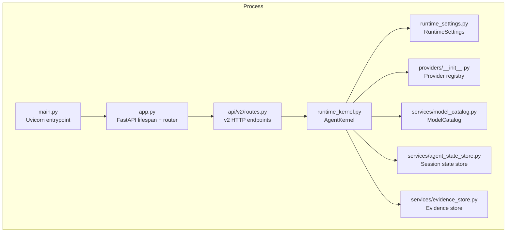
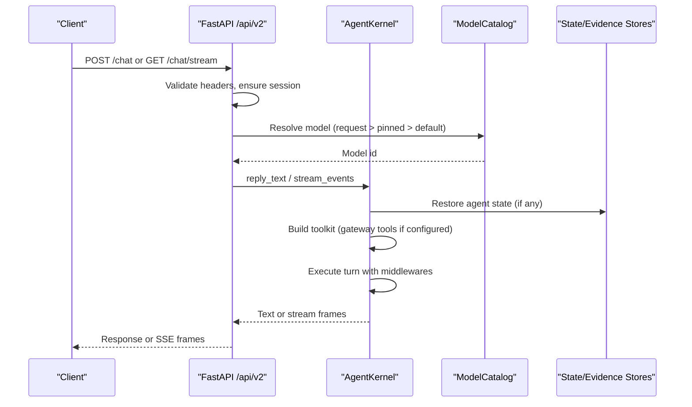
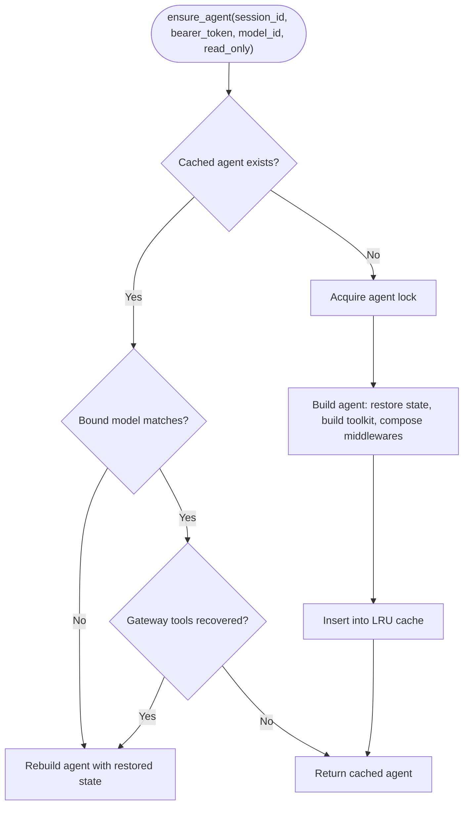
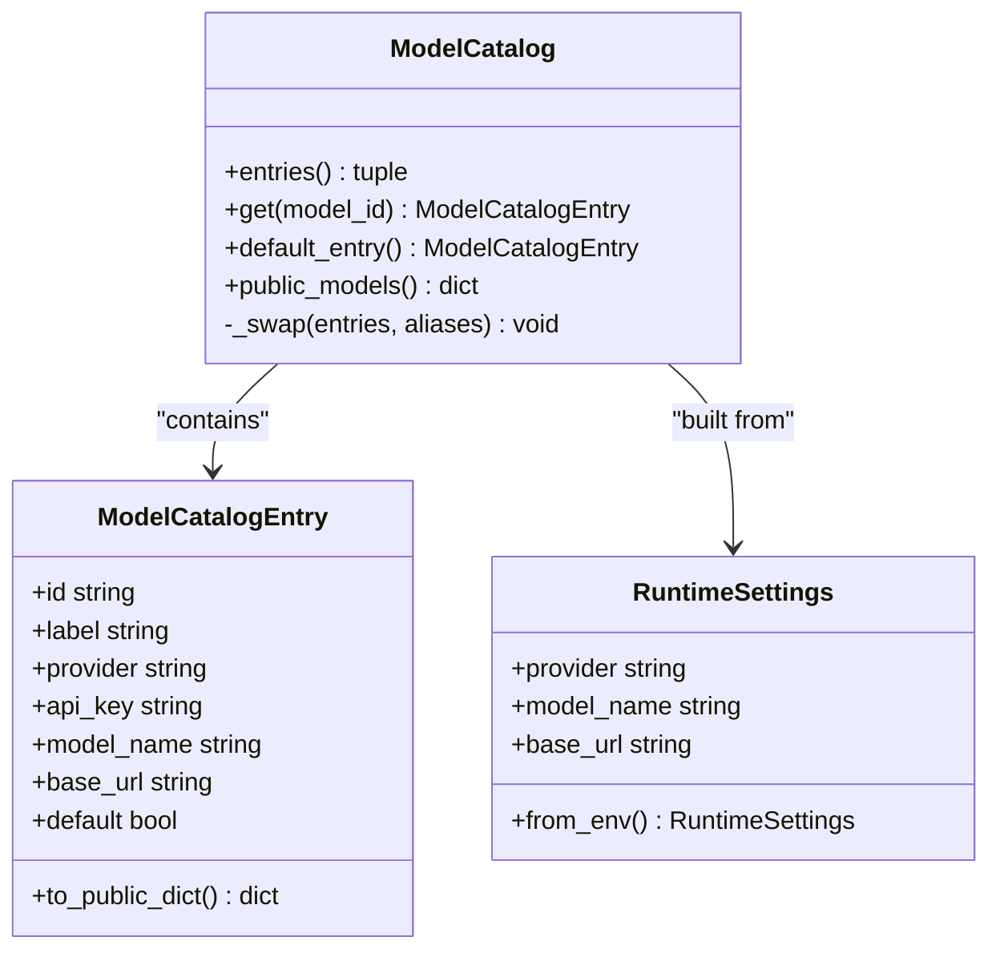
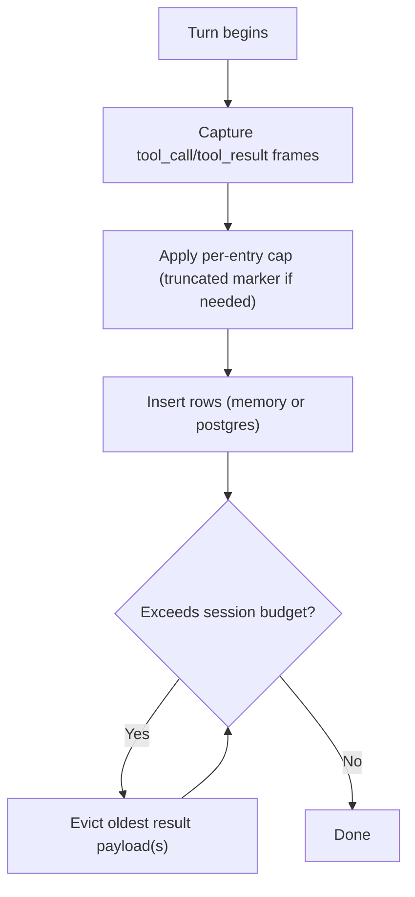
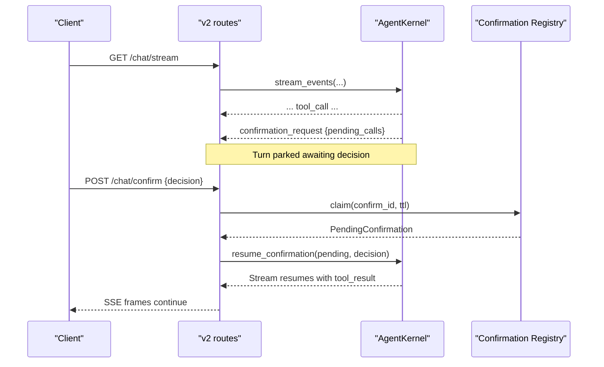
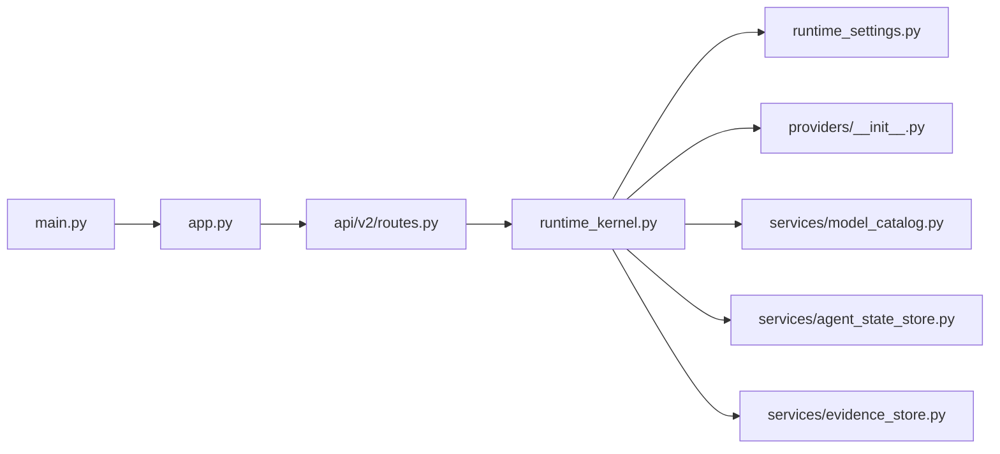

# Agent Platform

<cite>
**Referenced Files in This Document**
- [main.py](file://products/agent-platform/src/agent_service/main.py)
- [app.py](file://products/agent-platform/src/agent_service/app.py)
- [runtime_kernel.py](file://products/agent-platform/src/agent_service/runtime_kernel.py)
- [runtime_settings.py](file://products/agent-platform/src/agent_service/runtime_settings.py)
- [providers/__init__.py](file://products/agent-platform/src/agent_service/providers/__init__.py)
- [services/model_catalog.py](file://products/agent-platform/src/agent_service/services/model_catalog.py)
- [services/agent_state_store.py](file://products/agent-platform/src/agent_service/services/agent_state_store.py)
- [services/evidence_store.py](file://products/agent-platform/src/agent_service/services/evidence_store.py)
- [api/v2/routes.py](file://products/agent-platform/src/agent_service/api/v2/routes.py)
</cite>

## Table of Contents
1. Introduction
2. Project Structure
3. Core Components
4. Architecture Overview
5. Detailed Component Analysis
6. Dependency Analysis
7. Performance Considerations
8. Troubleshooting Guide
9. Conclusion

## Introduction
The Agent Platform is the orchestration engine of the Luban AIOps platform. It owns agent sessions, coordinates LLM model switching at runtime, drives tool execution via the Tool Gateway, and persists evidence for replay and audit. It exposes a FastAPI-based v2 contract that streams chat events, manages human-in-the-loop approvals, and integrates with session persistence backends (in-memory or PostgreSQL). The service also supports live model discovery and a credential-gated multi-model catalog so operators can switch models mid-conversation without losing conversation history.

## Project Structure
The Agent Platform service lives under products/agent-platform/src/agent_service and is organized into:
- Entrypoints and application bootstrap
- API routes implementing the v2 contract
- Runtime kernel that orchestrates AgentScope agents, tools, middleware, and streaming
- Provider registry and multi-model catalog
- Session state and evidence stores with pluggable backends
- Configuration and environment-driven settings

**Diagram sources**
- [main.py:1-22](file://products/agent-platform/src/agent_service/main.py#L1-L22)
- [app.py:19-79](file://products/agent-platform/src/agent_service/app.py#L19-L79)
- [api/v2/routes.py:276-365](file://products/agent-platform/src/agent_service/api/v2/routes.py#L276-L365)
- [runtime_kernel.py:212-774](file://products/agent-platform/src/agent_service/runtime_kernel.py#L212-L774)
- [runtime_settings.py:137-527](file://products/agent-platform/src/agent_service/runtime_settings.py#L137-L527)
- [providers/__init__.py:1-10](file://products/agent-platform/src/agent_service/providers/__init__.py#L1-L10)
- [services/model_catalog.py:236-331](file://products/agent-platform/src/agent_service/services/model_catalog.py#L236-L331)
- [services/agent_state_store.py:276-324](file://products/agent-platform/src/agent_service/services/agent_state_store.py#L276-L324)
- [services/evidence_store.py:504-551](file://products/agent-platform/src/agent_service/services/evidence_store.py#L504-L551)

**Section sources**
- [main.py:1-22](file://products/agent-platform/src/agent_service/main.py#L1-L22)
- [app.py:19-79](file://products/agent-platform/src/agent_service/app.py#L19-L79)

## Core Components
- Runtime kernel: Builds and caches per-session AgentScope agents, resolves models, composes middlewares, handles HITL parks/resumes, and persists evidence.
- Multi-model provider registry: Resolves providers and builds model instances from a credential-gated catalog; supports OpenAI, DashScope, DeepSeek, and Luban.
- Model catalog: Startup-curated series plus live discovery refresh; safe swap without invalidating references used by routes/kernel.
- Session state store: Persists AgentState snapshots to memory or PostgreSQL; restores on agent creation.
- Evidence store: Captures tool_call/tool_result frames per turn with size caps and budget eviction; persisted to memory or PostgreSQL.
- API v2 routes: Chat, streaming chat, confirmation bridge, session management, model catalog exposure, and evidence retrieval.

**Section sources**
- [runtime_kernel.py:212-774](file://products/agent-platform/src/agent_service/runtime_kernel.py#L212-L774)
- [services/model_catalog.py:1-331](file://products/agent-platform/src/agent_service/services/model_catalog.py#L1-L331)
- [services/agent_state_store.py:1-324](file://products/agent-platform/src/agent_service/services/agent_state_store.py#L1-L324)
- [services/evidence_store.py:1-551](file://products/agent-platform/src/agent_service/services/evidence_store.py#L1-L551)
- [api/v2/routes.py:276-800](file://products/agent-platform/src/agent_service/api/v2/routes.py#L276-L800)

## Architecture Overview
The request flow starts at the Uvicorn entrypoint, which boots the FastAPI app. The app configures logging, metrics, telemetry, and includes the v2 router. Routes validate identity headers, resolve sessions and models, then delegate to the runtime kernel. The kernel constructs or reuses an AgentScope agent bound to a session, optionally restoring persisted state, and executes turns with middleware for permissions, evidence capture, tracing, and token budgets. Streaming responses are normalized to the shared v2 schema and emitted as Server-Sent Events.

**Diagram sources**
- [app.py:19-79](file://products/agent-platform/src/agent_service/app.py#L19-L79)
- [api/v2/routes.py:276-365](file://products/agent-platform/src/agent_service/api/v2/routes.py#L276-L365)
- [runtime_kernel.py:662-774](file://products/agent-platform/src/agent_service/runtime_kernel.py#L662-L774)
- [services/model_catalog.py:236-331](file://products/agent-platform/src/agent_service/services/model_catalog.py#L236-L331)
- [services/agent_state_store.py:276-324](file://products/agent-platform/src/agent_service/services/agent_state_store.py#L276-L324)
- [services/evidence_store.py:504-551](file://products/agent-platform/src/agent_service/services/evidence_store.py#L504-L551)

## Detailed Component Analysis

### Runtime Kernel
The kernel is the central coordinator:
- Ensures one agent per session with LRU caching and per-token toolkit caching.
- Restores persisted AgentState on first use and snapshots after each completed turn.
- Switches models mid-conversation by rebuilding the agent while preserving memory through state restore.
- Composes middleware stack: gateway permission checks, tool evidence capture, optional tracing, and reply token budget control.
- Integrates with Tool Gateway by discovering tools per bearer token and filtering mutating tools when HITL bridging is disabled.
- Streams prose redaction safely, flushing held-back tails before terminal events.
- Persists evidence best-effort with size caps and session budgets.

**Diagram sources**
- [runtime_kernel.py:699-774](file://products/agent-platform/src/agent_service/runtime_kernel.py#L699-L774)
- [runtime_kernel.py:539-582](file://products/agent-platform/src/agent_service/runtime_kernel.py#L539-L582)
- [runtime_kernel.py:340-450](file://products/agent-platform/src/agent_service/runtime_kernel.py#L340-L450)
- [runtime_kernel.py:462-496](file://products/agent-platform/src/agent_service/runtime_kernel.py#L462-L496)
- [runtime_kernel.py:627-661](file://products/agent-platform/src/agent_service/runtime_kernel.py#L627-L661)

**Section sources**
- [runtime_kernel.py:212-774](file://products/agent-platform/src/agent_service/runtime_kernel.py#L212-L774)

### Multi-Model Provider Registry and Catalog
- Providers: The registry returns a provider adapter based on the active profile or catalog entry. Supported providers include dashscope, deepseek, openai, and luban.
- Catalog: Built at startup from environment variables per provider; supports overriding curated series and aliasing bare provider names to defaults. Live discovery periodically refreshes entries behind a fail-soft ladder and swaps contents atomically.
- Model switching: Routes resolve model ids using request > pinned > default; unknown ids fail closed. The kernel rebuilds the agent on model change while restoring state to preserve conversation history.

**Diagram sources**
- [services/model_catalog.py:49-68](file://products/agent-platform/src/agent_service/services/model_catalog.py#L49-L68)
- [services/model_catalog.py:236-331](file://products/agent-platform/src/agent_service/services/model_catalog.py#L236-L331)
- [runtime_settings.py:137-527](file://products/agent-platform/src/agent_service/runtime_settings.py#L137-L527)
- [providers/__init__.py:1-10](file://products/agent-platform/src/agent_service/providers/__init__.py#L1-L10)

**Section sources**
- [services/model_catalog.py:1-331](file://products/agent-platform/src/agent_service/services/model_catalog.py#L1-L331)
- [runtime_settings.py:137-527](file://products/agent-platform/src/agent_service/runtime_settings.py#L137-L527)
- [providers/__init__.py:1-10](file://products/agent-platform/src/agent_service/providers/__init__.py#L1-L10)

### Session Persistence and Evidence
- Agent state: Persisted per session as JSON snapshots; restored on agent creation. Backends: in-memory (dev/CI) and PostgreSQL (deployed). TTL-aware reads keep rows alive during active sessions; opportunistic sweep reclaims expired rows.
- Evidence: Captures tool_call and tool_result frames per turn with per-entry char caps and per-session byte budgets. Eviction nulls oldest result payloads while preserving metadata. Backends mirror the state store selection via AGENT_STATE_STORE_BACKEND and share AGENT_STATE_DB_URL.

**Diagram sources**
- [services/evidence_store.py:46-70](file://products/agent-platform/src/agent_service/services/evidence_store.py#L46-L70)
- [services/evidence_store.py:118-164](file://products/agent-platform/src/agent_service/services/evidence_store.py#L118-L164)
- [services/agent_state_store.py:152-260](file://products/agent-platform/src/agent_service/services/agent_state_store.py#L152-L260)

**Section sources**
- [services/agent_state_store.py:1-324](file://products/agent-platform/src/agent_service/services/agent_state_store.py#L1-L324)
- [services/evidence_store.py:1-551](file://products/agent-platform/src/agent_service/services/evidence_store.py#L1-L551)

### Human-in-the-Loop Approvals and Park/Resume
- Parking: When a tool call requires approval, the kernel emits a confirmation_request event with pending_calls and halts until resolved.
- Bridge: The confirm endpoint claims the parked confirmation, persists outcome at claim time, and resumes the turn with the decision. Expired parks are interrupted to avoid wedging sessions.
- Read-only mode: Automated diagnostic turns restrict toolkits to read-level tools to prevent accidental mutations.

**Diagram sources**
- [api/v2/routes.py:368-464](file://products/agent-platform/src/agent_service/api/v2/routes.py#L368-L464)
- [api/v2/routes.py:202-243](file://products/agent-platform/src/agent_service/api/v2/routes.py#L202-L243)
- [runtime_kernel.py:340-450](file://products/agent-platform/src/agent_service/runtime_kernel.py#L340-L450)

**Section sources**
- [api/v2/routes.py:202-464](file://products/agent-platform/src/agent_service/api/v2/routes.py#L202-L464)
- [runtime_kernel.py:340-450](file://products/agent-platform/src/agent_service/runtime_kernel.py#L340-L450)

### Tool Gateway Integration
- Discovery: On toolkit build, the kernel discovers available tools from the Tool Gateway using the delegated bearer token. Results are filtered for mutating tools when HITL bridging is disabled and restricted to read-only for automated diagnostic turns.
- No-tools guard: If no operational tools are reachable, a deterministic system notice is injected to prevent fabrication.
- Toolkit caching: Per bearer token to avoid repeated discovery; empty results are not cached so subsequent turns retry discovery.

**Section sources**
- [runtime_kernel.py:340-450](file://products/agent-platform/src/agent_service/runtime_kernel.py#L340-L450)
- [runtime_kernel.py:498-510](file://products/agent-platform/src/agent_service/runtime_kernel.py#L498-L510)

### Streaming Chat Responses
- Normalization: Kernel stream chunks are translated into the v2 schema, preserving tool_call/tool_result frames for evidence panels and ensuring only known event types pass through.
- Prose redaction: Streaming text is redacted for credentials; terminal events flush any held-back tail to avoid missing content in the UI.
- SSE: The streaming endpoint yields data lines with normalized events.

**Section sources**
- [api/v2/routes.py:559-663](file://products/agent-platform/src/agent_service/api/v2/routes.py#L559-L663)
- [runtime_kernel.py:182-209](file://products/agent-platform/src/agent_service/runtime_kernel.py#L182-L209)

## Dependency Analysis
- Application lifecycle: Uvicorn runs the FastAPI app created in app.py, which sets up logging, metrics, telemetry, and includes the v2 router.
- Kernel dependencies: Uses provider registry, model catalog, runtime settings, state/evidence stores, and middleware services.
- Route dependencies: Depends on runtime kernel, session services, model catalog, stores, and schemas.

**Diagram sources**
- [main.py:1-22](file://products/agent-platform/src/agent_service/main.py#L1-L22)
- [app.py:19-79](file://products/agent-platform/src/agent_service/app.py#L19-L79)
- [api/v2/routes.py:276-365](file://products/agent-platform/src/agent_service/api/v2/routes.py#L276-L365)
- [runtime_kernel.py:212-774](file://products/agent-platform/src/agent_service/runtime_kernel.py#L212-L774)
- [runtime_settings.py:137-527](file://products/agent-platform/src/agent_service/runtime_settings.py#L137-L527)
- [providers/__init__.py:1-10](file://products/agent-platform/src/agent_service/providers/__init__.py#L1-L10)
- [services/model_catalog.py:236-331](file://products/agent-platform/src/agent_service/services/model_catalog.py#L236-L331)
- [services/agent_state_store.py:276-324](file://products/agent-platform/src/agent_service/services/agent_state_store.py#L276-L324)
- [services/evidence_store.py:504-551](file://products/agent-platform/src/agent_service/services/evidence_store.py#L504-L551)

**Section sources**
- [app.py:19-79](file://products/agent-platform/src/agent_service/app.py#L19-L79)
- [api/v2/routes.py:276-365](file://products/agent-platform/src/agent_service/api/v2/routes.py#L276-L365)
- [runtime_kernel.py:212-774](file://products/agent-platform/src/agent_service/runtime_kernel.py#L212-L774)

## Performance Considerations
- Agent and toolkit caching: Per-session agent cache with LRU eviction and per-token toolkit cache reduce rebuild overhead and discovery calls.
- Middleware opt-ins: Tracing and reply token budget are configurable to balance observability and latency.
- Evidence sizing: Per-entry and per-session caps prevent unbounded storage growth; evictions preserve metadata for accurate cards.
- Model discovery: Periodic refresh with timeouts avoids blocking startup; failures degrade gracefully.

[No sources needed since this section provides general guidance]

## Troubleshooting Guide
- Unknown model id: Requests specifying an unrecognized model id fail closed with 422; verify the model exists in the catalog or remove the field to use pinned/default.
- Confirmation pending: New turns are rejected while a park is unresolved; answer or expire the parked confirmation before sending new messages.
- Evidence store unreadable: Evidence retrieval degrades to transcript_available=false without 500 errors; check backend configuration and connectivity.
- State store fallback: If Postgres is unavailable, agent state falls back to in-memory; monitor metrics for fallback counts.
- No tools available: When no operational tools are discovered, the kernel injects a system notice to prevent hallucinated infrastructure data.

**Section sources**
- [api/v2/routes.py:202-243](file://products/agent-platform/src/agent_service/api/v2/routes.py#L202-L243)
- [api/v2/routes.py:246-270](file://products/agent-platform/src/agent_service/api/v2/routes.py#L246-L270)
- [api/v2/routes.py:733-748](file://products/agent-platform/src/agent_service/api/v2/routes.py#L733-L748)
- [services/agent_state_store.py:276-324](file://products/agent-platform/src/agent_service/services/agent_state_store.py#L276-L324)
- [runtime_kernel.py:94-119](file://products/agent-platform/src/agent_service/runtime_kernel.py#L94-L119)

## Conclusion
The Agent Platform provides a robust, observable, and durable orchestration layer for AIOPS workflows. It centralizes session lifecycle, supports dynamic model switching across multiple providers, enforces safety through HITL approvals and read-only modes, and captures rich evidence for transparency and replay. With pluggable persistence, streaming responses, and careful error handling, it scales to concurrent sessions while maintaining reliability and auditability.