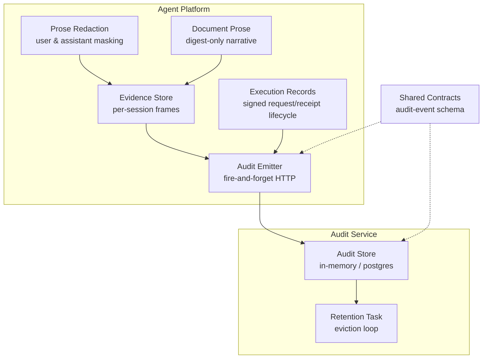
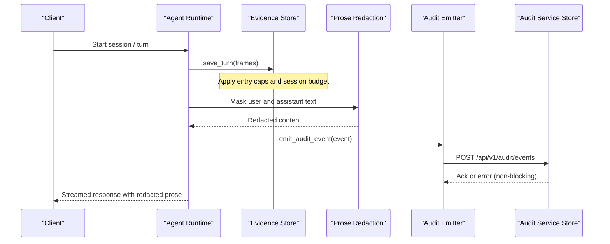
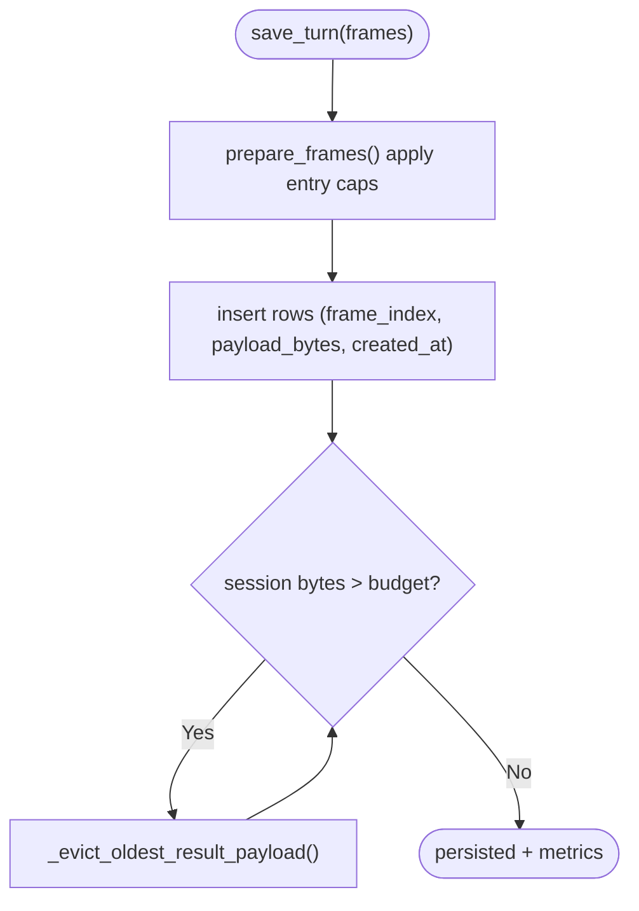
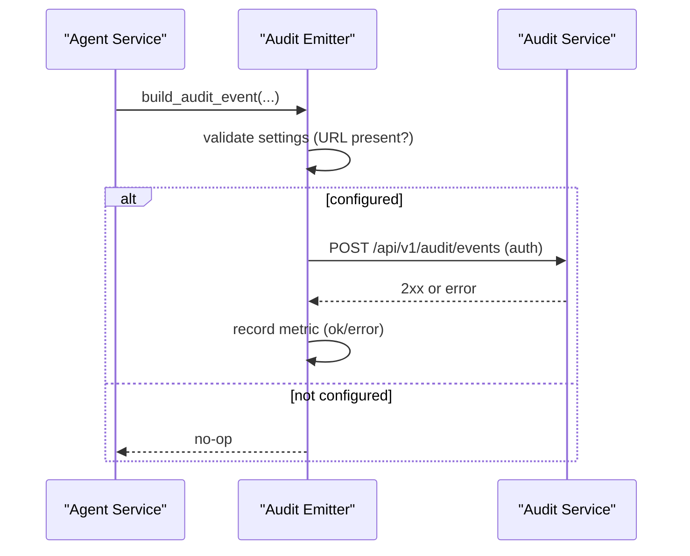
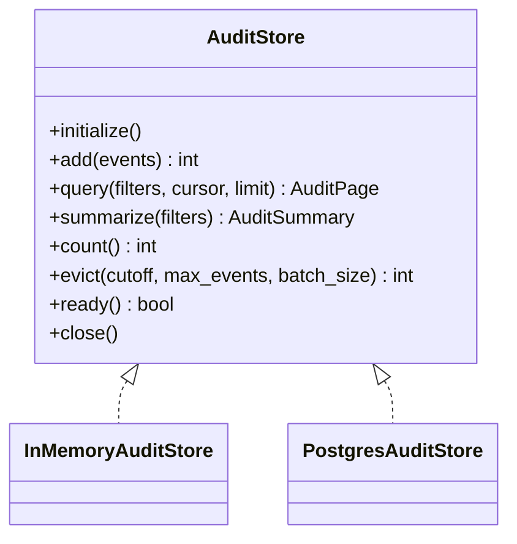
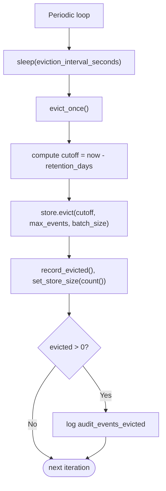
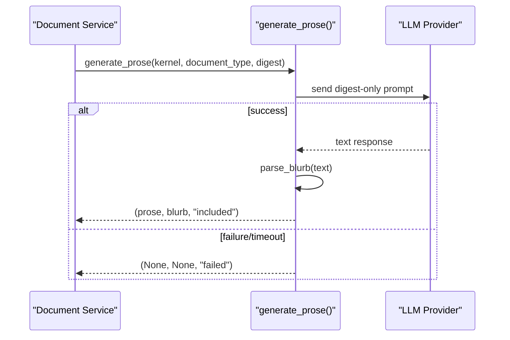
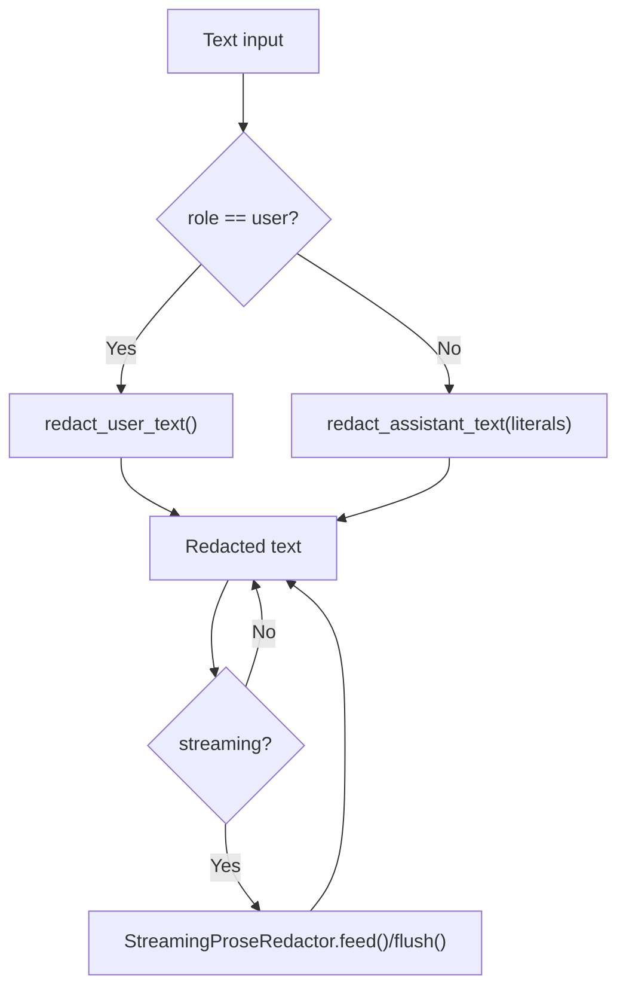
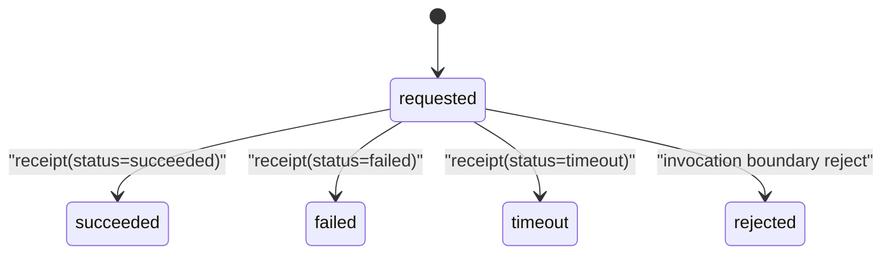
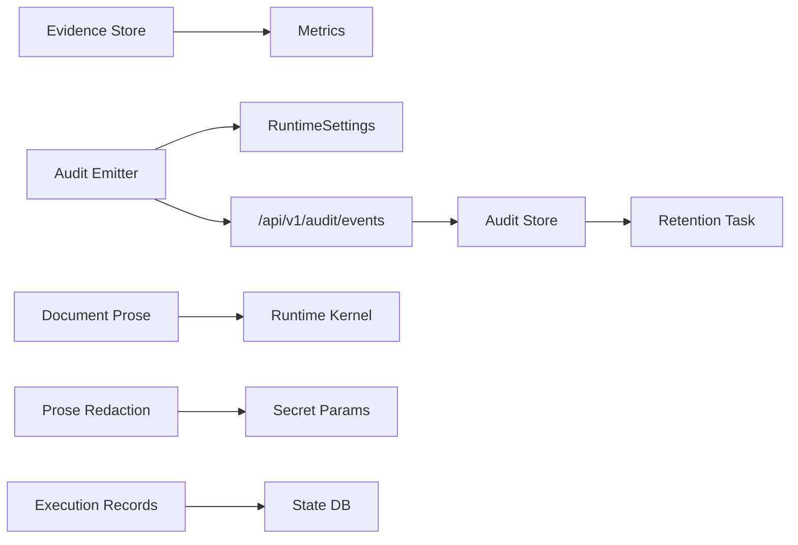

# Evidence Storage and Audit Trail

<cite>
**Referenced Files in This Document**
- [evidence_store.py](file://products/agent-platform/src/agent_service/services/evidence_store.py)
- [audit_emitter.py](file://products/agent-platform/src/agent_service/services/audit_emitter.py)
- [document_prose.py](file://products/agent-platform/src/agent_service/services/document_prose.py)
- [prose_redaction.py](file://products/agent-platform/src/agent_service/services/prose_redaction.py)
- [audit_store.py](file://products/audit-service/src/audit_service/services/audit_store.py)
- [retention.py](file://products/audit-service/src/audit_service/services/retention.py)
- [execution_records.py](file://products/agent-platform/src/agent_service/services/execution_records.py)
- [audit-event.schema.json](file://shared/shared-contracts/schemas/audit-event.schema.json)
</cite>

## Table of Contents
1. [Introduction](#introduction)
2. [Project Structure](#project-structure)
3. [Core Components](#core-components)
4. [Architecture Overview](#architecture-overview)
5. [Detailed Component Analysis](#detailed-component-analysis)
6. [Dependency Analysis](#dependency-analysis)
7. [Performance Considerations](#performance-considerations)
8. [Troubleshooting Guide](#troubleshooting-guide)
9. [Conclusion](#conclusion)
10. [Appendices](#appendices)

## Introduction
This document explains how the Agent Platform captures, stores, and manages execution evidence and audit trails. It covers:
- How tool outputs, model responses, and user interactions are captured as evidence frames and persisted per session.
- The evidence store architecture with in-memory and Postgres backends, size budgets, and TTL-based sweeps.
- Audit event emission from agent services to a durable audit service, including schema compliance and non-blocking delivery.
- Document prose generation that summarizes verified facts from digests without exposing raw transcripts or payloads.
- Sensitive data redaction across chat prose and streamed output to prevent credential leakage.
- Data retention policies for both evidence and audit events, query interfaces, and integration points for external audit systems.
- Privacy, compliance considerations, and performance optimization strategies for large-scale evidence collection.

## Project Structure
The evidence and audit capabilities span two primary products:
- Agent Platform (agent_service): evidence capture, storage, redaction, and audit emission.
- Audit Service (audit_service): durable ingestion, querying, summarization, and retention enforcement.

**Diagram sources**
- [evidence_store.py:1-15](file://products/agent-platform/src/agent_service/services/evidence_store.py#L1-L15)
- [audit_emitter.py:1-99](file://products/agent-platform/src/agent_service/services/audit_emitter.py#L1-L99)
- [prose_redaction.py:1-75](file://products/agent-platform/src/agent_service/services/prose_redaction.py#L1-L75)
- [document_prose.py:1-13](file://products/agent-platform/src/agent_service/services/document_prose.py#L1-L13)
- [execution_records.py:1-18](file://products/agent-platform/src/agent_service/services/execution_records.py#L1-L18)
- [audit_store.py:1-64](file://products/audit-service/src/audit_service/services/audit_store.py#L1-L64)
- [retention.py:1-76](file://products/audit-service/src/audit_service/services/retention.py#L1-L76)
- [audit-event.schema.json:1-94](file://shared/shared-contracts/schemas/audit-event.schema.json#L1-L94)

**Section sources**
- [evidence_store.py:1-15](file://products/agent-platform/src/agent_service/services/evidence_store.py#L1-L15)
- [audit_emitter.py:1-99](file://products/agent-platform/src/agent_service/services/audit_emitter.py#L1-L99)
- [audit_store.py:1-64](file://products/audit-service/src/audit_service/services/audit_store.py#L1-L64)
- [retention.py:1-76](file://products/audit-service/src/audit_service/services/retention.py#L1-L76)

## Core Components
- Per-session evidence store: Captures tool_call and tool_result frames, enforces per-entry caps and per-session budgets, supports in-memory and Postgres backends, and provides load/delete operations.
- Audit emitter: Builds canonical audit envelopes and delivers them asynchronously to the audit service over HTTP with authentication; failures do not degrade the agent path.
- Audit store: Stores and queries audit events with filtering and cursor pagination; supports in-memory and Postgres backends; provides summarization and eviction.
- Retention task: Periodically evicts old audit events by configured retention days and hard cap, batching deletes to avoid blocking ingest.
- Document prose generator: Produces concise narratives from digest-only inputs with strict anchoring rules; fails softly if model calls fail.
- Prose redaction: Masks credentials in user-authored and assistant text using pinned shapes, URL query parameters, key=value pairs, and heuristics; includes streaming-safe redaction.
- Execution records: Persists signed execution request/receipt lifecycle for approved mutating tool calls with retention sweeps.

**Section sources**
- [evidence_store.py:34-107](file://products/agent-platform/src/agent_service/services/evidence_store.py#L34-L107)
- [audit_emitter.py:30-99](file://products/agent-platform/src/agent_service/services/audit_emitter.py#L30-L99)
- [audit_store.py:42-64](file://products/audit-service/src/audit_service/services/audit_store.py#L42-L64)
- [retention.py:27-76](file://products/audit-service/src/audit_service/services/retention.py#L27-L76)
- [document_prose.py:1-13](file://products/agent-platform/src/agent_service/services/document_prose.py#L1-L13)
- [prose_redaction.py:21-75](file://products/agent-platform/src/agent_service/services/prose_redaction.py#L21-L75)
- [execution_records.py:1-18](file://products/agent-platform/src/agent_service/services/execution_records.py#L1-L18)

## Architecture Overview
End-to-end flow for evidence and audit trail:

**Diagram sources**
- [evidence_store.py:118-164](file://products/agent-platform/src/agent_service/services/evidence_store.py#L118-L164)
- [prose_redaction.py:249-456](file://products/agent-platform/src/agent_service/services/prose_redaction.py#L249-L456)
- [audit_emitter.py:68-99](file://products/agent-service/src/audit_service/services/audit_store.py#L68-L99)
- [audit_store.py:357-415](file://products/audit-service/src/audit_service/services/audit_store.py#L357-L415)

## Detailed Component Analysis

### Evidence Store
Captures tool_call and tool_result frames per session turn, applies size caps, and enforces per-session budgets by evicting oldest result payloads. Supports in-memory and Postgres backends with shared logic for cap enforcement and grouping.

Key behaviors:
- Frame types persisted: tool_call, tool_result.
- Per-entry cap replaces oversized data with truncated preview plus marker.
- Per-session budget evicts oldest result payloads while preserving metadata.
- Backends: InMemoryEvidenceStore and PostgresEvidenceStore share base logic.
- TTL sweep on Postgres via updated_at timestamps during writes.

**Diagram sources**
- [evidence_store.py:46-70](file://products/agent-platform/src/agent_service/services/evidence_store.py#L46-L70)
- [evidence_store.py:118-164](file://products/agent-platform/src/agent_service/services/evidence_store.py#L118-L164)
- [evidence_store.py:232-248](file://products/agent-platform/src/agent_service/services/evidence_store.py#L232-L248)
- [evidence_store.py:437-459](file://products/agent-platform/src/agent_service/services/evidence_store.py#L437-L459)

**Section sources**
- [evidence_store.py:34-107](file://products/agent-platform/src/agent_service/services/evidence_store.py#L34-L107)
- [evidence_store.py:118-180](file://products/agent-platform/src/agent_service/services/evidence_store.py#L118-L180)
- [evidence_store.py:211-273](file://products/agent-platform/src/agent_service/services/evidence_store.py#L211-L273)
- [evidence_store.py:280-357](file://products/agent-platform/src/agent_service/services/evidence_store.py#L280-L357)
- [evidence_store.py:362-497](file://products/agent-platform/src/agent_service/services/evidence_store.py#L362-L497)

### Audit Emission
Builds canonical audit envelopes matching the shared contract and delivers them asynchronously to the audit service. Delivery is fire-and-forget with short timeouts; failures are logged and counted but never block the agent path.

**Diagram sources**
- [audit_emitter.py:30-99](file://products/agent-platform/src/agent_service/services/audit_emitter.py#L30-L99)
- [audit-event.schema.json:1-94](file://shared/shared-contracts/schemas/audit-event.schema.json#L1-L94)

**Section sources**
- [audit_emitter.py:1-99](file://products/agent-platform/src/agent_service/services/audit_emitter.py#L1-L99)
- [audit-event.schema.json:1-94](file://shared/shared-contracts/schemas/audit-event.schema.json#L1-L94)

### Audit Store and Query Interface
Stores audit events verbatim and exposes filtered, paginated queries and summaries. Supports in-memory and Postgres backends with consistent behavior.

Capabilities:
- Add events idempotently by event_id.
- Query with filters (username, session_id, request_id, event_type, service, outcome, time window) and cursor pagination.
- Summarize counts by event type, outcome, service, top actors, and decision chain.
- Evict by cutoff date and max_events with batched deletes.

**Diagram sources**
- [audit_store.py:42-64](file://products/audit-service/src/audit_service/services/audit_store.py#L42-L64)
- [audit_store.py:93-157](file://products/audit-service/src/audit_service/services/audit_store.py#L93-L157)
- [audit_store.py:324-547](file://products/audit-service/src/audit_service/services/audit_store.py#L324-L547)

**Section sources**
- [audit_store.py:1-64](file://products/audit-service/src/audit_service/services/audit_store.py#L1-L64)
- [audit_store.py:93-157](file://products/audit-service/src/audit_service/services/audit_store.py#L93-L157)
- [audit_store.py:188-219](file://products/audit-service/src/audit_service/services/audit_store.py#L188-L219)
- [audit_store.py:324-547](file://products/audit-service/src/audit_service/services/audit_store.py#L324-L547)

### Retention Policies
Retention runs periodically inside the audit service lifespan:
- Evicts events older than configured retention days.
- Enforces a hard cap on total events.
- Batches deletes to avoid blocking ingest.
- Records metrics and logs evictions.

**Diagram sources**
- [retention.py:27-76](file://products/audit-service/src/audit_service/services/retention.py#L27-L76)
- [audit_store.py:498-533](file://products/audit-service/src/audit_service/services/audit_store.py#L498-L533)

**Section sources**
- [retention.py:1-76](file://products/audit-service/src/audit_service/services/retention.py#L1-L76)
- [audit_store.py:498-533](file://products/audit-service/src/audit_service/services/audit_store.py#L498-L533)

### Document Prose Generation
Generates human-readable narratives anchored strictly to digest JSON inputs. Uses a timeout to prevent hangs and fails softly when model calls fail, returning failed status without affecting document creation.

Key aspects:
- Digest-only prompt contract prevents exposure of raw transcripts or payloads.
- Templates for shift handover and incident review.
- Parses SUMMARY blurb and full prose; blurb bounded in length.
- Fail-soft posture ensures robustness.

**Diagram sources**
- [document_prose.py:133-198](file://products/agent-platform/src/agent_service/services/document_prose.py#L133-L198)

**Section sources**
- [document_prose.py:1-13](file://products/agent-platform/src/agent_service/services/document_prose.py#L1-L13)
- [document_prose.py:133-198](file://products/agent-platform/src/agent_service/services/document_prose.py#L133-L198)

### Sensitive Data Redaction
Applies multi-layer redaction to protect credentials in chat prose and streamed output:
- User-authored text: pinned shapes, URL query parameters, key=value pairs, heuristic token masking when secret names are present.
- Assistant text: pinned shapes, URL query parameters, exact match against literals harvested from user text; avoids heuristic to prevent false positives.
- Streaming redactor holds back partial matches (URL schemes, shape anchors, literal boundaries) to ensure complete tokens are masked before emission.

**Diagram sources**
- [prose_redaction.py:249-456](file://products/agent-platform/src/agent_service/services/prose_redaction.py#L249-L456)
- [prose_redaction.py:459-630](file://products/agent-platform/src/agent_service/services/prose_redaction.py#L459-L630)

**Section sources**
- [prose_redaction.py:1-75](file://products/agent-platform/src/agent_service/services/prose_redaction.py#L1-L75)
- [prose_redaction.py:249-456](file://products/agent-platform/src/agent_service/services/prose_redaction.py#L249-L456)
- [prose_redaction.py:459-630](file://products/agent-platform/src/agent_service/services/prose_redaction.py#L459-L630)

### Execution Records
Persists lifecycle of signed execution requests for approved mutating tool calls:
- Request recorded at resume; receipt closes it with status and optional digest match.
- Rejection marks row without receipt.
- Retention sweep removes expired rows opportunistically.

**Diagram sources**
- [execution_records.py:33-60](file://products/agent-platform/src/agent_service/services/execution_records.py#L33-L60)
- [execution_records.py:186-267](file://products/agent-platform/src/agent_service/services/execution_records.py#L186-L267)

**Section sources**
- [execution_records.py:1-18](file://products/agent-platform/src/agent_service/services/execution_records.py#L1-L18)
- [execution_records.py:33-60](file://products/agent-platform/src/agent_service/services/execution_records.py#L33-L60)
- [execution_records.py:186-267](file://products/agent-platform/src/agent_service/services/execution_records.py#L186-L267)

## Dependency Analysis
- Evidence store depends on metrics recording and environment configuration; shares state-store backend selection with other components.
- Audit emitter depends on runtime settings and HTTP client; emits to audit service endpoint with auth.
- Audit store depends on schemas and configuration; provides in-memory and Postgres implementations.
- Retention task depends on audit store and settings; orchestrates periodic eviction.
- Document prose depends on runtime kernel model provider and message structures.
- Prose redaction depends on secret parameter utilities and skill draft patterns; integrates with transcript and stream flows.
- Execution records depend on environment configuration and Postgres driver; share lifecycle with state store.

**Diagram sources**
- [evidence_store.py:27-30](file://products/agent-platform/src/agent_service/services/evidence_store.py#L27-L30)
- [audit_emitter.py:20-27](file://products/agent-platform/src/agent_service/services/audit_emitter.py#L20-L27)
- [audit_store.py:18-27](file://products/audit-service/src/audit_service/services/audit_store.py#L18-L27)
- [retention.py:15-22](file://products/audit-service/src/audit_service/services/retention.py#L15-L22)
- [document_prose.py:167-179](file://products/agent-platform/src/agent_service/services/document_prose.py#L167-L179)
- [prose_redaction.py:84-89](file://products/agent-platform/src/agent_service/services/prose_redaction.py#L84-L89)
- [execution_records.py:453-494](file://products/agent-platform/src/agent_service/services/execution_records.py#L453-L494)

**Section sources**
- [evidence_store.py:27-30](file://products/agent-platform/src/agent_service/services/evidence_store.py#L27-L30)
- [audit_emitter.py:20-27](file://products/agent-platform/src/agent_service/services/audit_emitter.py#L20-L27)
- [audit_store.py:18-27](file://products/audit-service/src/audit_service/services/audit_store.py#L18-L27)
- [retention.py:15-22](file://products/audit-service/src/audit_service/services/retention.py#L15-L22)
- [document_prose.py:167-179](file://products/agent-platform/src/agent_service/services/document_prose.py#L167-L179)
- [prose_redaction.py:84-89](file://products/agent-platform/src/agent_service/services/prose_redaction.py#L84-L89)
- [execution_records.py:453-494](file://products/agent-platform/src/agent_service/services/execution_records.py#L453-L494)

## Performance Considerations
- Evidence frame caps and session budgets prevent unbounded growth; evictions preserve metadata while reducing payload sizes.
- Postgres-backed evidence store uses TTL sweeps on writes to reclaim expired rows efficiently.
- Audit emission is asynchronous with short timeouts to avoid blocking agent paths; failures are counted and logged.
- Audit store queries use indexes and cursor pagination to scale reads; summaries group by envelope columns only.
- Retention task batches deletions to minimize lock contention and keep ingest responsive.
- Prose redaction caches pattern compilation and uses streaming buffers to avoid splitting sensitive tokens across deltas.
- Execution records use idempotent inserts and single-close receipts to reduce duplicate writes.

[No sources needed since this section provides general guidance]

## Troubleshooting Guide
Common issues and diagnostics:
- Evidence store Postgres unavailable: falls back to in-memory; check AGENT_STATE_DB_URL and backend setting; inspect initialization logs.
- Audit emit failures: verify AUDIT_SERVICE_URL and credentials; check emitted metrics and warning logs for transport errors.
- Retention eviction errors: monitor eviction metrics and logs; ensure eviction interval and batch size are appropriate for workload.
- Prose generation failures: model timeouts or empty replies result in failed status; confirm model availability and timeout settings.
- Redaction false positives/negatives: review layered approach; ensure user text harvesting and assistant masking are applied correctly; validate streaming flush usage.
- Execution record mismatches: confirm receipt status transitions and digest match flags; check rejection reasons when applicable.

**Section sources**
- [evidence_store.py:504-546](file://products/agent-platform/src/agent_service/services/evidence_store.py#L504-L546)
- [audit_emitter.py:68-99](file://products/agent-platform/src/agent_service/services/audit_emitter.py#L68-L99)
- [retention.py:45-76](file://products/audit-service/src/audit_service/services/retention.py#L45-L76)
- [document_prose.py:154-198](file://products/agent-platform/src/agent_service/services/document_prose.py#L154-L198)
- [prose_redaction.py:459-630](file://products/agent-platform/src/agent_service/services/prose_redaction.py#L459-L630)
- [execution_records.py:378-436](file://products/agent-platform/src/agent_service/services/execution_records.py#L378-L436)

## Conclusion
The Agent Platform implements a robust, scalable evidence and audit trail system:
- Evidence frames are captured per session with strict size controls and durable storage options.
- Audit events are emitted reliably and stored with strong querying and summarization capabilities.
- Document prose generation adheres to a digest-only contract to maintain privacy and accuracy.
- Sensitive data redaction protects credentials across user and assistant text, including streaming contexts.
- Retention policies enforce data lifecycle management for both evidence and audit events.
- Integration points enable external audit systems to consume standardized events.

[No sources needed since this section summarizes without analyzing specific files]

## Appendices

### Example: Collecting Evidence During Sessions
- Capture tool_call and tool_result frames per turn; apply entry caps and session budgets.
- Persist frames via evidence store; load turns for replay or UI rendering.
- Use metrics to track truncation and persistence counts.

**Section sources**
- [evidence_store.py:46-70](file://products/agent-platform/src/agent_service/services/evidence_store.py#L46-L70)
- [evidence_store.py:118-180](file://products/agent-platform/src/agent_service/services/evidence_store.py#L118-L180)

### Example: Generating Audit Reports
- Query audit events with filters and cursor pagination.
- Summarize counts by event type, outcome, service, top actors, and decision chain.
- Export pages for reporting or downstream analysis.

**Section sources**
- [audit_store.py:386-415](file://products/audit-service/src/audit_service/services/audit_store.py#L386-L415)
- [audit_store.py:417-489](file://products/audit-service/src/audit_service/services/audit_store.py#L417-L489)

### Example: Implementing Custom Retention Policies
- Configure retention days and max events in audit settings.
- Adjust eviction interval and batch size to balance throughput and storage.
- Monitor eviction metrics and logs to tune policy.

**Section sources**
- [retention.py:27-76](file://products/audit-service/src/audit_service/services/retention.py#L27-L76)
- [audit_store.py:498-533](file://products/audit-service/src/audit_service/services/audit_store.py#L498-L533)

### Example: Integrating with External Audit Systems
- Emit audit events to external endpoints by configuring audit service URL and credentials.
- Ensure events conform to the shared audit-event schema.
- Handle non-blocking delivery and monitor metrics for success/failure.

**Section sources**
- [audit_emitter.py:68-99](file://products/agent-platform/src/agent_service/services/audit_emitter.py#L68-L99)
- [audit-event.schema.json:1-94](file://shared/shared-contracts/schemas/audit-event.schema.json#L1-L94)

### Data Privacy and Compliance Considerations
- Redaction layers prevent credential leakage in user and assistant text.
- Digest-only prose generation avoids exposing raw transcripts or payloads.
- Evidence payloads are capped and may be truncated to protect sensitive data.
- Audit events include minimal identity fields and outcomes; details are per-event-type and can be tailored.

**Section sources**
- [prose_redaction.py:21-75](file://products/agent-platform/src/agent_service/services/prose_redaction.py#L21-L75)
- [document_prose.py:1-13](file://products/agent-platform/src/agent_service/services/document_prose.py#L1-L13)
- [evidence_store.py:46-70](file://products/agent-platform/src/agent_service/services/evidence_store.py#L46-L70)
- [audit-event.schema.json:1-94](file://shared/shared-contracts/schemas/audit-event.schema.json#L1-L94)