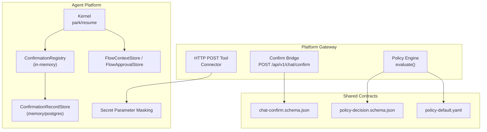
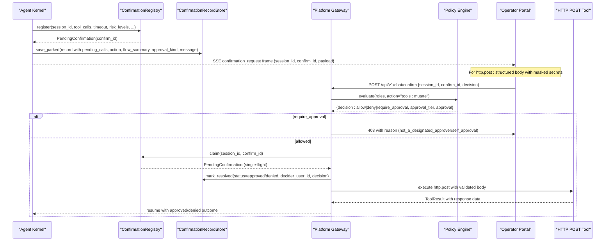
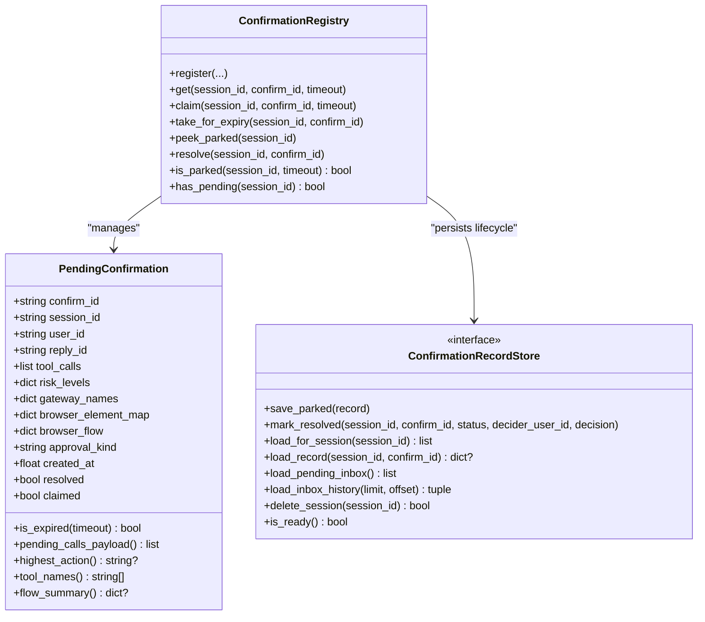
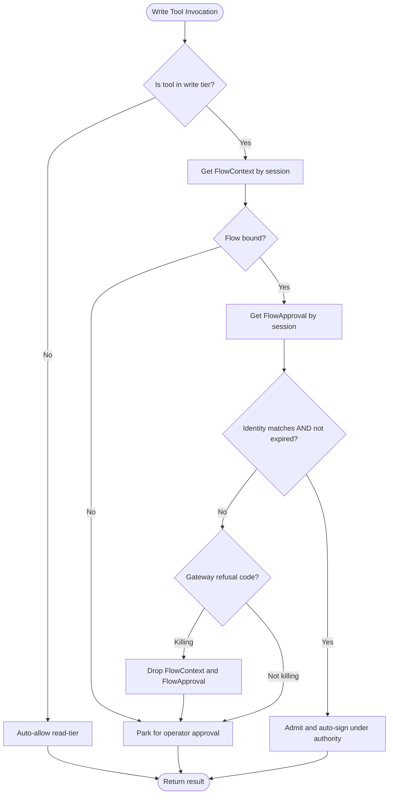
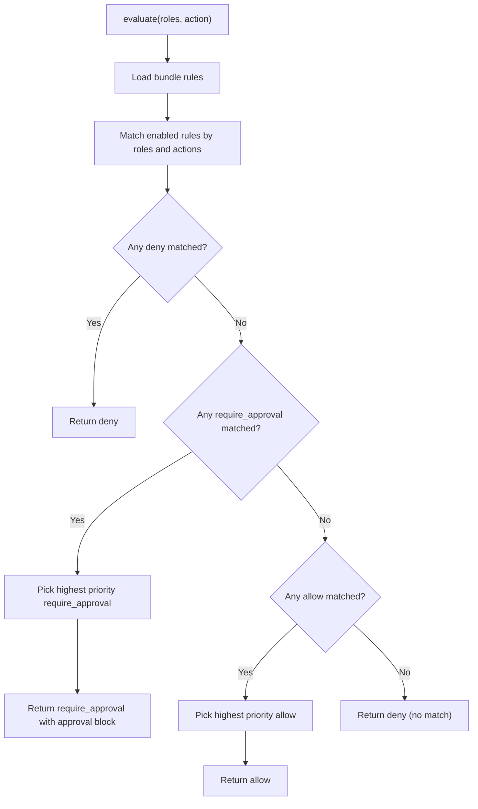
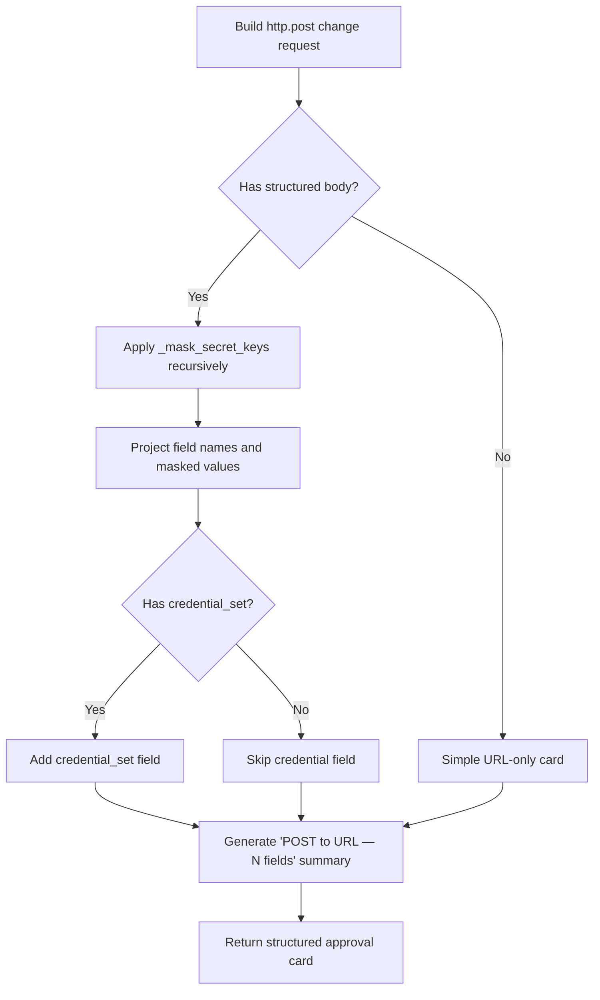
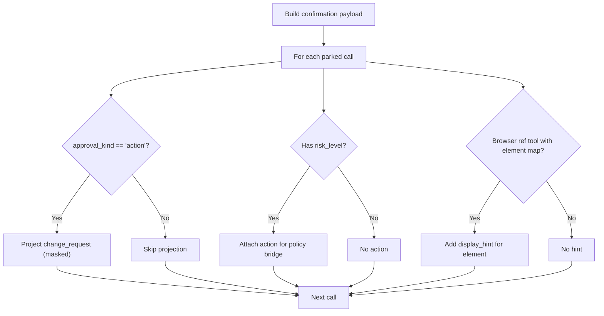
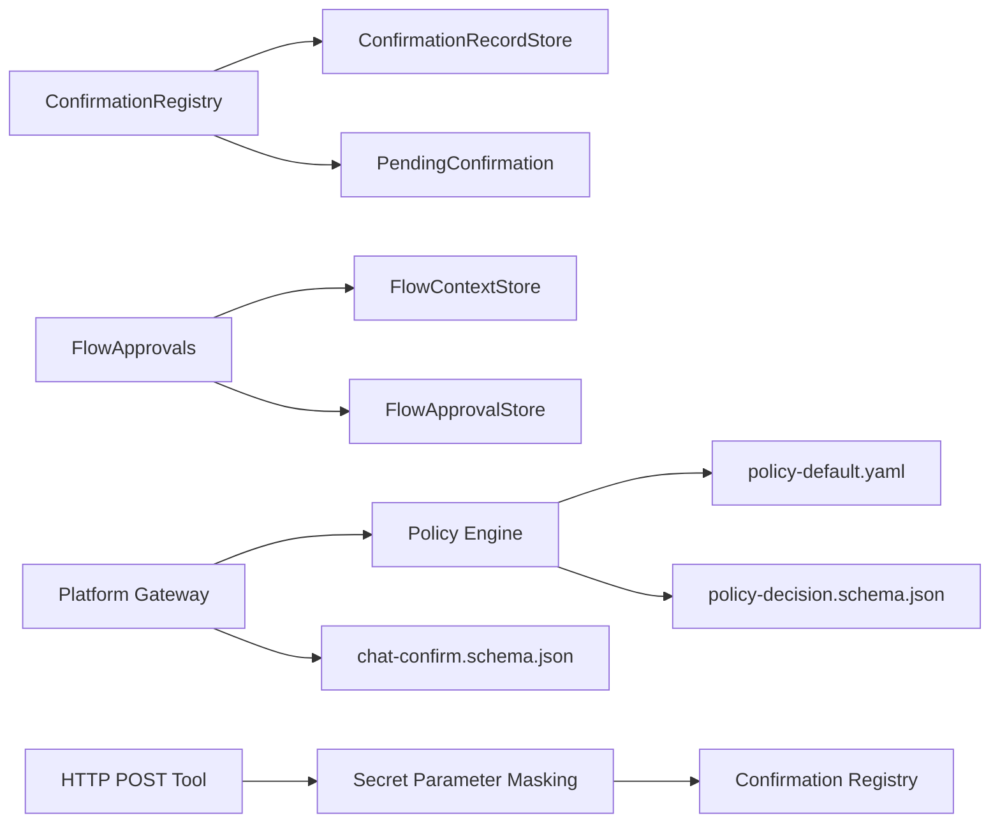

# Human-in-the-Loop Approvals

<cite>
**Referenced Files in This Document**
- [flow_approvals.py](file://products/agent-platform/src/agent_service/services/flow_approvals.py)
- [hitl_confirmations.py](file://products/agent-platform/src/agent_service/services/hitl_confirmations.py)
- [confirmation_records.py](file://products/agent-platform/src/agent_service/services/confirmation_records.py)
- [policy_engine.py](file://products/platform-gateway/src/platform_gateway/services/policy_engine.py)
- [secret_params.py](file://products/agent-platform/src/agent_service/services/secret_params.py)
- [http_connector.py](file://products/tool-gateway/src/tool_gateway/tools/http_connector.py)
- [policy-default.yaml](file://shared/shared-contracts/policies/policy-default.yaml)
- [chat-confirm.schema.json](file://shared/shared-contracts/schemas/chat-confirm.schema.json)
- [policy-decision.schema.json](file://shared/shared-contracts/schemas/policy-decision.schema.json)
- [approval-and-hitl.md](file://docs/guides/approval-and-hitl.md)
- [SPEC-058-http-service-check-tools/spec.md](file://docs/specs/SPEC-058-http-service-check-tools/spec.md)
</cite>

## Update Summary
**Changes Made**
- Added comprehensive documentation for HTTP POST operations with shape-preserving body rendering
- Enhanced approval card generation for `http.post` tool with meaningful field display
- Updated parameter masking implementation with fail-closed posture and KNOWN_SAFE_FIELDS
- Added detailed coverage of secret query parameter handling and credential set support
- Expanded testing examples for nested body structures and security validation

## Table of Contents
1. Introduction
2. Project Structure
3. Core Components
4. Architecture Overview
5. Detailed Component Analysis
6. Dependency Analysis
7. Performance Considerations
8. Troubleshooting Guide
9. Conclusion
10. Appendices

## Introduction
This document explains how the Agent Platform implements human-in-the-loop (HITL) approval workflows for risky operations. It covers:
- Approval gates that park mutating tool calls until an operator decides
- Confirmation card generation and display hints for browser tools
- Decision synchronization between agents, operators, and the policy engine
- Flow approvals for multi-step browser flows with identity-scoped auto-signing
- **Enhanced HTTP POST operations with shape-preserving body rendering and parameter masking**
- Risk tier classification, tool categorization (read vs write), and escalation paths
- Configuration examples, custom flow considerations, and auditing
- Race condition handling, timeout management, and user experience guidance

## Project Structure
The HITL system spans several services and shared contracts:
- Agent platform runtime kernel bridges kernel ASK decisions to a confirmation registry and durable records
- Platform gateway enforces policy outcomes including require_approval tiers on the confirm path
- Shared schemas define request/response contracts for confirmations and policy decisions
- Default policy bundle defines roles, actions, and approval tiers
- **HTTP POST tool integration with structured body rendering and security validation**

**Diagram sources**
- [hitl_confirmations.py:452-595](file://products/agent-platform/src/agent_service/services/hitl_confirmations.py#L452-L595)
- [confirmation_records.py:141-245](file://products/agent-platform/src/agent_service/services/confirmation_records.py#L141-L245)
- [flow_approvals.py:124-274](file://products/agent-platform/src/agent_service/services/flow_approvals.py#L124-L274)
- [policy_engine.py:390-444](file://products/platform-gateway/src/platform_gateway/services/policy_engine.py#L390-L444)
- [secret_params.py:136-153](file://products/agent-platform/src/agent_service/services/secret_params.py#L136-L153)
- [http_connector.py:654-686](file://products/tool-gateway/src/tool_gateway/tools/http_connector.py#L654-L686)

**Section sources**
- [approval-and-hitl.md:7-90](file://docs/guides/approval-and-hitl.md#L7-L90)

## Core Components
- ConfirmationRegistry: per-process registry of parked confirmations with single-flight claim, TTL expiry, and resolution
- ConfirmationRecordStore: durable persistence of parked and resolved confirmations (memory or Postgres)
- FlowApprovals: session-scoped flow context and approval stores enabling auto-signing within a bounded flow identity and TTL
- PolicyEngine: evaluates role/action against the policy bundle; supports allow/deny/require_approval with tiers
- **Secret Parameter Masking: fail-closed posture with KNOWN_SAFE_FIELDS allow-list and shape-preserving rendering**
- **HTTP POST Tool: structured body validation, credential set support, and security enforcement**
- Schemas: chat-confirm schema for operator decisions; policy-decision schema for evaluation results

Key behaviors:
- Mutating tool calls are parked and surfaced as confirmation cards
- The confirm bridge enforces policy tiers before resuming
- Flow approvals scope auto-signed writes to a specific skill/origin binding while alive
- Records survive restarts and support inbox/history views
- **HTTP POST operations render structured bodies with masked secrets while preserving JSON structure**

**Section sources**
- [hitl_confirmations.py:47-181](file://products/agent-platform/src/agent_service/services/hitl_confirmations.py#L47-L181)
- [confirmation_records.py:52-92](file://products/agent-platform/src/agent_service/services/confirmation_records.py#L52-L92)
- [flow_approvals.py:78-122](file://products/agent-platform/src/agent_service/services/flow_approvals.py#L78-L122)
- [policy_engine.py:142-210](file://products/platform-gateway/src/platform_gateway/services/policy_engine.py#L142-L210)
- [secret_params.py:136-153](file://products/agent-platform/src/agent_service/services/secret_params.py#L136-L153)
- [http_connector.py:654-686](file://products/tool-gateway/src/tool_gateway/tools/http_connector.py#L654-L686)

## Architecture Overview
End-to-end flow from agent parking to operator decision and execution:

**Diagram sources**
- [hitl_confirmations.py:468-534](file://products/agent-platform/src/agent_service/services/hitl_confirmations.py#L468-L534)
- [confirmation_records.py:543-604](file://products/agent-platform/src/agent_service/services/confirmation_records.py#L543-L604)
- [policy_engine.py:390-444](file://products/platform-gateway/src/platform_gateway/services/policy_engine.py#L390-L444)
- [http_connector.py:654-686](file://products/tool-gateway/src/tool_gateway/tools/http_connector.py#L654-L686)

## Detailed Component Analysis

### Confirmation Registry and Durable Records
- Parking: the kernel registers a PendingConfirmation with tool calls, risk levels, gateway names, browser element map, flow summary, and approval kind
- Display: pending_calls_payload serializes tool calls, injects change_request for action cards, masks secrets, and attaches risk_level/action for policy bridging
- Single-flight: claim marks the entry claimed to prevent double-resume; take_for_expiry claims for cleanup without racing decision paths
- Resolution: resolve clears the entry; mark_resolved persists status, decider, decision, and timestamps
- Persistence: InMemory and Postgres backends share the same interface; Postgres initializes tables, migrates columns, and sweeps stale rows at startup

**Diagram sources**
- [hitl_confirmations.py:47-181](file://products/agent-platform/src/agent_service/services/hitl_confirmations.py#L47-L181)
- [hitl_confirmations.py:452-595](file://products/agent-platform/src/agent_service/services/hitl_confirmations.py#L452-L595)
- [confirmation_records.py:99-134](file://products/agent-platform/src/agent_service/services/confirmation_records.py#L99-L134)

**Section sources**
- [hitl_confirmations.py:98-181](file://products/agent-platform/src/agent_service/services/hitl_confirmations.py#L98-L181)
- [hitl_confirmations.py:452-595](file://products/agent-platform/src/agent_service/services/hitl_confirmations.py#L452-L595)
- [confirmation_records.py:141-245](file://products/agent-platform/src/agent_service/services/confirmation_records.py#L141-L245)
- [confirmation_records.py:492-686](file://products/agent-platform/src/agent_service/services/confirmation_records.py#L492-L686)

### Flow Approvals (Browser Flow Identity and Auto-Signing)
- FlowContext reflects the gateway-bound browser flow identity (skill_id, origin) and metadata used for card headlines and intent
- FlowApproval scopes auto-signing authority to the approved flow identity with a TTL; subsequent writes in the same flow are admitted while identity matches and TTL holds
- Write-tier tools include web.click, web.type, web.select, web.press_key, web.upload_file, web.evaluate, and **http.post**
- Flow-killing error codes drop both context and approval to prevent stale authority

**Diagram sources**
- [flow_approvals.py:41-75](file://products/agent-platform/src/agent_service/services/flow_approvals.py#L41-L75)
- [flow_approvals.py:78-122](file://products/agent-platform/src/agent_service/services/flow_approvals.py#L78-L122)
- [flow_approvals.py:167-259](file://products/agent-platform/src/agent_service/services/flow_approvals.py#L167-L259)

**Section sources**
- [flow_approvals.py:41-75](file://products/agent-platform/src/agent_service/services/flow_approvals.py#L41-L75)
- [flow_approvals.py:78-122](file://products/agent-platform/src/agent_service/services/flow_approvals.py#L78-L122)
- [flow_approvals.py:167-259](file://products/agent-platform/src/agent_service/services/flow_approvals.py#L167-L259)

### Policy Engine and Approval Tiers
- Actions include chat, tools:invoke, tools:mutate, chat:confirm, approvals:list, and others
- Outcomes: allow, deny, require_approval; precedence is deny > require_approval > allow
- require_approval carries an approval block with tier (tier_1 or tier_2), decided_by_roles, and optional allow_self_approval
- Only bridged actions (currently tools:mutate) may use require_approval in this slice
- Default bundle enforces tier_2 for mutating execution with designated approvers distinct from requester

**Diagram sources**
- [policy_engine.py:390-444](file://products/platform-gateway/src/platform_gateway/services/policy_engine.py#L390-L444)
- [policy-default.yaml:129-152](file://shared/shared-contracts/policies/policy-default.yaml#L129-L152)

**Section sources**
- [policy_engine.py:119-127](file://products/platform-gateway/src/platform_gateway/services/policy_engine.py#L119-L127)
- [policy_engine.py:142-210](file://products/platform-gateway/src/platform_gateway/services/policy_engine.py#L142-L210)
- [policy_engine.py:390-444](file://products/platform-gateway/src/platform_gateway/services/policy_engine.py#L390-L444)
- [policy-default.yaml:129-152](file://shared/shared-contracts/policies/policy-default.yaml#L129-L152)

### Enhanced HTTP POST Approval Cards with Shape-Preserving Rendering
**Updated** The approval system now supports HTTP POST operations with sophisticated body rendering that preserves JSON structure while masking sensitive data.

- **Shape-preserving masking**: Nested JSON bodies maintain their structure with only secret-bearing keys masked (e.g., `{"user": {"password": "***"}, "name": "alice"}`)
- **Curated formatters**: The `http.post` tool has a dedicated formatter that projects destination URLs and body field names for meaningful approval decisions
- **Fail-closed parameter masking**: Uses KNOWN_SAFE_FIELDS allow-list where only explicitly whitelisted fields render verbatim
- **Credential set support**: Shows credential reference names without exposing actual credentials
- **URL security**: Secret-bearing query parameters are masked even though they're refused at the connector level (defense in depth)

**Diagram sources**
- [hitl_confirmations.py:328-385](file://products/agent-platform/src/agent_service/services/hitl_confirmations.py#L328-L385)
- [secret_params.py:136-153](file://products/agent-platform/src/agent_service/services/secret_params.py#L136-L153)

**Section sources**
- [hitl_confirmations.py:328-385](file://products/agent-platform/src/agent_service/services/hitl_confirmations.py#L328-L385)
- [secret_params.py:136-153](file://products/agent-platform/src/agent_service/services/secret_params.py#L136-L153)
- [test_hitl_confirmations.py:499-608](file://products/agent-platform/tests/test_hitl_confirmations.py#L499-L608)

### Confirmation Cards, Change Requests, and Browser Element Hints
- Action cards project decision-relevant parameters into a change_request sibling of parameters so signed digests remain unchanged
- Curated formatters produce effect sentences for critical mutating tools; generic fallback provides masked label/value fields
- Browser tools referencing snapshot elements can show human-readable element descriptions instead of raw refs
- Secrets are masked consistently using secret parameter masking rules
- **HTTP POST cards provide structured field listings with appropriate masking based on field names and content type**

**Diagram sources**
- [hitl_confirmations.py:98-181](file://products/agent-platform/src/agent_service/services/hitl_confirmations.py#L98-L181)
- [hitl_confirmations.py:195-359](file://products/agent-platform/src/agent_service/services/hitl_confirmations.py#L195-L359)
- [hitl_confirmations.py:379-409](file://products/agent-platform/src/agent_service/services/hitl_confirmations.py#L379-L409)

**Section sources**
- [hitl_confirmations.py:98-181](file://products/agent-platform/src/agent_service/services/hitl_confirmations.py#L98-L181)
- [hitl_confirmations.py:195-359](file://products/agent-platform/src/agent_service/services/hitl_confirmations.py#L195-L359)
- [hitl_confirmations.py:379-409](file://products/agent-platform/src/agent_service/services/hitl_confirmations.py#L379-L409)

## Dependency Analysis
- ConfirmationRegistry depends on PendingConfirmation data and exposes single-flight claim/resolve semantics
- ConfirmationRecordStore abstracts memory/postgres backends; Postgres backend includes migration and startup sweep
- FlowApprovals maintains per-session FlowContext and FlowApproval with TTL checks and identity guards
- PolicyEngine consumes the default policy bundle and returns structured decisions including approval blocks
- **Secret parameter masking provides fail-closed posture with KNOWN_SAFE_FIELDS allow-list for secure parameter handling**
- **HTTP POST tool integrates with approval system through structured body validation and credential set support**
- Schemas enforce request shapes and decision structures across components

**Diagram sources**
- [hitl_confirmations.py:452-595](file://products/agent-platform/src/agent_service/services/hitl_confirmations.py#L452-L595)
- [confirmation_records.py:141-245](file://products/agent-platform/src/agent_service/services/confirmation_records.py#L141-L245)
- [flow_approvals.py:124-274](file://products/agent-platform/src/agent_service/services/flow_approvals.py#L124-L274)
- [policy_engine.py:390-444](file://products/platform-gateway/src/platform_gateway/services/policy_engine.py#L390-L444)
- [secret_params.py:136-153](file://products/agent-platform/src/agent_service/services/secret_params.py#L136-L153)
- [http_connector.py:654-686](file://products/tool-gateway/src/tool_gateway/tools/http_connector.py#L654-L686)

**Section sources**
- [hitl_confirmations.py:452-595](file://products/agent-platform/src/agent_service/services/hitl_confirmations.py#L452-L595)
- [confirmation_records.py:141-245](file://products/agent-platform/src/agent_service/services/confirmation_records.py#L141-L245)
- [flow_approvals.py:124-274](file://products/agent-platform/src/agent_service/services/flow_approvals.py#L124-L274)
- [policy_engine.py:390-444](file://products/platform-gateway/src/platform_gateway/services/policy_engine.py#L390-L444)

## Performance Considerations
- In-memory registries provide low-latency single-flight control; durable records add persistence overhead but ensure resilience
- Postgres queries are bounded by limits and history windows; opportunistic sweeps reclaim old resolved rows
- Flow approvals are per-process and TTL-bounded to avoid long-lived authority; clearing on flow-killing errors prevents stale unlocks
- Card payload construction avoids modifying signed parameters; projections are siblings to preserve digests
- **HTTP POST body validation occurs before transport calls to prevent unnecessary network overhead**
- **Shape-preserving masking operates efficiently on nested structures without deep copying entire payloads**

## Troubleshooting Guide
Common issues and resolutions:
- Double confirm attempts: ConfirmationRegistry.claim ensures single-flight; duplicate confirms raise NotFound after claim
- Expired parks: ConfirmationExpired indicates TTL breach; cleanup via expire_confirmation resumes interruption
- Stale flow authority: Flow-killing error codes drop both FlowContext and FlowApproval; next write re-parks
- Missing signing key or worker unavailability: Approved resumes fail closed and audit rejection events; no unsigned fallback
- Inbox pagination and history: Use limit/offset for history; pending queue is always complete and sorted newest first
- **HTTP POST approval issues**: Verify URL doesn't contain secret query parameters; check credential set configuration; validate body structure and size limits

Operational tips:
- Verify policy bundle SHA-256 on readiness endpoints to confirm enforced configuration
- Confirm AGENT_HITL_CONFIRM_TIMEOUT aligns with expected operator response time
- Ensure approver roles have chat:confirm and approvals:list grants per policy bundle
- **Monitor HTTP POST tool usage patterns and adjust body size limits based on operational needs**

**Section sources**
- [hitl_confirmations.py:496-558](file://products/agent-platform/src/agent_service/services/hitl_confirmations.py#L496-L558)
- [confirmation_records.py:521-542](file://products/agent-platform/src/agent_service/services/confirmation_records.py#L521-L542)
- [flow_approvals.py:56-75](file://products/agent-platform/src/agent_service/services/flow_approvals.py#L56-L75)
- [approval-and-hitl.md:229-288](file://docs/guides/approval-and-hitl.md#L229-L288)

## Conclusion
The Agent Platform's HITL approval system combines layered enforcement:
- Policy engine decisions gate who can decide and at what tier
- Confirmation registry manages parking, single-flight decisions, and TTL
- Durable records persist decisions and support inbox/history surfaces
- Flow approvals enable safe auto-signing within bounded browser flows
- **Enhanced HTTP POST support provides structured approval cards with meaningful field visibility while maintaining security**
- **Fail-closed parameter masking ensures secrets never leak through approval interfaces**
- Schemas and bundles standardize behavior across components

Together, these mechanisms ensure risky operations execute only with explicit, auditable, and policy-compliant human approval, including sophisticated HTTP POST operations with secure body rendering.

## Appendices

### Risk Tier Classification and Tool Categorization
- Read-tier tools auto-allow where configured; they never reach flow-unlock
- Write-tier tools include web.click, web.type, web.select, web.press_key, web.upload_file, web.evaluate, and **http.post**
- web.fill_credential is read-tier and does not park a card; it names its credential set
- web.evaluate takes only expression and no element ref; it is not a ref-taking tool
- **http.post requires tools:mutate permission and follows the same approval workflow as other write-tier tools**

**Section sources**
- [hitl_confirmations.py:101-104](file://products/agent-platform/src/agent_service/services/hitl_confirmations.py#L101-L104)
- [flow_approvals.py:41-54](file://products/agent-platform/src/agent_service/services/flow_approvals.py#L41-L54)
- [SPEC-058-http-service-check-tools/spec.md:122-115](file://docs/specs/SPEC-058-http-service-check-tools/spec.md#L122-L115)

### Approval Escalation Paths
- tier_1: operator self-approval (default when no require_approval rule)
- tier_2: designated approver distinct from requester; self-approval blocked by default
- Shipped bundle requires tier_2 for tools:mutate with decided_by_roles approver and platform-admin
- **http.post inherits the same escalation paths as other mutating tools**

**Section sources**
- [policy-default.yaml:129-152](file://shared/shared-contracts/policies/policy-default.yaml#L129-L152)
- [approval-and-hitl.md:189-227](file://docs/guides/approval-and-hitl.md#L189-L227)

### Configuring Approval Policies
- Edit shared/shared-contracts/policies/policy-default.yaml and bump version
- Sync consumer copies and validate with make verify
- Deploy ConfigMap; confirm bundle SHA-256 on readiness endpoints
- Adjust AGENT_GATEWAY_TOOL_AUTO_ALLOW for read-only auto-approval lists
- Set AGENT_HITL_CONFIRM_TIMEOUT to control park lifetime
- **Configure HTTP POST tool settings including body size limits and credential sets**

**Section sources**
- [approval-and-hitl.md:118-188](file://docs/guides/approval-and-hitl.md#L118-L188)

### Handling Approval Decisions and Auditing
- Operator submits POST /api/v1/chat/confirm with session_id, confirm_id, decision
- Platform gateway evaluates policy and enforces tier constraints
- Durable records capture status, decider, decision, and timestamps
- Audit trail correlates confirmation_decided with execution_requested/completed/rejected
- **HTTP POST approvals include structured body information in audit trails with appropriate masking**

**Section sources**
- [chat-confirm.schema.json:1-27](file://shared/shared-contracts/schemas/chat-confirm.schema.json#L1-L27)
- [policy-decision.schema.json:1-60](file://shared/shared-contracts/schemas/policy-decision.schema.json#L1-L60)
- [approval-and-hitl.md:290-333](file://docs/guides/approval-and-hitl.md#L290-L333)

### Implementing Custom Approval Flows
- Extend change_request formatters for new tools to improve card readability
- Add browser element parsing for new snapshot formats if needed
- Ensure new tools declare correct risk_level and integrate with auto-allow lists
- For browser flows, rely on FlowContext/FlowApproval to scope auto-signing safely
- **Follow the http.post pattern for implementing custom HTTP tools with structured body rendering**

**Section sources**
- [hitl_confirmations.py:195-359](file://products/agent-platform/src/agent_service/services/hitl_confirmations.py#L195-L359)
- [hitl_confirmations.py:412-449](file://products/agent-platform/src/agent_service/services/hitl_confirmations.py#L412-L449)
- [flow_approvals.py:78-122](file://products/agent-platform/src/agent_service/services/flow_approvals.py#L78-L122)

### Race Conditions and Timeouts
- Single-flight claim prevents double-resume; take_for_expiry claims for cleanup without interrupting in-flight decisions
- TTL-based expiry closes parked calls; startup sweep expires stale pending rows in Postgres
- Flow approvals expire based on captured TTL; zero disables flow-unlock entirely
- **HTTP POST operations inherit the same race condition protections as other tools**

**Section sources**
- [hitl_confirmations.py:520-558](file://products/agent-platform/src/agent_service/services/hitl_confirmations.py#L520-L558)
- [confirmation_records.py:521-542](file://products/agent-platform/src/agent_service/services/confirmation_records.py#L521-L542)
- [flow_approvals.py:189-199](file://products/agent-platform/src/agent_service/services/flow_approvals.py#L189-L199)

### User Experience Considerations
- Action cards present concise effect sentences and masked fields for clarity and safety
- Browser tools show human-readable element descriptions when available
- Owner transcript cards anchor under the parking exchange and poll for live updates
- Approver inbox splits pending and history with pagination and counts
- **HTTP POST approval cards provide structured field listings with clear indication of which fields contain sensitive data**

**Section sources**
- [hitl_confirmations.py:98-181](file://products/agent-platform/src/agent_service/services/hitl_confirmations.py#L98-L181)
- [approval-and-hitl.md:229-288](file://docs/guides/approval-and-hitl.md#L229-L288)

### HTTP POST Security and Validation
**New Section** The HTTP POST tool implements comprehensive security measures:

- **URL validation**: Refuses secret-bearing query parameters with HTTP_URL_SECRET_NOT_ALLOWED
- **Body validation**: Enforces depth limits, key count limits, and byte size caps before transport
- **Credential set support**: Requires explicit credential set configuration for authenticated requests
- **Structured rendering**: Preserves JSON structure while masking secret-bearing keys
- **Fail-closed masking**: Uses KNOWN_SAFE_FIELDS allow-list where only explicitly whitelisted fields render verbatim
- **Defense in depth**: Multiple layers of protection including connector-level validation and approval-card masking

**Section sources**
- [http_connector.py:654-686](file://products/tool-gateway/src/tool_gateway/tools/http_connector.py#L654-686)
- [secret_params.py:136-153](file://products/agent-platform/src/agent_service/services/secret_params.py#L136-153)
- [SPEC-058-http-service-check-tools/spec.md:272-312](file://docs/specs/SPEC-058-http-service-check-tools/spec.md#L272-L312)