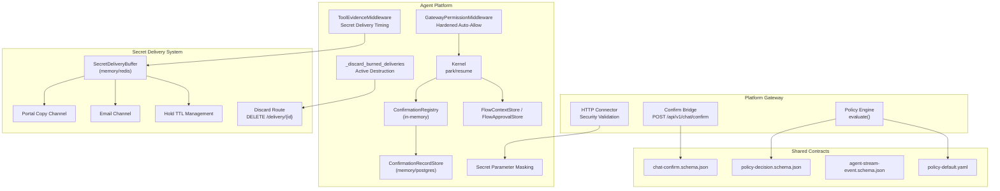
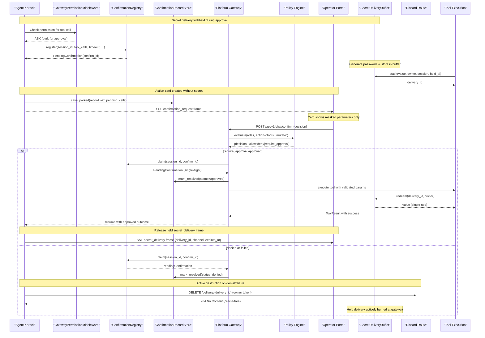
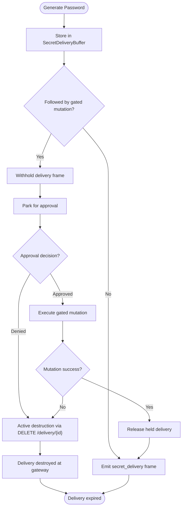
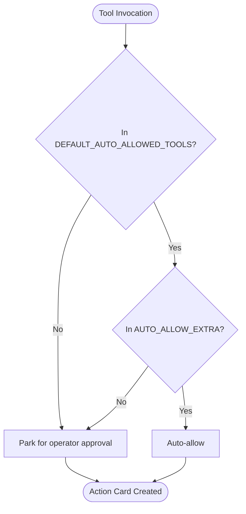
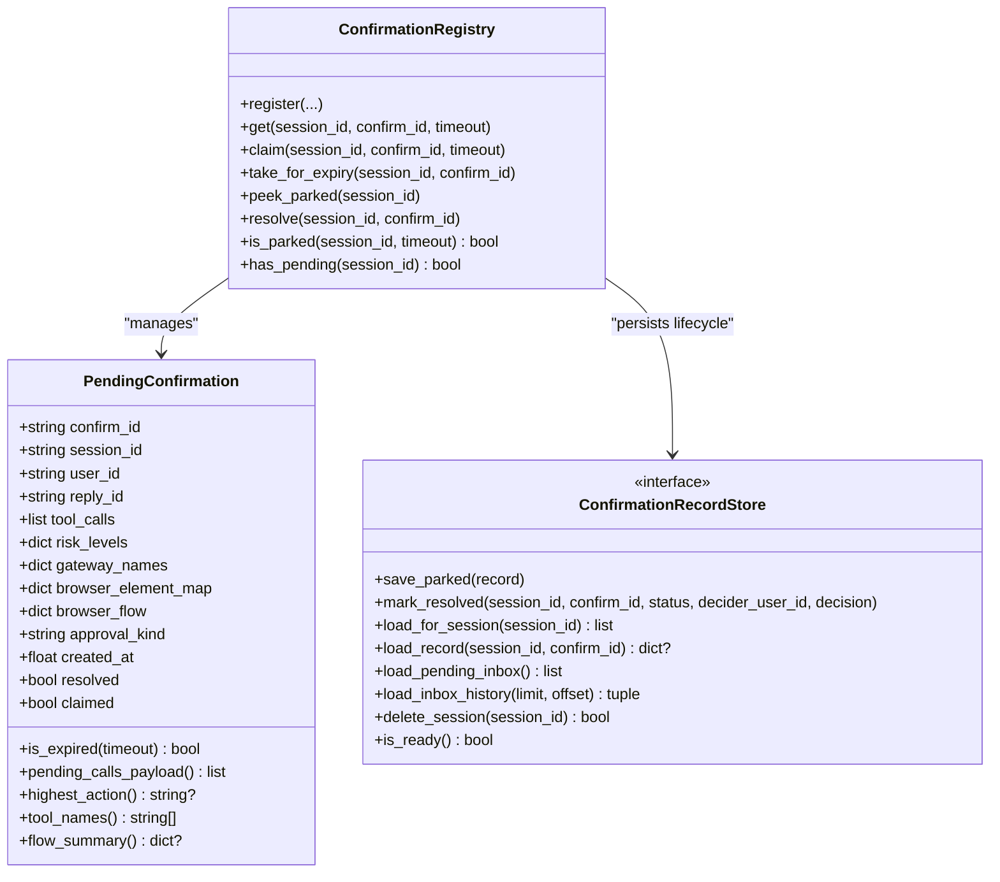
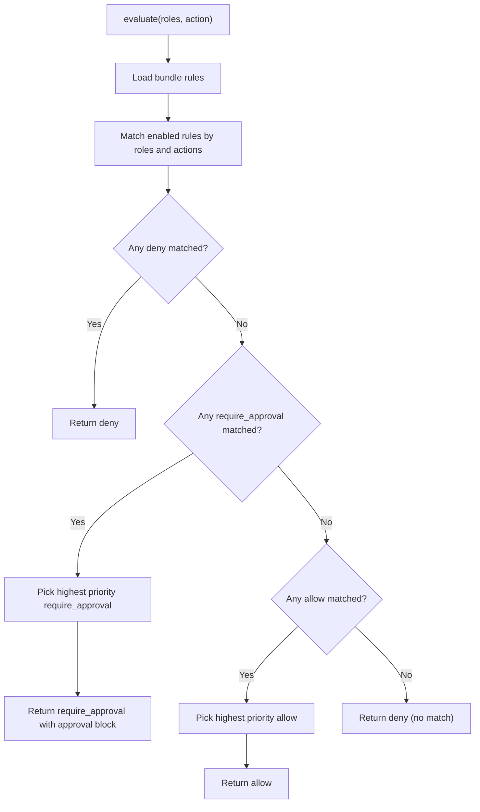
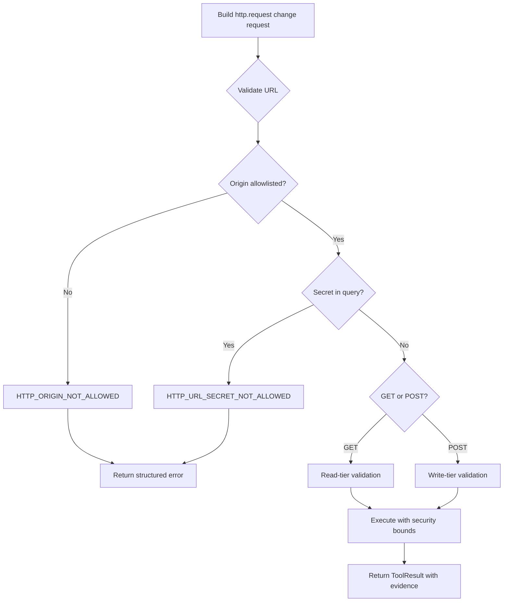
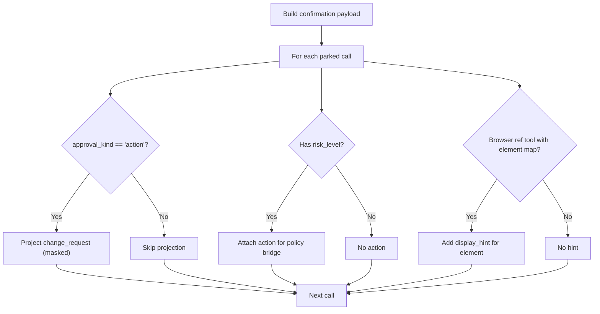
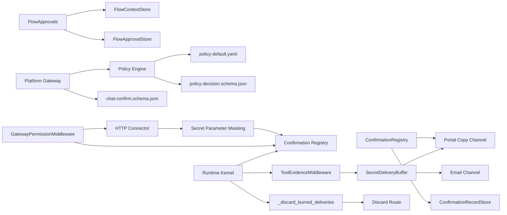

# Human-in-the-Loop Approvals

<cite>
**Referenced Files in This Document**
- [flow_approvals.py](file://products/agent-platform/src/agent_service/services/flow_approvals.py)
- [hitl_confirmations.py](file://products/agent-platform/src/agent_service/services/hitl_confirmations.py)
- [confirmation_records.py](file://products/agent-platform/src/agent_service/services/confirmation_records.py)
- [policy_engine.py](file://products/platform-gateway/src/platform_gateway/services/policy_engine.py)
- [secret_params.py](file://products/agent-platform/src/agent_service/services/secret_params.py)
- [http_connector.py](file://products/tool-gateway/src/tool_gateway/tools/http_connector.py)
- [kernel_middleware.py](file://products/agent-platform/src/agent_service/services/kernel_middleware.py)
- [runtime_kernel.py](file://products/agent-platform/src/agent_service/runtime_kernel.py)
- [secret_delivery.py](file://products/tool-gateway/src/tool_gateway/tools/secret_delivery.py)
- [secrets_connector.py](file://products/tool-gateway/src/tool_gateway/tools/secrets_connector.py)
- [gateway_tools.py](file://products/agent-platform/src/agent_service/tools/gateway_tools.py)
- [secrets_routes.py](file://products/tool-gateway/src/tool_gateway/api/routes/secrets.py)
- [agent-stream-event.schema.json](file://shared/shared-contracts/schemas/agent-stream-event.schema.json)
- [chat-confirm.schema.json](file://shared/shared-contracts/schemas/chat-confirm.schema.json)
- [policy-decision.schema.json](file://shared/shared-contracts/schemas/policy-decision.schema.json)
- [policy-default.yaml](file://shared/shared-contracts/policies/policy-default.yaml)
- [approval-and-hitl.md](file://docs/guides/approval-and-hitl.md)
- [SPEC-062-secure-password-generation-and-delivery/spec.md](file://docs/specs/SPEC-062-secure-password-generation-and-delivery/spec.md)
- [ADR-0012-one-time-secret-delivery-handoff.md](file://docs/adr/0012-one-time-secret-delivery-handoff.md)
- [2026-09-20-post-web-checks-egress-hardening.md](file://docs/agentic-aiops-platform/release-notes/2026-09-20-post-web-checks-egress-hardening.md)
</cite>

## Update Summary
**Changes Made**
- Updated secret delivery timing controls to document active destruction on denial/failure paths, providing defense-in-depth over the existing hold-TTL burn mechanism
- Enhanced documentation of the deny-path discard flow that actively destroys held portal_copy deliveries at the gateway using owner-scoped tokens
- Added comprehensive coverage of the best-effort discard mechanism with oracle-free 204 responses and transport failure degradation
- Updated architecture diagrams to show the new discard path alongside reveal-on-commit semantics
- Expanded troubleshooting guidance for active destruction scenarios and monitoring considerations

## Table of Contents
1. Introduction
2. Project Structure
3. Core Components
4. Architecture Overview
5. Detailed Component Analysis
6. Dependency Analysis
7. Performance Considerations
8. Troubleshooting Guide
9. Conclusion
10. Appendices

## Introduction
This document explains how the Agent Platform implements human-in-the-loop (HITL) approval workflows for risky operations. It covers:
- Approval gates that park mutating tool calls until an operator decides
- Confirmation card generation and display hints for browser tools
- Decision synchronization between agents, operators, and the policy engine
- Flow approvals for multi-step browser flows with identity-scoped auto-signing
- **Enhanced secret delivery timing controls with active destruction on denial/failure paths, providing defense-in-depth over existing hold-TTL burn mechanisms**
- Risk tier classification, tool categorization (read vs write), and escalation paths
- Configuration examples, custom flow considerations, and auditing
- Race condition handling, timeout management, and user experience considerations

**Updated** The platform now implements sophisticated secret delivery timing controls where portal_copy deliveries are withheld during pending approval cards and only released upon successful gate approval and tool execution completion. On denial, failure, or expiry paths, held deliveries are actively destroyed at the gateway using owner-scoped tokens, ensuring sensitive information cannot be redeemed even by direct owner fetch during the hold TTL period.

## Project Structure
The HITL system spans several services and shared contracts:
- Agent platform runtime kernel bridges kernel ASK decisions to a confirmation registry and durable records
- Platform gateway enforces policy outcomes including require_approval tiers on the confirm path
- Shared schemas define request/response contracts for confirmations and policy decisions
- Default policy bundle defines roles, actions, and approval tiers
- **Enhanced secret delivery system with active destruction capabilities and integrated approval workflow gating**

**Diagram sources**
- [kernel_middleware.py:242-370](file://products/agent-platform/src/agent_service/services/kernel_middleware.py#L242-L370)
- [kernel_middleware.py:400-544](file://products/agent-platform/src/agent_service/services/kernel_middleware.py#L400-L544)
- [runtime_kernel.py:1271-1300](file://products/agent-platform/src/agent_service/runtime_kernel.py#L1271-L1300)
- [secret_delivery.py:76-86](file://products/tool-gateway/src/tool_gateway/tools/secret_delivery.py#L76-L86)
- [secrets_routes.py:122-170](file://products/tool-gateway/src/tool_gateway/api/routes/secrets.py#L122-L170)
- [hitl_confirmations.py:452-595](file://products/agent-platform/src/agent_service/services/hitl_confirmations.py#L452-L595)
- [confirmation_records.py:141-245](file://products/agent-platform/src/agent_service/services/confirmation_records.py#L141-L245)
- [flow_approvals.py:124-274](file://products/agent-platform/src/agent_service/services/flow_approvals.py#L124-L274)
- [policy_engine.py:390-444](file://products/platform-gateway/src/platform_gateway/services/policy_engine.py#L390-L444)

**Section sources**
- [approval-and-hitl.md:7-90](file://docs/guides/approval-and-hitl.md#L7-L90)

## Core Components
- ConfirmationRegistry: per-process registry of parked confirmations with single-flight claim, TTL expiry, and resolution
- ConfirmationRecordStore: durable persistence of parked and resolved confirmations (memory or Postgres)
- FlowApprovals: session-scoped flow context and approval stores enabling auto-signing within a bounded flow identity and TTL
- PolicyEngine: evaluates role/action against the policy bundle; supports allow/deny/require_approval with tiers
- SecretDeliveryBuffer: single-use, owner-scoped, TTL-bounded secret stash with memory/Redis backends and active destruction support
- ToolEvidenceMiddleware: manages secret delivery timing controls with reveal-on-commit semantics and integration with approval workflows
- GatewayPermissionMiddleware: hardened auto-allow list excluding http.get from built-in defaults due to egress risk
- Secret Parameter Masking: fail-closed posture with KNOWN_SAFE_FIELDS allow-list and shape-preserving rendering
- HTTP Connector: structured body validation, credential set support, and comprehensive security enforcement
- Schemas: chat-confirm schema for operator decisions; policy-decision schema for evaluation results; agent-stream-event schema for secret_delivery frames

Key behaviors:
- Mutating tool calls are parked and surfaced as confirmation cards
- Portal_copy deliveries are withheld during pending approval cards and released only upon successful gated mutation
- **Active destruction on denial/failure paths: held deliveries are actively discarded at the gateway using owner-scoped tokens, preventing redemption even by direct owner fetch during hold TTL**
- The confirm bridge enforces policy tiers before resuming
- Flow approvals scope auto-signed writes to a specific skill/origin binding while alive
- Records survive restarts and support inbox/history views
- HTTP operations include comprehensive security validation and approval requirements

**Section sources**
- [hitl_confirmations.py:47-181](file://products/agent-platform/src/agent_service/services/hitl_confirmations.py#L47-L181)
- [confirmation_records.py:52-92](file://products/agent-platform/src/agent_service/services/confirmation_records.py#L52-L92)
- [flow_approvals.py:78-122](file://products/agent-platform/src/agent_service/services/flow_approvals.py#L78-L122)
- [policy_engine.py:142-210](file://products/platform-gateway/src/platform_gateway/services/policy_engine.py#L142-L210)
- [kernel_middleware.py:242-370](file://products/agent-platform/src/agent_service/services/kernel_middleware.py#L242-L370)
- [kernel_middleware.py:400-544](file://products/agent-platform/src/agent_service/services/kernel_middleware.py#L400-L544)
- [secret_delivery.py:76-86](file://products/tool-gateway/src/tool_gateway/tools/secret_delivery.py#L76-L86)

## Architecture Overview
End-to-end flow from agent parking to operator decision and execution, with enhanced secret delivery timing controls and active destruction:

**Diagram sources**
- [kernel_middleware.py:242-370](file://products/agent-platform/src/agent_service/services/kernel_middleware.py#L242-L370)
- [kernel_middleware.py:400-544](file://products/agent-platform/src/agent_service/services/kernel_middleware.py#L400-L544)
- [runtime_kernel.py:1271-1300](file://products/agent-platform/src/agent_service/runtime_kernel.py#L1271-L1300)
- [runtime_kernel.py:2530-2544](file://products/agent-platform/src/agent_service/runtime_kernel.py#L2530-L2544)
- [secret_delivery.py:76-86](file://products/tool-gateway/src/tool_gateway/tools/secret_delivery.py#L76-L86)
- [secrets_routes.py:122-170](file://products/tool-gateway/src/tool_gateway/api/routes/secrets.py#L122-L170)
- [hitl_confirmations.py:452-595](file://products/agent-platform/src/agent_service/services/hitl_confirmations.py#L452-L595)
- [confirmation_records.py:141-245](file://products/agent-platform/src/agent_service/services/confirmation_records.py#L141-L245)
- [policy_engine.py:390-444](file://products/platform-gateway/src/platform_gateway/services/policy_engine.py#L390-L444)

## Detailed Component Analysis

### Enhanced Secret Delivery Timing Controls with Active Destruction
**Updated** The platform now implements sophisticated secret delivery timing controls with active destruction on denial/failure paths, providing defense-in-depth over the existing hold-TTL burn mechanism.

- **Withheld during approval**: Portal_copy deliveries generated during a turn that triggers an approval card are stored in `STREAM_PENDING_DELIVERIES` but not emitted immediately
- **Reveal-on-commit**: When an approval is granted and the gated mutation succeeds, held deliveries are released as `secret_delivery` frames alongside the successful tool result
- **Active destruction on denial/failure**: If approval is denied, the gated mutation fails, or the park expires, held deliveries are actively destroyed at the gateway using owner-scoped tokens, preventing any redemption even by direct owner fetch during the hold TTL
- **Best-effort discard mechanism**: The discard operation uses the requester's delegated token for owner scoping, returns oracle-free 204 responses, and degrades gracefully to hold-TTL expiry burn on transport failures
- **Hold TTL management**: Deliveries use extended TTL (`GATEWAY_SECRET_DELIVERY_HOLD_TTL_SECONDS`, default 900s) to survive the approval window plus redemption margin
- **Single-use protection**: Each delivery handle can only be redeemed once, preventing replay attacks
- **Owner scoping**: Only the original session owner can redeem the delivery, maintaining security boundaries

**Diagram sources**
- [kernel_middleware.py:490-520](file://products/agent-platform/src/agent_service/services/kernel_middleware.py#L490-L520)
- [runtime_kernel.py:1271-1300](file://products/agent-platform/src/agent_service/runtime_kernel.py#L1271-L1300)
- [runtime_kernel.py:2530-2544](file://products/agent-platform/src/agent_service/runtime_kernel.py#L2530-L2544)
- [secret_delivery.py:76-86](file://products/tool-gateway/src/tool_gateway/tools/secret_delivery.py#L76-L86)
- [secrets_routes.py:122-170](file://products/tool-gateway/src/tool_gateway/api/routes/secrets.py#L122-L170)

**Section sources**
- [kernel_middleware.py:490-520](file://products/agent-platform/src/agent_service/services/kernel_middleware.py#L490-L520)
- [runtime_kernel.py:1271-1300](file://products/agent-platform/src/agent_service/runtime_kernel.py#L1271-L1300)
- [runtime_kernel.py:2530-2544](file://products/agent-platform/src/agent_service/runtime_kernel.py#L2530-L2544)
- [secret_delivery.py:76-86](file://products/tool-gateway/src/tool_gateway/tools/secret_delivery.py#L76-L86)
- [secrets_routes.py:122-170](file://products/tool-gateway/src/tool_gateway/api/routes/secrets.py#L122-L170)
- [ADR-0012-one-time-secret-delivery-handoff.md:72-96](file://docs/adr/0012-one-time-secret-delivery-handoff.md#L72-L96)
- [SPEC-062-secure-password-generation-and-delivery/spec.md:232-261](file://docs/specs/SPEC-062-secure-password-generation-and-delivery/spec.md#L232-L261)

### Hardened Auto-Allow List and Outbound Egress Security
**Updated** The platform now implements a hardened security posture where outbound network egress operations require explicit operator approval by default.

- **Removed http.get from built-in defaults**: The `DEFAULT_AUTO_ALLOWED_TOOLS` no longer includes `http.get`, treating outbound egress as a different risk class than in-cluster reads
- **New additive configuration**: `AGENT_GATEWAY_TOOL_AUTO_ALLOW_EXTRA` allows environments to opt individual tools back into auto-approval without restating the entire default list
- **Defense-in-depth approach**: While the kernel allow-list is a HITL bypass switch, the actual egress boundary lives in the tool-gateway's `http_connector` which runs on every call regardless of the kernel allow-list
- **SSRF protection**: The hardening addresses a medium-severity SSRF finding (CWE-918) by ensuring outbound egress receives appropriate human oversight

**Diagram sources**
- [kernel_middleware.py:147-168](file://products/agent-platform/src/agent_service/services/kernel_middleware.py#L147-L168)
- [kernel_middleware.py:242-370](file://products/agent-platform/src/agent_service/services/kernel_middleware.py#L242-L370)

**Section sources**
- [kernel_middleware.py:147-168](file://products/agent-platform/src/agent_service/services/kernel_middleware.py#L147-L168)
- [kernel_middleware.py:242-370](file://products/agent-platform/src/agent_service/services/kernel_middleware.py#L242-L370)
- [2026-09-20-post-web-checks-egress-hardening.md:45-89](file://docs/agentic-aiops-platform/release-notes/2026-09-20-post-web-checks-egress-hardening.md#L45-L89)

### Confirmation Registry and Durable Records
- Parking: the kernel registers a PendingConfirmation with tool calls, risk levels, gateway names, browser element map, flow summary, and approval kind
- Display: pending_calls_payload serializes tool calls, injects change_request for action cards, masks secrets, and attaches risk_level/action for policy bridging
- Single-flight: claim marks the entry claimed to prevent double-resume; take_for_expiry claims for cleanup without racing decision paths
- Resolution: resolve clears the entry; mark_resolved persists status, decider, decision, and timestamps
- Persistence: InMemory and Postgres backends share the same interface; Postgres initializes tables, migrates columns, and sweeps stale rows at startup

**Diagram sources**
- [hitl_confirmations.py:47-181](file://products/agent-platform/src/agent_service/services/hitl_confirmations.py#L47-L181)
- [hitl_confirmations.py:452-595](file://products/agent-platform/src/agent_service/services/hitl_confirmations.py#L452-L595)
- [confirmation_records.py:99-134](file://products/agent-platform/src/agent_service/services/confirmation_records.py#L99-L134)

**Section sources**
- [hitl_confirmations.py:98-181](file://products/agent-platform/src/agent_service/services/hitl_confirmations.py#L98-L181)
- [hitl_confirmations.py:452-595](file://products/agent-platform/src/agent_service/services/hitl_confirmations.py#L452-L595)
- [confirmation_records.py:141-245](file://products/agent-platform/src/agent_service/services/confirmation_records.py#L141-L245)
- [confirmation_records.py:492-686](file://products/agent-platform/src/agent_service/services/confirmation_records.py#L492-L686)

### Flow Approvals (Browser Flow Identity and Auto-Signing)
- FlowContext reflects the gateway-bound browser flow identity (skill_id, origin) and metadata used for card headlines and intent
- FlowApproval scopes auto-signing authority to the approved flow identity with a TTL; subsequent writes in the same flow are admitted while identity matches and TTL holds
- Write-tier tools include web.click, web.type, web.select, web.press_key, web.upload_file, web.evaluate, and http.post
- Flow-killing error codes drop both context and approval to prevent stale authority

**Diagram sources**
- [flow_approvals.py:41-75](file://products/agent-platform/src/agent_service/services/flow_approvals.py#L41-L75)
- [flow_approvals.py:78-122](file://products/agent-platform/src/agent_service/services/flow_approvals.py#L78-L122)
- [flow_approvals.py:167-259](file://products/agent-platform/src/agent_service/services/flow_approvals.py#L167-L259)

**Section sources**
- [flow_approvals.py:41-75](file://products/agent-platform/src/agent_service/services/flow_approvals.py#L41-L75)
- [flow_approvals.py:78-122](file://products/agent-platform/src/agent_service/services/flow_approvals.py#L78-L122)
- [flow_approvals.py:167-259](file://products/agent-platform/src/agent_service/services/flow_approvals.py#L167-L259)

### Policy Engine and Approval Tiers
- Actions include chat, tools:invoke, tools:mutate, chat:confirm, approvals:list, and others
- Outcomes: allow, deny, require_approval; precedence is deny > require_approval > allow
- require_approval carries an approval block with tier (tier_1 or tier_2), decided_by_roles, and optional allow_self_approval
- Only bridged actions (currently tools:mutate) may use require_approval in this slice
- Default bundle enforces tier_2 for mutating execution with designated approvers distinct from requester

**Diagram sources**
- [policy_engine.py:390-444](file://products/platform-gateway/src/platform_gateway/services/policy_engine.py#L390-L444)
- [policy-default.yaml:129-152](file://shared/shared-contracts/policies/policy-default.yaml#L129-L152)

**Section sources**
- [policy_engine.py:119-127](file://products/platform-gateway/src/platform_gateway/services/policy_engine.py#L119-L127)
- [policy_engine.py:142-210](file://products/platform-gateway/src/platform_gateway/services/policy_engine.py#L142-L210)
- [policy_engine.py:390-444](file://products/platform-gateway/src/platform_gateway/services/policy_engine.py#L390-L444)
- [policy-default.yaml:129-152](file://shared/shared-contracts/policies/policy-default.yaml#L129-L152)

### Enhanced HTTP Tools with Security Validation
**Updated** HTTP tools now implement comprehensive security measures with enhanced approval requirements for outbound egress operations.

- **Hardened security posture**: `http.get` removed from built-in auto-allow list due to outbound egress risk
- **URL validation**: Refuses secret-bearing query parameters with HTTP_URL_SECRET_NOT_ALLOWED
- **Body validation**: Enforces depth limits, key count limits, and byte size caps before transport
- **Credential set support**: Requires explicit credential set configuration for authenticated requests
- **Structured rendering**: Preserves JSON structure while masking secret-bearing keys
- **Fail-closed masking**: Uses KNOWN_SAFE_FIELDS allow-list where only explicitly whitelisted fields render verbatim
- **Defense in depth**: Multiple layers of protection including connector-level validation and approval-card masking

**Diagram sources**
- [http_connector.py:100-180](file://products/tool-gateway/src/tool_gateway/tools/http_connector.py#L100-L180)
- [http_connector.py:183-219](file://products/tool-gateway/src/tool_gateway/tools/http_connector.py#L183-L219)
- [http_connector.py:556-592](file://products/tool-gateway/src/tool_gateway/tools/http_connector.py#L556-592)
- [http_connector.py:654-699](file://products/tool-gateway/src/tool_gateway/tools/http_connector.py#L654-699)

**Section sources**
- [http_connector.py:100-180](file://products/tool-gateway/src/tool_gateway/tools/http_connector.py#L100-L180)
- [http_connector.py:183-219](file://products/tool-gateway/src/tool_gateway/tools/http_connector.py#L183-L219)
- [http_connector.py:556-592](file://products/tool-gateway/src/tool_gateway/tools/http_connector.py#L556-592)
- [http_connector.py:654-699](file://products/tool-gateway/src/tool_gateway/tools/http_connector.py#L654-699)
- [secret_params.py:136-153](file://products/agent-platform/src/agent_service/services/secret_params.py#L136-L153)

### Confirmation Cards, Change Requests, and Browser Element Hints
- Action cards project decision-relevant parameters into a change_request sibling of parameters so signed digests remain unchanged
- Curated formatters produce effect sentences for critical mutating tools; generic fallback provides masked label/value fields
- Browser tools referencing snapshot elements can show human-readable element descriptions instead of raw refs
- Secrets are masked consistently using secret parameter masking rules
- **HTTP tools provide structured field listings with appropriate masking based on field names and content type**

**Diagram sources**
- [hitl_confirmations.py:98-181](file://products/agent-platform/src/agent_service/services/hitl_confirmations.py#L98-L181)
- [hitl_confirmations.py:195-359](file://products/agent-platform/src/agent_service/services/hitl_confirmations.py#L195-L359)
- [hitl_confirmations.py:379-409](file://products/agent-platform/src/agent_service/services/hitl_confirmations.py#L379-L409)

**Section sources**
- [hitl_confirmations.py:98-181](file://products/agent-platform/src/agent_service/services/hitl_confirmations.py#L98-L181)
- [hitl_confirmations.py:195-359](file://products/agent-platform/src/agent_service/services/hitl_confirmations.py#L195-L359)
- [hitl_confirmations.py:379-409](file://products/agent-platform/src/agent_service/services/hitl_confirmations.py#L379-L409)

## Dependency Analysis
- ConfirmationRegistry depends on PendingConfirmation data and exposes single-flight claim/resolve semantics
- ConfirmationRecordStore abstracts memory/postgres backends; Postgres backend includes migration and startup sweep
- FlowApprovals maintains per-session FlowContext and FlowApproval with TTL checks and identity guards
- PolicyEngine consumes the default policy bundle and returns structured decisions including approval blocks
- SecretDeliveryBuffer provides single-use, owner-scoped, TTL-bounded storage with memory/Redis backends and active destruction support
- ToolEvidenceMiddleware coordinates secret delivery timing with approval workflow state and active destruction triggers
- GatewayPermissionMiddleware enforces hardened auto-allow list with outbound egress restrictions
- Secret parameter masking provides fail-closed posture with KNOWN_SAFE_FIELDS allow-list for secure parameter handling
- HTTP Connector implements comprehensive security validation and approval requirements
- Schemas enforce request shapes and decision structures across components

**Diagram sources**
- [hitl_confirmations.py:452-595](file://products/agent-platform/src/agent_service/services/hitl_confirmations.py#L452-L595)
- [confirmation_records.py:141-245](file://products/agent-platform/src/agent_service/services/confirmation_records.py#L141-L245)
- [flow_approvals.py:124-274](file://products/agent-platform/src/agent_service/services/flow_approvals.py#L124-L274)
- [policy_engine.py:390-444](file://products/platform-gateway/src/platform_gateway/services/policy_engine.py#L390-L444)
- [kernel_middleware.py:242-370](file://products/agent-platform/src/agent_service/services/kernel_middleware.py#L242-L370)
- [kernel_middleware.py:400-544](file://products/agent-platform/src/agent_service/services/kernel_middleware.py#L400-L544)
- [secret_delivery.py:76-86](file://products/tool-gateway/src/tool_gateway/tools/secret_delivery.py#L76-L86)
- [runtime_kernel.py:1271-1300](file://products/agent-platform/src/agent_service/runtime_kernel.py#L1271-L1300)

**Section sources**
- [hitl_confirmations.py:452-595](file://products/agent-platform/src/agent_service/services/hitl_confirmations.py#L452-L595)
- [confirmation_records.py:141-245](file://products/agent-platform/src/agent_service/services/confirmation_records.py#L141-L245)
- [flow_approvals.py:124-274](file://products/agent-platform/src/agent_service/services/flow_approvals.py#L124-L274)
- [policy_engine.py:390-444](file://products/platform-gateway/src/platform_gateway/services/policy_engine.py#L390-L444)
- [kernel_middleware.py:242-370](file://products/agent-platform/src/agent_service/services/kernel_middleware.py#L242-L370)

## Performance Considerations
- In-memory registries provide low-latency single-flight control; durable records add persistence overhead but ensure resilience
- Postgres queries are bounded by limits and history windows; opportunistic sweeps reclaim old resolved rows
- Flow approvals are per-process and TTL-bounded to avoid long-lived authority; clearing on flow-killing errors prevents stale unlocks
- Card payload construction avoids modifying signed parameters; projections are siblings to preserve digests
- Secret delivery buffers use efficient single-use storage with automatic cleanup of expired entries and active destruction support
- Hold TTL management balances approval window duration with resource constraints
- Reveal-on-commit timing minimizes exposure surface by withholding sensitive data until commit point
- HTTP tool validation occurs before transport calls to prevent unnecessary network overhead
- Hardened auto-allow list reduces unnecessary approval cards for vetted in-cluster operations
- Shape-preserving masking operates efficiently on nested structures without deep copying entire payloads
- **Active destruction uses short timeouts (10 seconds) to avoid blocking resumed streams on transport failures**
- **Best-effort discard mechanism ensures approval workflows continue even when gateway connectivity is unavailable**

## Troubleshooting Guide
Common issues and resolutions:
- Double confirm attempts: ConfirmationRegistry.claim ensures single-flight; duplicate confirms raise NotFound after claim
- Expired parks: ConfirmationExpired indicates TTL breach; cleanup via expire_confirmation resumes interruption
- Stale flow authority: Flow-killing error codes drop both FlowContext and FlowApproval; next write re-parks
- Missing signing key or worker unavailability: Approved resumes fail closed and audit rejection events; no unsigned fallback
- Inbox pagination and history: Use limit/offset for history; pending queue is always complete and sorted newest first
- Secret delivery timing issues: Verify hold TTL settings; check that deliveries are properly stashed and released on successful commits
- **Active destruction failures**: Monitor for transport failures to gateway discard routes; verify owner token validity; check that discard calls are being made on denial/failure paths
- **Approval workflow delays**: Monitor confirmation registry for stuck entries; verify policy engine performance
- **HTTP tool approval issues**: Verify URL doesn't contain secret query parameters; check credential set configuration; validate body structure and size limits; ensure origin is allowlisted
- **Outbound egress approval**: New http.get calls will park action cards by default - configure AGENT_GATEWAY_TOOL_AUTO_ALLOW_EXTRA=http.get to restore previous behavior

Operational tips:
- Verify policy bundle SHA-256 on readiness endpoints to confirm enforced configuration
- Confirm AGENT_HITL_CONFIRM_TIMEOUT aligns with expected operator response time
- Ensure approver roles have chat:confirm and approvals:list grants per policy bundle
- Monitor secret delivery buffer usage and adjust hold TTL based on approval workflow patterns
- **Track active destruction calls and failures to identify gateway connectivity issues**
- **Review outbound egress policies to ensure appropriate human oversight for network operations**
- **Monitor secret_delivery frame emission rates to identify potential approval bottlenecks**
- **Verify discard route availability and response times for optimal denial path performance**

**Section sources**
- [hitl_confirmations.py:496-558](file://products/agent-platform/src/agent_service/services/hitl_confirmations.py#L496-L558)
- [confirmation_records.py:521-542](file://products/agent-platform/src/agent_service/services/confirmation_records.py#L521-L542)
- [flow_approvals.py:56-75](file://products/agent-platform/src/agent_service/services/flow_approvals.py#L56-L75)
- [approval-and-hitl.md:229-288](file://docs/guides/approval-and-hitl.md#L229-L288)

## Conclusion
The Agent Platform's HITL approval system combines layered enforcement with enhanced security posture:
- Policy engine decisions gate who can decide and at what tier
- Confirmation registry manages parking, single-flight decisions, and TTL
- Durable records persist decisions and support inbox/history surfaces
- Flow approvals enable safe auto-signing within bounded browser flows
- **Integrated secret delivery timing controls with active destruction ensure sensitive information never leaks through approval workflows**
- **Reveal-on-commit semantics provide defense-in-depth for sensitive operations**
- **Active destruction on denial/failure paths provides additional security layer beyond passive hold-TTL burns**
- **Hardened security posture requires explicit approval for outbound network egress operations**
- **Defense-in-depth approach ensures multiple layers of protection for sensitive operations**
- Schemas and bundles standardize behavior across components

Together, these mechanisms ensure risky operations execute only with explicit, auditable, and policy-compliant human approval, including sophisticated secret delivery timing controls with active destruction capabilities and enhanced approval requirements for outbound egress.

## Appendices

### Enhanced Secret Delivery Timing Controls with Active Destruction
**Updated** The platform implements sophisticated secret delivery timing controls with active destruction capabilities that integrate seamlessly with HITL approval workflows.

- **Withheld during approval**: Portal_copy deliveries are stored in `STREAM_PENDING_DELIVERIES` but not emitted during pending approval cards
- **Reveal-on-commit**: Held deliveries are released as `secret_delivery` frames only when gated mutations succeed
- **Active destruction on denial/failure**: Denied approvals, failed mutations, or expired parks trigger immediate destruction of held deliveries at the gateway using owner-scoped tokens
- **Best-effort discard mechanism**: Uses requester's delegated token for owner scoping, returns oracle-free 204 responses, and degrades gracefully to hold-TTL expiry burn on transport failures
- **Hold TTL management**: Extended TTL (`GATEWAY_SECRET_DELIVERY_HOLD_TTL_SECONDS`, default 900s) survives approval windows
- **Single-use protection**: Each delivery handle can only be redeemed once, preventing replay attacks
- **Owner scoping**: Only the original session owner can redeem deliveries, maintaining security boundaries

**Section sources**
- [kernel_middleware.py:490-520](file://products/agent-platform/src/agent_service/services/kernel_middleware.py#L490-L520)
- [runtime_kernel.py:1271-1300](file://products/agent-platform/src/agent_service/runtime_kernel.py#L1271-L1300)
- [runtime_kernel.py:2530-2544](file://products/agent-platform/src/agent_service/runtime_kernel.py#L2530-L2544)
- [secret_delivery.py:76-86](file://products/tool-gateway/src/tool_gateway/tools/secret_delivery.py#L76-L86)
- [secrets_routes.py:122-170](file://products/tool-gateway/src/tool_gateway/api/routes/secrets.py#L122-L170)
- [ADR-0012-one-time-secret-delivery-handoff.md:72-96](file://docs/adr/0012-one-time-secret-delivery-handoff.md#L72-L96)
- [SPEC-062-secure-password-generation-and-delivery/spec.md:232-261](file://docs/specs/SPEC-062-secure-password-generation-and-delivery/spec.md#L232-L261)

### Risk Tier Classification and Tool Categorization
- Read-tier tools auto-allow where configured; they never reach flow-unlock
- Write-tier tools include web.click, web.type, web.select, web.press_key, web.upload_file, web.evaluate, and http.post
- web.fill_credential is read-tier and does not park a card; it names its credential set
- web.evaluate takes only expression and no element ref; it is not a ref-taking tool
- **http.get is now read-tier but requires explicit approval by default due to outbound egress risk**
- **http.post requires tools:mutate permission and follows the same approval workflow as other write-tier tools**
- **secrets.generate_password is read-tier but integrates with secret delivery timing controls and active destruction**

**Section sources**
- [hitl_confirmations.py:101-104](file://products/agent-platform/src/agent_service/services/hitl_confirmations.py#L101-L104)
- [flow_approvals.py:41-54](file://products/agent-platform/src/agent_service/services/flow_approvals.py#L41-L54)
- [kernel_middleware.py:242-370](file://products/agent-platform/src/agent_service/services/kernel_middleware.py#L242-L370)

### Approval Escalation Paths
- tier_1: operator self-approval (default when no require_approval rule)
- tier_2: designated approver distinct from requester; self-approval blocked by default
- Shipped bundle requires tier_2 for tools:mutate with designated_by_roles approver and platform-admin
- **http.get and http.post inherit the same escalation paths as other tools, with http.get requiring explicit approval by default**
- **Secret delivery timing controls apply uniformly across all approval tiers, including active destruction on denial/failure paths**

**Section sources**
- [policy-default.yaml:129-152](file://shared/shared-contracts/policies/policy-default.yaml#L129-L152)
- [approval-and-hitl.md:189-227](file://docs/guides/approval-and-hitl.md#L189-L227)

### Configuring Approval Policies
- Edit shared/shared-contracts/policies/policy-default.yaml and bump version
- Sync consumer copies and validate with make verify
- Deploy ConfigMap; confirm bundle SHA-256 on readiness endpoints
- Adjust AGENT_GATEWAY_TOOL_AUTO_ALLOW for read-only auto-approval lists
- Set AGENT_HITL_CONFIRM_TIMEOUT to control park lifetime
- **Configure AGENT_GATEWAY_TOOL_AUTO_ALLOW_EXTRA=http.get to restore previous http.get auto-approval behavior**
- **Configure secret delivery timing controls including hold TTL and buffer backends**
- Configure HTTP tool settings including body size limits and credential sets

**Section sources**
- [approval-and-hitl.md:118-188](file://docs/guides/approval-and-hitl.md#L118-L188)
- [2026-09-20-post-web-checks-egress-hardening.md:59-89](file://docs/agentic-aiops-platform/release-notes/2026-09-20-post-web-checks-egress-hardening.md#L59-L89)

### Handling Approval Decisions and Auditing
- Operator submits POST /api/v1/chat/confirm with session_id, confirm_id, decision
- Platform gateway evaluates policy and enforces tier constraints
- Durable records capture status, decider, decision, and timestamps
- Audit trail correlates confirmation_decided with execution_requested/completed/rejected
- **Secret delivery timing controls emit secret_delivered audit events with channel and recipient information**
- **Active destruction events are logged at INFO level with delivery_id and channel, without revealing sensitive data**
- **Approval workflow integration ensures secret delivery events are correlated with approval decisions**

**Section sources**
- [chat-confirm.schema.json:1-27](file://shared/shared-contracts/schemas/chat-confirm.schema.json#L1-L27)
- [policy-decision.schema.json:1-60](file://shared/shared-contracts/schemas/policy-decision.schema.json#L1-L60)
- [agent-stream-event.schema.json:5](file://shared/shared-contracts/schemas/agent-stream-event.schema.json#L5)
- [approval-and-hitl.md:290-333](file://docs/guides/approval-and-hitl.md#L290-L333)

### Implementing Custom Approval Flows
- Extend change_request formatters for new tools to improve card readability
- Add browser element parsing for new snapshot formats if needed
- Ensure new tools declare correct risk_level and integrate with auto-allow lists
- For browser flows, rely on FlowContext/FlowApproval to scope auto-signing safely
- **Follow the http tool pattern for implementing custom HTTP tools with structured validation and security enforcement**
- **Integrate secret delivery timing controls for tools that generate sensitive values, including active destruction support**

**Section sources**
- [hitl_confirmations.py:195-359](file://products/agent-platform/src/agent_service/services/hitl_confirmations.py#L195-L359)
- [hitl_confirmations.py:412-449](file://products/agent-platform/src/agent_service/services/hitl_confirmations.py#L412-L449)
- [flow_approvals.py:78-122](file://products/agent-platform/src/agent_service/services/flow_approvals.py#L78-L122)

### Race Conditions and Timeouts
- Single-flight claim prevents double-resume; take_for_expiry claims for cleanup without interrupting in-flight decisions
- TTL-based expiry closes parked calls; startup sweep expires stale pending rows in Postgres
- Flow approvals expire based on captured TTL; zero disables flow-unlock entirely
- Secret delivery buffers use monotonic clock TTL with automatic cleanup of expired entries
- Hold TTL management prevents resource exhaustion while supporting extended approval windows
- Reveal-on-commit timing eliminates race conditions between approval decisions and secret delivery
- **Active destruction uses short timeouts (10 seconds) to avoid blocking approval workflows on transport failures**
- **Best-effort discard mechanism ensures approval processes continue even when gateway connectivity is unavailable**

**Section sources**
- [hitl_confirmations.py:520-558](file://products/agent-platform/src/agent_service/services/hitl_confirmations.py#L520-558)
- [confirmation_records.py:521-542](file://products/agent-platform/src/agent_service/services/confirmation_records.py#L521-L542)
- [flow_approvals.py:189-199](file://products/agent-platform/src/agent_service/services/flow_approvals.py#L189-L199)
- [secret_delivery.py:76-86](file://products/tool-gateway/src/tool_gateway/tools/secret_delivery.py#L76-L86)
- [gateway_tools.py:174-208](file://products/agent-platform/src/agent_service/tools/gateway_tools.py#L174-L208)

### User Experience Considerations
- Action cards present concise effect sentences and masked fields for clarity and safety
- Browser tools show human-readable element descriptions when available
- Owner transcript cards anchor under the parking exchange and poll for live updates
- Approver inbox splits pending and history with pagination and counts
- Secret delivery timing controls ensure users only see sensitive information after successful approval and execution
- Copy-password controls appear only after gated mutations succeed, providing clear feedback about approval status
- HTTP tool approval cards provide structured field listings with clear indication of which fields contain sensitive data
- Outbound egress operations now clearly indicate the security rationale for requiring approval
- **Active destruction provides immediate security assurance on denial paths without exposing sensitive information**

**Section sources**
- [hitl_confirmations.py:98-181](file://products/agent-platform/src/agent_service/services/hitl_confirmations.py#L98-L181)
- [approval-and-hitl.md:229-288](file://docs/guides/approval-and-hitl.md#L229-L288)

### HTTP Tool Security and Validation
**Updated** HTTP tools implement comprehensive security measures with enhanced approval requirements for outbound egress operations.

- **Hardened security posture**: `http.get` removed from built-in auto-allow list due to outbound egress risk
- **URL validation**: Refuses secret-bearing query parameters with HTTP_URL_SECRET_NOT_ALLOWED
- **Body validation**: Enforces depth limits, key count limits, and byte size caps before transport
- **Credential set support**: Requires explicit credential set configuration for authenticated requests
- **Structured rendering**: Preserves JSON structure while masking secret-bearing keys
- **Fail-closed masking**: Uses KNOWN_SAFE_FIELDS allow-list where only explicitly whitelisted fields render verbatim
- **Defense in depth**: Multiple layers of protection including connector-level validation and approval-card masking
- **SSRF protection**: Addresses medium-severity SSRF findings through enhanced human oversight

**Section sources**
- [http_connector.py:100-180](file://products/tool-gateway/src/tool_gateway/tools/http_connector.py#L100-L180)
- [http_connector.py:183-219](file://products/tool-gateway/src/tool_gateway/tools/http_connector.py#L183-L219)
- [http_connector.py:556-592](file://products/tool-gateway/src/tool_gateway/tools/http_connector.py#L556-592)
- [http_connector.py:654-699](file://products/tool-gateway/src/tool_gateway/tools/http_connector.py#L654-699)
- [secret_params.py:136-153](file://products/agent-platform/src/agent_service/services/secret_params.py#L136-L153)
- [2026-09-20-post-web-checks-egress-hardening.md:11-44](file://docs/agentic-aiops-platform/release-notes/2026-09-20-post-web-checks-egress-hardening.md#L11-L44)