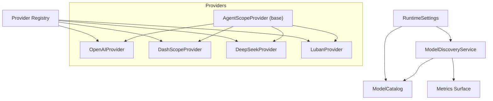
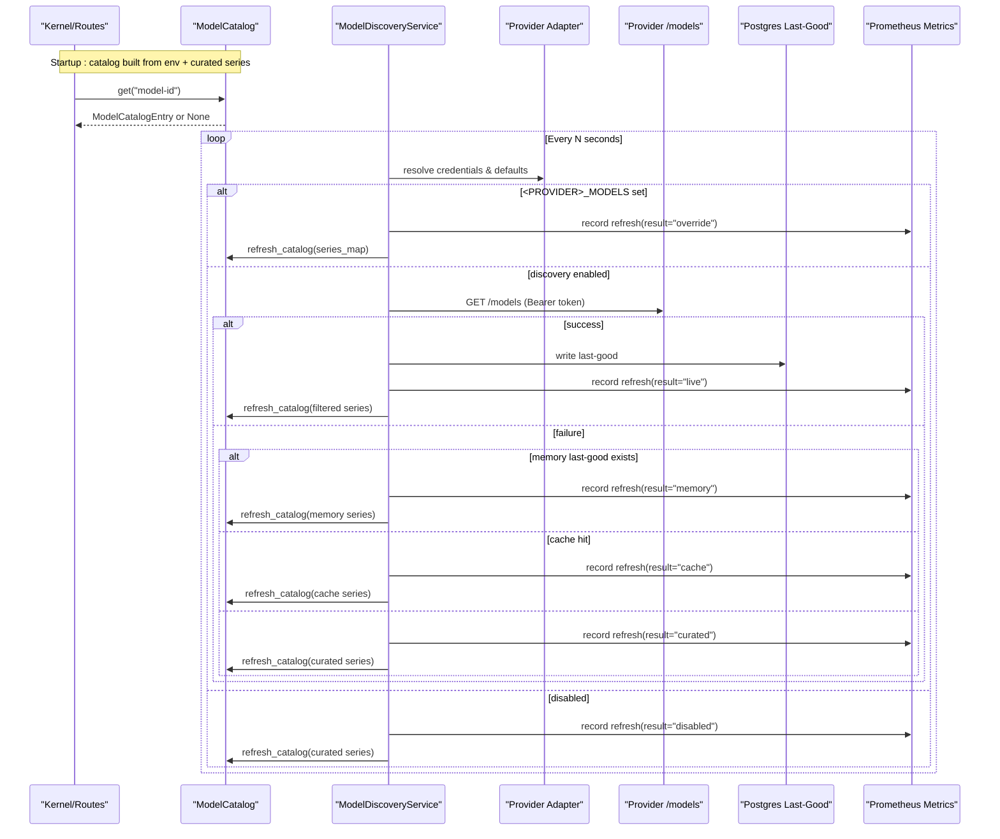
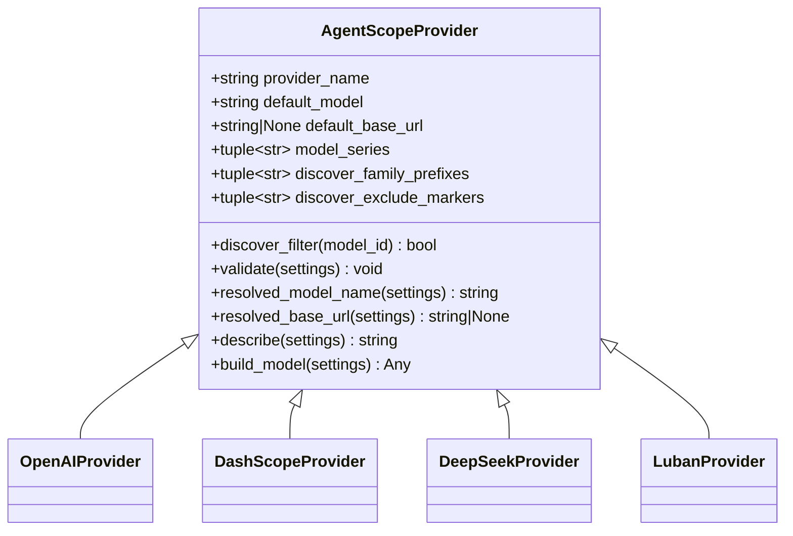
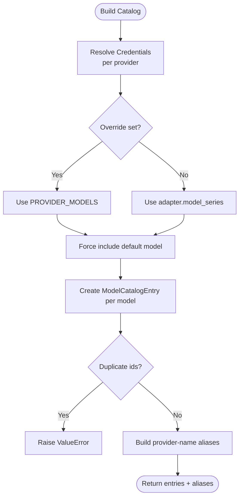
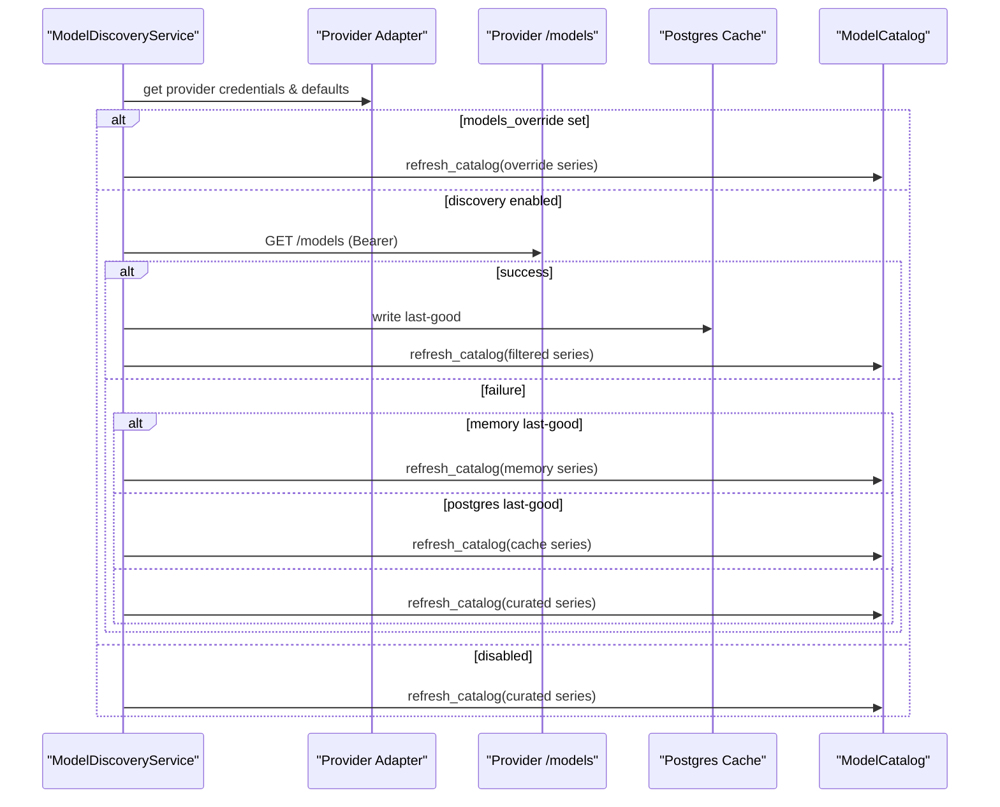
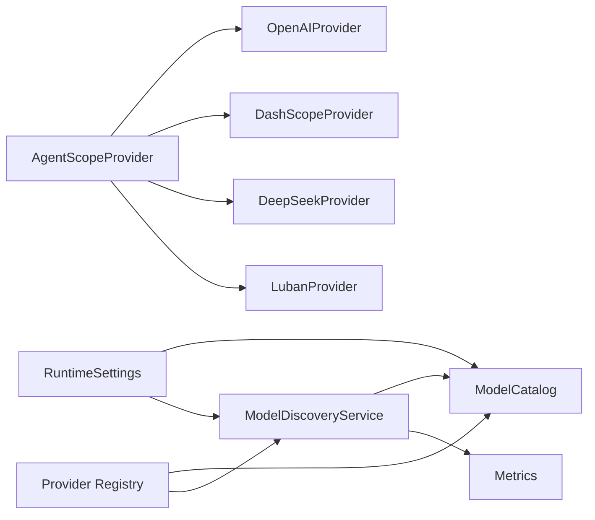

# Model Providers and Catalog

<cite>
**Referenced Files in This Document**
- [base.py](file://products/agent-platform/src/agent_service/providers/base.py)
- [registry.py](file://products/agent-platform/src/agent_service/providers/registry.py)
- [openai.py](file://products/agent-platform/src/agent_service/providers/openai.py)
- [dashscope.py](file://products/agent-platform/src/agent_service/providers/dashscope.py)
- [deepseek.py](file://products/agent-platform/src/agent_service/providers/deepseek.py)
- [luban.py](file://products/agent-platform/src/agent_service/providers/luban.py)
- [model_catalog.py](file://products/agent-platform/src/agent_service/services/model_catalog.py)
- [model_discovery.py](file://products/agent-platform/src/agent_service/services/model_discovery.py)
- [runtime_settings.py](file://products/agent-platform/src/agent_service/runtime_settings.py)
- [metrics.py](file://products/agent-platform/src/agent_service/core/metrics.py)
- [test_model_catalog.py](file://products/agent-platform/tests/test_model_catalog.py)
- [test_model_discovery.py](file://products/agent-platform/tests/test_model_discovery.py)
- [test_runtime_providers.py](file://products/agent-platform/tests/test_runtime_providers.py)
</cite>

## Table of Contents
1. [Introduction](#introduction)
2. [Project Structure](#project-structure)
3. [Core Components](#core-components)
4. [Architecture Overview](#architecture-overview)
5. [Detailed Component Analysis](#detailed-component-analysis)
6. [Dependency Analysis](#dependency-analysis)
7. [Performance Considerations](#performance-considerations)
8. [Troubleshooting Guide](#troubleshooting-guide)
9. [Conclusion](#conclusion)
10. [Appendices](#appendices)

## Introduction
This document explains the multi-model LLM provider system in the Agent Platform. It covers the provider registry, base interface, concrete providers (OpenAI, DashScope, DeepSeek, Luban), model catalog management, dynamic model discovery, runtime model switching, configuration and authentication handling, error recovery patterns, health monitoring, performance metrics, and best practices for adding new integrations.

## Project Structure
The provider subsystem is organized under the agent-service package:
- Provider adapters live under providers and implement a common base interface.
- A registry maps provider names to adapter instances.
- The model catalog builds a credential-gated list of selectable models from environment configuration and per-provider series.
- Live model discovery periodically refreshes the catalog by querying each provider’s OpenAI-compatible /models endpoint with a fail-soft fallback ladder.
- Runtime settings centralize configuration parsing, validation, and provider-specific option shapes.
- Metrics expose observability hooks for discovery and request lifecycle.

**Diagram sources**
- [base.py:32-88](file://products/agent-platform/src/agent_service/providers/base.py#L32-L88)
- [registry.py:9-29](file://products/agent-platform/src/agent_service/providers/registry.py#L9-L29)
- [model_catalog.py:236-325](file://products/agent-platform/src/agent_service/services/model_catalog.py#L236-L325)
- [model_discovery.py:202-299](file://products/agent-platform/src/agent_service/services/model_discovery.py#L202-L299)
- [runtime_settings.py:136-527](file://products/agent-platform/src/agent_service/runtime_settings.py#L136-L527)
- [metrics.py:202-224](file://products/agent-platform/src/agent_service/core/metrics.py#L202-L224)

**Section sources**
- [base.py:32-88](file://products/agent-platform/src/agent_service/providers/base.py#L32-L88)
- [registry.py:9-29](file://products/agent-platform/src/agent_service/providers/registry.py#L9-L29)
- [model_catalog.py:1-331](file://products/agent-platform/src/agent_service/services/model_catalog.py#L1-L331)
- [model_discovery.py:1-300](file://products/agent-platform/src/agent_service/services/model_discovery.py#L1-L300)
- [runtime_settings.py:136-527](file://products/agent-platform/src/agent_service/runtime_settings.py#L136-L527)
- [metrics.py:1-224](file://products/agent-platform/src/agent_service/core/metrics.py#L1-L224)

## Core Components
- Provider base interface defines validation, default model resolution, discover filtering, and an abstract build_model method that constructs the underlying AgentScope model instance.
- Provider registry provides a small, typed mapping from provider name strings to adapter instances and enforces supported providers.
- Model catalog derives entries from environment variables and per-provider curated series, supports legacy provider-name aliases, exposes a public view without secrets, and supports atomic in-place swaps via refresh_catalog.
- Model discovery service implements a four-level fallback ladder (live -> memory last-good -> Postgres last-good -> curated series), applies per-provider filters, and updates the catalog on success.
- Runtime settings parse and validate all knobs, including provider options, discovery toggles, timeouts, and other runtime behaviors.
- Metrics surface records discovery outcomes and counts, plus HTTP RED metrics used across the service.

Key responsibilities:
- Configuration gating: only providers with resolvable API keys (and required base URLs where applicable) participate.
- Dynamic discovery: periodic refresh with fail-soft behavior ensures chat is never blocked by discovery failures.
- Runtime switching: refresh_catalog atomically replaces catalog contents while keeping object identity stable for callers.

**Section sources**
- [base.py:28-88](file://products/agent-platform/src/agent_service/providers/base.py#L28-L88)
- [registry.py:1-30](file://products/agent-platform/src/agent_service/providers/registry.py#L1-L30)
- [model_catalog.py:49-331](file://products/agent-platform/src/agent_service/services/model_catalog.py#L49-L331)
- [model_discovery.py:69-299](file://products/agent-platform/src/agent_service/services/model_discovery.py#L69-L299)
- [runtime_settings.py:136-527](file://products/agent-platform/src/agent_service/runtime_settings.py#L136-L527)
- [metrics.py:202-224](file://products/agent-platform/src/agent_service/core/metrics.py#L202-L224)

## Architecture Overview
The system composes providers behind a uniform interface, curates or discovers available models per provider, and exposes a single catalog to the rest of the platform. Discovery runs as a background task and swaps the catalog atomically.

**Diagram sources**
- [model_discovery.py:233-279](file://products/agent-platform/src/agent_service/services/model_discovery.py#L233-L279)
- [model_catalog.py:296-325](file://products/agent-platform/src/agent_service/services/model_catalog.py#L296-L325)
- [metrics.py:202-224](file://products/agent-platform/src/agent_service/core/metrics.py#L202-L224)

## Detailed Component Analysis

### Provider Registry and Base Interface
- The base class enforces provider configuration validation, resolves model names and base URLs through runtime settings, and provides a discover_filter predicate that drops dated snapshots and non-chat modalities.
- The registry holds singleton instances for dashscope, deepseek, luban, and openai, and raises a clear configuration error when an unsupported provider name is requested.

**Diagram sources**
- [base.py:28-88](file://products/agent-platform/src/agent_service/providers/base.py#L28-L88)
- [openai.py:9-50](file://products/agent-platform/src/agent_service/providers/openai.py#L9-L50)
- [dashscope.py:13-64](file://products/agent-platform/src/agent_service/providers/dashscope.py#L13-L64)
- [deepseek.py:9-50](file://products/agent-platform/src/agent_service/providers/deepseek.py#L9-L50)
- [luban.py:9-74](file://products/agent-platform/src/agent_service/providers/luban.py#L9-L74)

**Section sources**
- [base.py:28-88](file://products/agent-platform/src/agent_service/providers/base.py#L28-L88)
- [registry.py:9-29](file://products/agent-platform/src/agent_service/providers/registry.py#L9-L29)

### Concrete Providers: OpenAI, DashScope, DeepSeek, Luban
- OpenAIProvider:
  - Default model and base URL are provided; curated series includes recent chat families.
  - Builds an OpenAIChatModel using OpenAICredential with optional organization and base URL overrides.
- DashScopeProvider:
  - Curated series targets Qwen family; discovery filter excludes vision/translation/OCR variants beyond shared non-chat markers.
  - Builds a DashScopeChatModel with parameters such as thinking budget and top_k.
- DeepSeekProvider:
  - Curated series targets V4 family; discovery filter restricts to deepseek prefix.
  - Builds a DeepSeekChatModel with reasoning effort and thinking flags.
- LubanProvider:
  - Team-hosted OpenAI-compatible server; no default base URL; requires operator-declared base URL.
  - Empty curated series; discovery filter is permissive but still drops dated snapshots and non-chat modalities.
  - Builds an OpenAIChatModel with bearer auth against the declared endpoint; thinking disabled by default for small models.

Configuration and authentication:
- Per-provider environment variables gate inclusion: PROVIDER_API_KEY, PROVIDER_MODEL_NAME, PROVIDER_BASE_URL, and optional PROVIDER_MODELS override.
- Active profile falls back to AGENTSCOPE_* knobs for zero-change upgrades.
- Luban requires both API key and base URL; missing base URL gates the provider out at catalog resolution time.

**Section sources**
- [openai.py:9-50](file://products/agent-platform/src/agent_service/providers/openai.py#L9-L50)
- [dashscope.py:13-64](file://products/agent-platform/src/agent_service/providers/dashscope.py#L13-L64)
- [deepseek.py:9-50](file://products/agent-platform/src/agent_service/providers/deepseek.py#L9-L50)
- [luban.py:9-74](file://products/agent-platform/src/agent_service/providers/luban.py#L9-L74)
- [model_catalog.py:100-138](file://products/agent-platform/src/agent_service/services/model_catalog.py#L100-L138)

### Model Catalog Management
- Entries represent a provider + credentials + concrete model id, with a public view that omits secrets and base URLs.
- Legacy provider-name aliases map bare provider names to that provider’s default model entry for backward compatibility.
- Duplicate model ids across providers are rejected at build time to enforce uniqueness.
- Atomic swap: refresh_catalog rebuilds entries and aliases under a lock and replaces internal references so imported catalog objects remain valid.

**Diagram sources**
- [model_catalog.py:100-223](file://products/agent-platform/src/agent_service/services/model_catalog.py#L100-L223)
- [model_catalog.py:225-233](file://products/agent-platform/src/agent_service/services/model_catalog.py#L225-L233)

**Section sources**
- [model_catalog.py:49-233](file://products/agent-platform/src/agent_service/services/model_catalog.py#L49-L233)
- [test_model_catalog.py:74-215](file://products/agent-platform/tests/test_model_catalog.py#L74-L215)

### Dynamic Model Discovery and Runtime Switching
- Discovery service fetches provider /models endpoints with Bearer tokens, applies per-provider filters, dedupes, force-includes the default, and persists last-good results in Postgres.
- Fallback ladder: live -> memory last-good -> Postgres last-good -> curated series.
- On success, refresh_catalog atomically swaps catalog contents; failures are logged and swallowed so chat remains available.
- Discovery can be disabled via settings; when disabled, curated series are used.

**Diagram sources**
- [model_discovery.py:233-279](file://products/agent-platform/src/agent_service/services/model_discovery.py#L233-L279)
- [model_catalog.py:296-325](file://products/agent-platform/src/agent_service/services/model_catalog.py#L296-L325)

**Section sources**
- [model_discovery.py:161-299](file://products/agent-platform/src/agent_service/services/model_discovery.py#L161-L299)
- [test_model_discovery.py:237-366](file://products/agent-platform/tests/test_model_discovery.py#L237-L366)

### Provider Configuration and Authentication Handling
- Environment variables:
  - Per provider: PROVIDER_API_KEY, PROVIDER_MODEL_NAME, PROVIDER_BASE_URL, PROVIDER_MODELS.
  - Active profile fallback: AGENTSCOPE_API_KEY, AGENTSCOPE_MODEL_NAME, AGENTSCOPE_BASE_URL.
- Validation:
  - Unknown provider names are rejected at startup.
  - Luban requires BASE_URL; missing base URL gates the provider out with a warning.
  - Provider options types must match the active provider; otherwise startup fails.
- Authentication:
  - All live /models calls use Authorization: Bearer tokens derived from the resolved API key.
  - Luban enforces bearer-only access to the operator-declared endpoint.

**Section sources**
- [runtime_settings.py:247-411](file://products/agent-platform/src/agent_service/runtime_settings.py#L247-L411)
- [runtime_settings.py:413-527](file://products/agent-platform/src/agent_service/runtime_settings.py#L413-L527)
- [model_catalog.py:100-138](file://products/agent-platform/src/agent_service/services/model_catalog.py#L100-L138)
- [test_runtime_providers.py:53-66](file://products/agent-platform/tests/test_runtime_providers.py#L53-L66)

### Error Recovery Patterns
- Discovery failures are fail-soft: network errors, unexpected envelopes, and Postgres unavailability are logged and skipped; the previous catalog remains in effect.
- Catalog refresh rejects duplicate ids and keeps the prior catalog rather than crashing.
- Provider validation errors raise explicit configuration errors during model building or catalog resolution.

**Section sources**
- [model_discovery.py:161-199](file://products/agent-platform/src/agent_service/services/model_discovery.py#L161-L199)
- [model_discovery.py:272-289](file://products/agent-platform/src/agent_service/services/model_discovery.py#L272-L289)
- [model_catalog.py:305-316](file://products/agent-platform/src/agent_service/services/model_catalog.py#L305-L316)
- [base.py:60-69](file://products/agent-platform/src/agent_service/providers/base.py#L60-L69)

### Health Monitoring and Performance Metrics
- Prometheus metrics surface exposes:
  - HTTP request counters and histograms for RED monitoring.
  - Model discovery refresh counters labeled by provider and result (override, disabled, live, memory, cache, curated).
  - Gauge of models currently published per provider after discovery.
- These metrics enable alerting on discovery failures and tracking catalog size changes.

**Section sources**
- [metrics.py:23-73](file://products/agent-platform/src/agent_service/core/metrics.py#L23-L73)
- [metrics.py:202-224](file://products/agent-platform/src/agent_service/core/metrics.py#L202-L224)

### Best Practices for Adding New LLM Integrations
- Implement a provider adapter subclassing the base interface:
  - Define provider_name, default_model, and optionally default_base_url.
  - Provide a curated model_series and configure discover_family_prefixes and discover_exclude_markers to keep discovery safe.
  - Implement build_model to construct the underlying AgentScope model with appropriate parameters.
- Register the adapter in the registry mapping.
- Add per-provider environment variable support if needed (API key, base URL, models override).
- Ensure provider_options type is recognized by runtime settings.
- Add tests covering:
  - Registry lookup and unknown provider rejection.
  - Catalog entry creation and aliasing.
  - Discovery filtering and fallback ladder behavior.
  - Public catalog view excluding secrets.

**Section sources**
- [registry.py:9-29](file://products/agent-platform/src/agent_service/providers/registry.py#L9-L29)
- [base.py:32-88](file://products/agent-platform/src/agent_service/providers/base.py#L32-L88)
- [runtime_settings.py:247-411](file://products/agent-platform/src/agent_service/runtime_settings.py#L247-L411)
- [test_runtime_providers.py:11-24](file://products/agent-platform/tests/test_runtime_providers.py#L11-L24)
- [test_model_catalog.py:141-158](file://products/agent-platform/tests/test_model_catalog.py#L141-L158)
- [test_model_discovery.py:121-152](file://products/agent-platform/tests/test_model_discovery.py#L121-L152)

## Dependency Analysis
- Providers depend on the base interface and runtime settings to resolve model names and base URLs.
- The registry depends on concrete providers and returns them by name.
- The catalog depends on the registry to obtain adapter metadata (series, defaults, filters).
- Discovery depends on catalog utilities (credentials resolution, curated series, refresh) and metrics.
- Runtime settings provide validated configuration consumed by providers, catalog, and discovery.

**Diagram sources**
- [registry.py:9-29](file://products/agent-platform/src/agent_service/providers/registry.py#L9-L29)
- [model_catalog.py:236-325](file://products/agent-platform/src/agent_service/services/model_catalog.py#L236-L325)
- [model_discovery.py:202-299](file://products/agent-platform/src/agent_service/services/model_discovery.py#L202-L299)
- [runtime_settings.py:136-527](file://products/agent-platform/src/agent_service/runtime_settings.py#L136-L527)
- [metrics.py:202-224](file://products/agent-platform/src/agent_service/core/metrics.py#L202-L224)

**Section sources**
- [registry.py:1-30](file://products/agent-platform/src/agent_service/providers/registry.py#L1-L30)
- [model_catalog.py:1-331](file://products/agent-platform/src/agent_service/services/model_catalog.py#L1-L331)
- [model_discovery.py:1-300](file://products/agent-platform/src/agent_service/services/model_discovery.py#L1-L300)
- [runtime_settings.py:136-527](file://products/agent-platform/src/agent_service/runtime_settings.py#L136-L527)

## Performance Considerations
- Discovery runs asynchronously and sleeps between cycles; tune refresh interval and timeout via settings to balance freshness and load.
- Use per-provider models override to pin deterministic sets and avoid unnecessary network calls.
- Prefer curated series for production stability; enable discovery for environments where model inventories change frequently.
- Avoid excessive cardinality in metrics labels; current labels are bounded by provider and result values.

[No sources needed since this section provides general guidance]

## Troubleshooting Guide
Common issues and resolutions:
- Unsupported provider name: ensure AGENTSCOPE_PROVIDER matches one of the supported providers; unknown values cause startup failure.
- Missing base URL for Luban: set LUBAN_BASE_URL; without it, the provider is gated out even if an API key is present.
- Duplicate model ids: ensure model names are unique across configured providers; duplicates cause catalog build failure.
- Discovery not updating: check AGENT_MODEL_DISCOVERY_ENABLED, network reachability to provider /models, and Postgres availability for last-good persistence.
- Secrets exposure: verify public catalog view does not include api_key or base_url; tests assert these fields are omitted.

**Section sources**
- [runtime_settings.py:413-421](file://products/agent-platform/src/agent_service/runtime_settings.py#L413-L421)
- [model_catalog.py:120-131](file://products/agent-platform/src/agent_service/services/model_catalog.py#L120-L131)
- [model_catalog.py:198-207](file://products/agent-platform/src/agent_service/services/model_catalog.py#L198-L207)
- [model_discovery.py:161-199](file://products/agent-platform/src/agent_service/services/model_discovery.py#L161-L199)
- [test_model_catalog.py:217-229](file://products/agent-platform/tests/test_model_catalog.py#L217-L229)

## Conclusion
The multi-model provider system offers a robust, extensible foundation for integrating multiple LLM vendors. The base interface standardizes configuration and discovery filtering, the registry centralizes provider access, and the catalog plus discovery pipeline provide resilient runtime model selection. With clear configuration rules, fail-soft discovery, and comprehensive metrics, teams can safely add new providers, switch models dynamically, and monitor system health effectively.

[No sources needed since this section summarizes without analyzing specific files]

## Appendices

### Example Workflows

- Registering a custom provider:
  - Create a provider adapter subclassing the base interface, define provider_name, default_model, curated series, and discovery filters.
  - Implement build_model to construct the underlying AgentScope model with appropriate parameters.
  - Add the adapter to the registry mapping.
  - Add per-provider environment variable support if needed and update runtime settings to recognize provider options.
  - Add tests for registry lookup, catalog entry creation, discovery filtering, and public view safety.

- Switching models mid-session:
  - Use refresh_catalog with a new series map to atomically swap catalog contents; callers importing the catalog object continue to work with updated entries.
  - Discovery automatically performs this swap on successful /models fetches or when falling back to last-good or curated series.

- Handling provider-specific features:
  - Configure provider_options (e.g., thinking_enable, reasoning_effort, parallel_tool_calls) via environment variables to tailor behavior per provider.
  - For self-hosted servers (Luban), ensure base URL and bearer token are set; disable thinking unless explicitly opted in.

- Implementing fallback strategies:
  - Rely on the discovery ladder to degrade gracefully: live fetch -> memory last-good -> Postgres last-good -> curated series.
  - Pin deterministic sets via PROVIDER_MODELS to bypass discovery when necessary.

- Provider health monitoring:
  - Observe discovery refresh counters and model count gauges to detect failures and track catalog sizes.
  - Use HTTP RED metrics to correlate provider issues with request latency and error rates.

**Section sources**
- [registry.py:9-29](file://products/agent-platform/src/agent_service/providers/registry.py#L9-L29)
- [model_catalog.py:296-325](file://products/agent-platform/src/agent_service/services/model_catalog.py#L296-L325)
- [model_discovery.py:233-279](file://products/agent-platform/src/agent_service/services/model_discovery.py#L233-L279)
- [runtime_settings.py:247-411](file://products/agent-platform/src/agent_service/runtime_settings.py#L247-L411)
- [metrics.py:202-224](file://products/agent-platform/src/agent_service/core/metrics.py#L202-L224)