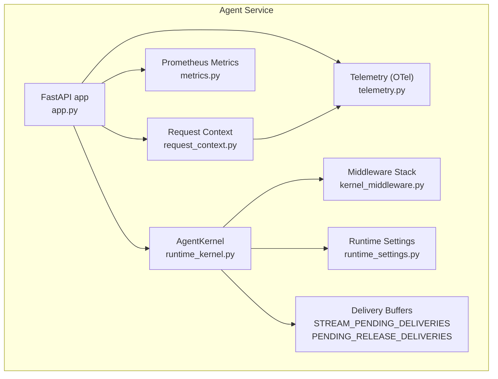
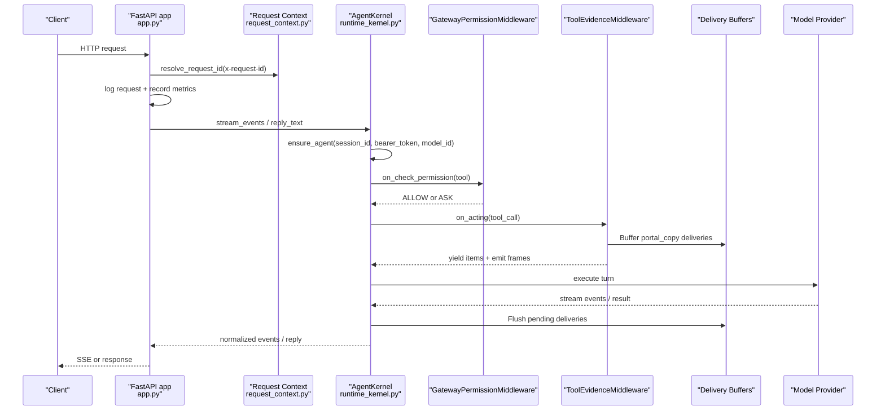
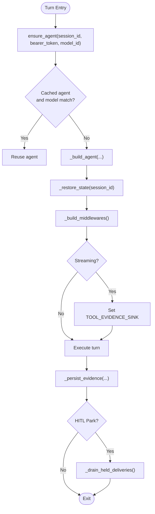
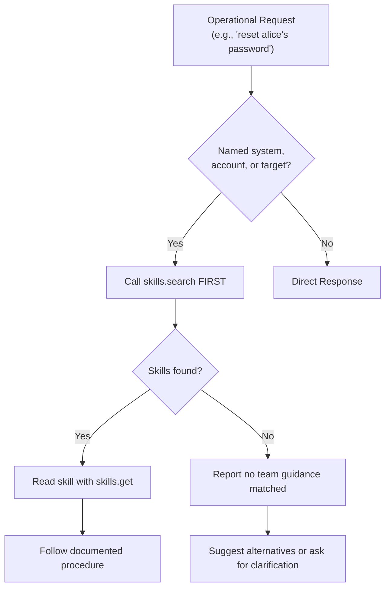
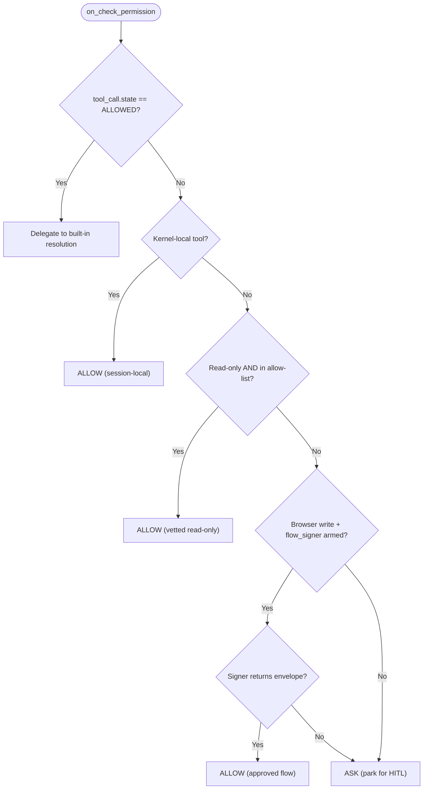
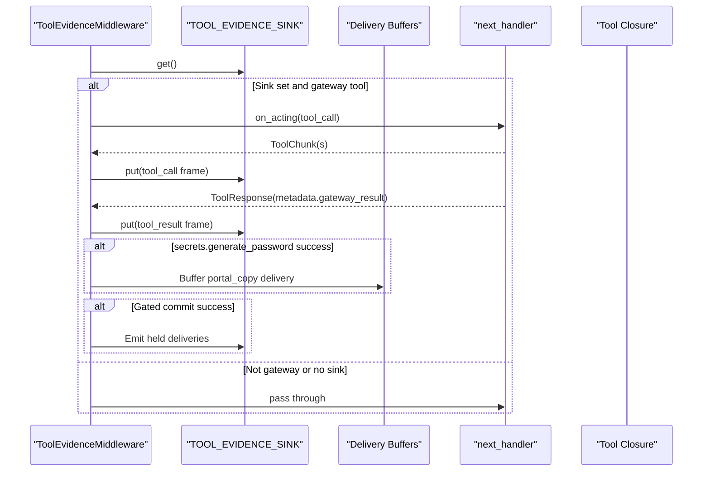
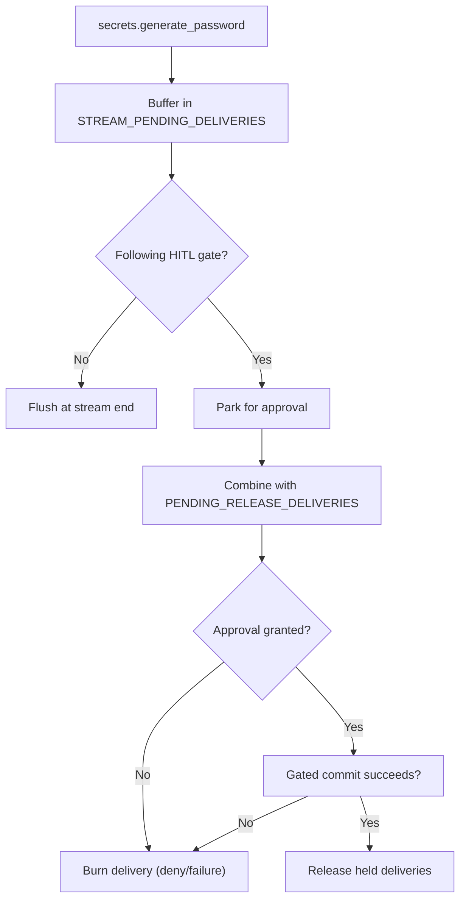
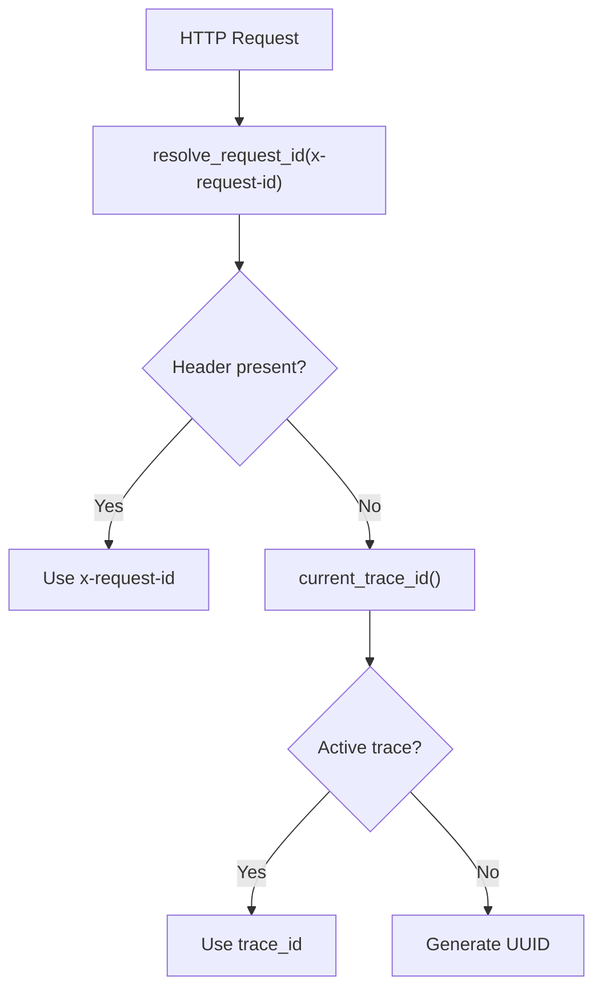
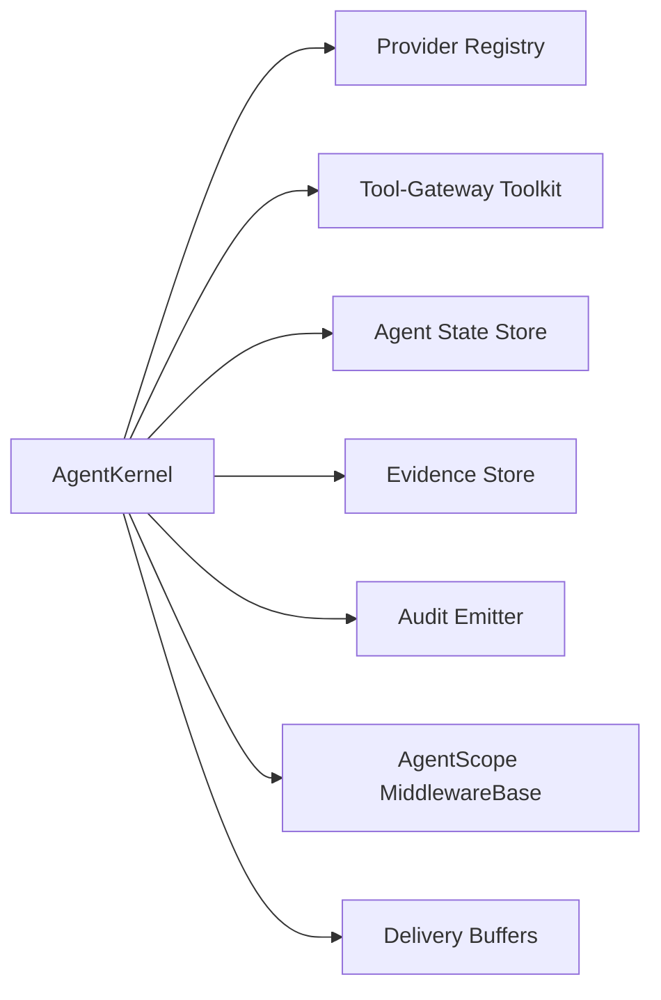

# Runtime Kernel and Middleware

<cite>
**Referenced Files in This Document**
- [runtime_kernel.py](file://products/agent-platform/src/agent_service/runtime_kernel.py)
- [kernel_middleware.py](file://products/agent-platform/src/agent_service/services/kernel_middleware.py)
- [request_context.py](file://products/agent-platform/src/agent_service/core/request_context.py)
- [telemetry.py](file://products/agent-platform/src/agent_service/core/telemetry.py)
- [metrics.py](file://products/agent-platform/src/agent_service/core/metrics.py)
- [runtime_settings.py](file://products/agent-platform/src/agent_service/runtime_settings.py)
- [app.py](file://products/agent-platform/src/agent_service/app.py)
- [test_kernel_middleware.py](file://products/agent-platform/tests/test_kernel_middleware.py)
- [test_runtime_kernel.py](file://products/agent-platform/tests/test_runtime_kernel.py)
- [test_runtime_settings.py](file://products/agent-platform/tests/test_runtime_settings.py)
- [test_secret_delivery_integration.py](file://products/agent-platform/tests/test_secret_delivery_integration.py)
</cite>

## Update Summary
**Changes Made**
- Added comprehensive documentation for per-stream delivery buffers (STREAM_PENDING_DELIVERIES and PENDING_RELEASE_DELIVERIES) for gated secret delivery workflows
- Documented new _flush_pending_deliveries() method for standalone generate-and-copy scenarios
- Documented _drain_held_deliveries() method for HITL workflow support
- Enhanced ToolEvidenceMiddleware documentation to cover secrets.generate_password interception and deferred delivery mechanism
- Updated architecture diagrams to reflect the new delivery buffer system
- Added detailed examples of gated secret delivery workflows

## Table of Contents
1. Introduction
2. Project Structure
3. Core Components
4. Architecture Overview
5. Detailed Component Analysis
6. Dependency Analysis
7. Performance Considerations
8. Troubleshooting Guide
9. Conclusion
10. Appendices

## Introduction
This document explains the Agent Platform's runtime kernel and middleware system that coordinates agent execution, request context propagation, and cross-cutting concerns such as observability, security, and performance. It covers how the kernel composes middlewares for permission gating and evidence emission, how request IDs flow through tracing, and how metrics are collected. It also provides guidance for implementing custom middleware, extending the request pipeline, debugging runtime issues, and scaling for high-throughput scenarios.

**Updated** The runtime kernel now features enhanced per-stream delivery buffers that enable gated secret delivery workflows, allowing secure one-time password generation with deferred reveal-on-commit semantics. This enhancement supports both standalone generate-and-copy scenarios and complex human-in-the-loop (HITL) approval workflows where secrets are only revealed when approved mutations commit successfully.

## Project Structure
The runtime kernel lives under the agent-service package and is composed of:
- A central kernel orchestrating agent lifecycle, toolkit caching, model switching, and streaming turns.
- A middleware stack that enforces permissions and emits evidence frames for streamed tool calls.
- Cross-cutting services for request context resolution, telemetry (OpenTelemetry), and Prometheus metrics.
- Configuration via environment-driven runtime settings.



**Diagram sources**
- [app.py:49-76](file://products/agent-platform/src/agent_service/app.py#L49-L76)
- [runtime_kernel.py:212-235](file://products/agent-platform/src/agent_service/runtime_kernel.py#L212-L235)
- [kernel_middleware.py:151-193](file://products/agent-platform/src/agent_service/services/kernel_middleware.py#L151-L193)
- [request_context.py:8-19](file://products/agent-platform/src/agent_service/core/request_context.py#L8-L19)
- [telemetry.py:69-117](file://products/agent-platform/src/agent_service/core/telemetry.py#L69-L117)
- [metrics.py:52-73](file://products/agent-platform/src/agent_service/core/metrics.py#L52-L73)
- [runtime_settings.py:136-184](file://products/agent-platform/src/agent_service/runtime_settings.py#L136-L184)

**Section sources**
- [app.py:49-76](file://products/agent-platform/src/agent_service/app.py#L49-L76)
- [runtime_kernel.py:212-235](file://products/agent-platform/src/agent_service/runtime_kernel.py#L212-L235)
- [kernel_middleware.py:151-193](file://products/agent-platform/src/agent_service/services/kernel_middleware.py#L151-L193)
- [request_context.py:8-19](file://products/agent-platform/src/agent_service/core/request_context.py#L8-L19)
- [telemetry.py:69-117](file://products/agent-platform/src/agent_service/core/telemetry.py#L69-L117)
- [metrics.py:52-73](file://products/agent-platform/src/agent_service/core/metrics.py#L52-L73)
- [runtime_settings.py:136-184](file://products/agent-platform/src/agent_service/runtime_settings.py#L136-L184)

## Core Components
- AgentKernel: Builds and caches agents per session, composes the middleware stack, manages toolkit discovery and caching per delegated token, handles model switching, structured output, streaming events, and evidence persistence. **Updated** Now includes per-stream delivery buffers for gated secret delivery workflows.
- GatewayPermissionMiddleware: Enforces a platform allow-list for auto-approved read-only tools, always allows kernel-local task tools, and routes other tool invocations to explicit ASK for operator confirmation; supports browser flow unlock for approved mutating flows. **Updated** Outbound HTTP requests now require explicit operator confirmation by default.
- ToolEvidenceMiddleware: Emits tool_call and tool_result evidence frames for gateway-backed tools during streaming, with bounded data summaries and optional full payloads, and redacts sensitive parameters. **Updated** Now intercepts secrets.generate_password calls and implements deferred delivery mechanism using per-stream buffers.
- Request Context: Resolves x-request-id by preferring inbound header, then current OTel trace_id, then generating a UUID.
- Telemetry: Optional OpenTelemetry push pipeline for traces, metrics, and logs; integrates FastAPI and HTTPX instrumentation.
- Metrics: Always-on Prometheus surface with RED middleware and /metrics endpoint; includes counters/gauges for sessions, chat requests, store backends, evidence writes, audit emissions, and model discovery.
- Runtime Settings: Environment-driven configuration for provider options, kernel tuning, middleware toggles, HITL timeouts, evidence caps, model discovery, signed execution, isolated worker, browser flow TTL, audit/incident/skills clients, and authoring-trace bounds. **Updated** Enhanced default system prompt with operational request handling improvements.

**Section sources**
- [runtime_kernel.py:212-235](file://products/agent-platform/src/agent_service/runtime_kernel.py#L212-L235)
- [runtime_kernel.py:462-496](file://products/agent-platform/src/agent_service/runtime_kernel.py#L462-L496)
- [kernel_middleware.py:151-193](file://products/agent-platform/src/agent_service/services/kernel_middleware.py#L151-L193)
- [kernel_middleware.py:282-398](file://products/agent-platform/src/agent_service/services/kernel_middleware.py#L282-L398)
- [request_context.py:8-19](file://products/agent-platform/src/agent_service/core/request_context.py#L8-L19)
- [telemetry.py:69-117](file://products/agent-platform/src/agent_service/core/telemetry.py#L69-L117)
- [metrics.py:23-73](file://products/agent-platform/src/agent_service/core/metrics.py#L23-L73)
- [runtime_settings.py:136-184](file://products/agent-platform/src/agent_service/runtime_settings.py#L136-L184)

## Architecture Overview
The runtime kernel sits at the center of agent execution. Requests enter FastAPI, where logging and metrics are recorded, and request IDs are resolved. The kernel builds or reuses an Agent instance per session, composes middlewares, and executes turns either as blocking replies or streaming events. Middlewares enforce permissions and emit evidence frames. Observability is enabled via optional OTel and always-on Prometheus metrics. **Updated** The architecture now includes per-stream delivery buffers that enable gated secret delivery workflows with reveal-on-commit semantics.



**Diagram sources**
- [app.py:55-71](file://products/agent-platform/src/agent_service/app.py#L55-L71)
- [request_context.py:8-19](file://products/agent-platform/src/agent_service/core/request_context.py#L8-L19)
- [runtime_kernel.py:662-697](file://products/agent-platform/src/agent_service/runtime_kernel.py#L662-L697)
- [kernel_middleware.py:195-279](file://products/agent-platform/src/agent_service/services/kernel_middleware.py#L195-L279)
- [kernel_middleware.py:309-388](file://products/agent-platform/src/agent_service/services/kernel_middleware.py#L309-L388)

## Detailed Component Analysis

### AgentKernel
Responsibilities:
- Agent lifecycle: build, cache, and reuse per session; LRU-bounded cache; serializes concurrent creation to avoid memory loss.
- Toolkit management: discovers tools from the tool-gateway per delegated token; caches per token; filters mutating tools when HITL bridging is disabled; supports read-only toolkits for automated diagnostics.
- Model switching: resolves model id via catalog; rebuilds agent when bound model changes; restores persisted state.
- Streaming and evidence: sets request-scoped evidence sink around streamed turns; persists evidence frames best-effort; flushes streaming prose redactor tails on terminal events. **Updated** Manages per-stream delivery buffers for gated secret delivery workflows.
- Structured output: passes schema to agent and returns validated structured output when requested.
- Observability integration: records metrics for evidence writes and agent state errors; emits audit events via configured service.

Key behaviors verified by tests:
- Placeholder responses when unconfigured.
- Session isolation and bounded cache.
- Concurrent ensure_agent builds only one agent per session.
- Per-token toolkit caching and recovery when gateway tools become available.
- Task tools appended but not counted as gateway tools.
- Kernel config defaults and overrides.
- Structured output round trip.
- State persistence and snapshot failure tolerance.
- **Updated** Per-stream delivery buffer management for gated secret delivery workflows.



**Diagram sources**
- [runtime_kernel.py:699-774](file://products/agent-platform/src/agent_service/runtime_kernel.py#L699-L774)
- [runtime_kernel.py:539-582](file://products/agent-agent-platform/src/agent_service/runtime_kernel.py#L539-L582)
- [runtime_kernel.py:627-660](file://products/agent-platform/src/agent_service/runtime_kernel.py#L627-660)
- [runtime_kernel.py:462-496](file://products/agent-platform/src/agent_service/runtime_kernel.py#L462-L496)

**Section sources**
- [runtime_kernel.py:699-774](file://products/agent-platform/src/agent_service/runtime_kernel.py#L699-L774)
- [runtime_kernel.py:539-582](file://products/agent-platform/src/agent_service/runtime_kernel.py#L539-L582)
- [runtime_kernel.py:627-660](file://products/agent-platform/src/agent_service/runtime_kernel.py#L627-660)
- [runtime_kernel.py:462-496](file://products/agent-platform/src/agent_service/runtime_kernel.py#L462-L496)
- [test_runtime_kernel.py:219-298](file://products/agent-platform/tests/test_runtime_kernel.py#L219-L298)
- [test_runtime_kernel.py:301-552](file://products/agent-platform/tests/test_runtime_kernel.py#L301-L552)
- [test_runtime_kernel.py:652-683](file://products/agent-platform/tests/test_runtime_kernel.py#L652-683)
- [test_runtime_kernel.py:713-749](file://products/agent-platform/tests/test_runtime_kernel.py#L713-L749)
- [test_runtime_kernel.py:757-795](file://products/agent-platform/tests/test_runtime_kernel.py#L757-L795)

### Enhanced Default System Prompt Behavior
**Updated** The runtime kernel's default system prompt has been enhanced to improve operational request handling and prevent anti-fabrication refusals.

Key enhancements include:
- **Skills Search Priority**: Models are instructed to use `skills.search FIRST` for any request to act on named systems, accounts, or targets
- **Operational Request Triggers**: Specific triggers like "resetting a password", "locking or recovering an account", "restarting or scaling a workload" are explicitly covered
- **Anti-Fabrication Prevention**: Reframes absence of offhand grounding as a reason to search rather than to refuse
- **Skill Citation Requirements**: Models must cite skills they rely on by title or skill_id
- **Guidance vs Live Data Separation**: Clear distinction between skill guidance and live cluster data

Behavior verified by tests:
- Operational request triggers are properly defined in the default prompt
- Skills search precedence is enforced before any refusal decisions
- Anti-fabrication safeguards prevent premature conclusions about missing systems or credentials
- Browser authorization discipline is maintained alongside operational improvements



**Diagram sources**
- [runtime_settings.py:8-58](file://products/agent-platform/src/agent_service/runtime_settings.py#L8-L58)
- [test_runtime_settings.py:30-54](file://products/agent-platform/tests/test_runtime_settings.py#L30-L54)

**Section sources**
- [runtime_settings.py:8-58](file://products/agent-platform/src/agent_service/runtime_settings.py#L8-L58)
- [test_runtime_settings.py:30-54](file://products/agent-platform/tests/test_runtime_settings.py#L30-L54)

### GatewayPermissionMiddleware
Responsibilities:
- Auto-approve vetted read-only gateway tools from a static allow-list; environment override supported. **Updated** `http.get` has been removed from the default allow-list due to security hardening.
- Always allow kernel-local tools (task tools and structured-output delivery).
- Route all other tools to explicit ASK to park for operator confirmation; avoids delegating to built-in PermissionEngine to prevent bypassing the allow-list.
- Supports browser flow unlock: when a mutating web.* call occurs inside an already-approved flow, an optional flow_signer can return an envelope to ALLOW it once per flow.

Behavior verified by tests:
- Default allow-list normalization and env override behavior.
- Read-only invariant prevents auto-approval of write-tier tools even if forced into allow-list.
- Missing tool delegates to built-in resolution.
- Already-ALLOWED calls on resume bypass re-ASK.
- Task tools and structured-output tool always allowed.
- Browser flow unlock consults signer only for BROWSER_WRITE_TOOLS and fails safe when no authority exists.



**Diagram sources**
- [kernel_middleware.py:195-279](file://products/agent-platform/src/agent_service/services/kernel_middleware.py#L195-L279)

**Section sources**
- [kernel_middleware.py:151-193](file://products/agent-platform/src/agent_service/services/kernel_middleware.py#L151-L193)
- [kernel_middleware.py:195-279](file://products/agent-platform/src/agent_service/services/kernel_middleware.py#L195-L279)
- [test_kernel_middleware.py:161-360](file://products/agent-platform/tests/test_kernel_middleware.py#L161-L360)
- [test_kernel_middleware.py:365-505](file://products/agent-platform/tests/test_kernel_middleware.py#L365-L505)

### ToolEvidenceMiddleware
Responsibilities:
- Emit tool_call and tool_result frames for gateway-backed tools during streaming.
- Redact sensitive parameters in tool_call frames.
- Include bounded data_summary and optional full data payload within size limits.
- Keep frame schema valid even when gateway result is missing or error.
- **Updated** Intercept secrets.generate_password calls and implement deferred delivery mechanism using per-stream buffers.

Behavior verified by tests:
- Frames conform to agent-stream-event schema.
- Secret masking in parameters while preserving raw input for signing/digest paths.
- Error status and error details included on failures.
- Data truncation markers and omission of oversized full data.
- No frames emitted when sink is unset (blocking turns).
- Non-gateway tools pass through silently.
- **Updated** Deferred delivery mechanism for secrets.generate_password with proper buffer management.



**Diagram sources**
- [kernel_middleware.py:309-388](file://products/agent-platform/src/agent_service/services/kernel_middleware.py#L309-L388)

**Section sources**
- [kernel_middleware.py:282-398](file://products/agent-platform/src/agent_service/services/kernel_middleware.py#L282-L398)
- [kernel_middleware.py:490-544](file://products/agent-platform/src/agent_service/services/kernel_middleware.py#L490-L544)
- [test_kernel_middleware.py:508-736](file://products/agent-platform/tests/test_kernel_middleware.py#L508-L736)
- [test_kernel_middleware.py:738-787](file://products/agent-platform/tests/test_kernel_middleware.py#L738-L787)
- [test_kernel_middleware.py:760-815](file://products/agent-platform/tests/test_kernel_middleware.py#L760-L815)
- [test_kernel_middleware.py:816-888](file://products/agent-platform/tests/test_kernel_middleware.py#L816-L888)

### Per-Stream Delivery Buffers
**New Section** The enhanced runtime kernel introduces per-stream delivery buffers that enable gated secret delivery workflows with reveal-on-commit semantics.

Key components:
- **STREAM_PENDING_DELIVERIES**: Context variable holding deliveries generated in the current stream for deferred reveal
- **PENDING_RELEASE_DELIVERIES**: Context variable carrying deliveries from prior parks that await release on gated commits
- **_flush_pending_deliveries()**: Method to emit buffered portal_copy deliveries as frames at normal stream end
- **_drain_held_deliveries()**: Method to combine both buffer types for parked cards across HITL workflows

Workflow patterns:
- **Standalone generate-and-copy**: Secrets generated without following gates are flushed at stream end
- **Gated reveal-on-commit**: Secrets generated before HITL approval are released only when approved mutations succeed
- **HITL workflow support**: Held deliveries ride across park/resume cycles and are released on successful gated commits



**Diagram sources**
- [runtime_kernel.py:1249-1295](file://products/agent-platform/src/agent_service/runtime_kernel.py#L1249-L1295)
- [kernel_middleware.py:68-75](file://products/agent-platform/src/agent_service/services/kernel_middleware.py#L68-L75)
- [kernel_middleware.py:490-544](file://products/agent-platform/src/agent_service/services/kernel_middleware.py#L490-L544)

**Section sources**
- [runtime_kernel.py:1249-1295](file://products/agent-platform/src/agent_service/runtime_kernel.py#L1249-L1295)
- [kernel_middleware.py:68-75](file://products/agent-platform/src/agent_service/services/kernel_middleware.py#L68-L75)
- [kernel_middleware.py:490-544](file://products/agent-platform/src/agent_service/services/kernel_middleware.py#L490-L544)
- [test_secret_delivery_integration.py:35-152](file://products/agent-platform/tests/test_secret_delivery_integration.py#L35-L152)
- [test_kernel_middleware.py:760-815](file://products/agent-platform/tests/test_kernel_middleware.py#L760-L815)
- [test_kernel_middleware.py:816-888](file://products/agent-platform/tests/test_kernel_middleware.py#L816-L888)

### Request Context and Tracing Integration
- Request ID resolution prefers inbound x-request-id, falls back to current OTel trace_id when tracing is enabled, otherwise generates a UUID.
- Telemetry setup initializes providers and instrumentations when OTEL_ENABLED is true; fail-open on setup errors.
- current_trace_id exposes the active span's W3C trace_id for correlation.



**Diagram sources**
- [request_context.py:8-19](file://products/agent-platform/src/agent_service/core/request_context.py#L8-L19)
- [telemetry.py:120-132](file://products/agent-platform/src/agent_service/core/telemetry.py#L120-L132)

**Section sources**
- [request_context.py:8-19](file://products/agent-platform/src/agent_service/core/request_context.py#L8-L19)
- [telemetry.py:69-117](file://products/agent-platform/src/agent_service/core/telemetry.py#L69-L117)
- [telemetry.py:120-132](file://products/agent-platform/src/agent_service/core/telemetry.py#L120-L132)
- [app.py:55-71](file://products/agent-platform/src/agent_service/app.py#L55-L71)

### Metrics Collection
- Always-on Prometheus metrics via RED middleware and GET /metrics.
- Counters and gauges for HTTP requests/duration, sessions created, chat requests, session/agent state stores, evidence writes, audit emissions, and model discovery.
- Handlers label metrics by templated route path to keep cardinality bounded.

**Section sources**
- [metrics.py:23-73](file://products/agent-platform/src/agent_service/core/metrics.py#L23-L73)
- [metrics.py:84-185](file://products/agent-platform/src/agent_service/core/metrics.py#L84-L185)
- [metrics.py:188-224](file://products/agent-platform/src/agent_service/core/metrics.py#L188-L224)

### Runtime Settings and Configuration
- Environment-driven configuration for provider options, kernel tuning, middleware toggles, HITL timeout, evidence caps, model discovery, signed execution, isolated worker, browser flow approval TTL, audit/incident/skills clients, and authoring-trace bounds.
- Validation ensures sane defaults and rejects invalid values at startup.
- **Updated** Enhanced default system prompt with operational request handling improvements including skills.search-first policy and anti-fabrication prevention.

**Section sources**
- [runtime_settings.py:136-184](file://products/agent-platform/src/agent_service/runtime_settings.py#L136-L184)
- [runtime_settings.py:265-341](file://products/agent-platform/src/agent_service/runtime_settings.py#L265-L341)
- [runtime_settings.py:413-517](file://products/agent-platform/src/agent_service/runtime_settings.py#L413-L517)

## Dependency Analysis
The kernel depends on:
- Providers registry to build models and adapt settings.
- Tool-gateway for discovering and invoking tools.
- Stores for agent state, evidence, execution records, confirmations, and approvals.
- Audit emitter for durable audit trail.
- Middleware base classes from AgentScope for permission and acting hooks.



**Diagram sources**
- [runtime_kernel.py:9-67](file://products/agent-platform/src/agent_service/runtime_kernel.py#L9-L67)
- [runtime_kernel.py:340-403](file://products/agent-platform/src/agent_service/runtime_kernel.py#L340-L403)
- [runtime_kernel.py:539-582](file://products/agent-platform/src/agent_service/runtime_kernel.py#L539-L582)
- [runtime_kernel.py:627-660](file://products/agent-platform/src/agent_service/runtime_kernel.py#L627-660)
- [kernel_middleware.py:30-37](file://products/agent-platform/src/agent_service/services/kernel_middleware.py#L30-L37)

**Section sources**
- [runtime_kernel.py:9-67](file://products/agent-platform/src/agent_service/runtime_kernel.py#L9-L67)
- [runtime_kernel.py:340-403](file://products/agent-platform/src/agent_service/runtime_kernel.py#L340-L403)
- [runtime_kernel.py:539-582](file://products/agent-platform/src/agent_service/runtime_kernel.py#L539-L582)
- [runtime_kernel.py:627-660](file://products/agent-platform/src/agent_service/runtime_kernel.py#L627-660)
- [kernel_middleware.py:30-37](file://products/agent-platform/src/agent_service/services/kernel_middleware.py#L30-L37)

## Performance Considerations
- Agent cache: LRU-bounded per-session cache reduces rebuild overhead; concurrent access serialized to prevent memory loss.
- Toolkit caching: Per-delegated-token caching avoids repeated discovery; empty discovery results intentionally not cached to recover from transient failures.
- Evidence framing: Bounded data_summary and optional full data prevent large payloads from degrading streams; oversized payloads omitted from frames.
- Streaming redaction: Terminal event flushing ensures complete text delivery without buffering artifacts.
- Observability overhead: OTel push pipeline is opt-in; Prometheus metrics use bounded labels and lightweight counters/histograms.
- Model switching: Rebuilds occur only when necessary (model id change or toolkit recovery), preserving conversation history via persisted state.
- **Updated** Enhanced system prompt processing: Skills search-first approach may add initial latency but improves overall operational efficiency by reducing failed attempts and improving first-time success rates.
- **Updated** Delivery buffer management: Per-stream buffers minimize memory footprint and provide efficient deferred delivery mechanisms without blocking main execution paths.

## Troubleshooting Guide
Common issues and diagnostics:
- Unconfigured runtime: placeholder responses indicate missing provider configuration; check runtime metadata and configuration hint.
- Provider errors: runtime_state shows provider_error; last_error surfaces the latest failure; configuration_hint includes provider attribution.
- Toolkit discovery failures: empty discovery is retried each turn; monitor agent toolkit counts and logs for warnings.
- Evidence persistence failures: best-effort persistence; watch evidence_store_writes_total and related error counters.
- Agent state restore/snapshot failures: degraded durability but turns continue; monitor agent_state_errors_total and fallback counters.
- HITL parking: unexpected ASK indicates tool not in allow-list or flow-unlock not applicable; verify allow-list and flow authority. **Updated** `http.get` now parks by default unless explicitly opted in via `AGENT_GATEWAY_TOOL_AUTO_ALLOW_EXTRA`.
- **Updated** Operational request refusals: If models refuse operational requests without calling skills.search, verify the enhanced default system prompt is being used and that skills.search tool is available.
- **Updated** Secret delivery issues: Monitor delivery buffer states and verify portal_copy handles are properly formatted; check that held deliveries are released only on successful gated commits.
- Telemetry misconfiguration: OTel setup failures are logged but do not block requests; verify OTEL_ENABLED and endpoint configuration.

**Section sources**
- [runtime_kernel.py:236-289](file://products/agent-platform/src/agent_service/runtime_kernel.py#L236-L289)
- [runtime_kernel.py:539-582](file://products/agent-platform/src/agent_service/runtime_kernel.py#L539-L582)
- [runtime_kernel.py:627-660](file://products/agent-platform/src/agent_service/runtime_kernel.py#L627-660)
- [kernel_middleware.py:195-279](file://products/agent-platform/src/agent_service/services/kernel_middleware.py#L195-L279)
- [telemetry.py:69-117](file://products/agent-platform/src/agent_service/core/telemetry.py#L69-L117)
- [metrics.py:156-185](file://products/agent-platform/src/agent_service/core/metrics.py#L156-L185)

## Conclusion
The runtime kernel provides a robust, configurable foundation for agent execution with strong separation of concerns: permission gating, evidence emission, request context propagation, and observability. Its design emphasizes safety (deny-by-default permissions, bounded payloads), resilience (best-effort persistence, fail-open telemetry), and scalability (per-session caching, per-token toolkit caching, streaming). Operators can tune behavior via environment-driven settings and extend the pipeline through supported middleware hooks.

**Updated** The enhanced runtime kernel now includes sophisticated per-stream delivery buffers that enable secure gated secret delivery workflows with reveal-on-commit semantics. This enhancement supports both standalone generate-and-copy scenarios and complex human-in-the-loop (HITL) approval workflows where secrets are only revealed when approved mutations commit successfully. The enhanced default system prompt significantly improves operational request handling by ensuring models consult skills.search FIRST for any request to act on named systems, accounts, or targets. This prevents anti-fabrication refusals and promotes better operational workflows by prioritizing skill-based guidance over model-generated procedures. The security posture has been strengthened with hardened defaults that require explicit operator confirmation for outbound HTTP requests, providing defense-in-depth against potential SSRF vulnerabilities while maintaining operational flexibility through additive configuration.

## Appendices

### Implementing Custom Middleware
To add cross-cutting behavior:
- Subclass MiddlewareBase and implement on_check_permission to influence tool admission or on_acting to observe/instrument tool execution.
- Compose your middleware into the kernel's stack via _build_middlewares or equivalent extension points.
- Ensure your middleware respects request-scoped contexts (e.g., TOOL_EVIDENCE_SINK) and does not introduce unbounded data in frames.

Guidance grounded in existing patterns:
- Permission decisions should explicitly ALLOW or ASK rather than delegating to built-in engines when platform policy requires strict control.
- Evidence emission should produce schema-valid frames with bounded data and redacted parameters.
- **Updated** For secret delivery workflows, leverage the per-stream delivery buffers (STREAM_PENDING_DELIVERIES and PENDING_RELEASE_DELIVERIES) for deferred reveal semantics.

**Section sources**
- [kernel_middleware.py:151-193](file://products/agent-platform/src/agent_service/services/kernel_middleware.py#L151-L193)
- [kernel_middleware.py:282-398](file://products/agent-platform/src/agent_service/services/kernel_middleware.py#L282-L398)
- [kernel_middleware.py:490-544](file://products/agent-platform/src/agent_service/services/kernel_middleware.py#L490-L544)
- [runtime_kernel.py:462-496](file://products/agent-platform/src/agent_service/runtime_kernel.py#L462-L496)

### Extending the Request Pipeline
- Add HTTP-level middleware in the FastAPI app for logging, metrics, or auth before routing.
- Use request context resolution to correlate requests across services using x-request-id or trace_id.
- Enable OTel for distributed tracing and attach log bridge to correlate logs with traces.
- **Updated** Leverage per-stream delivery buffers for implementing custom secret delivery workflows with gated reveal semantics.

**Section sources**
- [app.py:55-76](file://products/agent-platform/src/agent_service/app.py#L55-L76)
- [request_context.py:8-19](file://products/agent-platform/src/agent_service/core/request_context.py#L8-L19)
- [telemetry.py:69-117](file://products/agent-platform/src/agent_service/core/telemetry.py#L69-L117)

### Debugging Runtime Issues
- Inspect runtime_metadata and configuration_hint to validate provider and model configuration.
- Monitor Prometheus metrics for anomalies in request rates, durations, store errors, and evidence writes.
- Validate middleware behavior with unit-style checks similar to existing tests for permission and evidence emission.
- **Updated** For operational request issues: Verify that the enhanced default system prompt is active and that skills.search tool is properly configured and accessible.
- **Updated** For secret delivery issues: Monitor delivery buffer states, verify portal_copy handle formatting, and ensure held deliveries are properly released on successful gated commits.

**Section sources**
- [runtime_kernel.py:236-289](file://products/agent-platform/src/agent_service/runtime_kernel.py#L236-L289)
- [metrics.py:23-73](file://products/agent-platform/src/agent_service/core/metrics.py#L23-L73)
- [test_kernel_middleware.py:161-360](file://products/agent-platform/tests/test_kernel_middleware.py#L161-L360)
- [test_kernel_middleware.py:508-736](file://products/agent-platform/tests/test_kernel_middleware.py#L508-L736)

### Managing the Auto-Allow List

**Updated** Security hardening in v0.39.1 removed `http.get` from the default auto-allow list, requiring explicit operator confirmation for outbound HTTP requests by default.

`AGENT_GATEWAY_TOOL_AUTO_ALLOW` controls Layer 3 only.

Semantics:

- **Unset** → the built-in vetted list (the read tools shipped with the platform). The authoritative copy is `DEFAULT_AUTO_ALLOWED_TOOLS` in `agent_service/services/kernel_middleware.py`; as shipped it includes `k8s.list_pods`, `k8s.get_pod`, `k8s.get_events`, `k8s.get_pod_logs`, `skills.search`, `skills.get`, `skills.list`, `incidents.list`, `incidents.get`, `secrets.generate_password`, and the read-class browser probes (`web.navigate`, `web.snapshot`, `web.screenshot`, `web.fill_credential`, `web.extract`, `web.wait_for`, `web.hover`, `web.scroll`, `web.switch_frame`). **Note:** `http.get` is no longer included in the default list due to security hardening. Every write-tier tool is absent by construction — including `web.click`/`web.type`/`web.evaluate`, `http.post` and `k8s.delete_pod` — and naming one cannot change that (see the invariant below).
- **Empty string** → auto-approve nothing; every gateway tool parks for confirmation.
- **Comma-separated dotted names** → replaces the default entirely. Names are normalized to AgentScope's sanitized form (`k8s.get_pod` → `k8s_get_pod`). Unknown names are harmless (they simply match nothing).

**New Additive Configuration**: `AGENT_GATEWAY_TOOL_AUTO_ALLOW_EXTRA` provides additive tool approval without restating the entire default list.

- **Additive behavior**: Entries are unioned with the resolved set (built-in default or replacement set when `AGENT_GATEWAY_TOOL_AUTO_ALLOW` is also present).
- **Normalization**: Both variables normalize dots to underscores for AgentScope compatibility.
- **Composition**: The two variables compose together, allowing fine-grained control over auto-approval.

Configuration examples:

```bash
# Opt out http.get from auto-approval (default hardened behavior)
# No configuration needed - http.get parks by default

# Opt in http.get for card-free operation (additive)
AGENT_GATEWAY_TOOL_AUTO_ALLOW_EXTRA=http.get

# Replace default with custom list (replacement semantics)
AGENT_GATEWAY_TOOL_AUTO_ALLOW=k8s.list_pods,k8s.get_pod,elastic.search_logs

# Combine replacement with additive opt-ins
AGENT_GATEWAY_TOOL_AUTO_ALLOW=k8s.get_pod
AGENT_GATEWAY_TOOL_AUTO_ALLOW_EXTRA=http.get
```

**Security Posture**: Outbound HTTP requests now require explicit operator confirmation by default, representing a shift from automatic approval to opt-in behavior for network egress operations. This provides defense-in-depth against potential SSRF vulnerabilities while maintaining operational flexibility through the additive configuration approach.

**Invariant**: Mutating tools are never auto-approved regardless of these settings. If a write/admin tool appears in any auto-allow variable, agent-platform logs a warning at toolkit construction and the tool still parks for confirmation.

**Section sources**
- [kernel_middleware.py:71-115](file://products/agent-platform/src/agent_service/services/kernel_middleware.py#L71-L115)
- [kernel_middleware.py:117-139](file://products/agent-platform/src/agent_service/services/kernel_middleware.py#L117-L139)
- [test_kernel_middleware.py:178-205](file://products/agent-platform/tests/test_kernel_middleware.py#L178-L205)
- [test_kernel_middleware.py:222-233](file://products/agent-platform/tests/test_kernel_middleware.py#L222-L233)

### Enhanced Operational Request Handling
**New Section** The enhanced default system prompt introduces significant improvements to operational request handling:

**Key Improvements:**
- **Skills Search First Policy**: All operational requests to act on named systems, accounts, or targets now trigger skills.search before any other action
- **Anti-Fabrication Prevention**: Models are instructed to treat absence of offhand knowledge as a reason to search rather than refuse
- **Operational Trigger Coverage**: Specific operational scenarios like password resets, account locking/recovery, workload restarts/scaling are explicitly covered
- **Skill Citation Requirements**: Models must cite skills they rely on, improving transparency and auditability

**Implementation Details:**
- The enhanced prompt is defined in `DEFAULT_SYSTEM_PROMPT` in `runtime_settings.py`
- Tests verify proper trigger coverage and skills search precedence
- The prompt maintains existing browser authorization discipline while adding operational capabilities

**Benefits:**
- Reduced operational friction for common administrative tasks
- Improved consistency in following documented procedures
- Better audit trails through skill citation requirements
- Enhanced safety through mandatory skill-based guidance

**Section sources**
- [runtime_settings.py:8-58](file://products/agent-platform/src/agent_service/runtime_settings.py#L8-L58)
- [test_runtime_settings.py:30-54](file://products/agent-platform/tests/test_runtime_settings.py#L30-L54)

### Gated Secret Delivery Workflows
**New Section** The enhanced runtime kernel implements sophisticated gated secret delivery workflows with reveal-on-commit semantics for secure password generation and handoff.

**Core Components:**
- **Per-Stream Delivery Buffers**: STREAM_PENDING_DELIVERIES and PENDING_RELEASE_DELIVERIES context variables manage deferred secret delivery
- **Deferred Reveal Mechanism**: Secrets are buffered during generation and only revealed when appropriate conditions are met
- **HITL Workflow Support**: Held deliveries persist across park/resume cycles and are released only on successful gated commits

**Workflow Patterns:**
- **Standalone Generate-and-Copy**: Secrets generated without following gates are automatically flushed at stream end
- **Gated Reveal-on-Commit**: Secrets generated before HITL approval are released only when approved mutations succeed
- **Failure Safety**: Denied or failed gated calls burn held deliveries silently, preventing secret exposure

**Security Benefits:**
- Secrets are never exposed in evidence frames or stream events until appropriate conditions are met
- Single-use delivery handles prevent replay attacks
- Owner-scoped redemption ensures only authorized users can access secrets
- TTL-based expiration prevents indefinite secret retention

**Section sources**
- [runtime_kernel.py:1249-1295](file://products/agent-platform/src/agent_service/runtime_kernel.py#L1249-L1295)
- [kernel_middleware.py:68-75](file://products/agent-platform/src/agent_service/services/kernel_middleware.py#L68-L75)
- [kernel_middleware.py:490-544](file://products/agent-platform/src/agent_service/services/kernel_middleware.py#L490-L544)
- [test_secret_delivery_integration.py:35-152](file://products/agent-platform/tests/test_secret_delivery_integration.py#L35-L152)
- [test_kernel_middleware.py:760-815](file://products/agent-platform/tests/test_kernel_middleware.py#L760-L815)
- [test_kernel_middleware.py:816-888](file://products/agent-platform/tests/test_kernel_middleware.py#L816-L888)