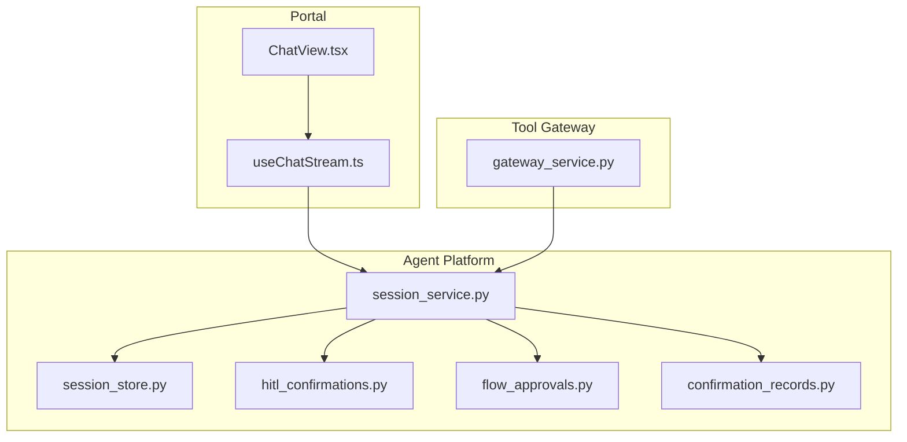
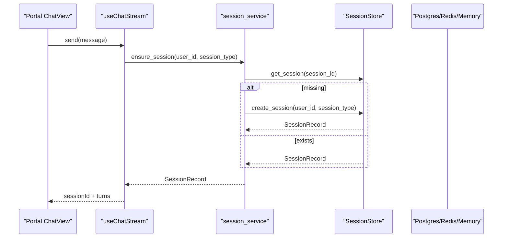
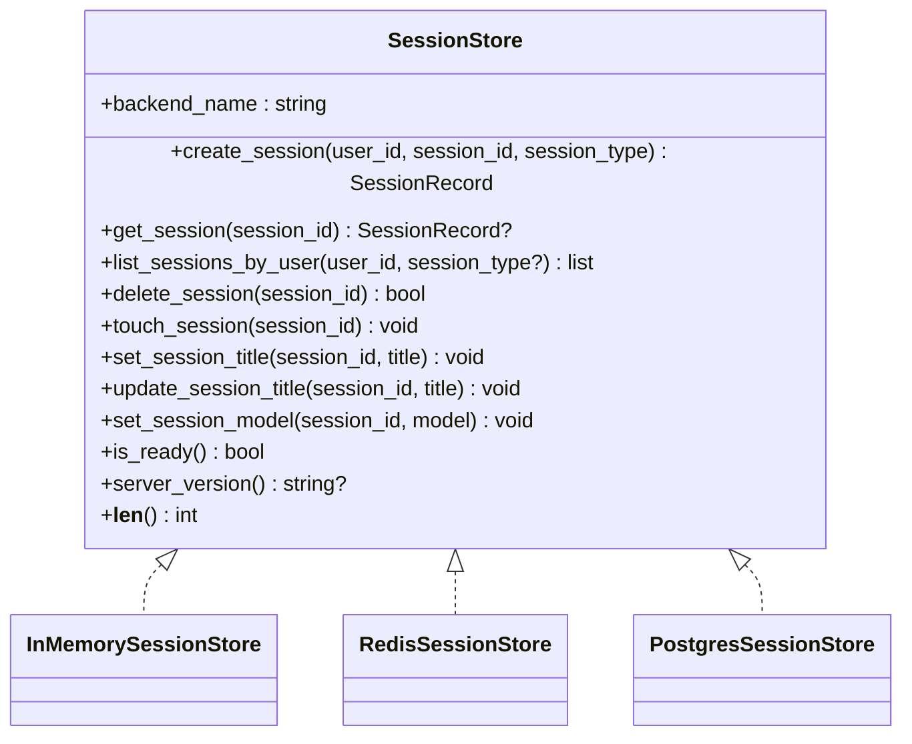
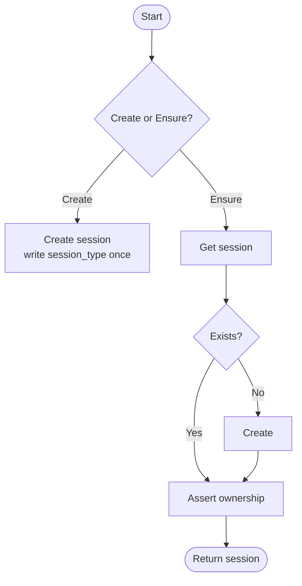
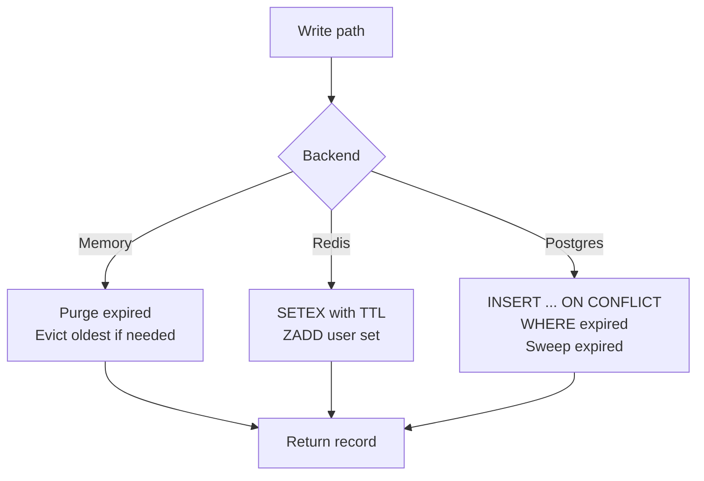
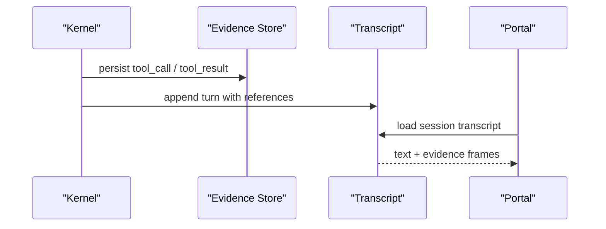
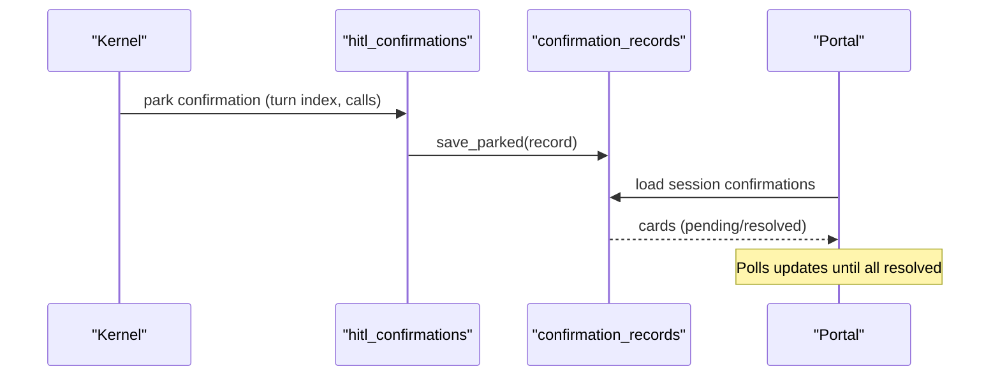
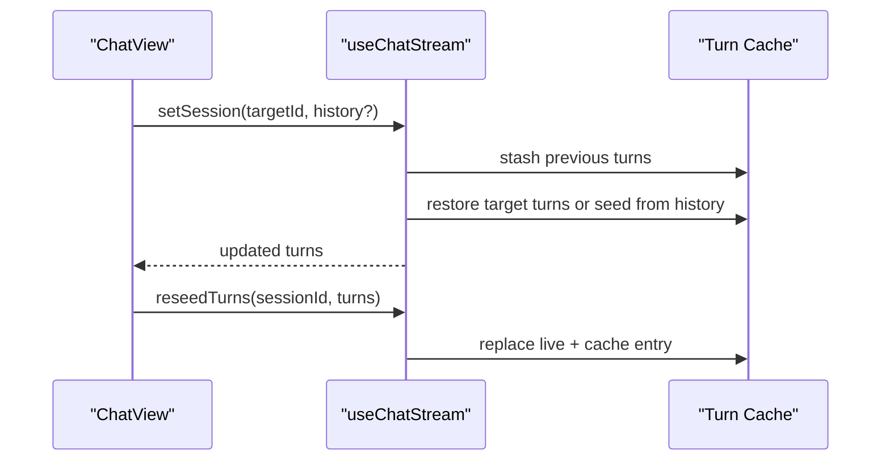
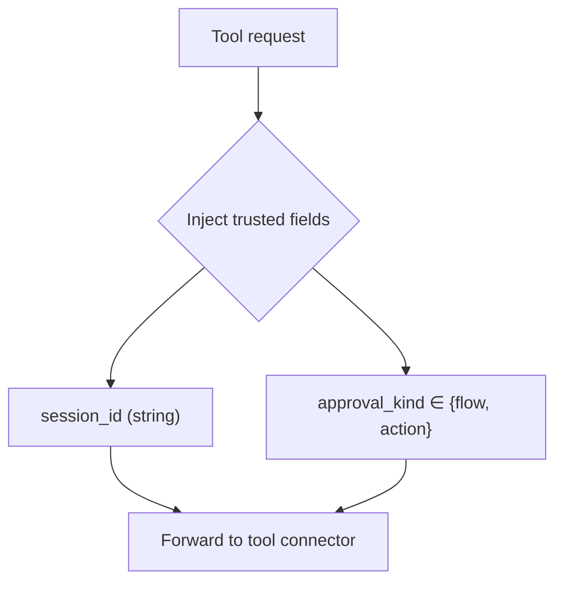
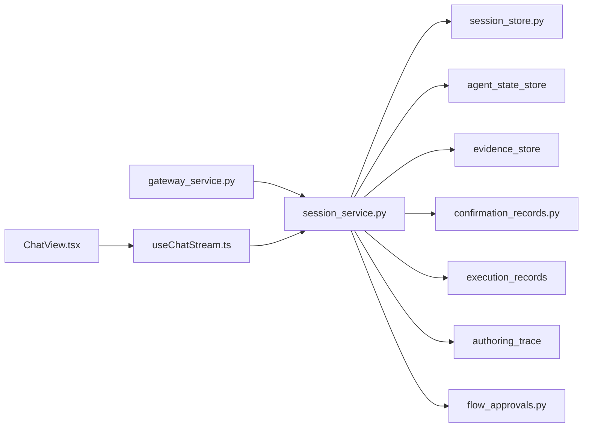

# Session Management

<cite>
**Referenced Files in This Document**
- [session_store.py](file://products/agent-platform/src/agent_service/services/session_store.py)
- [session_service.py](file://products/agent-platform/src/agent_service/services/session_service.py)
- [hitl_confirmations.py](file://products/agent-platform/src/agent_service/services/hitl_confirmations.py)
- [flow_approvals.py](file://products/agent-platform/src/agent_service/services/flow_approvals.py)
- [confirmation_records.py](file://products/agent-platform/src/agent_service/services/confirmation_records.py)
- [gateway_service.py](file://products/tool-gateway/src/tool_gateway/services/gateway_service.py)
- [useChatStream.ts](file://products/operator-portal/web-ui/app/src/stream/useChatStream.ts)
- [ChatView.tsx](file://products/operator-portal/web-ui/app/src/chat/ChatView.tsx)
- [SPEC-025-evidence-persistence-in-transcripts/spec.md](file://docs/specs/SPEC-025-evidence-persistence-in-transcripts/spec.md)
- [approval-and-hitl.md](file://docs/guides/approval-and-hitl.md)
- [test_session_service.py](file://products/agent-platform/tests/test_session_service.py)
- [test_confirmation_records.py](file://products/agent-platform/tests/test_confirmation_records.py)
</cite>

## Table of Contents
1. [Introduction](#introduction)
2. [Project Structure](#project-structure)
3. [Core Components](#core-components)
4. [Architecture Overview](#architecture-overview)
5. [Detailed Component Analysis](#detailed-component-analysis)
6. [Dependency Analysis](#dependency-analysis)
7. [Performance Considerations](#performance-considerations)
8. [Troubleshooting Guide](#troubleshooting-guide)
9. [Conclusion](#conclusion)
10. [Appendices](#appendices)

## Introduction
This document explains the Agent Platform session management system: how sessions are created, persisted, and managed across storage backends; how their lifecycle is handled from creation to termination; how state is serialized and recovered; how concurrent access is handled; how transcripts and message history are maintained; and how sessions integrate with human-in-the-loop (HITL) approval workflows. It also covers isolation patterns, memory considerations, and scaling strategies for high-concurrency environments.

## Project Structure
Session management spans three layers:
- Service layer: orchestrates session operations, ownership checks, and cleanup of related data.
- Storage layer: pluggable backends for ephemeral (in-memory, Redis) and durable (PostgreSQL) persistence.
- Portal integration: UI streams, session switching, and transcript loading.

**Diagram sources**
- [session_service.py:52-113](file://products/agent-platform/src/agent_service/services/session_service.py#L52-L113)
- [session_store.py:46-120](file://products/agent-platform/src/agent_service/services/session_store.py#L46-L120)
- [gateway_service.py:168-195](file://products/tool-gateway/src/tool_gateway/services/gateway_service.py#L168-L195)
- [useChatStream.ts:456-488](file://products/operator-portal/web-ui/app/src/stream/useChatStream.ts#L456-L488)
- [ChatView.tsx:1303-1340](file://products/operator-portal/web-ui/app/src/chat/ChatView.tsx#L1303-L1340)

**Section sources**
- [session_service.py:52-113](file://products/agent-platform/src/agent_service/services/session_service.py#L52-L113)
- [session_store.py:46-120](file://products/agent-platform/src/agent_service/services/session_store.py#L46-L120)
- [gateway_service.py:168-195](file://products/tool-gateway/src/tool_gateway/services/gateway_service.py#L168-L195)
- [useChatStream.ts:456-488](file://products/operator-portal/web-ui/app/src/stream/useChatStream.ts#L456-L488)
- [ChatView.tsx:1303-1340](file://products/operator-portal/web-ui/app/src/chat/ChatView.tsx#L1303-L1340)

## Core Components
- SessionStore protocol and backends: InMemory, Redis, PostgreSQL. The factory selects a backend by environment variables and records metrics on selection or fallback.
- SessionService: creates, ensures, lists, renames, pins models, and deletes sessions; enforces ownership; coordinates cleanup of agent state, evidence, confirmation records, execution records, and authoring traces.
- HITL and approvals: per-session flow context and approvals; durable confirmation records; inbox and owner transcript cards.
- Tool gateway correlation: injects chat session id and approval kind into tool calls to maintain identity continuity across HITL handoffs.
- Portal streaming: per-tab turn cache, session switching, reseed on decision arrival, and transcript seeding.

Key behaviors:
- TTL-based expiration and eviction (memory), key expiry (Redis), idle TTL refresh and sweep (Postgres).
- Set-once title semantics with optional owner rename.
- Model pinning per session for affinity.
- Ownership enforcement via 404 for foreign IDs.

**Section sources**
- [session_store.py:46-120](file://products/agent-platform/src/agent_service/services/session_store.py#L46-L120)
- [session_store.py:128-237](file://products/agent-platform/src/agent_service/services/session_store.py#L128-L237)
- [session_store.py:244-478](file://products/agent-platform/src/agent_service/services/session_store.py#L244-L478)
- [session_store.py:485-653](file://products/agent-platform/src/agent_service/services/session_store.py#L485-L653)
- [session_store.py:657-800](file://products/agent-platform/src/agent_service/services/session_store.py#L657-L800)
- [session_service.py:52-113](file://products/agent-platform/src/agent_service/services/session_service.py#L52-L113)
- [session_service.py:124-200](file://products/agent-platform/src/agent_service/services/session_service.py#L124-L200)
- [session_service.py:203-265](file://products/agent-platform/src/agent_service/services/session_service.py#L203-L265)
- [gateway_service.py:168-195](file://products/tool-gateway/src/tool_gateway/services/gateway_service.py#L168-L195)
- [useChatStream.ts:456-488](file://products/operator-portal/web-ui/app/src/stream/useChatStream.ts#L456-L488)
- [ChatView.tsx:1303-1340](file://products/operator-portal/web-ui/app/src/chat/ChatView.tsx#L1303-L1340)

## Architecture Overview
The session lifecycle flows through service and storage layers, with portal interactions for streaming and switching.

**Diagram sources**
- [session_service.py:97-113](file://products/agent-platform/src/agent_service/services/session_service.py#L97-L113)
- [session_store.py:163-181](file://products/agent-platform/src/agent_service/services/session_store.py#L163-L181)
- [session_store.py:285-309](file://products/agent-platform/src/agent_service/services/session_store.py#L285-L309)
- [session_store.py:697-733](file://products/agent-platform/src/agent_service/services/session_store.py#L697-L733)
- [useChatStream.ts:456-488](file://products/operator-portal/web-ui/app/src/stream/useChatStream.ts#L456-L488)

## Detailed Component Analysis

### Session Store Backends
- In-memory store: TTL purge and LRU-like eviction based on last accessed time; suitable for dev/CI and fallback.
- Redis store: JSON blobs with EXPIRE; user-scoped sorted set for listing; atomic set-once titles via NX; model pinned in blob.
- Postgres store: Durable table with TTL predicate, conflict-safe insert that reclaims expired rows, server-side list with limit and optional type filter, bounded sweep on writes.

**Diagram sources**
- [session_store.py:46-120](file://products/agent-platform/src/agent_service/services/session_store.py#L46-L120)
- [session_store.py:128-237](file://products/agent-platform/src/agent_service/services/session_store.py#L128-L237)
- [session_store.py:244-478](file://products/agent-platform/src/agent_service/services/session_store.py#L244-L478)
- [session_store.py:657-800](file://products/agent-platform/src/agent_service/services/session_store.py#L657-L800)

**Section sources**
- [session_store.py:128-237](file://products/agent-platform/src/agent_service/services/session_store.py#L128-L237)
- [session_store.py:244-478](file://products/agent-platform/src/agent_service/services/session_store.py#L244-L478)
- [session_store.py:485-653](file://products/agent-platform/src/agent_service/services/session_store.py#L485-L653)
- [session_store.py:657-800](file://products/agent-platform/src/agent_service/services/session_store.py#L657-L800)

### Session Lifecycle and Ownership
- Creation: service increments metrics and delegates to store; birth session_type is written exactly once and never rewritten.
- Ensure: returns existing session if present; otherwise creates one; enforces ownership on both paths.
- Named sessions: idempotent get-or-create for caller-supplied IDs; post-create re-read resolves races and prevents sharing between owners.
- Listing: capped, ordered by most recent activity; optional type filter additive to legacy behavior.
- Deletion: removes session and cascades cleanup of agent state, evidence, confirmation records, execution records, and authoring traces; failures are best-effort.

**Diagram sources**
- [session_service.py:52-113](file://products/agent-platform/src/agent_service/services/session_service.py#L52-L113)
- [session_service.py:203-265](file://products/agent-platform/src/agent_service/services/session_service.py#L203-L265)

**Section sources**
- [session_service.py:52-113](file://products/agent-platform/src/agent_service/services/session_service.py#L52-L113)
- [session_service.py:141-161](file://products/agent-platform/src/agent_service/services/session_service.py#L141-L161)
- [session_service.py:203-265](file://products/agent-platform/src/agent_service/services/session_service.py#L203-L265)

### Storage Backend Behavior and Concurrency
- Memory: TTL purge on reads/writes; eviction when exceeding max entries; single-process isolation.
- Redis: JSON serialization; TTL via EXPIRE; user listing via sorted set; atomic set-once titles; read refreshes TTL; errors recorded.
- Postgres: Conflict-safe insert reclaims expired rows; idle TTL refresh folded into read; server-side list with limit and optional type filter; bounded sweep on writes; error recording.

**Diagram sources**
- [session_store.py:147-181](file://products/agent-platform/src/agent_service/services/session_store.py#L147-L181)
- [session_store.py:285-309](file://products/agent-platform/src/agent_service/services/session_store.py#L285-L309)
- [session_store.py:561-572](file://products/agent-platform/src/agent_service/services/session_store.py#L561-L572)
- [session_store.py:641-653](file://products/agent-platform/src/agent_service/services/session_store.py#L641-L653)

**Section sources**
- [session_store.py:147-181](file://products/agent-platform/src/agent_service/services/session_store.py#L147-L181)
- [session_store.py:285-309](file://products/agent-platform/src/agent_service/services/session_store.py#L285-L309)
- [session_store.py:561-572](file://products/agent-platform/src/agent_service/services/session_store.py#L561-L572)
- [session_store.py:641-653](file://products/agent-platform/src/agent_service/services/session_store.py#L641-L653)

### Session Transcripts and Evidence
- Transcripts carry conversation text; evidence frames (tool calls/results) are persisted alongside transcripts so reopening a session shows consistent evidence.
- When evidence was only live-stream-scoped previously, reopening now includes tool evidence for completeness.

**Diagram sources**
- [SPEC-025-evidence-persistence-in-transcripts/spec.md:17-25](file://docs/specs/SPEC-025-evidence-persistence-in-transcripts/spec.md#L17-L25)

**Section sources**
- [SPEC-025-evidence-persistence-in-transcripts/spec.md:17-25](file://docs/specs/SPEC-025-evidence-persistence-in-transcripts/spec.md#L17-L25)

### Human-in-the-Loop Approval Integration
- Flow context and approvals are tracked per session; durable confirmation records persist parking, resolution, decider, timestamps, and metadata.
- Owner transcript displays cards anchored to the parking turn; approver inbox lists pending and historical decisions with pagination.
- Decision sync: owner’s open view polls session detail to reflect decisions made elsewhere without requiring a full refresh.

**Diagram sources**
- [hitl_confirmations.py:136-169](file://products/agent-platform/src/agent_service/services/hitl_confirmations.py#L136-L169)
- [test_confirmation_records.py:770-809](file://products/agent-platform/tests/test_confirmation_records.py#L770-L809)
- [approval-and-hitl.md:229-276](file://docs/guides/approval-and-hitl.md#L229-L276)

**Section sources**
- [hitl_confirmations.py:136-169](file://products/agent-platform/src/agent_service/services/hitl_confirmations.py#L136-L169)
- [test_confirmation_records.py:770-809](file://products/agent-platform/tests/test_confirmation_records.py#L770-L809)
- [approval-and-hitl.md:229-276](file://docs/guides/approval-and-hitl.md#L229-L276)

### Portal Session Switching and Streaming
- Per-tab turn cache: switching stashes current turns and restores target session’s cached turns or seeds from loaded history.
- Re-seed on decision arrival: authoritative replacement of live turns and cache entry to avoid stale shadows.
- Transcript loading: loads session once per tab; handles missing transcripts gracefully.

**Diagram sources**
- [useChatStream.ts:456-488](file://products/operator-portal/web-ui/app/src/stream/useChatStream.ts#L456-L488)
- [ChatView.tsx:1303-1340](file://products/operator-portal/web-ui/app/src/chat/ChatView.tsx#L1303-L1340)

**Section sources**
- [useChatStream.ts:456-488](file://products/operator-portal/web-ui/app/src/stream/useChatStream.ts#L456-L488)
- [ChatView.tsx:1303-1340](file://products/operator-portal/web-ui/app/src/chat/ChatView.tsx#L1303-L1340)

### Tool Gateway Correlation Across HITL
- Chat session id and approval kind are injected by trusted internal callers into tool requests to keep stateful sessions consistent across identity switches during HITL.
- Values are validated to safe vocabularies and never taken from model-controlled parameters.

**Diagram sources**
- [gateway_service.py:168-195](file://products/tool-gateway/src/tool_gateway/services/gateway_service.py#L168-L195)

**Section sources**
- [gateway_service.py:168-195](file://products/tool-gateway/src/tool_gateway/services/gateway_service.py#L168-L195)

## Dependency Analysis
- SessionService depends on:
  - SessionStore (pluggable backend)
  - Agent state store, evidence store, confirmation records, execution records, authoring trace store for cleanup
  - Flow contexts and approvals for session-scoped HITL state
- Tool gateway depends on session_service indirectly via signed envelopes carrying session_id and approval_kind.
- Portal depends on session_service APIs and stream hooks for live updates and session switching.

**Diagram sources**
- [session_service.py:52-113](file://products/agent-platform/src/agent_service/services/session_service.py#L52-L113)
- [session_service.py:203-265](file://products/agent-platform/src/agent_service/services/session_service.py#L203-L265)
- [gateway_service.py:168-195](file://products/tool-gateway/src/tool_gateway/services/gateway_service.py#L168-L195)
- [useChatStream.ts:456-488](file://products/operator-portal/web-ui/app/src/stream/useChatStream.ts#L456-L488)

**Section sources**
- [session_service.py:52-113](file://products/agent-platform/src/agent_service/services/session_service.py#L52-L113)
- [session_service.py:203-265](file://products/agent-platform/src/agent_service/services/session_service.py#L203-L265)
- [gateway_service.py:168-195](file://products/tool-gateway/src/tool_gateway/services/gateway_service.py#L168-L195)
- [useChatStream.ts:456-488](file://products/operator-portal/web-ui/app/src/stream/useChatStream.ts#L456-L488)

## Performance Considerations
- TTL and eviction:
  - Memory: periodic purge on reads/writes; bounded by max entries; LRU-like eviction by last accessed time.
  - Redis: native EXPIRE; minimal CPU; user listing uses sorted sets.
  - Postgres: idle TTL predicate in queries; bounded sweep on writes; server-side limit for listings.
- Concurrency:
  - Redis set-once titles prevent clobbering under concurrency.
  - Postgres conflict-safe insert avoids race conditions for named sessions and reclaims expired rows safely.
- Scaling:
  - Prefer Postgres for durability and horizontal scale; use Redis for fast ephemeral state where appropriate; memory for dev/CI.
  - Keep session TTL tuned to workload; adjust sweep limits and list caps to balance latency and throughput.
- Memory:
  - In-memory store bounded by max entries; ensure process restarts reclaim state.
  - Evidence and confirmation records are session-scoped and cleaned up on delete.

[No sources needed since this section provides general guidance]

## Troubleshooting Guide
- Session not found:
  - Foreign session IDs return 404 to avoid enumeration; verify ownership and session existence before operations.
- Missing transcript:
  - If a session has no recorded transcript yet, the portal surfaces a note; subsequent turns will populate it.
- Confirmation card issues:
  - Racing approvers see structured 409 with outcome instead of 404; ensure records are saved at claim time.
  - Cards anchor to parking turn ordinal; pre-spec records may have null turn_index.
- Cleanup failures:
  - Deletion cascades to multiple stores; failures are best-effort; verify session deletion succeeded even if secondary cleanup fails.

**Section sources**
- [session_service.py:45-50](file://products/agent-platform/src/agent_service/services/session_service.py#L45-L50)
- [ChatView.tsx:1303-1340](file://products/operator-portal/web-ui/app/src/chat/ChatView.tsx#L1303-L1340)
- [test_confirmation_records.py:629-650](file://products/agent-platform/tests/test_confirmation_records.py#L629-L650)
- [test_confirmation_records.py:770-809](file://products/agent-platform/tests/test_confirmation_records.py#L770-L809)
- [session_service.py:203-265](file://products/agent-platform/src/agent_service/services/session_service.py#L203-L265)

## Conclusion
The session management system provides a robust, pluggable storage layer with clear lifecycle semantics, strong ownership guarantees, and durable HITL integration. Backends support different operational needs: in-memory for development, Redis for fast ephemeral state, and Postgres for durable, scalable persistence. The portal integrates seamlessly with streaming and session switching, while evidence and confirmation records ensure traceability and auditability across the session lifecycle.

[No sources needed since this section summarizes without analyzing specific files]

## Appendices

### Examples and Usage Patterns
- Starting a new session:
  - Call the session creation endpoint; the service records metrics and delegates to the configured backend.
  - For named sessions, use the get-or-create path to reuse an ID idempotently within ownership.
- Switching storage backends:
  - Configure the backend via environment variables; the factory initializes the chosen backend and records metrics.
  - Unknown backend values fail startup; unknown values are rejected to enforce configuration hygiene.
- Handling timeouts:
  - TTL governs inactivity; memory purges on access, Redis expires keys, Postgres filters by idle timestamp and sweeps expired rows.
- Recovering from restarts:
  - Postgres retains sessions beyond process restarts; Redis relies on external persistence; memory loses state on restart.
- Isolation patterns:
  - Ownership enforced via 404 for foreign IDs; per-user listing scoped to the authenticated user.
- Scaling strategies:
  - Use Postgres for multi-replica deployments; tune TTL and sweep limits; cap listings server-side where possible.

**Section sources**
- [session_store.py:949-969](file://products/agent-platform/src/agent_service/services/session_store.py#L949-L969)
- [session_store.py:641-653](file://products/agent-platform/src/agent_service/services/session_store.py#L641-L653)
- [session_service.py:52-113](file://products/agent-platform/src/agent_service/services/session_service.py#L52-L113)
- [test_session_service.py:330-364](file://products/agent-platform/tests/test_session_service.py#L330-L364)