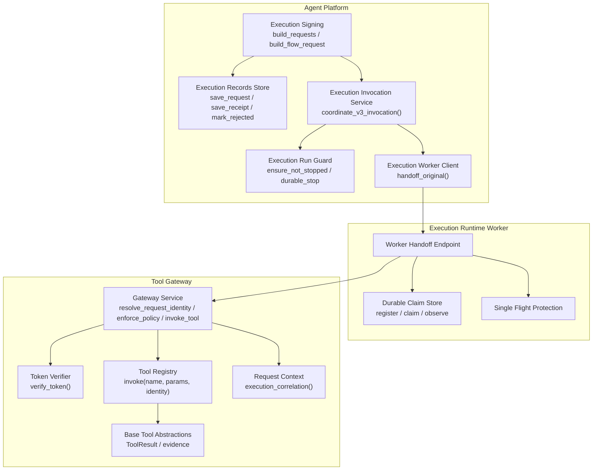
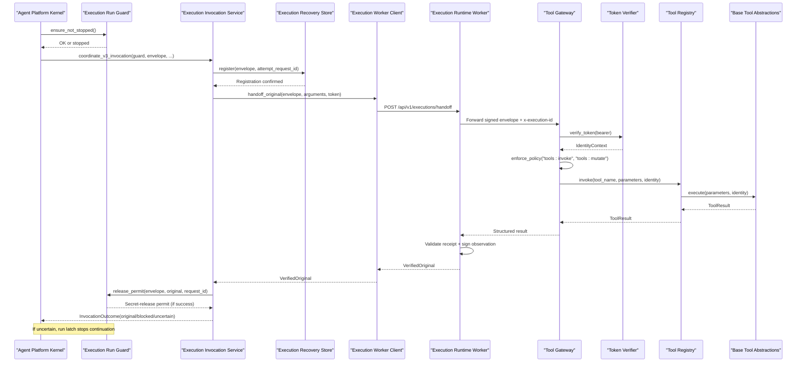
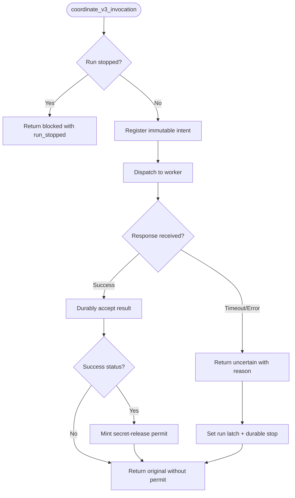
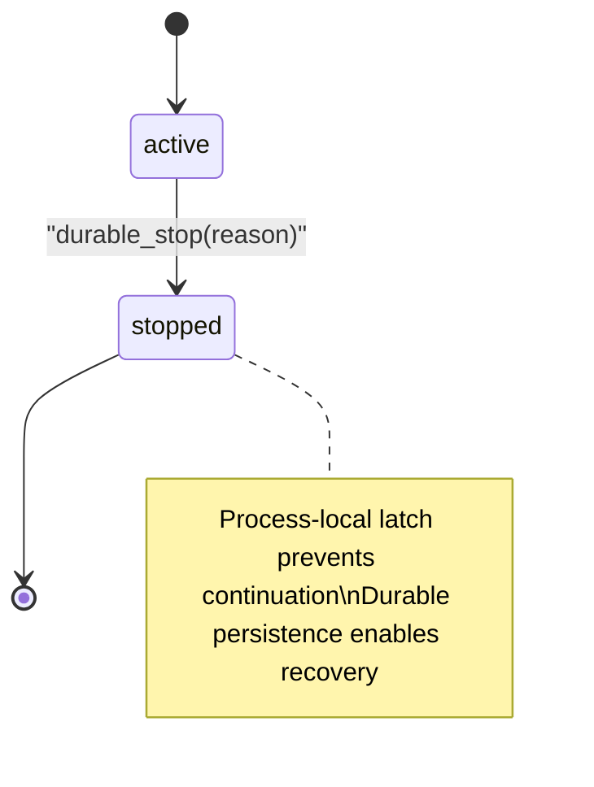
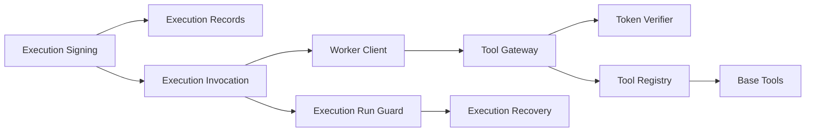

# Tool Execution Coordination

<cite>
**Referenced Files in This Document**
- [execution_invocation.py](file://products/agent-platform/src/agent_service/services/execution_invocation.py)
- [execution_worker_client.py](file://products/agent-platform/src/agent_service/services/execution_worker_client.py)
- [execution_signing.py](file://products/agent-platform/src/agent_service/services/execution_signing.py)
- [execution_records.py](file://products/agent-platform/src/agent_service/services/execution_records.py)
- [execution_recovery.py](file://products/agent-platform/src/agent_service/services/execution_recovery.py)
- [execution_run_guard.py](file://products/agent-platform/src/agent_service/services/execution_run_guard.py)
- [gateway_tools.py](file://products/agent-platform/src/agent_service/tools/gateway_tools.py)
- [runtime_kernel.py](file://products/agent-platform/src/agent_service/runtime_kernel.py)
- [gateway_service.py](file://products/tool-gateway/src/tool_gateway/services/gateway_service.py)
- [token_verifier.py](file://products/tool-gateway/src/tool_gateway/services/token_verifier.py)
- [registry.py](file://products/tool-gateway/src/tool_gateway/tools/registry.py)
- [base.py](file://products/tool-gateway/src/tool_gateway/tools/base.py)
- [request_context.py](file://products/tool-gateway/src/tool_gateway/core/request_context.py)
</cite>

## Update Summary
**Changes Made**
- Added new execution invocation service coordinating register → dispatch → durably accept flows for crash-safe execution
- Enhanced runtime kernel with execution guard integration and timeout handling
- Updated gateway tool integration with correlation metadata forwarding and execution state awareness
- Added SPEC-063 crash-safe execution coordination patterns and uncertainty handling
- Updated architecture diagrams to reflect new durable admission and observation tracking

## Table of Contents
1. Introduction
2. Project Structure
3. Core Components
4. Architecture Overview
5. Detailed Component Analysis
6. Dependency Analysis
7. Performance Considerations
8. Troubleshooting Guide
9. Conclusion

## Introduction
This document explains how the Agent Platform coordinates tool execution through the Tool Gateway, with a focus on signed execution envelopes, isolated execution handoff, durable execution records, and secure output handling. The platform now implements crash-safe execution coordination (SPEC-063) that ensures at-most-one dispatch semantics through durable claims, bounded validity windows, and honest outcome reporting. It covers request signing, parameter binding via digests, policy enforcement, credential handling, output redaction, streaming considerations, timeouts, error propagation, retry strategies, circuit breaker patterns, and performance monitoring.

## Project Structure
The coordination spans multiple services with enhanced crash-safe execution:
- Agent Platform (agent_service): builds signed execution requests, persists execution records, coordinates durable admission, and hands off mutating calls to an isolated execution worker.
- Execution Runtime Worker: provides durable claim management, single-flight protection, and response validation.
- Tool Gateway (tool_gateway): verifies identity, enforces policies, dispatches tools via a registry, applies redaction, emits audit events, and returns structured results.

**Diagram sources**
- [execution_invocation.py:92-138](file://products/agent-platform/src/agent_service/services/execution_invocation.py#L92-L138)
- [execution_run_guard.py:33-59](file://products/agent-platform/src/agent_service/services/execution_run_guard.py#L33-L59)
- [execution_worker_client.py:55-82](file://products/agent-platform/src/agent_service/services/execution_worker_client.py#L55-L82)
- [gateway_service.py:61-121](file://products/tool-gateway/src/tool_gateway/services/gateway_service.py#L61-L121)
- [request_context.py:23-29](file://products/tool-gateway/src/tool_gateway/core/request_context.py#L23-L29)

**Section sources**
- [execution_invocation.py:1-171](file://products/agent-platform/src/agent_service/services/execution_invocation.py#L1-L171)
- [execution_run_guard.py:26-59](file://products/agent-platform/src/agent_service/services/execution_run_guard.py#L26-L59)
- [execution_worker_client.py:37-82](file://products/agent-platform/src/agent_service/services/execution_worker_client.py#L37-L82)
- [gateway_service.py:1-376](file://products/tool-gateway/src/tool_gateway/services/gateway_service.py#L1-L376)
- [request_context.py:1-44](file://products/tool-gateway/src/tool_gateway/core/request_context.py#L1-L44)

## Core Components
- **Crash-safe execution coordination**: New `coordinate_v3_invocation` service implementing register → dispatch → durably accept flow with bounded validity and honest outcome reporting.
- **Execution run guard**: Process-local stop latch with durable stop persistence, preventing continuation when runs are stopped or uncertain outcomes occur.
- **Durable admission**: Postgres-backed dispatch ledger with atomic claim consumption, preventing duplicate execution of approved calls.
- **Signed execution envelopes**: Canonical JSON, HMAC-SHA256 signatures, args_digest binding for tamper-evident parameter validation at invocation time.
- **Execution record store**: Durable lifecycle tracking per approved call with first-write-wins receipts and retention-bounded storage.
- **Enhanced worker client**: Fail-closed handoff with `VerifiedOriginal` responses, structured rejections, and no credential logging.
- **Gateway orchestration**: Local JWT verification, policy enforcement, tool dispatch, output redaction, audit emission, and correlation metadata forwarding.
- **Correlation metadata**: Execution ID forwarding through headers for audit-only correlation without authorization implications.

**Section sources**
- [execution_invocation.py:51-70](file://products/agent-platform/src/agent_service/services/execution_invocation.py#L51-L70)
- [execution_invocation.py:92-138](file://products/agent-platform/src/agent_service/services/execution_invocation.py#L92-L138)
- [execution_run_guard.py:33-59](file://products/agent-platform/src/agent_service/services/execution_run_guard.py#L33-L59)
- [execution_recovery.py:254-275](file://products/agent-platform/src/agent_service/services/execution_recovery.py#L254-L275)
- [execution_signing.py:40-67](file://products/agent-platform/src/agent_service/services/execution_signing.py#L40-L67)
- [execution_records.py:31-60](file://products/agent-platform/src/agent_service/services/execution_records.py#L31-L60)
- [execution_worker_client.py:55-82](file://products/agent-platform/src/agent_service/services/execution_worker_client.py#L55-L82)
- [gateway_service.py:61-121](file://products/tool-gateway/src/tool_gateway/services/gateway_service.py#L61-L121)
- [request_context.py:23-29](file://products/tool-gateway/src/tool_gateway/core/request_context.py#L23-L29)

## Architecture Overview
End-to-end flow for a mutating tool call requiring approval with crash-safe execution coordination:

**Diagram sources**
- [execution_invocation.py:92-138](file://products/agent-platform/src/agent_service/services/execution_invocation.py#L92-L138)
- [execution_recovery.py:254-275](file://products/agent-platform/src/agent_service/services/execution_recovery.py#L254-L275)
- [execution_worker_client.py:55-82](file://products/agent-platform/src/agent_service/services/execution_worker_client.py#L55-L82)
- [gateway_service.py:61-121](file://products/tool-gateway/src/tool_gateway/services/gateway_service.py#L61-L121)
- [request_context.py:23-29](file://products/tool-gateway/src/tool_gateway/core/request_context.py#L23-L29)

## Detailed Component Analysis

### Crash-Safe Execution Coordination
The new execution invocation service implements the register → dispatch → durably accept flow for crash-safe execution:

- **Pre-dispatch registration**: Immutable intent registered before any byte reaches the worker, ensuring crashes between register and send leave bounded uncertainty rather than silent no-ops.
- **Bounded validity**: Signed requests carry explicit protocol version and expires_at fields with 900-second maximum first-dispatch window.
- **Honest outcome reporting**: Only positively established pre-dispatch refusals report `not_dispatched`; timeouts, transport disconnects, and malformed responses report `outcome_unknown`.
- **Secret-release permits**: Single-use permits minted only from durably accepted successful responses on non-stopped runs.

**Diagram sources**
- [execution_invocation.py:92-138](file://products/agent-platform/src/agent_service/services/execution_invocation.py#L92-L138)
- [execution_invocation.py:141-171](file://products/agent-platform/src/agent_service/services/execution_invocation.py#L141-L171)

**Section sources**
- [execution_invocation.py:1-171](file://products/agent-platform/src/agent_service/services/execution_invocation.py#L1-L171)

### Execution Run Guard Integration
The execution run guard provides process-local stop latching with durable persistence:

- **Process-local latch**: Monotonic run-stop marks keyed by run_id, deliberately unbounded and never evicting to prevent safety violations.
- **Durable stop persistence**: Attempts to persist stop decisions to database while maintaining process-local fallback.
- **Integration points**: Guard consulted before dispatch, during secret release, and for continuation gating.
- **Context variable binding**: `CURRENT_RUN_GUARD` context variable set around streamed mutations, inert for read-only turns.

**Diagram sources**
- [execution_run_guard.py:46-59](file://products/agent-platform/src/agent_service/services/execution_run_guard.py#L46-L59)

**Section sources**
- [execution_run_guard.py:26-59](file://products/agent-platform/src/agent_service/services/execution_run_guard.py#L26-L59)

### Durable Admission and Claim Management
Postgres-backed dispatch ledger ensures at-most-one execution semantics:

- **Atomic claim consumption**: Unique dispatch claims committed atomically before gateway requests can be sent.
- **Identity protection**: Both `execution_id` and `(confirm_id, call_id)` protected against reminting attacks.
- **Immutable request storage**: Digest of complete signed request stored alongside identity fields.
- **Retention policy**: Claims retained at least 30 days after request expiry, independent of session deletion.

**Section sources**
- [execution_recovery.py:254-275](file://products/agent-platform/src/agent_service/services/execution_recovery.py#L254-L275)

### Enhanced Worker Client with Verified Originals
The worker client now returns `VerifiedOriginal` responses instead of raw results:

- **Validation boundary**: Raw worker output validated for schema, signed receipt, execution identity, and outcome digest.
- **Structured uncertainty**: Transport failures map to structured reasons; timeouts raise dedicated exceptions.
- **Credential safety**: Handoff tokens and delegated tokens never logged; transport errors log only exception class names.
- **Bounded timeouts**: Configurable timeout budgets prevent resource exhaustion.

**Section sources**
- [execution_worker_client.py:37-82](file://products/agent-platform/src/agent_service/services/execution_worker_client.py#L37-L82)

### Gateway Tool Integration with Correlation Metadata
Enhanced gateway tool integration forwards correlation metadata without authorization implications:

- **Execution ID correlation**: `x-execution-id` header forwarded as audit-only metadata, never injected into connector identity.
- **Session ID forwarding**: Chat session ID carried in payload body for stateful gateway connectors.
- **Request ID resolution**: Inbound `x-request-id` wins over generated IDs, with bounded validation.
- **Audit emission**: All operations emit audit events with correlation details.

**Section sources**
- [gateway_tools.py:132-171](file://products/agent-platform/src/agent_service/tools/gateway_tools.py#L132-L171)
- [request_context.py:9-29](file://products/tool-gateway/src/tool_gateway/core/request_context.py#L9-L29)

### Security Aspects
Enhanced security posture with crash-safe execution coordination:

- **Signed execution requests**: HMAC-SHA256 over canonical JSON; args_digest binds parameters; receipts bind outcomes via digest only.
- **Durable admission**: Postgres-backed claim management prevents duplicate execution even under process loss or network failures.
- **Credential handling**: Handoff tokens and delegated tokens never logged; transport errors log only exception class names.
- **Output redaction**: Centralized redaction with overflow protection; oversized sensitive content withheld rather than partially exposed.
- **Identity verification**: Local JWT verification via JWKS; no per-request introspection; strict issuer/audience/exp checks.
- **Correlation metadata**: Execution IDs forwarded as audit-only correlation, never used for authorization decisions.

**Section sources**
- [execution_signing.py:40-67](file://products/agent-platform/src/agent_service/services/execution_signing.py#L40-L67)
- [execution_invocation.py:30-48](file://products/agent-platform/src/agent_service/services/execution_invocation.py#L30-L48)
- [execution_worker_client.py:71-82](file://products/agent-platform/src/agent_service/services/execution_worker_client.py#L71-L82)
- [gateway_service.py:307-334](file://products/tool-gateway/src/tool_gateway/services/gateway_service.py#L307-L334)
- [request_context.py:23-29](file://products/tool-gateway/src/tool_gateway/core/request_context.py#L23-L29)

### Examples and Operational Scenarios

#### Invoking Tools Through the Gateway
Enhanced gateway invocation with correlation metadata and policy enforcement:

- **Header-based correlation**: `x-execution-id` header forwarded for audit correlation without authorization implications.
- **Policy enforcement**: Actions including `tools:invoke` and `tools:mutate` evaluated for non-read tools.
- **Structured responses**: Policy denials yield 403 responses with structured details and audit emission.

**Section sources**
- [gateway_service.py:158-376](file://products/tool-gateway/src/tool_gateway/services/gateway_service.py#L158-L376)
- [request_context.py:23-29](file://products/tool-gateway/src/tool_gateway/core/request_context.py#L23-L29)

#### Handling Streaming Responses with Crash Safety
Streaming operations now integrate with execution guards for crash-safe behavior:

- **Guard integration**: Streamed mutations bound by execution run guard, preventing continuation when runs are stopped.
- **Secret release gating**: Permits minted only from durably accepted successful responses on non-stopped runs.
- **Uncertainty handling**: Timeout or transport failures set run latch to prevent automatic continuation.

**Section sources**
- [execution_invocation.py:112-138](file://products/agent-platform/src/agent_service/services/execution_invocation.py#L112-L138)
- [execution_run_guard.py:33-59](file://products/agent-platform/src/agent_service/services/execution_run_guard.py#L33-L59)

#### Managing Execution Timeouts with Honest Reporting
Enhanced timeout handling distinguishes between certain and uncertain outcomes:

- **Bounded timeouts**: Worker client uses configurable timeout budgets; timeouts raise dedicated exceptions.
- **Uncertainty classification**: Timeouts classified as `outcome_unknown` rather than definitive failure.
- **Run stopping**: Uncertain outcomes trigger run latch to prevent automatic continuation.

**Section sources**
- [execution_worker_client.py:45-52](file://products/agent-platform/src/agent_service/services/execution_worker_client.py#L45-L52)
- [execution_invocation.py:51-70](file://products/agent-platform/src/agent_service/services/execution_invocation.py#L51-L70)

#### Debugging Failed Executions with Durable Evidence
Enhanced debugging capabilities with durable execution evidence:

- **Durable observations**: Immutable, attributed observations persisted rather than lost on process restart.
- **Claim tracking**: Dispatch claims tracked independently of session records for recovery analysis.
- **Audit correlation**: Request IDs and execution IDs correlated across agent, worker, and gateway layers.

**Section sources**
- [execution_recovery.py:254-275](file://products/agent-platform/src/agent_service/services/execution_recovery.py#L254-L275)
- [execution_invocation.py:141-171](file://products/agent-platform/src/agent_service/services/execution_invocation.py#L141-L171)

### Error Propagation, Retry Logic, and Circuit Breakers
Enhanced error handling with crash-safe semantics:

- **Error propagation**:
  - Worker client maps transport failures to structured reasons and raises typed exceptions.
  - Gateway returns structured ToolResult envelopes with codes and messages; policy denials yield 403 responses.
  - Uncertain outcomes classified separately from pre-dispatch refusals.
- **Retry logic**:
  - Implement retries at caller side with exponential backoff for transient network issues.
  - Do not retry idempotent read-only tools aggressively to avoid overload.
  - Never retry mutations unless operation is idempotent and outcome confirmed.
- **Circuit breaker patterns**:
  - Wrap downstream calls with circuit breaker to fail fast when worker or tool unhealthy.
  - Open circuit on repeated failures and half-open after cooldown to probe recovery.
  - Combine with timeouts and bulkhead isolation to contain blast radius.

### Monitoring Execution Performance
Enhanced monitoring with crash-safe execution metrics:

- **Evidence envelope metrics**: Duration_ms and risk_level track latency and risk distribution across tools.
- **Gateway metrics**: Policy decisions, token verification outcomes, and redacted spans monitored.
- **Execution correlation**: Execution records correlated with audit events using request_id and execution_id.
- **Claim metrics**: Duplicate claim counts and uncertainty indicators provide operational visibility.

**Section sources**
- [base.py:58-69](file://products/tool-gateway/src/tool_gateway/tools/base.py#L58-L69)
- [gateway_service.py:336-370](file://products/tool-gateway/src/tool_gateway/services/gateway_service.py#L336-L370)

## Dependency Analysis
Key dependencies and coupling with enhanced crash-safe execution:

- **Agent Platform** depends on signing utilities, record stores, execution invocation service, run guard, and worker client.
- **Execution Runtime Worker** provides durable claim management and single-flight protection.
- **Tool Gateway** depends on token verification, policy engine, registry, base abstractions, and correlation context.
- **Execution Invocation Service** orchestrates the register → dispatch → accept flow with guard integration.

**Diagram sources**
- [execution_invocation.py:92-138](file://products/agent-platform/src/agent_service/services/execution_invocation.py#L92-L138)
- [execution_run_guard.py:33-59](file://products/agent-platform/src/agent_service/services/execution_run_guard.py#L33-L59)
- [execution_recovery.py:254-275](file://products/agent-platform/src/agent_service/services/execution_recovery.py#L254-L275)

**Section sources**
- [execution_invocation.py:1-171](file://products/agent-platform/src/agent_service/services/execution_invocation.py#L1-L171)
- [execution_run_guard.py:26-59](file://products/agent-platform/src/agent_service/services/execution_run_guard.py#L26-L59)
- [execution_recovery.py:254-275](file://products/agent-platform/src/agent_service/services/execution_recovery.py#L254-L275)

## Performance Considerations
Enhanced performance considerations with crash-safe execution:

- **Async I/O**: Prefer async I/O for tool invocations and streaming where possible to reduce latency.
- **Redaction thresholds**: Keep redaction thresholds tuned to avoid frequent overflows; monitor redacted spans metrics.
- **Connection pooling**: Use connection pooling and timeouts in HTTP clients to prevent resource exhaustion.
- **Circuit breakers**: Apply circuit breakers and bulkheads around external systems to maintain responsiveness under load.
- **Retention sweeps**: Retention sweeps on execution records should run opportunistically to limit database growth.
- **Claim storage**: Durable claim storage requires Postgres availability; monitor database health and performance.

## Troubleshooting Guide
Enhanced troubleshooting with crash-safe execution diagnostics:

- **Worker unavailable**: Check configuration for worker URL and handoff token; inspect transport error logs.
- **Timeouts**: Verify worker health and adjust timeout budgets; review whether operation completed asynchronously.
- **Policy denials**: Examine policy decisions and matched rules; confirm roles and action scopes.
- **Redaction overflow**: Tighten tool parameters or adjust redaction thresholds; investigate sensitive data in outputs.
- **Record mismatches**: Ensure args_digest matches executed parameters; check first-write-wins receipt behavior.
- **Durable admission failures**: Check Postgres connectivity and schema; verify epoch and lifetime validation.
- **Uncertain outcomes**: Review observation history and claim status; distinguish between pre-dispatch refusal and post-send uncertainty.

**Section sources**
- [execution_worker_client.py:71-82](file://products/agent-platform/src/agent_service/services/execution_worker_client.py#L71-L82)
- [execution_invocation.py:51-70](file://products/agent-platform/src/agent_service/services/execution_invocation.py#L51-L70)
- [execution_recovery.py:254-275](file://products/agent-platform/src/agent_service/services/execution_recovery.py#L254-L275)

## Conclusion
The platform now coordinates tool execution through a secure, auditable pipeline with crash-safe execution guarantees: signed envelopes bind approvals and parameters, durable claims prevent duplicate execution, isolated workers handle potentially risky operations, and the Tool Gateway enforces identity and policy while protecting outputs. The new execution invocation service implements register → dispatch → durably accept flows with honest outcome reporting, while execution run guards prevent continuation under uncertainty. Robust error handling, timeouts, observability, and correlation metadata enable reliable operations and effective debugging across all failure scenarios.