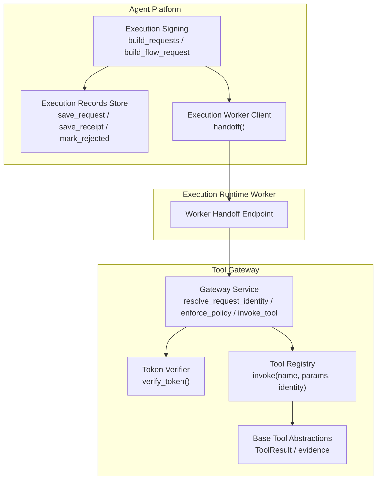
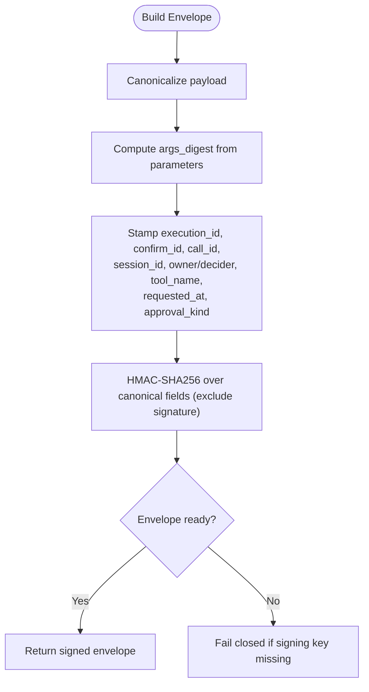
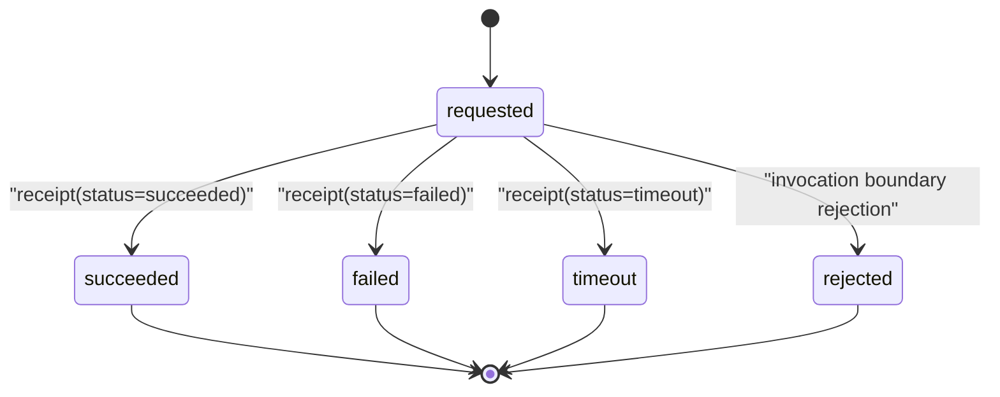
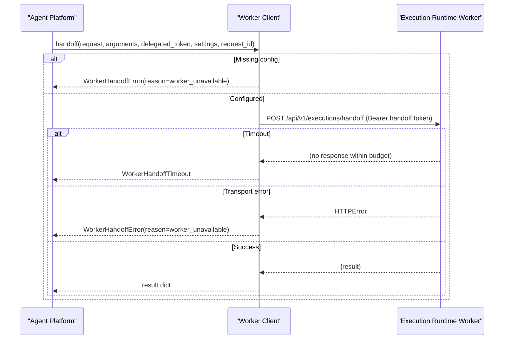
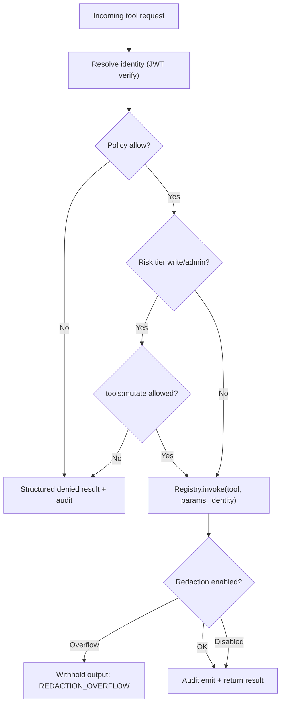
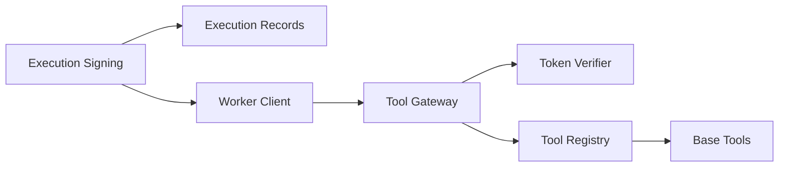

# Tool Execution Coordination

<cite>
**Referenced Files in This Document**
- [execution_worker_client.py](file://products/agent-platform/src/agent_service/services/execution_worker_client.py)
- [execution_signing.py](file://products/agent-platform/src/agent_service/services/execution_signing.py)
- [execution_records.py](file://products/agent-platform/src/agent_service/services/execution_records.py)
- [gateway_service.py](file://products/tool-gateway/src/tool_gateway/services/gateway_service.py)
- [token_verifier.py](file://products/tool-gateway/src/tool_gateway/services/token_verifier.py)
- [registry.py](file://products/tool-gateway/src/tool_gateway/tools/registry.py)
- [base.py](file://products/tool-gateway/src/tool_gateway/tools/base.py)
</cite>

## Table of Contents
1. Introduction
2. Project Structure
3. Core Components
4. Architecture Overview
5. Detailed Component Analysis
6. Dependency Analysis
7. Performance Considerations
8. Troubleshooting Guide
9. Conclusion

## Introduction
This document explains how the Agent Platform coordinates tool execution through the Tool Gateway, with a focus on signed execution envelopes, isolated execution handoff, durable execution records, and secure output handling. It covers request signing, parameter binding via digests, policy enforcement, credential handling, output redaction, streaming considerations, timeouts, error propagation, retry strategies, circuit breaker patterns, and performance monitoring.

## Project Structure
The coordination spans two services:
- Agent Platform (agent_service): builds signed execution requests, persists execution records, and hands off mutating calls to an isolated execution worker.
- Tool Gateway (tool_gateway): verifies identity, enforces policies, dispatches tools via a registry, applies redaction, emits audit events, and returns structured results.



**Diagram sources**
- [execution_signing.py:70-149](file://products/agent-platform/src/agent_service/services/execution_signing.py#L70-L149)
- [execution_records.py:41-60](file://products/agent-platform/src/agent_service/services/execution_records.py#L41-L60)
- [execution_worker_client.py:54-144](file://products/agent-platform/src/agent_service/services/execution_worker_client.py#L54-L144)
- [gateway_service.py:61-121](file://products/tool-gateway/src/tool_gateway/services/gateway_service.py#L61-L121)
- [gateway_service.py:158-376](file://products/tool-gateway/src/tool_gateway/services/gateway_service.py#L158-L376)
- [token_verifier.py:52-89](file://products/tool-gateway/src/tool_gateway/services/token_verifier.py#L52-L89)
- [registry.py:65-88](file://products/tool-gateway/src/tool_gateway/tools/registry.py#L65-L88)
- [base.py:35-69](file://products/tool-gateway/src/tool_gateway/tools/base.py#L35-L69)

**Section sources**
- [execution_signing.py:1-175](file://products/agent-platform/src/agent_service/services/execution_signing.py#L1-L175)
- [execution_records.py:1-494](file://products/agent-platform/src/agent_service/services/execution_records.py#L1-L494)
- [execution_worker_client.py:1-145](file://products/agent-platform/src/agent_service/services/execution_worker_client.py#L1-L145)
- [gateway_service.py:1-376](file://products/tool-gateway/src/tool_gateway/services/gateway_service.py#L1-L376)
- [token_verifier.py:1-99](file://products/tool-gateway/src/tool_gateway/services/token_verifier.py#L1-L99)
- [registry.py:1-89](file://products/tool-gateway/src/tool_gateway/tools/registry.py#L1-L89)
- [base.py:1-123](file://products/tool-gateway/src/tool_gateway/tools/base.py#L1-L123)

## Core Components
- Signed execution envelopes: canonical JSON, HMAC-SHA256 signatures, args_digest binding for tamper-evident parameter validation at invocation time.
- Execution record store: durable lifecycle tracking per approved call (requested → succeeded/failed/timeout/rejected), retention-bounded, first-write-wins receipts.
- Execution worker client: fail-closed handoff to an isolated runtime worker with bounded timeout, structured rejections, and no credential logging.
- Tool Gateway orchestration: local JWT verification, policy enforcement (including risk-tier gating), tool dispatch, output redaction, audit emission, and structured responses.
- Token verifier: local JWKS-based verification without per-request introspection.
- Tool registry and base abstractions: safe dispatch, structured errors, and consistent evidence envelopes.

**Section sources**
- [execution_signing.py:40-67](file://products/agent-platform/src/agent_service/services/execution_signing.py#L40-L67)
- [execution_signing.py:70-149](file://products/agent-platform/src/agent_service/services/execution_signing.py#L70-L149)
- [execution_records.py:31-60](file://products/agent-platform/src/agent_service/services/execution_records.py#L31-L60)
- [execution_records.py:105-178](file://products/agent-platform/src/agent_service/services/execution_records.py#L105-L178)
- [execution_records.py:311-445](file://products/agent-platform/src/agent_service/services/execution_records.py#L311-L445)
- [execution_worker_client.py:36-51](file://products/agent-platform/src/agent_service/services/execution_worker_client.py#L36-L51)
- [execution_worker_client.py:54-144](file://products/agent-platform/src/agent_service/services/execution_worker_client.py#L54-L144)
- [gateway_service.py:61-121](file://products/tool-gateway/src/tool_gateway/services/gateway_service.py#L61-L121)
- [gateway_service.py:158-376](file://products/tool-gateway/src/tool_gateway/services/gateway_service.py#L158-L376)
- [token_verifier.py:52-89](file://products/tool-gateway/src/tool_gateway/services/token_verifier.py#L52-L89)
- [registry.py:65-88](file://products/tool-gateway/src/tool_gateway/tools/registry.py#L65-L88)
- [base.py:35-105](file://products/tool-gateway/src/tool_gateway/tools/base.py#L35-L105)

## Architecture Overview
End-to-end flow for a mutating tool call that requires approval:

```mermaid
sequenceDiagram
participant Kernel as "Agent Platform Kernel"
participant Signer as "Execution Signing"
participant Store as "Execution Record Store"
participant Worker as "Execution Worker Client"
participant Exec as "Execution Runtime Worker"
participant GW as "Tool Gateway"
participant Tok as "Token Verifier"
participant Reg as "Tool Registry"
participant Base as "Base Tool Abstractions"
Kernel->>Signer : build_requests(pending, decider_user_id, key)
Signer-->>Kernel : list of signed envelopes
Kernel->>Store : save_request(record)
Kernel->>Worker : handoff(request, arguments, delegated_token, settings, request_id)
Worker->>Exec : POST /api/v1/executions/handoff (Bearer handoff token)
Exec->>GW : Forward signed envelope + parameters
GW->>Tok : verify_token(bearer)
Tok-->>GW : IdentityContext
GW->>GW : enforce_policy("tools : invoke", "tools : mutate")
GW->>Reg : invoke(tool_name, parameters, identity)
Reg->>Base : execute(parameters, identity)
Base-->>Reg : ToolResult
Reg-->>GW : ToolResult
GW-->>Exec : Structured result
Exec-->>Worker : Result
Worker-->>Kernel : Result or structured error
Note over Kernel,Store : Receipt saved later by worker; record closed with status
```

**Diagram sources**
- [execution_signing.py:70-149](file://products/agent-platform/src/agent_service/services/execution_signing.py#L70-L149)
- [execution_records.py:41-60](file://products/agent-platform/src/agent_service/services/execution_records.py#L41-L60)
- [execution_worker_client.py:54-144](file://products/agent-platform/src/agent_service/services/execution_worker_client.py#L54-L144)
- [gateway_service.py:61-121](file://products/tool-gateway/src/tool_gateway/services/gateway_service.py#L61-L121)
- [gateway_service.py:158-376](file://products/tool-gateway/src/tool_gateway/services/gateway_service.py#L158-L376)
- [token_verifier.py:52-89](file://products/tool-gateway/src/tool_gateway/services/token_verifier.py#L52-L89)
- [registry.py:65-88](file://products/tool-gateway/src/tool_gateway/tools/registry.py#L65-L88)
- [base.py:35-105](file://products/tool-gateway/src/tool_gateway/tools/base.py#L35-L105)

## Detailed Component Analysis

### Signed Execution Envelopes
- Canonicalization and hashing ensure deterministic serialization and compact digests.
- Envelope fields include execution identifiers, session context, approver/owner metadata, tool name, args_digest, timestamps, and signature.
- Two builders:
  - Per-action approvals: one envelope per parked call.
  - Flow authority: single-call sibling for auto-unlocked browser writes under a flow decision.
- Receipts bind outcome via digest only; full outcomes are not stored in receipts.



**Diagram sources**
- [execution_signing.py:40-67](file://products/agent-platform/src/agent_service/services/execution_signing.py#L40-L67)
- [execution_signing.py:70-149](file://products/agent-platform/src/agent_service/services/execution_signing.py#L70-L149)
- [execution_signing.py:152-174](file://products/agent-platform/src/agent_service/services/execution_signing.py#L152-L174)

**Section sources**
- [execution_signing.py:1-175](file://products/agent-platform/src/agent_service/services/execution_signing.py#L1-L175)

### Execution Record Keeping and Audit Trail
- Lifecycle states: requested, succeeded, failed, timeout, rejected.
- First-write-wins receipt semantics prevent replayed closes from overwriting earlier outcomes.
- Postgres backend includes table creation, retention sweep, and session cleanup.
- In-memory backend supports dev/CI and fallback when Postgres is unavailable.



**Diagram sources**
- [execution_records.py:31-60](file://products/agent-platform/src/agent_service/services/execution_records.py#L31-L60)
- [execution_records.py:125-156](file://products/agent-platform/src/agent_service/services/execution_records.py#L125-L156)
- [execution_records.py:378-420](file://products/agent-platform/src/agent_service/services/execution_records.py#L378-L420)

**Section sources**
- [execution_records.py:1-494](file://products/agent-platform/src/agent_service/services/execution_records.py#L1-L494)

### Isolated Execution Worker Client
- Sends a signed envelope, parked arguments, and delegated token to the execution-runtime worker over HTTP with a bounded timeout.
- Fail-closed posture: missing configuration raises before any network call; transport failures map to a structured reason; timeouts raise a dedicated exception so resumed streams can surface structured timeout results.
- Never logs handoff tokens or delegated tokens.



**Diagram sources**
- [execution_worker_client.py:54-144](file://products/agent-platform/src/agent_service/services/execution_worker_client.py#L54-L144)

**Section sources**
- [execution_worker_client.py:1-145](file://products/agent-platform/src/agent_service/services/execution_worker_client.py#L1-L145)

### Tool Gateway Orchestration
- Identity resolution: local JWT verification using JWKS; synthetic dev identity when auth is optional.
- Policy enforcement: evaluate actions including tools:invoke and tools:mutate for non-read tools; deny with structured details and audit emission.
- Dispatch: registry lookup and invocation; unknown tools and exceptions produce structured error results.
- Output handling: redaction applied at a single choke point; overflow leads to withholding output with a structured error.
- Audit trail: log_event plus durable audit event emission mirroring the operation.



**Diagram sources**
- [gateway_service.py:61-121](file://products/tool-gateway/src/tool_gateway/services/gateway_service.py#L61-L121)
- [gateway_service.py:158-376](file://products/tool-gateway/src/tool_gateway/services/gateway_service.py#L158-L376)
- [token_verifier.py:52-89](file://products/tool-gateway/src/tool_gateway/services/token_verifier.py#L52-L89)
- [registry.py:65-88](file://products/tool-gateway/src/tool_gateway/tools/registry.py#L65-L88)
- [base.py:35-105](file://products/tool-gateway/src/tool_gateway/tools/base.py#L35-L105)

**Section sources**
- [gateway_service.py:1-376](file://products/tool-gateway/src/tool_gateway/services/gateway_service.py#L1-L376)
- [token_verifier.py:1-99](file://products/tool-gateway/src/tool_gateway/services/token_verifier.py#L1-L99)
- [registry.py:1-89](file://products/tool-gateway/src/tool_gateway/tools/registry.py#L1-L89)
- [base.py:1-123](file://products/tool-gateway/src/tool_gateway/tools/base.py#L1-L123)

### Security Aspects
- Signed execution requests: HMAC-SHA256 over canonical JSON; args_digest binds parameters; receipts bind outcomes via digest only.
- Credential handling: handoff token and delegated token are never logged; transport errors log only exception class names to avoid leaking payloads.
- Output redaction: centralized redaction with overflow protection; oversized sensitive content is withheld rather than partially exposed.
- Identity verification: local JWT verification via JWKS; no per-request introspection; strict issuer/audience/exp checks.

**Section sources**
- [execution_signing.py:40-67](file://products/agent-platform/src/agent_service/services/execution_signing.py#L40-L67)
- [execution_signing.py:70-149](file://products/agent-platform/src/agent_service/services/execution_signing.py#L70-L149)
- [execution_signing.py:152-174](file://products/agent-platform/src/agent_service/services/execution_signing.py#L152-L174)
- [execution_worker_client.py:92-113](file://products/agent-platform/src/agent_service/services/execution_worker_client.py#L92-L113)
- [gateway_service.py:307-334](file://products/tool-gateway/src/tool_gateway/services/gateway_service.py#L307-L334)
- [token_verifier.py:52-89](file://products/tool-gateway/src/tool_gateway/services/token_verifier.py#L52-L89)

### Examples and Operational Scenarios

#### Invoking Tools Through the Gateway
- The gateway expects a body containing tool_name and parameters. It resolves identity, enforces policy, dispatches to the registry, applies redaction, and emits audit events.

**Section sources**
- [gateway_service.py:158-376](file://products/tool-gateway/src/tool_gateway/services/gateway_service.py#L158-L376)

#### Handling Streaming Responses
- For long-running operations, prefer asynchronous execution and streaming where supported by the underlying connector. The gateway’s orchestration path returns structured results; streaming should be implemented at the tool level and surfaced consistently via the ToolResult evidence envelope.

[No sources needed since this section provides general guidance based on existing abstractions]

#### Managing Execution Timeouts
- The worker client uses a bounded timeout configured in settings; timeouts raise a dedicated exception so the caller can surface a structured timeout result and close the execution record accordingly.

**Section sources**
- [execution_worker_client.py:91-103](file://products/agent-platform/src/agent_service/services/execution_worker_client.py#L91-L103)

#### Debugging Failed Executions
- Inspect execution records for status transitions and reject reasons.
- Review gateway audit events for policy decisions and tool invocation outcomes.
- Check worker handoff logs for transport errors and rejections; note that credentials are never logged.

**Section sources**
- [execution_records.py:105-178](file://products/agent-platform/src/agent_service/services/execution_records.py#L105-L178)
- [execution_records.py:378-420](file://products/agent-platform/src/agent_service/services/execution_records.py#L378-L420)
- [gateway_service.py:336-370](file://products/tool-gateway/src/tool_gateway/services/gateway_service.py#L336-L370)
- [execution_worker_client.py:104-144](file://products/agent-platform/src/agent_service/services/execution_worker_client.py#L104-L144)

### Error Propagation, Retry Logic, and Circuit Breakers
- Error propagation:
  - Worker client maps transport failures to a structured reason and raises typed exceptions.
  - Gateway returns structured ToolResult envelopes with codes and messages; policy denials yield 403 responses.
- Retry logic:
  - Implement retries at the caller side with exponential backoff for transient network issues; do not retry idempotent read-only tools aggressively to avoid overload.
  - Do not retry mutations unless the operation is idempotent and you have confirmation of outcome.
- Circuit breaker patterns:
  - Wrap downstream calls with a circuit breaker to fail fast when the worker or tool is unhealthy; open the circuit on repeated failures and half-open after a cooldown to probe recovery.
  - Combine with timeouts and bulkhead isolation to contain blast radius.

[No sources needed since this section provides general guidance]

### Monitoring Execution Performance
- Use the evidence envelope’s duration_ms and risk_level to track latency and risk distribution across tools.
- Observe gateway metrics for policy decisions, token verification outcomes, and redacted spans.
- Correlate execution records with audit events using request_id and execution_id.

**Section sources**
- [base.py:58-69](file://products/tool-gateway/src/tool_gateway/tools/base.py#L58-L69)
- [gateway_service.py:336-370](file://products/tool-gateway/src/tool_gateway/services/gateway_service.py#L336-L370)

## Dependency Analysis
Key dependencies and coupling:
- Agent Platform depends on signing utilities, record stores, and the worker client.
- Tool Gateway depends on token verification, policy engine, registry, and base abstractions.
- The worker client depends on HTTP transport and settings; it must remain stateless and fail-closed.



**Diagram sources**
- [execution_signing.py:70-149](file://products/agent-platform/src/agent_service/services/execution_signing.py#L70-L149)
- [execution_records.py:41-60](file://products/agent-platform/src/agent_service/services/execution_records.py#L41-L60)
- [execution_worker_client.py:54-144](file://products/agent-platform/src/agent_service/services/execution_worker_client.py#L54-L144)
- [gateway_service.py:61-121](file://products/tool-gateway/src/tool_gateway/services/gateway_service.py#L61-L121)
- [gateway_service.py:158-376](file://products/tool-gateway/src/tool_gateway/services/gateway_service.py#L158-L376)
- [token_verifier.py:52-89](file://products/tool-gateway/src/tool_gateway/services/token_verifier.py#L52-L89)
- [registry.py:65-88](file://products/tool-gateway/src/tool_gateway/tools/registry.py#L65-L88)
- [base.py:35-105](file://products/tool-gateway/src/tool_gateway/tools/base.py#L35-L105)

**Section sources**
- [execution_signing.py:1-175](file://products/agent-platform/src/agent_service/services/execution_signing.py#L1-L175)
- [execution_records.py:1-494](file://products/agent-platform/src/agent_service/services/execution_records.py#L1-L494)
- [execution_worker_client.py:1-145](file://products/agent-platform/src/agent_service/services/execution_worker_client.py#L1-L145)
- [gateway_service.py:1-376](file://products/tool-gateway/src/tool_gateway/services/gateway_service.py#L1-L376)
- [token_verifier.py:1-99](file://products/tool-gateway/src/tool_gateway/services/token_verifier.py#L1-L99)
- [registry.py:1-89](file://products/tool-gateway/src/tool_gateway/tools/registry.py#L1-L89)
- [base.py:1-123](file://products/tool-gateway/src/tool_gateway/tools/base.py#L1-L123)

## Performance Considerations
- Prefer async I/O for tool invocations and streaming where possible to reduce latency.
- Keep redaction thresholds tuned to avoid frequent overflows; monitor redacted spans metrics.
- Use connection pooling and timeouts in HTTP clients to prevent resource exhaustion.
- Apply circuit breakers and bulkheads around external systems to maintain responsiveness under load.
- Retention sweeps on execution records should run opportunistically to limit database growth.

[No sources needed since this section provides general guidance]

## Troubleshooting Guide
Common issues and diagnostics:
- Worker unavailable: check configuration for worker URL and handoff token; inspect transport error logs.
- Timeouts: verify worker health and adjust timeout budgets; review whether the operation completed asynchronously.
- Policy denials: examine policy decisions and matched rules; confirm roles and action scopes.
- Redaction overflow: tighten tool parameters or adjust redaction thresholds; investigate sensitive data in outputs.
- Record mismatches: ensure args_digest matches executed parameters; check first-write-wins receipt behavior.

**Section sources**
- [execution_worker_client.py:70-81](file://products/agent-platform/src/agent_service/services/execution_worker_client.py#L70-L81)
- [execution_worker_client.py:92-144](file://products/agent-platform/src/agent_service/services/execution_worker_client.py#L92-L144)
- [gateway_service.py:198-248](file://products/tool-gateway/src/tool_gateway/services/gateway_service.py#L198-L248)
- [gateway_service.py:307-334](file://products/tool-gateway/src/tool_gateway/services/gateway_service.py#L307-L334)
- [execution_records.py:125-156](file://products/agent-platform/src/agent_service/services/execution_records.py#L125-L156)

## Conclusion
The platform coordinates tool execution through a secure, auditable pipeline: signed envelopes bind approvals and parameters, isolated workers handle potentially risky operations, durable records provide an immutable trail, and the Tool Gateway enforces identity and policy while protecting outputs. Robust error handling, timeouts, and observability enable reliable operations and effective debugging.