# Audit Service

<cite>
**Referenced Files in This Document**
- [app.py](file://products/audit-service/src/audit_service/app.py)
- [main.py](file://products/audit-service/src/audit_service/main.py)
- [router.py](file://products/audit-service/src/audit_service/api/router.py)
- [ingest.py](file://products/audit-service/src/audit_service/api/routes/ingest.py)
- [query.py](file://products/audit-service/src/audit_service/api/routes/query.py)
- [export.py](file://products/audit-service/src/audit_service/api/routes/export.py)
- [summary.py](file://products/audit-service/src/audit_service/api/routes/summary.py)
- [audit_store.py](file://products/audit-service/src/audit_service/services/audit_store.py)
- [retention.py](file://products/audit-service/src/audit_service/services/retention.py)
- [config.py](file://products/audit-service/src/audit_service/core/config.py)
- [metrics.py](file://products/audit-service/src/audit_service/core/metrics.py)
- [observability.py](file://products/audit-service/src/audit_service/core/observability.py)
- [telemetry.py](file://products/audit-service/src/audit_service/core/telemetry.py)
- [request_context.py](file://products/audit-service/src/audit_service/core/request_context.py)
- [audit-event.schema.json](file://shared/shared-contracts/schemas/audit-event.schema.json)
- [audit-summary.schema.json](file://shared/shared-contracts/schemas/audit-summary.schema.json)
</cite>

## Table of Contents
1. [Introduction](#introduction)
2. [Project Structure](#project-structure)
3. [Core Components](#core-components)
4. [Architecture Overview](#architecture-overview)
5. [Detailed Component Analysis](#detailed-component-analysis)
6. [Dependency Analysis](#dependency-analysis)
7. [Performance Considerations](#performance-considerations)
8. [Troubleshooting Guide](#troubleshooting-guide)
9. [Conclusion](#conclusion)
10. [Appendices](#appendices)

## Introduction
The Audit Service provides durable, queryable, and retention-managed audit event logging for the platform. It accepts batches of audit events from other services, persists them with idempotency guarantees, enforces retention policies, and exposes read APIs for querying, summarizing, and exporting audit data. The service is designed for compliance and operational visibility, with strict envelope schemas, deterministic aggregation, and bounded exports suitable for reporting.

Key capabilities:
- Ingestion pipeline with authentication, validation, and idempotent storage
- Dual backends: in-memory (dev/test) and PostgreSQL (production)
- Retention enforcement via time-based eviction and hard caps
- Query API with keyset pagination and envelope-only filters
- Summary aggregates over envelope columns only
- Bounded CSV export with truncation headers for compliance workflows
- Observability, metrics, and telemetry integration

## Project Structure
The Audit Service is a FastAPI application organized into:
- API routes for ingestion, query, summary, export, and health
- Services for store abstraction, retention scheduling, and ingest authentication
- Core modules for configuration, observability, metrics, request context, and telemetry
- Schemas defining the audit event envelope and summary response contracts

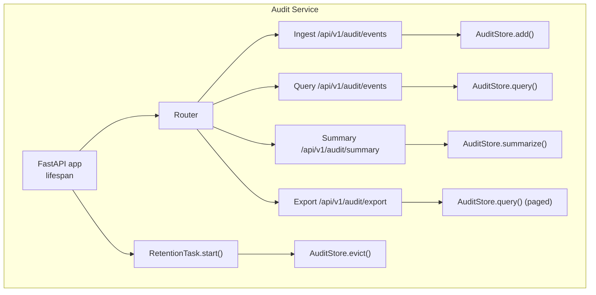

**Diagram sources**
- [app.py:20-70](file://products/audit-service/src/audit_service/app.py#L20-L70)
- [ingest.py:33-83](file://products/audit-service/src/audit_service/api/routes/ingest.py#L33-L83)
- [query.py:35-95](file://products/audit-service/src/audit_service/api/routes/query.py#L35-L95)
- [summary.py:34-79](file://products/audit-service/src/audit_service/api/routes/summary.py#L34-L79)
- [export.py:87-164](file://products/audit-service/src/audit_service/api/routes/export.py#L87-L164)
- [retention.py:27-76](file://products/audit-service/src/audit_service/services/retention.py#L27-L76)
- [audit_store.py:42-64](file://products/audit-service/src/audit_service/services/audit_store.py#L42-L64)

**Section sources**
- [app.py:20-70](file://products/audit-service/src/audit_service/app.py#L20-L70)
- [main.py:6-9](file://products/audit-service/src/audit_service/main.py#L6-L9)

## Core Components
- AuditStore protocol and implementations:
  - InMemoryAuditStore for development/testing
  - PostgresAuditStore for production with WAL durability
- RetentionTask background task enforcing retention days and max events
- API routes:
  - Ingest: batched event ingestion with auth and validation
  - Query: filtered, paginated retrieval of stored envelopes
  - Summary: deterministic aggregates over envelope columns
  - Export: bounded CSV streaming with truncation indicators
- Configuration: environment-driven settings for backend selection, retention, batching, and export limits
- Observability: structured logging, metrics, and telemetry setup

**Section sources**
- [audit_store.py:42-64](file://products/audit-service/src/audit_service/services/audit_store.py#L42-L64)
- [retention.py:27-76](file://products/audit-service/src/audit_service/services/retention.py#L27-L76)
- [ingest.py:33-83](file://products/audit-service/src/audit_service/api/routes/ingest.py#L33-L83)
- [query.py:35-95](file://products/audit-service/src/audit_service/api/routes/query.py#L35-L95)
- [summary.py:34-79](file://products/audit-service/src/audit_service/api/routes/summary.py#L34-L79)
- [export.py:87-164](file://products/audit-service/src/audit_service/api/routes/export.py#L87-L164)
- [config.py:60-111](file://products/audit-service/src/audit_service/core/config.py#L60-L111)

## Architecture Overview
The Audit Service follows a clear separation between HTTP endpoints, storage abstraction, and background tasks. Events are emitted by platform services and ingested via an authenticated endpoint. The store implementation is selected at runtime based on configuration. Queries and summaries operate over envelope columns only, ensuring consistent behavior across backends. Retention runs periodically to enforce time-based and count-based policies without blocking ingestion.

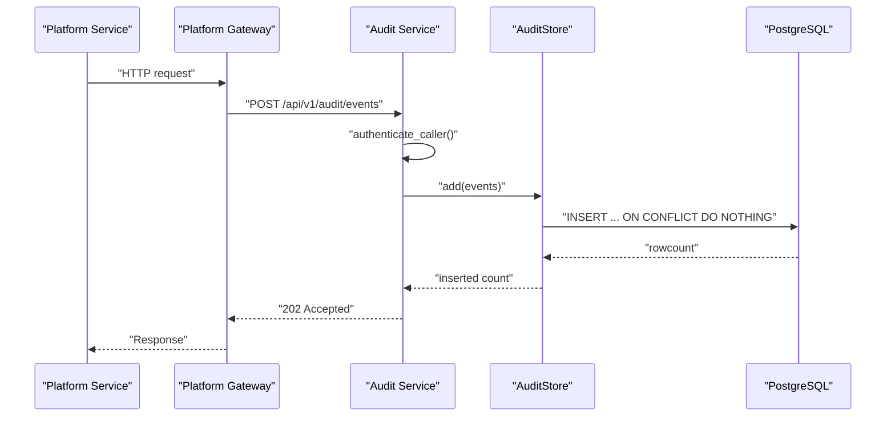

**Diagram sources**
- [ingest.py:33-83](file://products/audit-service/src/audit_service/api/routes/ingest.py#L33-L83)
- [audit_store.py:357-384](file://products/audit-service/src/audit_service/services/audit_store.py#L357-L384)

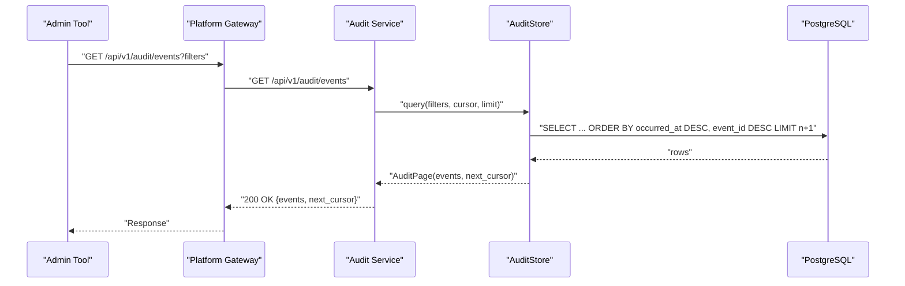

**Diagram sources**
- [query.py:35-95](file://products/audit-service/src/audit_service/api/routes/query.py#L35-L95)
- [audit_store.py:386-415](file://products/audit-service/src/audit_service/services/audit_store.py#L386-L415)

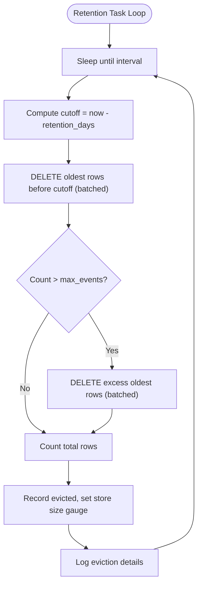

**Diagram sources**
- [retention.py:45-76](file://products/audit-service/src/audit_service/services/retention.py#L45-L76)
- [audit_store.py:498-533](file://products/audit-service/src/audit_service/services/audit_store.py#L498-L533)

## Detailed Component Analysis

### Event Schema and Contracts
- AuditEvent envelope fields include identifiers, timestamps, type, service, correlation ID, optional identity fields, outcome, and per-event details.
- The schema is enforced by Pydantic models and validated against the shared JSON schema.
- Outcome values are constrained to a closed enum; event_type is a closed vocabulary aligned with platform actions.

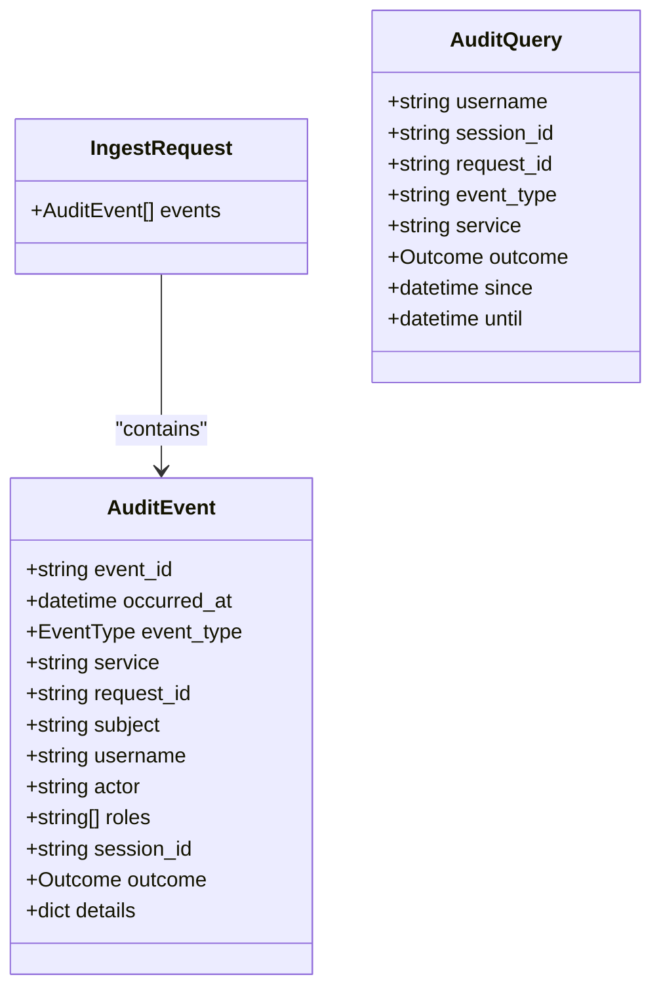

**Diagram sources**
- [audit.py:44-83](file://products/audit-service/src/audit_service/schemas/audit.py#L44-L83)
- [audit-event.schema.json:1-94](file://shared/shared-contracts/schemas/audit-event.schema.json#L1-L94)

**Section sources**
- [audit.py:44-83](file://products/audit-service/src/audit_service/schemas/audit.py#L44-L83)
- [audit-event.schema.json:1-94](file://shared/shared-contracts/schemas/audit-event.schema.json#L1-L94)

### Ingestion Pipeline
- Authentication: callers must present registered service credentials or workload-projected tokens mapped to known clients.
- Validation: JSON body parsed and validated against IngestRequest; malformed payloads rejected wholesale.
- Batch limits: enforced by AUDIT_MAX_BATCH to protect downstream storage.
- Storage: events are added via AuditStore.add(), which is idempotent by event_id.
- Metrics and logs: ingestion counts, rejections, and store growth are recorded; structured log lines capture accepted and inserted counts.

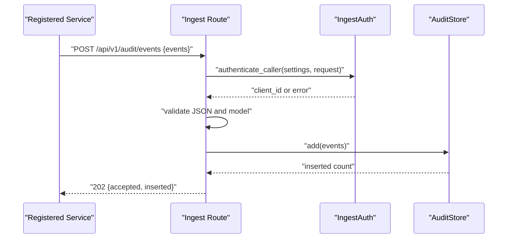

**Diagram sources**
- [ingest.py:33-83](file://products/audit-service/src/audit_service/api/routes/ingest.py#L33-L83)
- [audit_store.py:357-384](file://products/audit-service/src/audit_service/services/audit_store.py#L357-L384)

**Section sources**
- [ingest.py:33-83](file://products/audit-service/src/audit_service/api/routes/ingest.py#L33-L83)
- [config.py:60-111](file://products/audit-service/src/audit_service/core/config.py#L60-L111)

### Storage Backends
- InMemoryAuditStore:
  - Stores events in memory with deduplication by event_id.
  - Supports filtering, pagination, summarization, and eviction for dev/test.
- PostgresAuditStore:
  - Uses a single table with indexes on occurred_at, username, session_id, request_id, and event_type.
  - Idempotent inserts via ON CONFLICT DO NOTHING.
  - Query uses parameterized filters and keyset pagination with (occurred_at, event_id).
  - Summarization performs grouped SQL queries over envelope columns only.
  - Eviction deletes in batches to avoid long-running transactions.

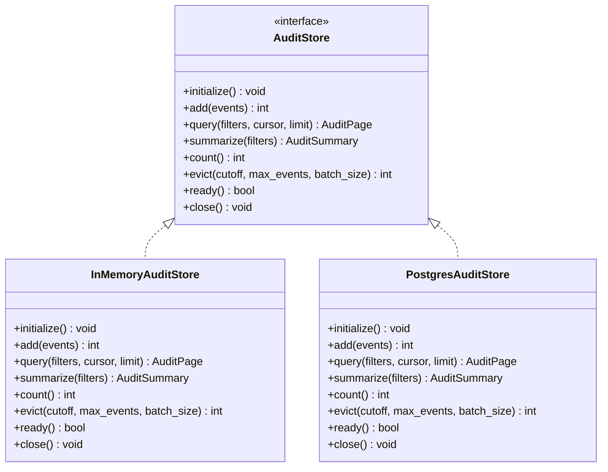

**Diagram sources**
- [audit_store.py:42-64](file://products/audit-service/src/audit_service/services/audit_store.py#L42-L64)
- [audit_store.py:93-157](file://products/audit-service/src/audit_service/services/audit_store.py#L93-L157)
- [audit_store.py:324-546](file://products/audit-service/src/audit_service/services/audit_store.py#L324-L546)

**Section sources**
- [audit_store.py:93-157](file://products/audit-service/src/audit_service/services/audit_store.py#L93-L157)
- [audit_store.py:224-249](file://products/audit-service/src/audit_service/services/audit_store.py#L224-L249)
- [audit_store.py:324-546](file://products/audit-service/src/audit_service/services/audit_store.py#L324-L546)

### Retention Policy Enforcement
- RetentionTask runs a periodic loop that computes a cutoff based on AUDIT_RETENTION_DAYS and calls AuditStore.evict().
- Eviction first removes events older than the cutoff, then enforces the hard cap AUDIT_MAX_EVENTS by dropping the oldest excess rows.
- Deletions are batched to avoid long-running operations and contention.
- After each sweep, the store size is reconciled via count(), and metrics/logs record evicted counts.

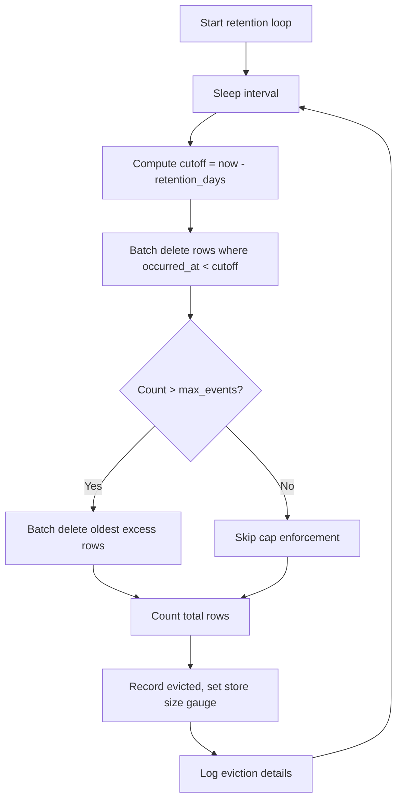

**Diagram sources**
- [retention.py:45-76](file://products/audit-service/src/audit_service/services/retention.py#L45-L76)
- [audit_store.py:498-533](file://products/audit-service/src/audit_service/services/audit_store.py#L498-L533)

**Section sources**
- [retention.py:27-76](file://products/audit-service/src/audit_service/services/retention.py#L27-L76)
- [config.py:60-111](file://products/audit-service/src/audit_service/core/config.py#L60-L111)

### Query API
- Filters: username, session_id, request_id, event_type, service, outcome, since, until.
- Pagination: keyset cursor based on (occurred_at, event_id), newest-first ordering.
- Limits: default and maximum enforced via query parameters.
- Authorization: requires registered service caller; user-level authorization is enforced upstream by the platform gateway.

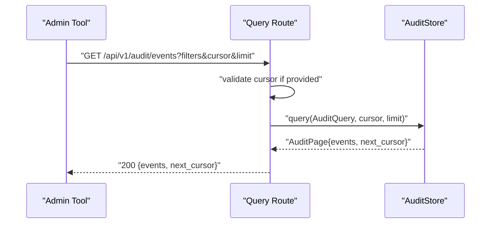

**Diagram sources**
- [query.py:35-95](file://products/audit-service/src/audit_service/api/routes/query.py#L35-L95)
- [audit_store.py:386-415](file://products/audit-service/src/audit_service/services/audit_store.py#L386-L415)

**Section sources**
- [query.py:35-95](file://products/audit-service/src/audit_service/api/routes/query.py#L35-L95)

### Summary API
- Aggregates totals, buckets by event_type/outcome/service, top actors, and decision-chain projections.
- Deterministic sorting ensures identical results across backends.
- Operates over envelope columns only; details payload is never excavated.

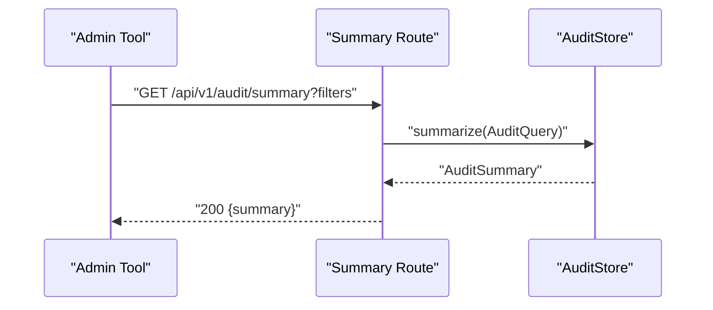

**Diagram sources**
- [summary.py:34-79](file://products/audit-service/src/audit_service/api/routes/summary.py#L34-L79)
- [audit_store.py:188-219](file://products/audit-service/src/audit_service/services/audit_store.py#L188-L219)
- [audit_store.py:417-489](file://products/audit-service/src/audit_service/services/audit_store.py#L417-L489)

**Section sources**
- [summary.py:34-79](file://products/audit-service/src/audit_service/api/routes/summary.py#L34-L79)
- [audit-store.py:188-219](file://products/audit-service/src/audit_service/services/audit_store.py#L188-L219)
- [audit-store.py:417-489](file://products/audit-service/src/audit_service/services/audit_store.py#L417-L489)

### Export API
- Streams RFC-4180 CSV with a fixed column order including envelope fields and sorted-key JSON details.
- Reads pages up to AUDIT_EXPORT_MAX_ROWS; truncation is indicated via response headers.
- Headers are finalized before streaming begins so consumers can detect complete vs truncated exports.

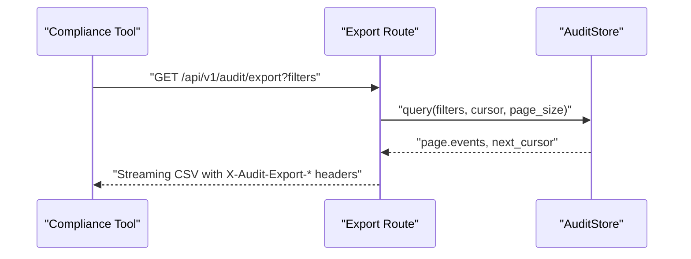

**Diagram sources**
- [export.py:87-164](file://products/audit-service/src/audit_service/api/routes/export.py#L87-L164)

**Section sources**
- [export.py:87-164](file://products/audit-service/src/audit_service/api/routes/export.py#L87-L164)

### Application Lifecycle and Observability
- Lifespan initializes the store and starts the retention task; closes resources on shutdown.
- HTTP middleware logs requests with duration and request IDs.
- Metrics and telemetry are configured for ingestion, queries, exports, and errors.

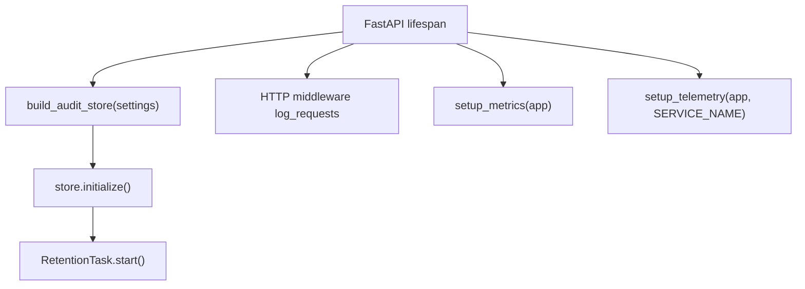

**Diagram sources**
- [app.py:20-70](file://products/audit-service/src/audit_service/app.py#L20-L70)

**Section sources**
- [app.py:20-70](file://products/audit-service/src/audit_service/app.py#L20-L70)
- [metrics.py:1-200](file://products/audit-service/src/audit_service/core/metrics.py#L1-L200)
- [observability.py:1-200](file://products/audit-service/src/audit_service/core/observability.py#L1-L200)
- [telemetry.py:1-200](file://products/audit-service/src/audit_service/core/telemetry.py#L1-L200)
- [request_context.py:1-200](file://products/audit-service/src/audit_service/core/request_context.py#L1-L200)

## Dependency Analysis
- Routes depend on:
  - AuditStore for persistence and aggregation
  - IngestAuth for caller authentication
  - Settings for limits and configuration
  - Metrics and observability for recording and logging
- Store depends on:
  - Schemas for validation and modeling
  - PostgreSQL driver (psycopg) for production backend
- Retention depends on:
  - Store for eviction and counting
  - Settings for intervals and batch sizes

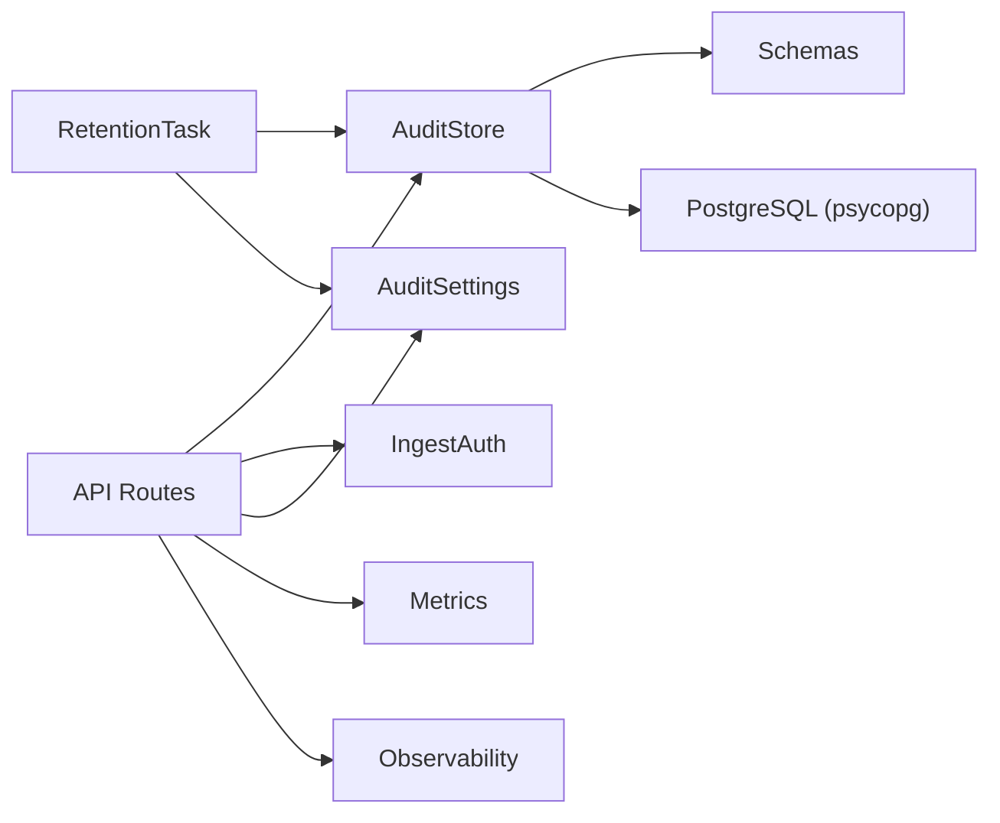

**Diagram sources**
- [ingest.py:33-83](file://products/audit-service/src/audit_service/api/routes/ingest.py#L33-L83)
- [query.py:35-95](file://products/audit-service/src/audit_service/api/routes/query.py#L35-L95)
- [summary.py:34-79](file://products/audit-service/src/audit_service/api/routes/summary.py#L34-L79)
- [export.py:87-164](file://products/audit-service/src/audit_service/api/routes/export.py#L87-L164)
- [audit_store.py:42-64](file://products/audit-service/src/audit_service/services/audit_store.py#L42-L64)
- [retention.py:27-76](file://products/audit-service/src/audit_service/services/retention.py#L27-L76)
- [config.py:60-111](file://products/audit-service/src/audit_service/core/config.py#L60-L111)

**Section sources**
- [ingest.py:33-83](file://products/audit-service/src/audit_service/api/routes/ingest.py#L33-L83)
- [query.py:35-95](file://products/audit-service/src/audit_service/api/routes/query.py#L35-L95)
- [summary.py:34-79](file://products/audit-service/src/audit_service/api/routes/summary.py#L34-L79)
- [export.py:87-164](file://products/audit-service/src/audit_service/api/routes/export.py#L87-L164)
- [audit_store.py:42-64](file://products/audit-service/src/audit_service/services/audit_store.py#L42-L64)
- [retention.py:27-76](file://products/audit-service/src/audit_service/services/retention.py#L27-L76)
- [config.py:60-111](file://products/audit-service/src/audit_service/core/config.py#L60-L111)

## Performance Considerations
- Keyset pagination minimizes offset scans and ensures stable ordering by (occurred_at, event_id).
- PostgreSQL indexes support efficient filtering and sorting on common dimensions.
- Batched eviction avoids long-running DELETEs and reduces lock contention.
- Per-operation connections keep resource usage predictable for low-volume audit traffic.
- Export streams page-by-page with a hard row cap to prevent unbounded memory use.
- Envelope-only filters and aggregations reduce payload processing overhead.

[No sources needed since this section provides general guidance]

## Troubleshooting Guide
Common issues and diagnostics:
- Authentication failures:
  - Check registered ingest clients and workload mappings in settings.
  - Inspect 401 responses and rejection metrics.
- Malformed ingestion:
  - Validate JSON structure and event schema; review 400 responses and malformed rejection metrics.
- Cursor errors:
  - Ensure cursor is passed unchanged from previous query responses; invalid cursors return 400.
- Retention failures:
  - Errors are caught and logged; check store error metrics and eviction logs.
- Store readiness:
  - Use readiness checks to verify database connectivity before relying on write/read paths.

**Section sources**
- [ingest.py:33-83](file://products/audit-service/src/audit_service/api/routes/ingest.py#L33-L83)
- [query.py:35-95](file://products/audit-service/src/audit_service/api/routes/query.py#L35-L95)
- [retention.py:45-76](file://products/audit-service/src/audit_service/services/retention.py#L45-L76)
- [audit_store.py:535-543](file://products/audit-service/src/audit_service/services/audit_store.py#L535-L543)

## Conclusion
The Audit Service delivers a robust, compliant audit trail with durable storage, strict schemas, and controlled access. Its design emphasizes idempotency, deterministic aggregation, and bounded exports suitable for compliance reporting. Retention policies ensure data lifecycle management while maintaining performance under load. Integration points with platform services enable comprehensive visibility across tool invocations, policy decisions, sessions, documents, skills, and execution flows.

[No sources needed since this section summarizes without analyzing specific files]

## Appendices

### Data Lifecycle Management
- Ingestion: validated, authenticated, and persisted with idempotency.
- Querying: envelope-only filters with keyset pagination.
- Summarization: deterministic aggregates over envelope columns.
- Export: bounded CSV streaming with truncation headers.
- Retention: time-based eviction followed by hard cap enforcement.

**Section sources**
- [audit_store.py:498-533](file://products/audit-service/src/audit_service/services/audit_store.py#L498-L533)
- [retention.py:45-76](file://products/audit-service/src/audit_service/services/retention.py#L45-L76)

### Integration with Other Platform Services
- Emitting services mint event_id and occurred_at and forward post-redaction events to the audit service.
- Supported event types include tool invocations, policy decisions, token exchanges, session lifecycle, chat interactions, confirmations, incidents, skills, executions, documents, and skill graduation.
- The shared schema defines the canonical envelope contract used across services.

**Section sources**
- [audit-event.schema.json:1-94](file://shared/shared-contracts/schemas/audit-event.schema.json#L1-L94)

### Monitoring and Telemetry
- HTTP middleware records request method, path, status code, and duration.
- Metrics track ingested, rejected, queried, exported, and evicted events; store size gauges are updated after retention sweeps.
- Structured log lines capture ingestion, query, summary, export, and eviction events with contextual attributes.

**Section sources**
- [app.py:49-65](file://products/audit-service/src/audit_service/app.py#L49-L65)
- [retention.py:54-76](file://products/audit-service/src/audit_service/services/retention.py#L54-L76)
- [metrics.py:1-200](file://products/audit-service/src/audit_service/core/metrics.py#L1-L200)
- [observability.py:1-200](file://products/audit-service/src/audit_service/core/observability.py#L1-L200)
- [telemetry.py:1-200](file://products/audit-service/src/audit_service/core/telemetry.py#L1-L200)