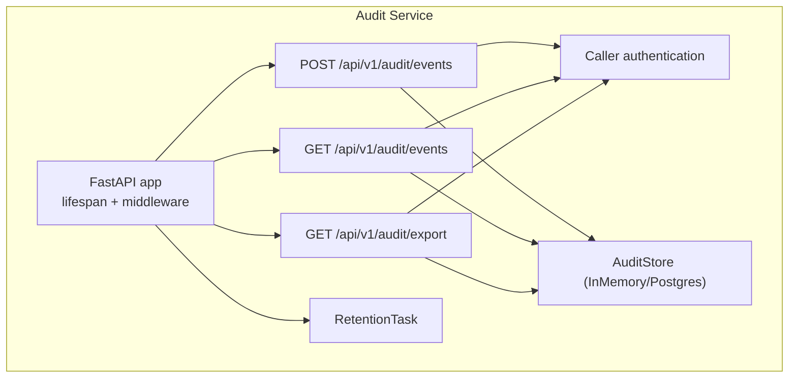
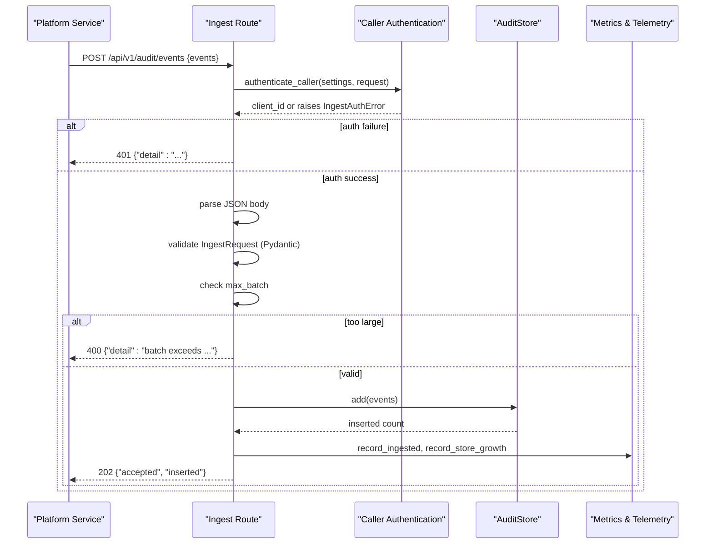
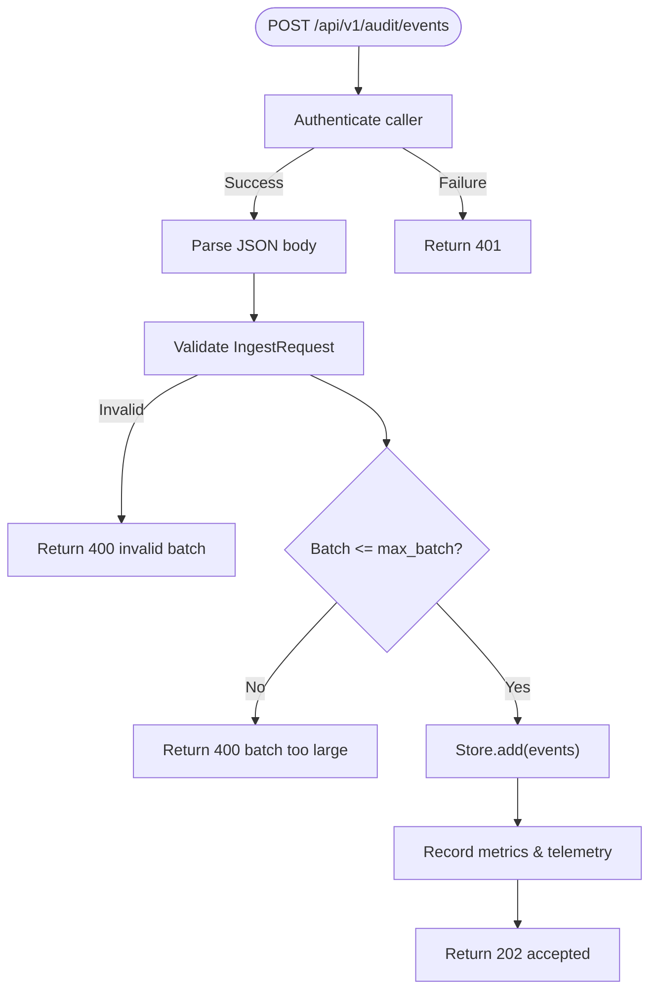
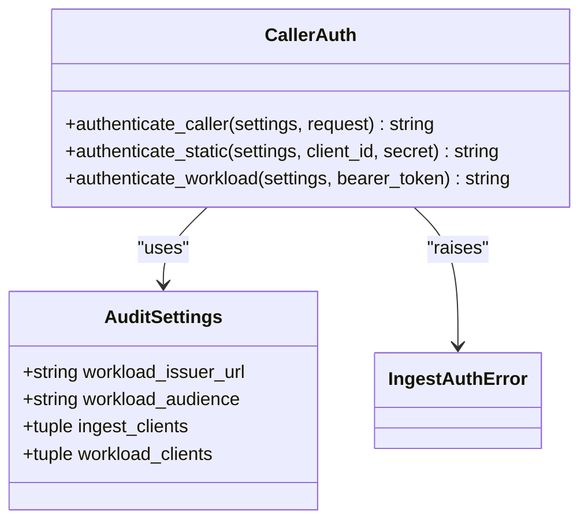
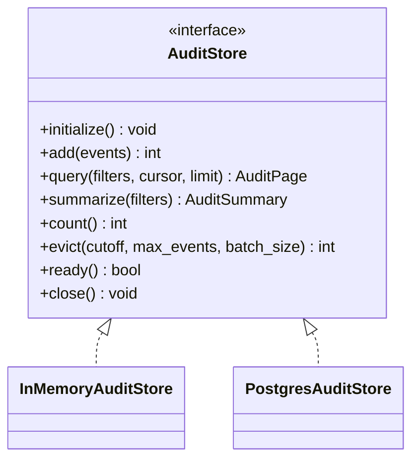
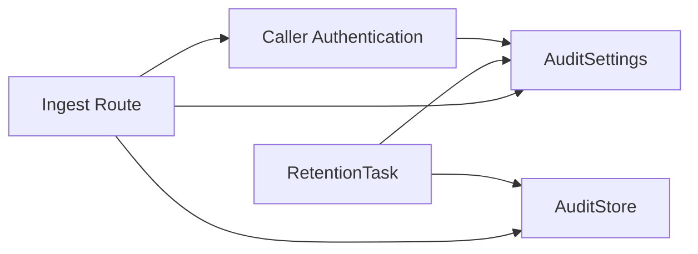

# Event Ingestion Pipeline

<cite>
**Referenced Files in This Document**
- [app.py](file://products/audit-service/src/audit_service/app.py)
- [main.py](file://products/audit-service/src/audit_service/main.py)
- [ingest.py](file://products/audit-service/src/audit_service/api/routes/ingest.py)
- [query.py](file://products/audit-service/src/audit_service/api/routes/query.py)
- [export.py](file://products/audit-service/src/audit_service/api/routes/export.py)
- [ingest_auth.py](file://products/audit-service/src/audit_service/services/ingest_auth.py)
- [audit_store.py](file://products/audit-service/src/audit_service/services/audit_store.py)
- [retention.py](file://products/audit-service/src/audit_service/services/retention.py)
- [config.py](file://products/audit-service/src/audit_service/core/config.py)
- [audit-event.schema.json](file://shared/shared-contracts/schemas/audit-event.schema.json)
</cite>

## Table of Contents
1. [Introduction](#introduction)
2. [Project Structure](#project-structure)
3. [Core Components](#core-components)
4. [Architecture Overview](#architecture-overview)
5. [Detailed Component Analysis](#detailed-component-analysis)
6. [Dependency Analysis](#dependency-analysis)
7. [Performance Considerations](#performance-considerations)
8. [Troubleshooting Guide](#troubleshooting-guide)
9. [Conclusion](#conclusion)

## Introduction
This document explains the Audit Service event ingestion pipeline: how audit events are received, authenticated, validated, and stored; the REST API endpoints for ingestion; authentication mechanisms for service-to-service communication; validation against shared JSON Schema contracts; batch ingestion capabilities; rate limiting via batch caps; error recovery; and security considerations for input sanitization and authorization. It also includes examples of emitting audit events from other platform services such as Agent Platform, Tool Gateway, and Identity Broker.

## Project Structure
The Audit Service is a FastAPI application that exposes ingestion, query, export, and summary endpoints. The runtime initializes a pluggable store (in-memory or PostgreSQL), starts a retention task, and wires middleware for request logging and telemetry.

**Diagram sources**
- [app.py:20-70](file://products/audit-service/src/audit_service/app.py#L20-L70)
- [ingest.py:33-82](file://products/audit-service/src/audit_service/api/routes/ingest.py#L33-L82)
- [query.py:35-94](file://products/audit-service/src/audit_service/api/routes/query.py#L35-L94)
- [export.py:87-163](file://products/audit-service/src/audit_service/api/routes/export.py#L87-L163)
- [ingest_auth.py:105-117](file://products/audit-service/src/audit_service/services/ingest_auth.py#L105-L117)
- [audit_store.py:42-63](file://products/audit-service/src/audit_service/services/audit_store.py#L42-L63)
- [retention.py:27-75](file://products/audit-service/src/audit_service/services/retention.py#L27-L75)

**Section sources**
- [app.py:20-70](file://products/audit-service/src/audit_service/app.py#L20-L70)
- [main.py:6-8](file://products/audit-service/src/audit_service/main.py#L6-L8)

## Core Components
- Ingestion endpoint: Accepts batches of audit events, authenticates callers, validates payloads, enforces batch size limits, stores events, records metrics, and returns acceptance status.
- Authentication: Supports two paths for service-to-service identity:
  - Static HTTP Basic credentials against a configured registry.
  - Workload identity using Kubernetes projected service-account tokens validated against cluster OIDC issuer JWKS with audience and subject mapping.
- Validation: Uses Pydantic models aligned to the shared audit-event JSON Schema contract; rejects malformed batches wholesale.
- Storage: Pluggable backend strategy:
  - In-memory store for tests/dev.
  - PostgreSQL store for production with durable WAL-backed persistence and indexes.
- Retention: Background task evicts old events by time window and hard cap in batches to avoid blocking ingest.

**Section sources**
- [ingest.py:33-82](file://products/audit-service/src/audit_service/api/routes/ingest.py#L33-L82)
- [ingest_auth.py:34-117](file://products/audit-service/src/audit_service/services/ingest_auth.py#L34-L117)
- [audit-store.py:42-63](file://products/audit-service/src/audit_service/services/audit_store.py#L42-L63)
- [audit-store.py:93-157](file://products/audit-service/src/audit_service/services/audit_store.py#L93-L157)
- [audit-store.py:224-546](file://products/audit-service/src/audit_service/services/audit_store.py#L224-L546)
- [retention.py:27-75](file://products/audit-service/src/audit_service/services/retention.py#L27-L75)
- [config.py:60-110](file://products/audit-service/src/audit_service/core/config.py#L60-L110)

## Architecture Overview
The ingestion pipeline follows a strict sequence: authenticate caller, parse and validate request body, enforce batch limits, persist events, record metrics and observability logs, and respond with acceptance.

**Diagram sources**
- [ingest.py:33-82](file://products/audit-service/src/audit_service/api/routes/ingest.py#L33-L82)
- [ingest_auth.py:105-117](file://products/audit-service/src/audit_service/services/ingest_auth.py#L105-L117)
- [audit_store.py:42-63](file://products/audit-service/src/audit_service/services/audit_store.py#L42-L63)

## Detailed Component Analysis

### Ingestion Endpoint
- Path: POST /api/v1/audit/events
- Request schema:
  - Body must be a JSON object with an events array containing one or more audit event objects conforming to the shared audit-event schema.
  - Each event must include required envelope fields: event_id, occurred_at, event_type, service, request_id, outcome. Optional fields include subject, username, actor, roles, session_id, details.
- Authentication:
  - Bearer token path: Validates workload token against cluster OIDC issuer JWKS, checks issuer, audience, and maps subject to a registered client.
  - Basic auth path: Validates static client_id/secret against configured registry.
- Validation:
  - JSON parsing errors return 400.
  - Pydantic model validation enforces schema constraints; invalid batches return 400.
  - Batch size enforced by AUDIT_MAX_BATCH; exceeding limit returns 400.
- Storage:
  - Events are persisted via the selected store backend (in-memory or PostgreSQL).
  - Duplicate event_id handling:
    - In-memory: deduplicates by event_id.
    - Postgres: uses ON CONFLICT DO NOTHING on event_id primary key.
- Response:
  - 202 Accepted with accepted and inserted counts.
  - 401 Unauthorized for authentication failures.
  - 400 Bad Request for malformed or oversized batches.

**Diagram sources**
- [ingest.py:33-82](file://products/audit-service/src/audit_service/api/routes/ingest.py#L33-L82)
- [ingest_auth.py:105-117](file://products/audit-service/src/audit_service/services/ingest_auth.py#L105-L117)
- [audit_store.py:103-111](file://products/audit-service/src/audit_service/services/audit_store.py#L103-L111)
- [audit_store.py:357-384](file://products/audit-service/src/audit_service/services/audit_store.py#L357-L384)

**Section sources**
- [ingest.py:33-82](file://products/audit-service/src/audit_service/api/routes/ingest.py#L33-L82)
- [audit-event.schema.json:1-94](file://shared/shared-contracts/schemas/audit-event.schema.json#L1-L94)
- [audit_store.py:103-111](file://products/audit-service/src/audit_service/services/audit_store.py#L103-L111)
- [audit_store.py:357-384](file://products/audit-service/src/audit_service/services/audit_store.py#L357-L384)

### Authentication Mechanisms
- Static credentials:
  - HTTP Basic Authorization header with client_id:secret.
  - Validated against AUDIT_INGEST_CLIENTS registry parsed from environment.
- Workload identity:
  - Bearer token path using Kubernetes projected service-account tokens.
  - Validates against cluster OIDC issuer JWKS, checks issuer, audience, required claims, and maps subject to a registered client via AUDIT_WORKLOAD_CLIENTS.
- Error handling:
  - Missing or invalid credentials raise IngestAuthError mapped to 401 responses.

**Diagram sources**
- [ingest_auth.py:30-117](file://products/audit-service/src/audit_service/services/ingest_auth.py#L30-L117)
- [config.py:8-22](file://products/audit-service/src/audit_service/core/config.py#L8-L22)
- [config.py:60-110](file://products/audit-service/src/audit_service/core/config.py#L60-L110)

**Section sources**
- [ingest_auth.py:34-117](file://products/audit-service/src/audit_service/services/ingest_auth.py#L34-L117)
- [config.py:24-49](file://products/audit-service/src/audit_service/core/config.py#L24-L49)
- [config.py:60-110](file://products/audit-service/src/audit_service/core/config.py#L60-L110)

### Validation Against Shared Contracts
- The audit-event envelope is defined in the shared JSON Schema under shared/shared-contracts/schemas/audit-event.schema.json.
- The AuditService’s Pydantic models mirror this contract and enforce:
  - Required envelope fields.
  - Closed vocabulary for event_type and outcome.
  - Optional contextual fields like subject, username, actor, roles, session_id.
  - Per-event-type details payload.
- Validation happens at the route layer before storage; invalid batches are rejected without partial storage.

**Section sources**
- [audit-event.schema.json:1-94](file://shared/shared-contracts/schemas/audit-event.schema.json#L1-L94)
- [ingest.py:43-56](file://products/audit-service/src/audit_service/api/routes/ingest.py#L43-L56)

### Storage Backends
- In-memory store:
  - Suitable for tests and development.
  - Deduplicates events by event_id.
  - Provides query, summarize, count, and eviction operations.
- PostgreSQL store:
  - Durable WAL-backed persistence with a single audit_events table.
  - Primary key on event_id with ON CONFLICT DO NOTHING to handle duplicates.
  - Indexes on occurred_at, username, session_id, request_id, event_type for efficient queries.
  - Query supports keyset pagination via cursor encoding based on occurred_at and event_id.
  - Summarize aggregates envelope columns only; details are never read.

**Diagram sources**
- [audit_store.py:42-63](file://products/audit-service/src/audit_service/services/audit_store.py#L42-L63)
- [audit_store.py:93-157](file://products/audit-service/src/audit_service/services/audit_store.py#L93-L157)
- [audit_store.py:324-546](file://products/audit-service/src/audit_service/services/audit_store.py#L324-L546)

**Section sources**
- [audit_store.py:93-157](file://products/audit-service/src/audit_service/services/audit_store.py#L93-L157)
- [audit_store.py:224-546](file://products/audit-service/src/audit_service/services/audit_store.py#L224-L546)

### Retention and Eviction
- Background task runs periodically to:
  - Evict events older than AUDIT_RETENTION_DAYS.
  - Enforce hard cap AUDIT_MAX_EVENTS by dropping oldest excess.
- Deletions are batched to avoid blocking ingest beyond normal contention.
- Metrics and structured logs record evicted counts and settings used.

**Section sources**
- [retention.py:27-75](file://products/audit-service/src/audit_service/services/retention.py#L27-L75)
- [audit_store.py:498-533](file://products/audit-service/src/audit_service/services/audit_store.py#L498-L533)

### Other Endpoints (Query and Export)
- Query:
  - GET /api/v1/audit/events with filters and keyset pagination.
  - Requires authenticated caller; returns events newest-first with next_cursor.
- Export:
  - GET /api/v1/audit/export streams CSV with fixed columns and truncation headers.
  - Hard-capped by AUDIT_EXPORT_MAX_ROWS; pages through store until cap reached.

**Section sources**
- [query.py:35-94](file://products/audit-service/src/audit_service/api/routes/query.py#L35-L94)
- [export.py:87-163](file://products/audit-service/src/audit_service/api/routes/export.py#L87-L163)

## Dependency Analysis
The ingestion pipeline depends on configuration, authentication, schema validation, and storage backends. The following diagram shows core dependencies within the Audit Service.

**Diagram sources**
- [config.py:60-110](file://products/audit-service/src/audit_service/core/config.py#L60-L110)
- [ingest.py:33-82](file://products/audit-service/src/audit_service/api/routes/ingest.py#L33-L82)
- [ingest_auth.py:105-117](file://products/audit-service/src/audit_service/services/ingest_auth.py#L105-L117)
- [audit_store.py:42-63](file://products/audit-service/src/audit_service/services/audit_store.py#L42-L63)
- [retention.py:27-75](file://products/audit-service/src/audit_service/services/retention.py#L27-L75)

**Section sources**
- [config.py:60-110](file://products/audit-service/src/audit_service/core/config.py#L60-L110)
- [ingest.py:33-82](file://products/audit-service/src/audit_service/api/routes/ingest.py#L33-L82)
- [ingest_auth.py:105-117](file://products/audit-service/src/audit_service/services/ingest_auth.py#L105-L117)
- [audit_store.py:42-63](file://products/audit-service/src/audit_service/services/audit_store.py#L42-L63)
- [retention.py:27-75](file://products/audit-service/src/audit_service/services/retention.py#L27-L75)

## Performance Considerations
- Batch ingestion:
  - AUDIT_MAX_BATCH limits per-request payload size to prevent oversized requests.
  - Store implementations handle duplicate event_id efficiently (in-memory set deduplication; Postgres ON CONFLICT DO NOTHING).
- Pagination:
  - Keyset cursor pagination avoids expensive offset-based scans.
- Retention:
  - Batched eviction prevents long-running DELETE operations that could block ingest.
- Observability:
  - Metrics and structured logs capture ingestion, rejections, exports, and store growth for monitoring and alerting.

[No sources needed since this section provides general guidance]

## Troubleshooting Guide
Common issues and their handling:
- Authentication failures:
  - Missing or invalid credentials result in 401 responses with detail messages.
  - Ensure correct Authorization header format (Bearer or Basic) and that clients are registered in AUDIT_INGEST_CLIENTS or subjects mapped in AUDIT_WORKLOAD_CLIENTS.
- Malformed requests:
  - Invalid JSON or schema violations return 400 with descriptive details.
  - Verify event envelope matches the shared audit-event schema and required fields are present.
- Oversized batches:
  - Requests exceeding AUDIT_MAX_BATCH return 400; reduce batch size or split into multiple requests.
- Storage errors:
  - Retention task failures are recorded and logged without crashing the loop; investigate database connectivity and permissions if evictions fail.

**Section sources**
- [ingest.py:37-65](file://products/audit-service/src/audit_service/api/routes/ingest.py#L37-L65)
- [query.py:51-63](file://products/audit-service/src/audit_service/api/routes/query.py#L51-L63)
- [export.py:101-105](file://products/audit-service/src/audit_service/api/routes/export.py#L101-L105)
- [retention.py:45-52](file://products/audit-service/src/audit_service/services/retention.py#L45-L52)

## Conclusion
The Audit Service provides a secure, validated, and durable ingestion pipeline for audit events across platform services. It enforces strict authentication, schema validation, and batch limits while supporting both in-memory and PostgreSQL storage backends. Retention ensures bounded storage with background eviction. Consumers can query and export audit trails with keyset pagination and capped streaming exports. By adhering to shared contracts and robust error handling, the pipeline maintains integrity and operability across the platform.

[No sources needed since this section summarizes without analyzing specific files]