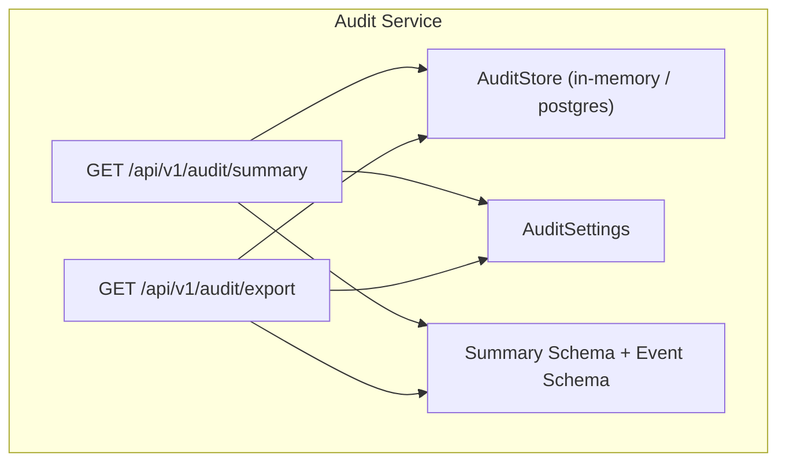
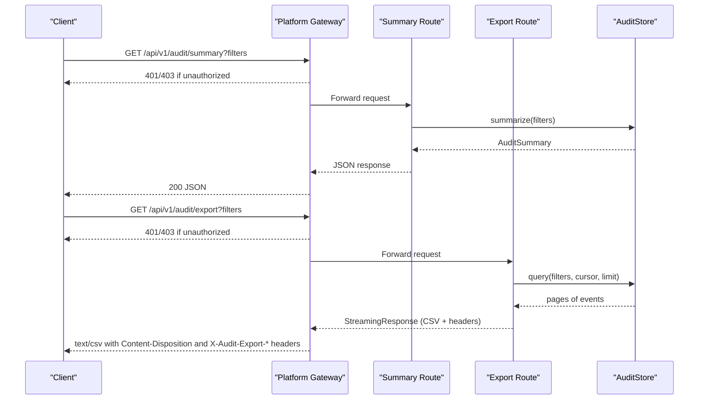
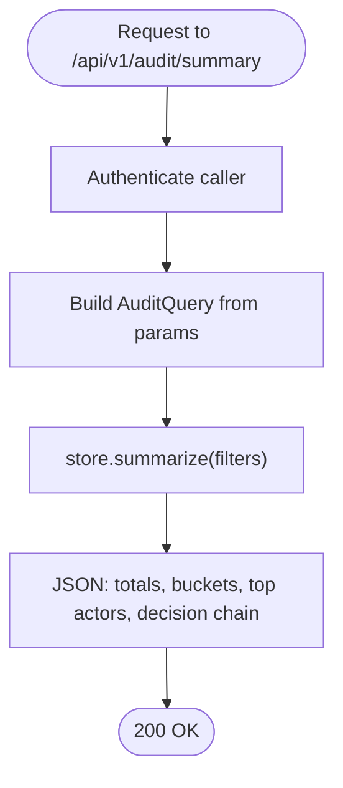
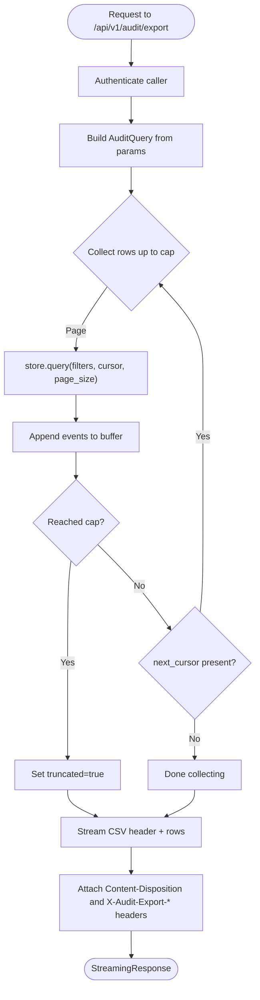
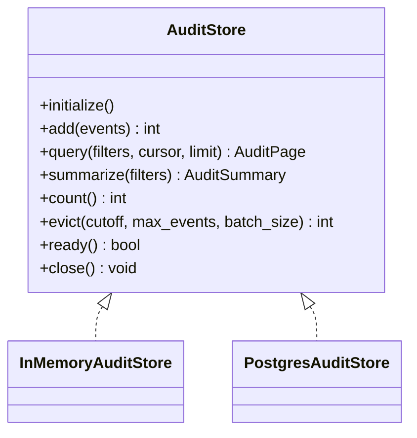
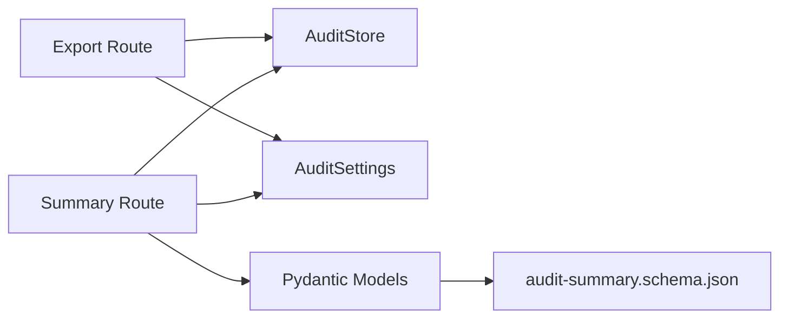

# Export and Reporting

<cite>
**Referenced Files in This Document**
- [SPEC-046-audit-reporting-and-export/spec.md](file://docs/specs/SPEC-046-audit-reporting-and-export/spec.md)
- [export.py](file://products/audit-service/src/audit_service/api/routes/export.py)
- [summary.py](file://products/audit-service/src/audit_service/api/routes/summary.py)
- [audit_store.py](file://products/audit-service/src/audit_service/services/audit_store.py)
- [config.py](file://products/audit-service/src/audit_service/core/config.py)
- [summary model](file://products/audit-service/src/audit_service/schemas/summary.py)
- [audit-summary.schema.json](file://shared/shared-contracts/schemas/audit-summary.schema.json)
- [audit-event.schema.json](file://shared/shared-contracts/schemas/audit-event.schema.json)
- [test_reporting.py](file://products/audit-service/tests/test_reporting.py)
</cite>

## Table of Contents
1. [Introduction](#introduction)
2. [Project Structure](#project-structure)
3. [Core Components](#core-components)
4. [Architecture Overview](#architecture-overview)
5. [Detailed Component Analysis](#detailed-component-analysis)
6. [Dependency Analysis](#dependency-analysis)
7. [Performance Considerations](#performance-considerations)
8. [Security and Authorization](#security-and-authorization)
9. [Troubleshooting Guide](#troubleshooting-guide)
10. [Conclusion](#conclusion)
11. [Appendices](#appendices)

## Introduction
This document explains the audit data export and reporting capabilities delivered by the audit service. It covers the summary aggregate endpoint, bounded CSV export, filtering and scoping, streaming behavior for large datasets, configuration knobs, and how these features support compliance reporting and investigations. The design is read-only, deterministic, and governed by the existing audit:read policy action via platform-gateway.

## Project Structure
The export and reporting feature spans a small set of focused components:
- API routes expose two endpoints under /api/v1/audit: summary and export.
- A shared store abstraction implements query and summarize over an in-memory or PostgreSQL backend.
- Configuration provides the row cap and other operational settings.
- Shared JSON schemas define the event envelope and the summary response contract.
- Tests validate behavior including truncation headers, column order, and filter application.

**Diagram sources**
- [summary.py](file://products/audit-service/src/audit_service/api/routes/summary.py)
- [export.py](file://products/audit-service/src/audit_service/api/routes/export.py)
- [audit_store.py](file://products/audit-service/src/audit_service/services/audit_store.py)
- [config.py](file://products/audit-service/src/audit_service/core/config.py)
- [summary model](file://products/audit-service/src/audit_service/schemas/summary.py)
- [audit-summary.schema.json](file://shared/shared-contracts/schemas/audit-summary.schema.json)
- [audit-event.schema.json](file://shared/shared-contracts/schemas/audit-event.schema.json)

**Section sources**
- [SPEC-046-audit-reporting-and-export/spec.md](file://docs/specs/SPEC-046-audit-reporting-and-export/spec.md)

## Core Components
- Summary aggregate endpoint: Returns deterministic aggregates over envelope columns only (event_type, outcome, service, username), plus a decision-chain projection and top actors.
- Bounded CSV export: Streams filtered events newest-first as RFC-4180 CSV with a fixed column set and hard row cap; includes truncation headers.
- Store abstraction: Provides query and summarize across in-memory and PostgreSQL backends with consistent cursor-based pagination and aggregation logic.
- Configuration: Defines AUDIT_EXPORT_MAX_ROWS and other runtime settings controlling retention, batching, and export limits.
- Contracts: Enforces the summary response shape via a JSON schema and Pydantic models; event envelope remains unchanged.

**Section sources**
- [summary.py](file://products/audit-service/src/audit_service/api/routes/summary.py)
- [export.py](file://products/audit-service/src/audit_service/api/routes/export.py)
- [audit_store.py](file://products/audit-service/src/audit_service/services/audit_store.py)
- [config.py](file://products/audit-service/src/audit_service/core/config.py)
- [summary model](file://products/audit-service/src/audit_service/schemas/summary.py)
- [audit-summary.schema.json](file://shared/shared-contracts/schemas/audit-summary.schema.json)

## Architecture Overview
The export and reporting flow is a read path that reuses the same filters and store used by the query route. Authentication is enforced before reaching the audit service (registered-service posture). The gateway proxies both endpoints under the existing audit:read action.

**Diagram sources**
- [summary.py](file://products/audit-service/src/audit_service/api/routes/summary.py)
- [export.py](file://products/audit-service/src/audit_service/api/routes/export.py)
- [audit_store.py](file://products/audit-service/src/audit_service/services/audit_store.py)
- [SPEC-046-audit-reporting-and-export/spec.md](file://docs/specs/SPEC-046-audit-reporting-and-export/spec.md)

## Detailed Component Analysis

### Summary Aggregate Endpoint
- Purpose: Provide deterministic, envelope-column aggregates for governance and compliance dashboards.
- Filters: username, session_id, request_id, event_type, service, outcome, since, until. No default window; the store’s retention bounds apply.
- Response fields: total_events, window echo, by_event_type, by_outcome, by_service, top_actors (up to 10), decision_chain (confirmation_decided, execution_requested, execution_completed, execution_rejected).
- Sorting: Buckets are sorted by count descending, then name ascending for determinism.
- Observability: Logs a structured audit_summary_queried event and emits a counter metric.

**Diagram sources**
- [summary.py](file://products/audit-service/src/audit_service/api/routes/summary.py)
- [audit_store.py](file://products/audit-service/src/audit_service/services/audit_store.py)
- [summary model](file://products/audit-service/src/audit_service/schemas/summary.py)

**Section sources**
- [summary.py](file://products/audit-service/src/audit_service/api/routes/summary.py)
- [audit_store.py](file://products/audit-service/src/audit_service/services/audit_store.py)
- [summary model](file://products/audit-service/src/audit_service/schemas/summary.py)
- [audit-summary.schema.json](file://shared/shared-contracts/schemas/audit-summary.schema.json)

### Bounded CSV Export Endpoint
- Purpose: Stream a bounded, server-side CSV export of audited facts for offline review and compliance hand-offs.
- Format: RFC-4180 CSV with fixed columns in this order: occurred_at, event_type, service, outcome, username, actor, subject, session_id, request_id, details. Timestamps are RFC-3339 UTC with Z suffix; details is JSON-encoded with deterministic key order.
- Filtering: Same dimensions as summary; respects outcome and time windows.
- Pagination and cap: Pages through the store (200-row pages) up to AUDIT_EXPORT_MAX_ROWS (default 10,000). Truncation is decided before streaming begins.
- Headers: Always include X-Audit-Export-Truncated (true/false) and X-Audit-Export-Rows (exact count). Content-Type is text/csv; Content-Disposition sets a deterministic filename with UTC timestamp.
- Observability: Logs audit_export_generated with client and row count; emits a counter metric.

**Diagram sources**
- [export.py](file://products/audit-service/src/audit_service/api/routes/export.py)
- [audit_store.py](file://products/audit-service/src/audit_service/services/audit_store.py)

**Section sources**
- [export.py](file://products/audit-service/src/audit_service/api/routes/export.py)
- [audit_store.py](file://products/audit-service/src/audit_service/services/audit_store.py)
- [config.py](file://products/audit-service/src/audit_service/core/config.py)

### Store Abstraction and Aggregation
- In-memory store: Filters and sorts events in memory; summarizes using counters and returns top actors capped at 10.
- PostgreSQL store: Uses grouped SQL over envelope columns only (never details); computes counts and top actors with LIMIT; uses parameterized arrays for decision-chain types.
- Cursor pagination: Encodes occurred_at and event_id to support newest-first paging; used by both query and export flows.
- Retention and eviction: Background eviction enforces retention days and max_events; not part of export but affects available data.

**Diagram sources**
- [audit_store.py](file://products/audit-service/src/audit_service/services/audit_store.py)

**Section sources**
- [audit_store.py](file://products/audit-service/src/audit_service/services/audit_store.py)

### Configuration and Limits
- AUDIT_EXPORT_MAX_ROWS: Hard cap on exported rows; parsed as a positive integer; defaults to 10,000.
- Other relevant settings: retention_days, max_events, eviction_interval_seconds, eviction_batch_size, max_batch, store_backend, db_url.
- Behavior: Export pages through the store up to the cap; truncation headers reflect whether the cap was reached.

**Section sources**
- [config.py](file://products/audit-service/src/audit_service/core/config.py)

### Data Contracts
- Event envelope: Unchanged from prior specs; closed vocabulary of event types and outcomes; details per event type.
- Summary response: Strictly defined by audit-summary.schema.json; deterministic ordering and required fields; decision_chain always present with zeroed entries when absent.

**Section sources**
- [audit-event.schema.json](file://shared/shared-contracts/schemas/audit-event.schema.json)
- [audit-summary.schema.json](file://shared/shared-contracts/schemas/audit-summary.schema.json)
- [summary model](file://products/audit-service/src/audit_service/schemas/summary.py)

## Dependency Analysis
- Routes depend on:
  - AuditStore for query and summarize.
  - Settings for export_max_rows and other knobs.
  - Schemas for validation and serialization.
- Backends implement the same interface, ensuring consistent behavior between in-memory and PostgreSQL.
- Tests drive the FastAPI app with an in-memory store to assert behavior end-to-end.

**Diagram sources**
- [export.py](file://products/audit-service/src/audit_service/api/routes/export.py)
- [summary.py](file://products/audit-service/src/audit_service/api/routes/summary.py)
- [audit_store.py](file://products/audit-service/src/audit_service/services/audit_store.py)
- [config.py](file://products/audit-service/src/audit_service/core/config.py)
- [summary model](file://products/audit-service/src/audit_service/schemas/summary.py)
- [audit-summary.schema.json](file://shared/shared-contracts/schemas/audit-summary.schema.json)

**Section sources**
- [test_reporting.py](file://products/audit-service/tests/test_reporting.py)

## Performance Considerations
- Streaming CSV: The export streams rows without materializing the entire dataset in memory beyond one page at a time.
- Row cap: AUDIT_EXPORT_MAX_ROWS prevents unbounded memory usage and long-running responses.
- Page size: Fixed 200-row pages balance throughput and memory footprint.
- Aggregation: Summary uses grouped SQL over indexed envelope columns; no JSONB excavation ensures predictable performance.
- Timeouts: Gateway proxy timeout for export is sized for the capped export; keep filters narrow to reduce scan ranges.

[No sources needed since this section provides general guidance]

## Security and Authorization
- Access control: Both endpoints require authentication; the platform-gateway enforces the existing audit:read action before proxying to the audit service.
- Registered-service posture: Calls are authenticated using registered credentials; unauthorized requests receive 401.
- Read-only invariant: Reporting surfaces do not introduce new policy actions or ingest capability; they render stored facts only.
- Sensitive data: Export includes verbatim envelope values; ensure filters scope to authorized data (e.g., by username, session_id, or service).

**Section sources**
- [SPEC-046-audit-reporting-and-export/spec.md](file://docs/specs/SPEC-046-audit-reporting-and-export/spec.md)
- [export.py](file://products/audit-service/src/audit_service/api/routes/export.py)
- [summary.py](file://products/audit-service/src/audit_service/api/routes/summary.py)

## Troubleshooting Guide
- 401 Unauthorized: Missing or invalid credentials; verify registered-service auth and gateway posture.
- 422 Validation error: Invalid filter value (e.g., outcome outside allowed enum); correct the query parameters.
- Truncated export: If X-Audit-Export-Truncated is true, increase AUDIT_EXPORT_MAX_ROWS or refine filters to reduce result set.
- Empty results: Ensure filters match stored data; remember there is no default time window—include since/until as needed.
- Slow queries: Narrow filters (username, session_id, event_type, service) and use time windows to limit scans.

**Section sources**
- [test_reporting.py](file://products/audit-service/tests/test_reporting.py)
- [export.py](file://products/audit-service/src/audit_service/api/routes/export.py)
- [summary.py](file://products/audit-service/src/audit_service/api/routes/summary.py)

## Conclusion
The audit export and reporting feature provides deterministic, secure, and bounded access to audit data for compliance and investigations. The summary endpoint offers quick insights, while the CSV export supports offline analysis with strict formatting and safety guarantees. Together, they enable governance workflows without altering the event vocabulary or policy surface.

[No sources needed since this section summarizes without analyzing specific files]

## Appendices

### Export Formats and File Specifications
- CSV format: RFC-4180 compliant; fixed column order; timestamps in RFC-3339 UTC with Z; details serialized as JSON with deterministic key order.
- Headers: Content-Type text/csv; Content-Disposition attachment with deterministic filename; X-Audit-Export-Truncated and X-Audit-Export-Rows always present.

**Section sources**
- [export.py](file://products/audit-service/src/audit_service/api/routes/export.py)

### Example Use Cases
- Compliance report generation: Apply filters by service and outcome to produce a weekly CSV of denied or error events; consume via downstream systems.
- Investigation export: Filter by session_id or request_id to isolate a single incident’s trail; download CSV for evidence packaging.
- Integration with external reporting: Consume the summary JSON for dashboards; stream CSV exports into archival storage or ticket attachments.

[No sources needed since this section provides conceptual examples]