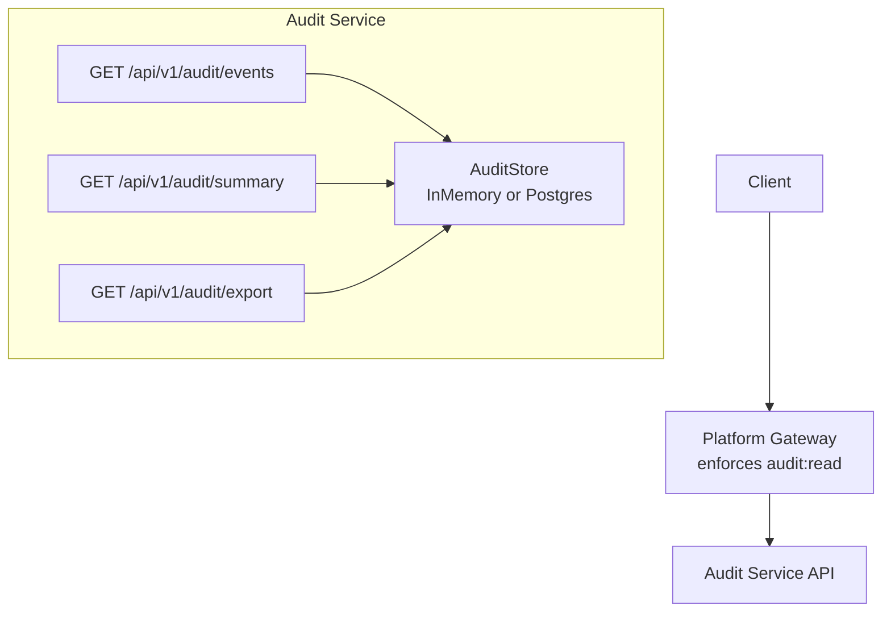
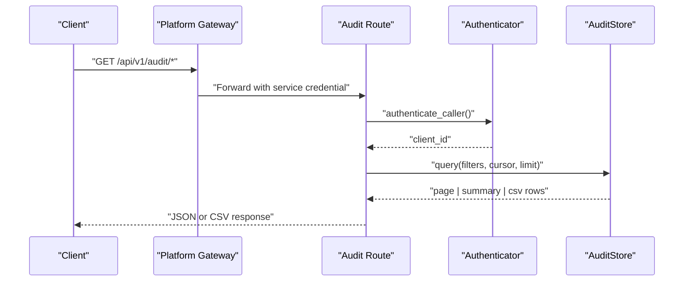
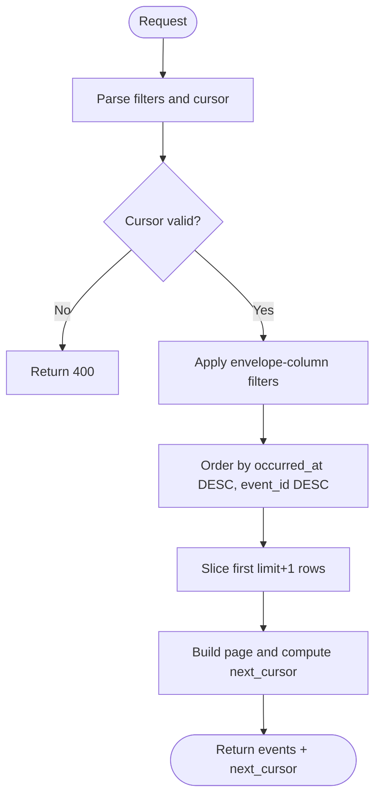
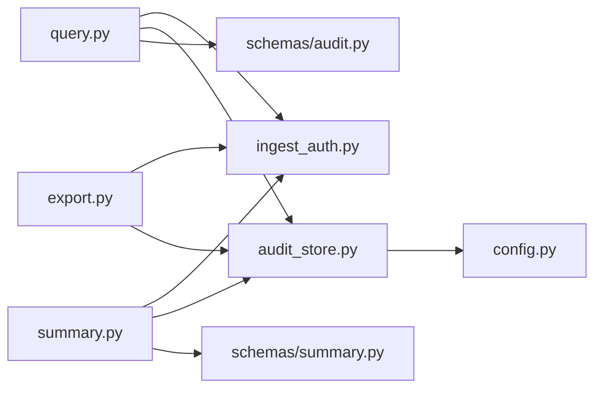

# Query API and Search

<cite>
**Referenced Files in This Document**
- [query.py](file://products/audit-service/src/audit_service/api/routes/query.py)
- [summary.py](file://products/audit-service/src/audit_service/api/routes/summary.py)
- [export.py](file://products/audit-service/src/audit_service/api/routes/export.py)
- [audit.py](file://products/audit-service/src/audit_service/schemas/audit.py)
- [summary_schema.py](file://products/audit-service/src/audit_service/schemas/summary.py)
- [audit_store.py](file://products/audit-service/src/audit_service/services/audit_store.py)
- [ingest_auth.py](file://products/audit-service/src/audit_service/services/ingest_auth.py)
- [config.py](file://products/audit-service/src/audit_service/core/config.py)
- [test_routes.py](file://products/audit-service/tests/test_routes.py)
- [test_reporting.py](file://products/audit-service/tests/test_reporting.py)
</cite>

## Table of Contents
1. [Introduction](#introduction)
2. [Project Structure](#project-structure)
3. [Core Components](#core-components)
4. [Architecture Overview](#architecture-overview)
5. [Detailed Component Analysis](#detailed-component-analysis)
6. [Dependency Analysis](#dependency-analysis)
7. [Performance Considerations](#performance-considerations)
8. [Troubleshooting Guide](#troubleshooting-guide)
9. [Conclusion](#conclusion)

## Introduction
This document describes the Audit Service query interface for searching, filtering, paginating, and aggregating audit events. It covers:
- Query endpoints for listing events with keyset pagination
- Summary and aggregation endpoints for statistical insights
- CSV export endpoint for bounded, filtered exports
- Authentication and authorization posture
- Filter expressions, parameters, and response formats
- Common query patterns, performance tips, and operational considerations

The service enforces caller authentication locally and relies on platform-gateway to enforce user-level read permissions before proxying requests.

## Project Structure
The Audit Service exposes three primary read paths under /api/v1/audit:
- GET /api/v1/audit/events — list and filter events with cursor-based pagination
- GET /api/v1/audit/summary — deterministic aggregates over envelope columns
- GET /api/v1/audit/export — bounded CSV export of filtered events

**Diagram sources**
- [query.py:35-95](file://products/audit-service/src/audit_service/api/routes/query.py#L35-L95)
- [summary.py:34-79](file://products/audit-service/src/audit_service/api/routes/summary.py#L34-L79)
- [export.py:87-164](file://products/audit-service/src/audit_service/api/routes/export.py#L87-L164)
- [audit_store.py:42-64](file://products/audit-service/src/audit_service/services/audit_store.py#L42-L64)

**Section sources**
- [query.py:1-95](file://products/audit-service/src/audit_service/api/routes/query.py#L1-L95)
- [summary.py:1-79](file://products/audit-service/src/audit_service/api/routes/summary.py#L1-L79)
- [export.py:1-164](file://products/audit-service/src/audit_service/api/routes/export.py#L1-L164)

## Core Components
- Event schema and query filters define accepted fields and constraints.
- Routes authenticate callers and translate query parameters into store operations.
- Store abstraction supports in-memory (tests/dev) and PostgreSQL (production) backends.
- Summary and export build deterministic outputs from envelope columns only.

Key responsibilities:
- Authentication: local verification via static credentials or workload tokens
- Filtering: equality and range filters on envelope columns
- Pagination: keyset cursor based on occurred_at and event_id
- Aggregation: counts by type/outcome/service, top actors, decision chain
- Export: bounded streaming CSV with truncation headers

**Section sources**
- [audit.py:14-83](file://products/audit-service/src/audit_service/schemas/audit.py#L14-L83)
- [summary_schema.py:18-108](file://products/audit-service/src/audit_service/schemas/summary.py#L18-L108)
- [audit_store.py:32-64](file://products/audit-service/src/audit_service/services/audit_store.py#L32-L64)
- [ingest_auth.py:30-118](file://products/audit-service/src/audit_service/services/ingest_auth.py#L30-L118)

## Architecture Overview
The request flow is consistent across read endpoints:
1. Caller authenticates via Basic or Bearer token
2. Route validates parameters and builds an AuditQuery filter
3. Store executes query/summarize/export using shared filter logic
4. Response includes pagination metadata or aggregated data

**Diagram sources**
- [query.py:35-95](file://products/audit-service/src/audit_service/api/routes/query.py#L35-L95)
- [summary.py:34-79](file://products/audit-service/src/audit_service/api/routes/summary.py#L34-L79)
- [export.py:87-164](file://products/audit-service/src/audit_service/api/routes/export.py#L87-L164)
- [ingest_auth.py:105-118](file://products/audit-service/src/audit_service/services/ingest_auth.py#L105-L118)
- [audit_store.py:386-415](file://products/audit-service/src/audit_service/services/audit_store.py#L386-L415)

## Detailed Component Analysis

### Events Query Endpoint
- Path: GET /api/v1/audit/events
- Purpose: List stored audit envelopes newest-first with keyset pagination
- Authentication: Required (Basic or Bearer); enforced per route
- Parameters:
  - username: string, optional
  - session_id: string, optional
  - request_id: string, optional
  - event_type: string, optional
  - service: string, optional
  - outcome: enum allow|deny|success|error, optional
  - since: datetime, optional
  - until: datetime, optional
  - cursor: base64-encoded keyset token, optional
  - limit: integer, default 50, allowed 1..200
- Response:
  - events: array of audit event objects
  - next_cursor: string or null
- Behavior:
  - Filters are applied against envelope columns only
  - Cursor encodes occurred_at and event_id; invalid cursors return 400
  - Limit is enforced server-side; exceeding bounds returns validation error

Common usage patterns:
- Latest N events: GET /api/v1/audit/events?limit=50
- Paginate forward: use next_cursor from prior page
- Filter by user and time window: ?username=alice&since=...&until=...
- Narrow by outcome: ?outcome=deny

Error handling:
- 401 when authentication fails
- 400 for invalid cursor
- 422 for invalid parameter values (e.g., outcome not in enum, limit out of range)

**Section sources**
- [query.py:35-95](file://products/audit-service/src/audit_service/api/routes/query.py#L35-L95)
- [audit_store.py:69-88](file://products/audit-service/src/audit_service/services/audit_store.py#L69-L88)
- [audit_store.py:113-131](file://products/audit-service/src/audit_service/services/audit_store.py#L113-L131)
- [audit_store.py:386-415](file://products/audit-service/src/audit_service/services/audit_store.py#L386-L415)
- [test_routes.py:189-255](file://products/audit-service/tests/test_routes.py#L189-L255)

### Summary Endpoint
- Path: GET /api/v1/audit/summary
- Purpose: Deterministic aggregates over envelope columns within a filter window
- Authentication: Required (Basic or Bearer)
- Parameters: same filter set as events query (no cursor or limit)
- Response fields:
  - total_events: integer
  - window: echo of applied filters (only set fields)
  - by_event_type: list of {name, count}
  - by_outcome: list of {name, count}
  - by_service: list of {name, count}
  - top_actors: top usernames by count (capped)
  - decision_chain: counts for confirmation_decided, execution_requested, execution_completed, execution_rejected
- Behavior:
  - Aggregations touch envelope columns only; details payload is never read
  - Buckets are sorted deterministically by count desc, name asc
  - Outcome filter is additive and included in window echo

Example queries:
- All events: GET /api/v1/audit/summary
- By user and type: ?username=alice&event_type=tool_invoked
- Denials only: ?outcome=deny

**Section sources**
- [summary.py:34-79](file://products/audit-service/src/audit_service/api/routes/summary.py#L34-L79)
- [summary_schema.py:18-108](file://products/audit-service/src/audit_service/schemas/summary.py#L18-L108)
- [audit_store.py:182-219](file://products/audit-service/src/audit_service/services/audit_store.py#L182-L219)
- [audit_store.py:417-489](file://products/audit-service/src/audit_service/services/audit_store.py#L417-L489)
- [test_reporting.py:78-179](file://products/audit-service/tests/test_reporting.py#L78-L179)

### CSV Export Endpoint
- Path: GET /api/v1/audit/export
- Purpose: Stream a bounded CSV of filtered events newest-first
- Authentication: Required (Basic or Bearer)
- Parameters: same filter set as events query (no cursor or limit)
- Output:
  - Content-Type: text/csv
  - Fixed header row with envelope columns plus details as JSON
  - Headers:
    - X-Audit-Export-Truncated: true/false
    - X-Audit-Export-Rows: number of rows emitted
    - Content-Disposition: attachment; filename="audit-export-YYYYMMDDTHHMMSSZ.csv"
- Behavior:
  - Pages through store up to AUDIT_EXPORT_MAX_ROWS
  - Truncation is indicated via headers before any body bytes stream
  - Details are serialized with sorted keys for determinism

Usage example:
- Export denials for a user: ?username=alice&outcome=deny

**Section sources**
- [export.py:87-164](file://products/audit-service/src/audit_service/api/routes/export.py#L87-L164)
- [config.py:60-105](file://products/audit-service/src/audit_service/core/config.py#L60-L105)
- [test_reporting.py:183-293](file://products/audit-service/tests/test_reporting.py#L183-L293)

### Authentication and Authorization
- Local authentication supports:
  - Static Basic credentials from AUDIT_INGEST_CLIENTS
  - Workload Bearer tokens validated against cluster OIDC issuer JWKS
- User-level authorization (audit:read) is enforced by platform-gateway before proxying to this service
- Unauthenticated requests receive 401

Operational notes:
- Ensure AUDIT_WORKLOAD_ISSUER_URL and AUDIT_WORKLOAD_AUDIENCE are configured for workload identity
- Map workload subjects to client IDs via AUDIT_WORKLOAD_CLIENTS

**Section sources**
- [ingest_auth.py:30-118](file://products/audit-service/src/audit_service/services/ingest_auth.py#L30-L118)
- [config.py:60-105](file://products/audit-service/src/audit_service/core/config.py#L60-L105)
- [query.py:35-56](file://products/audit-service/src/audit_service/api/routes/query.py#L35-L56)
- [summary.py:34-53](file://products/audit-service/src/audit_service/api/routes/summary.py#L34-L53)
- [export.py:87-106](file://products/audit-service/src/audit_service/api/routes/export.py#L87-L106)

### Data Model and Filters
- AuditEvent envelope fields include identifiers, timestamps, actor context, and outcome
- AuditQuery defines filterable envelope columns:
  - username, session_id, request_id, event_type, service, outcome, since, until
- Filters are applied uniformly across query, summary, and export

Complex filter combinations:
- Combine equality filters with time windows for precise slicing
- Use outcome to narrow drill-downs in summary and export

**Section sources**
- [audit.py:44-83](file://products/audit-service/src/audit_service/schemas/audit.py#L44-L83)
- [audit_store.py:159-176](file://products/audit-service/src/audit_service/services/audit_store.py#L159-L176)
- [audit_store.py:288-321](file://products/audit-service/src/audit_service/services/audit_store.py#L288-L321)

### Pagination Flow
Keyset pagination ensures stable ordering and efficient traversal:
- Cursor encodes occurred_at and event_id
- Queries order by occurred_at DESC, event_id DESC
- next_cursor indicates more pages exist

**Diagram sources**
- [audit_store.py:69-88](file://products/audit-service/src/audit_service/services/audit_store.py#L69-L88)
- [audit_store.py:113-131](file://products/audit-service/src/audit_service/services/audit_store.py#L113-L131)
- [audit_store.py:386-415](file://products/audit-service/src/audit_service/services/audit_store.py#L386-L415)

**Section sources**
- [audit_store.py:69-88](file://products/audit-service/src/audit_service/services/audit_store.py#L69-L88)
- [audit_store.py:113-131](file://products/audit-service/src/audit_service/services/audit_store.py#L113-L131)
- [audit_store.py:386-415](file://products/audit-service/src/audit_service/services/audit_store.py#L386-L415)
- [test_routes.py:228-255](file://products/audit-service/tests/test_routes.py#L228-L255)

## Dependency Analysis
- Routes depend on:
  - Configuration (settings, limits)
  - Authentication (ingest_auth)
  - Store abstraction (in-memory or postgres)
  - Schemas (validation and response models)
- Store implementations share filter logic to ensure parity between backends
- Summary and export reuse the same filter builder to avoid drift

**Diagram sources**
- [query.py:1-95](file://products/audit-service/src/audit_service/api/routes/query.py#L1-L95)
- [summary.py:1-79](file://products/audit-service/src/audit_service/api/routes/summary.py#L1-L79)
- [export.py:1-164](file://products/audit-service/src/audit_service/api/routes/export.py#L1-L164)
- [audit_store.py:1-64](file://products/audit-service/src/audit_service/services/audit_store.py#L1-L64)
- [config.py:60-105](file://products/audit-service/src/audit_service/core/config.py#L60-L105)

**Section sources**
- [audit_store.py:288-321](file://products/audit-service/src/audit_service/services/audit_store.py#L288-L321)
- [audit_store.py:556-565](file://products/audit-service/src/audit_service/services/audit_store.py#L556-L565)

## Performance Considerations
- Prefer specific filters to reduce scan scope:
  - Always constrain by time window (since/until) when possible
  - Add username, session_id, or request_id to narrow results
- Use small, bounded limits for interactive queries; paginate with cursors
- Summary and export aggregate efficiently:
  - Summary uses grouped SQL in Postgres backend
  - Export streams rows and caps at AUDIT_EXPORT_MAX_ROWS
- Avoid wide scans without filters; large unfiltered queries can be expensive
- Monitor metrics and logs emitted by routes for query volume and rejections

[No sources needed since this section provides general guidance]

## Troubleshooting Guide
Common issues and resolutions:
- 401 Unauthorized:
  - Missing or invalid Authorization header
  - For workload tokens: ensure issuer URL and audience are configured and token is valid
- 400 Bad Request:
  - Invalid cursor format or missing event_id
- 422 Validation Error:
  - Invalid outcome value outside the shared enum
  - Limit out of allowed range
- Empty results:
  - Overly restrictive filters; relax constraints or widen time window
- Export truncated:
  - Check X-Audit-Export-Truncated header; increase AUDIT_EXPORT_MAX_ROWS if necessary

Operational checks:
- Health endpoints report store readiness and backend type
- Metrics counters track rejected and successful queries

**Section sources**
- [ingest_auth.py:30-118](file://products/audit-service/src/audit_service/services/ingest_auth.py#L30-L118)
- [audit_store.py:69-88](file://products/audit-service/src/audit_service/services/audit_store.py#L69-L88)
- [test_routes.py:79-125](file://products/audit-service/tests/test_routes.py#L79-L125)
- [test_routes.py:221-265](file://products/audit-service/tests/test_routes.py#L221-L265)
- [test_reporting.py:259-293](file://products/audit-service/tests/test_reporting.py#L259-L293)

## Conclusion
The Audit Service provides a secure, filterable, and paginated query interface for audit events, along with deterministic summaries and bounded CSV exports. Requests are authenticated locally and authorized by platform-gateway. Use targeted filters, keyset pagination, and summary endpoints to efficiently explore audit data at scale. Configure retention and export limits to align with operational needs.

[No sources needed since this section summarizes without analyzing specific files]