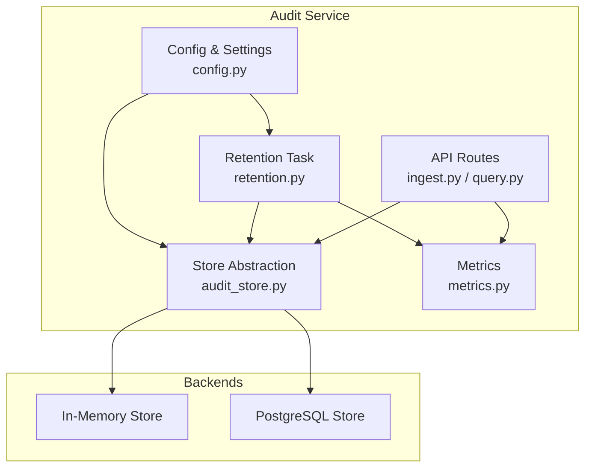
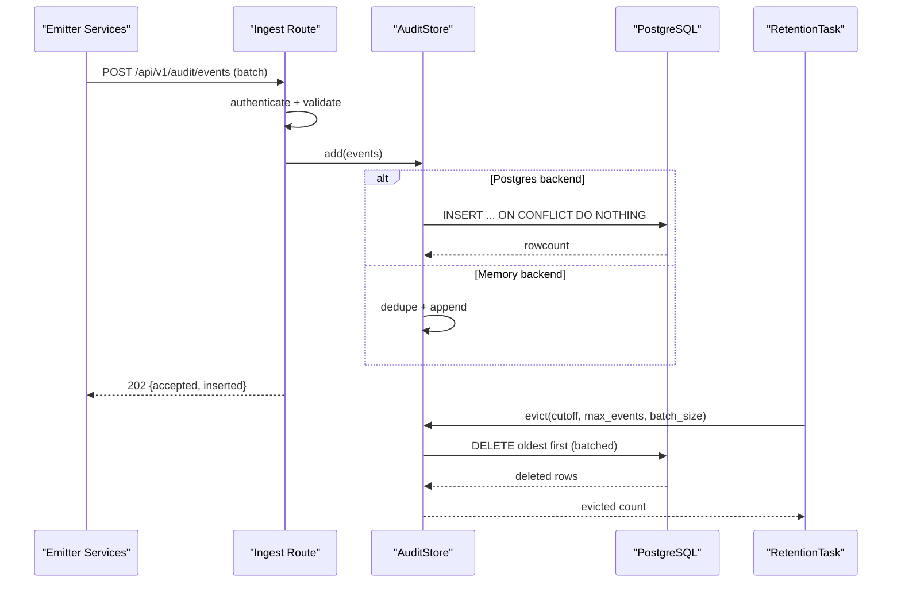
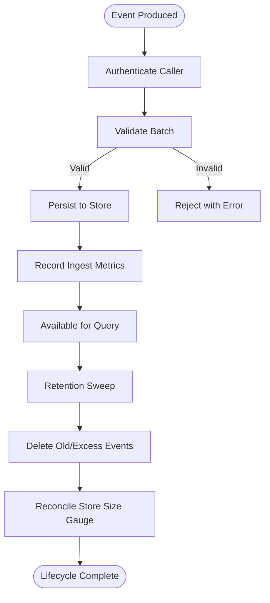
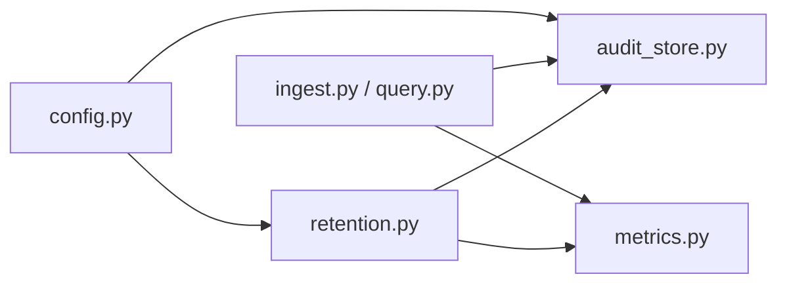

# Storage and Retention Management

<cite>
**Referenced Files in This Document**
- [audit-event.schema.json](file://shared/shared-contracts/schemas/audit-event.schema.json)
- [audit_store.py](file://products/audit-service/src/audit_service/services/audit_store.py)
- [retention.py](file://products/audit-service/src/audit_service/services/retention.py)
- [config.py](file://products/audit-service/src/audit_service/core/config.py)
- [audit.py](file://products/audit-service/src/audit_service/schemas/audit.py)
- [ingest.py](file://products/audit-service/src/audit_service/api/routes/ingest.py)
- [query.py](file://products/audit-service/src/audit_service/api/routes/query.py)
- [metrics.py](file://products/audit-service/src/audit_service/core/metrics.py)
- [test_retention.py](file://products/audit-service/tests/test_retention.py)
- [test_audit_store.py](file://products/audit-service/tests/test_audit_store.py)
</cite>

## Table of Contents
1. [Introduction](#introduction)
2. [Project Structure](#project-structure)
3. [Core Components](#core-components)
4. [Architecture Overview](#architecture-overview)
5. [Detailed Component Analysis](#detailed-component-analysis)
6. [Dependency Analysis](#dependency-analysis)
7. [Performance Considerations](#performance-considerations)
8. [Troubleshooting Guide](#troubleshooting-guide)
9. [Conclusion](#conclusion)
10. [Appendices](#appendices)

## Introduction
This document explains how audit events are stored, queried, retained, and summarized in the platform’s audit service. It covers the storage backends (in-memory for development/testing and PostgreSQL for production), the canonical audit event schema, indexing strategy, retention enforcement, configuration knobs, data lifecycle from ingestion to archival/deletion, and performance considerations for high-volume scenarios.

## Project Structure
The audit storage and retention logic is implemented in the audit-service product:
- Schemas define the canonical audit event envelope and query filters.
- The store abstraction provides two backends: an in-memory store and a PostgreSQL-backed store.
- A retention task runs periodically to enforce time-based and count-based limits.
- API routes expose ingestion and querying endpoints with authentication and metrics.
- Metrics provide observability for ingest, queries, evictions, and errors.

**Diagram sources**
- [ingest.py:33-82](file://products/audit-service/src/audit_service/api/routes/ingest.py#L33-L82)
- [query.py:35-94](file://products/audit-service/src/audit_service/api/routes/query.py#L35-L94)
- [audit_store.py:42-63](file://products/audit-service/src/audit_service/services/audit_store.py#L42-L63)
- [retention.py:27-75](file://products/audit-service/src/audit_service/services/retention.py#L27-L75)
- [config.py:60-110](file://products/audit-service/src/audit_service/core/config.py#L60-L110)
- [metrics.py:23-76](file://products/audit-service/src/audit_service/core/metrics.py#L23-L76)

**Section sources**
- [audit_store.py:1-63](file://products/audit-service/src/audit_service/services/audit_store.py#L1-L63)
- [retention.py:1-75](file://products/audit-service/src/audit_service/services/retention.py#L1-L75)
- [config.py:60-110](file://products/audit-service/src/audit_service/core/config.py#L60-L110)
- [ingest.py:1-82](file://products/audit-service/src/audit_service/api/routes/ingest.py#L1-L82)
- [query.py:1-94](file://products/audit-service/src/audit_service/api/routes/query.py#L1-L94)
- [metrics.py:1-147](file://products/audit-service/src/audit_service/core/metrics.py#L1-L147)

## Core Components
- Audit event schema: Canonical JSON Schema and Pydantic model ensure consistent fields, types, and enums across emitters and consumers.
- Store abstraction: Protocol defines add, query, summarize, count, evict, ready, close; implemented by InMemoryAuditStore and PostgresAuditStore.
- Retention task: Periodic background loop that computes cutoffs and enforces both time-based and hard-cap eviction via the store.
- Configuration: Environment-driven settings control backend selection, database URL, retention window, max events, eviction cadence/batch size, and batch limits.
- API routes: Ingest endpoint accepts batches with auth and validation; Query endpoint supports filtering and keyset pagination.
- Metrics: Prometheus counters/gauges track ingestion, rejections, queries, exports, evictions, store errors, and store size.

**Section sources**
- [audit-event.schema.json:1-94](file://shared/shared-contracts/schemas/audit-event.schema.json#L1-L94)
- [audit.py:14-83](file://products/audit-service/src/audit_service/schemas/audit.py#L14-L83)
- [audit_store.py:42-63](file://products/audit-service/src/audit_service/services/audit_store.py#L42-L63)
- [retention.py:27-75](file://products/audit-service/src/audit_service/services/retention.py#L27-L75)
- [config.py:60-110](file://products/audit-service/src/audit_service/core/config.py#L60-L110)
- [ingest.py:33-82](file://products/audit-service/src/audit_service/api/routes/ingest.py#L33-L82)
- [query.py:35-94](file://products/audit-service/src/audit_service/api/routes/query.py#L35-L94)
- [metrics.py:23-76](file://products/audit-service/src/audit_service/core/metrics.py#L23-L76)

## Architecture Overview
The system follows a clear separation between API, storage abstraction, and backends. Events flow from producers through authenticated ingestion into the selected store. Queries use envelope-only filters and keyset pagination. A retention task continuously prunes old or excess events.

**Diagram sources**
- [ingest.py:33-82](file://products/audit-service/src/audit_service/api/routes/ingest.py#L33-L82)
- [audit_store.py:224-261](file://products/audit-service/src/audit_service/services/audit_store.py#L224-L261)
- [audit_store.py:357-384](file://products/audit-service/src/audit_service/services/audit_store.py#L357-L384)
- [audit_store.py:498-533](file://products/audit-service/src/audit_service/services/audit_store.py#L498-L533)
- [retention.py:45-75](file://products/audit-service/src/audit_service/services/retention.py#L45-L75)

## Detailed Component Analysis

### Audit Event Schema and Data Model
- Canonical JSON Schema defines required envelope fields and enumerations for event_type and outcome, plus optional identity and session context and a per-event details object.
- Pydantic models mirror the schema for ingestion and query filters, enforcing strict typing and no extra fields.
- The store returns envelopes verbatim; no field rewriting occurs between ingest and query.

Key aspects:
- Required envelope fields include identifiers, timestamps, event type, emitting service, request correlation, and outcome.
- Optional identity fields include subject, username, actor, roles, and session_id.
- Per-event payload lives in a flexible details object.

**Section sources**
- [audit-event.schema.json:1-94](file://shared/shared-contracts/schemas/audit-event.schema.json#L1-L94)
- [audit.py:44-83](file://products/audit-service/src/audit_service/schemas/audit.py#L44-L83)

### Storage Backend Architecture
- Store protocol defines a uniform interface for add, query, summarize, count, evict, ready, and close.
- In-memory store: suitable for tests/dev; bounded list with deduplication by event_id; supports filtering, newest-first ordering, cursor pagination, and eviction.
- PostgreSQL store: single table with primary key on event_id; indexes optimize common filters and time-range scans; inserts use upsert semantics to avoid duplicates; queries build parameterized WHERE clauses and support keyset pagination; summaries run grouped SQL over envelope columns only.

Indexing strategy:
- Primary key on event_id ensures uniqueness and fast lookups.
- Index on occurred_at DESC optimizes time-window queries and newest-first ordering.
- Indexes on username, session_id, request_id, and event_type accelerate equality filters used by query and summary paths.

Data mapping:
- Envelope columns map directly to table columns; details stored as JSONB.
- Roles stored as text arrays; null-safe handling applied when reading rows.

Eviction implementation:
- Time-based deletion removes events older than the configured cutoff in batches.
- Hard-cap enforcement deletes oldest excess beyond max_events in batches.

**Section sources**
- [audit_store.py:42-63](file://products/audit-service/src/audit_service/services/audit_store.py#L42-L63)
- [audit_store.py:93-156](file://products/audit-service/src/audit_service/services/audit_store.py#L93-L156)
- [audit_store.py:224-249](file://products/audit-service/src/audit_service/services/audit_store.py#L224-L249)
- [audit_store.py:251-266](file://products/audit-service/src/audit_service/services/audit_store.py#L251-L266)
- [audit_store.py:324-384](file://products/audit-service/src/audit_service/services/audit_store.py#L324-L384)
- [audit_store.py:386-415](file://products/audit-service/src/audit_service/services/audit_store.py#L386-L415)
- [audit_store.py:498-533](file://products/audit-service/src/audit_service/services/audit_store.py#L498-L533)

### Retention Policy Enforcement
- RetentionTask runs a periodic loop sleeping for the configured interval.
- Each sweep computes cutoff as now minus retention_days and calls store.evict with max_events and batch_size.
- Eviction metrics and logs record the number of evicted events and parameters used.
- After eviction, the exact store size is reconciled via count and set as a gauge.

Behavior guarantees:
- Deletions are batched to avoid long-running transactions.
- Errors do not crash the retention loop; failures are recorded as metrics.

**Section sources**
- [retention.py:27-75](file://products/audit-service/src/audit_service/services/retention.py#L27-L75)
- [test_retention.py:32-93](file://products/audit-service/tests/test_retention.py#L32-L93)

### Ingestion Flow and Validation
- POST /api/v1/audit/events authenticates the caller using registered credentials or workload mappings.
- Request body is parsed and validated against the IngestRequest schema; malformed requests are rejected without partial storage.
- Batch size is enforced against the configured maximum.
- Events are added to the store; metrics record ingested counts per service and event type; store growth metric is updated.

Error handling:
- Authentication failures return 401.
- Malformed JSON or invalid payloads return 400 with descriptive detail.

**Section sources**
- [ingest.py:33-82](file://products/audit-service/src/audit_service/api/routes/ingest.py#L33-L82)
- [metrics.py:109-147](file://products/audit-service/src/audit_service/core/metrics.py#L109-L147)

### Query Flow and Pagination
- GET /api/v1/audit/events supports filters on username, session_id, request_id, event_type, service, outcome, since, until.
- Keyset pagination uses a cursor encoding occurred_at and event_id; invalid cursors are rejected.
- Results are returned newest-first with next_cursor when more pages exist.
- Summary aggregation uses envelope-only filters and shared logic to ensure parity between backends.

Authorization note:
- User-level authorization is enforced upstream by the platform gateway before proxying to this route; the route additionally requires a registered service caller.

**Section sources**
- [query.py:35-94](file://products/audit-service/src/audit_service/api/routes/query.py#L35-L94)
- [audit_store.py:69-87](file://products/audit-service/src/audit_service/services/audit_store.py#L69-L87)
- [audit_store.py:386-415](file://products/audit-service/src/audit_service/services/audit_store.py#L386-L415)

### Configuration Options
Environment variables control runtime behavior:
- AUDIT_STORE_BACKEND: selects memory or postgres backend.
- AUDIT_DB_URL: required when backend is postgres.
- AUDIT_RETENTION_DAYS: retention window in days.
- AUDIT_MAX_EVENTS: hard cap on stored events.
- AUDIT_EVICTION_INTERVAL_SECONDS: period between eviction sweeps.
- AUDIT_EVICTION_BATCH_SIZE: batch size for eviction deletions.
- AUDIT_MAX_BATCH: maximum events per ingest batch.
- AUDIT_EXPORT_MAX_ROWS: maximum rows for export operations.
- AUDIT_INGEST_CLIENTS and AUDIT_WORKLOAD_*: ingest/auth configuration.

Settings are loaded once and cached for the process lifetime.

**Section sources**
- [config.py:60-110](file://products/audit-service/src/audit_service/core/config.py#L60-L110)

### Data Lifecycle Management
- Ingestion: authenticated, validated, batched, then persisted with deduplication.
- Querying: filtered by envelope fields with keyset pagination; summaries aggregate envelope columns only.
- Retention: periodic sweeps delete events older than the retention window and enforce the hard cap in batches.
- Observability: metrics capture ingestion, rejections, queries, exports, evictions, store errors, and current store size.

[No sources needed since this diagram shows conceptual workflow, not actual code structure]

## Dependency Analysis
- API routes depend on config for settings and on the store instance injected via application state.
- Store implementations depend on psycopg for PostgreSQL connectivity and on shared schemas for event and query models.
- Retention depends on store and config; it also updates metrics and logs.
- Metrics module exposes counters/gauges consumed by routes and retention.

**Diagram sources**
- [config.py:60-110](file://products/audit-service/src/audit_service/core/config.py#L60-L110)
- [audit_store.py:556-564](file://products/audit-service/src/audit_service/services/audit_store.py#L556-L564)
- [retention.py:27-75](file://products/audit-service/src/audit_service/services/retention.py#L27-L75)
- [ingest.py:33-82](file://products/audit-service/src/audit_service/api/routes/ingest.py#L33-L82)
- [query.py:35-94](file://products/audit-service/src/audit_service/api/routes/query.py#L35-L94)
- [metrics.py:23-76](file://products/audit-service/src/audit_service/core/metrics.py#L23-L76)

**Section sources**
- [audit_store.py:556-564](file://products/audit-service/src/audit_service/services/audit_store.py#L556-L564)
- [retention.py:27-75](file://products/audit-service/src/audit_service/services/retention.py#L27-L75)
- [ingest.py:33-82](file://products/audit-service/src/audit_service/api/routes/ingest.py#L33-L82)
- [query.py:35-94](file://products/audit-service/src/audit_service/api/routes/query.py#L35-L94)
- [metrics.py:23-76](file://products/audit-service/src/audit_service/core/metrics.py#L23-L76)

## Performance Considerations
- Index usage: Ensure indexes on occurred_at, username, session_id, request_id, and event_type are present to support efficient filtering and time-range scans.
- Batch sizes: Tune AUDIT_EVICTION_BATCH_SIZE to balance throughput and lock contention during cleanup.
- Query limits: Use reasonable limit values; the query path fetches one extra row to detect continuation for pagination.
- Summaries: Grouped SQL operates on envelope columns only; avoid ad-hoc scanning of details to keep aggregates fast.
- Connection management: PostgreSQL store opens connections per operation; for very high concurrency, consider connection pooling at the driver level if needed.
- Deduplication: Inserts use upsert semantics to prevent duplicate event_ids; this avoids index bloat and ensures idempotency.

[No sources needed since this section provides general guidance]

## Troubleshooting Guide
Common issues and diagnostics:
- Invalid cursor: Decoding errors raise a store error; clients should regenerate cursors from server responses.
- Authentication failures: Ingest and query routes return 401 when caller credentials are missing or invalid.
- Malformed payloads: JSON parse or schema validation failures return 400 with details.
- Retention errors: Failures in eviction are caught, recorded as metrics, and logged without crashing the loop.
- Store readiness: PostgreSQL readiness probe executes a simple query; failures indicate connectivity or permission issues.

Operational checks:
- Inspect metrics for audit_events_ingested_total, audit_ingest_rejected_total, audit_query_total, audit_evicted_total, audit_store_errors_total, and audit_store_events.
- Verify environment variables for backend selection, DB URL, retention window, and eviction parameters.
- Confirm indexes exist on the audit_events table for optimal query performance.

**Section sources**
- [audit_store.py:69-87](file://products/audit-service/src/audit_service/services/audit_store.py#L69-L87)
- [audit_store.py:535-543](file://products/audit-service/src/audit_service/services/audit_store.py#L535-L543)
- [retention.py:45-75](file://products/audit-service/src/audit_service/services/retention.py#L45-L75)
- [ingest.py:33-82](file://products/audit-service/src/audit_service/api/routes/ingest.py#L33-L82)
- [query.py:35-94](file://products/audit-service/src/audit_service/api/routes/query.py#L35-L94)
- [metrics.py:23-76](file://products/audit-service/src/audit_service/core/metrics.py#L23-L76)

## Conclusion
The audit service provides a robust, configurable, and observable pipeline for storing and retaining high-volume audit events. The store abstraction cleanly separates in-memory and PostgreSQL backends, while retention enforces both time-based and count-based policies in a safe, batched manner. The canonical schema and envelope-only filtering ensure consistency and performance. Operators can tune retention windows, eviction cadence, and batch sizes to match their compliance and capacity requirements.

[No sources needed since this section summarizes without analyzing specific files]

## Appendices

### Appendix A: PostgreSQL Schema and Indexes
- Table: audit_events with columns for envelope fields and JSONB details.
- Primary key: event_id.
- Indexes: occurred_at DESC, username, session_id, request_id, event_type.

**Section sources**
- [audit_store.py:224-249](file://products/audit-service/src/audit_service/services/audit_store.py#L224-L249)

### Appendix B: Query Filters and Window Echo
- Supported filters: username, session_id, request_id, event_type, service, outcome, since, until.
- Outcome is additive and applies consistently across query and summary paths.
- Summary responses echo the active filter window for clarity.

**Section sources**
- [audit.py:67-83](file://products/audit-service/src/audit_service/schemas/audit.py#L67-L83)
- [audit_store.py:288-321](file://products/audit-service/src/audit_service/services/audit_store.py#L288-L321)

### Appendix C: Test Coverage Highlights
- Retention: Tests verify pruning by retention window, enforcement of max_events, and lifecycle start/stop.
- Store: Tests cover cursor codec, in-memory add/query/count/evict, filtering, pagination, and PostgreSQL adapter behavior including JSONB adaptation and grouped SQL semantics.

**Section sources**
- [test_retention.py:32-93](file://products/audit-service/tests/test_retention.py#L32-L93)
- [test_audit_store.py:45-229](file://products/audit-service/tests/test_audit_store.py#L45-L229)
- [test_audit_store.py:408-576](file://products/audit-service/tests/test_audit_store.py#L408-L576)
- [test_audit_store.py:578-743](file://products/audit-service/tests/test_audit_store.py#L578-L743)