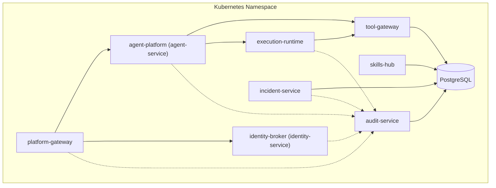
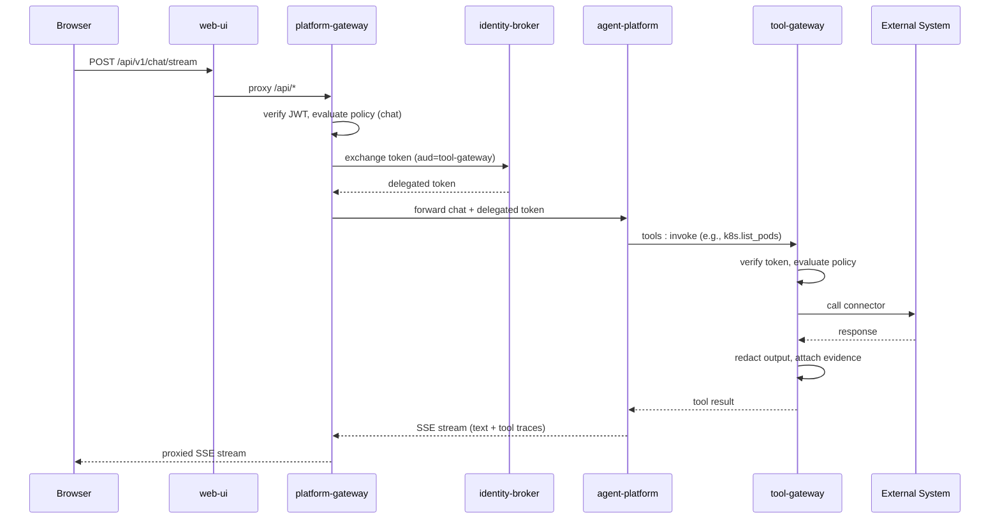
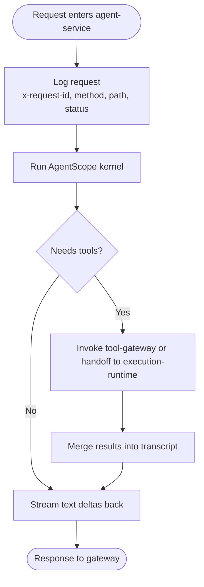
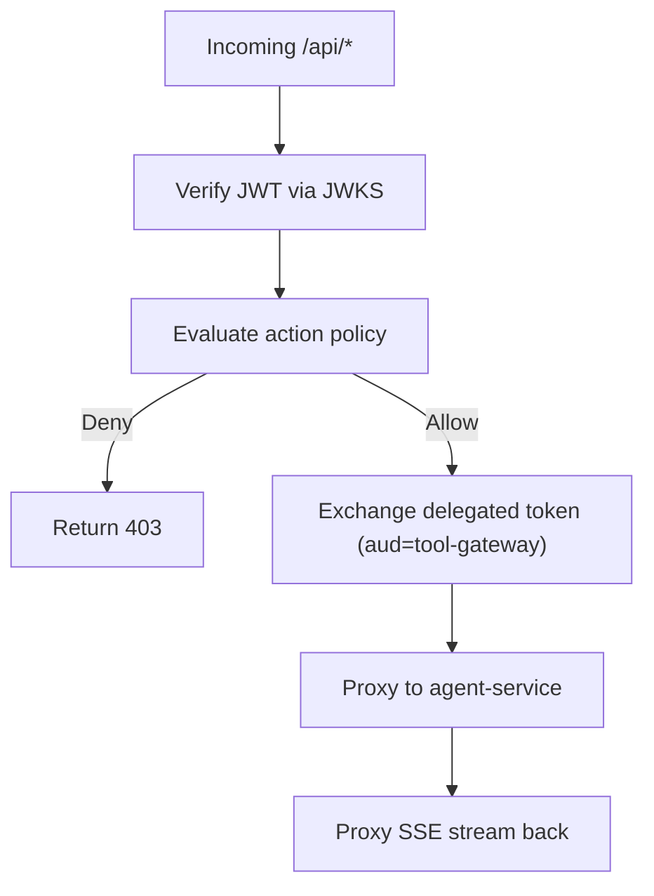
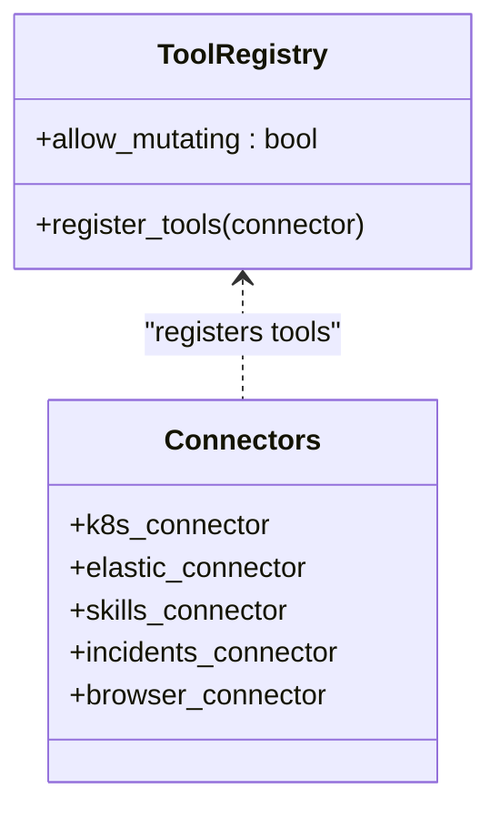
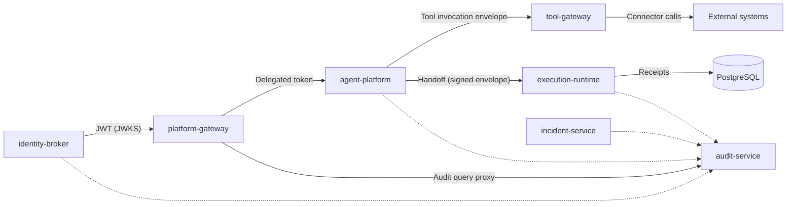

# Core Services

<cite>
**Referenced Files in This Document**
- [app.py](file://products/agent-platform/src/agent_service/app.py)
- [execution_worker_client.py](file://products/agent-platform/src/agent_service/services/execution_worker_client.py)
- [app.py](file://products/platform-gateway/src/platform_gateway/app.py)
- [policy_engine.py](file://products/platform-gateway/src/platform_gateway/services/policy_engine.py)
- [app.py](file://products/tool-gateway/src/tool_gateway/app.py)
- [request_context.py](file://products/tool-gateway/src/tool_gateway/core/request_context.py)
- [app.py](file://products/identity-broker/src/identity_service/app.py)
- [app.py](file://products/audit-service/src/audit_service/app.py)
- [app.py](file://products/incident-service/src/incident_service/app.py)
- [app.py](file://products/skills-hub/src/skills_hub/app.py)
- [app.py](file://products/execution-runtime/src/execution_runtime/app.py)
- [README.md](file://shared/shared-contracts/README.md)
- [tool-invocation.schema.json](file://shared/shared-contracts/schemas/tool-invocation.schema.json)
- [identity-token.schema.json](file://shared/shared-contracts/schemas/identity-token.schema.json)
- [architecture-overview.md](file://docs/guides/architecture-overview.md)
</cite>

## Table of Contents
1. Introduction
2. Project Structure
3. Core Components
4. Architecture Overview
5. Detailed Component Analysis
6. Dependency Analysis
7. Performance Considerations
8. Troubleshooting Guide
9. Conclusion

## Introduction
This document explains the core services that make up the Luban AIOPS platform and how they collaborate to deliver secure, policy-enforced, auditable agentic operations. It covers:
- agent-platform for orchestration and session management
- platform-gateway as the portal-facing API edge with policy enforcement
- tool-gateway for normalized tool and connector access
- identity-broker for SSO and identity federation
- audit-service for durable event logging
- incident-service for alert intake and triage
- skills-hub for Git-based skill ingestion
- execution-runtime for isolated action execution

It also documents shared contracts, request flows from user interaction to tool execution, security boundaries, service discovery patterns, error handling strategies, and monitoring approaches used across all services.

## Project Structure
The platform is a set of Python FastAPI microservices deployed into a single Kubernetes namespace. Each service exposes health, metrics, and telemetry endpoints and participates in a common observability and correlation model. The architecture overview describes the full topology and request flow; this section highlights how each service’s application entrypoint wires lifecycle, middleware, and dependencies.

**Diagram sources**
- [architecture-overview.md:28-82](file://docs/guides/architecture-overview.md#L28-L82)

**Section sources**
- [app.py:49-76](file://products/agent-platform/src/agent_service/app.py#L49-L76)
- [app.py:16-41](file://products/platform-gateway/src/platform_gateway/app.py#L16-L41)
- [app.py:100-142](file://products/tool-gateway/src/tool_gateway/app.py#L100-L142)
- [app.py:16-45](file://products/identity-broker/src/identity_service/app.py#L16-L45)
- [app.py:43-70](file://products/audit-service/src/audit_service/app.py#L43-L70)
- [app.py:42-69](file://products/incident-service/src/incident_service/app.py#L42-L69)
- [app.py:59-86](file://products/skills-hub/src/skills_hub/app.py#L59-L86)
- [app.py:40-67](file://products/execution-runtime/src/execution_runtime/app.py#L40-L67)

## Core Components
- agent-platform (agent-service): Orchestrates LLM sessions, manages state, emits tool traces, and coordinates tool calls via tool-gateway or approved execution handoff to execution-runtime.
- platform-gateway: Portal-facing edge that verifies JWTs, enforces action policies, proxies chat/session traffic, exchanges delegated tokens, and proxies audit queries.
- tool-gateway: Normalizes tool invocation and result envelopes, dispatches to connectors (Kubernetes, Elastic, skills-hub, incidents, browser), enforces tool-level policy, and redacts sensitive output.
- identity-broker (identity-service): Issues platform JWTs, supports token exchange for delegation, and publishes JWKS for local verification by gateways.
- audit-service: Durable, retention-bounded audit store with authenticated ingest and query APIs.
- incident-service: Ingests alerts/manual reports, normalizes and deduplicates, orchestrates agent triage, and persists results.
- skills-hub: Federated skill ingestion from configured sources, ranked retrieval, and pruning of stale entries.
- execution-runtime: Isolated worker that executes approved mutating actions, re-verifies signed envelopes, writes receipts, and returns results.

**Section sources**
- [architecture-overview.md:8-24](file://docs/guides/architecture-overview.md#L8-L24)
- [README.md:52-116](file://shared/shared-contracts/README.md#L52-L116)

## Architecture Overview
The platform follows a progressive trust model: identity → policy → audit. Requests traverse a linear chain from the browser through web-ui to platform-gateway, then to agent-platform, optionally to tool-gateway and external systems, with optional isolated execution via execution-runtime for high-risk mutations. All services emit structured logs with x-request-id correlation, expose Prometheus metrics, and support opt-in OpenTelemetry push.

**Diagram sources**
- [architecture-overview.md:84-145](file://docs/guides/architecture-overview.md#L84-L145)

**Section sources**
- [architecture-overview.md:195-240](file://docs/guides/architecture-overview.md#L195-L240)
- [README.md:68-116](file://shared/shared-contracts/README.md#L68-L116)

## Detailed Component Analysis

### agent-platform (agent-service)
Role: Orchestration and session management. Runs the AgentScope runtime kernel, owns session state, emits tool traces, and decides whether to answer directly or invoke tools. For approved mutating actions, it hands off signed execution envelopes to execution-runtime.

Key behaviors observed in code:
- Application lifespan starts background model discovery when enabled.
- HTTP middleware records per-request duration and status with x-request-id correlation.
- Includes v2 routes and sets up metrics and telemetry.

**Diagram sources**
- [app.py:19-76](file://products/agent-platform/src/agent_service/app.py#L19-L76)
- [execution_worker_client.py:54-145](file://products/agent-platform/src/agent_service/services/execution_worker_client.py#L54-L145)

**Section sources**
- [app.py:19-76](file://products/agent-platform/src/agent_service/app.py#L19-L76)
- [execution_worker_client.py:1-145](file://products/agent-platform/src/agent_service/services/execution_worker_client.py#L1-L145)

### platform-gateway
Role: Portal-facing API edge with policy enforcement. Verifies JWTs, evaluates action policies, exchanges delegated tokens, proxies chat/session traffic, and proxies audit queries.

Key behaviors observed in code:
- HTTP middleware logs requests with x-request-id correlation.
- Includes router and sets up metrics and telemetry.
- Policy engine defines protected actions and precedence rules (deny > require_approval > allow).

**Diagram sources**
- [app.py:16-41](file://products/platform-gateway/src/platform_gateway/app.py#L16-L41)
- [policy_engine.py:1-127](file://products/platform-gateway/src/platform_gateway/services/policy_engine.py#L1-L127)

**Section sources**
- [app.py:16-41](file://products/platform-gateway/src/platform_gateway/app.py#L16-L41)
- [policy_engine.py:1-200](file://products/platform-gateway/src/platform_gateway/services/policy_engine.py#L1-L200)

### tool-gateway
Role: Normalized tool and connector access. Registers connectors based on configuration, enforces tool-level policy, validates identities, and returns standardized tool results with evidence.

Key behaviors observed in code:
- Builds a ToolRegistry gated by mutating-tools flag.
- Conditionally registers connectors: Kubernetes, Elastic, Skills, Incidents, Browser.
- Lifespan starts/stops browser connector if enabled.
- Request context resolves x-request-id and user identity consistently.

**Diagram sources**
- [app.py:19-97](file://products/tool-gateway/src/tool_gateway/app.py#L19-L97)
- [request_context.py:8-35](file://products/tool-gateway/src/tool_gateway/core/request_context.py#L8-L35)

**Section sources**
- [app.py:19-142](file://products/tool-gateway/src/tool_gateway/app.py#L19-L142)
- [request_context.py:1-35](file://products/tool-gateway/src/tool_gateway/core/request_context.py#L1-L35)

### identity-broker (identity-service)
Role: SSO and identity federation. Issues platform JWTs, supports token exchange for delegation, and publishes JWKS for local verification by gateways.

Key behaviors observed in code:
- HTTP middleware logs requests with x-request-id correlation.
- Includes router and sets up metrics and telemetry.

**Section sources**
- [app.py:16-45](file://products/identity-broker/src/identity_service/app.py#L16-L45)
- [README.md:68-78](file://shared/shared-contracts/README.md#L68-L78)

### audit-service
Role: Durable event logging. Provides authenticated ingest and query APIs with retention policies.

Key behaviors observed in code:
- Lifespan initializes audit store and retention task, logs readiness with backend and retention details.
- HTTP middleware logs requests with x-request-id correlation.

**Section sources**
- [app.py:20-70](file://products/audit-service/src/audit_service/app.py#L20-L70)

### incident-service
Role: Alert intake and triage. Normalizes alerts/manual reports, deduplicates, stores incidents, and orchestrates agent triage.

Key behaviors observed in code:
- Lifespan builds connectors and incident store, logs readiness with backend and connector names.
- HTTP middleware logs requests with x-request-id correlation.

**Section sources**
- [app.py:20-69](file://products/incident-service/src/incident_service/app.py#L20-L69)

### skills-hub
Role: Git-based skill ingestion. Syncs federated skill sources, prunes stale entries, and serves ranked retrieval.

Key behaviors observed in code:
- Lifespan initializes skill store, prunes unconfigured sources, starts sync manager, logs readiness with backend and sources.
- HTTP middleware logs requests with x-request-id correlation.

**Section sources**
- [app.py:20-86](file://products/skills-hub/src/skills_hub/app.py#L20-L86)

### execution-runtime
Role: Isolated action execution. Executes approved mutating calls, re-verifies signed envelopes, writes receipts, and returns results.

Key behaviors observed in code:
- Lifespan initializes execution record store and single-flight registry, logs readiness with backend and configuration flags.
- HTTP middleware logs requests with x-request-id correlation.

**Section sources**
- [app.py:19-67](file://products/execution-runtime/src/execution_runtime/app.py#L19-L67)

## Dependency Analysis
Shared contracts define cross-service interfaces:
- Identity tokens: JWT claim set issued by identity-broker and verified locally by gateways using JWKS.
- Tool invocation envelope: standardized request/response between agent-platform and tool-gateway.
- Observability conventions: metrics naming, OTel switch semantics, and x-request-id bridging.

**Diagram sources**
- [README.md:68-116](file://shared/shared-contracts/README.md#L68-L116)
- [architecture-overview.md:28-82](file://docs/guides/architecture-overview.md#L28-L82)

**Section sources**
- [README.md:1-127](file://shared/shared-contracts/README.md#L1-L127)
- [tool-invocation.schema.json:1-35](file://shared/shared-contracts/schemas/tool-invocation.schema.json#L1-L35)
- [identity-token.schema.json:1-56](file://shared/shared-contracts/schemas/identity-token.schema.json#L1-L56)

## Performance Considerations
- Token caching: platform-gateway caches delegated tokens per-user to avoid repeated exchanges.
- Eager connections: tool-gateway eagerly connects to browser sidecar when enabled to reduce first-use latency.
- Retention and pruning: audit-service and skills-hub run background tasks to manage storage and staleness.
- Single-flight registry: execution-runtime deduplicates concurrent identical executions to reduce load.

[No sources needed since this section provides general guidance]

## Troubleshooting Guide
Common issues and where to look:
- Missing or misconfigured worker URL/handoff token in agent-platform triggers a fail-closed handoff with reason worker_unavailable.
- Transport failures or timeouts during handoff raise structured exceptions; check agent-platform logs and execution-runtime availability.
- Policy denials at platform-gateway or tool-gateway indicate missing role/action grants; inspect the live permission matrix and loaded bundle fingerprint.
- Audit ingest/query failures: verify audit-service readiness and retention settings.
- Incident normalization errors: confirm connector configuration and webhook secrets.

**Section sources**
- [execution_worker_client.py:54-145](file://products/agent-platform/src/agent_service/services/execution_worker_client.py#L54-L145)
- [policy_engine.py:1-127](file://products/platform-gateway/src/platform_gateway/services/policy_engine.py#L1-L127)
- [app.py:20-70](file://products/audit-service/src/audit_service/app.py#L20-L70)
- [app.py:20-69](file://products/incident-service/src/incident_service/app.py#L20-L69)

## Conclusion
The Luban AIOPS platform composes eight core services around shared contracts to provide secure, policy-enforced, auditable agentic operations. Requests flow from the portal through platform-gateway to agent-platform, which delegates tool execution to tool-gateway or isolated execution-runtime for high-risk actions. Identity is established via identity-broker, policy is enforced at both edges, and every action is recorded in audit-service. Consistent observability, correlation, and retention ensure operational visibility and compliance.

[No sources needed since this section summarizes without analyzing specific files]