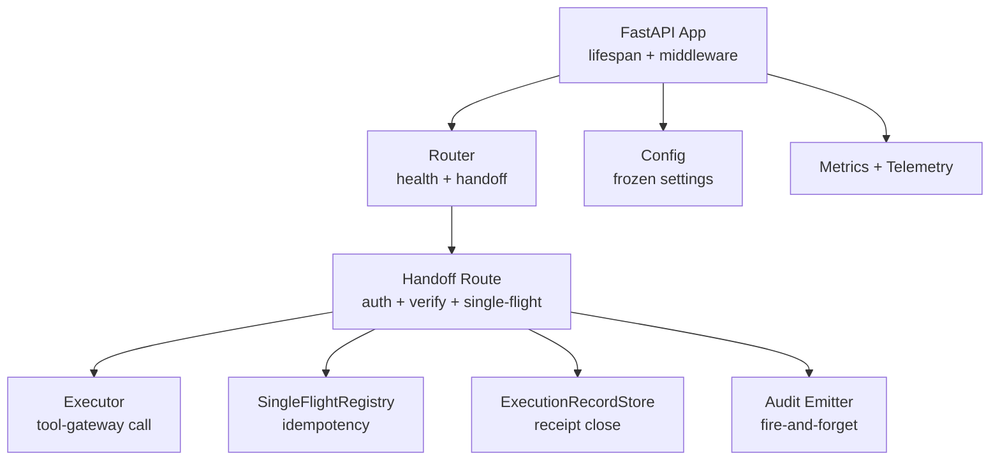
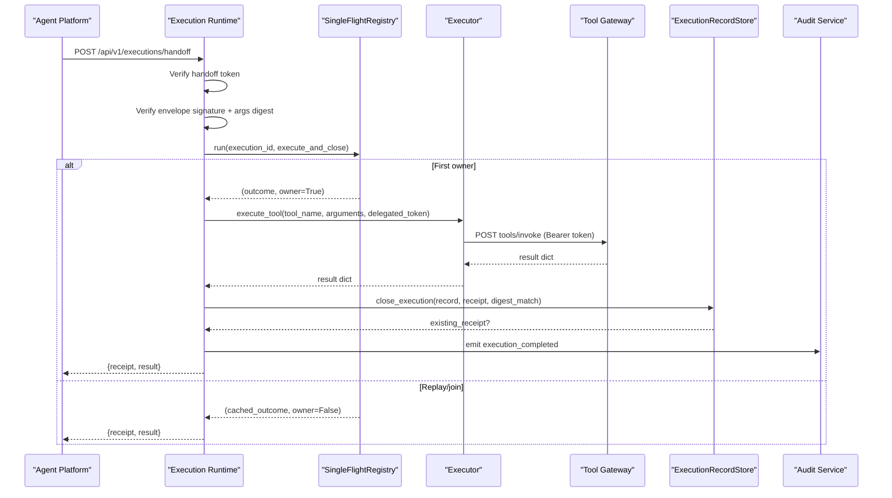
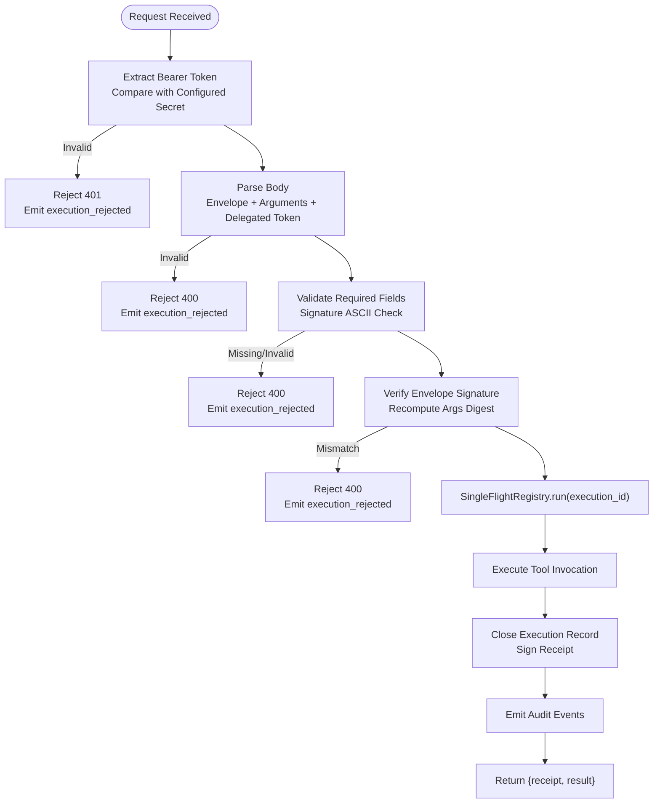
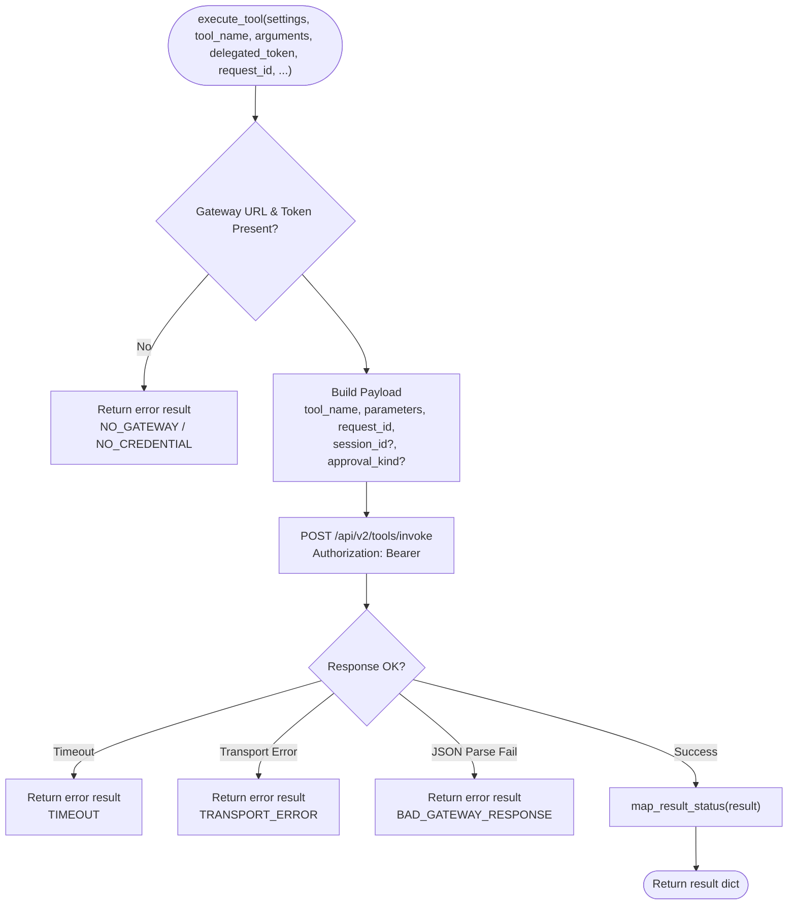
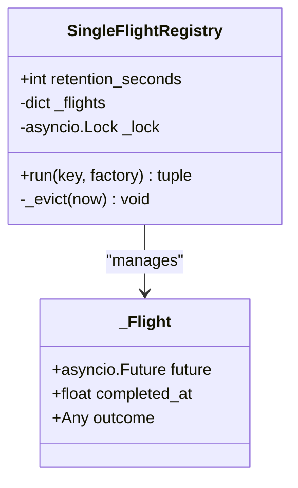
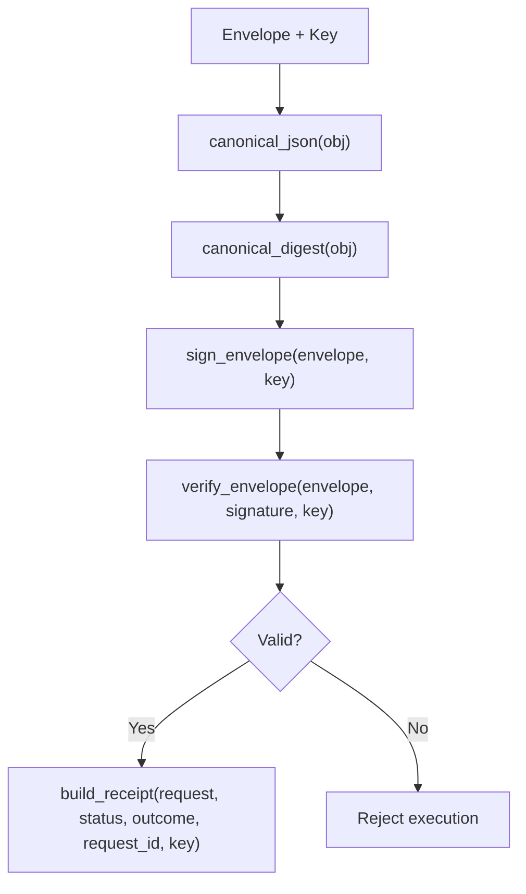
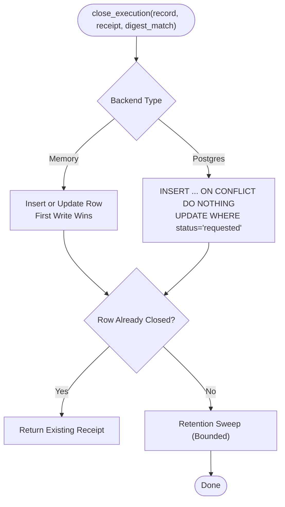
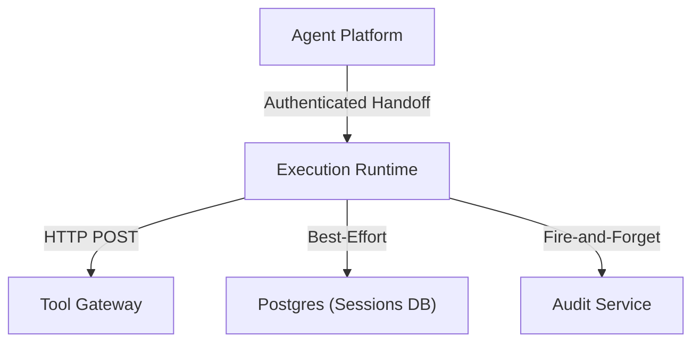

# Execution Runtime

<cite>
**Referenced Files in This Document**
- [app.py](file://products/execution-runtime/src/execution_runtime/app.py)
- [main.py](file://products/execution-runtime/src/execution_runtime/main.py)
- [router.py](file://products/execution-runtime/src/execution_runtime/api/router.py)
- [handoff.py](file://products/execution-runtime/src/execution_runtime/api/routes/handoff.py)
- [executor.py](file://products/execution-runtime/src/execution_runtime/services/executor.py)
- [single_flight.py](file://products/execution-runtime/src/execution_runtime/services/single_flight.py)
- [execution_signing.py](file://products/execution-runtime/src/execution_runtime/services/execution_signing.py)
- [execution_records.py](file://products/execution-runtime/src/execution_runtime/services/execution_records.py)
- [audit_emitter.py](file://products/execution-runtime/src/execution_runtime/services/audit_emitter.py)
- [config.py](file://products/execution-runtime/src/execution_runtime/core/config.py)
- [SPEC-038-isolated-execution-worker/spec.md](file://docs/specs/SPEC-038-isolated-execution-worker/spec.md)
- [SPEC-037-signed-execution-requests/spec.md](file://docs/specs/SPEC-037-signed-execution-requests/spec.md)
</cite>

## Table of Contents
1. [Introduction](#introduction)
2. [Project Structure](#project-structure)
3. [Core Components](#core-components)
4. [Architecture Overview](#architecture-overview)
5. [Detailed Component Analysis](#detailed-component-analysis)
6. [Dependency Analysis](#dependency-analysis)
7. [Performance Considerations](#performance-considerations)
8. [Troubleshooting Guide](#troubleshooting-guide)
9. [Conclusion](#conclusion)
10. [Appendices](#appendices)

## Introduction
The Execution Runtime is an isolated, single-replica worker that executes approved mutating actions safely and audibly. It receives signed execution envelopes from the agent platform over a secure internal handoff endpoint, verifies signatures and argument digests, runs exactly one tool invocation per request through the tool gateway using the confirmer’s delegated token, records signed receipts, and emits audit events. Single-flight deduplication guarantees that each execution_id is executed at most once, preventing accidental re-execution of mutating operations. The service is designed to fail closed when configuration or secrets are missing, ensuring no unauthorized mutations can occur.

Key design goals:
- Isolation: separate process boundary for mutating workloads.
- Security: authenticated handoff, envelope signature verification, argument digest checks.
- Idempotency: single-flight registry keyed by execution_id.
- Auditability: durable receipt storage and fire-and-forget audit emission.
- Resilience: timeouts, transport error handling, best-effort durability for records.

**Section sources**
- [SPEC-038-isolated-execution-worker/spec.md:11-25](file://docs/specs/SPEC-038-isolated-execution-worker/spec.md#L11-L25)
- [SPEC-037-signed-execution-requests/spec.md:11-22](file://docs/specs/SPEC-037-signed-execution-requests/spec.md#L11-L22)

## Project Structure
The Execution Runtime product is organized into FastAPI application layers, services, and core modules:
- Application entrypoints: app factory, lifespan, middleware, router wiring.
- API routes: health and handoff endpoints.
- Services: executor (tool-gateway call), single-flight registry, signing utilities, execution record store, audit emitter.
- Core: frozen settings loaded from environment, metrics, observability, telemetry, runtime settings.

**Diagram sources**
- [app.py:19-67](file://products/execution-runtime/src/execution_runtime/app.py#L19-L67)
- [router.py:1-8](file://products/execution-runtime/src/execution_runtime/api/router.py#L1-L8)
- [handoff.py:66-169](file://products/execution-runtime/src/execution_runtime/api/routes/handoff.py#L66-L169)
- [executor.py:23-152](file://products/execution-runtime/src/execution_runtime/services/executor.py#L23-L152)
- [single_flight.py:34-107](file://products/execution-runtime/src/execution_runtime/services/single_flight.py#L34-L107)
- [execution_records.py:310-333](file://products/execution-runtime/src/execution_runtime/services/execution_records.py#L310-L333)
- [audit_emitter.py:30-99](file://products/execution-runtime/src/execution_runtime/services/audit_emitter.py#L30-L99)
- [config.py:20-84](file://products/execution-runtime/src/execution_runtime/core/config.py#L20-L84)

**Section sources**
- [app.py:19-67](file://products/execution-runtime/src/execution_runtime/app.py#L19-L67)
- [main.py:6-9](file://products/execution-runtime/src/execution_runtime/main.py#L6-L9)
- [router.py:1-8](file://products/execution-runtime/src/execution_runtime/api/router.py#L1-L8)

## Core Components
- Handoff route: authenticates caller via static bearer token, validates envelope shape, verifies HMAC signature and argument digest, enforces single-flight idempotency, then executes and closes records.
- Executor: performs a single HTTP POST to the tool gateway with the forwarded delegated token; maps timeouts and transport errors to structured results; never logs or persists tokens.
- Single-flight registry: in-process async registry joining concurrent duplicates on one future; bounded completion cache with retention and cap; fails closed on misconfiguration.
- Signing utilities: canonical JSON, SHA-256 digest, HMAC-SHA256 signing and constant-time verification; builds signed receipts with outcome digests.
- Execution record store: memory and Postgres backends; first-write-wins closing; late arrivals return existing receipt; retention sweep; best-effort durability.
- Audit emitter: fire-and-forget delivery to audit service; non-blocking thread; failures logged and counted without impacting execution path.
- Configuration: frozen settings with startup validation; supports memory/postgres backend selection; requires positive timeout and valid backend URL when postgres selected.

**Section sources**
- [handoff.py:66-169](file://products/execution-runtime/src/execution_runtime/api/routes/handoff.py#L66-L169)
- [executor.py:23-152](file://products/execution-runtime/src/execution_runtime/services/executor.py#L23-L152)
- [single_flight.py:34-107](file://products/execution-runtime/src/execution_runtime/services/single_flight.py#L34-L107)
- [execution_signing.py:40-93](file://products/execution-runtime/src/execution_runtime/services/execution_signing.py#L40-L93)
- [execution_records.py:78-119](file://products/execution-runtime/src/execution_runtime/services/execution_records.py#L78-L119)
- [execution_records.py:196-303](file://products/execution-runtime/src/execution_runtime/services/execution_records.py#L196-L303)
- [audit_emitter.py:30-99](file://products/execution-runtime/src/execution_runtime/services/audit_emitter.py#L30-L99)
- [config.py:20-84](file://products/execution-runtime/src/execution_runtime/core/config.py#L20-L84)

## Architecture Overview
The end-to-end flow starts with the agent platform sending a signed execution envelope plus parked arguments and a delegated token to the worker’s handoff endpoint. The worker authenticates the caller, verifies the envelope signature and argument digest, ensures single-flight semantics, invokes the tool gateway, signs and stores the receipt, emits audit events, and returns the result and receipt to the caller.

**Diagram sources**
- [handoff.py:66-169](file://products/execution-runtime/src/execution_runtime/api/routes/handoff.py#L66-L169)
- [executor.py:23-152](file://products/execution-runtime/src/execution_runtime/services/executor.py#L23-L152)
- [single_flight.py:42-84](file://products/execution-runtime/src/execution_runtime/services/single_flight.py#L42-L84)
- [execution_records.py:239-293](file://products/execution-runtime/src/execution_runtime/services/execution_records.py#L239-L293)
- [audit_emitter.py:68-99](file://products/execution-runtime/src/execution_runtime/services/audit_emitter.py#L68-L99)

## Detailed Component Analysis

### Handoff Endpoint: Authentication, Verification, and Single-Flight Control
The handoff endpoint is the only execution surface. It:
- Extracts and compares the bearer token against the configured handoff secret using constant-time comparison.
- Parses the body into envelope, arguments, and optional delegated token; rejects malformed payloads.
- Validates required envelope fields and enforces ASCII-only signatures before verification.
- Verifies the envelope signature using HMAC-SHA256 and recomputes the argument digest to ensure integrity.
- Enforces single-flight idempotency keyed by execution_id; concurrent duplicates await the same future.
- Executes the action and closes the execution record; emits audit events; returns receipt and result.

**Diagram sources**
- [handoff.py:66-169](file://products/execution-runtime/src/execution_runtime/api/routes/handoff.py#L66-L169)
- [execution_signing.py:64-67](file://products/execution-runtime/src/execution_runtime/services/execution_signing.py#L64-L67)
- [single_flight.py:42-84](file://products/execution-runtime/src/execution_runtime/services/single_flight.py#L42-L84)

**Section sources**
- [handoff.py:66-169](file://products/execution-runtime/src/execution_runtime/api/routes/handoff.py#L66-L169)

### Executor: Safe Tool Invocation Through the Tool Gateway
The executor performs a single HTTP POST to the tool gateway with the forwarded delegated token as bearer. It:
- Validates configuration presence (gateway URL and delegated token).
- Builds payload including tool name, parameters, request correlation, optional session_id, and approval_kind provenance.
- Uses httpx with a configured timeout; maps TimeoutException and HTTPError to structured error results.
- Parses response JSON; on failure, logs warning and returns structured error.
- Maps gateway result status to receipt vocabulary: success → succeeded, TIMEOUT → timeout, other → failed.

**Diagram sources**
- [executor.py:23-152](file://products/execution-runtime/src/execution_runtime/services/executor.py#L23-L152)

**Section sources**
- [executor.py:23-152](file://products/execution-runtime/src/execution_runtime/services/executor.py#L23-L152)

### Single-Flight Registry: Idempotency and Deduplication
The single-flight registry ensures each execution_id runs at most once:
- Creates a future for the first caller; subsequent callers await the same future.
- On completion, caches outcome and timestamp; evicts completed entries after retention window.
- Caps completed entries to prevent unbounded growth under replay storms.
- Drops failed flights so poison outcomes do not pin keys indefinitely.

**Diagram sources**
- [single_flight.py:27-107](file://products/execution-runtime/src/execution_runtime/services/single_flight.py#L27-L107)

**Section sources**
- [single_flight.py:34-107](file://products/execution-runtime/src/execution_runtime/services/single_flight.py#L34-L107)

### Signing Utilities: Canonicalization, Digests, and Receipts
Signing utilities implement the shared contract for execution requests and receipts:
- Canonical JSON: sorted keys, compact separators.
- Canonical digest: SHA-256 hex of canonical JSON.
- Sign envelope: HMAC-SHA256 over canonical envelope excluding signature field.
- Verify envelope: constant-time comparison of expected vs provided signature.
- Build receipt: includes execution_id, status, outcome_digest, request_id, completed_at, and signature.

**Diagram sources**
- [execution_signing.py:40-93](file://products/execution-runtime/src/execution_runtime/services/execution_signing.py#L40-L93)

**Section sources**
- [execution_signing.py:40-93](file://products/execution-runtime/src/execution_runtime/services/execution_signing.py#L40-L93)

### Execution Records: Best-Effort Durable Closing
The record store closes execution rows opened by the agent platform:
- In-memory backend: simple dict keyed by confirm_id + call_id; first write wins; late arrival returns existing receipt.
- Postgres backend: shares sessions database table; insert-if-absent request row; update only if status='requested'; late arrival loads existing receipt; retention sweep bounded per run.
- Factory selects backend based on settings; falls back to memory if Postgres unavailable.

**Diagram sources**
- [execution_records.py:78-119](file://products/execution-runtime/src/execution_runtime/services/execution_records.py#L78-L119)
- [execution_records.py:196-303](file://products/execution-runtime/src/execution_runtime/services/execution_records.py#L196-L303)
- [execution_records.py:310-333](file://products/execution-runtime/src/execution_runtime/services/execution_records.py#L310-L333)

**Section sources**
- [execution_records.py:78-119](file://products/execution-runtime/src/execution_runtime/services/execution_records.py#L78-L119)
- [execution_records.py:196-303](file://products/execution-runtime/src/execution_runtime/services/execution_records.py#L196-L303)
- [execution_records.py:310-333](file://products/execution-runtime/src/execution_runtime/services/execution_records.py#L310-L333)

### Audit Emission: Fire-and-Forget Delivery
Audit events are emitted asynchronously:
- Non-blocking daemon thread per event with short timeout.
- No impact on execution path if audit service is unreachable.
- Metrics recorded for emit success/failure.
- Event schema matches shared contracts; optional identity fields omitted when absent.

**Section sources**
- [audit_emitter.py:30-99](file://products/execution-runtime/src/execution_runtime/services/audit_emitter.py#L30-L99)

### Configuration: Frozen Settings and Startup Validation
Configuration is loaded from environment variables and validated at startup:
- Supports memory/postgres backend selection.
- Requires positive gateway timeout and valid DB URL when postgres selected.
- Provides audit service URL and credentials for fire-and-forget emission.
- Flight retention seconds bound single-flight registry lifetime.

**Section sources**
- [config.py:20-84](file://products/execution-runtime/src/execution_runtime/core/config.py#L20-L84)

## Dependency Analysis
The Execution Runtime depends on:
- Tool Gateway: outbound HTTP calls for tool invocations; uses delegated token as bearer; timeouts and transport errors handled gracefully.
- Postgres (optional): shared sessions database for execution records; best-effort durability; fallback to in-memory store.
- Audit Service (optional): fire-and-forget emission; failures do not degrade execution path.
- Agent Platform: sends signed envelopes and delegated tokens via authenticated handoff; relies on worker’s fail-closed posture.

**Diagram sources**
- [executor.py:79-121](file://products/execution-runtime/src/execution_runtime/services/executor.py#L79-L121)
- [execution_records.py:310-333](file://products/execution-runtime/src/execution_runtime/services/execution_records.py#L310-L333)
- [audit_emitter.py:68-99](file://products/execution-runtime/src/execution_runtime/services/audit_emitter.py#L68-L99)

**Section sources**
- [executor.py:79-121](file://products/execution-runtime/src/execution_runtime/services/executor.py#L79-L121)
- [execution_records.py:310-333](file://products/execution-runtime/src/execution_runtime/services/execution_records.py#L310-L333)
- [audit_emitter.py:68-99](file://products/execution-runtime/src/execution_runtime/services/audit_emitter.py#L68-L99)

## Performance Considerations
- Single-flight deduplication reduces redundant gateway calls under concurrency and replay scenarios.
- Bounded completion cache prevents unbounded memory growth; eviction occurs post-completion and on every run.
- Timeouts on gateway calls protect worker resources; mapped to structured errors for consistent handling upstream.
- Fire-and-forget audit emission avoids blocking the critical path; failures are logged and counted.
- Best-effort record store ensures availability even if Postgres is down; audit completeness may degrade but execution continues.

[No sources needed since this section provides general guidance]

## Troubleshooting Guide
Common issues and diagnostics:
- Unauthorized handoff: check EXECUTION_HANDOFF_TOKEN configuration and bearer header; inspect rejection reason unauthorized.
- Invalid signature: verify EXECUTION_SIGNING_KEY provisioning and envelope integrity; inspect rejection reason signature_invalid.
- Argument digest mismatch: ensure arguments sent match the signed args_digest; inspect rejection reason args_digest_mismatch.
- Gateway timeout: adjust EXECUTION_GATEWAY_TIMEOUT_SECONDS; inspect executor timeout mapping to timeout status.
- Transport error: verify tool gateway reachability; inspect TRANSPORT_ERROR mapping and logs.
- Late completion: indicates a racing close (e.g., resumed stream timeout); check record store behavior and late completion metrics.
- Audit emission failures: check EXECUTION_AUDIT_SERVICE_URL and credentials; review audit emit metrics and warnings.

**Section sources**
- [handoff.py:71-157](file://products/execution-runtime/src/execution_runtime/api/routes/handoff.py#L71-L157)
- [executor.py:88-121](file://products/execution-runtime/src/execution_runtime/services/executor.py#L88-L121)
- [execution_records.py:239-293](file://products/execution-runtime/src/execution_runtime/services/execution_records.py#L239-L293)
- [audit_emitter.py:77-99](file://products/execution-runtime/src/execution_runtime/services/audit_emitter.py#L77-L99)

## Conclusion
The Execution Runtime provides a secure, isolated, and auditable execution layer for approved mutating actions. It enforces authentication, cryptographic verification, idempotency, and resilient error handling while maintaining strong separation from the agent process. The design ensures that no unauthorized mutations can occur, all actions are traceable via signed receipts and audit events, and the system remains robust under failures and retries. Scaling considerations emphasize single-replica deployment with in-process single-flight semantics; future scaling would require a durable flight registry.

[No sources needed since this section summarizes without analyzing specific files]

## Appendices

### Creating Bounded Actions and Signing Execution Requests
- Define a bounded action as a tool invocation with explicit intent and parameters.
- At resume, construct a signed execution request envelope containing tool name, parked arguments’ digest, identifiers, and timestamps.
- Sign the envelope using HMAC-SHA256 with the platform signing key; compute canonical digest of arguments.
- Forward the envelope, arguments, and delegated token to the worker’s handoff endpoint.

**Section sources**
- [SPEC-037-signed-execution-requests/spec.md:50-81](file://docs/specs/SPEC-037-signed-execution-requests/spec.md#L50-L81)
- [execution_signing.py:40-93](file://products/execution-runtime/src/execution_runtime/services/execution_signing.py#L40-L93)

### Handling Action Failures
- Gateway timeouts map to receipt status timeout; transport errors map to failed; successful responses map to succeeded.
- Record store handles late arrivals by preserving the first-written receipt; late completions are logged and counted.
- Audit events capture execution_completed with status and duration; rejections emit execution_rejected with reason.

**Section sources**
- [executor.py:124-152](file://products/execution-runtime/src/execution_runtime/services/executor.py#L124-L152)
- [execution_records.py:239-293](file://products/execution-runtime/src/execution_runtime/services/execution_records.py#L239-L293)
- [handoff.py:266-304](file://products/execution-runtime/src/execution_runtime/api/routes/handoff.py#L266-L304)

### Debugging Execution Issues
- Inspect handoff rejections for unauthorized, signature_invalid, or args_digest_mismatch reasons.
- Review executor logs for gateway timeouts and transport errors; validate tool gateway URL and connectivity.
- Check record store readiness and Postgres availability; verify fallback to in-memory store.
- Monitor audit emit metrics and warnings for delivery failures.

**Section sources**
- [handoff.py:306-356](file://products/execution-runtime/src/execution_runtime/api/routes/handoff.py#L306-L356)
- [executor.py:88-121](file://products/execution-runtime/src/execution_runtime/services/executor.py#L88-L121)
- [execution_records.py:295-303](file://products/execution-runtime/src/execution_runtime/services/execution_records.py#L295-L303)
- [audit_emitter.py:77-99](file://products/execution-runtime/src/execution_runtime/services/audit_emitter.py#L77-L99)

### Security Considerations
- Isolation: separate deployment, ClusterIP-only access, no external routes; enforced at infrastructure layer.
- Credential management: static handoff token and signing key provisioned via deploy chain; missing secrets fail closed.
- Authorization: delegated token carries approver identity; worker never holds user authority; tool gateway evaluates policy.
- Prevention of unauthorized mutations: fail-closed verification, signature and digest checks, single-flight enforcement.

**Section sources**
- [SPEC-038-isolated-execution-worker/spec.md:79-117](file://docs/specs/SPEC-038-isolated-execution-worker/spec.md#L79-L117)
- [config.py:20-84](file://products/execution-runtime/src/execution_runtime/core/config.py#L20-L84)
- [executor.py:23-51](file://products/execution-runtime/src/execution_runtime/services/executor.py#L23-L51)