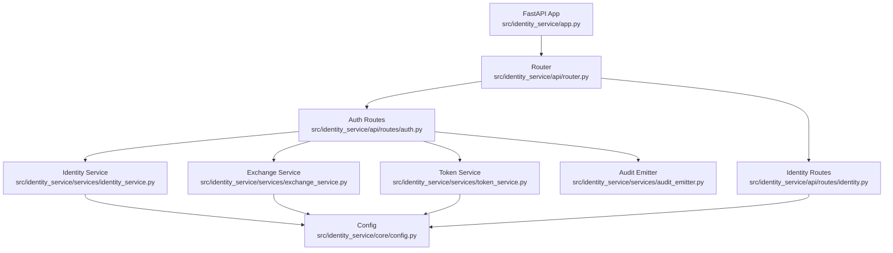
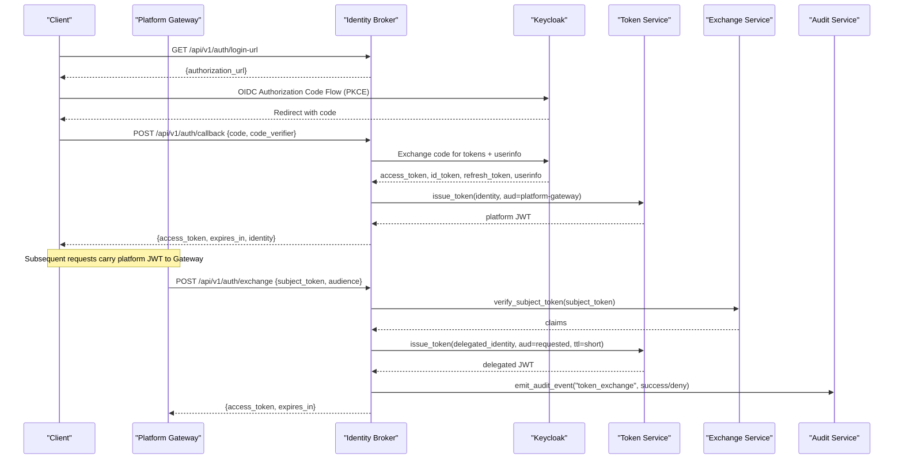
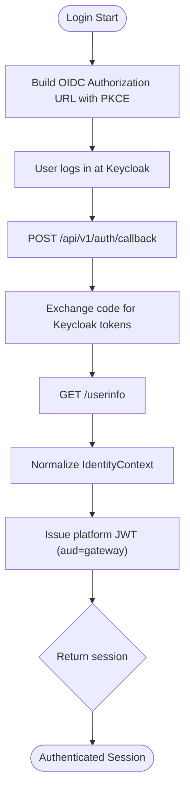
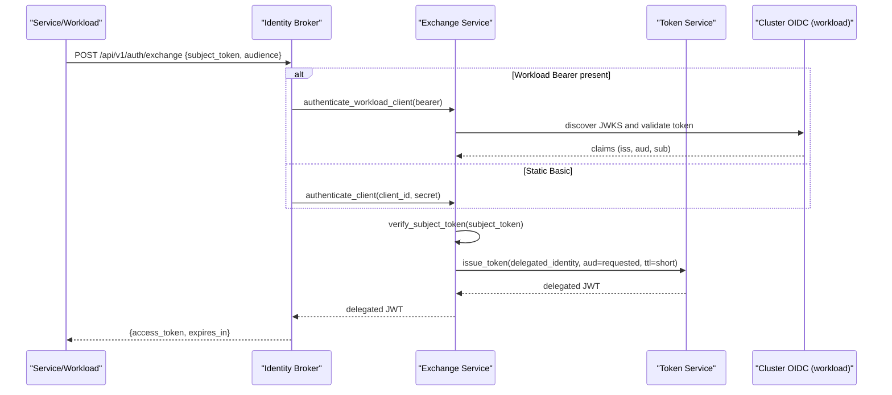
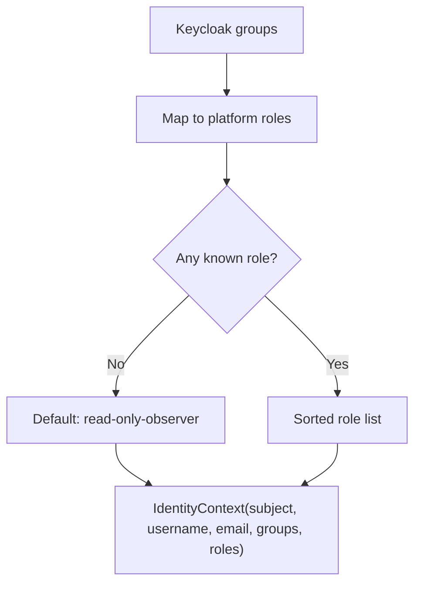
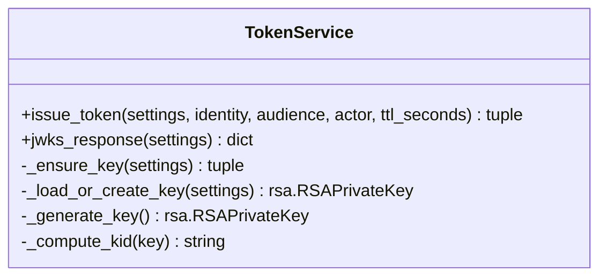
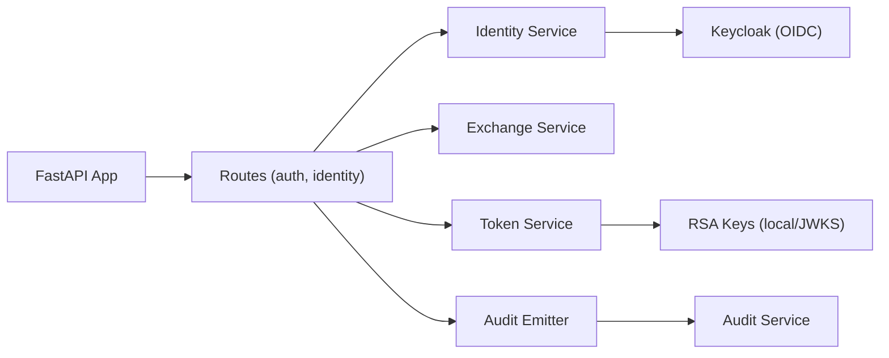

# Identity Broker

<cite>
**Referenced Files in This Document**
- [README.md](file://products/identity-broker/README.md)
- [pyproject.toml](file://products/identity-broker/pyproject.toml)
- [app.py](file://products/identity-broker/src/identity_service/app.py)
- [main.py](file://products/identity-broker/src/identity_service/main.py)
- [auth.py](file://products/identity-broker/src/identity_service/api/routes/auth.py)
- [identity.py](file://products/identity-broker/src/identity_service/api/routes/identity.py)
- [config.py](file://products/identity-broker/src/identity_service/core/config.py)
- [token_service.py](file://products/identity-broker/src/identity_service/services/token_service.py)
- [identity_service.py](file://products/identity-broker/src/identity_service/services/identity_service.py)
- [exchange_service.py](file://products/identity-broker/src/identity_service/services/exchange_service.py)
- [audit_emitter.py](file://products/identity-broker/src/identity_service/services/audit_emitter.py)
- [auth.py](file://products/identity-broker/src/identity_service/schemas/auth.py)
- [identity.py](file://products/identity-broker/src/identity_service/schemas/identity.py)
- [test_identity_service.py](file://products/identity-broker/tests/test_identity_service.py)
- [test_token_service.py](file://products/identity-broker/tests/test_token_service.py)
</cite>

## Table of Contents
1. [Introduction](#introduction)
2. [Project Structure](#project-structure)
3. [Core Components](#core-components)
4. [Architecture Overview](#architecture-overview)
5. [Detailed Component Analysis](#detailed-component-analysis)
6. [Dependency Analysis](#dependency-analysis)
7. [Performance Considerations](#performance-considerations)
8. [Troubleshooting Guide](#troubleshooting-guide)
9. [Conclusion](#conclusion)
10. [Appendices](#appendices)

## Introduction
The Identity Broker is the platform’s central identity authority. It integrates with Keycloak for user authentication, normalizes enterprise identity into a consistent context, issues short-lived RSA-signed platform JWTs, and delegates service-to-service access via token exchange. It also supports workload identity for automated processes by validating projected Kubernetes service-account tokens against the cluster OIDC issuer.

Key responsibilities:
- OIDC login flow initiation and callback handling with PKCE
- Issuing platform JWTs bound to an audience (default gateway)
- Exchanging a verified subject token for a short-lived delegated token scoped to a requested audience
- Propagating normalized identity (subject, username, email, groups, roles) across request chains
- Publishing JWKS for token verification by downstream services
- Emitting audit events for token exchanges

Security highlights:
- Audience scoping prevents cross-service replay
- Role mapping ensures least privilege defaults
- Workload identity validates projected tokens against the cluster OIDC issuer and maps subjects to allowed audiences
- Audit emission is fire-and-forget and never blocks the critical path

**Section sources**
- [README.md:3-55](file://products/identity-broker/README.md#L3-L55)

## Project Structure
The Identity Broker is a FastAPI application organized into app bootstrap, API routes, core configuration, schemas, and domain services. The runtime entrypoint loads run settings from environment variables and starts Uvicorn.

**Diagram sources**
- [app.py:16-45](file://products/identity-broker/src/identity_service/app.py#L16-L45)
- [auth.py:34-231](file://products/identity-broker/src/identity_service/api/routes/auth.py#L34-L231)
- [identity.py:17-46](file://products/identity-broker/src/identity_service/api/routes/identity.py#L17-L46)
- [identity_service.py:114-278](file://products/identity-broker/src/identity_service/services/identity_service.py#L114-L278)
- [exchange_service.py:148-195](file://products/identity-broker/src/identity_service/services/exchange_service.py#L148-L195)
- [token_service.py:83-155](file://products/identity-broker/src/identity_service/services/token_service.py#L83-L155)
- [audit_emitter.py:31-100](file://products/identity-broker/src/identity_service/services/audit_emitter.py#L31-L100)
- [config.py:100-169](file://products/identity-broker/src/identity_service/core/config.py#L100-L169)

**Section sources**
- [main.py:6-9](file://products/identity-broker/src/identity_service/main.py#L6-L9)
- [app.py:16-45](file://products/identity-broker/src/identity_service/app.py#L16-L45)
- [pyproject.toml:1-33](file://products/identity-broker/pyproject.toml#L1-L33)

## Core Components
- OIDC client integration and login flow: builds authorization URLs with PKCE, exchanges authorization codes for Keycloak tokens, fetches userinfo, normalizes identity, and issues a platform JWT as the primary access token.
- Token issuance and JWKS: manages RSA key lifecycle, signs platform JWTs with RS256, exposes public keys at /.well-known/jwks.json.
- Token exchange (delegation): authenticates callers via static credentials or projected workload tokens, verifies the subject token against the broker’s own signing key, and mints short-lived delegated tokens scoped to a requested audience with an actor claim.
- Identity normalization: maps Keycloak groups to platform roles and produces a canonical IdentityContext used downstream.
- Audit emission: non-blocking delivery of token exchange outcomes to the audit service.

**Section sources**
- [identity_service.py:88-192](file://products/identity-broker/src/identity_service/services/identity_service.py#L88-L192)
- [identity_service.py:229-278](file://products/identity-broker/src/identity_service/services/identity_service.py#L229-L278)
- [token_service.py:83-155](file://products/identity-broker/src/identity_service/services/token_service.py#L83-L155)
- [exchange_service.py:46-195](file://products/identity-broker/src/identity_service/services/exchange_service.py#L46-L195)
- [audit_emitter.py:31-100](file://products/identity-broker/src/identity_service/services/audit_emitter.py#L31-L100)

## Architecture Overview
The Identity Broker sits between clients (portal, services, workloads) and Keycloak. It normalizes identity, issues platform JWTs, and mediates delegation to other services.

**Diagram sources**
- [auth.py:34-183](file://products/identity-broker/src/identity_service/api/routes/auth.py#L34-L183)
- [identity_service.py:88-192](file://products/identity-broker/src/identity_service/services/identity_service.py#L88-L192)
- [identity_service.py:229-278](file://products/identity-broker/src/identity_service/services/identity_service.py#L229-L278)
- [token_service.py:83-155](file://products/identity-broker/src/identity_service/services/token_service.py#L83-L155)
- [exchange_service.py:148-195](file://products/identity-broker/src/identity_service/services/exchange_service.py#L148-L195)
- [audit_emitter.py:31-100](file://products/identity-broker/src/identity_service/services/audit_emitter.py#L31-L100)

## Detailed Component Analysis

### OIDC Login Flow and Platform JWT Issuance
- Login URL generation uses PKCE (S256), state, scopes, and redirect URI from settings.
- Callback exchanges the authorization code for Keycloak tokens, fetches userinfo, normalizes identity, and issues a platform JWT bound to the configured audience.
- Refresh endpoint exchanges a Keycloak refresh_token for a new platform JWT with updated identity claims.

**Diagram sources**
- [identity_service.py:88-192](file://products/identity-broker/src/identity_service/services/identity_service.py#L88-L192)
- [auth.py:44-71](file://products/identity-broker/src/identity_service/api/routes/auth.py#L44-L71)

**Section sources**
- [identity_service.py:88-192](file://products/identity-broker/src/identity_service/services/identity_service.py#L88-L192)
- [identity_service.py:229-278](file://products/identity-broker/src/identity_service/services/identity_service.py#L229-L278)
- [auth.py:44-71](file://products/identity-broker/src/identity_service/api/routes/auth.py#L44-L71)
- [auth.py:214-231](file://products/identity-broker/src/identity_service/api/routes/auth.py#L214-L231)

### Token Exchange and Delegation
- Supports two caller authentication paths:
  - Static HTTP Basic client credentials (client_id:secret)
  - Projected workload token (Bearer) validated against the cluster OIDC issuer JWKS and mapped to a registered client by subject
- Verifies the presented subject token against the broker’s own signing key and audience, then mints a short-lived delegated token scoped to the requested audience with an actor claim identifying the acting service.
- Enforces audience allow-list per client; unauthorized audiences are rejected.

**Diagram sources**
- [auth.py:114-183](file://products/identity-broker/src/identity_service/api/routes/auth.py#L114-L183)
- [exchange_service.py:46-195](file://products/identity-broker/src/identity_service/services/exchange_service.py#L46-L195)
- [token_service.py:83-155](file://products/identity-broker/src/identity_service/services/token_service.py#L83-L155)

**Section sources**
- [exchange_service.py:46-195](file://products/identity-broker/src/identity_service/services/exchange_service.py#L46-L195)
- [auth.py:114-183](file://products/identity-broker/src/identity_service/api/routes/auth.py#L114-L183)

### Identity Normalization and Role Mapping
- Groups from Keycloak are mapped to platform roles using a fixed mapping table; unknown groups default to read-only observer.
- IdentityContext includes subject, username, email, groups, and roles for downstream consumers.

**Diagram sources**
- [identity_service.py:24-38](file://products/identity-broker/src/identity_service/services/identity_service.py#L24-L38)
- [identity_service.py:114-139](file://products/identity-broker/src/identity_service/services/identity_service.py#L114-L139)

**Section sources**
- [identity_service.py:24-38](file://products/identity-broker/src/identity_service/services/identity_service.py#L24-L38)
- [identity_service.py:114-139](file://products/identity-broker/src/identity_service/services/identity_service.py#L114-L139)

### Token Signing, JWKS, and Verification
- RSA key lifecycle: load from file if configured, generate and persist on first use, or use ephemeral in-memory key for tests.
- Issues RS256-signed JWTs with kid header; publishes JWKS at /.well-known/jwks.json.
- Downstream services can verify tokens using the published public keys.

**Diagram sources**
- [token_service.py:29-155](file://products/identity-broker/src/identity_service/services/token_service.py#L29-L155)

**Section sources**
- [token_service.py:29-155](file://products/identity-broker/src/identity_service/services/token_service.py#L29-L155)
- [auth.py:107-112](file://products/identity-broker/src/identity_service/api/routes/auth.py#L107-L112)

### Workload Identity Support
- Validates projected service-account tokens against the cluster OIDC issuer’s JWKS discovered via OpenID Connect discovery.
- Requires required claims (exp, iss, sub, aud) and maps the token’s sub to a registered workload client that defines allowed audiences.
- Enables automated processes to obtain delegated tokens without static secrets.

**Section sources**
- [exchange_service.py:60-121](file://products/identity-broker/src/identity_service/services/exchange_service.py#L60-L121)
- [config.py:52-97](file://products/identity-broker/src/identity_service/core/config.py#L52-L97)

### Audit Emission
- Emits token exchange outcomes (success/deny) to the audit service via HTTP on a daemon thread with a short timeout.
- If audit service is unreachable or not configured, failures are logged and metrics recorded; the exchange path remains unaffected.

**Section sources**
- [audit_emitter.py:31-100](file://products/identity-broker/src/identity_service/services/audit_emitter.py#L31-L100)
- [auth.py:140-183](file://products/identity-broker/src/identity_service/api/routes/auth.py#L140-L183)

## Dependency Analysis
The Identity Broker depends on:
- FastAPI for routing and middleware
- httpx for outbound calls to Keycloak and audit service
- PyJWT and cryptography for token signing and verification
- Prometheus client for metrics
- Optional OTLP exporter for telemetry

**Diagram sources**
- [app.py:16-45](file://products/identity-broker/src/identity_service/app.py#L16-L45)
- [auth.py:34-231](file://products/identity-broker/src/identity_service/api/routes/auth.py#L34-L231)
- [identity_service.py:88-278](file://products/identity-broker/src/identity_service/services/identity_service.py#L88-L278)
- [exchange_service.py:46-195](file://products/identity-broker/src/identity_service/services/exchange_service.py#L46-L195)
- [token_service.py:83-155](file://products/identity-broker/src/identity_service/services/token_service.py#L83-L155)
- [audit_emitter.py:31-100](file://products/identity-broker/src/identity_service/services/audit_emitter.py#L31-L100)

**Section sources**
- [pyproject.toml:6-18](file://products/identity-broker/pyproject.toml#L6-L18)

## Performance Considerations
- Token issuance is CPU-bound due to RSA signing; key material is cached per process to avoid repeated loading/generation.
- Audit emission is asynchronous and fire-and-forget to prevent blocking the hot path.
- Workload JWKS clients are cached per issuer URL to reduce discovery overhead.
- Short TTLs for delegated tokens limit exposure windows.

[No sources needed since this section provides general guidance]

## Troubleshooting Guide
Common issues and diagnostics:
- Missing or invalid Authorization header when resolving current identity: ensure a Bearer token is provided to /api/v1/identity/me.
- OIDC token exchange failures: check Keycloak connectivity and client configuration; errors surface as 502 from the callback route.
- Token refresh failures: invalid or expired refresh_token results in 401.
- Token exchange rejections: inspect audit logs and metrics for token_exchange_total{result}; reasons include invalid credentials, expired/invalid subject token, or disallowed audience.
- Audit emission failures: check IDENTITY_AUDIT_SERVICE_URL and credentials; failures degrade to log-only and do not block exchanges.

Operational checks:
- Verify /.well-known/jwks.json returns a valid RSA key set with matching kid to issued tokens.
- Confirm audience binding: platform tokens default to the gateway; delegated tokens must target allowed audiences per client.
- Validate workload identity: ensure IDENTITY_WORKLOAD_ISSUER_URL and IDENTITY_WORKLOAD_AUDIENCE are set and the workload’s sub is registered in IDENTITY_WORKLOAD_CLIENTS.

**Section sources**
- [identity.py:24-46](file://products/identity-broker/src/identity_service/api/routes/identity.py#L24-L46)
- [auth.py:54-71](file://products/identity-broker/src/identity_service/api/routes/auth.py#L54-L71)
- [auth.py:214-231](file://products/identity-broker/src/identity_service/api/routes/auth.py#L214-L231)
- [auth.py:114-183](file://products/identity-broker/src/identity_service/api/routes/auth.py#L114-L183)
- [audit_emitter.py:69-100](file://products/identity-broker/src/identity_service/services/audit_emitter.py#L69-L100)

## Conclusion
The Identity Broker centralizes identity for the platform by bridging Keycloak, issuing audience-scoped platform JWTs, and mediating secure delegation to downstream services. Its design emphasizes least privilege through role mapping, strict audience validation, and short-lived delegated tokens. Workload identity enables automated processes to participate securely without static secrets. Audit emission provides durable observability for all token exchanges while remaining non-blocking.

[No sources needed since this section summarizes without analyzing specific files]

## Appendices

### Configuration Reference
- Keycloak and OIDC: KEYCLOAK_BASE_URL, KEYCLOAK_REALM, OIDC_CLIENT_ID, OIDC_REDIRECT_URI, OIDC_POST_LOGOUT_REDIRECT_URI, OIDC_SCOPES
- Token signing and lifetime: IDENTITY_JWT_PRIVATE_KEY_PATH, IDENTITY_TOKEN_TTL_SECONDS, IDENTITY_TOKEN_ISSUER, IDENTITY_TOKEN_AUDIENCE
- Delegation: IDENTITY_DELEGATED_TOKEN_TTL_SECONDS, IDENTITY_SERVICE_CLIENTS
- Workload identity: IDENTITY_WORKLOAD_ISSUER_URL, IDENTITY_WORKLOAD_AUDIENCE, IDENTITY_WORKLOAD_CLIENTS
- Audit: IDENTITY_AUDIT_SERVICE_URL, IDENTITY_AUDIT_CLIENT_ID, IDENTITY_AUDIT_CLIENT_SECRET
- Telemetry: OTEL_ENABLED, OTEL_EXPORTER_OTLP_ENDPOINT, OTEL_SERVICE_NAME

**Section sources**
- [README.md:57-98](file://products/identity-broker/README.md#L57-L98)
- [config.py:100-169](file://products/identity-broker/src/identity_service/core/config.py#L100-L169)

### Example: Configuring OIDC Clients
- Set OIDC_CLIENT_ID and OIDC_REDIRECT_URI to match your portal registration in Keycloak.
- Optionally set OIDC_CLIENT_SECRET for confidential clients.
- Ensure scopes include openid, profile, email, and groups as needed.

**Section sources**
- [config.py:100-169](file://products/identity-broker/src/identity_service/core/config.py#L100-L169)

### Example: Implementing Custom Token Validators
- Downstream services should verify incoming platform JWTs using the broker’s JWKS endpoint and enforce:
  - Algorithm RS256
  - Required claims: exp, iss, aud, sub
  - Audience matches the service’s expected audience
- For delegated tokens, also validate the act claim to identify the acting service.

**Section sources**
- [token_service.py:129-155](file://products/identity-broker/src/identity_service/services/token_service.py#L129-L155)
- [exchange_service.py:123-145](file://products/identity-broker/src/identity_service/services/exchange_service.py#L123-L145)

### Example: Debugging Identity Flows in Distributed Requests
- Use x-request-id to correlate logs across services; it is captured by the HTTP middleware.
- Check metrics:
  - identity_tokens_issued_total for token issuance volume
  - token_exchange_total{result} for exchange outcomes
  - audit_emits_total{result} for audit delivery status
- Inspect audit events emitted for token_exchange to understand denials and reasons.

**Section sources**
- [app.py:20-40](file://products/identity-broker/src/identity_service/app.py#L20-L40)
- [README.md:94-98](file://products/identity-broker/README.md#L94-L98)
- [auth.py:140-183](file://products/identity-broker/src/identity_service/api/routes/auth.py#L140-L183)

### Test Coverage Notes
- Role mapping and identity normalization are covered by unit tests asserting group-to-role resolution and normalized contexts.
- OIDC flows (login start, callback, refresh) are tested by mocking Keycloak responses and asserting platform JWT issuance and identity fields.
- Token issuance and JWKS format are validated, including audience defaults/customization and key persistence behavior.

**Section sources**
- [test_identity_service.py:54-168](file://products/identity-broker/tests/test_identity_service.py#L54-L168)
- [test_identity_service.py:169-287](file://products/identity-broker/tests/test_identity_service.py#L169-L287)
- [test_token_service.py:30-156](file://products/identity-broker/tests/test_token_service.py#L30-L156)