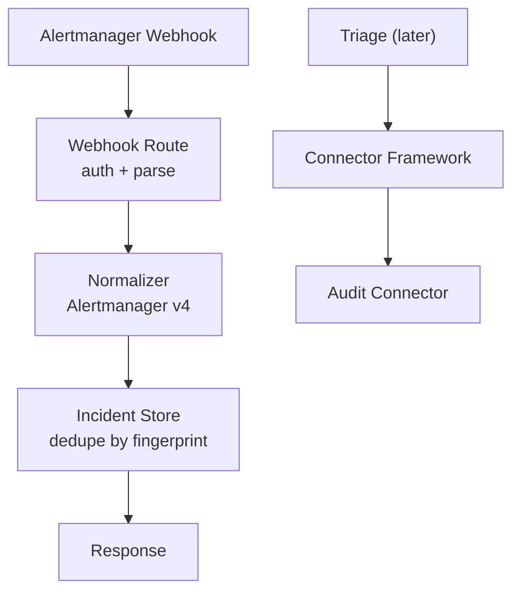
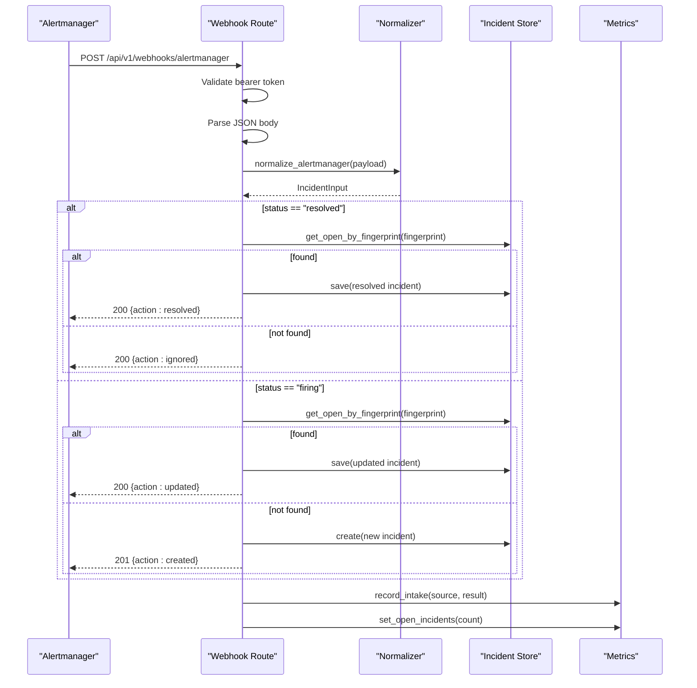
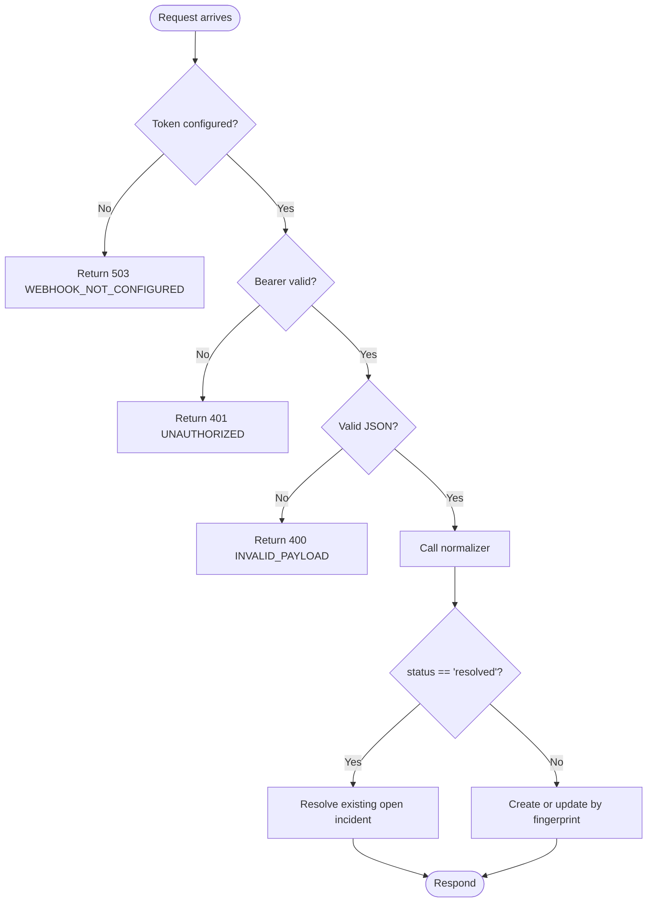
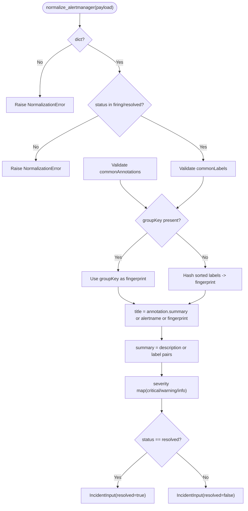
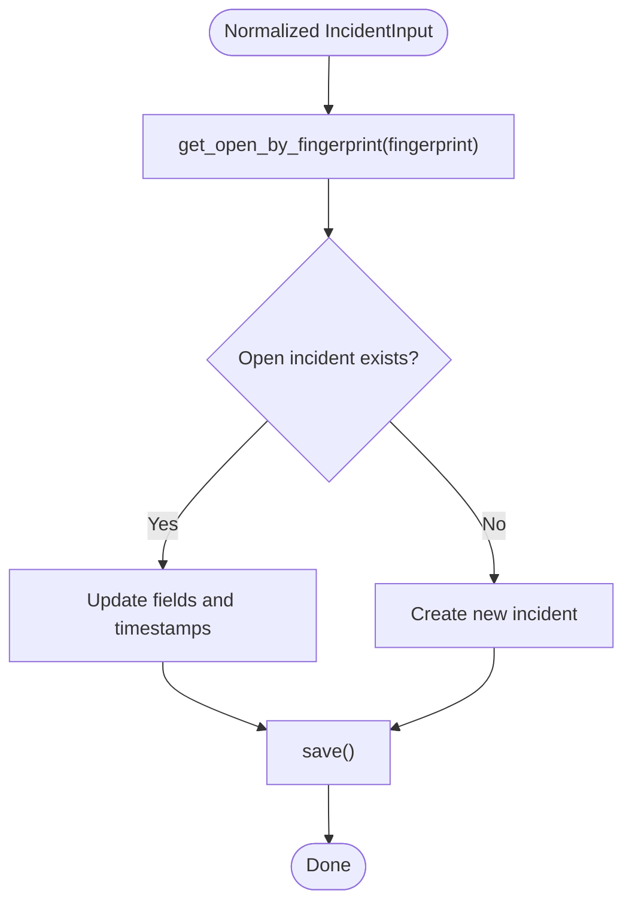
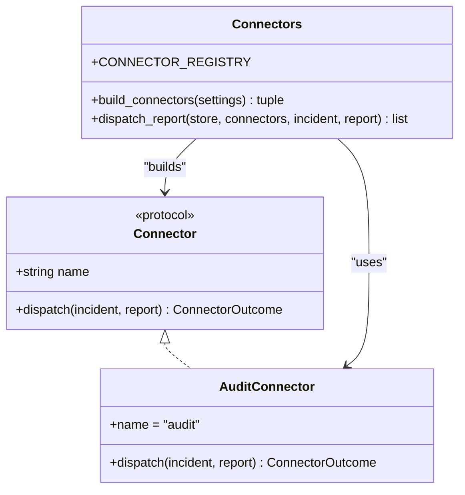
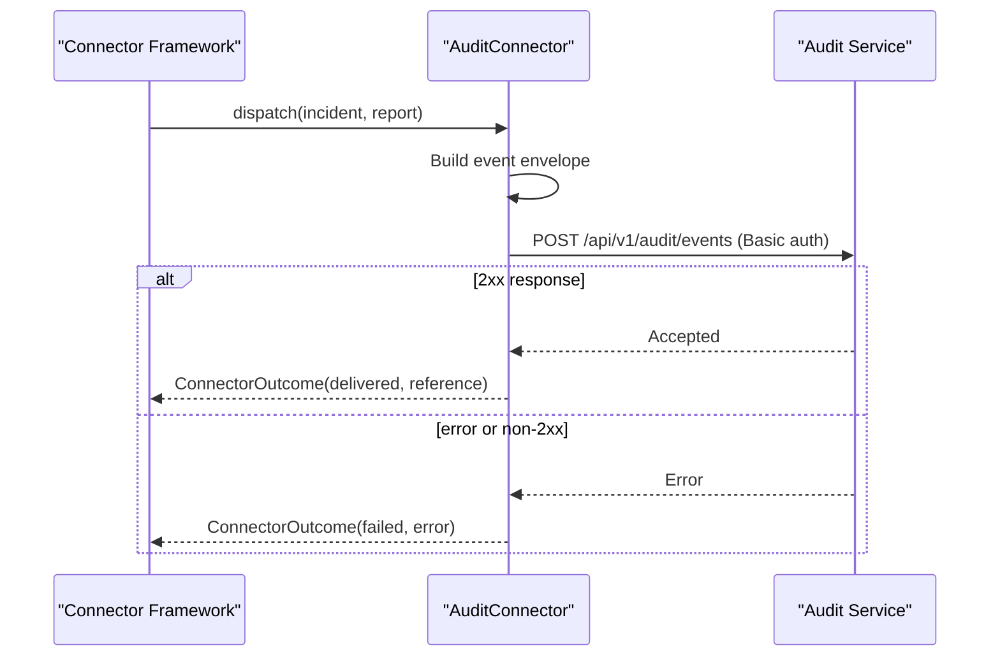
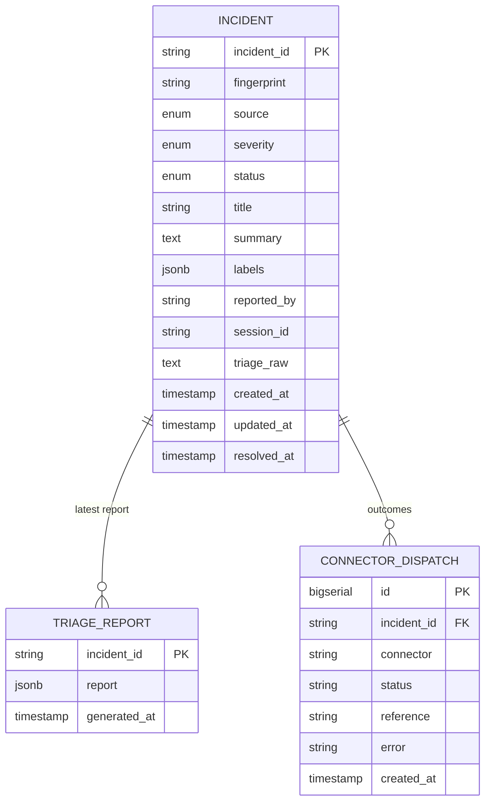
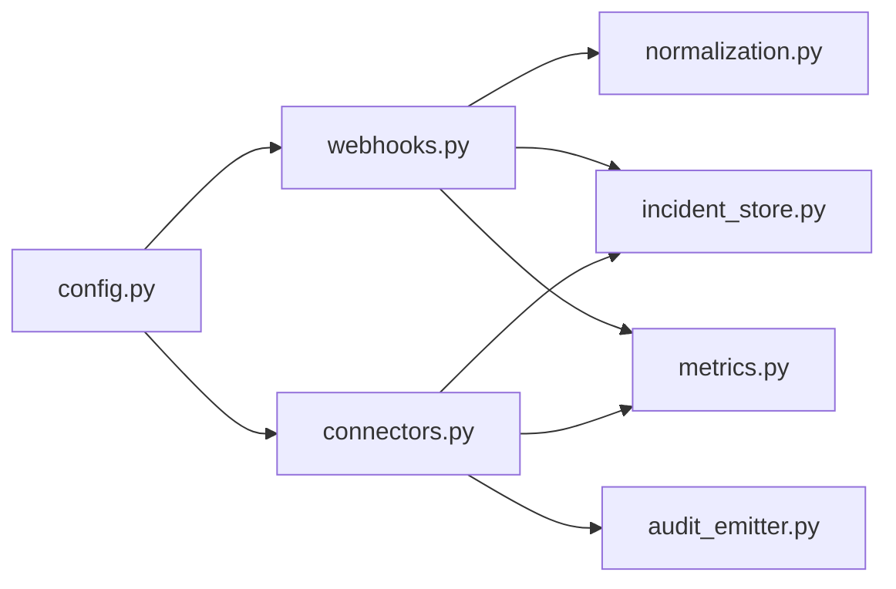

# Alert Ingestion and Normalization

<cite>
**Referenced Files in This Document**
- [README.md](file://products/incident-service/README.md)
- [webhooks.py](file://products/incident-service/src/incident_service/api/routes/webhooks.py)
- [normalization.py](file://products/incident-service/src/incident_service/services/normalization.py)
- [connectors.py](file://products/incident-service/src/incident_service/services/connectors.py)
- [audit_emitter.py](file://products/incident-service/src/incident_service/services/audit_emitter.py)
- [incident_store.py](file://products/incident-service/src/incident_service/services/incident_store.py)
- [incident.py](file://products/incident-service/src/incident_service/schemas/incident.py)
- [config.py](file://products/incident-service/src/incident_service/core/config.py)
- [metrics.py](file://products/incident-service/src/incident_service/core/metrics.py)
- [test_normalization.py](file://products/incident-service/tests/test_normalization.py)
- [test_connectors.py](file://products/incident-service/tests/test_connectors.py)
</cite>

## Table of Contents
1. [Introduction](#introduction)
2. [Project Structure](#project-structure)
3. [Core Components](#core-components)
4. [Architecture Overview](#architecture-overview)
5. [Detailed Component Analysis](#detailed-component-analysis)
6. [Dependency Analysis](#dependency-analysis)
7. [Performance Considerations](#performance-considerations)
8. [Troubleshooting Guide](#troubleshooting-guide)
9. [Conclusion](#conclusion)
10. [Appendices](#appendices)

## Introduction
This document explains the alert ingestion and normalization subsystem of the Incident Service. It covers how the service ingests alerts from external sources through a configurable connector framework, normalizes diverse alert formats into a common incident schema, deduplicates by fingerprint, and persists incidents with full auditability. It also documents error handling for malformed or incomplete alerts, security considerations for untrusted inputs, rate limiting strategies, reliability patterns for critical processing, and operational guidance for configuring new connectors and monitoring ingestion performance.

## Project Structure
The alert ingestion path is implemented as a small pipeline:
- HTTP intake route authenticates and parses incoming webhooks.
- A pure-function normalizer maps external payloads to a canonical input model.
- The store layer persists incidents and supports deduplication via fingerprints.
- A pluggable connector framework dispatches triage outcomes to collaboration surfaces (e.g., audit sink).

**Diagram sources**
- [webhooks.py:69-102](file://products/incident-service/src/incident_service/api/routes/webhooks.py#L69-L102)
- [normalization.py:68-109](file://products/incident-service/src/incident_service/services/normalization.py#L68-L109)
- [incident_store.py:30-66](file://products/incident-service/src/incident_service/services/incident_store.py#L30-L66)
- [connectors.py:44-84](file://products/incident-service/src/incident_service/services/connectors.py#L44-L84)
- [audit_emitter.py:30-95](file://products/incident-service/src/incident_service/services/audit_emitter.py#L30-L95)

**Section sources**
- [README.md:1-82](file://products/incident-service/README.md#L1-L82)

## Core Components
- Webhook intake: Authenticates using a shared bearer token, rejects malformed JSON, and delegates to the normalizer.
- Normalizer: Converts an Alertmanager v4 webhook payload into a canonical IncidentInput with stable fingerprinting, severity mapping, title/summary derivation, and resolution flagging.
- Incident store: Provides both in-memory and PostgreSQL backends; supports creating/updating incidents by fingerprint and counting open incidents.
- Connector framework: Defines a protocol for collaboration connectors, builds configured connectors at startup, and dispatches validated triage reports while recording per-connector outcomes.
- Audit connector: Built-in connector that emits structured events to the audit-service ingest endpoint.
- Configuration: Frozen settings loaded from environment variables, including webhook token, connector list, and audit credentials.
- Metrics: Prometheus counters/gauges for intake results, connector dispatch outcomes, and open incident counts.

**Section sources**
- [webhooks.py:57-102](file://products/incident-service/src/incident_service/api/routes/webhooks.py#L57-L102)
- [normalization.py:15-109](file://products/incident-service/src/incident_service/services/normalization.py#L15-L109)
- [incident_store.py:30-66](file://products/incident-service/src/incident_service/services/incident_store.py#L30-L66)
- [connectors.py:31-84](file://products/incident-service/src/incident_service/services/connectors.py#L31-L84)
- [audit_emitter.py:30-95](file://products/incident-service/src/incident_service/services/audit_emitter.py#L30-L95)
- [config.py:72-126](file://products/incident-service/src/incident_service/core/config.py#L72-L126)
- [metrics.py:23-103](file://products/incident-service/src/incident_service/core/metrics.py#L23-L103)

## Architecture Overview
The ingestion architecture isolates concerns:
- Authentication and parsing are handled at the route layer.
- Normalization is stateless and testable, enabling future alert dialects to plug in without changing the intake path.
- Deduplication relies on a stable fingerprint derived from groupKey or label set hashing.
- Persistence uses a strategy pattern to support dev/test and production backends.
- Post-triage, the connector framework ensures downstream integrations cannot fail the triage flow.

**Diagram sources**
- [webhooks.py:69-206](file://products/incident-service/src/incident_service/api/routes/webhooks.py#L69-L206)
- [normalization.py:68-109](file://products/incident-service/src/incident_service/services/normalization.py#L68-L109)
- [incident_store.py:30-66](file://products/incident-service/src/incident_service/services/incident_store.py#L30-L66)
- [metrics.py:89-103](file://products/incident-service/src/incident_service/core/metrics.py#L89-L103)

## Detailed Component Analysis

### Webhook Intake and Authentication
- Enforces a required bearer token; returns 503 when unconfigured to fail closed.
- Rejects invalid tokens with 401.
- Parses JSON; malformed bodies return 400.
- Delegates to the normalizer and then to store operations based on alert status.

**Diagram sources**
- [webhooks.py:57-102](file://products/incident-service/src/incident_service/api/routes/webhooks.py#L57-L102)

**Section sources**
- [webhooks.py:57-102](file://products/incident-service/src/incident_service/api/routes/webhooks.py#L57-L102)

### Normalization Rules and Transformations
- Validates payload type and status values.
- Extracts labels and annotations with strict typing and size limits.
- Computes a stable fingerprint:
  - Preferred: groupKey if present and non-empty.
  - Fallback: deterministic hash over sorted label pairs.
- Maps severity:
  - critical passes through.
  - warning or absent defaults to warning.
  - unknown maps to info.
- Derives title and summary:
  - Title prefers annotation summary, falls back to alertname, then fingerprint.
  - Summary prefers description, falls back to sorted label key=value pairs.
- Flags resolved when status equals "resolved".

**Diagram sources**
- [normalization.py:68-109](file://products/incident-service/src/incident_service/services/normalization.py#L68-L109)

**Section sources**
- [normalization.py:15-109](file://products/incident-service/src/incident_service/services/normalization.py#L15-L109)
- [test_normalization.py:28-96](file://products/incident-service/tests/test_normalization.py#L28-L96)

### Deduplication Strategy
- Fingerprint-based deduplication:
  - Firing alerts update an existing open incident with the same fingerprint.
  - Resolved alerts close the matching open incident.
  - Resolving an unknown fingerprint is idempotent and returns success without side effects.
- Fingerprint stability:
  - Uses groupKey when available.
  - Otherwise computes a deterministic hash over sorted label pairs.

**Diagram sources**
- [webhooks.py:147-206](file://products/incident-service/src/incident_service/api/routes/webhooks.py#L147-L206)
- [incident_store.py:94-103](file://products/incident-service/src/incident_service/services/incident_store.py#L94-L103)
- [incident_store.py:337-350](file://products/incident-service/src/incident_service/services/incident_store.py#L337-L350)

**Section sources**
- [webhooks.py:97-206](file://products/incident-service/src/incident_service/api/routes/webhooks.py#L97-L206)
- [incident_store.py:94-103](file://products/incident-service/src/incident_service/services/incident_store.py#L94-L103)
- [incident_store.py:337-350](file://products/incident-service/src/incident_service/services/incident_store.py#L337-L350)

### Connector Framework Architecture
- Protocol defines a name and async dispatch method.
- Registry maps connector names to factories that receive service settings.
- build_connectors validates configuration at startup; unknown names raise a configuration error.
- dispatch_report iterates configured connectors, records metrics and per-incident dispatch records, and never lets connector failures abort the triage path.

**Diagram sources**
- [connectors.py:31-84](file://products/incident-service/src/incident_service/services/connectors.py#L31-L84)
- [audit_emitter.py:30-95](file://products/incident-service/src/incident_service/services/audit_emitter.py#L30-L95)

**Section sources**
- [connectors.py:31-127](file://products/incident-service/src/incident_service/services/connectors.py#L31-L127)
- [test_connectors.py:68-226](file://products/incident-service/tests/test_connectors.py#L68-L226)

### Audit Connector Implementation
- Emits a structured event to the audit-service ingest endpoint.
- Includes incident envelope, severity assessment, next steps, and cited skills.
- Uses Basic authentication derived from settings.
- Returns delivered with a reference on success; otherwise failed with descriptive errors.

**Diagram sources**
- [audit_emitter.py:30-95](file://products/incident-service/src/incident_service/services/audit_emitter.py#L30-L95)
- [connectors.py:87-127](file://products/incident-service/src/incident_service/services/connectors.py#L87-L127)

**Section sources**
- [audit_emitter.py:30-95](file://products/incident-service/src/incident_service/services/audit_emitter.py#L30-L95)
- [connectors.py:87-127](file://products/incident-service/src/incident_service/services/connectors.py#L87-L127)

### Data Models and Schema Alignment
- Incident model enforces field constraints and provides envelopes for serialization.
- TriageReport aligns with the shared contract schema and includes metadata such as session_id, generated_at, and generated_by.
- ConnectorDispatch captures per-connector outcomes and timestamps.

**Diagram sources**
- [incident.py:18-116](file://products/incident-service/src/incident_service/schemas/incident.py#L18-L116)
- [incident_store.py:158-195](file://products/incident-service/src/incident_service/services/incident_store.py#L158-L195)

**Section sources**
- [incident.py:18-116](file://products/incident-service/src/incident_service/schemas/incident.py#L18-L116)
- [incident_store.py:158-195](file://products/incident-service/src/incident_service/services/incident_store.py#L158-L195)

## Dependency Analysis
- Webhook route depends on:
  - Settings for token validation.
  - Normalizer for payload transformation.
  - Store for persistence and deduplication.
  - Metrics for intake outcome tracking.
- Normalizer has no runtime dependencies beyond standard library.
- Connector framework depends on:
  - Settings for connector selection.
  - Metrics for dispatch outcomes.
  - Store for persisting dispatch records.
- Audit connector depends on:
  - Settings for audit-service URL and credentials.
  - HTTP client to emit events.

**Diagram sources**
- [webhooks.py:21-35](file://products/incident-service/src/incident_service/api/routes/webhooks.py#L21-L35)
- [connectors.py:19-26](file://products/incident-service/src/incident_service/services/connectors.py#L19-L26)
- [audit_emitter.py:19-21](file://products/incident-service/src/incident_service/services/audit_emitter.py#L19-L21)
- [config.py:72-126](file://products/incident-service/src/incident_service/core/config.py#L72-L126)

**Section sources**
- [webhooks.py:21-35](file://products/incident-service/src/incident_service/api/routes/webhooks.py#L21-L35)
- [connectors.py:19-26](file://products/incident-service/src/incident_service/services/connectors.py#L19-L26)
- [audit_emitter.py:19-21](file://products/incident-service/src/incident_service/services/audit_emitter.py#L19-L21)
- [config.py:72-126](file://products/incident-service/src/incident_service/core/config.py#L72-L126)

## Performance Considerations
- Normalization is a pure function with bounded label sizes and lengths to prevent abuse and reduce memory pressure.
- Deduplication queries use indexes on fingerprint and status+created_at ordering for efficient lookups and lists.
- Store implementations:
  - In-memory store is suitable for tests/dev.
  - PostgreSQL store opens connections per operation; consider connection pooling in high-throughput deployments.
- Metrics provide visibility:
  - incident_intakes_total by source and result.
  - incident_connector_dispatches_total by connector and result.
  - incidents_open gauge for operational dashboards.

[No sources needed since this section provides general guidance]

## Troubleshooting Guide
Common issues and resolutions:
- Webhook not configured:
  - Symptom: 503 responses.
  - Cause: Missing INCIDENT_WEBHOOK_TOKEN.
  - Resolution: Configure the token before enabling intake.
- Invalid payload:
  - Symptom: 400 INVALID_PAYLOAD.
  - Causes: Non-JSON body, missing or invalid status, non-object labels/annotations, oversized label maps or entries.
  - Resolution: Ensure Alertmanager v4 format compliance and label constraints.
- Unknown connector:
  - Symptom: Startup failure.
  - Cause: INCIDENT_CONNECTORS references an unregistered connector.
  - Resolution: Register the connector factory and include its name in INCIDENT_CONNECTORS.
- Audit connector failures:
  - Symptom: Dispatch recorded as failed.
  - Causes: Missing audit-service URL, unreachable service, rejected credentials.
  - Resolution: Configure INCIDENT_AUDIT_* settings and verify connectivity and credentials.

**Section sources**
- [webhooks.py:73-93](file://products/incident-service/src/incident_service/api/routes/webhooks.py#L73-L93)
- [normalization.py:76-94](file://products/incident-service/src/incident_service/services/normalization.py#L76-L94)
- [connectors.py:73-84](file://products/incident-service/src/incident_service/services/connectors.py#L73-L84)
- [audit_emitter.py:62-95](file://products/incident-service/src/incident_service/services/audit_emitter.py#L62-L95)
- [test_connectors.py:139-167](file://products/incident-service/tests/test_connectors.py#L139-L167)

## Conclusion
The Incident Service’s alert ingestion and normalization subsystem provides a secure, extensible, and observable pipeline for converting external alerts into canonical incidents. It emphasizes safety (fail-closed intake, strict normalization), correctness (stable fingerprinting and deduplication), and resilience (isolated connector dispatch). Operators can extend it with new connectors, tune configuration, and monitor ingestion health via built-in metrics.

[No sources needed since this section summarizes without analyzing specific files]

## Appendices

### Security Considerations for Untrusted Alert Sources
- Input validation:
  - Strict JSON parsing and schema checks in the normalizer reject malformed or oversized inputs.
  - Label and annotation values are coerced to strings and bounded in count and length.
- Authentication:
  - Webhook endpoint requires a shared bearer token; unconfigured token fails closed.
  - Audit connector uses Basic authentication derived from settings.
- Isolation:
  - Connector failures do not affect triage success; they are recorded and counted.

**Section sources**
- [webhooks.py:57-93](file://products/incident-service/src/incident_service/api/routes/webhooks.py#L57-L93)
- [normalization.py:42-57](file://products/incident-service/src/incident_service/services/normalization.py#L42-L57)
- [audit_emitter.py:62-95](file://products/incident-service/src/incident_service/services/audit_emitter.py#L62-L95)

### Rate Limiting Strategies
- Current implementation does not include built-in rate limiting.
- Recommended approaches:
  - Place a reverse proxy or API gateway in front of the webhook endpoint to enforce per-source rate limits.
  - Use platform policies to throttle high-volume sources and protect ingestion endpoints.
  - Monitor incident_intakes_total and http_requests_total to detect spikes and adjust limits accordingly.

[No sources needed since this section provides general guidance]

### Reliability Patterns for Critical Alert Processing
- Idempotent resolution:
  - Resolving an unknown fingerprint is a no-op success, ensuring safe retries.
- Durable storage:
  - PostgreSQL backend supports persistent incident records and connector dispatch history.
- Observability:
  - Metrics and logs capture intake outcomes, connector dispatch results, and open incident counts.

**Section sources**
- [webhooks.py:105-144](file://products/incident-service/src/incident_service/api/routes/webhooks.py#L105-L144)
- [incident_store.py:158-195](file://products/incident-service/src/incident_service/services/incident_store.py#L158-L195)
- [metrics.py:35-56](file://products/incident-service/src/incident_service/core/metrics.py#L35-L56)

### Configuring New Alert Connectors
Steps to add a new connector:
- Implement the Connector protocol with a name and async dispatch method.
- Register a factory in the connector registry.
- Include the connector name in INCIDENT_CONNECTORS.
- Ensure the connector records outcomes and handles errors gracefully.

**Section sources**
- [README.md:62-71](file://products/incident-service/README.md#L62-L71)
- [connectors.py:44-84](file://products/incident-service/src/incident_service/services/connectors.py#L44-L84)

### Customizing Normalization Logic
- Extend the normalizer to support additional alert formats by adding new functions that produce IncidentInput.
- Keep transformations pure and bounded to maintain predictability and performance.
- Add tests covering edge cases and constraints.

**Section sources**
- [normalization.py:68-109](file://products/incident-service/src/incident_service/services/normalization.py#L68-L109)
- [test_normalization.py:28-96](file://products/incident-service/tests/test_normalization.py#L28-L96)

### Handling High-Volume Alert Streams
- Recommendations:
  - Offload rate limiting to a gateway or proxy.
  - Scale horizontally behind a load balancer.
  - Use PostgreSQL backend with appropriate indexing and connection pooling.
  - Monitor metrics and set alerts on intake rejections and connector failures.

[No sources needed since this section provides general guidance]

### Monitoring Ingestion Performance
- Key metrics:
  - incident_intakes_total by source and result.
  - incident_connector_dispatches_total by connector and result.
  - incidents_open gauge.
  - HTTP request counters and durations.
- Access metrics via GET /metrics.

**Section sources**
- [metrics.py:23-103](file://products/incident-service/src/incident_service/core/metrics.py#L23-L103)