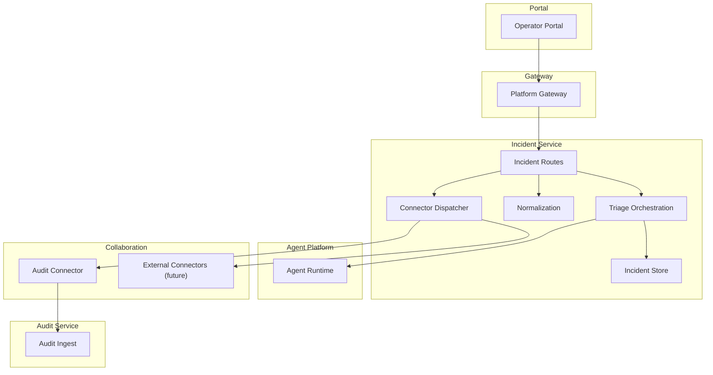
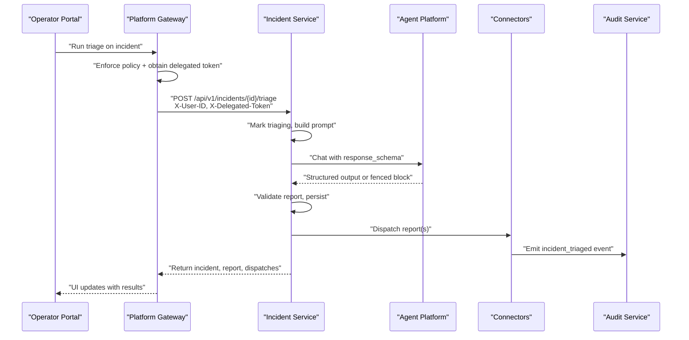
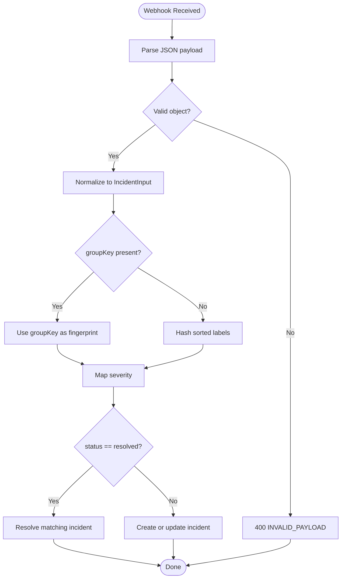
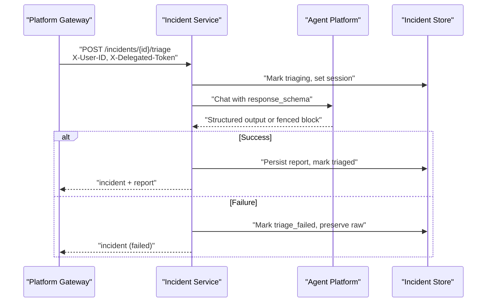
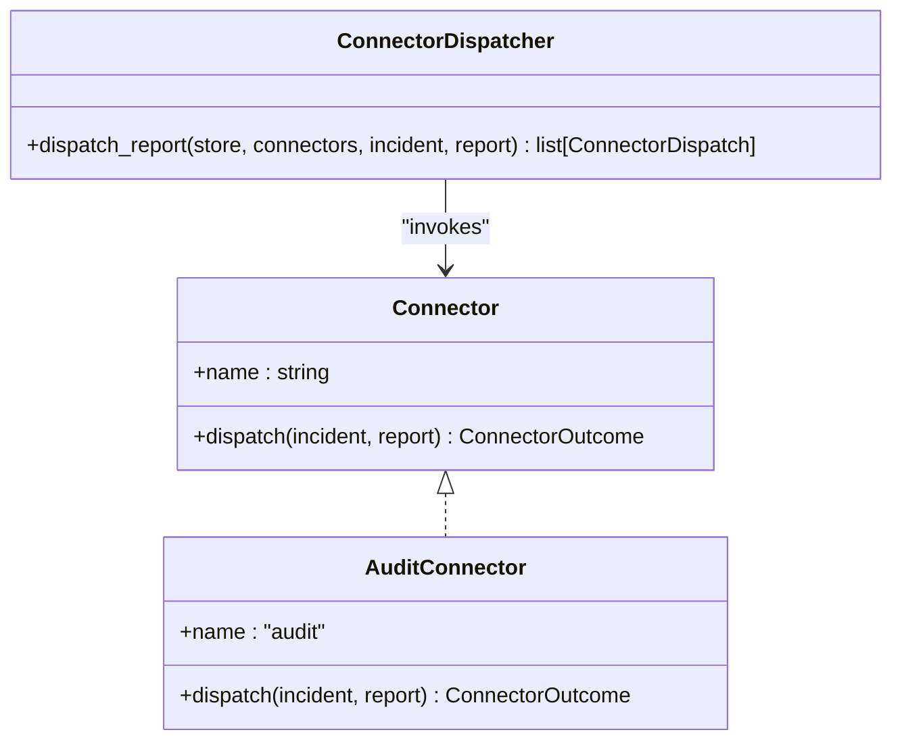
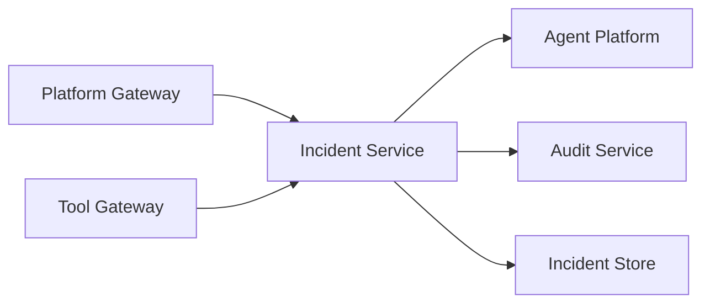

# Collaboration and Dispatch

<cite>
**Referenced Files in This Document**
- [SPEC-015-incident-triage-and-collaboration/spec.md](file://docs/specs/SPEC-015-incident-triage-and-collaboration/spec.md)
- [SPEC-013-durable-audit-trail/spec.md](file://docs/specs/SPEC-013-durable-audit-trail/spec.md)
- [delivery-roadmap.md](file://docs/agentic-aiops-platform/delivery-roadmap.md)
- [incident-guide.md](file://docs/guides/incident-guide.md)
- [tool-configuration.md](file://docs/guides/tool-configuration.md)
- [incidents.py](file://products/incident-service/src/incident_service/api/routes/incidents.py)
- [webhooks.py](file://products/incident-service/src/incident_service/api/routes/webhooks.py)
- [connectors.py](file://products/incident-service/src/incident_service/services/connectors.py)
- [audit_emitter.py](file://products/incident-service/src/incident_service/services/audit_emitter.py)
- [normalization.py](file://products/incident-service/src/incident_service/services/normalization.py)
- [triage.py](file://products/incident-service/src/incident_service/services/triage.py)
- [config.py](file://products/incident-service/src/incident_service/core/config.py)
- [incident_client.py](file://products/platform-gateway/src/platform_gateway/services/incident_client.py)
- [incidents routes (gateway)](file://products/platform-gateway/src/platform_gateway/api/routes/incidents.py)
- [test_connectors.py](file://products/incident-service/tests/test_connectors.py)
- [test_normalization.py](file://products/incident-service/tests/test_normalization.py)
- [test_incidents_connector.py](file://products/tool-gateway/tests/test_incidents_connector.py)
- [incidents_connector.py](file://products/tool-gateway/src/tool_gateway/tools/incidents_connector.py)
</cite>

## Table of Contents
1. Introduction
2. Project Structure
3. Core Components
4. Architecture Overview
5. Detailed Component Analysis
6. Dependency Analysis
7. Performance Considerations
8. Troubleshooting Guide
9. Conclusion
10. Appendices

## Introduction
This document explains the collaboration and dispatch features that enable team-based incident response. It covers how incidents are ingested, triaged by an agent under a real operator identity, dispatched to collaboration surfaces via a pluggable connector framework, and recorded in a durable audit trail. It also documents webhook integration patterns, notification delivery mechanisms, team assignment considerations, escalation procedures, configuration examples for channels and automated rules, chat platform integration patterns, and monitoring metrics. Security, message persistence, and scalability guidance are included for large-scale incident response scenarios.

## Project Structure
The collaboration and dispatch capability spans several services:
- Incident Service: intake (Alertmanager webhook and manual), normalization, triage orchestration, connector dispatch, and incident query APIs.
- Platform Gateway: policy enforcement, delegation forwarding for triage, and proxying portal requests to Incident Service.
- Tool Gateway: read-only tools to list and get incidents for agents.
- Audit Service: durable ingestion of structured audit events emitted by connectors.
- Operator Portal: UI flows to report incidents, run triage, view reports and dispatch outcomes.

**Diagram sources**
- [incidents.py:235-282](file://products/incident-service/src/incident_service/api/routes/incidents.py#L235-L282)
- [triage.py:290-371](file://products/incident-service/src/incident_service/services/triage.py#L290-L371)
- [connectors.py:87-126](file://products/incident-service/src/incident_service/services/connectors.py#L87-L126)
- [audit_emitter.py:62-95](file://products/incident-service/src/incident_service/services/audit_emitter.py#L62-L95)
- [incident_client.py:159-166](file://products/platform-gateway/src/platform_gateway/services/incident_client.py#L159-L166)

**Section sources**
- [SPEC-015-incident-triage-and-collaboration/spec.md:15-23](file://docs/specs/SPEC-015-incident-triage-and-collaboration/spec.md#L15-L23)
- [delivery-roadmap.md:160-195](file://docs/agentic-aiops-platform/delivery-roadmap.md#L160-L195)

## Core Components
- Incident intake and normalization: Alertmanager v4 webhooks and manual reports are normalized into a canonical incident model with deduplication and severity mapping.
- Operator-initiated triage: A single agent turn runs in a dedicated session, gathers evidence through read-only tools, and produces a schema-validated triage report.
- Pluggable collaboration connectors: Triage outcomes are dispatched to configured connectors; failures are isolated and recorded without failing triage.
- Durable audit trail: The built-in audit connector emits structured events to the audit service for queryability and retention.
- Gateway policies and delegation: The platform gateway enforces per-action policies and forwards operator identity and delegated tokens for triage.

**Section sources**
- [normalization.py:68-109](file://products/incident-service/src/incident_service/services/normalization.py#L68-L109)
- [triage.py:290-371](file://products/incident-service/src/incident_service/services/triage.py#L290-L371)
- [connectors.py:87-126](file://products/incident-service/src/incident_service/services/connectors.py#L87-L126)
- [audit_emitter.py:62-95](file://products/incident-service/src/incident_service/services/audit_emitter.py#L62-L95)
- [incidents routes (gateway):1-40](file://products/platform-gateway/src/platform_gateway/api/routes/incidents.py#L1-L40)

## Architecture Overview
The collaboration and dispatch flow is operator-driven and resilient:
- Webhook or manual intake creates or resolves incidents.
- Operators trigger triage via the portal; the platform gateway authenticates, enforces policy, obtains a delegated token, and proxies to Incident Service.
- Incident Service orchestrates a single agent turn in a dedicated session, validates the triage report, persists it, and dispatches outcomes to connectors.
- The audit connector emits a structured event to the audit service; other connectors can be added later.

**Diagram sources**
- [incidents.py:235-282](file://products/incident-service/src/incident_service/api/routes/incidents.py#L235-L282)
- [triage.py:219-276](file://products/incident-service/src/incident_service/services/triage.py#L219-L276)
- [connectors.py:87-126](file://products/incident-service/src/incident_service/services/connectors.py#L87-L126)
- [audit_emitter.py:62-95](file://products/incident-service/src/incident_service/services/audit_emitter.py#L62-L95)
- [incident_client.py:159-166](file://products/platform-gateway/src/platform_gateway/services/incident_client.py#L159-L166)

## Detailed Component Analysis

### Webhook Integration and Normalization
- Accepts Alertmanager v4 payloads, normalizes them into a canonical input, derives stable fingerprints for deduplication, maps severity, and supports resolution signaling.
- Malformed or invalid payloads return 400 with structured errors; open incident counts are updated.

**Diagram sources**
- [webhooks.py:84-102](file://products/incident-service/src/incident_service/api/routes/webhooks.py#L84-L102)
- [normalization.py:68-109](file://products/incident-service/src/incident_service/services/normalization.py#L68-L109)

**Section sources**
- [normalization.py:68-109](file://products/incident-service/src/incident_service/services/normalization.py#L68-L109)
- [webhooks.py:84-102](file://products/incident-service/src/incident_service/api/routes/webhooks.py#L84-L102)
- [test_normalization.py:28-95](file://products/incident-service/tests/test_normalization.py#L28-L95)

### Operator-Initiated Triage and Report Capture
- Triage runs under a real operator identity via broker-mediated delegation.
- A dedicated session per incident is used, with per-operator fallback if needed.
- The agent is asked to produce a structured triage report using either kernel-validated structured output or a fenced block parser.
- On success, the report is persisted and the incident marked triaged; on failure, the incident is marked triage_failed with raw text preserved.

**Diagram sources**
- [incidents.py:235-282](file://products/incident-service/src/incident_service/api/routes/incidents.py#L235-L282)
- [triage.py:290-371](file://products/incident-service/src/incident_service/services/triage.py#L290-L371)

**Section sources**
- [triage.py:99-136](file://products/incident-service/src/incident_service/services/triage.py#L99-L136)
- [triage.py:219-276](file://products/incident-service/src/incident_service/services/triage.py#L219-L276)
- [triage.py:290-371](file://products/incident-service/src/incident_service/services/triage.py#L290-L371)

### Collaboration Connector Framework and Dispatch
- Connectors implement a simple protocol with name and async dispatch method.
- The dispatcher iterates configured connectors, isolates failures, records metrics, persists per-incident dispatch records, and logs events.
- Built-in audit connector emits a structured incident_triaged event to the audit service.

**Diagram sources**
- [connectors.py:44-56](file://products/incident-service/src/incident_service/services/connectors.py#L44-L56)
- [connectors.py:87-126](file://products/incident-service/src/incident_service/services/connectors.py#L87-L126)
- [audit_emitter.py:30-95](file://products/incident-service/src/incident_service/services/audit_emitter.py#L30-L95)

**Section sources**
- [connectors.py:87-126](file://products/incident-service/src/incident_service/services/connectors.py#L87-L126)
- [audit_emitter.py:62-95](file://products/incident-service/src/incident_service/services/audit_emitter.py#L62-L95)
- [test_connectors.py:182-225](file://products/incident-service/tests/test_connectors.py#L182-L225)

### Durable Audit Trail and Retention
- The audit service provides a durable, queryable, permission-scoped audit trail with retention and bounded growth.
- The audit connector emits incident_triaged events carrying incident envelope, report summary, next steps, and cited skills.
- Retention is configurable with eviction schedules and hard caps; ingest never blocks the originating request.

**Section sources**
- [SPEC-013-durable-audit-trail/spec.md:30-63](file://docs/specs/SPEC-013-durable-audit-trail/spec.md#L30-L63)
- [SPEC-013-durable-audit-trail/spec.md:86-95](file://docs/specs/SPEC-013-durable-audit-trail/spec.md#L86-L95)
- [audit_emitter.py:40-60](file://products/incident-service/src/incident_service/services/audit_emitter.py#L40-L60)

### Platform Gateway Policies and Delegation
- All portal calls to incident-service go through the gateway, which enforces per-action policies and uses its own credentials upstream.
- For triage, the gateway forwards operator identity and a delegated bearer so the agent turn runs under a real operator identity.

**Section sources**
- [incidents routes (gateway):1-40](file://products/platform-gateway/src/platform_gateway/api/routes/incidents.py#L1-L40)
- [incident_client.py:1-15](file://products/platform-gateway/src/platform_gateway/services/incident_client.py#L1-L15)
- [incident_client.py:159-166](file://products/platform-gateway/src/platform_gateway/services/incident_client.py#L159-L166)

### Read-Only Incident Tools for Agents
- Tool Gateway exposes read-only incidents.list and incidents.get tools when configured.
- Tools authenticate to incident-service with gateway-held credentials and map upstream errors to structured results.

**Section sources**
- [incidents_connector.py:1-44](file://products/tool-gateway/src/tool_gateway/tools/incidents_connector.py#L1-L44)
- [test_incidents_connector.py:110-124](file://products/tool-gateway/tests/test_incidents_connector.py#L110-L124)

## Dependency Analysis
- Incident Service depends on:
  - Agent Platform for triage turns.
  - Audit Service via the audit connector.
  - Incident Store (in-memory or Postgres).
  - Configuration from environment variables.
- Platform Gateway depends on:
  - Policy engine and delegation client.
  - Incident Service client for proxying.
- Tool Gateway depends on:
  - Incident Service for read-only tool execution.

**Diagram sources**
- [incident_client.py:159-166](file://products/platform-gateway/src/platform_gateway/services/incident_client.py#L159-L166)
- [triage.py:219-276](file://products/incident-service/src/incident_service/services/triage.py#L219-L276)
- [audit_emitter.py:62-95](file://products/incident-service/src/incident_service/services/audit_emitter.py#L62-L95)
- [incidents_connector.py:1-44](file://products/tool-gateway/src/tool_gateway/tools/incidents_connector.py#L1-L44)

**Section sources**
- [incident_client.py:159-166](file://products/platform-gateway/src/platform_gateway/services/incident_client.py#L159-L166)
- [triage.py:219-276](file://products/incident-service/src/incident_service/services/triage.py#L219-L276)
- [audit_emitter.py:62-95](file://products/incident-service/src/incident_service/services/audit_emitter.py#L62-L95)
- [incidents_connector.py:1-44](file://products/tool-gateway/src/tool_gateway/tools/incidents_connector.py#L1-L44)

## Performance Considerations
- Isolated connector dispatch ensures one connector failure does not block others or the triage path.
- Triage timeout is configurable to bound agent interaction latency.
- Audit ingestion is fire-and-forget with timeouts; unreachability degrades gracefully without blocking user-facing requests.
- Normalization enforces label size limits to prevent oversized payloads.
- Pagination and capped list sizes protect query performance.

[No sources needed since this section provides general guidance]

## Troubleshooting Guide
- Triage failures:
  - If the agent reply lacks a valid report, the incident is marked triage_failed with raw text preserved for inspection.
  - Check agent platform connectivity and response schema handling.
- Connector failures:
  - Failed connectors are recorded with status and error details; triage still succeeds.
  - Inspect per-incident dispatch records to identify problematic connectors.
- Webhook issues:
  - Invalid or malformed payloads return 400; verify Alertmanager payload structure and severity mapping.
- Audit ingestion:
  - If audit-service is unreachable, the audit connector returns failed; check network reachability and credentials.

**Section sources**
- [triage.py:279-371](file://products/incident-service/src/incident_service/services/triage.py#L279-L371)
- [connectors.py:87-126](file://products/incident-service/src/incident_service/services/connectors.py#L87-L126)
- [webhooks.py:84-102](file://products/incident-service/src/incident_service/api/routes/webhooks.py#L84-L102)
- [audit_emitter.py:62-95](file://products/incident-service/src/incident_service/services/audit_emitter.py#L62-L95)

## Conclusion
The collaboration and dispatch system enables reliable, operator-driven incident triage with robust auditing and extensible connectors. It integrates seamlessly with the platform’s identity, policy, and observability layers, while keeping triage strictly read-only and non-blocking. Teams can extend collaboration by implementing additional connectors and configure channels and automation via environment settings.

[No sources needed since this section summarizes without analyzing specific files]

## Appendices

### Configuring Collaboration Channels
- Enable connectors via INCIDENT_CONNECTORS; default is the built-in audit sink.
- Configure audit-service URL and credentials to emit incident_triaged events.
- Example checklist for enabling tool-gateway access to incidents:
  - Set GATEWAY_INCIDENTS_SERVICE_URL, GATEWAY_INCIDENTS_CLIENT_ID, GATEWAY_INCIDENTS_CLIENT_SECRET.
  - Ensure network reachability and secret synchronization.

**Section sources**
- [config.py:62-89](file://products/incident-service/src/incident_service/core/config.py#L62-L89)
- [config.py:90-120](file://products/incident-service/src/incident_service/core/config.py#L90-L120)
- [tool-configuration.md:273-303](file://docs/guides/tool-configuration.md#L273-L303)

### Setting Up Automated Dispatch Rules
- Define INCIDENT_CONNECTORS to select connectors at startup; unknown names fail fast.
- Each connector receives the incident and validated triage report; implement custom logic to route to teams or individuals based on labels, severity, or report fields.
- Record and monitor dispatch outcomes via metrics and per-incident dispatch records.

**Section sources**
- [connectors.py:66-84](file://products/incident-service/src/incident_service/services/connectors.py#L66-L84)
- [connectors.py:87-126](file://products/incident-service/src/incident_service/services/connectors.py#L87-L126)

### Integrating with Chat Platforms
- R3 ships the connector contract; external adapters (e.g., Slack, Jira) can be implemented by adhering to the Connector protocol and registering in the registry.
- Future work includes real collaboration adapters; current release focuses on the audit sink and contract stability.

**Section sources**
- [SPEC-015-incident-triage-and-collaboration/spec.md:183-207](file://docs/specs/SPEC-015-incident-triage-and-collaboration/spec.md#L183-L207)
- [connectors.py:1-10](file://products/incident-service/src/incident_service/services/connectors.py#L1-L10)

### Monitoring Collaboration Metrics
- Dispatch outcomes are recorded per connector with delivered/failed status and metrics counters.
- Triage outcomes are tracked with triaged/failed metrics.
- Audit events provide cross-service visibility into intake, triage, and dispatch chains.

**Section sources**
- [connectors.py:106-126](file://products/incident-service/src/incident_service/services/connectors.py#L106-L126)
- [triage.py:313-369](file://products/incident-service/src/incident_service/services/triage.py#L313-L369)
- [SPEC-013-durable-audit-trail/spec.md:30-63](file://docs/specs/SPEC-013-durable-audit-trail/spec.md#L30-L63)

### Security Considerations
- Triage always runs under a real operator identity via broker-mediated delegation; no service-owned authority is used.
- Query endpoints require authentication; webhook endpoints validate tokens.
- Audit events include subject, roles, and outcome for accountability.
- Tool invocations remain read-only during triage; mutating actions are reserved for future approval-gated workflows.

**Section sources**
- [incidents routes (gateway):1-40](file://products/platform-gateway/src/platform_gateway/api/routes/incidents.py#L1-L40)
- [incident_client.py:1-15](file://products/platform-gateway/src/platform_gateway/services/incident_client.py#L1-L15)
- [SPEC-013-durable-audit-trail/spec.md:52-63](file://docs/specs/SPEC-013-durable-audit-trail/spec.md#L52-L63)
- [triage.py:249-261](file://products/incident-service/src/incident_service/services/triage.py#L249-L261)

### Message Persistence Requirements
- Triage reports and incident state are persisted in the incident store.
- Dispatch outcomes are stored per incident for traceability.
- Audit events are durably stored with retention policies to ensure bounded growth.

**Section sources**
- [triage.py:351-369](file://products/incident-service/src/incident_service/services/triage.py#L351-L369)
- [connectors.py:108-116](file://products/incident-service/src/incident_service/services/connectors.py#L108-L116)
- [SPEC-013-durable-audit-trail/spec.md:86-95](file://docs/specs/SPEC-013-durable-audit-trail/spec.md#L86-L95)

### Scalability Guidance
- Use Postgres-backed stores for production incident and audit data.
- Configure timeouts for triage and audit ingestion to bound resource usage.
- Leverage pagination and capped lists for queries.
- Implement connectors with isolation and backpressure strategies to handle high-volume incidents.

**Section sources**
- [config.py:72-89](file://products/incident-service/src/incident_service/core/config.py#L72-L89)
- [triage.py:233-239](file://products/incident-service/src/incident_service/services/triage.py#L233-L239)
- [audit_emitter.py:25-28](file://products/incident-service/src/incident_service/services/audit_emitter.py#L25-L28)