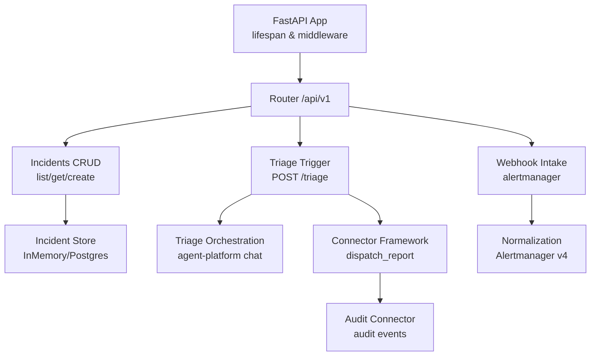
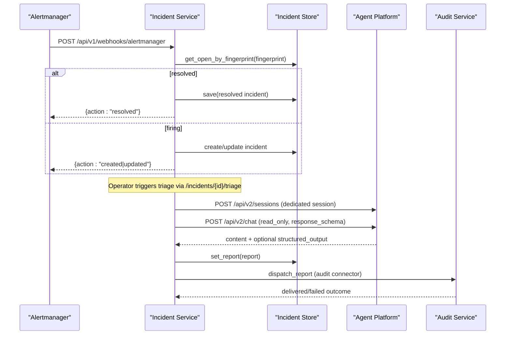
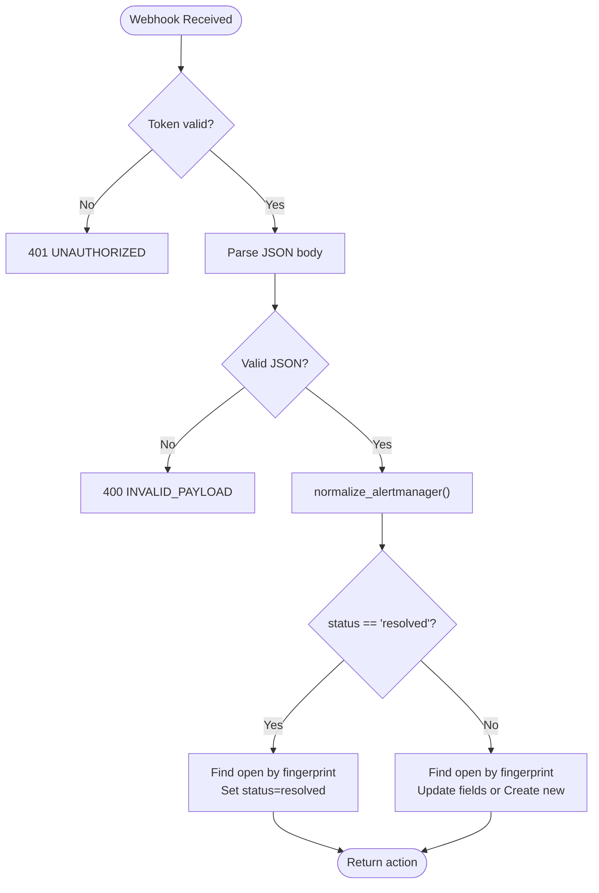
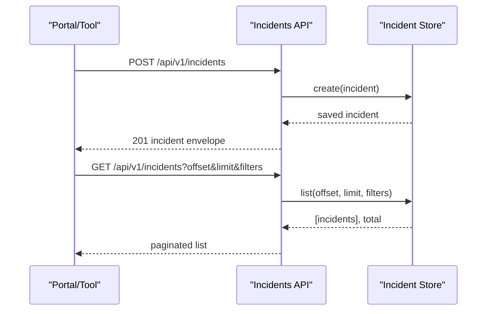
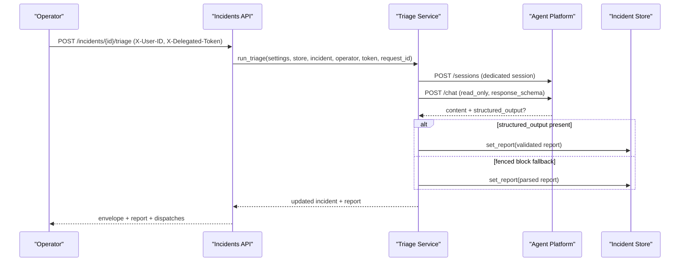
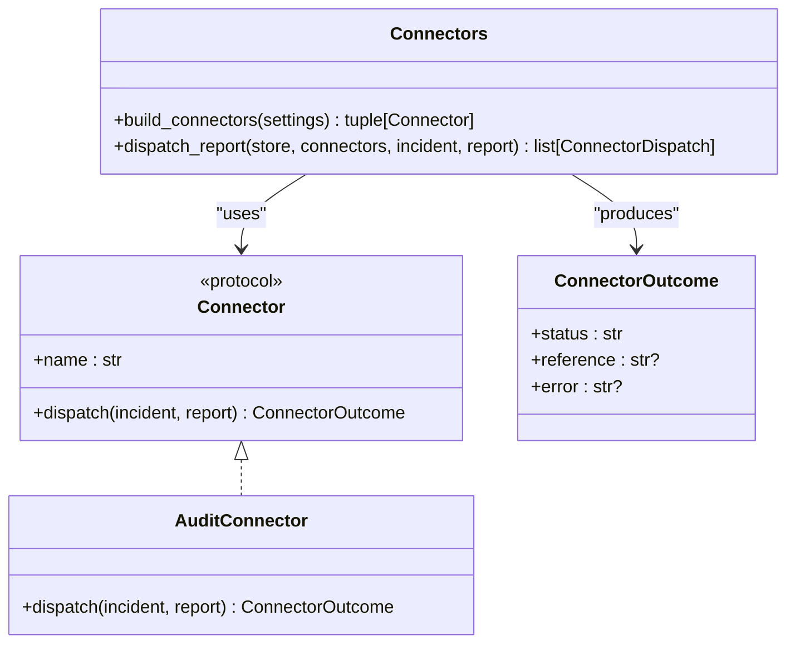
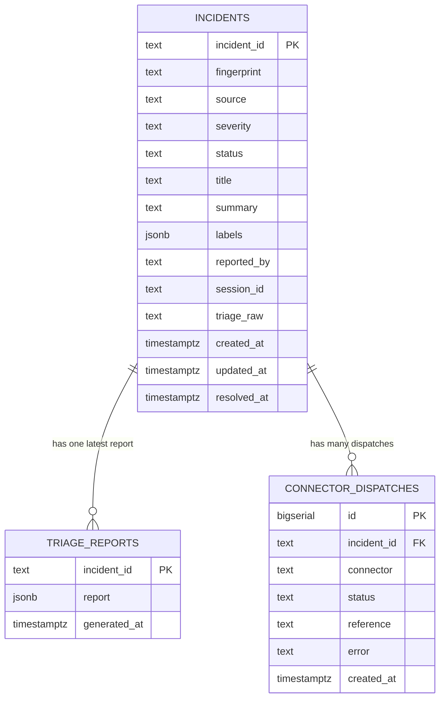
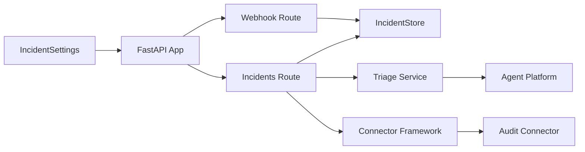

# Incident Service

<cite>
**Referenced Files in This Document**
- [main.py](file://products/incident-service/src/incident_service/main.py)
- [app.py](file://products/incident-service/src/incident_service/app.py)
- [config.py](file://products/incident-service/src/incident_service/core/config.py)
- [connectors.py](file://products/incident-service/src/incident_service/services/connectors.py)
- [normalization.py](file://products/incident-service/src/incident_service/services/normalization.py)
- [triage.py](file://products/incident-service/src/incident_service/services/triage.py)
- [incident_store.py](file://products/incident-service/src/incident_service/services/incident_store.py)
- [webhooks.py](file://products/incident-service/src/incident_service/api/routes/webhooks.py)
- [incidents.py](file://products/incident-service/src/incident_service/api/routes/incidents.py)
- [incident.py](file://products/incident-service/src/incident_service/schemas/incident.py)
- [incident-guide.md](file://docs/guides/incident-guide.md)
</cite>

## Table of Contents
1. [Introduction](#introduction)
2. [Project Structure](#project-structure)
3. [Core Components](#core-components)
4. [Architecture Overview](#architecture-overview)
5. [Detailed Component Analysis](#detailed-component-analysis)
6. [Dependency Analysis](#dependency-analysis)
7. [Performance Considerations](#performance-considerations)
8. [Troubleshooting Guide](#troubleshooting-guide)
9. [Conclusion](#conclusion)
10. [Appendices](#appendices)

## Introduction
The Incident Service ingests alerts from external systems, normalizes them into a canonical incident model, triggers agent-driven triage workflows, and persists validated incident reports. It also provides collaboration dispatch to external surfaces (e.g., audit trail), supports manual incident reporting, and exposes query APIs for the portal and tools. The service is designed for reliability under high-volume alerting with deduplication by fingerprint, robust error handling, and clear escalation paths through triage outcomes.

Key capabilities:
- Alert intake via secure webhook and manual creation
- Normalization of alert payloads into a common schema
- Agent-driven triage with session isolation and structured report validation
- Connector framework to push validated reports to collaboration sinks
- Durable storage with Postgres-backed persistence and in-memory fallback
- Query/list/get endpoints with authorization and pagination

**Section sources**
- [incident-guide.md:10-28](file://docs/guides/incident-guide.md#L10-L28)
- [incident-guide.md:36-73](file://docs/guides/incident-guide.md#L36-L73)

## Project Structure
The service follows a layered FastAPI application structure:
- Entry point and lifespan wiring
- API routes for webhooks and incident management
- Services for normalization, triage orchestration, connectors, and store abstraction
- Schemas defining incident envelopes and triage reports
- Configuration loaded from environment variables

**Diagram sources**
- [app.py:20-69](file://products/incident-service/src/incident_service/app.py#L20-L69)
- [webhooks.py:69-102](file://products/incident-service/src/incident_service/api/routes/webhooks.py#L69-L102)
- [incidents.py:74-283](file://products/incident-service/src/incident_service/api/routes/incidents.py#L74-L283)
- [triage.py:290-371](file://products/incident-service/src/incident_service/services/triage.py#L290-L371)
- [connectors.py:73-127](file://products/incident-service/src/incident_service/services/connectors.py#L73-L127)
- [normalization.py:68-110](file://products/incident-service/src/incident_service/services/normalization.py#L68-L110)
- [incident_store.py:508-517](file://products/incident-service/src/incident_service/services/incident_store.py#L508-L517)

**Section sources**
- [main.py:1-9](file://products/incident-service/src/incident_service/main.py#L1-L9)
- [app.py:20-69](file://products/incident-service/src/incident_service/app.py#L20-L69)

## Core Components
- Webhook intake authenticates incoming alerts, normalizes payloads, and creates or updates incidents based on fingerprint deduplication.
- Manual incident creation enforces payload validation and label limits.
- Triage orchestrator runs a single agent turn in a dedicated session, validates structured output against the triage-report schema, and persists the report.
- Connector framework dispatches validated reports to configured collaboration sinks; failures are recorded but do not abort triage.
- Incident store abstracts backend selection (in-memory vs Postgres) and provides list/get/set operations with indexes for performance.
- Schemas define incident envelopes and triage reports bound to shared contracts.

**Section sources**
- [webhooks.py:69-206](file://products/incident-service/src/incident_service/api/routes/webhooks.py#L69-L206)
- [incidents.py:74-283](file://products/incident-service/src/incident_service/api/routes/incidents.py#L74-L283)
- [triage.py:99-371](file://products/incident-service/src/incident_service/services/triage.py#L99-L371)
- [connectors.py:31-127](file://products/incident-service/src/incident_service/services/connectors.py#L31-L127)
- [incident_store.py:30-517](file://products/incident-service/src/incident_service/services/incident_store.py#L30-L517)
- [incident.py:18-116](file://products/incident-service/src/incident_service/schemas/incident.py#L18-L116)

## Architecture Overview
The service integrates with the broader platform:
- Alertmanager sends firing/resolved groups to the webhook endpoint.
- Triage calls agent-platform over HTTP with read-only mode and structured output requests.
- Connectors emit audit events or other collaboration outputs.
- Portal and tools consume incident data via authenticated query endpoints.

**Diagram sources**
- [webhooks.py:69-206](file://products/incident-service/src/incident_service/api/routes/webhooks.py#L69-L206)
- [incidents.py:235-283](file://products/incident-service/src/incident_service/api/routes/incidents.py#L235-L283)
- [triage.py:189-276](file://products/incident-service/src/incident_service/services/triage.py#L189-L276)
- [connectors.py:87-127](file://products/incident-service/src/incident_service/services/connectors.py#L87-L127)
- [incident_store.py:337-417](file://products/incident-service/src/incident_service/services/incident_store.py#L337-L417)

## Detailed Component Analysis

### Alert Intake and Normalization
- Authentication: bearer token required; missing token results in 503; invalid token returns 401.
- Normalization: maps Alertmanager v4 payload to canonical IncidentInput, enforcing label size limits and severity mapping.
- Deduplication: uses groupKey or label-derived fingerprint to reuse open incidents; resolution idempotently closes known groups.

**Diagram sources**
- [webhooks.py:57-102](file://products/incident-service/src/incident_service/api/routes/webhooks.py#L57-L102)
- [webhooks.py:105-206](file://products/incident-service/src/incident_service/api/routes/webhooks.py#L105-L206)
- [normalization.py:68-110](file://products/incident-service/src/incident_service/services/normalization.py#L68-L110)

**Section sources**
- [webhooks.py:57-206](file://products/incident-service/src/incident_service/api/routes/webhooks.py#L57-L206)
- [normalization.py:15-110](file://products/incident-service/src/incident_service/services/normalization.py#L15-L110)

### Manual Incident Creation and Query
- Manual creation validates title/summary/labels and always creates distinct records (unique fingerprint).
- List endpoint supports filtering by status/severity/source with pagination and parameter validation.
- Get endpoint returns incident envelope plus report and dispatch history when available.

**Diagram sources**
- [incidents.py:74-128](file://products/incident-service/src/incident_service/api/routes/incidents.py#L74-L128)
- [incidents.py:131-206](file://products/incident-service/src/incident_service/api/routes/incidents.py#L131-L206)
- [incident_store.py:105-124](file://products/incident-service/src/incident_service/services/incident_store.py#L105-L124)
- [incident_store.py:352-379](file://products/incident-service/src/incident_service/services/incident_store.py#L352-L379)

**Section sources**
- [incidents.py:74-206](file://products/incident-service/src/incident_service/api/routes/incidents.py#L74-L206)

### Triage Orchestration
- Dedicated session per incident with per-operator fallback if primary session is owned by another operator.
- Requests structured output using the triage-report schema; falls back to fenced block parsing when structured output is absent.
- Server-minted attribution ensures integrity of generated_by, generated_at, incident_id, and session_id.
- On failure, incident is marked triage_failed with raw text preserved for inspection.

**Diagram sources**
- [incidents.py:235-283](file://products/incident-service/src/incident_service/api/routes/incidents.py#L235-L283)
- [triage.py:189-371](file://products/incident-service/src/incident_service/services/triage.py#L189-L371)

**Section sources**
- [triage.py:99-371](file://products/incident-service/src/incident_service/services/triage.py#L99-L371)
- [incidents.py:235-283](file://products/incident-service/src/incident_service/api/routes/incidents.py#L235-L283)

### Connector Framework and Collaboration Dispatch
- Connectors implement a Protocol with name and async dispatch method; built-in audit connector emits structured events.
- Unknown connector names fail fast at startup; dispatch failures are isolated and recorded without aborting triage.
- Each dispatch outcome is persisted per incident for visibility and auditing.

**Diagram sources**
- [connectors.py:31-127](file://products/incident-service/src/incident_service/services/connectors.py#L31-L127)

**Section sources**
- [connectors.py:31-127](file://products/incident-service/src/incident_service/services/connectors.py#L31-L127)

### Incident Store and Persistence
- In-memory store for dev/test; Postgres store for production with tables for incidents, triage_reports, and connector_dispatches.
- Upsert semantics for incidents; latest report wins; dispatches appended per incident.
- Indexes optimize listing and fingerprint lookups.

**Diagram sources**
- [incident_store.py:158-195](file://products/incident-service/src/incident_service/services/incident_store.py#L158-L195)
- [incident_store.py:398-479](file://products/incident-service/src/incident_service/services/incident_store.py#L398-L479)

**Section sources**
- [incident_store.py:30-517](file://products/incident-service/src/incident_service/services/incident_store.py#L30-L517)

### Data Models and Contracts
- Incident envelope includes identity, classification, lifecycle timestamps, and metadata.
- Triage report enforces evidence, hypotheses, next steps, skills cited, and attribution fields.
- Connector dispatch captures delivery status and errors per connector.

**Section sources**
- [incident.py:18-116](file://products/incident-service/src/incident_service/schemas/incident.py#L18-L116)

## Dependency Analysis
- Application lifecycle initializes connectors and store; unknown connectors cause startup failure.
- Routes depend on settings for auth and configuration; triage depends on agent-platform endpoints.
- Store abstraction decouples backend selection; Postgres requires DB URL when selected.

**Diagram sources**
- [app.py:20-69](file://products/incident-service/src/incident_service/app.py#L20-L69)
- [config.py:72-126](file://products/incident-service/src/incident_service/core/config.py#L72-L126)
- [connectors.py:73-127](file://products/incident-service/src/incident_service/services/connectors.py#L73-L127)
- [incident_store.py:508-517](file://products/incident-service/src/incident_service/services/incident_store.py#L508-L517)

**Section sources**
- [app.py:20-69](file://products/incident-service/src/incident_service/app.py#L20-L69)
- [config.py:72-126](file://products/incident-service/src/incident_service/core/config.py#L72-L126)

## Performance Considerations
- High-volume alert processing:
  - Fingerprint-based deduplication avoids duplicate incidents and reduces storage churn.
  - Label cardinality and length limits prevent abuse and ensure efficient indexing.
  - Postgres indexes on status and fingerprint accelerate listing and lookup.
- Triage timeouts:
  - Configurable triage timeout prevents long-running agent turns from blocking resources.
- Connector isolation:
  - Failures in connectors do not impact triage success; outcomes are recorded asynchronously.
- Storage strategy:
  - In-memory store for fast iteration in dev/test; Postgres for durable, scalable operation.

[No sources needed since this section provides general guidance]

## Troubleshooting Guide
- Webhook authentication:
  - Missing token yields 503; invalid token yields 401; malformed payloads yield 400.
- Triage failures:
  - Invalid structured output or missing fenced block marks incident triage_failed; raw text preserved for inspection.
- Session ownership:
  - If the primary session is owned by another operator, triage falls back to a per-operator session; all candidates failing raises an error.
- Connector issues:
  - Unreachable or unauthorized audit service results in failed dispatch; triage still succeeds.

**Section sources**
- [webhooks.py:57-102](file://products/incident-service/src/incident_service/api/routes/webhooks.py#L57-L102)
- [triage.py:279-371](file://products/incident-service/src/incident_service/services/triage.py#L279-L371)
- [connectors.py:87-127](file://products/incident-service/src/incident_service/services/connectors.py#L87-L127)

## Conclusion
The Incident Service provides a robust pipeline for alert ingestion, normalization, triage, and collaboration. Its design emphasizes reliability through deduplication, strict schema validation, isolated connector dispatch, and durable storage. Operators can integrate multiple alert sources, customize triage workflows via agent prompts and structured outputs, and collaborate through connectors while maintaining clear incident lifecycles and escalation paths.

[No sources needed since this section summarizes without analyzing specific files]

## Appendices

### Configuration Reference
- Environment variables control webhook token, query clients, workload clients, store backend, database URL, connectors, agent service URL, triage timeout, and audit service credentials.

**Section sources**
- [config.py:72-126](file://products/incident-service/src/incident_service/core/config.py#L72-L126)

### Example Workflows
- Configure Alertmanager receiver to POST to the webhook endpoint with bearer token.
- Run triage via the incidents API with operator identity and delegated token.
- Generate incident reports from validated triage outcomes and export via portal documents.

**Section sources**
- [incident-guide.md:36-73](file://docs/guides/incident-guide.md#L36-L73)
- [incident-guide.md:123-145](file://docs/guides/incident-guide.md#L123-L145)