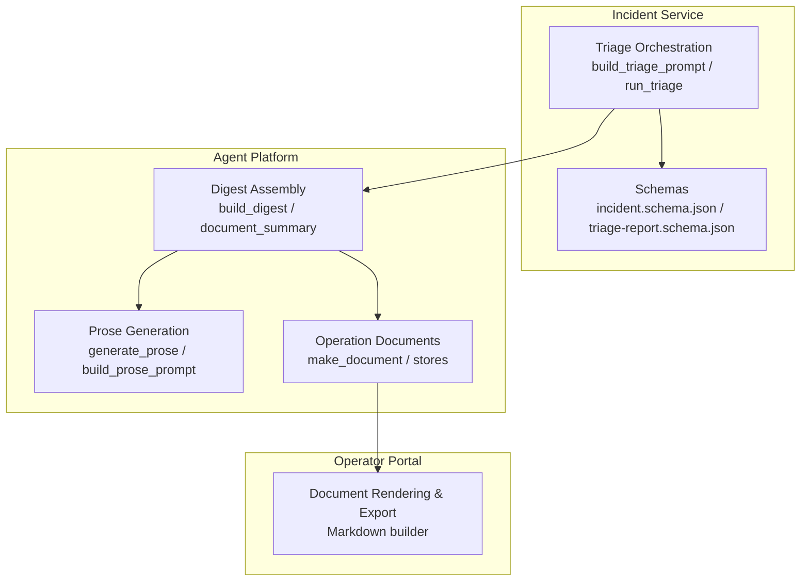
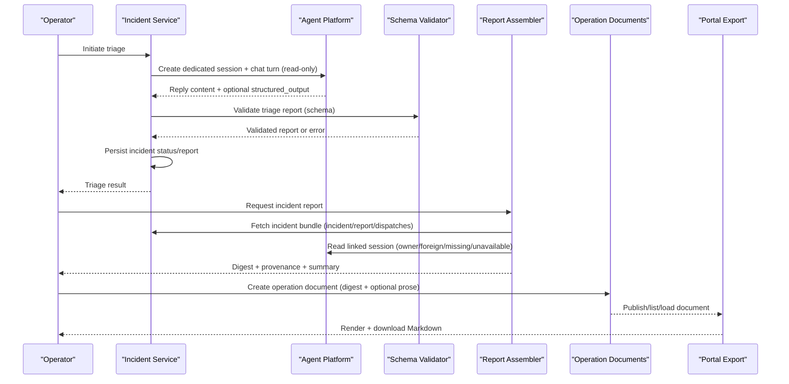
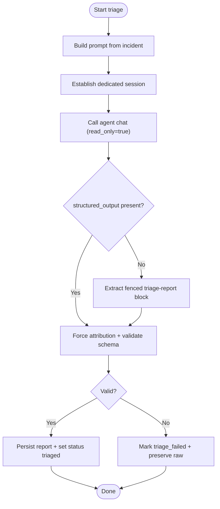
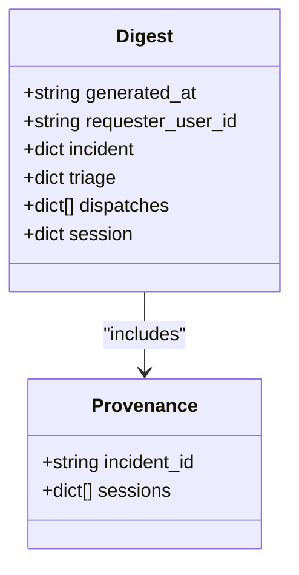
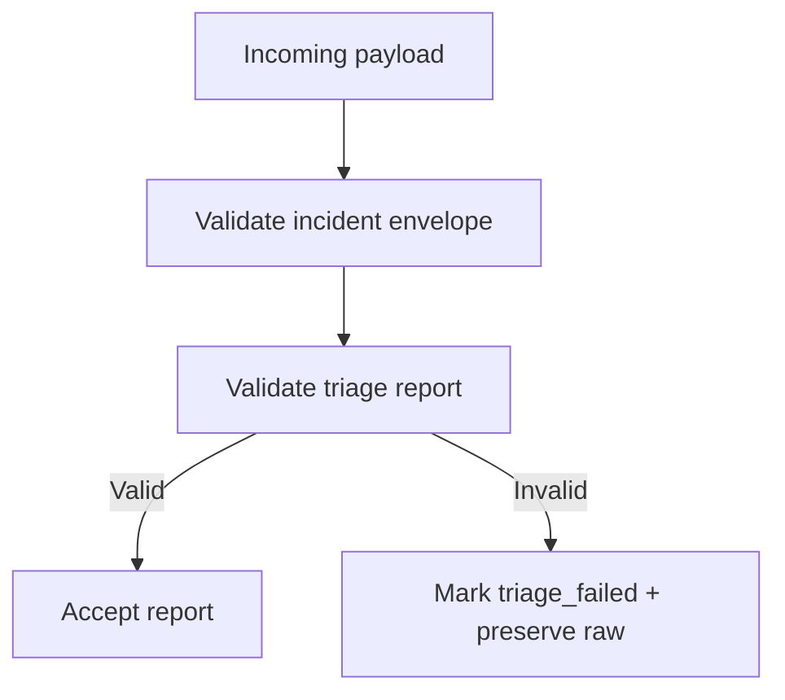
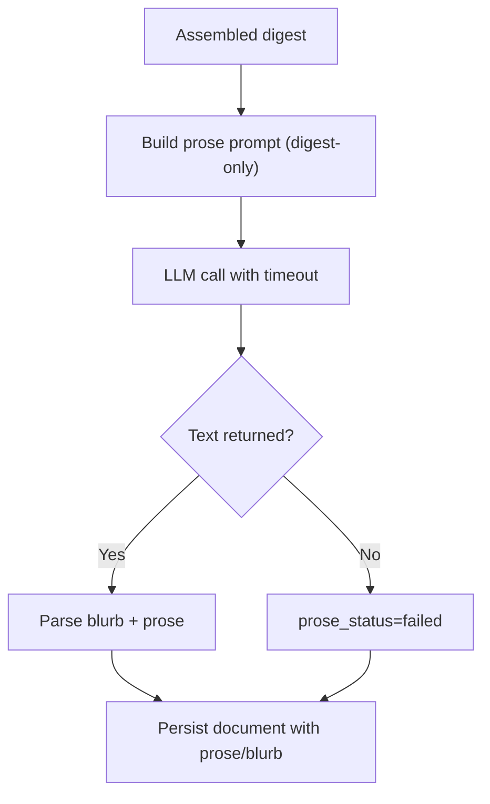
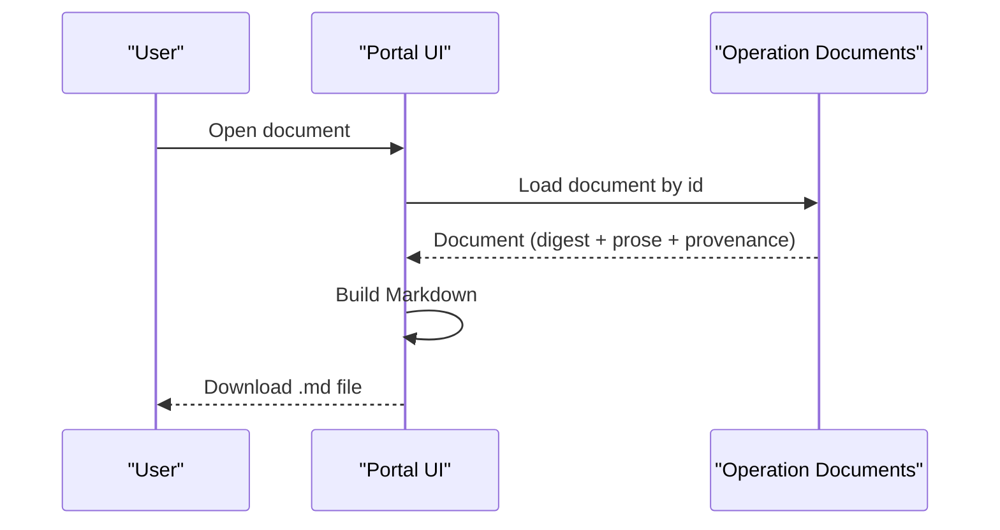
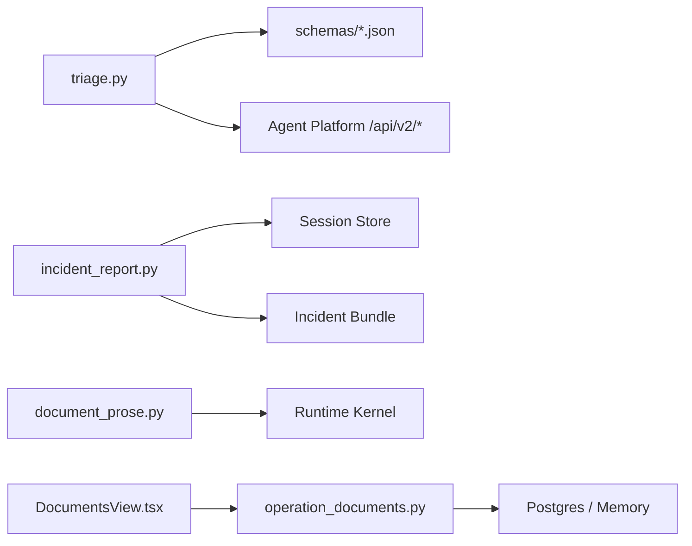

# Report Generation and Validation

<cite>
**Referenced Files in This Document**
- [incident_report.py](file://products/agent-platform/src/agent_service/services/incident_report.py)
- [test_incident_report.py](file://products/agent-platform/tests/test_incident_report.py)
- [triage.py](file://products/incident-service/src/incident_service/services/triage.py)
- [test_triage.py](file://products/incident-service/tests/test_triage.py)
- [incident.schema.json](file://shared/shared-contracts/schemas/incident.schema.json)
- [triage-report.schema.json](file://shared/shared-contracts/schemas/triage-report.schema.json)
- [document_prose.py](file://products/agent-platform/src/agent_service/services/document_prose.py)
- [operation_documents.py](file://products/agent-platform/src/agent_service/services/operation_documents.py)
- [DocumentsView.tsx](file://products/operator-portal/web-ui/app/src/views/workspace/DocumentsView.tsx)
</cite>

## Table of Contents
1. [Introduction](#introduction)
2. [Project Structure](#project-structure)
3. [Core Components](#core-components)
4. [Architecture Overview](#architecture-overview)
5. [Detailed Component Analysis](#detailed-component-analysis)
6. [Dependency Analysis](#dependency-analysis)
7. [Performance Considerations](#performance-considerations)
8. [Troubleshooting Guide](#troubleshooting-guide)
9. [Conclusion](#conclusion)
10. [Appendices](#appendices)

## Introduction
This document explains how the platform generates structured incident reports from triage results, validates report completeness and accuracy, applies formatting templates, and ensures compliance with platform standards. It covers:
- The report schema definitions for incidents and triage reports
- How triage runs produce validated reports
- How incident reports are assembled into deterministic digests with provenance
- Template customization via prose generation prompts
- Validation rules and constraints enforced by schemas and runtime checks
- Export capabilities to Markdown and integration points for external systems
- Data integrity, versioning, audit trail requirements, and performance considerations for large datasets

## Project Structure
The incident report pipeline spans three services and shared contracts:
- Incident service: orchestrates agent triage, validates outputs, and persists outcomes
- Agent platform: assembles incident report digests, optional prose, and operation documents
- Operator portal: renders and exports documents (including incident reports)

**Diagram sources**
- [triage.py:122-136](file://products/incident-service/src/incident_service/services/triage.py#L122-L136)
- [triage.py:290-371](file://products/incident-service/src/incident_service/services/triage.py#L290-L371)
- [incident_report.py:126-167](file://products/agent-platform/src/agent_service/services/incident_report.py#L126-L167)
- [document_prose.py:133-151](file://products/agent-platform/src/agent_service/services/document_prose.py#L133-L151)
- [operation_documents.py:49-87](file://products/agent-platform/src/agent_service/services/operation_documents.py#L49-L87)
- [DocumentsView.tsx:1453-1533](file://products/operator-portal/web-ui/app/src/views/workspace/DocumentsView.tsx#L1453-L1533)

**Section sources**
- [triage.py:1-14](file://products/incident-service/src/incident_service/services/triage.py#L1-L14)
- [incident_report.py:1-26](file://products/agent-platform/src/agent_service/services/incident_report.py#L1-L26)
- [operation_documents.py:1-25](file://products/agent-platform/src/agent_service/services/operation_documents.py#L1-L25)

## Core Components
- Triage orchestration: builds a prompt from an incident, calls the agent platform, captures either kernel-validated structured output or a fenced JSON block, validates against the triage report schema, and persists the outcome.
- Incident report digest assembly: composes a deterministic four-section digest (incident, triage, dispatches, session) with a provenance block and a counts-only summary string.
- Prose generation: optionally produces a human-readable narrative anchored strictly to the digest JSON; fails softly if unavailable.
- Operation documents: persist immutable snapshots of digests and prose with lifecycle states, retention, and publishing controls.
- Portal export: renders documents to Markdown including provenance and digest sections.

**Section sources**
- [triage.py:122-136](file://products/incident-service/src/incident_service/services/triage.py#L122-L136)
- [triage.py:171-186](file://products/incident-service/src/incident_service/services/triage.py#L171-L186)
- [triage.py:290-371](file://products/incident-service/src/incident_service/services/triage.py#L290-L371)
- [incident_report.py:68-83](file://products/agent-platform/src/agent_service/services/incident_report.py#L68-L83)
- [incident_report.py:126-167](file://products/agent-platform/src/agent_service/services/incident_report.py#L126-L167)
- [incident_report.py:177-214](file://products/agent-platform/src/agent_service/services/incident_report.py#L177-L214)
- [document_prose.py:133-151](file://products/agent-platform/src/agent_service/services/document_prose.py#L133-L151)
- [document_prose.py:154-198](file://products/agent-platform/src/agent_service/services/document_prose.py#L154-L198)
- [operation_documents.py:49-87](file://products/agent-platform/src/agent_service/services/operation_documents.py#L49-L87)
- [DocumentsView.tsx:1453-1533](file://products/operator-portal/web-ui/app/src/views/workspace/DocumentsView.tsx#L1453-L1533)

## Architecture Overview
End-to-end flow from triage to exported incident report:

**Diagram sources**
- [triage.py:219-276](file://products/incident-service/src/incident_service/services/triage.py#L219-L276)
- [triage.py:290-371](file://products/incident-service/src/incident_service/services/triage.py#L290-L371)
- [incident_report.py:126-167](file://products/agent-platform/src/agent_service/services/incident_report.py#L126-L167)
- [operation_documents.py:49-87](file://products/agent-platform/src/agent_service/services/operation_documents.py#L49-L87)
- [DocumentsView.tsx:1453-1533](file://products/operator-portal/web-ui/app/src/views/workspace/DocumentsView.tsx#L1453-L1533)

## Detailed Component Analysis

### Triage Orchestration and Validation
- Builds a deterministic prompt embedding incident metadata and discipline rules (read-only tools, no mutating actions).
- Establishes a dedicated session per incident with per-operator fallback.
- Prefers kernel-validated structured output; falls back to parsing a fenced JSON block tagged triage-report.
- Forces server-minted attribution fields (incident_id, session_id, generated_at, generated_by) before validation.
- Validates against the canonical triage report schema; on failure, marks incident triage_failed and preserves raw text.

**Diagram sources**
- [triage.py:122-136](file://products/incident-service/src/incident_service/services/triage.py#L122-L136)
- [triage.py:171-186](file://products/incident-service/src/incident_service/services/triage.py#L171-L186)
- [triage.py:219-276](file://products/incident-service/src/incident_service/services/triage.py#L219-L276)
- [triage.py:290-371](file://products/incident-service/src/incident_service/services/triage.py#L290-L371)

**Section sources**
- [triage.py:122-136](file://products/incident-service/src/incident_service/services/triage.py#L122-L136)
- [triage.py:171-186](file://products/incident-service/src/incident_service/services/triage.py#L171-L186)
- [triage.py:219-276](file://products/incident-service/src/incident_service/services/triage.py#L219-L276)
- [triage.py:290-371](file://products/incident-service/src/incident_service/services/triage.py#L290-L371)
- [test_triage.py:77-113](file://products/incident-service/tests/test_triage.py#L77-L113)
- [test_triage.py:115-206](file://products/incident-service/tests/test_triage.py#L115-L206)
- [test_triage.py:219-362](file://products/incident-service/tests/test_triage.py#L219-L362)
- [test_triage.py:379-463](file://products/incident-service/tests/test_triage.py#L379-L463)

### Incident Report Digest Assembly
- Composes a deterministic digest with four sections:
  - incident: selected envelope fields copied verbatim; raw triage excluded but presence flagged
  - triage: validated report or not_triaged marker
  - dispatches: connector outcomes copied verbatim (possibly empty)
  - session: two-tier posture based on ownership and permissions (owner, foreign, foreign_denied, missing, unavailable)
- Produces a provenance block linking covered incident and sessions with cited record ids
- Generates a counts-only summary string suitable for listing surfaces

**Diagram sources**
- [incident_report.py:68-83](file://products/agent-platform/src/agent_service/services/incident_report.py#L68-L83)
- [incident_report.py:85-123](file://products/agent-platform/src/agent_service/services/incident_report.py#L85-L123)
- [incident_report.py:126-167](file://products/agent-platform/src/agent_service/services/incident_report.py#L126-L167)
- [incident_report.py:177-214](file://products/agent-platform/src/agent_service/services/incident_report.py#L177-L214)

**Section sources**
- [incident_report.py:68-83](file://products/agent-platform/src/agent_service/services/incident_report.py#L68-L83)
- [incident_report.py:85-123](file://products/agent-platform/src/agent_service/services/incident_report.py#L85-L123)
- [incident_report.py:126-167](file://products/agent-platform/src/agent_service/services/incident_report.py#L126-L167)
- [incident_report.py:177-214](file://products/agent-platform/src/agent_service/services/incident_report.py#L177-L214)
- [test_incident_report.py:235-337](file://products/agent-platform/tests/test_incident_report.py#L235-L337)
- [test_incident_report.py:339-366](file://products/agent-platform/tests/test_incident_report.py#L339-L366)

### Schema Definitions and Validation Rules
- Incident envelope schema defines required fields, enums, and length limits for identity, severity, status, timestamps, labels, and optional fields like reported_by, session_id, triage_raw, resolved_at.
- Triage report schema enforces required fields for assessment, evidence arrays, hypotheses, next steps, skills cited, attribution, and session linkage.
- Runtime validation:
  - Triage uses Pydantic model validation after forcing server-minted attribution
  - Fallback fenced-block parser extracts last triage-report block and validates JSON
  - On validation failure, incident is marked triage_failed and raw text preserved

**Diagram sources**
- [incident.schema.json:1-95](file://shared/shared-contracts/schemas/incident.schema.json#L1-L95)
- [triage-report.schema.json:1-120](file://shared/shared-contracts/schemas/triage-report.schema.json#L1-L120)
- [triage.py:147-186](file://products/incident-service/src/incident_service/services/triage.py#L147-L186)
- [triage.py:290-371](file://products/incident-service/src/incident_service/services/triage.py#L290-L371)

**Section sources**
- [incident.schema.json:1-95](file://shared/shared-contracts/schemas/incident.schema.json#L1-L95)
- [triage-report.schema.json:1-120](file://shared/shared-contracts/schemas/triage-report.schema.json#L1-L120)
- [triage.py:147-186](file://products/incident-service/src/incident_service/services/triage.py#L147-L186)
- [test_triage.py:133-206](file://products/incident-service/tests/test_triage.py#L133-L206)

### Template Customization and Prose Generation
- Prose generation uses a digest-only prompt contract that receives only the assembled digest JSON, ensuring narratives cannot fabricate facts absent from the digest.
- Two templates exist:
  - Shift handover template for general operations documents
  - Incident review template tailored for incident reports
- Blurb extraction parses a SUMMARY marker line to provide a bounded one-liner for listings
- Generation is fail-soft: errors yield prose_status=failed while still persisting digest-only documents

**Diagram sources**
- [document_prose.py:35-95](file://products/agent-platform/src/agent_service/services/document_prose.py#L35-L95)
- [document_prose.py:104-151](file://products/agent-platform/src/agent_service/services/document_prose.py#L104-L151)
- [document_prose.py:154-198](file://products/agent-platform/src/agent_service/services/document_prose.py#L154-L198)

**Section sources**
- [document_prose.py:35-95](file://products/agent-platform/src/agent_service/services/document_prose.py#L35-L95)
- [document_prose.py:104-151](file://products/agent-platform/src/agent_service/services/document_prose.py#L104-L151)
- [document_prose.py:154-198](file://products/agent-platform/src/agent_service/services/document_prose.py#L154-L198)

### Export Capabilities and Formatting
- Operation documents store immutable snapshots of digests and prose with lifecycle states (draft/published), owner visibility, and retention policies.
- Portal renders documents to Markdown including:
  - Header and metadata table
  - Optional AI-generated blurb
  - Provenance section (covered incident and sessions)
  - Deterministic digest section
- Export triggers client-side Markdown blob download with sanitized filenames

**Diagram sources**
- [operation_documents.py:49-87](file://products/agent-platform/src/agent_service/services/operation_documents.py#L49-L87)
- [operation_documents.py:127-210](file://products/agent-platform/src/agent_service/services/operation_documents.py#L127-L210)
- [operation_documents.py:380-523](file://products/agent-platform/src/agent_service/services/operation_documents.py#L380-L523)
- [DocumentsView.tsx:1453-1533](file://products/operator-portal/web-ui/app/src/views/workspace/DocumentsView.tsx#L1453-L1533)

**Section sources**
- [operation_documents.py:49-87](file://products/agent-platform/src/agent_service/services/operation_documents.py#L49-L87)
- [operation_documents.py:127-210](file://products/agent-platform/src/agent_service/services/operation_documents.py#L127-L210)
- [operation_documents.py:380-523](file://products/agent-platform/src/agent_service/services/operation_documents.py#L380-L523)
- [DocumentsView.tsx:1453-1533](file://products/operator-portal/web-ui/app/src/views/workspace/DocumentsView.tsx#L1453-L1533)

## Dependency Analysis
Key dependencies and coupling:
- Triage depends on incident schemas and agent platform chat endpoints; it enforces read-only execution and schema validation.
- Digest assembly depends on incident bundles and session store; it degrades gracefully when sessions are missing or unavailable.
- Prose generation depends on the runtime kernel’s model path and is isolated behind timeouts; failures do not break document creation.
- Operation documents depend on backend storage (in-memory or Postgres) with retention and eviction logic.
- Portal rendering depends on document structure and exports Markdown without altering stored data.

**Diagram sources**
- [triage.py:219-276](file://products/incident-service/src/incident_service/services/triage.py#L219-L276)
- [incident_report.py:85-123](file://products/agent-platform/src/agent_service/services/incident_report.py#L85-L123)
- [document_prose.py:154-198](file://products/agent-platform/src/agent_service/services/document_prose.py#L154-L198)
- [operation_documents.py:530-573](file://products/agent-platform/src/agent_service/services/operation_documents.py#L530-L573)

**Section sources**
- [triage.py:219-276](file://products/incident-service/src/incident_service/services/triage.py#L219-L276)
- [incident_report.py:85-123](file://products/agent-platform/src/agent_service/services/incident_report.py#L85-L123)
- [document_prose.py:154-198](file://products/agent-platform/src/agent_service/services/document_prose.py#L154-L198)
- [operation_documents.py:530-573](file://products/agent-platform/src/agent_service/services/operation_documents.py#L530-L573)

## Performance Considerations
- Triage timeouts: configurable per environment to prevent long-running agent turns from blocking operators.
- Digest assembly: read-only and defensive; session store failures degrade to unavailable markers without failing the entire report.
- Prose generation: bounded by a hard timeout; failures return failed status without impacting document persistence.
- Operation documents: per-owner cap and retention-based sweep limit memory and database growth; opportunistic sweeps piggyback on writes.
- Large incident datasets: prefer envelope-only summaries for list views; avoid loading full transcripts or payloads into digests to keep responses small and fast.

[No sources needed since this section provides general guidance]

## Troubleshooting Guide
Common issues and resolutions:
- Triage validation failures: check triage report schema conformance; ensure required fields and enum values match; inspect preserved raw text when triage_failed.
- Missing triage block: when structured_output is absent, verify the agent returns a fenced triage-report block containing valid JSON.
- Session access denied: digest assembly returns foreign_denied when the requester lacks permission; adjust permissions or request as owner.
- Session unavailable: indicates session store outage or expired retention; digest still includes incident and triage sections.
- Prose generation failures: prose_status=failed; digest remains available; retry later or disable prose generation.

**Section sources**
- [triage.py:147-186](file://products/incident-service/src/incident_service/services/triage.py#L147-L186)
- [triage.py:290-371](file://products/incident-service/src/incident_service/services/triage.py#L290-L371)
- [incident_report.py:85-123](file://products/agent-platform/src/agent_service/services/incident_report.py#L85-L123)
- [document_prose.py:154-198](file://products/agent-platform/src/agent_service/services/document_prose.py#L154-L198)
- [test_triage.py:175-206](file://products/incident-service/tests/test_triage.py#L175-L206)
- [test_incident_report.py:284-331](file://products/agent-platform/tests/test_incident_report.py#L284-L331)

## Conclusion
The incident report system combines strict schema validation, deterministic digest assembly, and safe prose generation to produce compliant, auditable incident reports. Triage outputs are validated and attributed server-side; digests exclude sensitive raw content while preserving provenance anchors. Operation documents provide durable, versioned snapshots with retention controls, and the portal offers straightforward Markdown export. The design emphasizes reliability through graceful degradation and bounded resource usage, making it suitable for large-scale incident workflows.

[No sources needed since this section summarizes without analyzing specific files]

## Appendices

### Creating Custom Report Templates
- Use the incident review prose template to tailor narrative framing for incident follow-ups; the template accepts only the assembled digest JSON to maintain anchoring rules.
- Adjust prompt wording within the incident-specific template to emphasize different aspects (e.g., triage conclusions, dispatch outcomes, session coverage).
- Ensure any customizations preserve the SUMMARY marker convention so blurb extraction continues to work.

**Section sources**
- [document_prose.py:67-95](file://products/agent-platform/src/agent_service/services/document_prose.py#L67-L95)
- [document_prose.py:104-151](file://products/agent-platform/src/agent_service/services/document_prose.py#L104-L151)

### Configuring Validation Rules
- Enforce schema constraints at intake and triage stages using the canonical incident and triage report schemas.
- Rely on server-minted attribution to prevent spoofing of identity and timestamps in reports.
- Treat validation failures as triage_failed events with preserved raw text for operator inspection.

**Section sources**
- [incident.schema.json:1-95](file://shared/shared-contracts/schemas/incident.schema.json#L1-L95)
- [triage-report.schema.json:1-120](file://shared/shared-contracts/schemas/triage-report.schema.json#L1-L120)
- [triage.py:147-186](file://products/incident-service/src/incident_service/services/triage.py#L147-L186)

### Generating Different Report Formats
- Digests are language-agnostic JSON structures suitable for programmatic consumption.
- For human-readable formats, use the portal’s Markdown export which includes provenance and digest sections.
- Optionally include AI-generated prose for richer context; fall back to digest-only when prose generation fails.

**Section sources**
- [incident_report.py:126-167](file://products/agent-platform/src/agent_service/services/incident_report.py#L126-L167)
- [DocumentsView.tsx:1453-1533](file://products/operator-portal/web-ui/app/src/views/workspace/DocumentsView.tsx#L1453-L1533)
- [document_prose.py:154-198](file://products/agent-platform/src/agent_service/services/document_prose.py#L154-L198)

### Integrating with External Reporting Systems
- Use the incident bundle (incident/report/dispatches) fetched by the digest assembler as the canonical payload for external integrations.
- Include provenance blocks to anchor reports to covered incidents and sessions.
- Apply consistent field naming and enum values defined in the incident and triage report schemas to ensure compatibility.

**Section sources**
- [incident_report.py:126-167](file://products/agent-platform/src/agent_service/services/incident_report.py#L126-L167)
- [incident.schema.json:1-95](file://shared/shared-contracts/schemas/incident.schema.json#L1-L95)
- [triage-report.schema.json:1-120](file://shared/shared-contracts/schemas/triage-report.schema.json#L1-L120)

### Data Integrity Checks, Versioning, and Audit Trail
- Data integrity: enforced by schema validation and server-minted attribution; raw triage text preserved only on failure.
- Versioning: operation documents are immutable snapshots created at draft state and published once; subsequent edits are not allowed.
- Audit trail: provenance blocks capture covered incident and sessions with coverage and cited record ids; logs record triage start/completion/failure events.

**Section sources**
- [triage.py:290-371](file://products/incident-service/src/incident_service/services/triage.py#L290-L371)
- [operation_documents.py:49-87](file://products/agent-platform/src/agent_service/services/operation_documents.py#L49-L87)
- [operation_documents.py:127-210](file://products/agent-platform/src/agent_service/services/operation_documents.py#L127-L210)
- [incident_report.py:126-167](file://products/agent-platform/src/agent_service/services/incident_report.py#L126-L167)