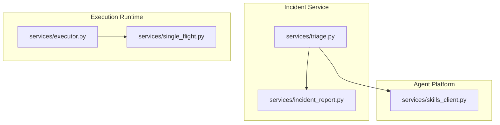
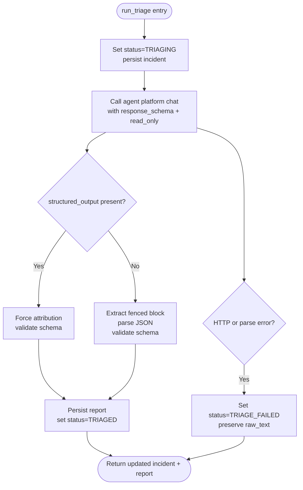
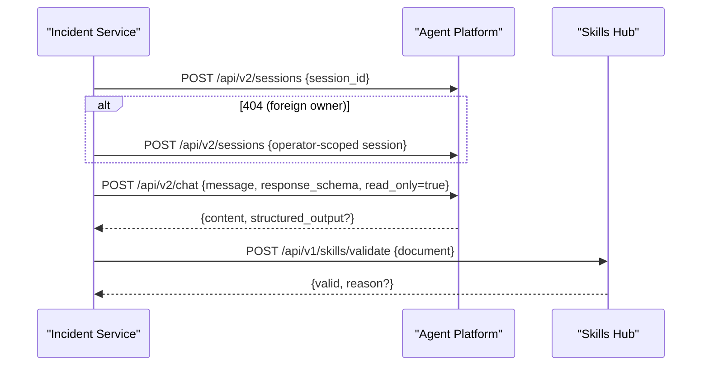
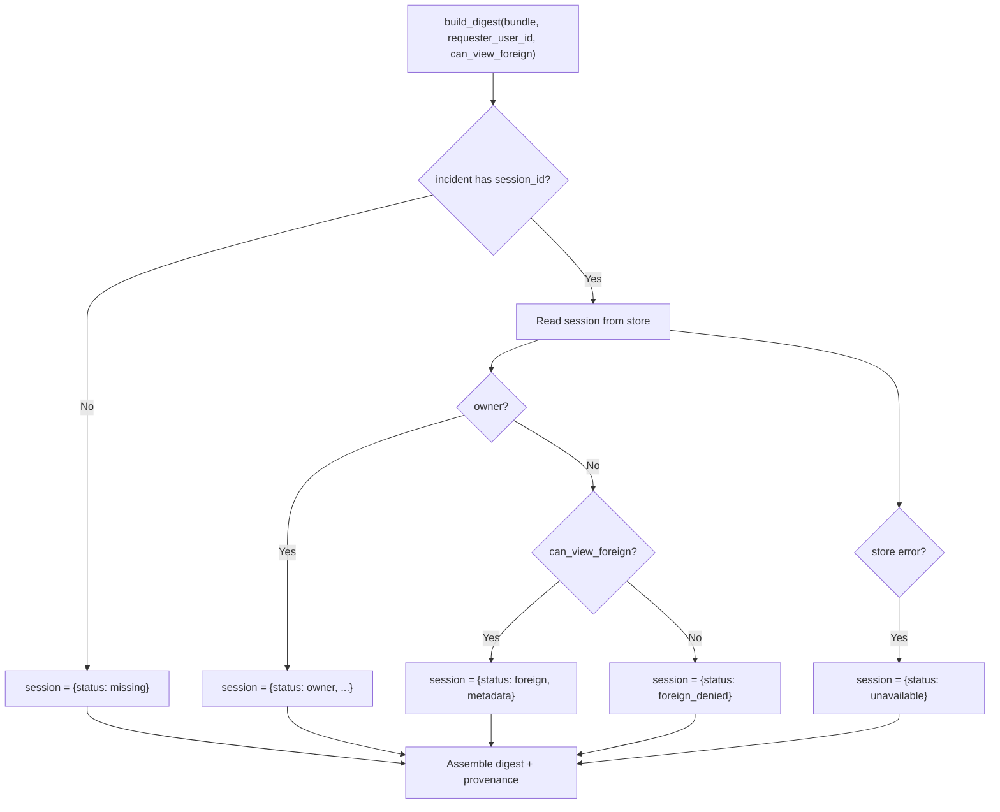
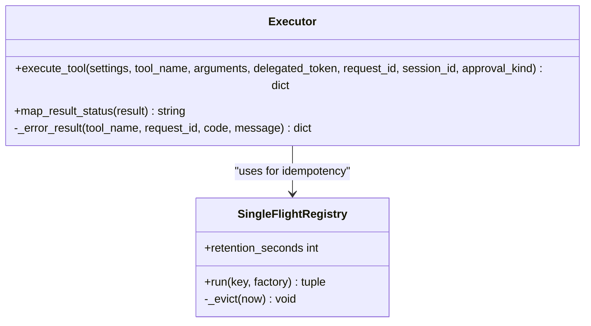
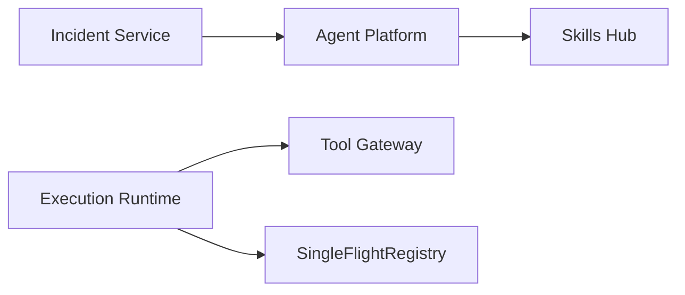

# Triage Orchestration

<cite>
**Referenced Files in This Document**
- [triage.py](file://products/incident-service/src/incident_service/services/triage.py)
- [incident_report.py](file://products/agent-platform/src/agent_service/services/incident_report.py)
- [skills_client.py](file://products/agent-platform/src/agent_service/services/skills_client.py)
- [executor.py](file://products/execution-runtime/src/execution_runtime/services/executor.py)
- [single_flight.py](file://products/execution-runtime/src/execution_runtime/services/single_flight.py)
- [SPEC-015 plan.md](file://docs/specs/SPEC-015-incident-triage-and-collaboration/plan.md)
- [SPEC-015 spec.md](file://docs/specs/SPEC-015-incident-triage-and-collaboration/spec.md)
- [SPEC-017 plan.md](file://docs/specs/SPEC-017-agent-kernel-utilization-and-durability/plan.md)
- [SPEC-038 plan.md](file://docs/specs/SPEC-038-isolated-execution-worker/plan.md)
- [SPEC-049 browser tools expansion and samples](file://docs/specs/SPEC-049-browser-web-check-tools/spec.md)
- [SPEC-054 action approval and change request card](file://docs/specs/SPEC-054-action-approval-and-change-request-card/spec.md)
</cite>

## Table of Contents
1. [Introduction](#introduction)
2. [Project Structure](#project-structure)
3. [Core Components](#core-components)
4. [Architecture Overview](#architecture-overview)
5. [Detailed Component Analysis](#detailed-component-analysis)
6. [Dependency Analysis](#dependency-analysis)
7. [Performance Considerations](#performance-considerations)
8. [Troubleshooting Guide](#troubleshooting-guide)
9. [Conclusion](#conclusion)
10. [Appendices](#appendices)

## Introduction
This document explains the triage orchestration engine that coordinates agent-driven incident investigation workflows. It covers how incidents trigger automated triage, how the system orchestrates read-only skill execution for investigation steps, manages state transitions during triage, and handles concurrent triage operations. It also documents configuration patterns, skill invocation behavior, long-running state management, error recovery, monitoring, and performance considerations for parallel execution, timeouts, and resource management.

The triage flow is intentionally read-only: the agent gathers evidence using read-only tools (for example, Kubernetes and Elastic connectors and skills.search), never executes mutating actions, and produces a structured triage report that is validated against a shared schema before being persisted.

## Project Structure
Triage orchestration spans three services:
- Incident Service owns triage lifecycle, session selection, prompt assembly, agent call, validation, and status updates.
- Agent Platform provides the agent runtime, session management, and skill access used by triage turns.
- Execution Runtime supports later remediation flows invoked from triage next steps via isolated tool execution with single-flight idempotency.



**Diagram sources**
- [triage.py:1-371](file://products/incident-service/src/incident_service/services/triage.py#L1-L371)
- [incident_report.py:1-215](file://products/agent-platform/src/agent_service/services/incident_report.py#L1-L215)
- [skills_client.py:1-115](file://products/agent-platform/src/agent_service/services/skills_client.py#L1-L115)
- [executor.py:1-152](file://products/execution-runtime/src/execution_runtime/services/executor.py#L1-L152)
- [single_flight.py:1-107](file://products/execution-runtime/src/execution_runtime/services/single_flight.py#L1-L107)

**Section sources**
- [triage.py:1-371](file://products/incident-service/src/incident_service/services/triage.py#L1-L371)
- [incident_report.py:1-215](file://products/agent-platform/src/agent_service/services/incident_report.py#L1-L215)
- [skills_client.py:1-115](file://products/agent-platform/src/agent_service/services/skills_client.py#L1-L115)
- [executor.py:1-152](file://products/execution-runtime/src/execution_runtime/services/executor.py#L1-L152)
- [single_flight.py:1-107](file://products/execution-runtime/src/execution_runtime/services/single_flight.py#L1-L107)

## Core Components
- Triage runner: builds a dedicated per-incident agent session, constructs a read-only triage prompt, calls the agent platform chat endpoint with a response schema, validates the result, and persists outcomes.
- Session strategy: prefers a shared incident session; falls back to an operator-scoped session when ownership conflicts occur.
- Report parsing: prefers kernel-validated structured output; falls back to fenced block extraction and JSON validation.
- Incident report digest: assembles a deterministic view including triage presence, dispatches, and linked session coverage posture.
- Skill validation client: validates generated skill drafts against the skills-hub ingestion contract.
- Execution worker: performs one-shot tool invocations through the tool gateway with delegated tokens and single-flight deduplication.

Key behaviors grounded in source:
- Triage is strictly diagnostic and read-only; mutating tools are excluded from this turn’s toolkit.
- Structured output is requested via a response schema; if absent, a fenced block parser is used.
- Attribution fields are forced server-side to prevent spoofing.
- Single-flight guarantees ensure exactly-once execution per execution_id within a process lifetime.

**Section sources**
- [triage.py:43-92](file://products/incident-service/src/incident_service/services/triage.py#L43-L92)
- [triage.py:122-136](file://products/incident-service/src/incident_service/services/triage.py#L122-L136)
- [triage.py:171-186](file://products/incident-service/src/incident_service/services/triage.py#L171-L186)
- [triage.py:189-216](file://products/incident-service/src/incident_service/services/triage.py#L189-L216)
- [triage.py:219-276](file://products/incident-service/src/incident_service/services/triage.py#L219-L276)
- [triage.py:290-370](file://products/incident-service/src/incident_service/services/triage.py#L290-L370)
- [incident_report.py:126-167](file://products/agent-platform/src/agent_service/services/incident_report.py#L126-L167)
- [skills_client.py:69-114](file://products/agent-platform/src/agent_service/services/skills_client.py#L69-L114)
- [executor.py:23-151](file://products/execution-runtime/src/execution_runtime/services/executor.py#L23-L151)
- [single_flight.py:35-84](file://products/execution-runtime/src/execution_runtime/services/single_flight.py#L35-L84)

## Architecture Overview
The triage orchestration follows a clear sequence:
1. The incident service marks the incident as triaging and selects a session.
2. It calls the agent platform to run a read-only triage turn with a structured response schema.
3. The agent uses read-only tools and skills.search to gather evidence and propose next steps.
4. The incident service validates and persists the triage report and sets the incident to triaged or triage_failed.
5. Consumers can build an incident report digest that includes triage presence and linked session coverage posture.
6. Later, remediation may be executed via the execution runtime, which invokes tools through the tool gateway with single-flight idempotency.

```mermaid
sequenceDiagram
participant IS as "Incident Service"
participant AP as "Agent Platform"
participant ER as "Execution Runtime"
participant TG as "Tool Gateway"
IS->>AP : Create or reuse session (incident-<id>)
IS->>AP : POST /api/v2/chat with message + response_schema + read_only=true
AP-->>IS : content + optional structured_output
IS->>IS : Validate report (schema or fenced block)
IS->>IS : Persist report, set status triaged or triage_failed
Note over IS,AP : Triage is read-only; no mutating tools execute
IS->>ER : Optional later handoff to execute approved tool
ER->>TG : Invoke tool with delegated token
TG-->>ER : Tool result
ER-->>IS : Receipt with mapped status
```

**Diagram sources**
- [triage.py:189-276](file://products/incident-service/src/incident_service/services/triage.py#L189-L276)
- [triage.py:290-370](file://products/incident-service/src/incident_service/services/triage.py#L290-L370)
- [executor.py:23-151](file://products/execution-runtime/src/execution_runtime/services/executor.py#L23-L151)

## Detailed Component Analysis

### Triage Runner and State Management
- Dedicated session per incident with fallback per operator to handle ownership conflicts.
- Prompt templating injects incident metadata and enforces read-only discipline.
- Structured output preference with fenced-block fallback ensures robust parsing.
- Server-forced attribution prevents spoofing of who ran triage.
- Status transitions:
  - Start: set to triaging with session_id.
  - Success: set to triaged and persist report.
  - Failure: set to triage_failed and preserve raw text up to a safe limit.



**Diagram sources**
- [triage.py:290-370](file://products/incident-service/src/incident_service/services/triage.py#L290-L370)
- [triage.py:171-186](file://products/incident-service/src/incident_service/services/triage.py#L171-L186)
- [triage.py:189-216](file://products/incident-service/src/incident_service/services/triage.py#L189-L216)

**Section sources**
- [triage.py:99-119](file://products/incident-service/src/incident_service/services/triage.py#L99-L119)
- [triage.py:122-136](file://products/incident-service/src/incident_service/services/triage.py#L122-L136)
- [triage.py:171-186](file://products/incident-service/src/incident_service/services/triage.py#L171-L186)
- [triage.py:219-276](file://products/incident-service/src/incident_service/services/triage.py#L219-L276)
- [triage.py:279-287](file://products/incident-service/src/incident_service/services/triage.py#L279-L287)
- [triage.py:290-370](file://products/incident-service/src/incident_service/services/triage.py#L290-L370)

### Agent Platform Integration and Skill Invocation
- Session establishment tries the shared incident session first; on 404 it falls back to an operator-scoped session.
- Chat call requests structured output via a response schema; read_only mode is enforced so only read tools execute.
- Skills validation client communicates with skills-hub to validate generated skill drafts, mapping upstream errors to structured responses.



**Diagram sources**
- [triage.py:189-216](file://products/incident-service/src/incident_service/services/triage.py#L189-L216)
- [triage.py:219-276](file://products/incident-service/src/incident_service/services/triage.py#L219-L276)
- [skills_client.py:69-114](file://products/agent-platform/src/agent_service/services/skills_client.py#L69-L114)

**Section sources**
- [triage.py:189-216](file://products/incident-service/src/incident_service/services/triage.py#L189-L216)
- [triage.py:219-276](file://products/incident-service/src/incident_service/services/triage.py#L219-L276)
- [skills_client.py:52-54](file://products/agent-platform/src/agent_service/services/skills_client.py#L52-L54)
- [skills_client.py:69-114](file://products/agent-platform/src/agent_service/services/skills_client.py#L69-L114)

### Incident Report Digest and Session Coverage Posture
- Builds a deterministic digest excluding raw triage text, marking its presence instead.
- Includes triage presence or not_triaged marker.
- Respects two-tier session visibility: owner full digest, foreign metadata-only when permitted, denied otherwise, missing when no session id, unavailable when store fails.



**Diagram sources**
- [incident_report.py:85-123](file://products/agent-platform/src/agent_service/services/incident_report.py#L85-L123)
- [incident_report.py:126-167](file://products/agent-platform/src/agent_service/services/incident_report.py#L126-L167)

**Section sources**
- [incident_report.py:1-26](file://products/agent-platform/src/agent_service/services/incident_report.py#L1-L26)
- [incident_report.py:68-83](file://products/agent-platform/src/agent_service/services/incident_report.py#L68-L83)
- [incident_report.py:85-123](file://products/agent-platform/src/agent_service/services/incident_report.py#L85-L123)
- [incident_report.py:126-167](file://products/agent-platform/src/agent_service/services/incident_report.py#L126-L167)

### Execution Runtime: One-Shot Tool Invocation and Single Flight
- Executes exactly one tool invocation per handoff, forwarding delegated tokens and correlation handles.
- Maps timeouts and transport failures into structured results consistent with resumed-stream receipts.
- Single-flight registry deduplicates concurrent executions keyed by execution_id with bounded retention.



**Diagram sources**
- [executor.py:23-151](file://products/execution-runtime/src/execution_runtime/services/executor.py#L23-L151)
- [single_flight.py:35-84](file://products/execution-runtime/src/execution_runtime/services/single_flight.py#L35-L84)

**Section sources**
- [executor.py:23-151](file://products/execution-runtime/src/execution_runtime/services/executor.py#L23-L151)
- [single_flight.py:1-107](file://products/execution-runtime/src/execution_runtime/services/single_flight.py#L1-L107)

## Dependency Analysis
- Incident Service depends on Agent Platform for agent sessions and chat turns, and on shared schemas for validation.
- Agent Platform integrates with Skills Hub for draft validation and with session stores for coverage posture.
- Execution Runtime depends on Tool Gateway for tool invocations and uses in-process single-flight for idempotency.



**Diagram sources**
- [triage.py:189-276](file://products/incident-service/src/incident_service/services/triage.py#L189-L276)
- [skills_client.py:69-114](file://products/agent-platform/src/agent_service/services/skills_client.py#L69-L114)
- [executor.py:23-151](file://products/execution-runtime/src/execution_runtime/services/executor.py#L23-L151)
- [single_flight.py:35-84](file://products/execution-runtime/src/execution_runtime/services/single_flight.py#L35-L84)

**Section sources**
- [triage.py:189-276](file://products/incident-service/src/incident_service/services/triage.py#L189-L276)
- [skills_client.py:69-114](file://products/agent-platform/src/agent_service/services/skills_client.py#L69-L114)
- [executor.py:23-151](file://products/execution-runtime/src/execution_runtime/services/executor.py#L23-L151)
- [single_flight.py:35-84](file://products/execution-runtime/src/execution_runtime/services/single_flight.py#L35-L84)

## Performance Considerations
- Parallel triage execution:
  - Each incident runs in its own dedicated session; concurrency is limited by the number of incidents and agent platform capacity.
  - Timeouts are applied to agent platform calls to avoid blocking resources indefinitely.
- Timeout handling:
  - Triage calls use a configurable timeout for the agent platform chat endpoint.
  - Execution runtime maps timeouts to structured results for consistent downstream handling.
- Resource management:
  - Single-flight registry bounds completed flight retention and caps the number of cached outcomes to prevent memory growth under replay storms.
  - Incident report digest avoids loading sensitive raw triage text and degrades gracefully when session store is unavailable.

[No sources needed since this section provides general guidance]

## Troubleshooting Guide
Common issues and their indicators:
- No fenced triage-report block or invalid JSON: indicates agent reply did not conform to expected format; check agent logs and prompt template usage.
- Schema validation failure: triage report payload does not match the contract; inspect required fields and types.
- Agent platform session creation returns non-2xx: investigate ownership conflicts or misconfiguration; the runner falls back to operator-scoped sessions on 404.
- Agent platform returns non-JSON or empty content: verify connectivity and response shape.
- Skills validation dependency not configured or unavailable: generation routes should return appropriate HTTP statuses; ensure skills service URL and secret are set.
- Execution runtime cannot reach tool gateway: transport errors map to structured results; confirm gateway configuration and network connectivity.

Operational tips:
- Monitor triage_started, triage_completed, and triage_failed events emitted during triage runs.
- Use incident report digests to quickly assess triage presence and session coverage posture without exposing raw triage text.
- For repeated handoffs or replays, rely on single-flight to serve cached outcomes and avoid duplicate tool invocations.

**Section sources**
- [triage.py:171-186](file://products/incident-service/src/incident_service/services/triage.py#L171-L186)
- [triage.py:219-276](file://products/incident-service/src/incident_service/services/triage.py#L219-L276)
- [skills_client.py:52-54](file://products/agent-platform/src/agent_service/services/skills_client.py#L52-L54)
- [skills_client.py:69-114](file://products/agent-platform/src/agent_service/services/skills_client.py#L69-L114)
- [executor.py:23-151](file://products/execution-runtime/src/execution_runtime/services/executor.py#L23-L151)
- [incident_report.py:85-123](file://products/agent-platform/src/agent_service/services/incident_report.py#L85-L123)

## Conclusion
The triage orchestration engine provides a robust, read-only investigation workflow that leverages agent capabilities to gather evidence and propose next steps while enforcing strict safety and validation boundaries. It manages state transitions deterministically, supports concurrent operations with timeouts and single-flight guarantees, and exposes durable artifacts such as validated reports and incident report digests. Operators can extend investigations through later execution flows with strong identity delegation and idempotency.

[No sources needed since this section summarizes without analyzing specific files]

## Appendices

### Triage Workflow Configuration
- Agent platform integration:
  - Ensure agent_service_url is configured for chat and session endpoints.
  - Configure triage_timeout_seconds to bound agent calls.
- Skills validation:
  - Provide skills_service_url and credentials to enable draft validation.
- Execution runtime:
  - Provide tool_gateway_url and gateway_timeout_seconds for tool invocations.

**Section sources**
- [triage.py:219-276](file://products/incident-service/src/incident_service/services/triage.py#L219-L276)
- [skills_client.py:52-54](file://products/agent-platform/src/agent_service/services/skills_client.py#L52-L54)
- [executor.py:23-151](file://products/execution-runtime/src/execution_runtime/services/executor.py#L23-L151)

### Skill Dependencies and Read-Only Enforcement
- Triage uses read-only tools and skills.search; mutating tools are excluded from this turn’s toolkit.
- Browser-related write tools are not part of triage; they are reserved for later remediation flows with explicit approvals.

**Section sources**
- [triage.py:43-92](file://products/incident-service/src/incident_service/services/triage.py#L43-L92)
- [triage.py:219-276](file://products/incident-service/src/incident_service/services/triage.py#L219-L276)
- [SPEC-049 browser tools expansion and samples](file://docs/specs/SPEC-049-browser-web-check-tools/spec.md)
- [SPEC-054 action approval and change request card](file://docs/specs/SPEC-054-action-approval-and-change-request-card/spec.md)

### Monitoring and Observability
- Emit triage_started, triage_completed, and triage_failed events during triage runs.
- Record metrics for triage outcomes to support dashboards and alerts.
- Use incident report digests to surface triage presence and session coverage posture without exposing raw triage text.

**Section sources**
- [triage.py:290-370](file://products/incident-service/src/incident_service/services/triage.py#L290-L370)
- [incident_report.py:126-167](file://products/agent-platform/src/agent_service/services/incident_report.py#L126-L167)

### Examples: Defining Custom Triage Workflows and Next Steps
- Triage prompts instruct agents to gather evidence, cite skills, and propose ranked next steps with priorities.
- Next steps are advisory in triage; actual execution occurs later via the execution runtime with approvals and delegated tokens.
- To define custom workflows, author skills and runbooks referenced by skills.search; validate drafts through the skills validation client before deployment.

**Section sources**
- [triage.py:43-92](file://products/incident-service/src/incident_service/services/triage.py#L43-L92)
- [skills_client.py:69-114](file://products/agent-platform/src/agent_service/services/skills_client.py#L69-L114)
- [executor.py:23-151](file://products/execution-runtime/src/execution_runtime/services/executor.py#L23-L151)

### Handling Triage Failures and Recovery
- On failure, incidents are marked triage_failed with preserved raw text for debugging.
- Re-run triage by invoking the same run_triage path; session fallback ensures resilience across operators.
- For execution failures, rely on single-flight to deduplicate retries and map errors consistently.

**Section sources**
- [triage.py:279-287](file://products/incident-service/src/incident_service/services/triage.py#L279-L287)
- [triage.py:290-370](file://products/incident-service/src/incident_service/services/triage.py#L290-L370)
- [single_flight.py:35-84](file://products/execution-runtime/src/execution_runtime/services/single_flight.py#L35-L84)

### Specifications Reference
- Incident triage and collaboration scope and requirements.
- Agent kernel utilization and durability expectations for structured outputs.
- Isolated execution worker constraints and idempotency guarantees.
- Browser tool expansion and approval card semantics for later remediation.

**Section sources**
- [SPEC-015 plan.md](file://docs/specs/SPEC-015-incident-triage-and-collaboration/plan.md)
- [SPEC-015 spec.md](file://docs/specs/SPEC-015-incident-triage-and-collaboration/spec.md)
- [SPEC-017 plan.md](file://docs/specs/SPEC-017-agent-kernel-utilization-and-durability/plan.md)
- [SPEC-038 plan.md](file://docs/specs/SPEC-038-isolated-execution-worker/plan.md)
- [SPEC-049 browser tools expansion and samples](file://docs/specs/SPEC-049-browser-web-check-tools/spec.md)
- [SPEC-054 action approval and change request card](file://docs/specs/SPEC-054-action-approval-and-change-request-card/spec.md)