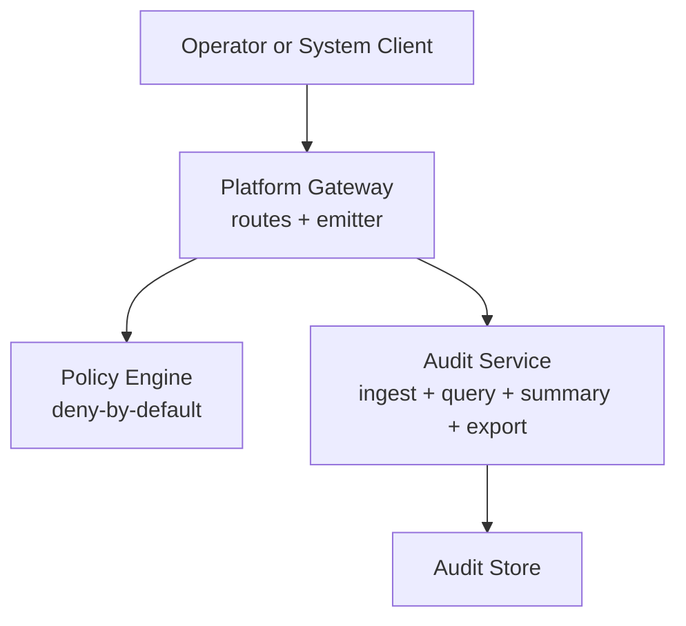
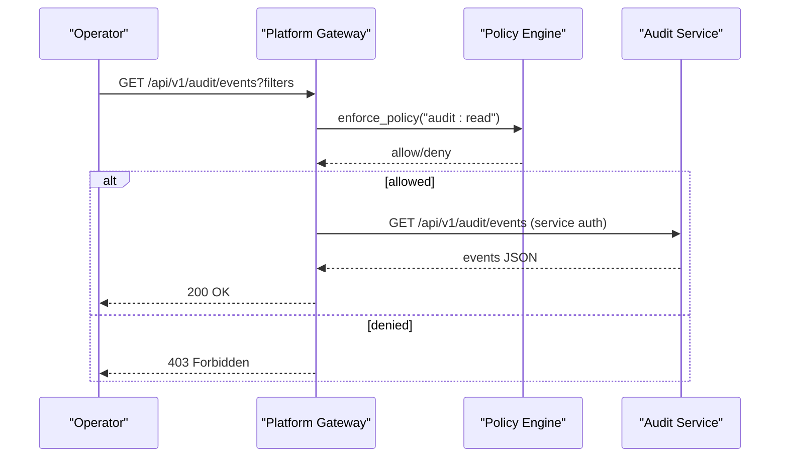
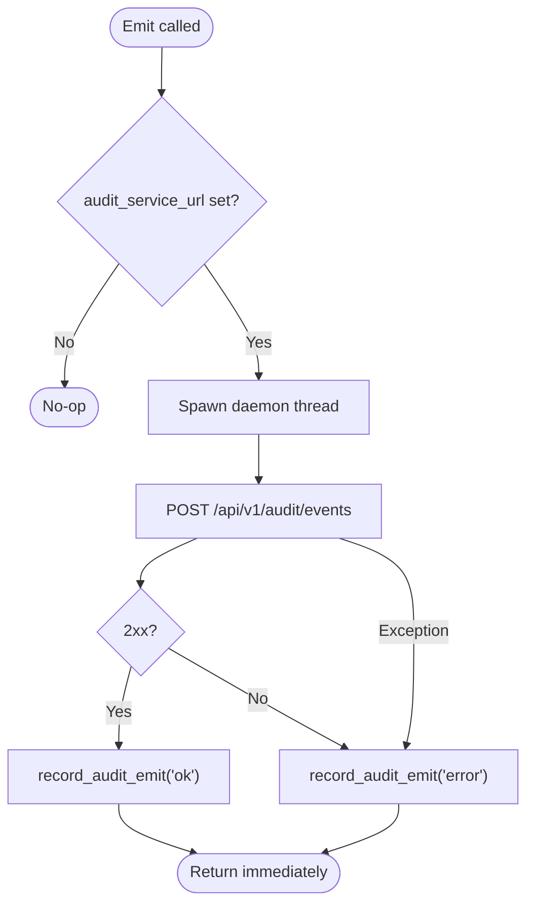
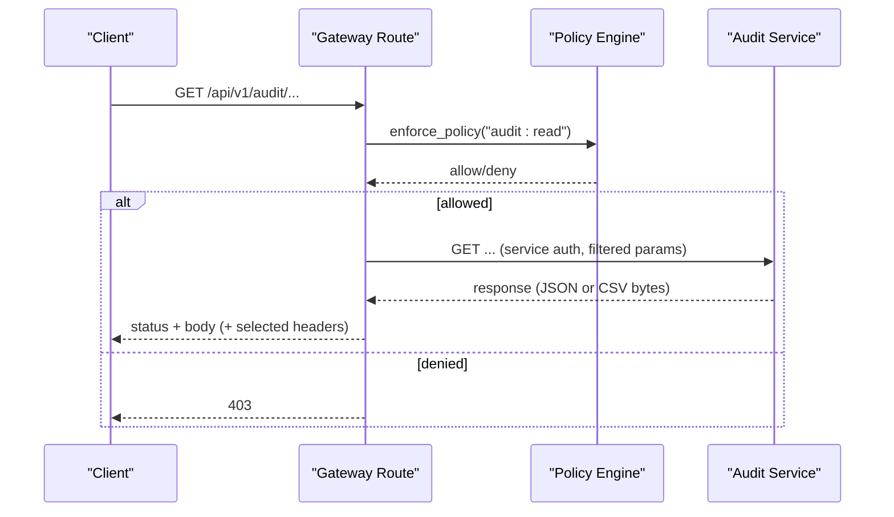
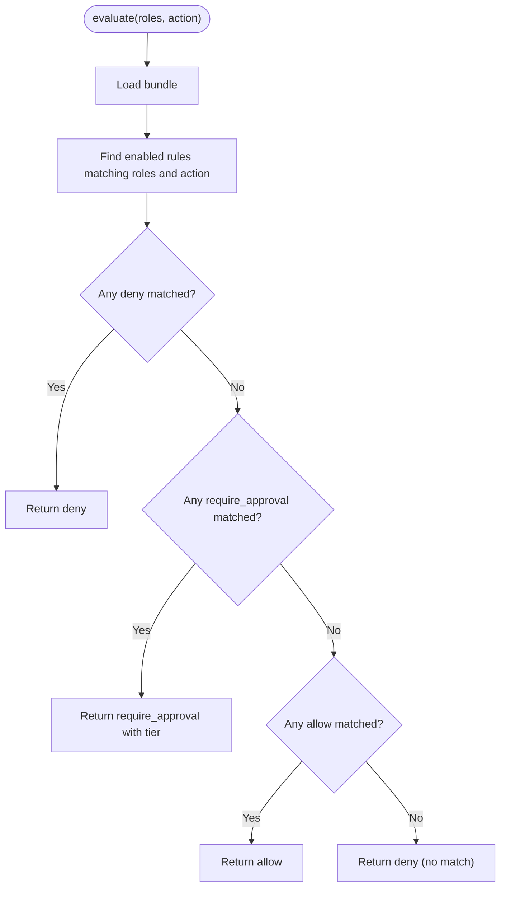
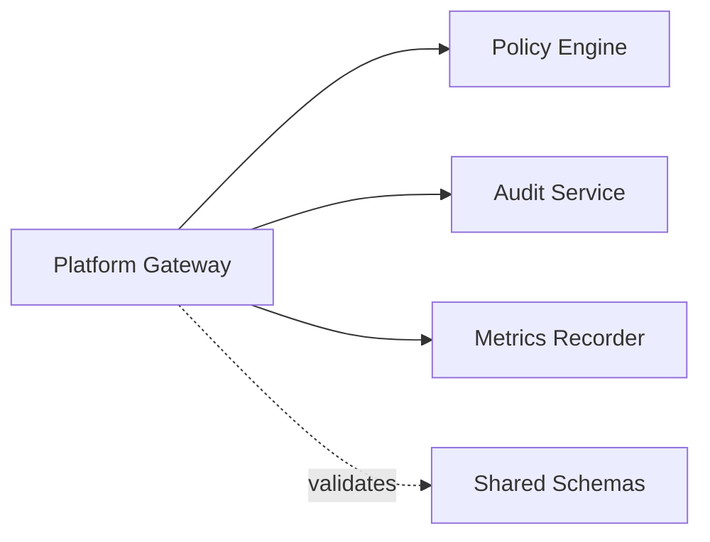

# Audit Event Emission and Compliance

<cite>
**Referenced Files in This Document**
- [audit-event.schema.json](file://shared/shared-contracts/schemas/audit-event.schema.json)
- [audit-summary.schema.json](file://shared/shared-contracts/schemas/audit-summary.schema.json)
- [audit_emitter.py](file://products/platform-gateway/src/platform_gateway/services/audit_emitter.py)
- [audit.py](file://products/platform-gateway/src/platform_gateway/api/routes/audit.py)
- [policy_engine.py](file://products/platform-gateway/src/platform_gateway/services/policy_engine.py)
- [policy-default.yaml](file://products/platform-gateway/src/platform_gateway/policies/policy-default.yaml)
- [redaction.py](file://products/tool-gateway/src/tool_gateway/tools/redaction.py)
- [test_audit_emitter.py](file://products/platform-gateway/tests/test_audit_emitter.py)
- [test_audit_proxy.py](file://products/platform-gateway/tests/test_audit_proxy.py)
</cite>

## Table of Contents
1. [Introduction](#introduction)
2. [Project Structure](#project-structure)
3. [Core Components](#core-components)
4. [Architecture Overview](#architecture-overview)
5. [Detailed Component Analysis](#detailed-component-analysis)
6. [Dependency Analysis](#dependency-analysis)
7. [Performance Considerations](#performance-considerations)
8. [Troubleshooting Guide](#troubleshooting-guide)
9. [Conclusion](#conclusion)
10. [Appendices](#appendices)

## Introduction
This document explains how the Platform Gateway captures, structures, and emits audit events for operator actions, policy decisions, and service interactions, and how it exposes durable audit trails for compliance reporting. It covers:
- The canonical audit event schema and correlation model
- How the gateway emits events to the Audit Service without impacting request latency
- Sensitive data redaction and event filtering
- Authorization boundaries for reading audit trails
- Examples of audit events and compliance summaries
- Operator workflows to trace actions through audit trails

## Project Structure
The Platform Gateway participates in a multi-service audit pipeline:
- Emitters (including the Platform Gateway) build envelopes and deliver them asynchronously to the Audit Service
- The Audit Service stores envelopes verbatim and provides query, summary, and export endpoints
- The Platform Gateway proxies read-only audit queries under strict authorization

**Diagram sources**
- [audit.py:74-131](file://products/platform-gateway/src/platform_gateway/api/routes/audit.py#L74-L131)
- [audit.py:134-183](file://products/platform-gateway/src/platform_gateway/api/routes/audit.py#L134-L183)
- [audit.py:186-248](file://products/platform-gateway/src/platform_gateway/api/routes/audit.py#L186-L248)
- [audit_emitter.py:30-99](file://products/platform-gateway/src/platform_gateway/services/audit_emitter.py#L30-L99)
- [policy_engine.py:390-444](file://products/platform-gateway/src/platform_gateway/services/policy_engine.py#L390-L444)

**Section sources**
- [audit.py:74-248](file://products/platform-gateway/src/platform_gateway/api/routes/audit.py#L74-L248)
- [audit_emitter.py:1-99](file://products/platform-gateway/src/platform_gateway/services/audit_emitter.py#L1-L99)
- [policy_engine.py:1-444](file://products/platform-gateway/src/platform_gateway/services/policy_engine.py#L1-L444)

## Core Components
- Audit event builder and fire-and-forget emitter: constructs canonical envelopes and delivers them on a daemon thread with a short timeout; failures are recorded but never raised
- Audit read proxy: enforces role-based authorization for audit trail access and proxies queries, summaries, and exports to the Audit Service
- Policy engine: deny-by-default evaluation that gates sensitive actions such as audit:read
- Redaction: deterministic tool output redaction applied before results leave the platform, ensuring sensitive values do not leak into downstream artifacts

Key behaviors:
- Envelope fields like event_id, occurred_at, event_type, service, request_id, outcome are always present; optional identity fields are omitted when absent
- Missing request_id falls back to "unknown"
- Emission is non-blocking; if no audit URL is configured, emission is a no-op
- Read routes require explicit audit:read permission; otherwise they return 403 upstream of any network call

**Section sources**
- [audit_emitter.py:30-99](file://products/platform-gateway/src/platform_gateway/services/audit_emitter.py#L30-L99)
- [audit.py:74-248](file://products/platform-gateway/src/platform_gateway/api/routes/audit.py#L74-L248)
- [policy_engine.py:390-444](file://products/platform-gateway/src/platform_gateway/services/policy_engine.py#L390-L444)
- [redaction.py:1-151](file://products/tool-gateway/src/tool_gateway/tools/redaction.py#L1-L151)

## Architecture Overview
The Platform Gateway ensures comprehensive audit coverage while preserving performance:
- Emit path: synchronous request handling builds an audit envelope and hands it off to a background thread; the thread posts to the Audit Service with a short timeout and records success/failure metrics
- Query path: operators with auditor or platform-admin roles can query events, get summaries, or download exports; all requests are proxied to the Audit Service using the gateway’s service credentials

**Diagram sources**
- [audit.py:74-131](file://products/platform-gateway/src/platform_gateway/api/routes/audit.py#L74-L131)
- [policy_engine.py:390-444](file://products/platform-gateway/src/platform_gateway/services/policy_engine.py#L390-L444)

**Section sources**
- [audit.py:74-248](file://products/platform-gateway/src/platform_gateway/api/routes/audit.py#L74-L248)
- [policy_engine.py:1-444](file://products/platform-gateway/src/platform_gateway/services/policy_engine.py#L1-L444)

## Detailed Component Analysis

### Audit Event Schema and Correlation
- Canonical schema defines required fields and a closed vocabulary of event types
- Correlation uses request_id across services; event_id uniquely identifies each stored envelope
- Optional identity fields include subject, username, actor, roles, session_id
- Outcome indicates allow, deny, success, or error depending on context

Example event shape (conceptual):
- event_id: UUID generated by the emitter
- occurred_at: UTC timestamp at emission time
- event_type: e.g., policy_decision, tool_invoked, execution_requested
- service: platform-gateway
- request_id: correlation ID from the request context
- outcome: allow/deny/success/error
- details: per-event payload (e.g., action, decision, reason for policy_decision)

**Section sources**
- [audit-event.schema.json:1-94](file://shared/shared-contracts/schemas/audit-event.schema.json#L1-L94)
- [audit_emitter.py:30-65](file://products/platform-gateway/src/platform_gateway/services/audit_emitter.py#L30-L65)

### Emission Path and Performance Isolation
- build_audit_event constructs the envelope and omits optional fields when absent
- emit_audit_event spawns a daemon thread only when audit_service_url is configured
- _deliver posts to the ingest endpoint with a short timeout; exceptions are caught and recorded via metrics; no exception propagates to the caller
- Tests verify:
  - No thread spawned when URL is unset
  - Thread spawned when URL is set
  - Non-2xx responses recorded as errors
  - Transport errors swallowed and counted

**Diagram sources**
- [audit_emitter.py:68-99](file://products/platform-gateway/src/platform_gateway/services/audit_emitter.py#L68-L99)

**Section sources**
- [audit_emitter.py:1-99](file://products/platform-gateway/src/platform_gateway/services/audit_emitter.py#L1-L99)
- [test_audit_emitter.py:67-152](file://products/platform-gateway/tests/test_audit_emitter.py#L67-L152)

### Audit Read Proxy and Authorization
- Routes:
  - GET /api/v1/audit/events: paginated event listing with filters
  - GET /api/v1/audit/summary: deterministic aggregates over envelope columns
  - GET /api/v1/audit/export: byte pass-through CSV export with selective header forwarding
- All three routes enforce audit:read via the policy engine before any upstream call
- Filters are forwarded verbatim; the gateway does not inspect payloads
- Export forwards only a curated set of headers; internal headers are stripped
- Error mapping:
  - Missing audit service configuration returns 503
  - Upstream connectivity errors return 502
  - Client errors (4xx) pass through unchanged

**Diagram sources**
- [audit.py:74-248](file://products/platform-gateway/src/platform_gateway/api/routes/audit.py#L74-L248)
- [policy_engine.py:390-444](file://products/platform-gateway/src/platform_gateway/services/policy_engine.py#L390-L444)

**Section sources**
- [audit.py:74-248](file://products/platform-gateway/src/platform_gateway/api/routes/audit.py#L74-L248)
- [test_audit_proxy.py:70-466](file://products/platform-gateway/tests/test_audit_proxy.py#L70-L466)

### Policy Enforcement and Coverage
- Deny-by-default evaluation with explicit allow/deny/require_approval outcomes
- Protected actions include audit:read; only auditor and platform-admin roles are granted by default
- Require-approval rules apply to bridged actions; precedence is deny > require_approval > allow
- The policy bundle is loaded once and cached; metadata exposes version and SHA-256 fingerprint

**Diagram sources**
- [policy_engine.py:390-444](file://products/platform-gateway/src/platform_gateway/services/policy_engine.py#L390-L444)

**Section sources**
- [policy_engine.py:1-444](file://products/platform-gateway/src/platform_gateway/services/policy_engine.py#L1-L444)
- [policy-default.yaml:164-175](file://products/platform-gateway/src/platform_gateway/policies/policy-default.yaml#L164-L175)

### Sensitive Data Redaction and Filtering
- Tool outputs are deterministically redacted before leaving the gateway using:
  - Value patterns for unambiguous credential formats (PEM keys, JWTs, Bearer/Basic tokens, AWS access key IDs)
  - Explicit key list for sensitive string fields (password, secret, token family)
- Redaction stats track spans and character counts; overflow thresholds fail closed
- For audit events, the emitter forwards post-redaction envelopes; the Audit Service stores envelopes verbatim
- Query filters support username, session_id, request_id, event_type, service, outcome, since/until; these are forwarded to the Audit Service without inspection

**Section sources**
- [redaction.py:1-151](file://products/tool-gateway/src/tool_gateway/tools/redaction.py#L1-L151)
- [audit.py:45-71](file://products/platform-gateway/src/platform_gateway/api/routes/audit.py#L45-L71)
- [audit-event.schema.json:1-94](file://shared/shared-contracts/schemas/audit-event.schema.json#L1-L94)

### Compliance Reporting and Tracing
- Summary endpoint returns deterministic aggregates over envelope columns only (event_type, outcome, service, username); details payloads are never excavated
- Decision chain projection tracks confirmation_decided, execution_requested, execution_completed, execution_rejected counts to reconcile approvals against executions
- Export endpoint streams CSV bytes with selective header forwarding for truncation and row count metadata
- Operators can trace actions by:
  - Filtering events by request_id to reconstruct a single operation
  - Using session_id to follow a full session’s lifecycle
  - Using outcome and event_type to identify denials or approval flows
  - Downloading exports for offline analysis and retention

**Section sources**
- [audit-summary.schema.json:1-109](file://shared/shared-contracts/schemas/audit-summary.schema.json#L1-L109)
- [audit.py:134-248](file://products/platform-gateway/src/platform_gateway/api/routes/audit.py#L134-L248)

## Dependency Analysis
- Platform Gateway depends on:
  - Policy Engine for authorization checks
  - Audit Service for ingestion and querying
  - Shared schemas for contract validation
- Tight coupling points:
  - Audit read proxy assumes Audit Service availability; missing config yields 503
  - Emitter relies on HTTP client and metrics recording; failures are isolated
- External dependencies:
  - httpx for synchronous/asynchronous HTTP calls
  - YAML parsing for policy bundles
  - JSON Schema validation in tests

**Diagram sources**
- [audit.py:74-248](file://products/platform-gateway/src/platform_gateway/api/routes/audit.py#L74-L248)
- [audit_emitter.py:1-99](file://products/platform-gateway/src/platform_gateway/services/audit_emitter.py#L1-L99)
- [policy_engine.py:1-444](file://products/platform-gateway/src/platform_gateway/services/policy_engine.py#L1-L444)

**Section sources**
- [audit.py:74-248](file://products/platform-gateway/src/platform_gateway/api/routes/audit.py#L74-L248)
- [audit_emitter.py:1-99](file://products/platform-gateway/src/platform_gateway/services/audit_emitter.py#L1-L99)
- [policy_engine.py:1-444](file://products/platform-gateway/src/platform_gateway/services/policy_engine.py#L1-L444)

## Performance Considerations
- Emission is fire-and-forget:
  - Background thread decouples audit delivery from request latency
  - Short timeout prevents slow sinks from blocking callers
  - Failures are swallowed and recorded; no retry storms
- Query paths use async clients with timeouts:
  - Standard queries: bounded timeout
  - Export: longer timeout due to server-side paging
- Redaction is deterministic and bounded; overflow protection avoids excessive processing
- Policy evaluation is in-memory after initial load; bundle caching avoids repeated parsing

[No sources needed since this section provides general guidance]

## Troubleshooting Guide
Common issues and signals:
- Audit read returns 403:
  - Ensure the caller has auditor or platform-admin roles; audit:read is protected
- Audit read returns 503:
  - Audit service URL is not configured in the gateway settings
- Audit read returns 502:
  - Upstream Audit Service unreachable or timed out
- Emission failures:
  - Check metrics for audit emit errors; logs record request_id, event_type, and error message
  - Verify audit_service_url, audit_client_id, and audit_client_secret are set correctly
- Export anomalies:
  - Only selected headers are forwarded; internal headers are stripped by design
  - Server-side limits may truncate large exports; check x-audit-export-truncated and x-audit-export-rows

**Section sources**
- [audit.py:74-248](file://products/platform-gateway/src/platform_gateway/api/routes/audit.py#L74-L248)
- [audit_emitter.py:77-99](file://products/platform-gateway/src/platform_gateway/services/audit_emitter.py#L77-L99)
- [test_audit_proxy.py:179-202](file://products/platform-gateway/tests/test_audit_proxy.py#L179-L202)
- [test_audit_proxy.py:293-316](file://products/platform-gateway/tests/test_audit_proxy.py#L293-L316)
- [test_audit_proxy.py:439-461](file://products/platform-gateway/tests/test_audit_proxy.py#L439-L461)

## Conclusion
The Platform Gateway provides robust, high-performance audit emission and compliant audit trail access:
- Events are built to a canonical schema and delivered asynchronously to avoid impacting user-facing latency
- Authorization strictly limits audit trail reads to governance roles
- Deterministic redaction protects sensitive data throughout the platform
- Summaries and exports enable efficient compliance reporting and long-term retention
- Operators can trace actions end-to-end using correlation IDs and filters

[No sources needed since this section summarizes without analyzing specific files]

## Appendices

### Example Audit Events (Conceptual)
- policy_decision:
  - event_type: policy_decision
  - outcome: allow or deny
  - details.action: e.g., chat, tools:mutate
  - details.decision: allow/deny/require_approval
  - details.reason: human-readable explanation
- tool_invoked:
  - event_type: tool_invoked
  - details.tool_name, details.status, details.duration_ms, details.redacted_spans
- execution_requested:
  - event_type: execution_requested
  - details.confirm_id, execution_id, call_id, tool_name, args_digest, decider_user_id, owner_user_id

These shapes align with the shared audit-event schema and are emitted by services including the Platform Gateway.

**Section sources**
- [audit-event.schema.json:1-94](file://shared/shared-contracts/schemas/audit-event.schema.json#L1-L94)
- [audit_emitter.py:30-65](file://products/platform-gateway/src/platform_gateway/services/audit_emitter.py#L30-L65)

### Operator Trace Workflow
- Identify the request_id from application logs or UI
- Query events by request_id to reconstruct the full sequence
- Use session_id to view session-scoped activity
- Filter by event_type and outcome to isolate denials or approval steps
- Download exports for archival and cross-system reconciliation

**Section sources**
- [audit.py:74-248](file://products/platform-gateway/src/platform_gateway/api/routes/audit.py#L74-L248)
- [audit-summary.schema.json:1-109](file://shared/shared-contracts/schemas/audit-summary.schema.json#L1-L109)