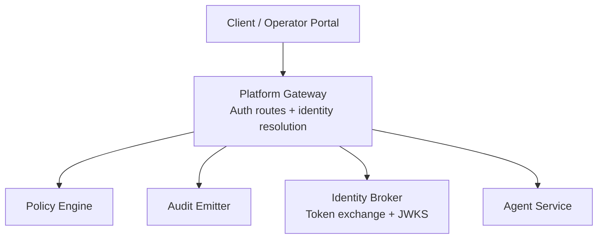
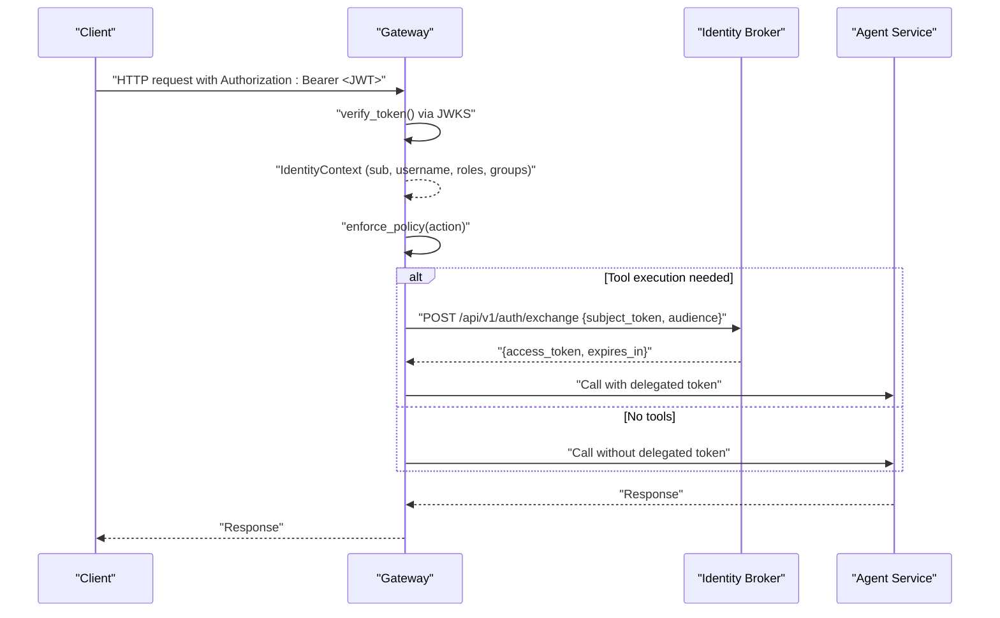
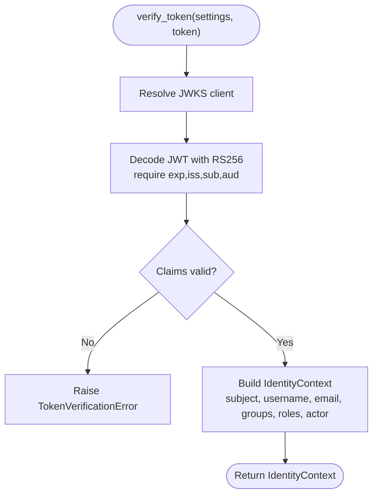
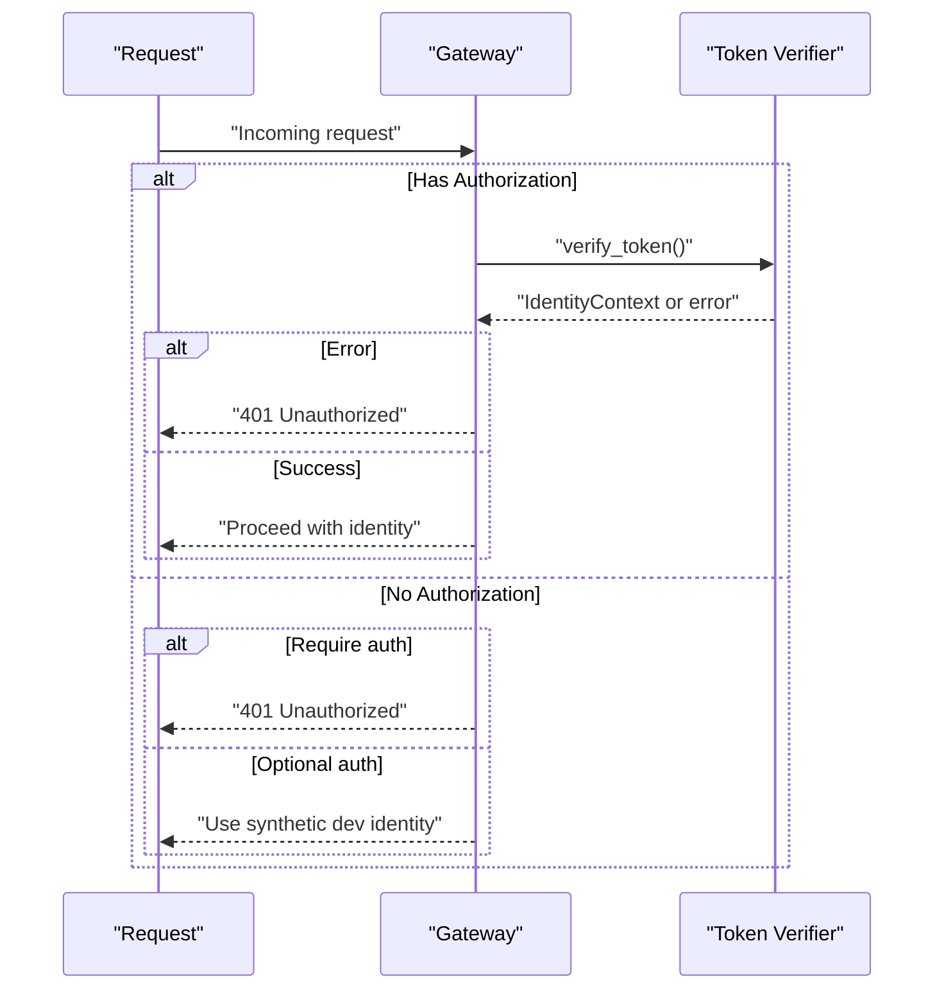
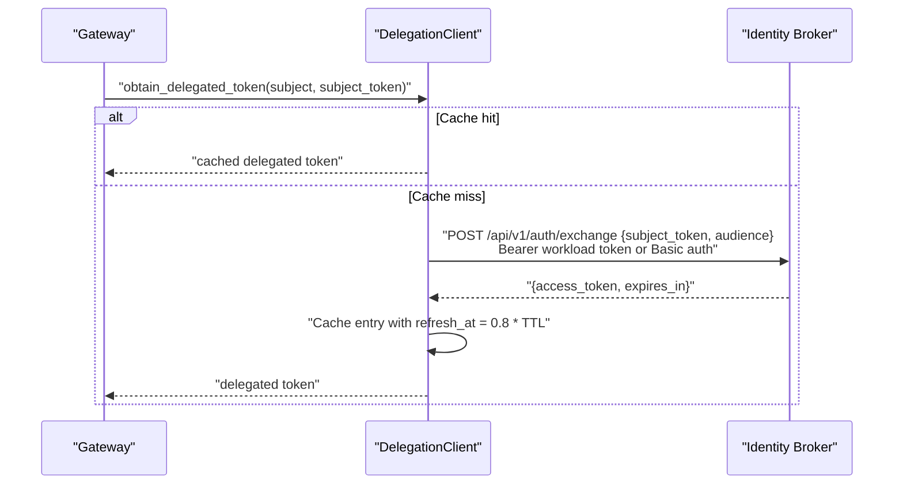
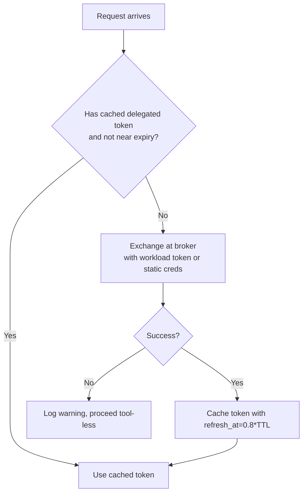
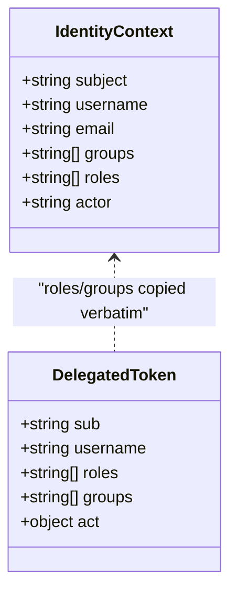
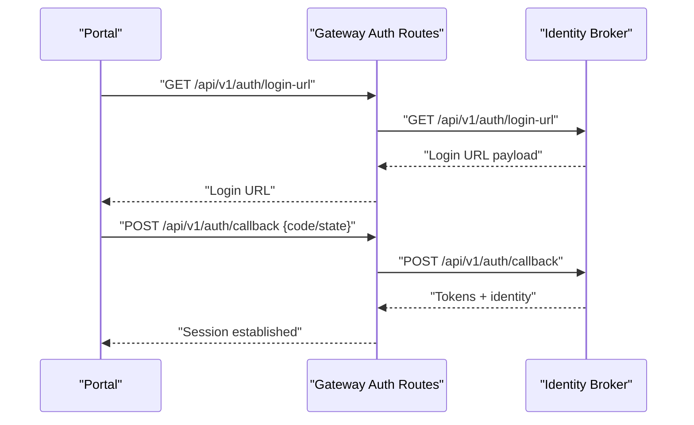
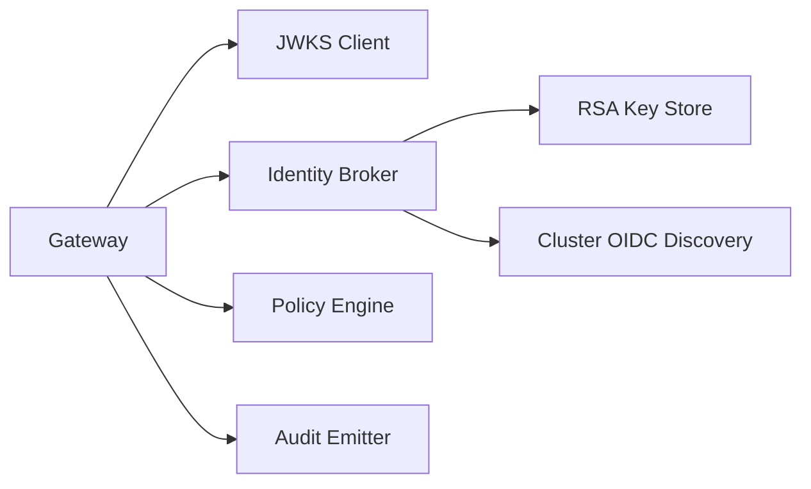

# Authentication and Token Management

<cite>
**Referenced Files in This Document**
- [token_verifier.py](file://products/platform-gateway/src/platform_gateway/services/token_verifier.py)
- [delegation_client.py](file://products/platform-gateway/src/platform_gateway/services/delegation_client.py)
- [gateway_service.py](file://products/platform-gateway/src/platform_gateway/services/gateway_service.py)
- [auth.py](file://products/platform-gateway/src/platform_gateway/api/routes/auth.py)
- [request_context.py](file://products/platform-gateway/src/platform_gateway/core/request_context.py)
- [exchange_service.py](file://products/identity-broker/src/identity_service/services/exchange_service.py)
- [token_service.py](file://products/identity-broker/src/identity_service/services/token_service.py)
- [api.py](file://products/platform-gateway/src/platform_gateway/schemas/api.py)
</cite>

## Table of Contents
1. [Introduction](#introduction)
2. [Project Structure](#project-structure)
3. [Core Components](#core-components)
4. [Architecture Overview](#architecture-overview)
5. [Detailed Component Analysis](#detailed-component-analysis)
6. [Dependency Analysis](#dependency-analysis)
7. [Performance Considerations](#performance-considerations)
8. [Troubleshooting Guide](#troubleshooting-guide)
9. [Conclusion](#conclusion)

## Introduction
This document explains how the Platform Gateway authenticates requests, validates OIDC tokens, delegates authority for service-to-service calls, and maintains user identity throughout request processing. It covers token verification, delegation flow, session context propagation, token lifecycle and refresh strategies, error handling, and security boundaries that enable seamless operator access while preserving strict trust assumptions.

## Project Structure
The authentication and token management surface spans two products:
- Platform Gateway: local JWT verification, policy enforcement, identity resolution, delegated token caching, and proxying to downstream services.
- Identity Broker: client authentication (static or projected workload token), subject token validation, and issuance of short-lived delegated tokens.

**Diagram sources**
- [auth.py:21-112](file://products/platform-gateway/src/platform_gateway/api/routes/auth.py#L21-L112)
- [gateway_service.py:98-264](file://products/platform-gateway/src/platform_gateway/services/gateway_service.py#L98-L264)
- [exchange_service.py:148-195](file://products/identity-broker/src/identity_service/services/exchange_service.py#L148-L195)

**Section sources**
- [auth.py:21-112](file://products/platform-gateway/src/platform_gateway/api/routes/auth.py#L21-L112)
- [gateway_service.py:98-264](file://products/platform-gateway/src/platform_gateway/services/gateway_service.py#L98-L264)

## Core Components
- Local JWT verifier: verifies bearer tokens against the broker’s public keys via JWKS, extracts an IdentityContext, and enforces required claims.
- Delegation client: caches per-user delegated tokens, exchanges a verified subject token for a short-lived audience-bound delegated token at the broker, and supports workload-token-based service authentication with static credential fallback.
- Identity resolution: normalizes Authorization headers, verifies tokens locally, falls back to a synthetic dev identity when configured, and records metrics.
- Policy enforcement: evaluates actions against a policy bundle using roles from the resolved identity; denies are audited.
- Request context helpers: resolve correlation IDs and user identity precedence across headers and authenticated context.

**Section sources**
- [token_verifier.py:25-99](file://products/platform-gateway/src/platform_gateway/services/token_verifier.py#L25-L99)
- [delegation_client.py:44-229](file://products/platform-gateway/src/platform_gateway/services/delegation_client.py#L44-L229)
- [gateway_service.py:204-264](file://products/platform-gateway/src/platform_gateway/services/gateway_service.py#L204-L264)
- [gateway_service.py:267-301](file://products/platform-gateway/src/platform_gateway/services/gateway_service.py#L267-L301)
- [request_context.py:8-35](file://products/platform-gateway/src/platform_gateway/core/request_context.py#L8-L35)

## Architecture Overview
The gateway is the single authentication boundary for inbound traffic. It validates OIDC tokens locally using the broker’s JWKS, resolves identity into a normalized context, enforces policies, and optionally obtains a delegated token for tool execution on behalf of the user. The broker mediates delegation by authenticating the caller (via projected workload token or static credentials), validating the subject token, and issuing a short-lived, audience-scoped token.

**Diagram sources**
- [gateway_service.py:204-264](file://products/platform-gateway/src/platform_gateway/services/gateway_service.py#L204-L264)
- [delegation_client.py:78-101](file://products/platform-gateway/src/platform_gateway/services/delegation_client.py#L78-L101)
- [exchange_service.py:148-195](file://products/identity-broker/src/identity_service/services/exchange_service.py#L148-L195)

## Detailed Component Analysis

### Local OIDC Token Verification
- The gateway uses a module-level JWKS client to fetch signing keys once per configuration change and cache them.
- Tokens are decoded with RS256, requiring exp, iss, sub, aud, and validating issuer and audience from settings.
- On success, an IdentityContext is constructed from claims, including optional actor extraction from RFC 8693 act.
- Errors map to specific TokenVerificationError messages and are surfaced as 401 responses upstream.

**Diagram sources**
- [token_verifier.py:25-99](file://products/platform-gateway/src/platform_gateway/services/token_verifier.py#L25-L99)

**Section sources**
- [token_verifier.py:25-99](file://products/platform-gateway/src/platform_gateway/services/token_verifier.py#L25-L99)
- [api.py:196-207](file://products/platform-gateway/src/platform_gateway/schemas/api.py#L196-L207)

### Identity Resolution and Dev Fallback
- If Authorization header is present, it must be Bearer; otherwise a 401 is returned.
- Verified tokens yield an authenticated IdentityContext; failures return 401 with structured detail.
- When no token is present and authentication is not required, a synthetic dev identity is used so operations can proceed in development mode.

**Diagram sources**
- [gateway_service.py:204-264](file://products/platform-gateway/src/platform_gateway/services/gateway_service.py#L204-L264)

**Section sources**
- [gateway_service.py:204-264](file://products/platform-gateway/src/platform_gateway/services/gateway_service.py#L204-L264)

### Token Delegation Flow (Service-to-Service)
- The gateway exchanges a verified subject token for a short-lived delegated token bound to a target audience.
- Caller authentication to the broker supports:
  - Projected workload token (preferred) presented as Bearer, validated against cluster OIDC issuer and mapped to a registered client.
  - Static HTTP Basic client credentials (fallback).
- The broker verifies the subject token against its own key, copies roles verbatim, and issues a delegated token with an actor claim identifying the acting service.
- The gateway caches delegated tokens per user subject with early refresh before expiry.

**Diagram sources**
- [delegation_client.py:78-101](file://products/platform-gateway/src/platform_gateway/services/delegation_client.py#L78-L101)
- [delegation_client.py:190-229](file://products/platform-gateway/src/platform_gateway/services/delegation_client.py#L190-L229)
- [exchange_service.py:148-195](file://products/identity-broker/src/identity_service/services/exchange_service.py#L148-L195)

**Section sources**
- [delegation_client.py:44-229](file://products/platform-gateway/src/platform_gateway/services/delegation_client.py#L44-L229)
- [exchange_service.py:46-121](file://products/identity-broker/src/identity_service/services/exchange_service.py#L46-L121)
- [exchange_service.py:148-195](file://products/identity-broker/src/identity_service/services/exchange_service.py#L148-L195)

### Token Lifecycle and Refresh Strategy
- Subject tokens: validated locally by the gateway; expiration enforced during decode.
- Delegated tokens: short-lived, audience-bound, cached per user subject with proactive refresh at 80% of TTL.
- Workload token rotation: the gateway reads the projected workload token file on each exchange; if unavailable, it warns once and falls back to static credentials.
- Broker-side key lifecycle: RSA key loaded or generated/persisted; JWKS exposes the public key set for gateway verification.

**Diagram sources**
- [delegation_client.py:58-76](file://products/platform-gateway/src/platform_gateway/services/delegation_client.py#L58-L76)
- [delegation_client.py:103-126](file://products/platform-gateway/src/platform_gateway/services/delegation_client.py#L103-L126)
- [delegation_client.py:190-229](file://products/platform-gateway/src/platform_gateway/services/delegation_client.py#L190-L229)
- [token_service.py:42-74](file://products/identity-broker/src/identity_service/services/token_service.py#L42-L74)

**Section sources**
- [delegation_client.py:58-76](file://products/platform-gateway/src/platform_gateway/services/delegation_client.py#L58-L76)
- [delegation_client.py:103-126](file://products/platform-gateway/src/platform_gateway/services/delegation_client.py#L103-L126)
- [delegation_client.py:190-229](file://products/platform-gateway/src/platform_gateway/services/delegation_client.py#L190-L229)
- [token_service.py:42-74](file://products/identity-broker/src/identity_service/services/token_service.py#L42-L74)

### User Identity Propagation Through the Platform
- IdentityContext fields include subject, username, email, groups, roles, and optional actor (acting service for delegated tokens).
- The broker copies roles verbatim from the subject token to the delegated token, ensuring no privilege escalation.
- Downstream services receive either the original user identity (for direct calls) or a delegated token carrying the same identity plus an actor claim indicating the acting service.

**Diagram sources**
- [api.py:196-207](file://products/platform-gateway/src/platform_gateway/schemas/api.py#L196-L207)
- [exchange_service.py:173-186](file://products/identity-broker/src/identity_service/services/exchange_service.py#L173-L186)

**Section sources**
- [api.py:196-207](file://products/platform-gateway/src/platform_gateway/schemas/api.py#L196-L207)
- [exchange_service.py:173-186](file://products/identity-broker/src/identity_service/services/exchange_service.py#L173-L186)

### Authentication Flows and API Surface
- Login URL, login start, callback, logout URL, and refresh endpoints are proxied to the identity broker with consistent house headers and error posture mapping.
- The /me endpoint verifies a bearer token locally and returns the authenticated identity when valid.

**Diagram sources**
- [auth.py:21-57](file://products/platform-gateway/src/platform_gateway/api/routes/auth.py#L21-L57)
- [gateway_service.py:146-185](file://products/platform-gateway/src/platform_gateway/services/gateway_service.py#L146-L185)

**Section sources**
- [auth.py:21-112](file://products/platform-gateway/src/platform_gateway/api/routes/auth.py#L21-L112)
- [gateway_service.py:146-185](file://products/platform-gateway/src/platform_gateway/services/gateway_service.py#L146-L185)

## Dependency Analysis
- The gateway depends on:
  - JWKS client for local token verification.
  - Identity broker for login flows and delegated token exchange.
  - Policy engine for authorization decisions based on roles.
  - Audit emitter for durable audit trails of policy decisions.
- The identity broker depends on:
  - RSA key management and JWKS publication.
  - Cluster OIDC discovery for workload token validation.
  - Service client registry for static credentials and workload subject mappings.

**Diagram sources**
- [token_verifier.py:25-34](file://products/platform-gateway/src/platform_gateway/services/token_verifier.py#L25-L34)
- [exchange_service.py:65-75](file://products/identity-broker/src/identity_service/services/exchange_service.py#L65-L75)
- [token_service.py:42-74](file://products/identity-broker/src/identity_service/services/token_service.py#L42-L74)

**Section sources**
- [token_verifier.py:25-34](file://products/platform-gateway/src/platform_gateway/services/token_verifier.py#L25-L34)
- [exchange_service.py:65-75](file://products/identity-broker/src/identity_service/services/exchange_service.py#L65-L75)
- [token_service.py:42-74](file://products/identity-broker/src/identity_service/services/token_service.py#L42-L74)

## Performance Considerations
- JWKS keys are cached per process and refreshed only when the configured URL changes, minimizing network overhead.
- Delegated tokens are cached per user subject with early refresh at 80% of TTL to avoid last-minute re-exchanges.
- Workload token file is read on each exchange to pick up rotations; fallback to static credentials is logged once per process.
- Local JWT verification avoids per-request introspection calls, reducing latency and external dependencies.

[No sources needed since this section provides general guidance]

## Troubleshooting Guide
Common authentication failures and their handling:
- Malformed Authorization header: rejected immediately with 401.
- Invalid or expired subject token: local verification fails; 401 returned with structured detail.
- Missing token when authentication is required: 401 returned.
- Delegation exchange failure: logged and counted; the request proceeds without tools rather than failing the entire operation.
- Workload token unavailable: gateway warns once and falls back to static credentials for delegation.

Operational checks:
- Use /api/v1/auth/me to validate bearer token verification behavior.
- Inspect readiness endpoints to ensure policy bundle loads and agent service responds.

**Section sources**
- [gateway_service.py:204-264](file://products/platform-gateway/src/platform_gateway/services/gateway_service.py#L204-L264)
- [delegation_client.py:190-229](file://products/platform-gateway/src/platform_gateway/services/delegation_client.py#L190-L229)
- [auth.py:60-83](file://products/platform-gateway/src/platform_gateway/api/routes/auth.py#L60-L83)

## Conclusion
The Platform Gateway centralizes authentication by verifying OIDC tokens locally via JWKS, enforcing policy decisions, and delegating authority through the Identity Broker for tool execution. This design preserves strict security boundaries—no privilege escalation, audience scoping, and short-lived delegated tokens—while enabling seamless operator workflows and robust fallbacks for development and operational resilience.