# Platform Gateway

<cite>
**Referenced Files in This Document**
- [app.py](file://products/platform-gateway/src/platform_gateway/app.py)
- [main.py](file://products/platform-gateway/src/platform_gateway/main.py)
- [router.py](file://products/platform-gateway/src/platform_gateway/api/router.py)
- [gateway_service.py](file://products/platform-gateway/src/platform_gateway/services/gateway_service.py)
- [policy_engine.py](file://products/platform-gateway/src/platform_gateway/services/policy_engine.py)
- [policy_matrix.py](file://products/platform-gateway/src/platform_gateway/services/policy_matrix.py)
- [token_verifier.py](file://products/platform-gateway/src/platform_gateway/services/token_verifier.py)
- [delegation_client.py](file://products/platform-gateway/src/platform_gateway/services/delegation_client.py)
- [audit_emitter.py](file://products/platform-gateway/src/platform_gateway/services/audit_emitter.py)
- [config.py](file://products/platform-gateway/src/platform_gateway/core/config.py)
- [policy-default.yaml](file://products/platform-gateway/src/platform_gateway/policies/policy-default.yaml)
- [SPEC-010-platform-gateway-extraction/spec.md](file://docs/specs/SPEC-010-platform-gateway-extraction/spec.md)
</cite>

## Table of Contents
1. Introduction
2. Project Structure
3. Core Components
4. Architecture Overview
5. Detailed Component Analysis
6. Dependency Analysis
7. Performance Considerations
8. Troubleshooting Guide
9. Conclusion

## Introduction
The Platform Gateway is the operator portal’s single HTTP entry point and policy enforcement edge. It authenticates requests by verifying platform tokens locally, delegates to the Identity Broker for token exchange when needed, evaluates centralized policies before forwarding requests to backend services (agent-platform, audit-service, tool-gateway, skills-hub), and emits durable audit events. Its design preserves deny-by-default authorization, supports approval workflows for mutating actions, and provides transparency endpoints that render the effective permission matrix from the live policy bundle.

Key responsibilities:
- Single entrypoint for all operator portal API requests
- Local JWT verification via JWKS with audience and issuer checks
- Token delegation to the Identity Broker for downstream tool execution
- Centralized policy evaluation against a YAML bundle with allow/deny/require_approval outcomes
- Request/response proxying to backend services with robust error posture
- Audit event emission for every policy decision and key operations
- Transparency surfaces exposing the effective role-to-action matrix

**Section sources**
- [SPEC-010-platform-gateway-extraction/spec.md:13-22](file://docs/specs/SPEC-010-platform-gateway-extraction/spec.md#L13-L22)
- [app.py:16-41](file://products/platform-gateway/src/platform_gateway/app.py#L16-L41)

## Project Structure
The product follows a consistent FastAPI service layout:
- Application bootstrap and middleware in app.py and main.py
- API routes under api/routes grouped by feature (auth, sessions, chat, incidents, documents, models, approvals, tools, policy, runtime, health, identity)
- Services layer implementing business logic: gateway orchestration, policy engine, token verification, delegation, audit emission, and client helpers
- Policies directory holding the default YAML bundle loaded at runtime
- Core configuration and telemetry/metrics setup

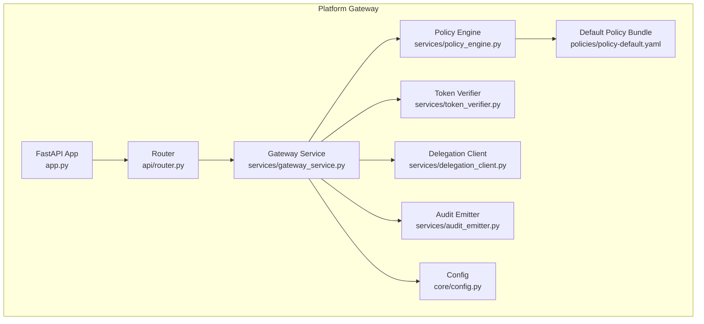

**Diagram sources**
- [app.py:16-41](file://products/platform-gateway/src/platform_gateway/app.py#L16-L41)
- [gateway_service.py:204-300](file://products/platform-gateway/src/platform_gateway/services/gateway_service.py#L204-L300)
- [policy_engine.py:390-443](file://products/platform-gateway/src/platform_gateway/services/policy_engine.py#L390-L443)
- [token_verifier.py:52-89](file://products/platform-gateway/src/platform_gateway/services/token_verifier.py#L52-L89)
- [delegation_client.py:190-229](file://products/platform-gateway/src/platform_gateway/services/delegation_client.py#L190-L229)
- [audit_emitter.py:30-99](file://products/platform-gateway/src/platform_gateway/services/audit_emitter.py#L30-L99)
- [config.py:23-53](file://products/platform-gateway/src/platform_gateway/core/config.py#L23-L53)
- [policy-default.yaml:1-52](file://products/platform-gateway/src/platform_gateway/policies/policy-default.yaml#L1-L52)

**Section sources**
- [app.py:16-41](file://products/platform-gateway/src/platform_gateway/app.py#L16-L41)
- [main.py:6-8](file://products/platform-gateway/src/platform_gateway/main.py#L6-L8)
- [config.py:23-53](file://products/platform-gateway/src/platform_gateway/core/config.py#L23-L53)

## Core Components
- FastAPI application and middleware: request logging, metrics, telemetry setup, router inclusion
- Identity resolution: local JWT verification or synthetic dev identity based on settings
- Policy enforcement: evaluate action against loaded bundle; emit audit; raise 403 on deny
- Delegation: per-user cached delegated tokens exchanged with Identity Broker using workload token or static credentials
- Proxies: session, chat, incident, document, model, skill, tool, and approval endpoints with consistent upstream error mapping
- Transparency: live permission matrix derived from the enforced bundle

**Section sources**
- [app.py:16-41](file://products/platform-gateway/src/platform_gateway/app.py#L16-L41)
- [gateway_service.py:204-300](file://products/platform-gateway/src/platform_gateway/services/gateway_service.py#L204-L300)
- [delegation_client.py:190-229](file://products/platform-gateway/src/platform_gateway/services/delegation_client.py#L190-L229)
- [policy_matrix.py:31-87](file://products/platform-gateway/src/platform_gateway/services/policy_matrix.py#L31-L87)

## Architecture Overview
The gateway sits between the operator portal and backend services. Every request is logged, authenticated, authorized, proxied, and audited.

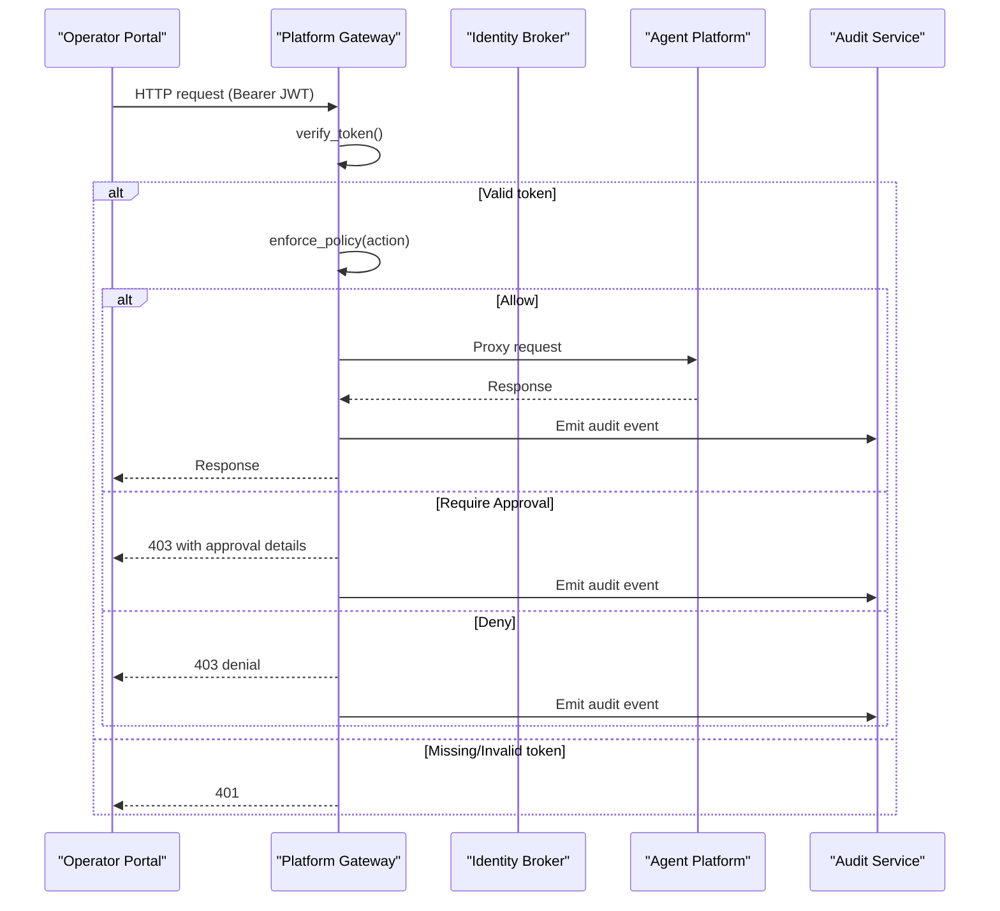

**Diagram sources**
- [token_verifier.py:52-89](file://products/platform-gateway/src/platform_gateway/services/token_verifier.py#L52-L89)
- [gateway_service.py:204-300](file://products/platform-gateway/src/platform_gateway/services/gateway_service.py#L204-L300)
- [audit_emitter.py:30-99](file://products/platform-gateway/src/platform_gateway/services/audit_emitter.py#L30-L99)

## Detailed Component Analysis

### Authentication and Identity Resolution
- Local JWT verification uses JWKS with issuer and audience validation
- Missing or invalid bearer tokens result in 401 unless authentication is disabled in dev mode
- Synthetic dev identity can be used when no token is present and auth is optional

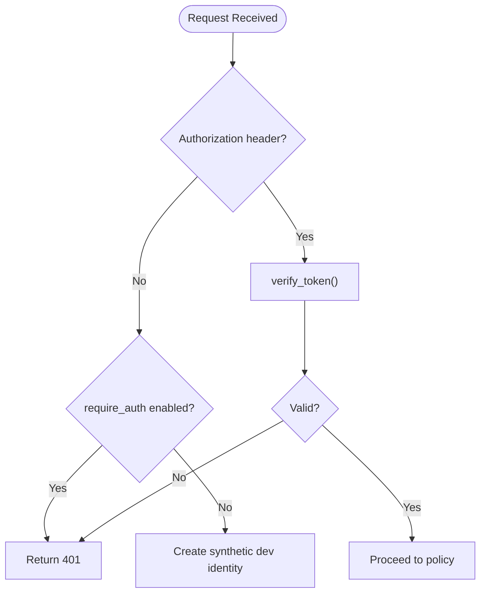

**Diagram sources**
- [gateway_service.py:204-264](file://products/platform-gateway/src/platform_gateway/services/gateway_service.py#L204-L264)
- [token_verifier.py:52-89](file://products/platform-gateway/src/platform_gateway/services/token_verifier.py#L52-L89)
- [config.py:23-53](file://products/platform-gateway/src/platform_gateway/core/config.py#L23-L53)

**Section sources**
- [gateway_service.py:204-264](file://products/platform-gateway/src/platform_gateway/services/gateway_service.py#L204-L264)
- [token_verifier.py:52-89](file://products/platform-gateway/src/platform_gateway/services/token_verifier.py#L52-L89)
- [config.py:23-53](file://products/platform-gateway/src/platform_gateway/core/config.py#L23-L53)

### Policy Engine and Rule Evaluation
- Loads a YAML bundle (packaged default or configured path) and caches it per process
- Evaluates actions against roles with deny-by-default semantics
- Outcomes: allow, deny, require_approval; precedence: deny > require_approval > allow; higher priority wins within an outcome class
- Approval rules carry tier and decider roles; only bridged actions may use require_approval

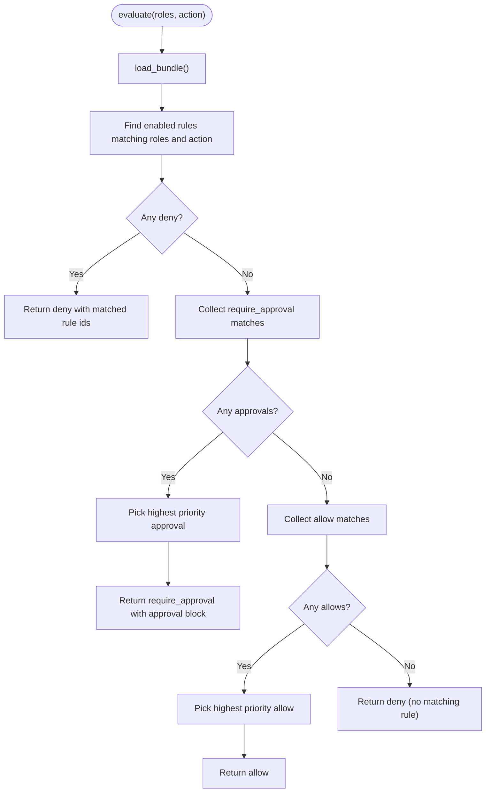

**Diagram sources**
- [policy_engine.py:334-371](file://products/platform-gateway/src/platform_gateway/services/policy_engine.py#L334-L371)
- [policy_engine.py:390-443](file://products/platform-gateway/src/platform_gateway/services/policy_engine.py#L390-L443)
- [policy-default.yaml:53-326](file://products/platform-gateway/src/platform_gateway/policies/policy-default.yaml#L53-L326)

**Section sources**
- [policy_engine.py:334-371](file://products/platform-gateway/src/platform_gateway/services/policy_engine.py#L334-L371)
- [policy_engine.py:390-443](file://products/platform-gateway/src/platform_gateway/services/policy_engine.py#L390-L443)
- [policy-default.yaml:53-326](file://products/platform-gateway/src/platform_gateway/policies/policy-default.yaml#L53-L326)

### Authorization Matrix and Transparency
- Builds a role x action matrix from the enforced bundle
- Admin scope shows full matrix; other identities see only their own roles
- require_approval cells appear as false in boolean matrix plus additive approval_requirements structure

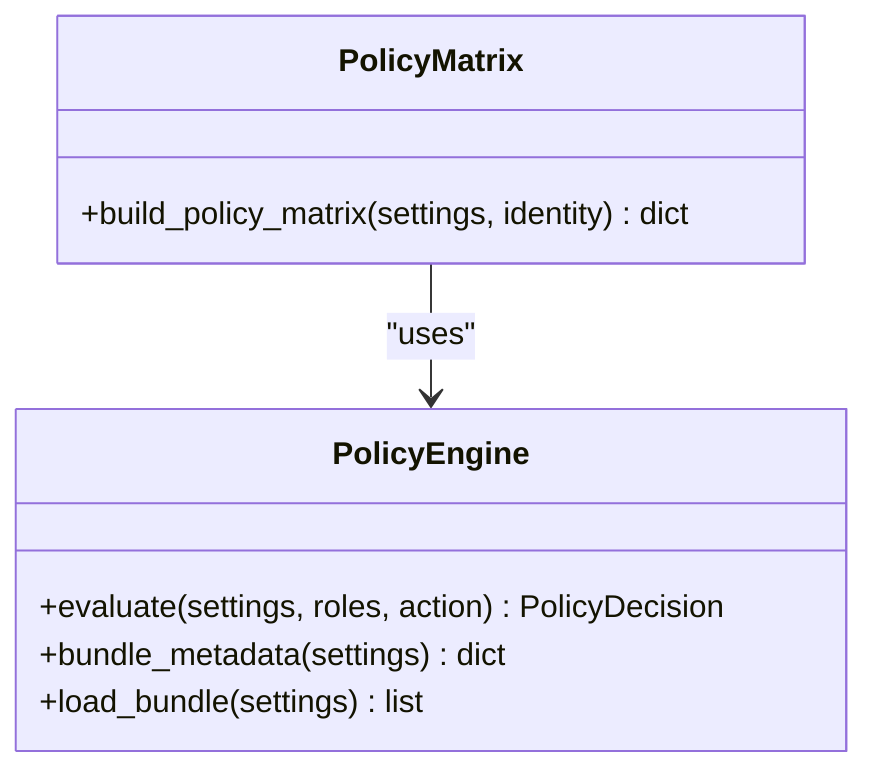

**Diagram sources**
- [policy_matrix.py:31-87](file://products/platform-gateway/src/platform_gateway/services/policy_matrix.py#L31-L87)
- [policy_engine.py:390-443](file://products/platform-gateway/src/platform_gateway/services/policy_engine.py#L390-L443)

**Section sources**
- [policy_matrix.py:31-87](file://products/platform-gateway/src/platform_gateway/services/policy_matrix.py#L31-L87)

### Token Delegation and Tool Execution Path
- Exchanges verified user tokens for short-lived delegated tokens bound to the tool-gateway audience
- Per-user cache avoids repeated exchanges; refreshes near expiry
- Uses projected workload token when available, otherwise falls back to static service credentials
- Failure is non-fatal: proceeds without tools rather than breaking chat

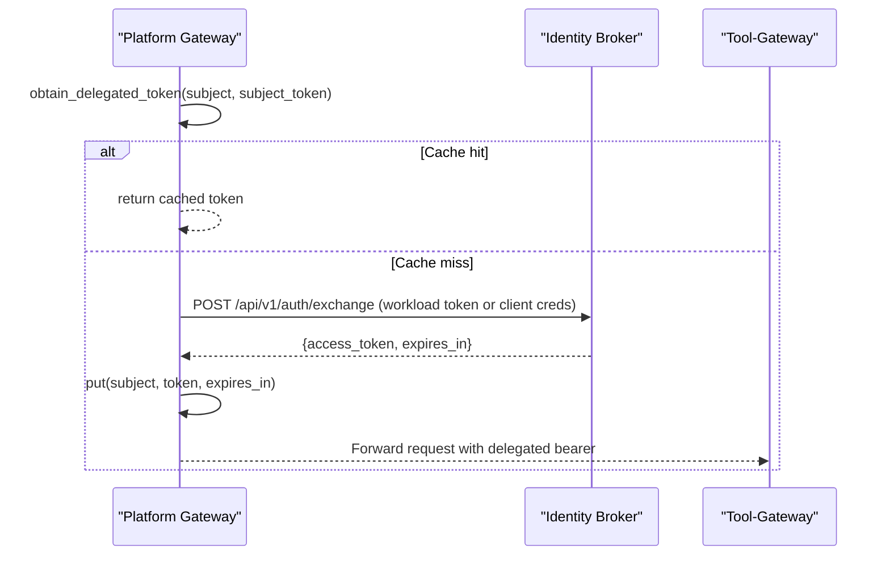

**Diagram sources**
- [delegation_client.py:78-101](file://products/platform-gateway/src/platform_gateway/services/delegation_client.py#L78-L101)
- [delegation_client.py:190-229](file://products/platform-gateway/src/platform_gateway/services/delegation_client.py#L190-L229)

**Section sources**
- [delegation_client.py:78-101](file://products/platform-gateway/src/platform_gateway/services/delegation_client.py#L78-L101)
- [delegation_client.py:190-229](file://products/platform-gateway/src/platform_gateway/services/delegation_client.py#L190-L229)

### Request Routing and Proxy Patterns
- Routes are organized by feature and delegate to gateway_service functions
- Each proxy enforces a consistent error posture: upstream 4xx pass through; transport or upstream 5xx map to 502
- House headers propagate correlation IDs; timeouts and retries are controlled by settings

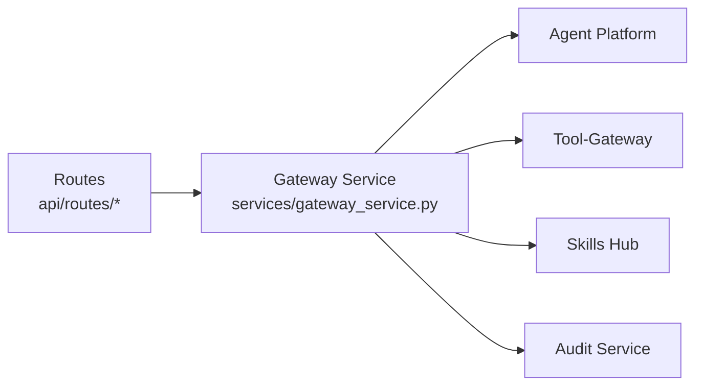

**Diagram sources**
- [gateway_service.py:331-800](file://products/platform-gateway/src/platform_gateway/services/gateway_service.py#L331-L800)

**Section sources**
- [gateway_service.py:331-800](file://products/platform-gateway/src/platform_gateway/services/gateway_service.py#L331-L800)

### Approval Workflow Integration
- Mutating tool execution requires tier_2 approval; the policy engine returns require_approval with an approval block
- The gateway bridges the confirmation flow so designated approvers can approve parked calls
- Approval decisions are scoped to specific roles and cannot self-approve at tier_2

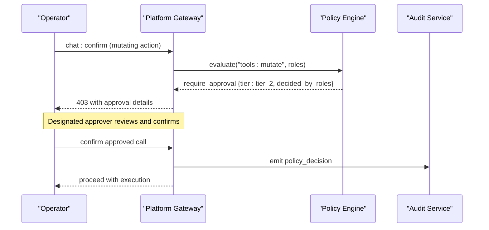

**Diagram sources**
- [policy_engine.py:390-443](file://products/platform-gateway/src/platform_gateway/services/policy_engine.py#L390-L443)
- [policy-default.yaml:130-152](file://products/platform-gateway/src/platform_gateway/policies/policy-default.yaml#L130-L152)
- [audit_emitter.py:30-99](file://products/platform-gateway/src/platform_gateway/services/audit_emitter.py#L30-L99)

**Section sources**
- [policy_engine.py:390-443](file://products/platform-gateway/src/platform_gateway/services/policy_engine.py#L390-L443)
- [policy-default.yaml:130-152](file://products/platform-gateway/src/platform_gateway/policies/policy-default.yaml#L130-L152)

### Audit Event Emission
- Every policy decision is emitted as a durable audit event
- Emission is fire-and-forget on a daemon thread with a short timeout; failures do not degrade the request path
- Events include subject, username, actor, roles, and structured details

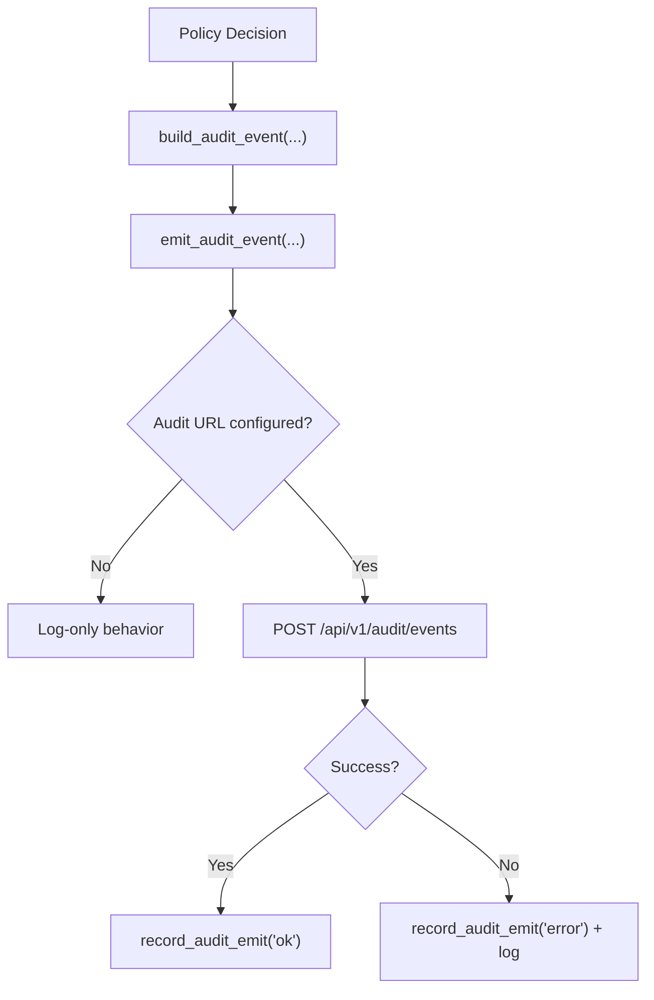

**Diagram sources**
- [gateway_service.py:303-328](file://products/platform-gateway/src/platform_gateway/services/gateway_service.py#L303-L328)
- [audit_emitter.py:30-99](file://products/platform-gateway/src/platform_gateway/services/audit_emitter.py#L30-L99)

**Section sources**
- [gateway_service.py:303-328](file://products/platform-gateway/src/platform_gateway/services/gateway_service.py#L303-L328)
- [audit_emitter.py:30-99](file://products/platform-gateway/src/platform_gateway/services/audit_emitter.py#L30-L99)

### Error Handling for Policy Denials
- Deny results in a structured 403 with action, reason, and matched rule ids
- Metrics record the decision; audit event captures the denial context
- Upstream errors are normalized to 502 to avoid leaking internal failures

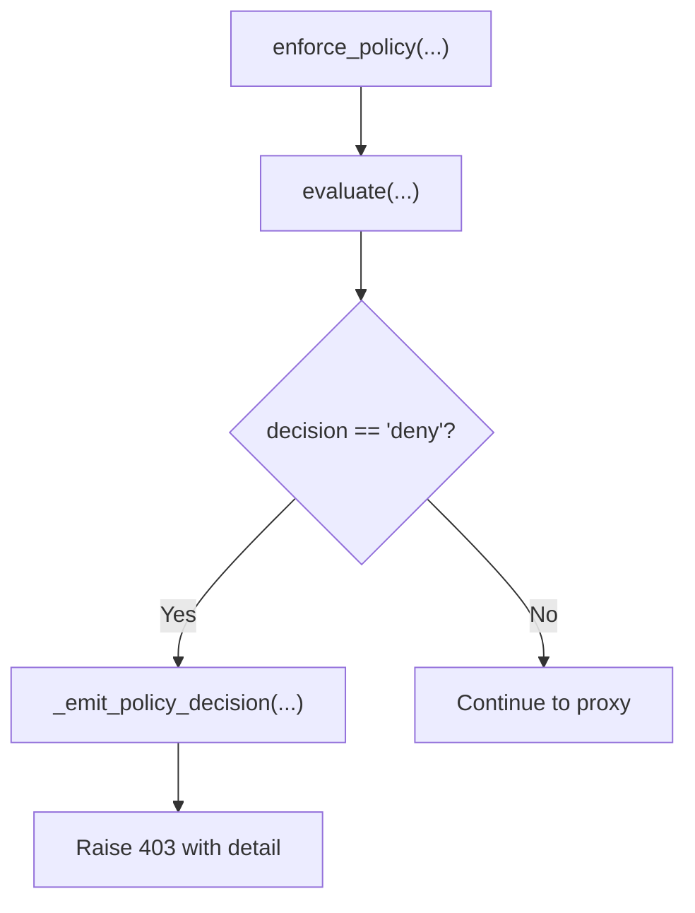

**Diagram sources**
- [gateway_service.py:267-300](file://products/platform-gateway/src/platform_gateway/services/gateway_service.py#L267-L300)

**Section sources**
- [gateway_service.py:267-300](file://products/platform-gateway/src/platform_gateway/services/gateway_service.py#L267-L300)

## Dependency Analysis
- The gateway depends on:
  - Identity Broker for token exchange and JWKS
  - Agent Platform for sessions, chat, incidents, documents, models, skills
  - Tool-Gateway for tool invocation (via delegated tokens)
  - Audit Service for durable audit ingestion
- Configuration drives service URLs, audiences, and feature toggles

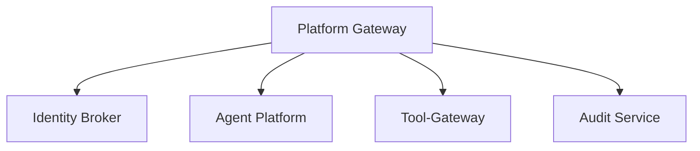

**Diagram sources**
- [config.py:23-53](file://products/platform-gateway/src/platform_gateway/core/config.py#L23-L53)
- [delegation_client.py:78-101](file://products/platform-gateway/src/platform_gateway/services/delegation_client.py#L78-L101)
- [audit_emitter.py:68-99](file://products/platform-gateway/src/platform_gateway/services/audit_emitter.py#L68-L99)

**Section sources**
- [config.py:23-53](file://products/platform-gateway/src/platform_gateway/core/config.py#L23-L53)
- [delegation_client.py:78-101](file://products/platform-gateway/src/platform_gateway/services/delegation_client.py#L78-L101)
- [audit_emitter.py:68-99](file://products/platform-gateway/src/platform_gateway/services/audit_emitter.py#L68-L99)

## Performance Considerations
- Local JWT verification eliminates per-request introspection latency
- JWKS keys are cached with a configurable lifespan
- Delegated tokens are cached per user subject with early refresh near expiry
- Audit emission is asynchronous and non-blocking
- Policy bundle is loaded once and cached per process; metadata includes version and SHA-256 fingerprint

[No sources needed since this section provides general guidance]

## Troubleshooting Guide
Common issues and diagnostics:
- 401 Unauthorized: missing or malformed Authorization header; expired or invalid token; wrong issuer/audience
- 403 Forbidden: explicit deny rule matched; no matching rule; require_approval not yet satisfied
- 502 Bad Gateway: upstream service unavailable or returned 5xx; identity service unreachable during login flows
- Degraded readiness: policy bundle load failure or agent service health check failure

Operational checks:
- Readiness endpoint exposes policy rule count and bundle SHA-256
- Live status reports service name and version
- Audit logs capture policy decisions and emit failures

**Section sources**
- [gateway_service.py:57-88](file://products/platform-gateway/src/platform_gateway/services/gateway_service.py#L57-L88)
- [gateway_service.py:204-300](file://products/platform-gateway/src/platform_gateway/services/gateway_service.py#L204-L300)
- [audit_emitter.py:68-99](file://products/platform-gateway/src/platform_gateway/services/audit_emitter.py#L68-L99)

## Conclusion
The Platform Gateway centralizes security and policy enforcement for the operator portal. It authenticates via local JWT verification, delegates tokens for tool execution, evaluates a strict deny-by-default policy bundle, integrates approval workflows for mutating actions, proxies requests to backend services with robust error handling, and emits durable audit events. Transparency endpoints expose the effective permission matrix, ensuring operators can understand and validate their access.

[No sources needed since this section summarizes without analyzing specific files]