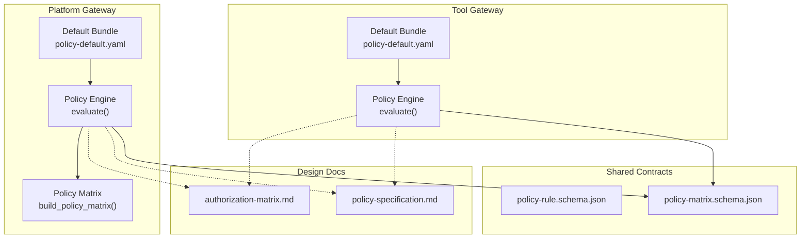
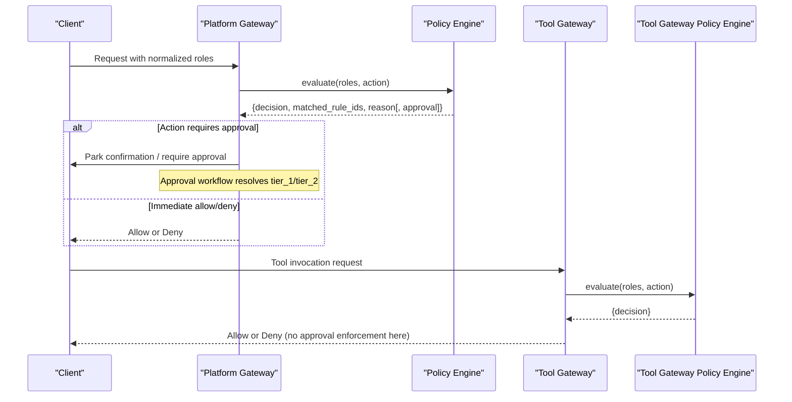
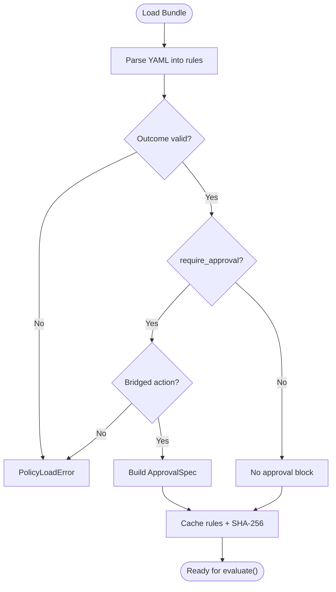
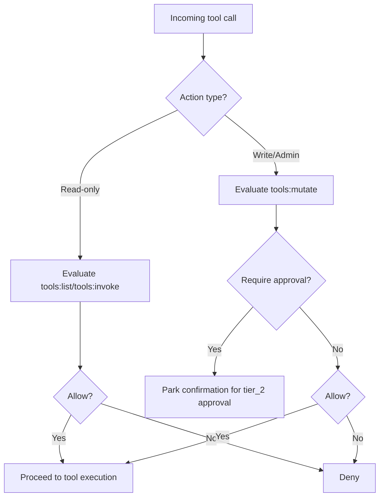
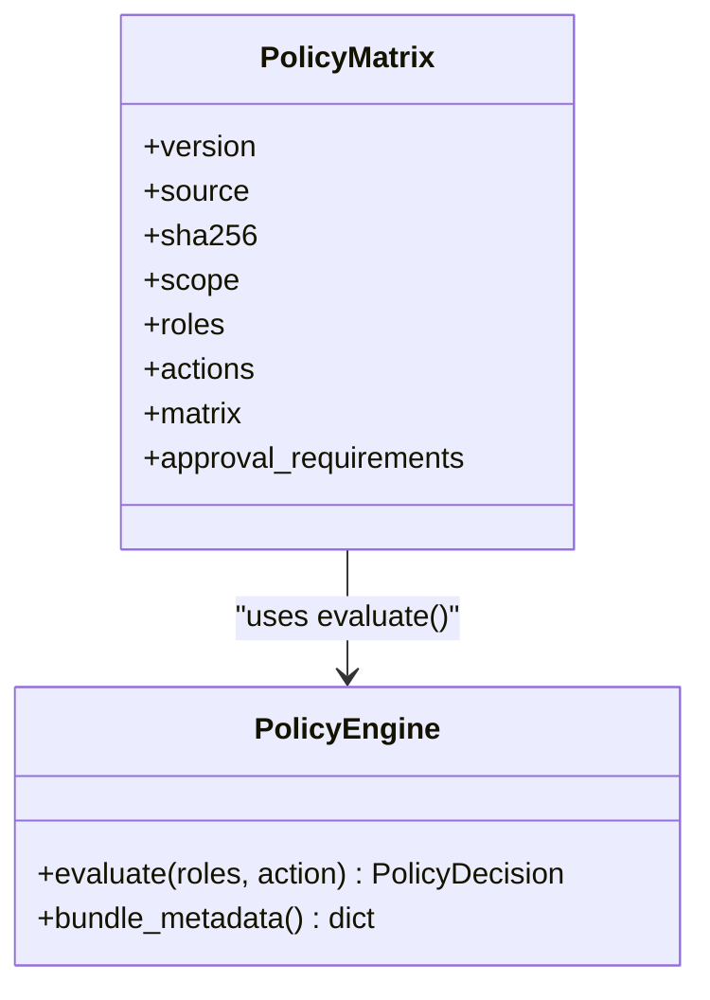
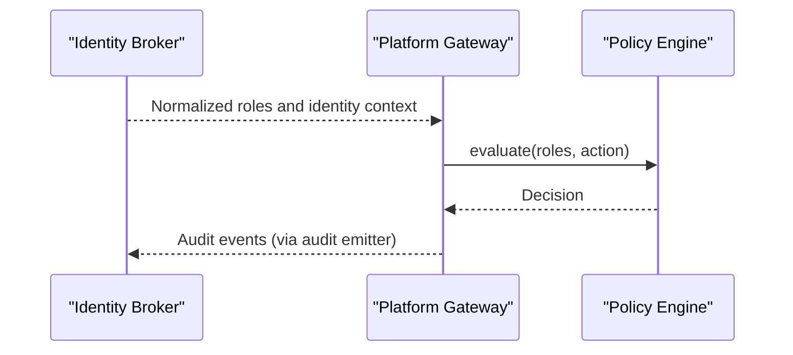
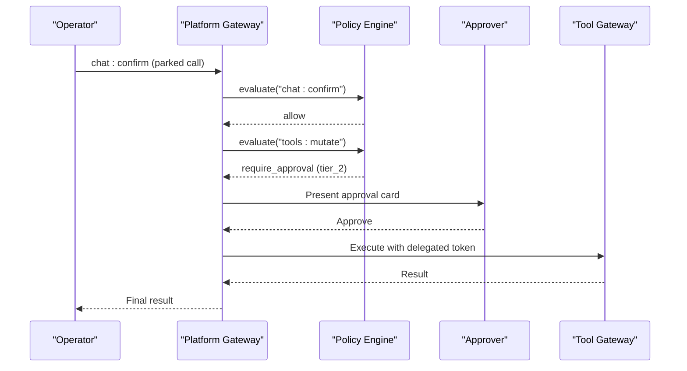
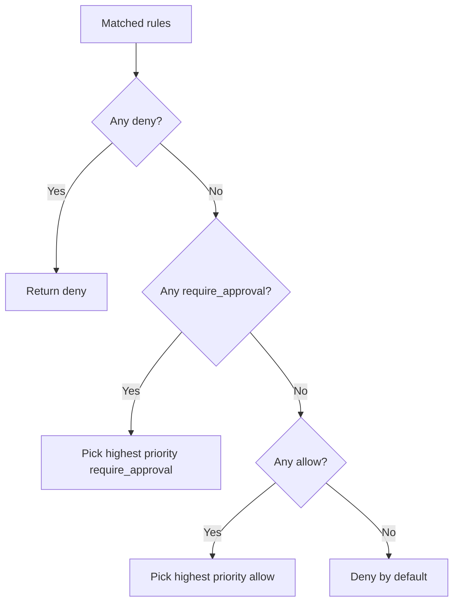
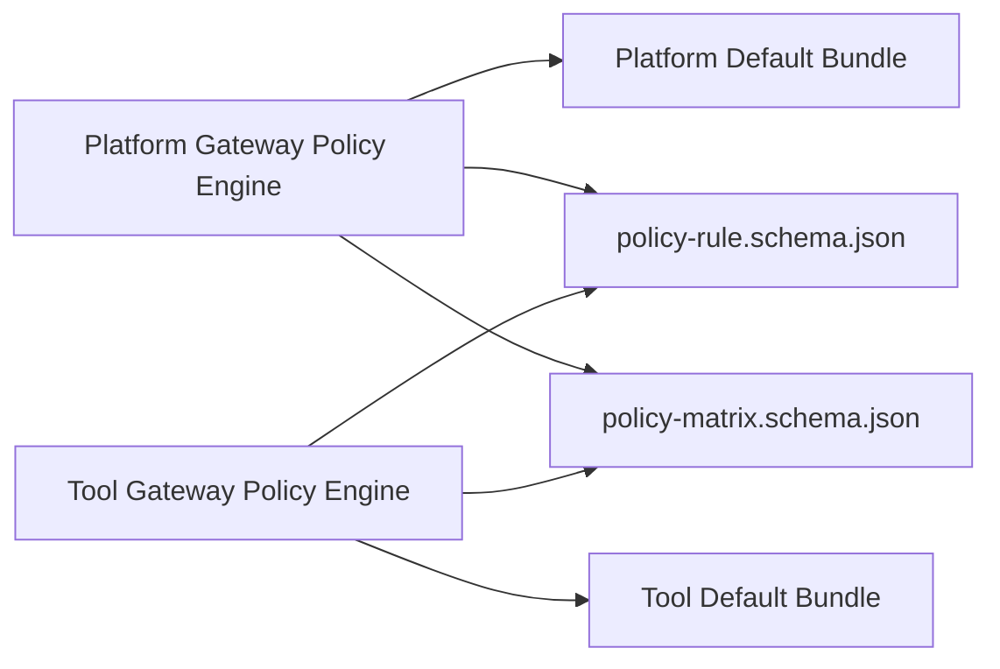

# Policy Engine and Authorization

<cite>
**Referenced Files in This Document**
- [policy_engine.py](file://products/platform-gateway/src/platform_gateway/services/policy_engine.py)
- [policy_matrix.py](file://products/platform-gateway/src/platform_gateway/services/policy_matrix.py)
- [policy-default.yaml](file://products/platform-gateway/src/platform_gateway/policies/policy-default.yaml)
- [policy_engine.py](file://products/tool-gateway/src/tool_gateway/services/policy_engine.py)
- [policy-default.yaml](file://products/tool-gateway/src/tool_gateway/policies/policy-default.yaml)
- [policy-rule.schema.json](file://shared/shared-contracts/schemas/policy-rule.schema.json)
- [policy-matrix.schema.json](file://shared/shared-contracts/schemas/policy-matrix.schema.json)
- [authorization-matrix.md](file://docs/agentic-aiops-platform/authorization-matrix.md)
- [policy-specification.md](file://docs/agentic-aiops-platform/policy-specification.md)
</cite>

## Table of Contents
1. [Introduction](#introduction)
2. [Project Structure](#project-structure)
3. [Core Components](#core-components)
4. [Architecture Overview](#architecture-overview)
5. [Detailed Component Analysis](#detailed-component-analysis)
6. [Dependency Analysis](#dependency-analysis)
7. [Performance Considerations](#performance-considerations)
8. [Troubleshooting Guide](#troubleshooting-guide)
9. [Conclusion](#conclusion)
10. [Appendices](#appendices)

## Introduction
This document explains the Platform Gateway’s policy engine and authorization system. It covers how incoming requests are evaluated against policy rules, how role-based permissions are enforced across endpoints and operations, how approval workflows integrate with policy decisions, and how policies are loaded and cached. It also documents the policy rule format, risk-tier evaluation, tool permission checks, the live policy matrix, conflict resolution, and audit logging. Finally, it describes integration points with the Identity Broker for user context and how decisions are recorded for auditing.

## Project Structure
The policy system spans two gateways:
- Platform Gateway: enforces route-level and action-level authorization, bridges HITL confirmations, and exposes a live policy matrix.
- Tool Gateway: enforces tool invocation admission (read vs write/admin tools) and delegates approval enforcement to the platform gateway.

**Diagram sources**
- [policy_engine.py:390-444](file://products/platform-gateway/src/platform_gateway/services/policy_engine.py#L390-L444)
- [policy_matrix.py:31-88](file://products/platform-gateway/src/platform_gateway/services/policy_matrix.py#L31-L88)
- [policy-default.yaml:1-326](file://products/platform-gateway/src/platform_gateway/policies/policy-default.yaml#L1-L326)
- [policy_engine.py:299-355](file://products/tool-gateway/src/tool_gateway/services/policy_engine.py#L299-L355)
- [policy-default.yaml:1-326](file://products/tool-gateway/src/tool_gateway/policies/policy-default.yaml#L1-L326)
- [policy-rule.schema.json:1-105](file://shared/shared-contracts/schemas/policy-rule.schema.json#L1-L105)
- [policy-matrix.schema.json:1-85](file://shared/shared-contracts/schemas/policy-matrix.schema.json#L1-L85)
- [authorization-matrix.md:1-528](file://docs/agentic-aiops-platform/authorization-matrix.md#L1-L528)
- [policy-specification.md:1-567](file://docs/agentic-aiops-platform/policy-specification.md#L1-L567)

**Section sources**
- [policy_engine.py:1-136](file://products/platform-gateway/src/platform_gateway/services/policy_engine.py#L1-L136)
- [policy_engine.py:1-60](file://products/tool-gateway/src/tool_gateway/services/policy_engine.py#L1-L60)
- [policy-default.yaml:1-52](file://products/platform-gateway/src/platform_gateway/policies/policy-default.yaml#L1-L52)
- [policy-default.yaml:1-52](file://products/tool-gateway/src/tool_gateway/policies/policy-default.yaml#L1-L52)

## Core Components
- Policy bundle loader: loads YAML bundles from a configured path or packaged defaults; caches them per process; computes a SHA-256 fingerprint at load time.
- Rule parser and validator: validates schema, outcomes, and approval blocks; enforces that require_approval is only valid on bridged actions in the platform gateway.
- Evaluator: matches enabled rules by roles and actions, applies precedence deny > require_approval > allow, selects highest priority within an outcome class, and returns a structured decision.
- Live matrix builder: derives a role × action boolean matrix plus an additive approval_requirements structure from the same evaluate() path used for enforcement.
- Default bundles: define the canonical set of actions and grants for both gateways.

Key behaviors:
- Deny-by-default when no rule matches.
- Explicit deny overrides require_approval and allow.
- require_approval overrides allow.
- Higher priority wins within an outcome class.
- Disabled rules are ignored.

**Section sources**
- [policy_engine.py:334-371](file://products/platform-gateway/src/platform_gateway/services/policy_engine.py#L334-L371)
- [policy_engine.py:390-444](file://products/platform-gateway/src/platform_gateway/services/policy_engine.py#L390-L444)
- [policy_matrix.py:31-88](file://products/platform-gateway/src/platform_gateway/services/policy_matrix.py#L31-L88)
- [policy-engine.py:254-287](file://products/tool-gateway/src/tool_gateway/services/policy_engine.py#L254-L287)
- [policy-engine.py:299-355](file://products/tool-gateway/src/tool_gateway/services/policy_engine.py#L299-L355)

## Architecture Overview
The platform gateway evaluates every protected action through the policy engine using normalized roles provided by the identity layer. The tool gateway enforces tool invocation admission based on the same rule vocabulary but does not enforce approvals itself; approvals are enforced on the platform gateway’s confirmation path.

**Diagram sources**
- [policy_engine.py:390-444](file://products/platform-gateway/src/platform_gateway/services/policy_engine.py#L390-L444)
- [policy_engine.py:299-355](file://products/tool-gateway/src/tool_gateway/services/policy_engine.py#L299-L355)

**Section sources**
- [policy_engine.py:92-127](file://products/platform-gateway/src/platform_gateway/services/policy_engine.py#L92-L127)
- [policy_engine.py:32-52](file://products/tool-gateway/src/tool_gateway/services/policy_engine.py#L32-L52)

## Detailed Component Analysis

### Policy Rule Format and Validation
- Rules are defined in YAML bundles under each gateway’s policies directory.
- Each rule includes id, domain, description, priority, enabled, match (roles_any, actions_any), and decision (outcome, optional approval).
- The shared JSON Schema defines the contract for rules and decisions.
- The platform gateway enforces that require_approval rules apply only to bridged actions (currently tools:mutate). The tool gateway skips require_approval rules entirely because it has no approval substrate.

**Diagram sources**
- [policy_engine.py:269-331](file://products/platform-gateway/src/platform_gateway/services/policy_engine.py#L269-L331)
- [policy_engine.py:192-251](file://products/tool-gateway/src/tool_gateway/services/policy_engine.py#L192-L251)
- [policy-rule.schema.json:1-105](file://shared/shared-contracts/schemas/policy-rule.schema.json#L1-L105)

**Section sources**
- [policy_engine.py:229-331](file://products/platform-gateway/src/platform_gateway/services/policy_engine.py#L229-L331)
- [policy_engine.py:152-251](file://products/tool-gateway/src/tool_gateway/services/policy_engine.py#L152-L251)
- [policy-rule.schema.json:1-105](file://shared/shared-contracts/schemas/policy-rule.schema.json#L1-L105)

### Risk Tier Evaluation and Tool Permission Checks
- Risk tiers are part of the broader authorization model and influence default behavior and approval requirements.
- In the platform gateway, mutating tool execution is gated via the tools:mutate action and requires tier_2 approval by designated approvers distinct from the requester.
- In the tool gateway, read-only tool execution requires tools:invoke; write/admin tools additionally require tools:mutate. The tool gateway performs allow/deny admission only; approvals are enforced upstream.

**Diagram sources**
- [policy-default.yaml:90-151](file://products/platform-gateway/src/platform_gateway/policies/policy-default.yaml#L90-L151)
- [policy-default.yaml:90-151](file://products/tool-gateway/src/tool_gateway/policies/policy-default.yaml#L90-L151)
- [policy_engine.py:32-52](file://products/tool-gateway/src/tool_gateway/services/policy_engine.py#L32-L52)

**Section sources**
- [policy-default.yaml:90-151](file://products/platform-gateway/src/platform_gateway/policies/policy-default.yaml#L90-L151)
- [policy-default.yaml:90-151](file://products/tool-gateway/src/tool_gateway/policies/policy-default.yaml#L90-L151)
- [policy_engine.py:32-52](file://products/tool-gateway/src/tool_gateway/services/policy_engine.py#L32-L52)

### Policy Matrix Structure and Live Transparency
- The live matrix is derived by evaluating every role × action pair through the same evaluate() function used for enforcement.
- For platform-admin, the matrix shows all roles; for other identities, only their granted roles are shown.
- Cells evaluating to require_approval appear as false in the boolean matrix and additionally include approval_requirements with tier and decider roles.

**Diagram sources**
- [policy_matrix.py:31-88](file://products/platform-gateway/src/platform_gateway/services/policy_matrix.py#L31-L88)
- [policy_engine.py:374-387](file://products/platform-gateway/src/platform_gateway/services/policy_engine.py#L374-L387)
- [policy-matrix.schema.json:1-85](file://shared/shared-contracts/schemas/policy-matrix.schema.json#L1-L85)

**Section sources**
- [policy_matrix.py:31-88](file://products/platform-gateway/src/platform_gateway/services/policy_matrix.py#L31-L88)
- [policy-matrix.schema.json:1-85](file://shared/shared-contracts/schemas/policy-matrix.schema.json#L1-L85)

### Integration with Identity Broker and User Context
- The policy engine consumes normalized roles supplied by the identity layer. The platform gateway uses these roles to evaluate protected actions.
- The tool gateway similarly uses normalized roles for tool invocation admission.
- The design documentation outlines normalization and environment scoping expectations consumed by the policy engine.

**Diagram sources**
- [policy_engine.py:390-444](file://products/platform-gateway/src/platform_gateway/services/policy_engine.py#L390-L444)
- [policy_engine.py:299-355](file://products/tool-gateway/src/tool_gateway/services/policy_engine.py#L299-L355)
- [policy-specification.md:88-120](file://docs/agentic-aiops-platform/policy-specification.md#L88-L120)

**Section sources**
- [policy-specification.md:88-120](file://docs/agentic-aiops-platform/policy-specification.md#L88-L120)

### Approval Workflows and HITL Bridging
- Mutating tool execution triggers a require_approval decision with tier_2 approval by designated approvers distinct from the requester.
- The platform gateway parks the confirmation and coordinates approval; the tool gateway does not enforce approvals.
- The authorization matrix documents the separation of duties and approval boundaries.

**Diagram sources**
- [policy-default.yaml:130-151](file://products/platform-gateway/src/platform_gateway/policies/policy-default.yaml#L130-L151)
- [policy_engine.py:390-444](file://products/platform-gateway/src/platform_gateway/services/policy_engine.py#L390-L444)
- [authorization-matrix.md:378-397](file://docs/agentic-aiops-platform/authorization-matrix.md#L378-L397)

**Section sources**
- [policy-default.yaml:130-151](file://products/platform-gateway/src/platform_gateway/policies/policy-default.yaml#L130-L151)
- [authorization-matrix.md:378-397](file://docs/agentic-aiops-platform/authorization-matrix.md#L378-L397)

### Policy Conflicts and Overrides
- Precedence: explicit deny > require_approval > allow.
- Within the same outcome class, higher priority wins.
- Disabled rules are ignored.
- These semantics are enforced in the evaluator and documented in the policy specification.

**Diagram sources**
- [policy_engine.py:390-444](file://products/platform-gateway/src/platform_gateway/services/policy_engine.py#L390-L444)
- [policy-specification.md:256-274](file://docs/agentic-aiops-platform/policy-specification.md#L256-L274)

**Section sources**
- [policy_engine.py:390-444](file://products/platform-gateway/src/platform_gateway/services/policy_engine.py#L390-L444)
- [policy-specification.md:256-274](file://docs/agentic-aiops-platform/policy-specification.md#L256-L274)

### Examples of Policy Rules and Decision Outcomes
- Read access: roles holding chat/session actions may use chat and manage sessions.
- Observer access: read-only observers may query via chat and view sessions.
- Tool invocation: operational, developer, approver, and observer roles may invoke read-only tools.
- Mutating tools: require tier_2 approval by approver or platform-admin distinct from requester.
- Audit and transparency: auditors and platform admins may read audit trails; all roles may read policy and skills inventory.

These examples are defined in the default bundles and validated by the schemas.

**Section sources**
- [policy-default.yaml:54-151](file://products/platform-gateway/src/platform_gateway/policies/policy-default.yaml#L54-L151)
- [policy-default.yaml:54-151](file://products/tool-gateway/src/tool_gateway/policies/policy-default.yaml#L54-L151)
- [policy-rule.schema.json:1-105](file://shared/shared-contracts/schemas/policy-rule.schema.json#L1-L105)

## Dependency Analysis
- Platform Gateway depends on:
  - Its own policy engine for evaluation and matrix derivation.
  - The default bundle for canonical rules.
  - Shared schemas for validation and transparency surfaces.
- Tool Gateway depends on:
  - Its own policy engine for admission control.
  - The default bundle for tool-related actions.
  - Shared schemas for validation.

**Diagram sources**
- [policy_engine.py:334-371](file://products/platform-gateway/src/platform_gateway/services/policy_engine.py#L334-L371)
- [policy_engine.py:254-287](file://products/tool-gateway/src/tool_gateway/services/policy_engine.py#L254-L287)
- [policy-default.yaml:1-52](file://products/platform-gateway/src/platform_gateway/policies/policy-default.yaml#L1-L52)
- [policy-default.yaml:1-52](file://products/tool-gateway/src/tool_gateway/policies/policy-default.yaml#L1-L52)
- [policy-rule.schema.json:1-105](file://shared/shared-contracts/schemas/policy-rule.schema.json#L1-L105)
- [policy-matrix.schema.json:1-85](file://shared/shared-contracts/schemas/policy-matrix.schema.json#L1-L85)

**Section sources**
- [policy_engine.py:334-371](file://products/platform-gateway/src/platform_gateway/services/policy_engine.py#L334-L371)
- [policy_engine.py:254-287](file://products/tool-gateway/src/tool_gateway/services/policy_engine.py#L254-L287)

## Performance Considerations
- Bundles are parsed once and cached per process; subsequent evaluations reuse the in-memory rule list.
- Evaluations scan enabled rules matching the requested action and intersecting caller roles; complexity is linear in the number of enabled rules.
- The live matrix builds rows by evaluating each role × action pair; this is intentionally read-only and can be cached at the API layer if needed.

[No sources needed since this section provides general guidance]

## Troubleshooting Guide
Common issues and diagnostics:
- PolicyLoadError during bundle load indicates invalid YAML, missing required fields, unknown outcomes, or invalid approval blocks.
- require_approval on non-bridged actions fails at load time in the platform gateway.
- Missing policy path raises a clear error rather than silently falling back.
- Use the live policy matrix endpoint to verify effective permissions and approval requirements for the current bundle.
- Compare bundle SHA-256 fingerprints to confirm the enforced bundle matches the intended commit.

**Section sources**
- [policy_engine.py:229-331](file://products/platform-gateway/src/platform_gateway/services/policy_engine.py#L229-L331)
- [policy_engine.py:334-371](file://products/platform-gateway/src/platform_gateway/services/policy_engine.py#L334-L371)
- [policy_matrix.py:31-88](file://products/platform-gateway/src/platform_gateway/services/policy_matrix.py#L31-L88)

## Conclusion
The Platform Gateway’s policy engine implements a compact, deterministic authorization model grounded in versioned YAML bundles, strict schema validation, and clear precedence rules. It integrates with the Identity Broker via normalized roles, enforces tool permissions at both gateways, and bridges approval workflows where necessary. The live policy matrix provides transparent, authoritative visibility into effective permissions and approval requirements, while bundle provenance ensures deploy-time verification.

[No sources needed since this section summarizes without analyzing specific files]

## Appendices

### Policy Rule Fields and Semantics
- id: unique stable identifier.
- domain: action_authz for this slice.
- description: human-readable explanation.
- priority: numeric precedence within an outcome class.
- enabled: whether the rule participates in evaluation.
- match.roles_any: principal must hold at least one listed role.
- match.actions_any: rule applies to listed actions.
- decision.outcome: allow, deny, or require_approval.
- decision.approval: required for require_approval; includes tier and decided_by_roles; optional allow_self_approval override.

**Section sources**
- [policy-rule.schema.json:1-105](file://shared/shared-contracts/schemas/policy-rule.schema.json#L1-L105)

### Live Matrix Fields and Semantics
- version, source, sha256: provenance of the loaded bundle.
- scope: full for platform-admin; own for others.
- roles, actions: sorted sets used to render the matrix.
- matrix: boolean cells indicating immediate allow.
- approval_requirements: additive third state for require_approval cells.

**Section sources**
- [policy-matrix.schema.json:1-85](file://shared/shared-contracts/schemas/policy-matrix.schema.json#L1-L85)
- [policy_matrix.py:31-88](file://products/platform-gateway/src/platform_gateway/services/policy_matrix.py#L31-L88)