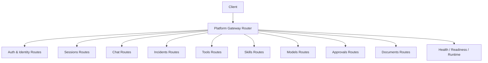
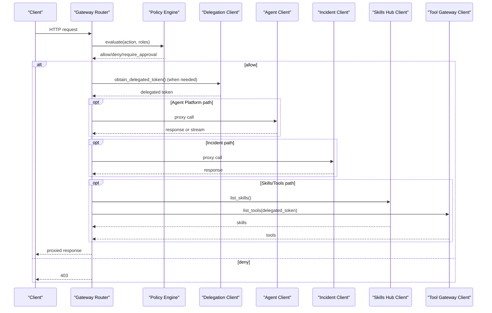
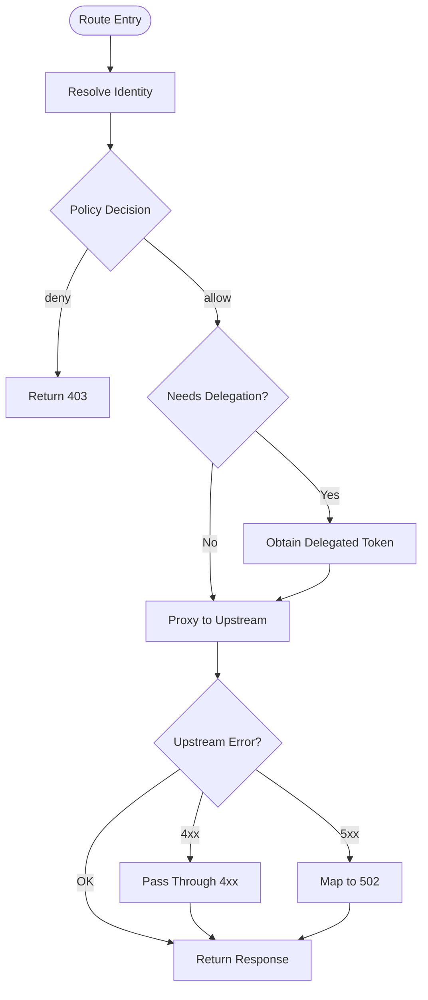
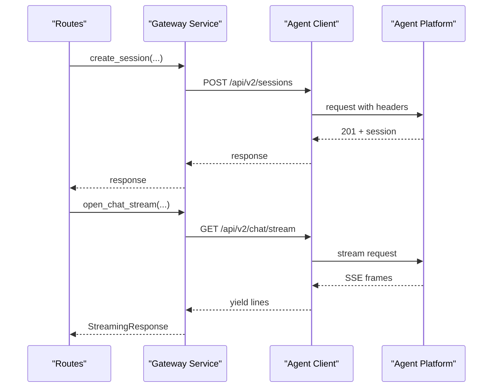
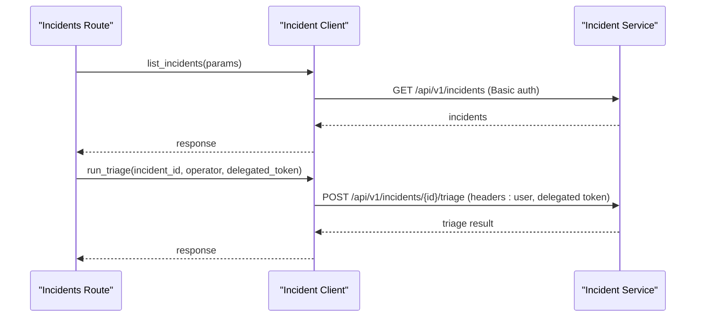
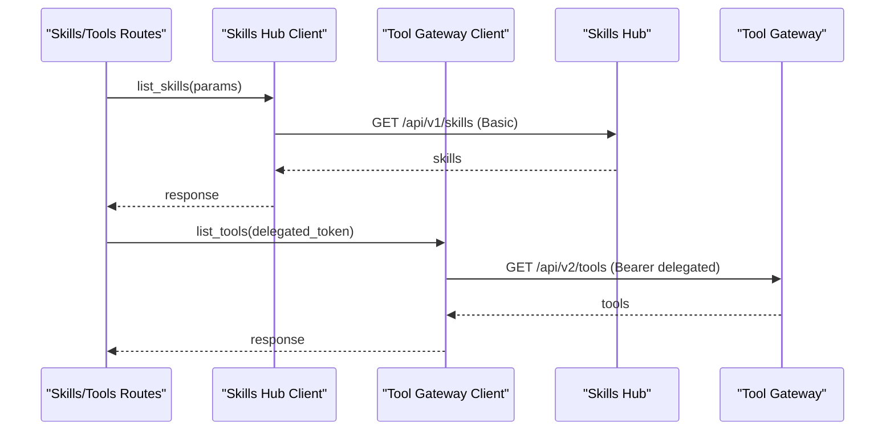
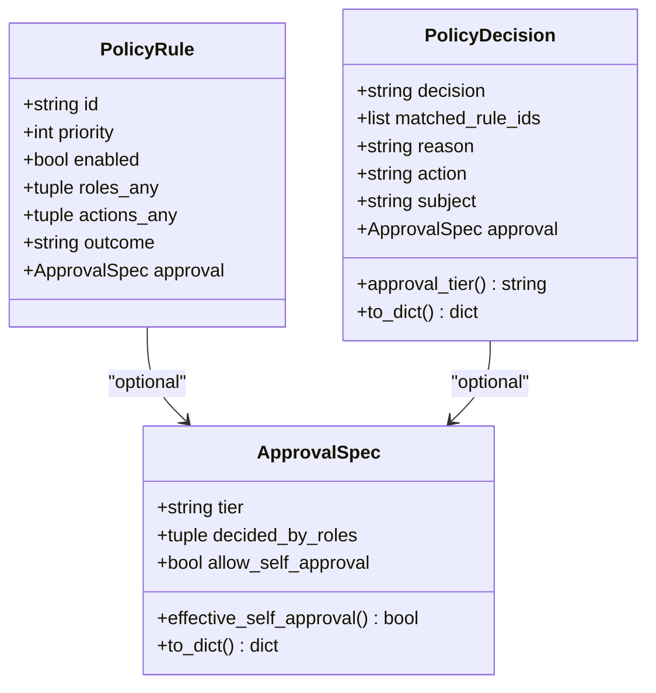
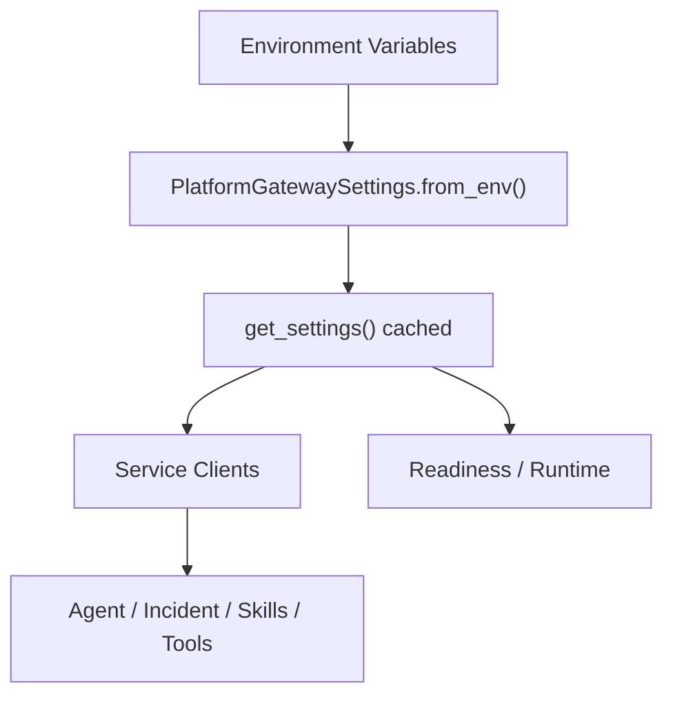
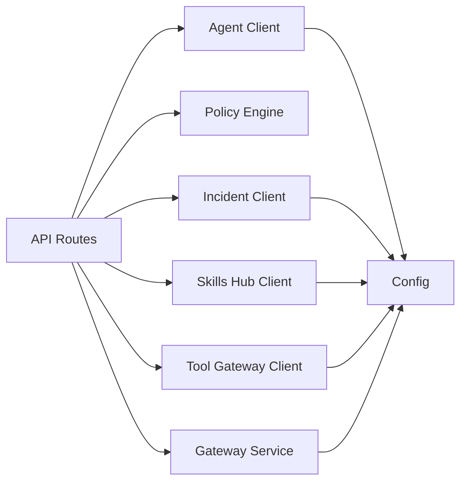

# Request Routing and Service Proxying

<cite>
**Referenced Files in This Document**
- [README.md](file://products/platform-gateway/README.md)
- [router.py](file://products/platform-gateway/src/platform_gateway/api/router.py)
- [chat.py](file://products/platform-gateway/src/platform_gateway/api/routes/chat.py)
- [sessions.py](file://products/platform-gateway/src/platform_gateway/api/routes/sessions.py)
- [incidents.py](file://products/platform-gateway/src/platform_gateway/api/routes/incidents.py)
- [gateway_service.py](file://products/platform-gateway/src/platform_gateway/services/gateway_service.py)
- [agent_client.py](file://products/platform-gateway/src/platform_gateway/services/agent_client.py)
- [incident_client.py](file://products/platform-gateway/src/platform_gateway/services/incident_client.py)
- [skills_hub_client.py](file://products/platform-gateway/src/platform_gateway/services/skills_hub_client.py)
- [tool_gateway_client.py](file://products/platform-gateway/src/platform_gateway/services/tool_gateway_client.py)
- [policy_engine.py](file://products/platform-gateway/src/platform_gateway/services/policy_engine.py)
- [config.py](file://products/platform-gateway/src/platform_gateway/core/config.py)
</cite>

## Table of Contents
1. [Introduction](#introduction)
2. [Project Structure](#project-structure)
3. [Core Components](#core-components)
4. [Architecture Overview](#architecture-overview)
5. [Detailed Component Analysis](#detailed-component-analysis)
6. [Dependency Analysis](#dependency-analysis)
7. [Performance Considerations](#performance-considerations)
8. [Troubleshooting Guide](#troubleshooting-guide)
9. [Conclusion](#conclusion)

## Introduction
This document explains how the Platform Gateway routes incoming API requests to backend services (Agent Platform, Incident Service, Skills Hub, Tool Gateway), transforms requests and responses, and manages service discovery and resilience. It covers the client abstraction layer, error mapping, policy enforcement, streaming proxying, and configuration-driven routing. It also documents rate limiting posture, request batching, and performance optimization techniques used by the gateway.

## Project Structure
The Platform Gateway is a FastAPI application that:
- Registers feature routers for auth, sessions, chat, incidents, tools, skills, models, approvals, and documents.
- Enforces identity verification and deny-by-default policy decisions per action.
- Proxies calls to upstream services using dedicated HTTP clients with consistent error mapping.
- Exposes health, readiness, and runtime metadata endpoints.

**Diagram sources**
- [router.py:1-35](file://products/platform-gateway/src/platform_gateway/api/router.py#L1-L35)

**Section sources**
- [router.py:1-35](file://products/platform-gateway/src/platform_gateway/api/router.py#L1-L35)
- [README.md:1-88](file://products/platform-gateway/README.md#L1-L88)

## Core Components
- Policy engine: loads and evaluates a YAML bundle with deny-by-default semantics; supports allow, deny, and require_approval outcomes.
- Identity resolution: verifies bearer tokens locally or falls back to synthetic dev identity when configured.
- Upstream clients:
  - Agent Platform client for v2 session/chat/documents/runtime surfaces.
  - Incident Service client for list/get/report/create/triage.
  - Skills Hub client for read-only inventory.
  - Tool Gateway client for delegated tool discovery.
- Gateway service: orchestrates policy checks, token delegation, audit emission, and response mapping.

Key responsibilities include:
- Per-route authorization via actions such as chat, session:create/read/list/delete/update, incident:read/create/triage, tools:list, skills:read, models:list, approvals:list, documents:create/read, session:skill_draft, incident:skill_draft, session:skill_graduate.
- Consistent error posture: upstream 4xx pass through; transport failures and upstream 5xx map to 502; missing service config maps to 503.
- Streaming support for chat and confirm flows with SSE line forwarding.

**Section sources**
- [policy_engine.py:1-444](file://products/platform-gateway/src/platform_gateway/services/policy_engine.py#L1-L444)
- [gateway_service.py:98-300](file://products/platform-gateway/src/platform_gateway/services/gateway_service.py#L98-L300)
- [agent_client.py:1-565](file://products/platform-gateway/src/platform_gateway/services/agent_client.py#L1-L565)
- [incident_client.py:1-193](file://products/platform-gateway/src/platform_gateway/services/incident_client.py#L1-L193)
- [skills_hub_client.py:1-130](file://products/platform-gateway/src/platform_gateway/services/skills_hub_client.py#L1-L130)
- [tool_gateway_client.py:1-76](file://products/platform-gateway/src/platform_gateway/services/tool_gateway_client.py#L1-L76)

## Architecture Overview
The gateway acts as an authenticated edge that validates identity, enforces policies, optionally obtains delegated tokens, and proxies to upstream services. It maintains a consistent contract for errors and observability.

**Diagram sources**
- [chat.py:37-93](file://products/platform-gateway/src/platform_gateway/api/routes/chat.py#L37-L93)
- [incidents.py:68-121](file://products/platform-gateway/src/platform_gateway/api/routes/incidents.py#L68-L121)
- [gateway_service.py:267-300](file://products/platform-gateway/src/platform_gateway/services/gateway_service.py#L267-L300)
- [agent_client.py:131-158](file://products/platform-gateway/src/platform_gateway/services/agent_client.py#L131-L158)
- [incident_client.py:65-85](file://products/platform-gateway/src/platform_gateway/services/incident_client.py#L65-L85)
- [skills_hub_client.py:71-91](file://products/platform-gateway/src/platform_gateway/services/skills_hub_client.py#L71-L91)
- [tool_gateway_client.py:54-75](file://products/platform-gateway/src/platform_gateway/services/tool_gateway_client.py#L54-L75)

## Detailed Component Analysis

### Routing and Authorization Flow
- Each route resolves identity, enforces policy on a specific action, and then delegates to the appropriate service client.
- For mutating operations (e.g., skill graduation), additional policy gates are enforced at the route level.
- Audit events and structured logs are emitted around key lifecycle points.

**Diagram sources**
- [sessions.py:41-101](file://products/platform-gateway/src/platform_gateway/api/routes/sessions.py#L41-L101)
- [incidents.py:152-187](file://products/platform-gateway/src/platform_gateway/api/routes/incidents.py#L152-L187)
- [gateway_service.py:331-403](file://products/platform-gateway/src/platform_gateway/services/gateway_service.py#L331-L403)
- [incident_client.py:47-63](file://products/platform-gateway/src/platform_gateway/services/incident_client.py#L47-L63)

**Section sources**
- [chat.py:37-199](file://products/platform-gateway/src/platform_gateway/api/routes/chat.py#L37-L199)
- [sessions.py:41-361](file://products/platform-gateway/src/platform_gateway/api/routes/sessions.py#L41-L361)
- [incidents.py:68-226](file://products/platform-gateway/src/platform_gateway/api/routes/incidents.py#L68-L226)
- [gateway_service.py:267-300](file://products/platform-gateway/src/platform_gateway/services/gateway_service.py#L267-L300)

### Agent Platform Proxy (Sessions, Chat, Documents, Models)
- The agent client implements a single HTTP binding to the v2 surface, adding headers like x-request-id, X-User-ID, and optional Authorization for delegated tokens.
- Streaming endpoints use httpx streaming with eager status checks before yielding frames.
- Timeouts are tuned per operation (e.g., chat uses configurable timeout; drafts and graduation use generous timeouts).

**Diagram sources**
- [agent_client.py:32-60](file://products/platform-gateway/src/platform_gateway/services/agent_client.py#L32-L60)
- [agent_client.py:161-222](file://products/platform-gateway/src/platform_gateway/services/agent_client.py#L161-L222)
- [gateway_service.py:331-403](file://products/platform-gateway/src/platform_gateway/services/gateway_service.py#L331-L403)

**Section sources**
- [agent_client.py:1-565](file://products/platform-gateway/src/platform_gateway/services/agent_client.py#L1-L565)
- [gateway_service.py:331-800](file://products/platform-gateway/src/platform_gateway/services/gateway_service.py#L331-L800)

### Incident Service Proxy
- Reads use the gateway’s own Basic credential; triage additionally forwards operator identity and delegated token so downstream runs under real operator authority.
- Input validation ensures incident IDs match the expected pattern before URL interpolation.
- Error mapping passes 4xx through and maps transport/upstream 5xx to 502; unconfigured service returns 503.

**Diagram sources**
- [incidents.py:68-121](file://products/platform-gateway/src/platform_gateway/api/routes/incidents.py#L68-L121)
- [incidents.py:190-226](file://products/platform-gateway/src/platform_gateway/api/routes/incidents.py#L190-L226)
- [incident_client.py:65-193](file://products/platform-gateway/src/platform_gateway/services/incident_client.py#L65-L193)

**Section sources**
- [incidents.py:68-226](file://products/platform-gateway/src/platform_gateway/api/routes/incidents.py#L68-L226)
- [incident_client.py:1-193](file://products/platform-gateway/src/platform_gateway/services/incident_client.py#L1-L193)

### Skills Hub and Tool Gateway Proxies
- Skills Hub: read-only inventory accessed with gateway credentials; skill ID validated against a strict regex before URL composition.
- Tool Gateway: read-only tool discovery forwarded with a broker-mediated delegated token; user token never crosses the boundary.

**Diagram sources**
- [skills_hub_client.py:71-130](file://products/platform-gateway/src/platform_gateway/services/skills_hub_client.py#L71-L130)
- [tool_gateway_client.py:54-75](file://products/platform-gateway/src/platform_gateway/services/tool_gateway_client.py#L54-L75)

**Section sources**
- [skills_hub_client.py:1-130](file://products/platform-gateway/src/platform_gateway/services/skills_hub_client.py#L1-L130)
- [tool_gateway_client.py:1-76](file://products/platform-gateway/src/platform_gateway/services/tool_gateway_client.py#L1-L76)

### Policy Enforcement and Actions
- The policy engine loads a YAML bundle (packaged default or configured path), parses rules, and evaluates actions with precedence: deny > require_approval > allow.
- Protected actions are explicitly enumerated; routes enforce the corresponding action(s).
- require_approval rules carry approval tiers and decider roles; only bridged actions can use require_approval in this slice.

**Diagram sources**
- [policy_engine.py:142-210](file://products/platform-gateway/src/platform_gateway/services/policy_engine.py#L142-L210)
- [policy_engine.py:170-210](file://products/platform-gateway/src/platform_gateway/services/policy_engine.py#L170-L210)

**Section sources**
- [policy_engine.py:1-444](file://products/platform-gateway/src/platform_gateway/services/policy_engine.py#L1-L444)
- [gateway_service.py:267-300](file://products/platform-gateway/src/platform_gateway/services/gateway_service.py#L267-L300)

### Configuration and Service Discovery
- All upstream URLs and credentials are environment-driven via a frozen settings dataclass.
- Optional services (incident-service, skills-hub, tool-gateway) are disabled when their URL is empty; calls return 503.
- Readiness probes validate policy bundle load and agent service health.

**Diagram sources**
- [config.py:23-131](file://products/platform-gateway/src/platform_gateway/core/config.py#L23-L131)
- [incident_client.py:35-41](file://products/platform-gateway/src/platform_gateway/services/incident_client.py#L35-L41)
- [skills_hub_client.py:41-47](file://products/platform-gateway/src/platform_gateway/services/skills_hub_client.py#L41-L47)
- [tool_gateway_client.py:29-35](file://products/platform-gateway/src/platform_gateway/services/tool_gateway_client.py#L29-L35)

**Section sources**
- [config.py:1-131](file://products/platform-gateway/src/platform_gateway/core/config.py#L1-L131)
- [README.md:64-88](file://products/platform-gateway/README.md#L64-L88)

## Dependency Analysis
- Routes depend on:
  - Identity resolution and policy enforcement from gateway_service.
  - Feature-specific clients for upstream calls.
- Clients depend on:
  - PlatformGatewaySettings for URLs, credentials, and timeouts.
  - httpx for HTTP transport and streaming.
- Policy engine depends on:
  - YAML bundle parsing and module-level caching.
  - Environment-driven policy path or packaged default.

**Diagram sources**
- [router.py:1-35](file://products/platform-gateway/src/platform_gateway/api/router.py#L1-L35)
- [config.py:23-131](file://products/platform-gateway/src/platform_gateway/core/config.py#L23-L131)

**Section sources**
- [router.py:1-35](file://products/platform-gateway/src/platform_gateway/api/router.py#L1-L35)
- [config.py:23-131](file://products/platform-gateway/src/platform_gateway/core/config.py#L23-L131)

## Performance Considerations
- Streaming:
  - Chat and confirm streams use httpx streaming with eager status checks and proper resource cleanup to avoid leaking connections.
- Timeouts:
  - Chat uses a configurable response timeout; drafts and graduation use generous timeouts due to model calls and validation round-trips.
  - Incident triage has a dedicated timeout setting.
- Connection reuse:
  - Each client creates a short-lived AsyncClient per call; consider connection pooling if throughput increases significantly.
- Rate limiting:
  - No built-in rate limiter is implemented in the gateway code analyzed. Apply external rate limiting at the ingress or reverse proxy layer if required.
- Request batching:
  - No explicit batching logic is present in the analyzed routes or clients. Batch where feasible at the client or upstream to reduce round trips.
- Observability:
  - Structured logging and audit events are emitted for key operations to aid debugging and compliance.

[No sources needed since this section provides general guidance]

## Troubleshooting Guide
Common error postures:
- 401: Missing or invalid bearer token; malformed Authorization header.
- 403: Action denied by policy; check role grants and policy bundle.
- 404/409: Passed through from upstream for unknown/foreign resources or conflicts (e.g., unknown session, parked confirmation).
- 502: Transport failure or upstream 5xx mapped by gateway clients.
- 503: Upstream service not configured (incident, skills, tools) or missing delegated token for triage.

Diagnostic steps:
- Verify environment variables for upstream URLs and credentials.
- Check readiness endpoint for policy bundle load and agent service health.
- Inspect structured logs and audit events for policy decisions and upstream interactions.
- Validate input constraints (e.g., incident_id pattern, skill_id regex) before calling.

**Section sources**
- [gateway_service.py:98-143](file://products/platform-gateway/src/platform_gateway/services/gateway_service.py#L98-L143)
- [incident_client.py:47-63](file://products/platform-gateway/src/platform_gateway/services/incident_client.py#L47-L63)
- [skills_hub_client.py:53-69](file://products/platform-gateway/src/platform_gateway/services/skills_hub_client.py#L53-L69)
- [tool_gateway_client.py:37-51](file://products/platform-gateway/src/platform_gateway/services/tool_gateway_client.py#L37-L51)
- [incidents.py:190-226](file://products/platform-gateway/src/platform_gateway/api/routes/incidents.py#L190-L226)

## Conclusion
The Platform Gateway centralizes authentication, policy enforcement, and resilient proxying to multiple backend services. It standardizes error handling, supports streaming workflows, and exposes clear configuration knobs for enabling or disabling upstream integrations. By adhering to deny-by-default policies and consistent client abstractions, it maintains a secure and observable edge while delegating business logic to specialized services.