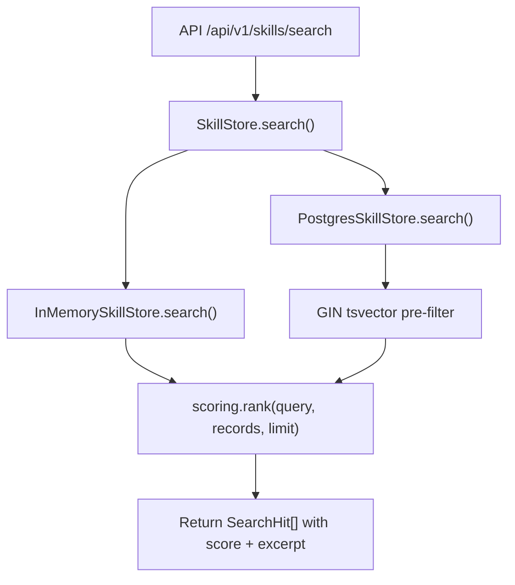
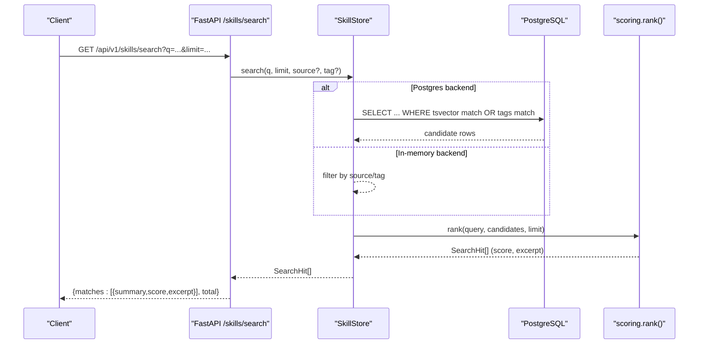
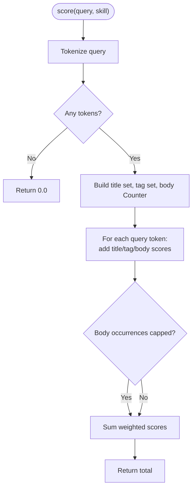
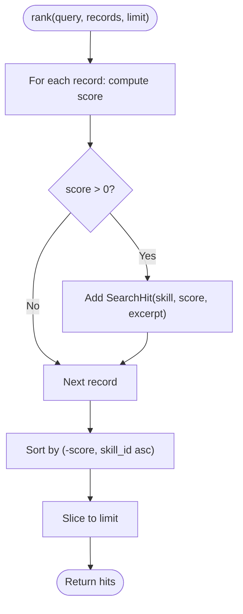
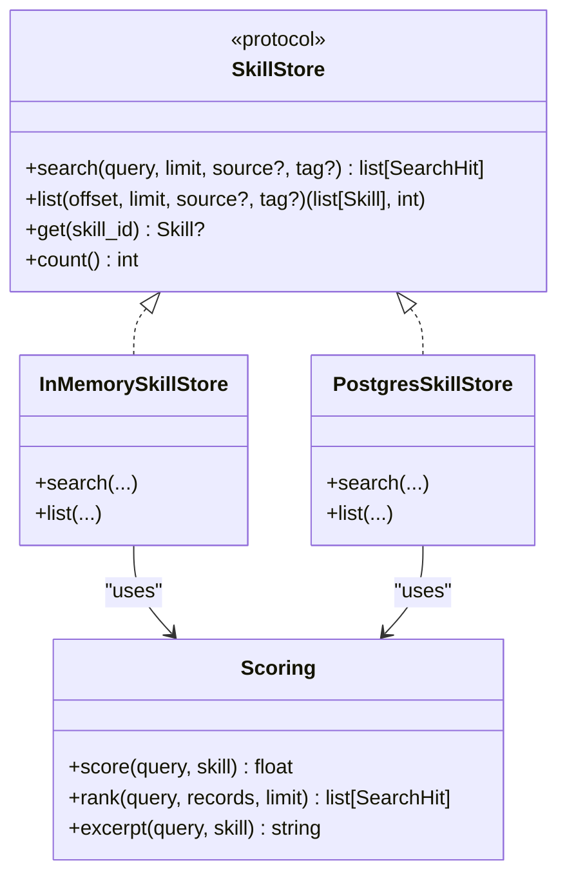
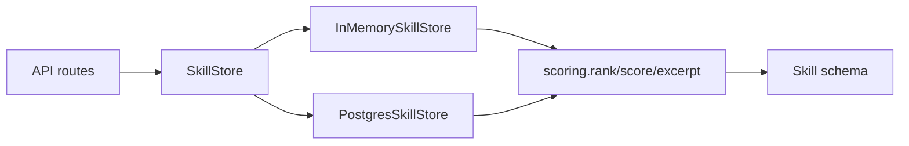

# Scoring and Ranking

<cite>
**Referenced Files in This Document**
- [scoring.py](file://products/skills-hub/src/skills_hub/services/scoring.py)
- [test_scoring.py](file://products/skills-hub/tests/test_scoring.py)
- [skill_store.py](file://products/skills-hub/src/skills_hub/services/skill_store.py)
- [skills.py](file://products/skills-hub/src/skills_hub/api/routes/skills.py)
- [skill.schema.json](file://shared/shared-contracts/schemas/skill.schema.json)
- [skill-format.md](file://shared/shared-contracts/skill-format.md)
- [README.md](file://products/skills-hub/README.md)
- [skills-guide.md](file://docs/guides/skills-guide.md)
</cite>

## Table of Contents
1. [Introduction](#introduction)
2. [Project Structure](#project-structure)
3. [Core Components](#core-components)
4. [Architecture Overview](#architecture-overview)
5. [Detailed Component Analysis](#detailed-component-analysis)
6. [Dependency Analysis](#dependency-analysis)
7. [Performance Considerations](#performance-considerations)
8. [Troubleshooting Guide](#troubleshooting-guide)
9. [Conclusion](#conclusion)

## Introduction
This document explains the Skills Hub scoring and ranking algorithms that power deterministic, explainable skill search. It covers how relevance is computed from title, tags, and body; how ties are broken; how results are limited; and how the algorithm integrates with both in-memory and PostgreSQL backends. It also documents configuration knobs, customizability boundaries, integration points with external quality signals, examples of score calculations and ranking scenarios, troubleshooting guidance for poor rankings, and performance considerations for large catalogs.

## Project Structure
The scoring and ranking logic lives in a small, focused module and is reused by both store backends to guarantee identical ordering across environments. The API routes expose search endpoints that delegate to the store, which applies pre-filtering (PostgreSQL full-text) and then re-ranks using the shared scorer.

**Diagram sources**
- [skills.py:99-146](file://products/skills-hub/src/skills_hub/api/routes/skills.py#L99-L146)
- [skill_store.py:137-144](file://products/skills-hub/src/skills_hub/services/skill_store.py#L137-L144)
- [skill_store.py:417-443](file://products/skills-hub/src/skills_hub/services/skill_store.py#L417-L443)
- [scoring.py:85-96](file://products/skills-hub/src/skills_hub/services/scoring.py#L85-L96)

**Section sources**
- [README.md:1-74](file://products/skills-hub/README.md#L1-L74)
- [skills-guide.md:12-35](file://docs/guides/skills-guide.md#L12-L35)

## Core Components
- Deterministic keyword scorer: computes a non-negative float per skill based on query tokens matched in title, tags, and body, with fixed weights and a body occurrence cap.
- Excerpt generator: returns a bounded snippet around the first matching body region or falls back to the description when matches are only in title/tags.
- Ranker: filters zero-score skills, sorts by descending score then ascending skill_id, and caps results to the requested limit.
- Store backends:
  - In-memory: scans all records and delegates ranking to the shared scorer.
  - PostgreSQL: uses a GIN index over title+body plus tag fallback to pre-filter candidates, then re-ranks with the shared scorer for byte-identical ordering.

Key constants and behaviors:
- Title weight > Tag weight > Body weight.
- Body occurrences saturate at a configurable cap to prevent long bodies from dominating.
- Zero-score records are excluded.
- Ties break by skill_id ascending for determinism.

**Section sources**
- [scoring.py:1-96](file://products/skills-hub/src/skills_hub/services/scoring.py#L1-L96)
- [test_scoring.py:1-125](file://products/skills-hub/tests/test_scoring.py#L1-L125)
- [skill_store.py:137-144](file://products/skills-hub/src/skills_hub/services/skill_store.py#L137-L144)
- [skill_store.py:417-443](file://products/skills-hub/src/skills_hub/services/skill_store.py#L417-L443)

## Architecture Overview
Search requests flow through FastAPI routes into the SkillStore abstraction. Depending on the configured backend, candidate selection differs, but ranking is always performed by the shared scorer to ensure consistency.

**Diagram sources**
- [skills.py:99-146](file://products/skills-hub/src/skills_hub/api/routes/skills.py#L99-L146)
- [skill_store.py:417-443](file://products/skills-hub/src/skills_hub/services/skill_store.py#L417-L443)
- [scoring.py:85-96](file://products/skills-hub/src/skills_hub/services/scoring.py#L85-L96)

## Detailed Component Analysis

### Scorer: tokenization, weighting, and saturation
- Tokenization: lowercases and extracts alphanumeric tokens.
- Weights:
  - Title match: fixed high weight.
  - Tag match: medium weight.
  - Body match: low weight per occurrence, capped to avoid long-body dominance.
- Output: a single float; 0.0 indicates no match.

**Diagram sources**
- [scoring.py:28-52](file://products/skills-hub/src/skills_hub/services/scoring.py#L28-L52)

**Section sources**
- [scoring.py:20-52](file://products/skills-hub/src/skills_hub/services/scoring.py#L20-L52)

### Ranker: filtering, sorting, and limiting
- Filters out zero-score skills.
- Sorts by (-score, skill_id ascending).
- Caps results to the requested limit.

**Diagram sources**
- [scoring.py:85-96](file://products/skills-hub/src/skills_hub/services/scoring.py#L85-L96)

**Section sources**
- [scoring.py:85-96](file://products/skills-hub/src/skills_hub/services/scoring.py#L85-L96)

### Excerpt generation
- Finds the earliest matching token position in the body.
- Returns a bounded window around that position, truncating with an ellipsis if needed.
- Falls back to the skill description when there is no body match.

**Section sources**
- [scoring.py:55-75](file://products/skills-hub/src/skills_hub/services/scoring.py#L55-L75)

### Store backends and integration
- In-memory store:
  - Applies optional source and tag filters.
  - Delegates ranking to the shared scorer.
- PostgreSQL store:
  - Uses a GIN index on title+body text vectors and a tag fallback to pre-filter candidates.
  - Re-ranks candidates with the shared scorer to maintain identical ordering semantics.
  - Ensures tag-only matches remain discoverable even though tags cannot be part of the immutable index expression.

**Diagram sources**
- [skill_store.py:30-66](file://products/skills-hub/src/skills_hub/services/skill_store.py#L30-L66)
- [skill_store.py:137-144](file://products/skills-hub/src/skills_hub/services/skill_store.py#L137-L144)
- [skill_store.py:417-443](file://products/skills-hub/src/skills_hub/services/skill_store.py#L417-L443)
- [scoring.py:28-96](file://products/skills-hub/src/skills_hub/services/scoring.py#L28-L96)

**Section sources**
- [skill_store.py:156-200](file://products/skills-hub/src/skills_hub/services/skill_store.py#L156-L200)
- [skill_store.py:417-443](file://products/skills-hub/src/skills_hub/services/skill_store.py#L417-L443)

### API exposure and usage audit
- Search endpoint validates parameters, authenticates callers, calls the store, emits usage audit events, and returns matches with score and excerpt.
- List endpoint supports pagination and optional source/tag filters without scoring.

**Section sources**
- [skills.py:68-96](file://products/skills-hub/src/skills_hub/api/routes/skills.py#L68-L96)
- [skills.py:99-146](file://products/skills-hub/src/skills_hub/api/routes/skills.py#L99-L146)

### Data model and frontmatter contract
- Skill schema defines required and optional fields, including title, description, tags, version, source_url, web_target, risk_class, flow_intent, kind, steps, updated_at, and body.
- Skill format documentation describes ingestion rules, size caps, identity rules, and validation expectations.

**Section sources**
- [skill.schema.json:1-125](file://shared/shared-contracts/schemas/skill.schema.json#L1-L125)
- [skill-format.md:1-203](file://shared/shared-contracts/skill-format.md#L1-L203)

## Dependency Analysis
- API routes depend on SkillStore abstraction and authentication/metrics utilities.
- Both store implementations depend on the shared scorer for ranking.
- PostgreSQL path depends on database indexes and full-text functions; in-memory path depends on Python data structures.
- Tests assert deterministic behavior, tie-breaking, and scoring weights.

**Diagram sources**
- [skills.py:99-146](file://products/skills-hub/src/skills_hub/api/routes/skills.py#L99-L146)
- [skill_store.py:137-144](file://products/skills-hub/src/skills_hub/services/skill_store.py#L137-L144)
- [skill_store.py:417-443](file://products/skills-hub/src/skills_hub/services/skill_store.py#L417-L443)
- [scoring.py:28-96](file://products/skills-hub/src/skills_hub/services/scoring.py#L28-L96)

**Section sources**
- [test_scoring.py:33-102](file://products/skills-hub/tests/test_scoring.py#L33-L102)

## Performance Considerations
- Deterministic O(n) scoring per candidate after pre-filtering.
- PostgreSQL path reduces n via GIN full-text index and tag fallback; still re-ranks in-process for identical semantics.
- Body occurrence cap prevents long documents from inflating scores and keeps scoring fast.
- Limit parameter bounds output size and downstream processing.
- In-memory store is suitable for dev/testing; production should use PostgreSQL for durability and scalability.

Optimization opportunities:
- Cache frequent queries at the API layer with short TTLs keyed by normalized query, source, and tag filters.
- Precompute and cache excerpts for top-k results per query shape if repeated searches occur.
- Tune BODY_OCCURRENCE_CAP and weights only if you accept changes to deterministic semantics and must coordinate across backends.

[No sources needed since this section provides general guidance]

## Troubleshooting Guide
Common issues and remedies:
- No search results:
  - Query words do not co-occur anywhere; try broader terms or rely on tags.
  - Source may not have synced yet; check status endpoint and wait for next interval.
- Unexpected ranking order:
  - Remember title > tags > body weights and saturation; verify presence of keywords in those fields.
  - Ties break by skill_id ascending; confirm skill_id values.
- Poor relevance due to long bodies:
  - Increase emphasis on title/tags or split long guides into smaller skills.
- Missing new content:
  - Ensure ConfigMap wiring for local sources or correct Git ref/path for git sources; restart deployment if necessary.

Operational checks:
- Use the status endpoint to inspect sync outcomes and errors per source.
- Validate documents locally before publishing using the same code path as the service.

**Section sources**
- [skills-guide.md:338-374](file://docs/guides/skills-guide.md#L338-L374)
- [README.md:35-63](file://products/skills-hub/README.md#L35-L63)

## Conclusion
The Skills Hub uses a simple, deterministic keyword-based scoring model with fixed weights and a body occurrence cap, producing stable, explainable rankings. Both in-memory and PostgreSQL backends share the same scorer so results are byte-identical across deployments. For large catalogs, leverage PostgreSQL full-text pre-filtering and consider application-level caching for hot queries. Authoring best practices—clear titles, precise tags, concise descriptions, and well-structured bodies—directly improve ranking outcomes.