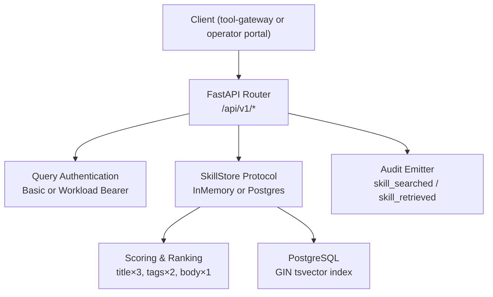
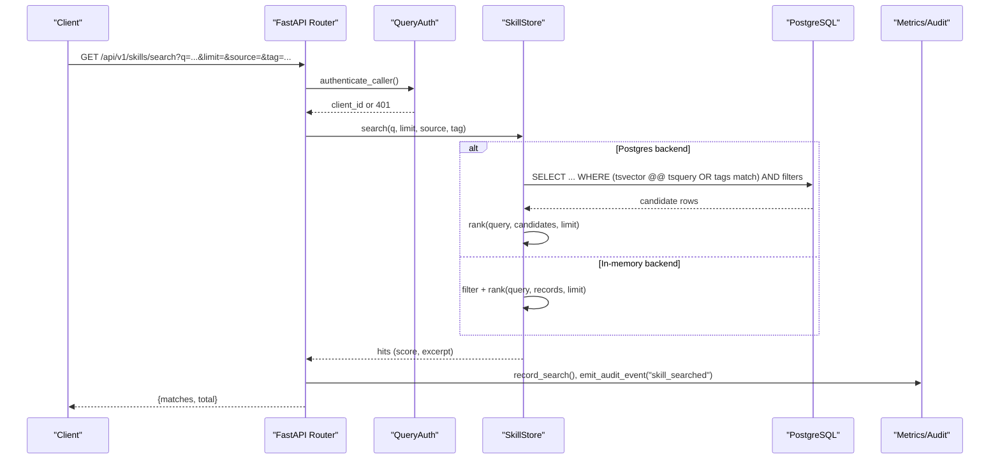
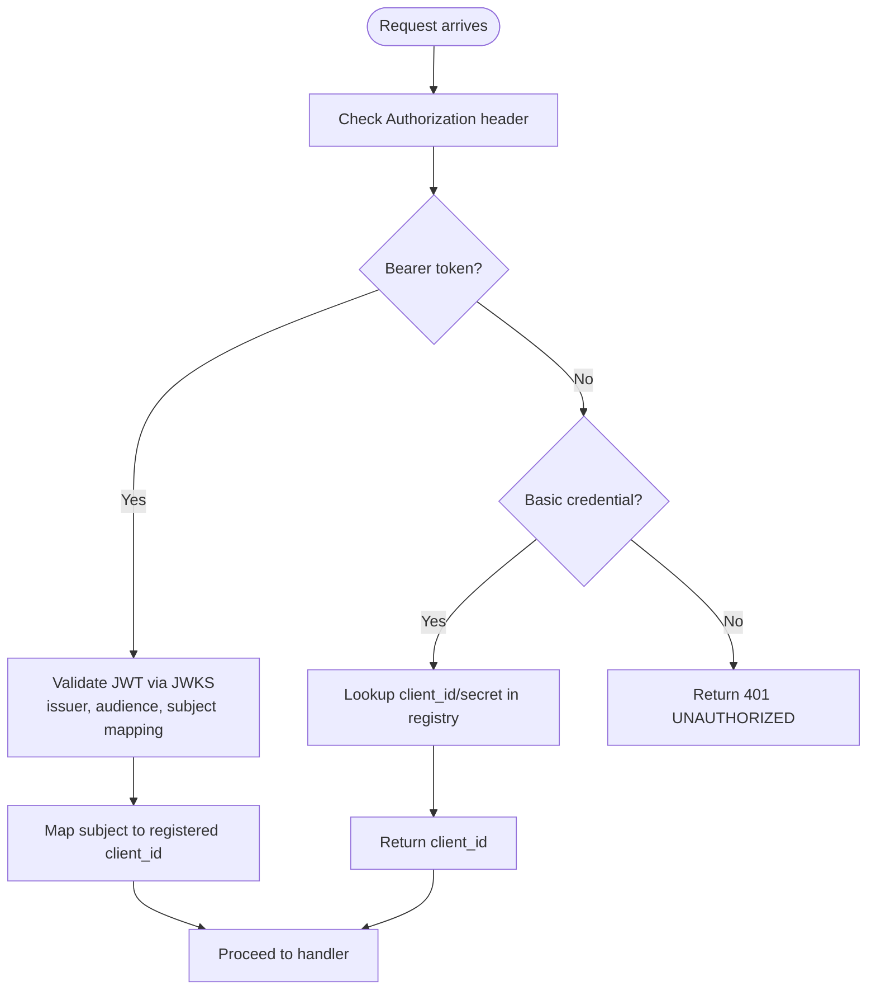
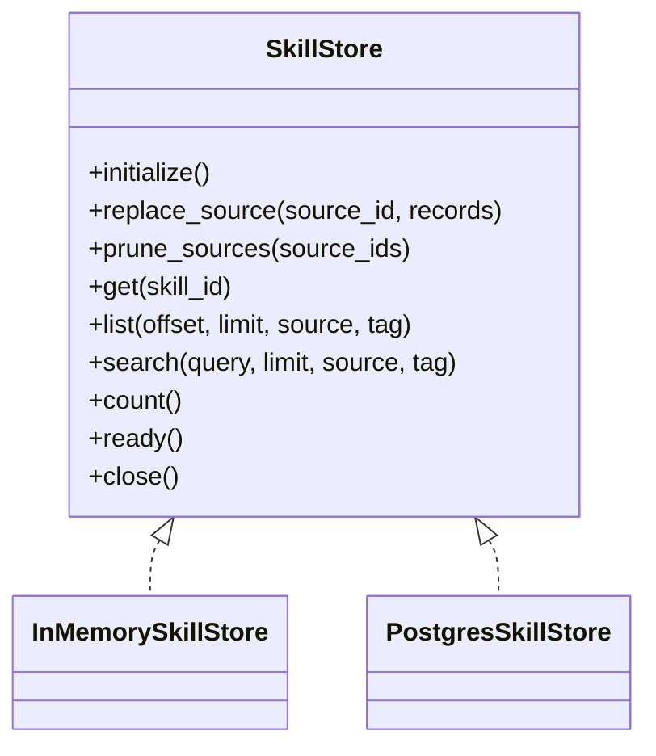
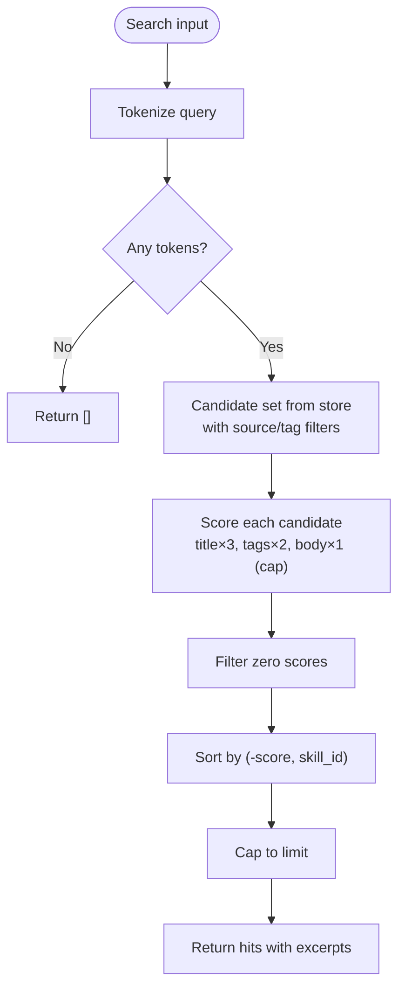
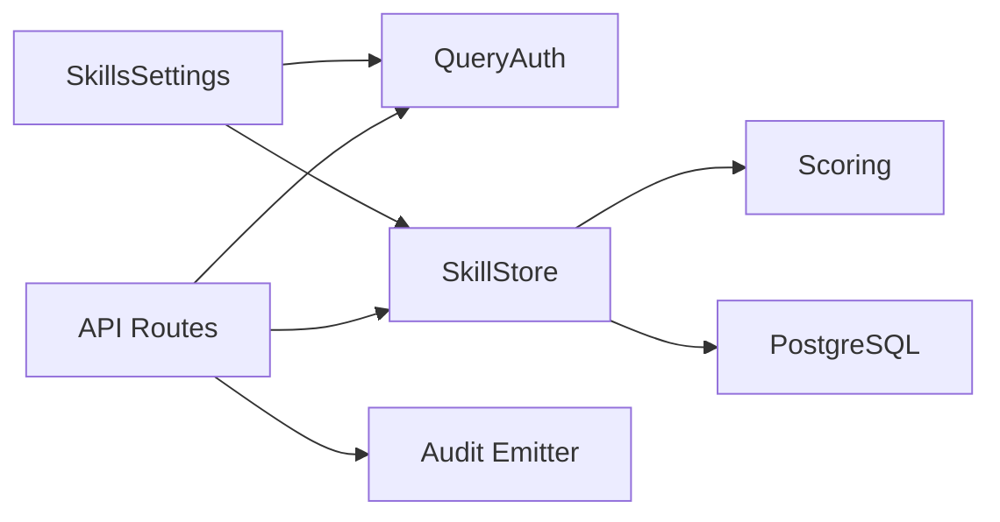

# Search and Retrieval APIs

<cite>
**Referenced Files in This Document**
- [skills-hub README](file://products/skills-hub/README.md)
- [API routes (skills)](file://products/skills-hub/src/skills_hub/api/routes/skills.py)
- [Skill store implementation](file://products/skills-hub/src/skills_hub/services/skill_store.py)
- [Query authentication](file://products/skills-hub/src/skills_hub/services/query_auth.py)
- [Deterministic scoring](file://products/skills-hub/src/skills_hub/services/scoring.py)
- [Skill schema model](file://products/skills-hub/src/skills_hub/schemas/skill.py)
- [Skills settings](file://products/skills-hub/src/skills_hub/core/config.py)
- [Skill JSON schema](file://shared/shared-contracts/schemas/skill.schema.json)
- [Skill format specification](file://shared/shared-contracts/skill-format.md)
- [Route tests](file://products/skills-hub/tests/test_routes.py)
- [Query auth tests](file://products/skills-hub/tests/test_query_auth.py)
</cite>

## Table of Contents
1. [Introduction](#introduction)
2. [Project Structure](#project-structure)
3. [Core Components](#core-components)
4. [Architecture Overview](#architecture-overview)
5. [Detailed Component Analysis](#detailed-component-analysis)
6. [Dependency Analysis](#dependency-analysis)
7. [Performance Considerations](#performance-considerations)
8. [Troubleshooting Guide](#troubleshooting-guide)
9. [Conclusion](#conclusion)
10. [Appendices](#appendices)

## Introduction
This document provides comprehensive API documentation for skill search and retrieval endpoints exposed by the Skills Hub service. It covers REST endpoints, query filters, pagination, sorting, result shapes, authentication and authorization, indexing strategies, query optimization, error handling, and advanced search capabilities such as full-text search, metadata filtering, and version-aware queries. It also includes performance tuning guidance, caching strategies, and monitoring recommendations to help operators measure and optimize search effectiveness.

The Skills Hub ingests team-owned Markdown skills from federated sources, validates frontmatter, normalizes metadata, and serves deterministic ranked search results and full-record retrieval to platform consumers (primarily the tool-gateway).

**Section sources**
- [skills-hub README:1-74](file://products/skills-hub/README.md#L1-L74)

## Project Structure
The Skills Hub is organized into clear layers:
- API layer: FastAPI routers exposing REST endpoints under /api/v1.
- Services layer: Store backends (in-memory and PostgreSQL), scoring/ranking, query authentication, ingestion, and audit emission.
- Schemas: Pydantic models and shared JSON schemas defining the Skill envelope.
- Core: Configuration, metrics, observability, request context, and runtime utilities.

**Diagram sources**
- [API routes (skills):1-215](file://products/skills-hub/src/skills_hub/api/routes/skills.py#L1-L215)
- [Skill store implementation:30-67](file://products/skills-hub/src/skills_hub/services/skill_store.py#L30-L67)
- [Deterministic scoring:1-97](file://products/skills-hub/src/skills_hub/services/scoring.py#L1-L97)
- [Query authentication:1-120](file://products/skills-hub/src/skills_hub/services/query_auth.py#L1-L120)

**Section sources**
- [API routes (skills):1-215](file://products/skills-hub/src/skills_hub/api/routes/skills.py#L1-L215)
- [Skill store implementation:1-498](file://products/skills-hub/src/skills_hub/services/skill_store.py#L1-L498)
- [Skill schema model:1-66](file://products/skills-hub/src/skills_hub/schemas/skill.py#L1-L66)
- [Skills settings:1-209](file://products/skills-hub/src/skills_hub/core/config.py#L1-L209)

## Core Components
- Endpoints:
  - GET /api/v1/skills — list with source/tag filters and capped offset pagination.
  - GET /api/v1/skills/search?q=... — deterministic ranked matches with excerpts and provenance.
  - GET /api/v1/skills/{source_id}/{slug} — full skill record per skill.schema.json.
  - POST /api/v1/skills/validate — read-only validation of a candidate skill document.
  - GET /api/v1/skills/status — auth-exempt operational surface reporting per-source sync state.
  - Health endpoints: /health/live, /health/ready, /metrics.
- Query authentication:
  - Static Basic credentials against SKILLS_QUERY_CLIENTS.
  - Projected workload tokens (Bearer) validated via cluster OIDC issuer JWKS with audience and subject mapping.
- Store backends:
  - InMemorySkillStore for dev/tests.
  - PostgresSkillStore using GIN tsvector index for full-text search; re-ranks candidates with shared scorer for deterministic ordering.
- Scoring:
  - Deterministic keyword scoring with fixed weights: title ×3, tags ×2, body ×1 (capped occurrences).
  - Tie-break by skill_id ascending; zero-score records excluded.
- Result shaping:
  - List returns summaries without body.
  - Search returns summaries plus score and excerpt (≤400 chars).
  - Get returns full record including body.

**Section sources**
- [skills-hub README:35-41](file://products/skills-hub/README.md#L35-L41)
- [API routes (skills):68-215](file://products/skills-hub/src/skills_hub/api/routes/skills.py#L68-L215)
- [Skill store implementation:30-67](file://products/skills-hub/src/skills_hub/services/skill_store.py#L30-L67)
- [Deterministic scoring:1-97](file://products/skills-hub/src/skills_hub/services/scoring.py#L1-L97)
- [Skill schema model:31-66](file://products/skills-hub/src/skills_hub/schemas/skill.py#L31-L66)

## Architecture Overview
The request flow enforces authentication first, then delegates to the selected store backend. For search, the PostgreSQL path uses a GIN full-text index to pre-filter candidates, which are then re-ranked deterministically by the shared scorer. All successful searches and retrievals emit usage audit events correlated by x-request-id.

**Diagram sources**
- [API routes (skills):99-146](file://products/skills-hub/src/skills_hub/api/routes/skills.py#L99-L146)
- [Skill store implementation:417-443](file://products/skills-hub/src/skills_hub/services/skill_store.py#L417-L443)
- [Deterministic scoring:85-97](file://products/skills-hub/src/skills_hub/services/scoring.py#L85-L97)
- [Query authentication:107-120](file://products/skills-hub/src/skills_hub/services/query_auth.py#L107-L120)

## Detailed Component Analysis

### REST API Endpoints

#### GET /api/v1/skills
- Purpose: List skills with optional source and tag filters; supports offset pagination with a capped limit.
- Authentication: Required (Basic or Workload Bearer).
- Query parameters:
  - offset: integer ≥ 0 (default 0).
  - limit: integer within 1..100 (default 20).
  - source: string (optional). Filters by source_id.
  - tag: string (optional). Case-insensitive exact match on tags.
- Response shape:
  - skills: array of summaries (no body).
  - total: number of matching records.
  - offset: requested offset.
  - limit: requested limit.
- Sorting: Results are sorted by skill_id ascending.
- Error codes:
  - 401 UNAUTHORIZED: missing or invalid credentials.
  - 400 INVALID_PARAMETERS: invalid offset or out-of-range limit.

Example request:
- GET /api/v1/skills?offset=0&limit=20&source=sre-alerting&tag=kubernetes

Example response:
- { "skills": [...], "total": N, "offset": 0, "limit": 20 }

**Section sources**
- [API routes (skills):68-96](file://products/skills-hub/src/skills_hub/api/routes/skills.py#L68-L96)
- [Skill store implementation:126-135](file://products/skills-hub/src/skills_hub/services/skill_store.py#L126-L135)
- [Skill store implementation:391-415](file://products/skills-hub/src/skills_hub/services/skill_store.py#L391-L415)
- [Route tests:98-134](file://products/skills-hub/tests/test_routes.py#L98-L134)

#### GET /api/v1/skills/search
- Purpose: Full-text search with deterministic ranking and excerpts.
- Authentication: Required.
- Query parameters:
  - q: required non-empty string.
  - limit: integer within 1..20 (default 5).
  - source: string (optional).
  - tag: string (optional).
- Response shape:
  - matches: array of hit objects containing summary fields plus score and excerpt (≤400 chars).
  - total: number of returned hits.
- Behavior:
  - Empty or whitespace-only q returns 400 INVALID_PARAMETERS.
  - Out-of-range limit returns 400 INVALID_PARAMETERS.
  - Zero matches returns 200 with empty matches array.
- Audit: Emits skill_searched event with query details and result_count.

Example request:
- GET /api/v1/skills/search?q=pod+events&limit=5&source=sre-alerting

Example response:
- { "matches": [{ "skill_id": "...", "score": X.X, "excerpt": "...", ... }], "total": N }

**Section sources**
- [API routes (skills):99-146](file://products/skills-hub/src/skills_hub/api/routes/skills.py#L99-L146)
- [Deterministic scoring:28-52](file://products/skills-hub/src/skills_hub/services/scoring.py#L28-L52)
- [Route tests:138-176](file://products/skills-hub/tests/test_routes.py#L138-L176)

#### GET /api/v1/skills/{source_id}/{slug}
- Purpose: Retrieve the full skill record by its namespaced id.
- Authentication: Required.
- Path parameter:
  - skill_id: string in the form source_id/slug.
- Response shape:
  - Full skill object conforming to skill.schema.json, including body.
- Error codes:
  - 404 SKILL_NOT_FOUND: unknown skill id.
- Audit: Emits skill_retrieved event with success or error outcome.

Example request:
- GET /api/v1/skills/sre-alerting/kubepodnotready

Example response:
- { "skill_id": "...", "title": "...", "description": "...", "body": "...", ... }

**Section sources**
- [API routes (skills):184-215](file://products/skills-hub/src/skills_hub/api/routes/skills.py#L184-L215)
- [Skill schema model:31-66](file://products/skills-hub/src/skills_hub/schemas/skill.py#L31-L66)
- [Route tests:180-195](file://products/skills-hub/tests/test_routes.py#L180-L195)

#### POST /api/v1/skills/validate
- Purpose: Validate a candidate skill document against the Skill Format contract. Read-only; no store writes, no sync trigger, no audit emission.
- Authentication: Required.
- Request body:
  - document: string (Markdown with YAML frontmatter).
  - Size cap enforced at route level.
- Response shape:
  - valid: boolean.
  - reason: string (present when valid is false).
- Error codes:
  - 400 INVALID_PARAMETERS: malformed JSON or invalid payload structure.
  - 400 INVALID_PARAMETERS: document exceeds size cap.

Example request:
- POST /api/v1/skills/validate
- Body: { "document": "---\ntitle: ...\ndescription: ...\n---\nBody text..." }

Example response:
- { "valid": true } or { "valid": false, "reason": "..." }

**Section sources**
- [API routes (skills):149-182](file://products/skills-hub/src/skills_hub/api/routes/skills.py#L149-L182)
- [Route tests:306-364](file://products/skills-hub/tests/test_routes.py#L306-L364)

#### GET /api/v1/skills/status
- Purpose: Operational status endpoint reporting per-source sync state.
- Authentication: Not required (auth-exempt).
- Response shape:
  - sources: array of per-source status entries.
  - store_backend: string indicating active backend.

Example request:
- GET /api/v1/skills/status

Example response:
- { "sources": [{ "source_id": "...", "accepted": N, "ref": "...", ... }], "store_backend": "memory|postgres" }

**Section sources**
- [skills-hub README:35-41](file://products/skills-hub/README.md#L35-L41)
- [Route tests:198-208](file://products/skills-hub/tests/test_routes.py#L198-L208)

### Authentication and Authorization
- Supported methods:
  - Static Basic credentials against SKILLS_QUERY_CLIENTS registry.
  - Projected workload tokens (Bearer) validated via cluster OIDC issuer JWKS with audience and subject-to-client mapping.
- Failure behavior:
  - Any unauthenticated or invalid request returns 401 UNAUTHORIZED.
- Scope:
  - Applies to all query routes except /api/v1/skills/status.

**Diagram sources**
- [Query authentication:36-95](file://products/skills-hub/src/skills_hub/services/query_auth.py#L36-L95)
- [Query authentication:107-120](file://products/skills-hub/src/skills_hub/services/query_auth.py#L107-L120)

**Section sources**
- [Query authentication:1-120](file://products/skills-hub/src/skills_hub/services/query_auth.py#L1-L120)
- [Skills settings:133-158](file://products/skills-hub/src/skills_hub/core/config.py#L133-L158)
- [Query auth tests:27-58](file://products/skills-hub/tests/test_query_auth.py#L27-L58)

### Skill Store Implementation and Indexing
- Backend selection:
  - InMemorySkillStore for development/testing.
  - PostgresSkillStore for production deployments.
- PostgreSQL schema and indexes:
  - skills table with columns for skill identity, metadata, body, and optional executable-flow fields.
  - GIN index on tsvector(title || ' ' || body) for full-text search.
  - Index on source_id for efficient filtering.
- Search strategy:
  - Pre-filter candidates using PostgreSQL full-text match (OR-joined lexemes) combined with source/tag filters.
  - Re-rank candidates deterministically using shared scorer (title ×3, tags ×2, body ×1 with occurrence cap).
  - Tie-break by skill_id ascending; return top N limited by request.
- List strategy:
  - Apply source/tag filters, count total, then paginate by skill_id order.

**Diagram sources**
- [Skill store implementation:30-67](file://products/skills-hub/src/skills_hub/services/skill_store.py#L30-L67)

**Section sources**
- [Skill store implementation:158-200](file://products/skills-hub/src/skills_hub/services/skill_store.py#L158-L200)
- [Skill store implementation:244-249](file://products/skills-hub/src/skills_hub/services/skill_store.py#L244-L249)
- [Skill store implementation:417-443](file://products/skills-hub/src/skills_hub/services/skill_store.py#L417-L443)
- [Skill store implementation:445-463](file://products/skills-hub/src/skills_hub/services/skill_store.py#L445-L463)

### Scoring and Ranking
- Tokenization: Lowercase alphanumeric tokens.
- Weights:
  - Title match: 3.0 per token.
  - Tag match: 2.0 per token.
  - Body match: 1.0 per token, capped at 5 occurrences per token.
- Filtering: Zero-score records excluded.
- Ordering: Descending score, then ascending skill_id for deterministic tie-breaking.
- Excerpts: Up to 400 characters around the first matched region in body; fallback to description head if match only in title/tags.

**Diagram sources**
- [Deterministic scoring:28-52](file://products/skills-hub/src/skills_hub/services/scoring.py#L28-L52)
- [Deterministic scoring:55-75](file://products/skills-hub/src/skills_hub/services/scoring.py#L55-L75)
- [Deterministic scoring:85-97](file://products/skills_hub/src/skills_hub/services/scoring.py#L85-L97)

**Section sources**
- [Deterministic scoring:1-97](file://products/skills-hub/src/skills_hub/services/scoring.py#L1-L97)

### Data Models and Schema
- Skill envelope:
  - Namespaced skill_id = source_id/slug.
  - Required fields include identifiers, title, description, updated_at.
  - Optional fields include tags, version, source_url, web_target, risk_class, flow_intent, kind, steps.
- Body handling:
  - Present in full-record responses; omitted in list/search summaries; excerpts bounded to ≤400 chars.
- Executable flows (v2):
  - kind discriminates knowledge vs executable_flow.
  - steps is an ordered replay list for executable flows; requires risk_class=write.

**Section sources**
- [Skill schema model:31-66](file://products/skills_hub/src/skills_hub/schemas/skill.py#L31-L66)
- [Skill JSON schema:1-125](file://shared/shared-contracts/schemas/skill.schema.json#L1-L125)
- [Skill format specification:1-203](file://shared/shared-contracts/skill-format.md#L1-L203)

## Dependency Analysis
- API routes depend on:
  - Query authentication to enforce access control.
  - SkillStore abstraction to decouple backends.
  - Scoring module for deterministic ranking.
  - Audit emitter for usage telemetry.
- Store backends depend on:
  - PostgreSQL driver (psycopg v3) for PostgresSkillStore.
  - Shared scorer for consistent ranking across backends.
- Settings drive:
  - Backend selection (memory/postgres).
  - Database URL requirement for postgres backend.
  - Query client registry and workload token configuration.

**Diagram sources**
- [API routes (skills):1-215](file://products/skills-hub/src/skills_hub/api/routes/skills.py#L1-L215)
- [Skill store implementation:489-498](file://products/skills-hub/src/skills_hub/services/skill_store.py#L489-L498)
- [Skills settings:161-209](file://products/skills-hub/src/skills_hub/core/config.py#L161-L209)

**Section sources**
- [API routes (skills):1-215](file://products/skills-hub/src/skills_hub/api/routes/skills.py#L1-L215)
- [Skill store implementation:489-498](file://products/skills-hub/src/skills_hub/services/skill_store.py#L489-L498)
- [Skills settings:161-209](file://products/skills-hub/src/skills_hub/core/config.py#L161-L209)

## Performance Considerations
- Search optimization:
  - PostgreSQL GIN tsvector index accelerates full-text pre-filtering.
  - Tags are filtered at query time due to STABLE function constraints in index expressions.
  - Re-ranking in Python ensures deterministic ordering independent of database-specific ranking.
- Pagination:
  - List uses OFFSET/LIMIT with stable sort by skill_id to ensure consistent pages.
- Limits:
  - List limit capped at 100; search limit capped at 20 to bound response sizes and processing.
- Connection management:
  - PostgresSkillStore opens connections per operation; suitable for low-volume retrieval traffic.
- Caching:
  - No application-level cache for search results; rely on database index and small result sets.
  - JWKS clients cached per issuer URL to reduce network overhead during workload token validation.
- Monitoring:
  - Metrics recorded for search operations.
  - Usage audit events emitted for skill_searched and skill_retrieved, correlated by x-request-id.

[No sources needed since this section provides general guidance]

## Troubleshooting Guide
Common issues and resolutions:
- 401 UNAUTHORIZED:
  - Ensure Authorization header contains either Basic credentials configured in SKILLS_QUERY_CLIENTS or a valid Bearer workload token issued by the configured OIDC issuer.
  - Verify workload_issuer_url, audience, and subject mappings are correctly set.
- 400 INVALID_PARAMETERS:
  - Search requires non-empty q; limit must be within 1..20.
  - List requires offset ≥ 0 and limit within 1..100.
  - Validate endpoint rejects malformed JSON or oversized documents.
- 404 SKILL_NOT_FOUND:
  - Confirm skill_id follows source_id/slug format and exists in the store.
- Empty search results:
  - Verify query tokens exist in title/tags/body; consider adjusting query terms or ensuring tags are present and correctly cased.
- Audit correlation:
  - Include x-request-id in requests to correlate skill_searched/skill_retrieved events with upstream tool_invoked events.

**Section sources**
- [API routes (skills):40-44](file://products/skills-hub/src/skills_hub/api/routes/skills.py#L40-L44)
- [API routes (skills):77-96](file://products/skills-hub/src/skills_hub/api/routes/skills.py#L77-L96)
- [API routes (skills):108-121](file://products/skills-hub/src/skills_hub/api/routes/skills.py#L108-L121)
- [API routes (skills):190-215](file://products/skills-hub/src/skills_hub/api/routes/skills.py#L190-L215)
- [Route tests:98-195](file://products/skills-hub/tests/test_routes.py#L98-L195)
- [Query auth tests:27-58](file://products/skills-hub/tests/test_query_auth.py#L27-L58)

## Conclusion
The Skills Hub provides secure, deterministic search and retrieval for team-owned skills through well-defined REST endpoints. The combination of PostgreSQL full-text indexing and a shared deterministic scorer ensures fast, predictable results. Authentication supports both static credentials and projected workload tokens, enabling flexible integration patterns. Operators can monitor search effectiveness via metrics and audit events, and tune performance using appropriate limits, indexes, and backend selection.

[No sources needed since this section summarizes without analyzing specific files]

## Appendices

### API Reference Summary

- GET /api/v1/skills
  - Filters: source, tag
  - Pagination: offset, limit (1..100)
  - Response: { skills[], total, offset, limit }
  - Errors: 401, 400

- GET /api/v1/skills/search
  - Filters: q (required), source, tag
  - Pagination: limit (1..20)
  - Response: { matches[], total }
  - Errors: 401, 400

- GET /api/v1/skills/{source_id}/{slug}
  - Response: full skill object
  - Errors: 401, 404

- POST /api/v1/skills/validate
  - Request: { document: string }
  - Response: { valid: bool, reason?: string }
  - Errors: 401, 400

- GET /api/v1/skills/status
  - Auth-exempt
  - Response: { sources[], store_backend }

**Section sources**
- [skills-hub README:35-41](file://products/skills-hub/README.md#L35-L41)
- [API routes (skills):68-215](file://products/skills-hub/src/skills_hub/api/routes/skills.py#L68-L215)

### Advanced Search Capabilities
- Full-text search:
  - Uses PostgreSQL tsvector over title and body; OR-joined lexemes to avoid strict AND semantics.
- Metadata filtering:
  - Source and tag filters applied before ranking; tag matching is case-insensitive exact.
- Version-specific queries:
  - Version field is stored but not used as a search filter in current endpoints; clients can post-process results by version if needed.

**Section sources**
- [Skill store implementation:244-249](file://products/skills-hub/src/skills_hub/services/skill_store.py#L244-L249)
- [Skill store implementation:445-463](file://products/skills-hub/src/skills_hub/services/skill_store.py#L445-L463)
- [Skill JSON schema:53-57](file://shared/shared-contracts/schemas/skill.schema.json#L53-L57)

### Rate Limiting Policies
- Endpoint-level caps:
  - List limit maximum 100.
  - Search limit maximum 20.
- Application-level rate limiting:
  - Not implemented in Skills Hub; rely on gateway or infrastructure controls if needed.

**Section sources**
- [API routes (skills):30-33](file://products/skills-hub/src/skills_hub/api/routes/skills.py#L30-L33)
- [API routes (skills):81-86](file://products/skills-hub/src/skills_hub/api/routes/skills.py#L81-L86)
- [API routes (skills):114-119](file://products/skills-hub/src/skills_hub/api/routes/skills.py#L114-L119)