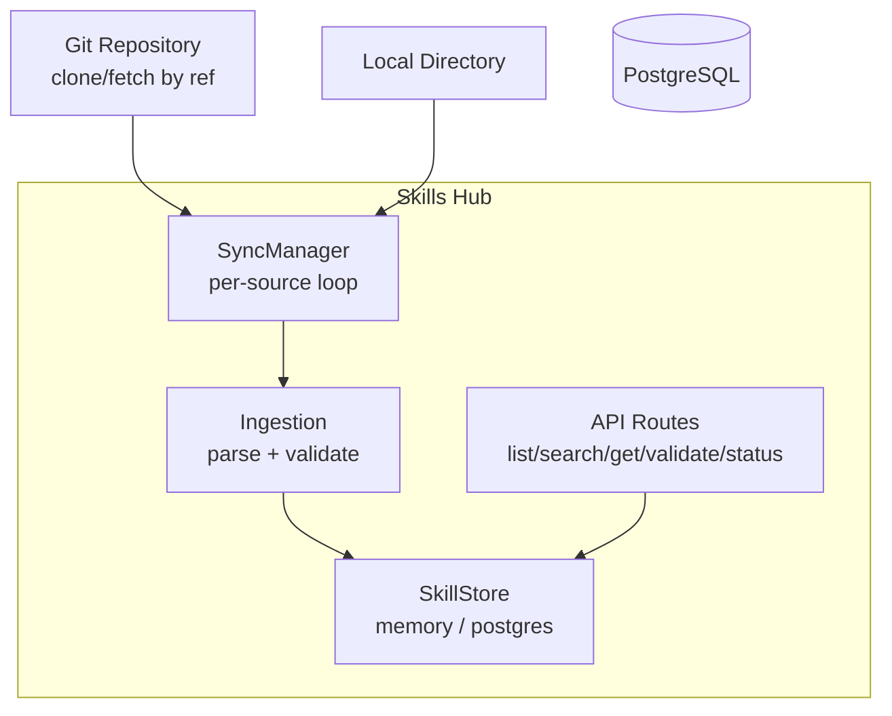
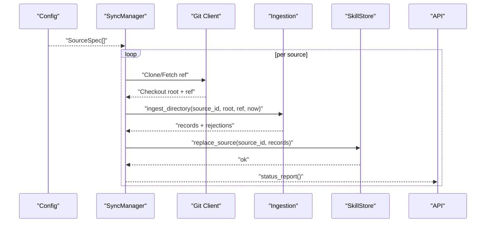
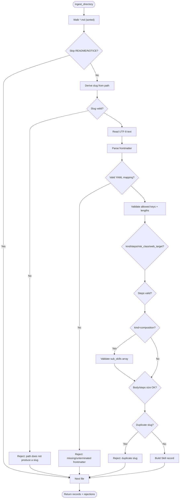
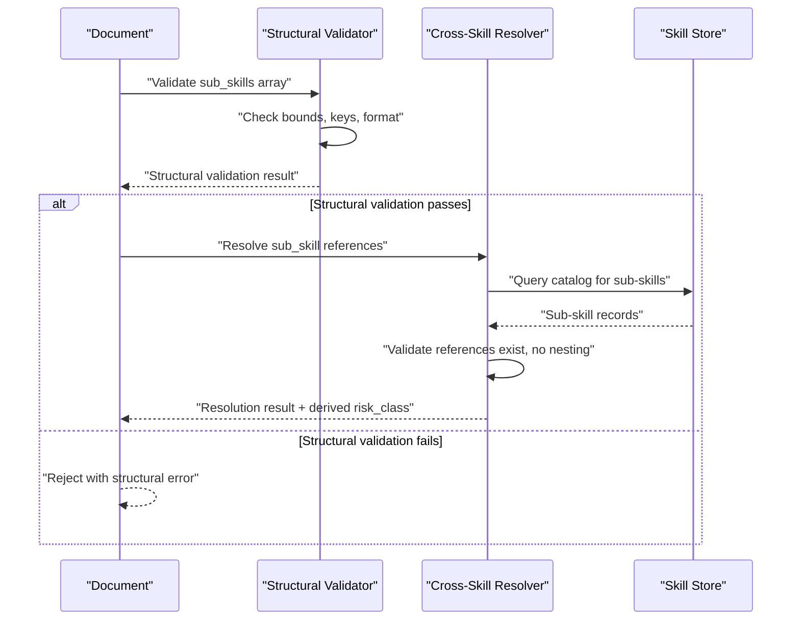
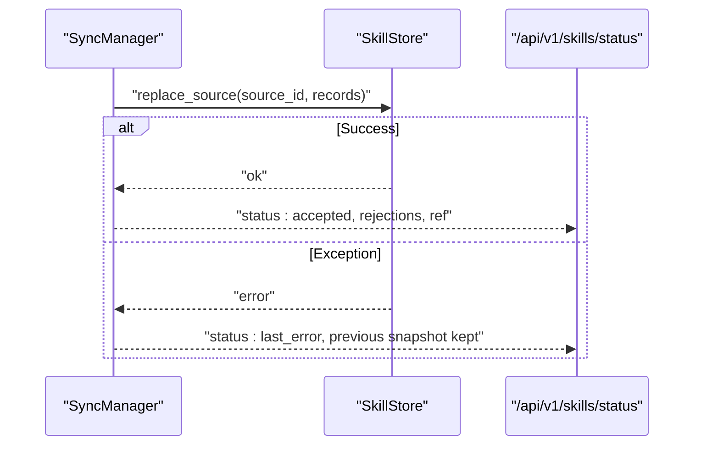
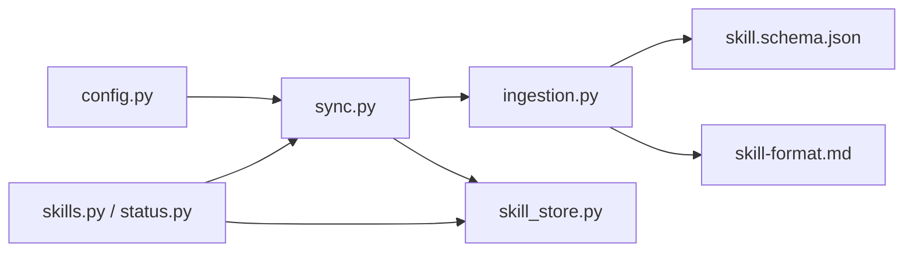

# Skill Ingestion and Validation

<cite>
**Referenced Files in This Document**
- [validate.py](file://products/skills-hub/src/skills_hub/validate.py)
- [skill-format.md](file://shared/shared-contracts/skill-format.md)
- [skill.schema.json](file://shared/shared-contracts/schemas/skill.schema.json)
- [ingestion.py](file://products/skills-hub/src/skills_hub/services/ingestion.py)
- [sync.py](file://products/skills-hub/src/skills_hub/services/sync.py)
- [config.py](file://products/skills-hub/src/skills_hub/core/config.py)
- [skill_store.py](file://products/skills-hub/src/skills_hub/services/skill_store.py)
- [skills.py](file://products/skills-hub/src/skills_hub/api/routes/skills.py)
- [status.py](file://products/skills-hub/src/skills_hub/api/routes/status.py)
- [skill.py](file://products/skills-hub/src/skills_hub/schemas/skill.py)
</cite>

## Update Summary
**Changes Made**
- Added comprehensive coverage of composition skill type validation including sub_skills array structure
- Documented two-layer validation approach with structural and cross-skill resolution
- Updated bounds checking mechanisms for maximum sub-skills configuration
- Enhanced error handling and validation failure reporting for composition skills
- Added configuration options for customizing composition validation behavior

## Table of Contents
1. Introduction
2. Project Structure
3. Core Components
4. Architecture Overview
5. Detailed Component Analysis
6. Dependency Analysis
7. Performance Considerations
8. Troubleshooting Guide
9. Conclusion
10. Appendices

## Introduction
This document explains the Skills Hub skill ingestion and validation pipeline end-to-end. It covers how skills are ingested from Git repositories or local directories, how branch tracking and change detection work, the skill format specification and schema validation rules, semantic validation checks during ingestion, error handling and reporting, rollback behavior when invalid skills are detected, configuration options for customizing validation behavior, security considerations for processing skill content, and monitoring ingestion performance.

**Updated** Enhanced with composition skill type validation supporting sub_skills arrays, bounds checking, and two-layer validation approach.

## Project Structure
The Skills Hub is implemented as a Python service with:
- A sync engine that materializes sources (Git or local), runs ingestion/validation, and atomically swaps snapshots into the store.
- An ingestion layer that parses Markdown documents with YAML frontmatter, validates them against the skill contract and JSON Schema, and builds normalized records.
- A storage abstraction supporting in-memory and PostgreSQL backends.
- API routes exposing retrieval, search, validation, and status endpoints.

**Diagram sources**
- [sync.py:154-281](file://products/skills-hub/src/skills_hub/services/sync.py#L154-L281)
- [ingestion.py:476-558](file://products/skills-hub/src/skills_hub/services/ingestion.py#L476-L558)
- [skill_store.py:30-67](file://products/skills-hub/src/skills_hub/services/skill_store.py#L30-L67)
- [skills.py:68-215](file://products/skills-hub/src/skills_hub/api/routes/skills.py#L68-L215)
- [status.py:20-29](file://products/skills-hub/src/skills_hub/api/routes/status.py#L20-L29)

**Section sources**
- [sync.py:1-324](file://products/skills-hub/src/skills_hub/services/sync.py#L1-L324)
- [ingestion.py:1-696](file://products/skills-hub/src/skills_hub/services/ingestion.py#L1-L696)
- [skill_store.py:1-498](file://products/skills-hub/src/skills_hub/services/skill_store.py#L1-L498)
- [skills.py:1-215](file://products/skills-hub/src/skills_hub/api/routes/skills.py#L1-L215)
- [status.py:1-30](file://products/skills-hub/src/skills_hub/api/routes/status.py#L1-L30)

## Core Components
- Source configuration: defines per-source federation entries (type, path/url/ref).
- Sync manager: runs per-source loops, materializes sources, invokes ingestion, and atomically replaces stored snapshots.
- Ingestion: walks files, splits frontmatter, validates fields and executable-flow semantics, and produces normalized records plus rejections.
- Store: persists validated records; supports memory and PostgreSQL backends with idempotent replace operations.
- API: exposes retrieval, search, validation, and operational status endpoints.

Key responsibilities and interactions are detailed in the following sections.

**Section sources**
- [config.py:23-116](file://products/skills-hub/src/skills_hub/core/config.py#L23-L116)
- [sync.py:154-281](file://products/skills-hub/src/skills_hub/services/sync.py#L154-L281)
- [ingestion.py:149-473](file://products/skills-hub/src/skills_hub/services/ingestion.py#L149-L473)
- [skill_store.py:72-153](file://products/skills-hub/src/skills_hub/services/skill_store.py#L72-L153)
- [skill_store.py:283-498](file://products/skills-hub/src/skills_hub/services/skill_store.py#L283-L498)
- [skills.py:68-215](file://products/skills-hub/src/skills_hub/api/routes/skills.py#L68-L215)
- [status.py:20-29](file://products/skills-hub/src/skills_hub/api/routes/status.py#L20-L29)

## Architecture Overview
The ingestion pipeline follows a deterministic, fail-safe design:
- Each configured source runs an independent async loop.
- The sync step materializes the source (Git clone/fetch or local directory) to a temporary location.
- Ingestion validates every Markdown document against the skill contract and schema.
- On success, the store atomically replaces the previous snapshot for that source; on failure, the previous snapshot remains served.
- Operational status reports last sync outcomes, accepted counts, refs, and bounded rejection lists.

**Diagram sources**
- [config.py:50-116](file://products/skills-hub/src/skills_hub/core/config.py#L50-L116)
- [sync.py:181-281](file://products/skills-hub/src/skills_hub/services/sync.py#L181-L281)
- [sync.py:102-148](file://products/skills-hub/src/skills_hub/services/sync.py#L102-L148)
- [ingestion.py:476-558](file://products/skills-hub/src/skills_hub/services/ingestion.py#L476-L558)
- [skill_store.py:318-362](file://products/skills-hub/src/skills_hub/services/skill_store.py#L318-L362)
- [status.py:20-29](file://products/skills-hub/src/skills_hub/api/routes/status.py#L20-L29)

## Detailed Component Analysis

### Source Configuration and Branch Tracking
- Sources are declared via environment-driven settings with strict parsing:
  - Local sources require a path.
  - Git sources require a URL and optionally a ref (branch/tag) and a relative subpath within the checkout.
  - Duplicate source IDs and malformed values fail fast at startup.
- Git materialization:
  - Uses shallow fetch/clone with depth 1.
  - If ref is not HEAD, clones/fetches that specific ref.
  - Resolves commit SHA and uses it as the source_ref recorded in skill records.
  - Injects token into HTTPS URLs for authentication; tokens are scrubbed from logs and spans.

Configuration options relevant to ingestion:
- SKILLS_SOURCES: JSON list of source entries.
- SKILLS_GIT_TOKENS: JSON map of source_id to token.
- SKILLS_SYNC_INTERVAL_SECONDS: polling interval with jitter.
- SKILLS_DATA_PATH: base path for checked-out sources.
- SKILLS_COMPOSITION_MAX_SUB_SKILLS: configurable limit for composition sub-skills (default: 8).

**Section sources**
- [config.py:50-116](file://products/skills-hub/src/skills_hub/core/config.py#L50-L116)
- [config.py:119-130](file://products/skills-hub/src/skills_hub/core/config.py#L119-L130)
- [config.py:179-203](file://products/skills-hub/src/skills_hub/core/config.py#L179-L203)
- [config.py:161-178](file://products/skills-hub/src/skills_hub/core/config.py#L161-L178)
- [sync.py:102-148](file://products/skills-hub/src/skills_hub/services/sync.py#L102-L148)
- [sync.py:283-298](file://products/skills-hub/src/skills_hub/services/sync.py#L283-L298)

### Ingestion Pipeline: Parsing, Schema Validation, and Semantic Checks
- File discovery:
  - Walks *.md recursively under the source root.
  - Skips hidden segments and known non-skill basenames (README, NOTICE).
  - Derives a slug from the file path (lowercased, sanitized segments) to form skill_id = source_id/slug.
- Frontmatter parsing:
  - Requires YAML frontmatter delimited by --- fences.
  - Validates required keys (title, description) and optional keys with length/type constraints.
  - Rejects unknown frontmatter keys.
- Schema conformance:
  - Enforces the canonical skill envelope structure and types defined in the shared JSON Schema.
  - Ensures body size limits and other field constraints match the spec.
- Executable-flow semantic validation (v2):
  - kind must be knowledge or executable_flow; steps requires kind=executable_flow.
  - executable_flow requires a non-empty steps list and risk_class=write.
  - Any web.* step requires web_target to bind origin and budget.
  - Credential handling:
    - web.fill_credential must reference a named credential_set and field.
    - Unresolved credential holes are rejected.
  - Step-level validation enforces tool name, JSON-compatible args, and optional expect string.
- Composition skill validation (v3):
  - kind=composition carries an ordered sub_skills reference list.
  - Sub_skills items must contain skill_id (required) and optional note (≤200 chars).
  - No control flow keys allowed (additionalProperties:false prevents smuggling).
  - Maximum sub_skills count enforced via configurable bound.
- Deterministic ordering and duplicate handling:
  - Files visited in sorted order; first occurrence wins for duplicate slugs within a source.

**Diagram sources**
- [ingestion.py:476-558](file://products/skills-hub/src/skills_hub/services/ingestion.py#L476-L558)
- [ingestion.py:149-275](file://products/skills-hub/src/skills_hub/services/ingestion.py#L149-L275)
- [ingestion.py:289-460](file://products/skills-hub/src/skills_hub/services/ingestion.py#L289-L460)
- [ingestion.py:491-586](file://products/skills-hub/src/skills_hub/services/ingestion.py#L491-L586)

**Section sources**
- [ingestion.py:1-98](file://products/skills-hub/src/skills_hub/services/ingestion.py#L1-L98)
- [ingestion.py:149-275](file://products/skills-hub/src/skills_hub/services/ingestion.py#L149-L275)
- [ingestion.py:289-460](file://products/skills-hub/src/skills_hub/services/ingestion.py#L289-L460)
- [ingestion.py:476-558](file://products/skills-hub/src/skills_hub/services/ingestion.py#L476-L558)
- [ingestion.py:491-586](file://products/skills-hub/src/skills_hub/services/ingestion.py#L491-L586)

### Skill Format Specification and Schema Rules
- Document layout: Markdown with YAML frontmatter; everything between the first two --- lines is parsed as a mapping; the rest is the body.
- Frontmatter keys and constraints:
  - title (required, ≤200 chars), description (required, ≤500 chars).
  - tags (optional list, ≤10 items, each ≤64 chars).
  - version (optional, ≤64 chars), source_url (optional, ≤2048 chars).
  - web_target (optional absolute http(s) URL, ≤2048 chars).
  - risk_class (optional read/write; defaults to read when web_target present without it).
  - flow_intent (optional, requires web_target, display-only, ≤200 chars).
  - kind (optional knowledge, executable_flow, or composition).
  - steps (optional ordered replay list for executable_flow).
  - sub_skills (optional ordered reference list for composition).
- Executable-flow rules:
  - steps requires kind=executable_flow and a non-empty list.
  - executable_flow requires risk_class=write.
  - Any web.* step requires web_target.
  - Credentials must be references; unresolved holes are rejected.
- Composition skill rules:
  - sub_skills requires kind=composition and a non-empty list.
  - Each sub_skill item must have skill_id (namespaced <source_id>/<slug>) and optional note (≤200 chars).
  - No control flow keys allowed (additionalProperties:false).
  - Maximum sub_skills count enforced via configuration.
  - Composition declares no web_target, steps, or author risk_class.
- Identity rules:
  - skill_id = source_id/slug derived from file path.
  - Duplicate slugs within one source are errors; across sources are legal.
  - README.md and NOTICE files are skipped.

Schema enforcement is mirrored in the shared JSON Schema used by the service and clients.

**Section sources**
- [skill-format.md:1-203](file://shared/shared-contracts/skill-format.md#L1-L203)
- [skill.schema.json:1-146](file://shared/shared-contracts/schemas/skill.schema.json#L1-L146)
- [skill.py:31-49](file://products/skills-hub/src/skills_hub/schemas/skill.py#L31-L49)

### Two-Layer Validation Approach
The enhanced ingestion pipeline implements a two-layer validation approach for composition skills:

#### Layer 1: Structural Validation (Per-Document)
- Validates the shape and constraints of sub_skills array within a single document.
- Enforces maximum sub_skills count via configurable bound.
- Validates each sub_skill item has required skill_id and optional note.
- Prevents control flow smuggling through additionalProperties:false.
- Ensures composition declares no web_target, steps, or risk_class.

#### Layer 2: Cross-Skill Resolution (Catalog-Consulting)
- Runs after structural validation in the sync process.
- Resolves each sub_skill reference against the catalog (this source's fresh records + store.get()).
- Validates that referenced sub-skills exist and are published.
- Prevents nested compositions (no composition as sub_skill).
- Derives display risk_class based on sub-skills' risk classes.

**Diagram sources**
- [sync.py:317-381](file://products/skills-hub/src/skills_hub/services/sync.py#L317-L381)
- [ingestion.py:491-586](file://products/skills-hub/src/skills_hub/services/ingestion.py#L491-L586)

**Section sources**
- [sync.py:317-381](file://products/skills-hub/src/skills_hub/services/sync.py#L317-L381)
- [ingestion.py:491-586](file://products/skills-hub/src/skills_hub/services/ingestion.py#L491-L586)

### Error Handling, Validation Failure Reporting, and Rollback
- Per-document validation failures are collected as Rejection objects with path and reason.
- Status endpoint exposes per-source last_sync_at, last_error, ref, accepted count, and a bounded list of recent rejections.
- Atomic snapshot replacement:
  - On successful ingestion, the store replaces the entire snapshot for that source atomically.
  - On any exception during sync (including git failures), the previous snapshot remains served; the error is recorded and audited.
- Audit events:
  - Successful and failed sync cycles emit audit events with details like source_id, type, ref, accepted/rejected counts, and error messages (with tokens scrubbed).
- Composition-specific error handling:
  - Structural validation errors reported with specific sub_skill index and field.
  - Cross-skill resolution errors categorized separately from structural errors.
  - Nested composition attempts explicitly rejected with clear messaging.

**Diagram sources**
- [sync.py:189-281](file://products/skills-hub/src/skills_hub/services/sync.py#L189-L281)
- [skill_store.py:318-362](file://products/skills-hub/src/skills_hub/services/skill_store.py#L318-L362)
- [status.py:20-29](file://products/skills-hub/src/skills_hub/api/routes/status.py#L20-L29)

**Section sources**
- [sync.py:189-281](file://products/skills-hub/src/skills_hub/services/sync.py#L189-L281)
- [status.py:20-29](file://products/skills-hub/src/skills_hub/api/routes/status.py#L20-L29)

### API Surface for Validation and Retrieval
- POST /api/v1/skills/validate:
  - Accepts a JSON payload with a document string.
  - Runs the same validation code path used by sync.
  - Returns valid=true or valid=false with a reason.
- GET /api/v1/skills, /api/v1/skills/search, /api/v1/skills/{skill_id}:
  - Require query authentication.
  - Emit usage audit events for search and retrieval.
- GET /api/v1/skills/status:
  - Auth-exempt operational endpoint reporting store backend, sync interval, and per-source status including rejections.

**Section sources**
- [skills.py:68-215](file://products/skills-hub/src/skills_hub/api/routes/skills.py#L68-L215)
- [status.py:20-29](file://products/skills-hub/src/skills_hub/api/routes/status.py#L20-L29)

### CLI Pre-flight Validation
- python -m skills_hub.validate <directory> [--source-id <id>]
  - Walks the directory, validates every .md against the skill contract using the same ingestion code path, prints rejections to stderr, and exits with code 0 if all pass.

**Section sources**
- [validate.py:1-48](file://products/skills-hub/src/skills_hub/validate.py#L1-L48)

## Dependency Analysis
- Sync depends on config for source specs and on ingestion/store for processing and persistence.
- Ingestion depends on the shared skill format and schema for validation rules.
- Store abstracts persistence; both implementations share scoring and summary logic.
- API routes depend on store and auth; status route depends on sync manager.

**Diagram sources**
- [config.py:50-116](file://products/skills-hub/src/skills_hub/core/config.py#L50-L116)
- [sync.py:181-281](file://products/skills-hub/src/skills_hub/services/sync.py#L181-L281)
- [ingestion.py:149-473](file://products/skills-hub/src/skills_hub/services/ingestion.py#L149-L473)
- [skill.schema.json:1-146](file://shared/shared-contracts/schemas/skill.schema.json#L1-L146)
- [skill-format.md:1-203](file://shared/shared-contracts/skill-format.md#L1-L203)
- [skill_store.py:30-67](file://products/skills-hub/src/skills_hub/services/skill_store.py#L30-L67)
- [skills.py:68-215](file://products/skills-hub/src/skills_hub/api/routes/skills.py#L68-L215)
- [status.py:20-29](file://products/skills-hub/src/skills_hub/api/routes/status.py#L20-L29)

**Section sources**
- [config.py:50-116](file://products/skills-hub/src/skills_hub/core/config.py#L50-L116)
- [sync.py:181-281](file://products/skills-hub/src/skills_hub/services/sync.py#L181-L281)
- [ingestion.py:149-473](file://products/skills-hub/src/skills_hub/services/ingestion.py#L149-L473)
- [skill_store.py:30-67](file://products/skills-hub/src/skills_hub/services/skill_store.py#L30-L67)
- [skills.py:68-215](file://products/skills-hub/src/skills_hub/api/routes/skills.py#L68-L215)
- [status.py:20-29](file://products/skills-hub/src/skills_hub/api/routes/status.py#L20-L29)

## Performance Considerations
- Shallow Git operations: clone/fetch with depth 1 reduces bandwidth and time.
- Deterministic file traversal and early rejection minimize wasted work.
- Resource ceilings:
  - Body ≤64 KiB, steps ≤200 items and ≤64 KiB serialized.
  - Sub_skills ≤8 items (configurable) with individual notes ≤200 chars.
  - These caps protect storage and response sizes while staying above runtime policy bounds enforced elsewhere.
- Atomic snapshot replacement avoids partial reads and ensures consistent catalog state.
- Search pre-filtering and shared ranking keep queries efficient.
- Two-layer validation optimizes performance by performing cheap structural checks before expensive catalog lookups.

[No sources needed since this section provides general guidance]

## Troubleshooting Guide
Common validation errors and resolutions:
- Missing or unterminated frontmatter: ensure the document starts with --- and has a closing ---.
- Unknown frontmatter keys: remove unrecognized keys; only documented keys are allowed.
- Required fields missing: provide title and description.
- Field length violations: trim title/description/tags/version/source_url/web_target/flow_intent to allowed lengths.
- Invalid web_target: use an absolute http(s) URL with a host.
- Invalid risk_class: use read or write; executable_flow requires write.
- Steps issues:
  - steps requires kind=executable_flow.
  - executable_flow requires a non-empty steps list and risk_class=write.
  - Any web.* step requires web_target.
  - Step tool names must be non-empty strings; args must be JSON-compatible; expect must be a string ≤500 chars.
  - web.fill_credential must include credential_set and field; no unresolved credential holes allowed.
- Composition skill issues:
  - sub_skills requires kind=composition.
  - Each sub_skill must have skill_id (namespaced <source_id>/<slug>) and optional note (≤200 chars).
  - No control flow keys allowed (if, loop, retry, on_fail).
  - Maximum sub_skills count exceeded (default 8, configurable).
  - Duplicate skill_id within sub_skills array.
  - Unresolved sub_skill reference (cross-skill resolution failure).
  - Nested composition attempt (composition as sub_skill).
- Duplicate slug: rename or move files so each path maps to a unique slug within a source.
- Body too large: reduce markdown body size to ≤64 KiB.
- Steps too large: reduce number of steps or their serialized size to ≤64 KiB.

Operational checks:
- Use GET /api/v1/skills/status to inspect last sync outcome, ref, accepted counts, and recent rejections per source.
- Use POST /api/v1/skills/validate to test a candidate document before committing changes.
- Use the CLI validator to pre-check local directories.

Security notes:
- Tokens injected into Git URLs are scrubbed from logs and telemetry.
- Credentials must never be embedded in skills; use credential-set references resolved at replay time.
- Composition skills carry no authority of their own; each sub-skill maintains its own HITL gate.

**Section sources**
- [ingestion.py:149-473](file://products/skills-hub/src/skills_hub/services/ingestion.py#L149-L473)
- [ingestion.py:491-586](file://products/skills-hub/src/skills_hub/services/ingestion.py#L491-L586)
- [sync.py:317-381](file://products/skills-hub/src/skills_hub/services/sync.py#L317-L381)
- [skills.py:149-181](file://products/skills-hub/src/skills_hub/api/routes/skills.py#L149-L181)
- [status.py:20-29](file://products/skills-hub/src/skills_hub/api/routes/status.py#L20-L29)
- [sync.py:102-148](file://products/skills-hub/src/skills_hub/services/sync.py#L102-L148)

## Conclusion
The Skills Hub implements a robust, deterministic ingestion and validation pipeline that safely integrates skills from Git repositories or local directories. It enforces a strict skill format and schema, performs semantic checks for executable flows and credentials, and guarantees atomic updates with rollback on failure. The enhanced composition skill type validation provides a two-layer approach ensuring both structural integrity and cross-skill consistency. Operators can monitor ingestion health via the status endpoint, validate documents proactively through the API or CLI, and tune configuration to control synchronization behavior. Security is addressed by enforcing credential references, preventing control flow smuggling, and maintaining the principle that composition skills carry no authority of their own.

[No sources needed since this section summarizes without analyzing specific files]

## Appendices

### Example Valid Skill Definitions
- Knowledge skill:
  - Markdown with frontmatter containing title, description, optional tags/version/source_url.
  - No kind or steps required; validates as v1.
- Executable-flow skill:
  - kind=executable_flow, risk_class=write, non-empty steps list.
  - For browser flows, include web_target; any web.* step must have web_target.
  - Use web.fill_credential with credential_set and field; avoid literal secrets or unresolved holes.
- Composition skill:
  - kind=composition with ordered sub_skills array.
  - Each sub_skill contains skill_id (namespaced reference) and optional note.
  - Maximum 8 sub_skills (configurable); no control flow keys allowed.
  - Composition declares no web_target, steps, or author risk_class.

Reference the skill format specification for full key definitions and constraints.

**Section sources**
- [skill-format.md:14-160](file://shared/shared-contracts/skill-format.md#L14-L160)
- [skill.schema.json:16-146](file://shared/shared-contracts/schemas/skill.schema.json#L16-L146)
- [skill.py:31-49](file://products/skills-hub/src/skills_hub/schemas/skill.py#L31-L49)

### Configuration Options for Customizing Validation Behavior
- SKILLS_SOURCES: define sources (local/git), paths, URLs, and refs.
- SKILLS_GIT_TOKENS: provide per-source tokens for private repos.
- SKILLS_SYNC_INTERVAL_SECONDS: adjust polling frequency.
- SKILLS_DATA_PATH: set data directory for checked-out sources.
- SKILLS_STORE_BACKEND and SKILLS_DB_URL: choose backend and database connection.
- SKILLS_COMPOSITION_MAX_SUB_SKILLS: configure maximum sub_skills count for composition skills (default: 8).

These options influence source materialization and persistence but do not alter the core validation rules enforced by ingestion.

**Section sources**
- [config.py:50-116](file://products/skills-hub/src/skills_hub/core/config.py#L50-L116)
- [config.py:119-130](file://products/skills-hub/src/skills_hub/core/config.py#L119-L130)
- [config.py:179-203](file://products/skills-hub/src/skills_hub/core/config.py#L179-L203)
- [config.py:161-178](file://products/skills-hub/src/skills_hub/core/config.py#L161-L178)