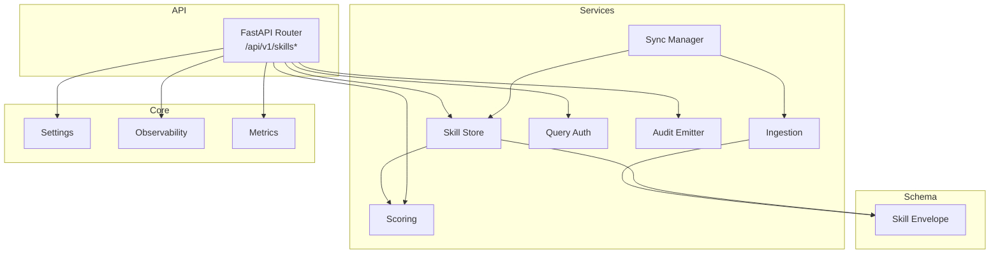
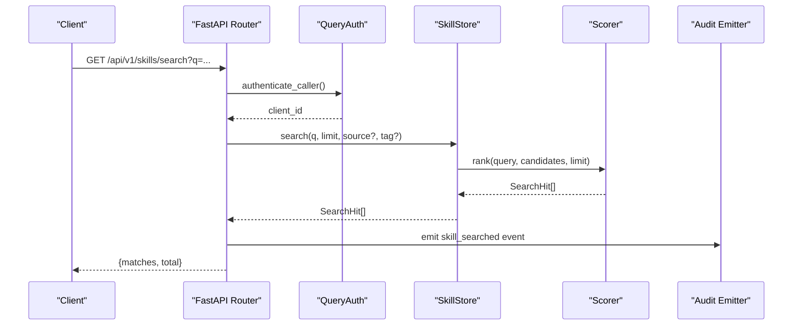
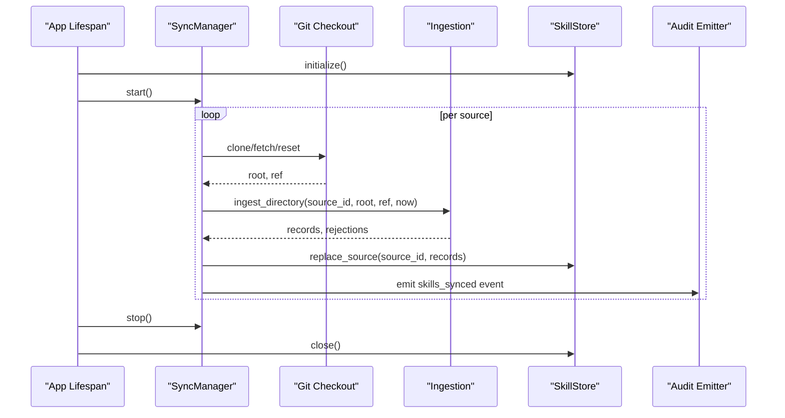
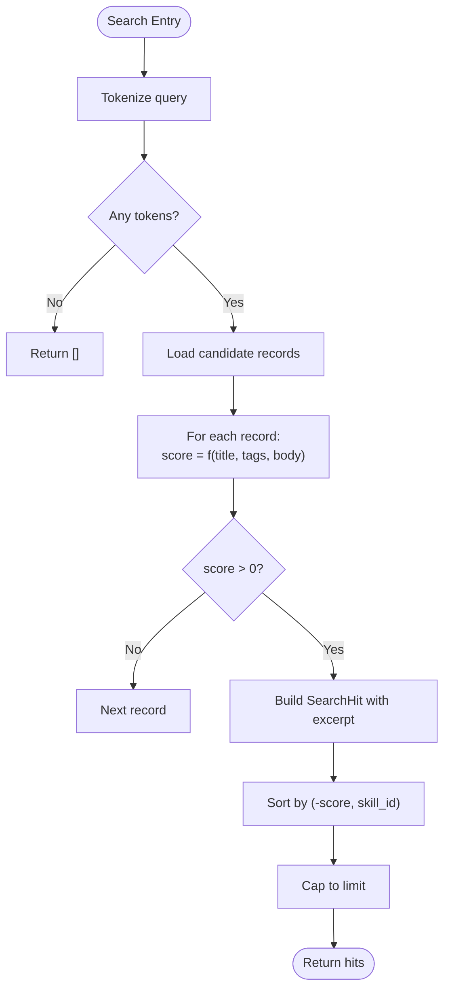
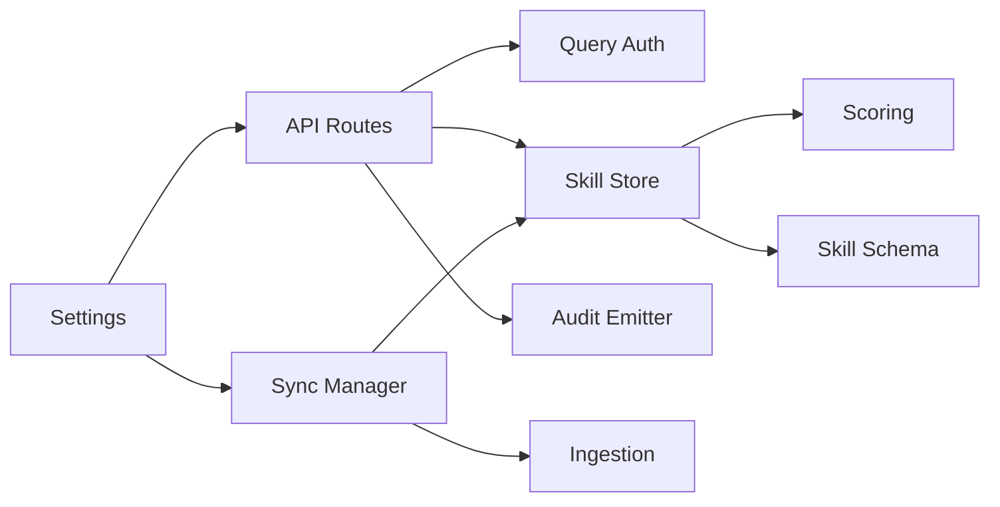

# Skills Hub

<cite>
**Referenced Files in This Document**
- [README.md](file://products/skills-hub/README.md)
- [skill-format.md](file://shared/shared-contracts/skill-format.md)
- [app.py](file://products/skills-hub/src/skills_hub/app.py)
- [config.py](file://products/skills-hub/src/skills_hub/core/config.py)
- [skills.py](file://products/skills-hub/src/skills_hub/api/routes/skills.py)
- [ingestion.py](file://products/skills-hub/src/skills_hub/services/ingestion.py)
- [scoring.py](file://products/skills-hub/src/skills_hub/services/scoring.py)
- [sync.py](file://products/skills-hub/src/skills_hub/services/sync.py)
- [skill_store.py](file://products/skills-hub/src/skills_hub/services/skill_store.py)
- [skill.py](file://products/skills-hub/src/skills_hub/schemas/skill.py)
- [validate.py](file://products/skills-hub/src/skills_hub/validate.py)
</cite>

## Table of Contents
1. [Introduction](#introduction)
2. [Project Structure](#project-structure)
3. [Core Components](#core-components)
4. [Architecture Overview](#architecture-overview)
5. [Detailed Component Analysis](#detailed-component-analysis)
6. [Dependency Analysis](#dependency-analysis)
7. [Performance Considerations](#performance-considerations)
8. [Troubleshooting Guide](#troubleshooting-guide)
9. [Conclusion](#conclusion)
10. [Appendices](#appendices)

## Introduction
Skills Hub ingests team-owned Markdown skills from federated sources (local directories and Git repositories), validates them against a shared skill format contract, ranks and indexes them for deterministic search, and exposes retrieval APIs to the platform’s agent tooling. It keeps skills synchronized with source repositories on a configurable interval, versioned by source reference, and provides per-source status and usage audit trails.

Key responsibilities:
- Federated ingestion from local paths and Git repositories
- Frontmatter validation and metadata normalization against the shared skill schema
- Deterministic ranked search and full-record retrieval
- Per-source atomic sync with failure isolation and status reporting
- Usage audit emission for search and retrieval events

Operational scope:
- Query API endpoints require authentication via a static Basic registry or projected workload tokens
- Health and status endpoints are auth-exempt
- The service does not execute tools or manage live sessions; it serves guidance content only

**Section sources**
- [README.md:3-13](file://products/skills-hub/README.md#L3-L13)
- [README.md:35-63](file://products/skills-hub/README.md#L35-L63)

## Project Structure
The Skills Hub is a FastAPI application organized into:
- API routes under api/routes for listing, searching, retrieving, validating, and status
- Core configuration, metrics, observability, request context, and telemetry
- Services for ingestion, scoring, synchronization, skill storage, query authentication, and audit emission
- Schemas defining the Skill envelope and step model
- A standalone CLI for pre-flight validation of skill sources

**Diagram sources**
- [app.py:20-86](file://products/skills-hub/src/skills_hub/app.py#L20-L86)
- [skills.py:28-215](file://products/skills-hub/src/skills_hub/api/routes/skills.py#L28-L215)
- [sync.py:154-324](file://products/skills-hub/src/skills_hub/services/sync.py#L154-L324)
- [ingestion.py:476-559](file://products/skills-hub/src/skills_hub/services/ingestion.py#L476-L559)
- [scoring.py:33-97](file://products/skills-hub/src/skills_hub/services/scoring.py#L33-L97)
- [skill_store.py:30-67](file://products/skills-hub/src/skills_hub/services/skill_store.py#L30-L67)
- [skill.py:15-66](file://products/skills-hub/src/skills_hub/schemas/skill.py#L15-L66)
- [config.py:161-209](file://products/skills-hub/src/skills_hub/core/config.py#L161-L209)

**Section sources**
- [app.py:20-86](file://products/skills-hub/src/skills_hub/app.py#L20-L86)
- [skills.py:28-215](file://products/skills-hub/src/skills_hub/api/routes/skills.py#L28-L215)
- [config.py:161-209](file://products/skills-hub/src/skills_hub/core/config.py#L161-L209)

## Core Components
- Ingestion: Walks a source directory, parses YAML frontmatter, enforces size and shape constraints, derives slugs from file paths, and produces validated Skill records plus rejections.
- Scoring: Pure keyword-scoring function that weights title, tags, and body occurrences deterministically and generates bounded excerpts.
- Sync Manager: Runs per-source loops to materialize sources (Git clone/fetch/reset or local path), ingest documents, and atomically replace the store snapshot; tracks per-source status and emits audit events.
- Skill Store: Strategy pattern with in-memory and PostgreSQL backends; supports list, get, search, count, prune, and per-source replace; Postgres uses GIN full-text index and re-ranks candidates with the shared scorer.
- API Routes: Provide authenticated list/search/get/validate endpoints and emit usage audit events for search and retrieval.
- Configuration: Frozen settings parsed from environment variables, including sources, Git tokens, sync interval, store backend, DB URL, query clients, workload token settings, and audit integration.
- Schema: Pydantic models enforcing the Skill envelope and step structure aligned with the shared skill schema.

**Section sources**
- [ingestion.py:1-14](file://products/skills-hub/src/skills_hub/services/ingestion.py#L1-L14)
- [scoring.py:1-10](file://products/skills-hub/src/skills_hub/services/scoring.py#L1-L10)
- [sync.py:1-9](file://products/skills-hub/src/skills_hub/services/sync.py#L1-L9)
- [skill_store.py:1-7](file://products/skills-hub/src/skills_hub/services/skill_store.py#L1-L7)
- [skills.py:1-13](file://products/skills-hub/src/skills_hub/api/routes/skills.py#L1-L13)
- [config.py:1-5](file://products/skills-hub/src/skills_hub/core/config.py#L1-L5)
- [skill.py:1-6](file://products/skills-hub/src/skills_hub/schemas/skill.py#L1-L6)

## Architecture Overview
The system runs as a FastAPI app that initializes a skill store and a sync manager during lifespan. Each configured source gets an independent asyncio task that periodically materializes and ingests its content, then atomically swaps the new snapshot into the store. API routes authenticate callers, delegate to the store, and emit usage audit events.

**Diagram sources**
- [skills.py:99-146](file://products/skills-hub/src/skills_hub/api/routes/skills.py#L99-L146)
- [skill_store.py:417-443](file://products/skills-hub/src/skills_hub/services/skill_store.py#L417-L443)
- [scoring.py:85-97](file://products/skills-hub/src/skills_hub/services/scoring.py#L85-L97)

**Diagram sources**
- [app.py:20-56](file://products/skills-hub/src/skills_hub/app.py#L20-L56)
- [sync.py:168-281](file://products/skills-hub/src/skills_hub/services/sync.py#L168-L281)
- [ingestion.py:476-559](file://products/skills-hub/src/skills_hub/services/ingestion.py#L476-L559)
- [skill_store.py:318-362](file://products/skills-hub/src/skills_hub/services/skill_store.py#L318-L362)

## Detailed Component Analysis

### Skill Format Specification
- A skill is a Markdown document with YAML frontmatter. Validation enforces required keys, length caps, allowed values, and unknown-key rejection.
- v2 adds optional executable-flow class support via kind and steps, decoupling risk_class from web_target. Knowledge skills validate identically to v1 when these keys are absent.
- Identity rules define skill_id as namespaced by source_id and slug derived from file path segments normalized to lowercase alphanumeric with hyphens. Duplicate slugs within a source are rejected; duplicates across sources are allowed.
- Size caps protect resources: body ≤ 64 KiB, description ≤ 500 chars, ≤ 10 tags, ≤ 200 steps, and steps serialized ≤ 64 KiB.
- Executable flows must declare kind: executable_flow and risk_class: write; any web.* step requires web_target. Credential values must be references to named sets, never literals or unresolved holes.

Authoring examples:
- Knowledge skill with title, description, tags, and optional version/source_url
- Executable flow with kind, steps, web_target, risk_class, and flow_intent

Validation pre-flight:
- Use the standalone CLI to lint a directory before publishing

**Section sources**
- [skill-format.md:1-54](file://shared/shared-contracts/skill-format.md#L1-L54)
- [skill-format.md:55-160](file://shared/shared-contracts/skill-format.md#L55-L160)
- [skill-format.md:162-186](file://shared/shared-contracts/skill-format.md#L162-L186)
- [ingestion.py:149-275](file://products/skills-hub/src/skills_hub/services/ingestion.py#L149-L275)
- [ingestion.py:375-460](file://products/skills-hub/src/skills_hub/services/ingestion.py#L375-L460)
- [validate.py:23-43](file://products/skills-hub/src/skills_hub/validate.py#L23-L43)

### Ingestion Pipeline
- Walks the source directory in sorted order for determinism, skipping hidden segments and known non-skill files.
- Derives slug from relative path, rejects unreadable documents, and enforces frontmatter constraints.
- Builds Skill envelopes with updated_at timestamp and stores body text; returns accepted records and rejections.

Conflict resolution:
- Within a source, duplicate slugs are rejected; first occurrence wins due to sorted traversal.
- Across sources, duplicate slugs are legal because ids are namespaced by source_id.

**Section sources**
- [ingestion.py:115-129](file://products/skills-hub/src/skills_hub/services/ingestion.py#L115-L129)
- [ingestion.py:476-559](file://products/skills-hub/src/skills_hub/services/ingestion.py#L476-L559)

### Validation and Scoring Algorithms
- Validation: Frontmatter parsing, key allowlist, type and length checks, URL validation for web_target, risk_class enumeration, executable-flow constraints, and JSON compatibility for steps.
- Scoring: Tokenization over lowercase alphanumeric sequences; title matches weighted at 3, tags at 2, body occurrences capped at 5 per token; zero-score results excluded; ties broken by skill_id ascending. Excerpts are bounded to 400 characters.

**Diagram sources**
- [scoring.py:28-97](file://products/skills-hub/src/skills_hub/services/scoring.py#L28-L97)

**Section sources**
- [ingestion.py:149-275](file://products/skills-hub/src/skills_hub/services/ingestion.py#L149-L275)
- [ingestion.py:375-460](file://products/skills-hub/src/skills_hub/services/ingestion.py#L375-L460)
- [scoring.py:28-97](file://products/skills-hub/src/skills_hub/services/scoring.py#L28-L97)

### Retrieval APIs
- List: Paginated listing with optional source and tag filters; returns summaries without body.
- Search: Ranked matches with score and excerpt; emits usage audit events.
- Get: Full record retrieval by skill_id; emits usage audit events on success or not-found.
- Validate: Accepts a document payload and validates using the same code path as ingestion; read-only, no store writes.

Authentication:
- All query routes require authentication via static Basic credentials or projected workload tokens.

**Section sources**
- [skills.py:68-96](file://products/skills-hub/src/skills_hub/api/routes/skills.py#L68-L96)
- [skills.py:99-146](file://products/skills-hub/src/skills_hub/api/routes/skills.py#L99-L146)
- [skills.py:149-181](file://products/skills-hub/src/skills_hub/api/routes/skills.py#L149-L181)
- [skills.py:184-215](file://products/skills-hub/src/skills_hub/api/routes/skills.py#L184-L215)

### Sync Mechanism and Source Management
- Per-source tasks run continuously, materializing sources either from a local path or by cloning/updating a Git repository with shallow depth and optional branch/tag ref.
- After materialization, ingestion runs in a thread to avoid blocking the event loop; results are atomically swapped into the store.
- Failed cycles keep the previous snapshot, update per-source status, increment error counters, and emit an audit event.
- On startup, sources removed from configuration are pruned from the durable store to keep the catalog consistent with federation entries.

Conflict handling:
- Git checkout failures are treated as transient; the next cycle retries from scratch if needed.
- Local paths are used directly; Kubernetes projected volumes are handled transparently.

**Section sources**
- [sync.py:78-149](file://products/skills-hub/src/skills_hub/services/sync.py#L78-L149)
- [sync.py:168-281](file://products/skills-hub/src/skills_hub/services/sync.py#L168-L281)
- [app.py:20-56](file://products/skills-hub/src/skills_hub/app.py#L20-L56)

### Caching and Performance Characteristics
- Search performance relies on a GIN full-text index over title and body in Postgres; tag matching is filtered separately to preserve index immutability requirements.
- Candidate set is further refined by the shared scorer to ensure identical ordering between backends.
- In-memory store is suitable for development and tests; Postgres backend is intended for production.
- Sync intervals include jitter to avoid stampede effects; git operations use timeouts to prevent hangs.

**Section sources**
- [skill_store.py:158-200](file://products/skills-hub/src/skills_hub/services/skill_store.py#L158-L200)
- [skill_store.py:417-443](file://products/skills-hub/src/skills_hub/services/skill_store.py#L417-L443)
- [sync.py:181-188](file://products/skills-hub/src/skills_hub/services/sync.py#L181-L188)

### Security Considerations
- Authentication: Query endpoints enforce static Basic credentials or projected workload tokens; health/status endpoints are auth-exempt.
- Secrets handling: Git tokens are injected into clone URLs and scrubbed from error messages and spans to avoid leaking credentials.
- Executable flows: Steps must reference credential sets rather than embedding secrets; unresolved placeholders are rejected.
- Boundary: Skills Hub serves guidance only; execution and policy enforcement occur elsewhere.

**Section sources**
- [skills.py:1-13](file://products/skills-hub/src/skills_hub/api/routes/skills.py#L1-L13)
- [sync.py:138-148](file://products/skills-hub/src/skills_hub/services/sync.py#L138-L148)
- [sync.py:247-279](file://products/skills-hub/src/skills_hub/services/sync.py#L247-L279)
- [ingestion.py:345-371](file://products/skills-hub/src/skills_hub/services/ingestion.py#L345-L371)
- [README.md:71-74](file://products/skills-hub/README.md#L71-L74)

## Dependency Analysis
Components interact through well-defined interfaces:
- API routes depend on query authentication, skill store, and audit emitter.
- Sync depends on ingestion and skill store, emitting audit events and metrics.
- Scoring is pure and reused by both store backends to guarantee deterministic ranking.
- Configuration drives store selection, sync behavior, and authentication settings.

**Diagram sources**
- [skills.py:28-215](file://products/skills-hub/src/skills_hub/api/routes/skills.py#L28-L215)
- [sync.py:154-324](file://products/skills-hub/src/skills_hub/services/sync.py#L154-L324)
- [skill_store.py:30-67](file://products/skills-hub/src/skills_hub/services/skill_store.py#L30-L67)
- [scoring.py:33-97](file://products/skills-hub/src/skills_hub/services/scoring.py#L33-L97)
- [config.py:161-209](file://products/skills-hub/src/skills_hub/core/config.py#L161-L209)

**Section sources**
- [skills.py:28-215](file://products/skills-hub/src/skills_hub/api/routes/skills.py#L28-L215)
- [sync.py:154-324](file://products/skills-hub/src/skills_hub/services/sync.py#L154-L324)
- [skill_store.py:30-67](file://products/skills-hub/src/skills_hub/services/skill_store.py#L30-L67)
- [scoring.py:33-97](file://products/skills-hub/src/skills_hub/services/scoring.py#L33-L97)
- [config.py:161-209](file://products/skills-hub/src/skills_hub/core/config.py#L161-L209)

## Performance Considerations
- Use Postgres backend for production to benefit from GIN full-text indexing and persistent state.
- Tune SKILLS_SYNC_INTERVAL_SECONDS to balance freshness and load; jitter prevents synchronized spikes.
- Keep skill bodies and step lists within size caps to avoid excessive memory and serialization overhead.
- Limit search results with appropriate limit parameters to reduce payload sizes.
- Prefer tag filtering where possible to narrow candidate sets before scoring.

[No sources needed since this section provides general guidance]

## Troubleshooting Guide
Common issues and diagnostics:
- Invalid frontmatter: Rejection reasons indicate missing or invalid keys, unknown keys, or constraint violations.
- Duplicate slugs: Occur when multiple files map to the same normalized slug within one source; resolve by renaming or restructuring.
- Git sync errors: Check per-source status endpoint for last_error; credentials may be masked in logs but visible in status details.
- Missing source path: Ensure configured local paths exist and Git subpaths are valid relative directories.
- Query authentication failures: Verify SKILLS_QUERY_CLIENTS or workload token mappings match caller identity.

Diagnostics:
- Use the status endpoint to inspect per-source sync outcomes and recent rejections.
- Run the validation CLI locally to catch issues before publishing.
- Inspect metrics and audit events for sync successes/errors and search/retrieval usage.

**Section sources**
- [sync.py:300-324](file://products/skills-hub/src/skills_hub/services/sync.py#L300-L324)
- [validate.py:23-43](file://products/skills-hub/src/skills_hub/validate.py#L23-L43)
- [skills.py:68-96](file://products/skills-hub/src/skills_hub/api/routes/skills.py#L68-L96)

## Conclusion
Skills Hub provides a robust, auditable pipeline for ingesting, validating, and serving operational guidance from federated sources. Its design emphasizes deterministic ranking, atomic per-source updates, clear separation of concerns, and strong security boundaries around credentials and execution. Operators can author knowledge and executable-flow skills, configure sources and scoring behavior, and monitor ingestion and usage through status and audit trails.

[No sources needed since this section summarizes without analyzing specific files]

## Appendices

### Authoring Examples
- Knowledge skill: Markdown with title, description, tags, and optional version/source_url
- Executable flow: Add kind: executable_flow, risk_class: write, web_target (for browser flows), and steps with tool, args, and optional expect

Reference:
- [skill-format.md:14-54](file://shared/shared-contracts/skill-format.md#L14-L54)
- [skill-format.md:55-160](file://shared/shared-contracts/skill-format.md#L55-L160)

**Section sources**
- [skill-format.md:14-54](file://shared/shared-contracts/skill-format.md#L14-L54)
- [skill-format.md:55-160](file://shared/shared-contracts/skill-format.md#L55-L160)

### Configuring Skill Sources
- Define SKILLS_SOURCES as a JSON list of source entries with source_id, type (local or git), and type-specific fields (path or url/ref).
- For private Git sources, provide SKILLS_GIT_TOKENS mapping source_id to token.
- Set SKILLS_STORE_BACKEND to memory or postgres; for Postgres, provide SKILLS_DB_URL.
- Configure SKILLS_QUERY_CLIENTS for Basic auth or workload token settings for production.

Reference:
- [config.py:50-131](file://products/skills-hub/src/skills_hub/core/config.py#L50-L131)
- [config.py:161-209](file://products/skills-hub/src/skills_hub/core/config.py#L161-L209)
- [README.md:43-63](file://products/skills-hub/README.md#L43-L63)

**Section sources**
- [config.py:50-131](file://products/skills-hub/src/skills_hub/core/config.py#L50-L131)
- [config.py:161-209](file://products/skills-hub/src/skills_hub/core/config.py#L161-L209)
- [README.md:43-63](file://products/skills-hub/README.md#L43-L63)

### Customizing Scoring Criteria
- Scoring weights and tokenization are fixed to ensure deterministic, explainable ranking across backends.
- To influence relevance, prefer precise titles/tags and concise descriptions; body occurrences are capped to prevent long texts from dominating scores.
- Tag filtering can be used to constrain candidate sets prior to scoring.

Reference:
- [scoring.py:21-52](file://products/skills-hub/src/skills_hub/services/scoring.py#L21-L52)

**Section sources**
- [scoring.py:21-52](file://products/skills-hub/src/skills_hub/services/scoring.py#L21-L52)

### Monitoring Skill Usage Patterns
- Usage audit events are emitted for skill_searched and skill_retrieved, correlated via x-request-id.
- Sync cycles emit skills_synced events with accepted/rejected counts and error details.
- Metrics track sync outcomes and search activity.

Reference:
- [skills.py:47-65](file://products/skills-hub/src/skills_hub/api/routes/skills.py#L47-L65)
- [skills.py:120-133](file://products/skills-hub/src/skills_hub/api/routes/skills.py#L120-L133)
- [sync.py:218-234](file://products/skills-hub/src/skills_hub/services/sync.py#L218-L234)

**Section sources**
- [skills.py:47-65](file://products/skills-hub/src/skills_hub/api/routes/skills.py#L47-L65)
- [skills.py:120-133](file://products/skills-hub/src/skills_hub/api/routes/skills.py#L120-L133)
- [sync.py:218-234](file://products/skills-hub/src/skills_hub/services/sync.py#L218-L234)