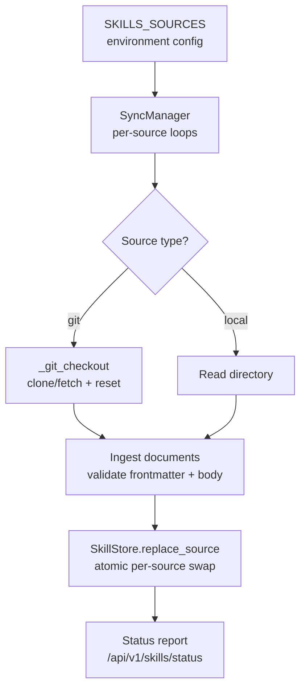
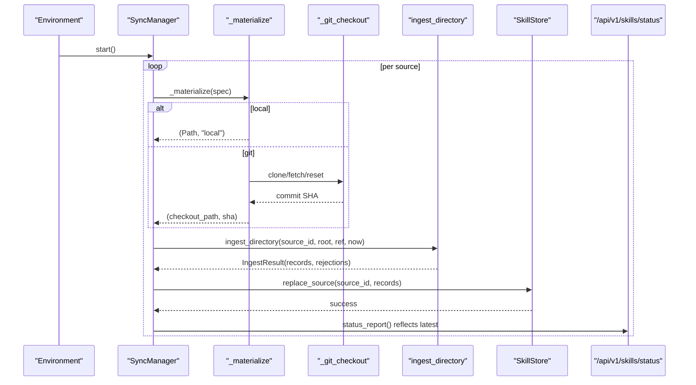
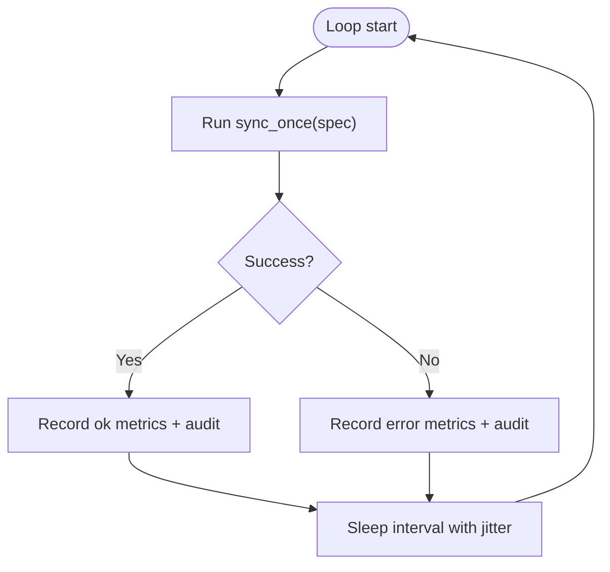
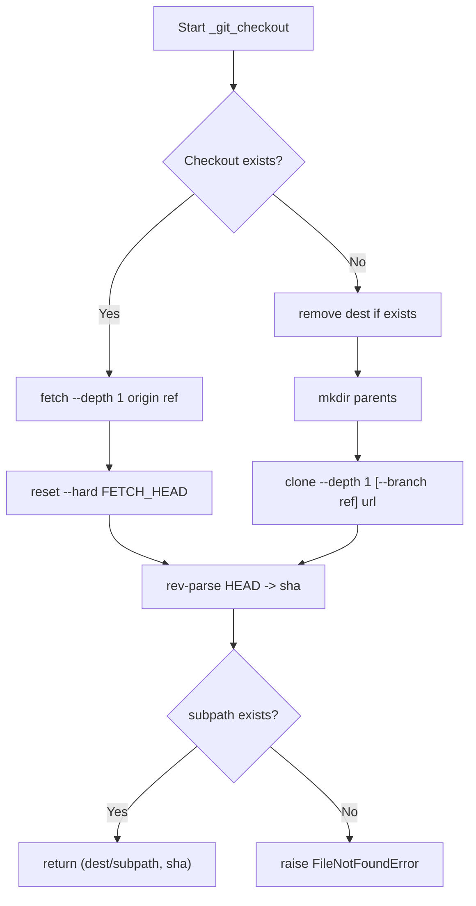
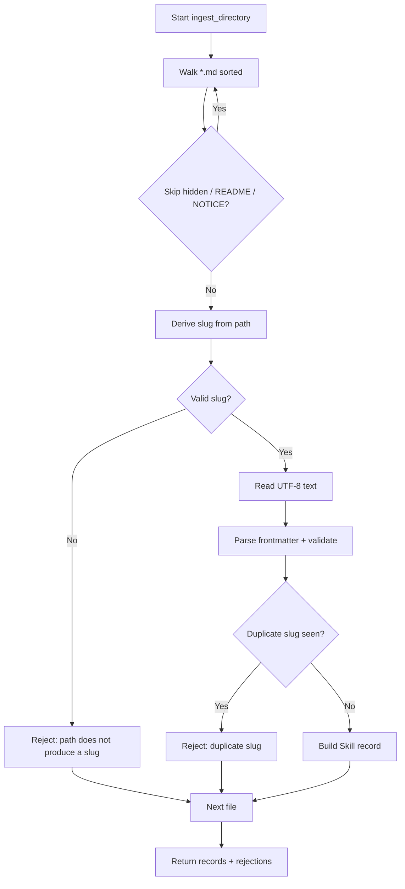
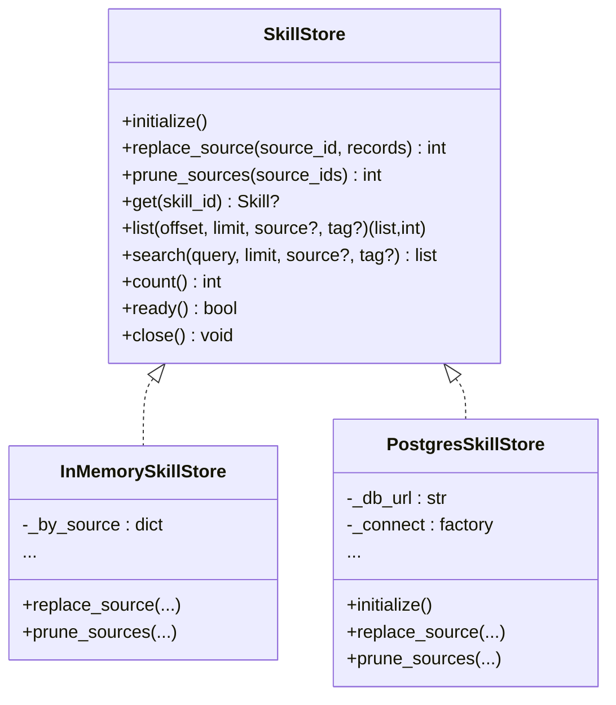
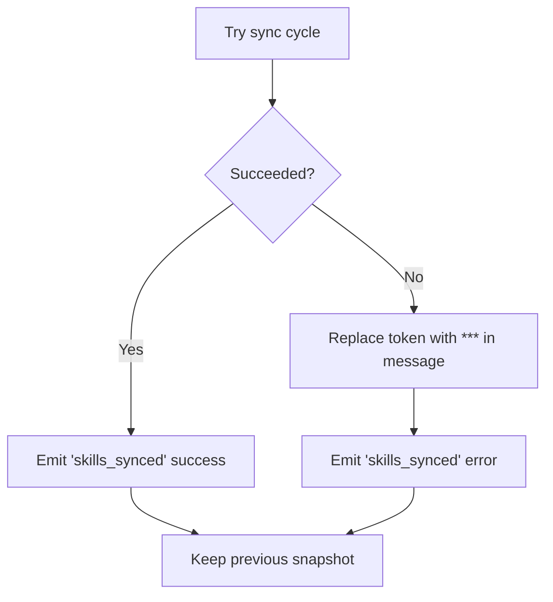
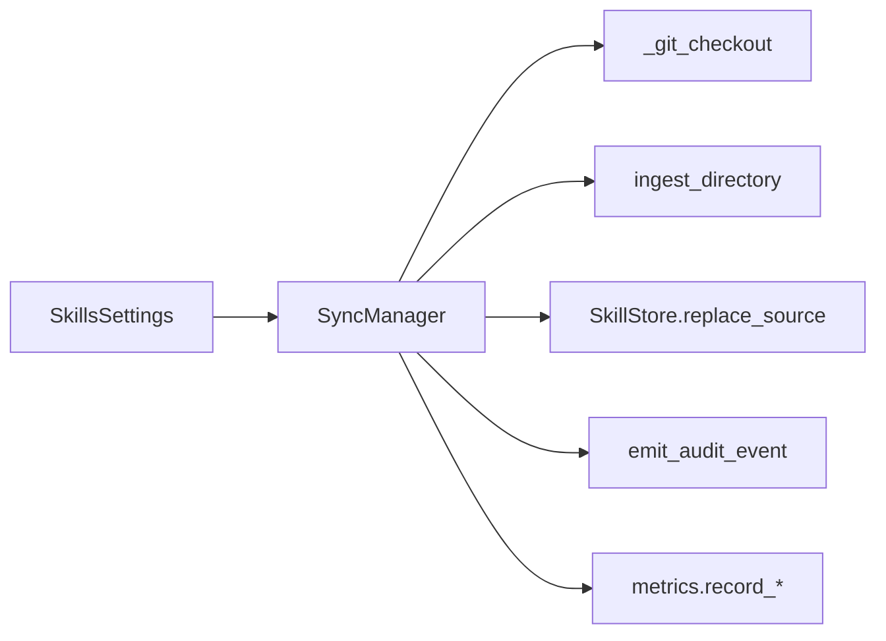

# Synchronization Mechanism

<cite>
**Referenced Files in This Document**
- [sync.py](file://products/skills-hub/src/skills_hub/services/sync.py)
- [ingestion.py](file://products/skills-hub/src/skills_hub/services/ingestion.py)
- [skill_store.py](file://products/skills-hub/src/skills_hub/services/skill_store.py)
- [config.py](file://products/skills-hub/src/skills_hub/core/config.py)
- [status.py](file://products/skills-hub/src/skills_hub/api/routes/status.py)
- [README.md](file://products/skills-hub/README.md)
- [skills-guide.md](file://docs/guides/skills-guide.md)
- [test_sync.py](file://products/skills-hub/tests/test_sync.py)
</cite>

## Table of Contents
1. Introduction
2. Project Structure
3. Core Components
4. Architecture Overview
5. Detailed Component Analysis
6. Dependency Analysis
7. Performance Considerations
8. Troubleshooting Guide
9. Conclusion
10. Appendices

## Introduction
This document explains how Skills Hub keeps skill content synchronized with source Git repositories and local directories. It covers the sync scheduler, conflict resolution strategy, incremental update processing, configuration for frequency and branch selection, authentication for private repos, error handling, monitoring, and performance considerations for large repositories and bulk updates.

## Project Structure
Skills Hub implements per-source synchronization with:
- A scheduler that runs one loop per configured source
- A materialization step that checks out Git sources or reads local paths
- An ingestion pipeline that validates Markdown skills against a strict contract
- An atomic store swap that replaces a source’s slice without affecting other sources
- An auth-exempt status endpoint to inspect sync health

**Diagram sources**
- [sync.py:154-187](file://products/skills-hub/src/skills_hub/services/sync.py#L154-L187)
- [sync.py:283-298](file://products/skills-hub/src/skills_hub/services/sync.py#L283-L298)
- [ingestion.py:476-558](file://products/skills-hub/src/skills_hub/services/ingestion.py#L476-L558)
- [skill_store.py:318-362](file://products/skills-hub/src/skills_hub/services/skill_store.py#L318-L362)
- [status.py:20-29](file://products/skills-hub/src/skills_hub/api/routes/status.py#L20-L29)

**Section sources**
- [README.md:23-63](file://products/skills-hub/README.md#L23-L63)
- [skills-guide.md:12-35](file://docs/guides/skills-guide.md#L12-L35)

## Core Components
- SyncManager: owns per-source async loops, schedules intervals with jitter, and records outcomes.
- Materializer: resolves a readable root directory; for git, clones or fetches into a disposable checkout under SKILLS_DATA_PATH/sources/<source_id>, then selects an optional subpath.
- Ingestion: walks files, parses YAML frontmatter, enforces size and schema limits, derives slugs from paths, and rejects duplicates within a source.
- SkillStore: provides replace_source for atomic per-source snapshot replacement (in-memory or PostgreSQL).
- Status API: exposes last sync timestamps, refs, accepted counts, and bounded rejection lists.

Key behaviors:
- One failure never affects another source; previous snapshots are preserved on errors.
- Git operations run off the event loop via asyncio.to_thread to avoid blocking.
- Audit events are emitted per cycle with scrubbed credentials in error messages.

**Section sources**
- [sync.py:41-51](file://products/skills-hub/src/skills_hub/services/sync.py#L41-L51)
- [sync.py:154-187](file://products/skills-hub/src/skills_hub/services/sync.py#L154-L187)
- [sync.py:283-298](file://products/skills-hub/src/skills_hub/services/sync.py#L283-L298)
- [ingestion.py:100-113](file://products/skills-hub/src/skills_hub/services/ingestion.py#L100-L113)
- [skill_store.py:30-66](file://products/skills-hub/src/skills_hub/services/skill_store.py#L30-L66)
- [status.py:20-29](file://products/skills-hub/src/skills_hub/api/routes/status.py#L20-L29)

## Architecture Overview
The sync architecture is event-driven and per-source:

**Diagram sources**
- [sync.py:168-187](file://products/skills-hub/src/skills_hub/services/sync.py#L168-L187)
- [sync.py:283-298](file://products/skills-hub/src/skills_hub/services/sync.py#L283-L298)
- [sync.py:102-148](file://products/skills-hub/src/skills_hub/services/sync.py#L102-L148)
- [ingestion.py:476-558](file://products/skills-hub/src/skills_hub/services/ingestion.py#L476-L558)
- [skill_store.py:318-362](file://products/skills-hub/src/skills_hub/services/skill_store.py#L318-L362)
- [status.py:20-29](file://products/skills-hub/src/skills_hub/api/routes/status.py#L20-L29)

## Detailed Component Analysis

### Sync Scheduler and Loop
- Starts one task per configured source.
- Each loop calls sync_once, then sleeps for SKILLS_SYNC_INTERVAL_SECONDS with small random jitter to avoid stampedes.
- sync_once never raises; it records success or error in SourceStatus and emits audit events.

**Diagram sources**
- [sync.py:168-187](file://products/skills-hub/src/skills_hub/services/sync.py#L168-L187)
- [sync.py:189-281](file://products/skills-hub/src/skills_hub/services/sync.py#L189-L281)

**Section sources**
- [sync.py:168-187](file://products/skills-hub/src/skills_hub/services/sync.py#L168-L187)
- [sync.py:189-281](file://products/skills-hub/src/skills_hub/services/sync.py#L189-L281)

### Git Materialization and Authentication
- For git sources, clones with --depth 1 and optionally --branch <ref>; if a checkout exists, performs shallow fetch and hard reset.
- Injects x-access-token into HTTPS URLs when a token is configured for the source.
- Returns resolved commit SHA used as the source ref marker.
- If a configured subpath does not exist after checkout, sync fails with a clear error.

**Diagram sources**
- [sync.py:102-148](file://products/skills-hub/src/skills_hub/services/sync.py#L102-L148)
- [sync.py:283-298](file://products/skills-hub/src/skills_hub/services/sync.py#L283-L298)

**Section sources**
- [sync.py:81-98](file://products/skills-hub/src/skills_hub/services/sync.py#L81-L98)
- [sync.py:102-148](file://products/skills-hub/src/skills_hub/services/sync.py#L102-L148)
- [sync.py:283-298](file://products/skills-hub/src/skills_hub/services/sync.py#L283-L298)

### Ingestion and Conflict Resolution
- Walks all Markdown files under the root (including Kubernetes projected ..data), skipping hidden segments and known base names.
- Derives slug from path; first occurrence wins deterministically (sorted traversal). Duplicate slugs within a source are rejected.
- Validates YAML frontmatter fields and sizes; enforces executable-flow constraints when present.
- Produces a list of validated Skill records plus a bounded rejection list.

Conflict resolution highlights:
- Duplicate slug within a source: later file is rejected; earlier wins.
- Size and schema violations: rejected with categorized reasons.
- Missing or unreadable files: recorded as rejections without failing the whole source.

**Diagram sources**
- [ingestion.py:476-558](file://products/skills-hub/src/skills_hub/services/ingestion.py#L476-L558)
- [ingestion.py:115-129](file://products/skills-hub/src/skills_hub/services/ingestion.py#L115-L129)
- [ingestion.py:149-275](file://products/skills-hub/src/skills_hub/services/ingestion.py#L149-L275)

**Section sources**
- [ingestion.py:100-113](file://products/skills-hub/src/skills_hub/services/ingestion.py#L100-L113)
- [ingestion.py:115-129](file://products/skills-hub/src/skills_hub/services/ingestion.py#L115-L129)
- [ingestion.py:149-275](file://products/skills-hub/src/skills_hub/services/ingestion.py#L149-L275)
- [ingestion.py:476-558](file://products/skills-hub/src/skills_hub/services/ingestion.py#L476-L558)

### Atomic Store Swap and Incremental Updates
- replace_source builds a new snapshot for the source and swaps it atomically (in-memory reference swap or DB transaction delete+insert).
- Readers always see a complete slice; partial writes cannot leak.
- Incremental behavior: each cycle re-ingests the entire checked-out source and replaces the slice; conflicts are resolved by slug uniqueness and deterministic ordering.

**Diagram sources**
- [skill_store.py:30-66](file://products/skills-hub/src/skills_hub/services/skill_store.py#L30-L66)
- [skill_store.py:72-153](file://products/skills-hub/src/skills_hub/services/skill_store.py#L72-L153)
- [skill_store.py:283-362](file://products/skills-hub/src/skills_hub/services/skill_store.py#L283-L362)

**Section sources**
- [skill_store.py:72-153](file://products/skills-hub/src/skills_hub/services/skill_store.py#L72-L153)
- [skill_store.py:318-362](file://products/skills-hub/src/skills_hub/services/skill_store.py#L318-L362)

### Error Handling and Credential Safety
- Any exception during a sync cycle is caught; the previous snapshot remains served.
- Error messages are scrubbed to remove configured tokens before being stored or reported.
- Audit events are emitted with outcome success or error; details include source metadata and scrubbed messages.

**Diagram sources**
- [sync.py:189-281](file://products/skills-hub/src/skills_hub/services/sync.py#L189-L281)
- [sync.py:102-148](file://products/skills-hub/src/skills_hub/services/sync.py#L102-L148)

**Section sources**
- [sync.py:189-281](file://products/skills-hub/src/skills_hub/services/sync.py#L189-L281)
- [test_sync.py:100-124](file://products/skills-hub/tests/test_sync.py#L100-L124)
- [test_sync.py:219-246](file://products/skills-hub/tests/test_sync.py#L219-L246)

### Monitoring and Health Surface
- Auth-exempt /api/v1/skills/status returns store backend, sync interval, and per-source reports including last_sync_at, ref, accepted count, and bounded rejections.
- Prometheus metrics include sync totals, rejection categories, and store sizes.

**Section sources**
- [status.py:20-29](file://products/skills-hub/src/skills_hub/api/routes/status.py#L20-L29)
- [README.md:43-63](file://products/skills-hub/README.md#L43-L63)
- [skills-guide.md:338-358](file://docs/guides/skills-guide.md#L338-L358)

## Dependency Analysis
- SyncManager depends on:
  - SkillsSettings for sources, tokens, intervals, data path
  - Git tooling via subprocess (shallow clone/fetch/reset)
  - Ingestion for validation and record building
  - SkillStore for atomic per-source replacement
  - Audit emitter for usage-trail events
  - Metrics and tracing hooks

**Diagram sources**
- [sync.py:154-187](file://products/skills-hub/src/skills_hub/services/sync.py#L154-L187)
- [sync.py:283-298](file://products/skills-hub/src/skills_hub/services/sync.py#L283-L298)
- [config.py:161-203](file://products/skills-hub/src/skills_hub/core/config.py#L161-L203)

**Section sources**
- [sync.py:154-187](file://products/skills-hub/src/skills_hub/services/sync.py#L154-L187)
- [config.py:161-203](file://products/skills-hub/src/skills_hub/core/config.py#L161-L203)

## Performance Considerations
- Shallow clones: depth 1 minimizes bandwidth and time for large repos.
- Off-loop execution: Git operations run in threads to avoid blocking the event loop.
- Deterministic ingestion: sorted traversal ensures stable duplicate-slug resolution and predictable workloads.
- Atomic swaps: readers never observe partial updates; reduces contention and inconsistency risk.
- Resource caps: enforced limits on body size, tags, steps, and step bytes prevent oversized payloads from degrading performance.
- Concurrency: one task per source; adjust SKILLS_SYNC_INTERVAL_SECONDS to balance freshness vs resource use.

[No sources needed since this section provides general guidance]

## Troubleshooting Guide
Common symptoms and actions:
- New or revised skill not visible: wait one interval or restart the deployment to trigger immediate resync; verify ConfigMap wiring for local sources.
- Source reports rejections: inspect /api/v1/skills/status rejections; fix frontmatter or size issues; re-validate locally.
- Source reports last_error: check unreachable URLs, expired tokens, or missing subpaths; previous snapshot continues serving until fixed.
- Git source errors mention authentication: ensure SKILLS_GIT_TOKENS includes the correct token for the source; secrets must be mounted into the pod.
- Git source errors mention subpath: confirm the configured path exists in the repo checkout; adjust SKILLS_SOURCES accordingly.
- Search returns no matches: verify catalog via /api/v1/skills; check whether the source has synced successfully.

Operational checks:
- Use /api/v1/skills/status to review per-source last_sync_at, ref, accepted counts, and rejections.
- Inspect Prometheus metrics for sync errors and rejection categories.

**Section sources**
- [skills-guide.md:338-373](file://docs/guides/skills-guide.md#L338-L373)
- [status.py:20-29](file://products/skills-hub/src/skills_hub/api/routes/status.py#L20-L29)
- [README.md:43-63](file://products/skills-hub/README.md#L43-L63)

## Conclusion
Skills Hub synchronizes federated skill sources through robust, per-source loops that materialize content, validate it strictly, and atomically swap slices into the store. Failures are isolated, credentials are scrubbed from logs and status, and operators can monitor health via an auth-exempt status endpoint and metrics. Tuning sync frequency, branch selection, and repository authentication allows safe operation across diverse environments and large repositories.

[No sources needed since this section summarizes without analyzing specific files]

## Appendices

### Configuration Options
- SKILLS_SOURCES: JSON list of sources; supports local and git types with required fields per type.
- SKILLS_GIT_TOKENS: JSON map of source_id to token for private repositories.
- SKILLS_SYNC_INTERVAL_SECONDS: seconds between sync cycles per source; default 300.
- SKILLS_DATA_PATH: working directory for git checkouts; default /var/lib/skills-hub.
- SKILLS_STORE_BACKEND: memory or postgres; defaults to memory.
- SKILLS_DB_URL: required when using postgres backend.
- SKILLS_QUERY_CLIENTS: static Basic registry for query clients.
- SKILLS_WORKLOAD_ISSUER_URL, SKILLS_WORKLOAD_AUDIENCE, SKILLS_WORKLOAD_CLIENTS: workload-token auth settings.
- SKILLS_AUDIT_SERVICE_URL, SKILLS_AUDIT_CLIENT_ID, SKILLS_AUDIT_CLIENT_SECRET: audit service integration.

**Section sources**
- [config.py:50-130](file://products/skills-hub/src/skills_hub/core/config.py#L50-L130)
- [config.py:161-203](file://products/skills-hub/src/skills_hub/core/config.py#L161-L203)
- [README.md:43-63](file://products/skills-hub/README.md#L43-L63)
- [skills-guide.md:231-284](file://docs/guides/skills-guide.md#L231-L284)

### Example Sync Configurations
- Local source example: configure a directory path under SKILLS_SOURCES and mount it into the pod.
- Git source example: configure url, ref (branch/tag), and optional path to scope ingestion to a subdirectory.
- Private repository: add the corresponding token to SKILLS_GIT_TOKENS so the clone URL receives x-access-token injection.

**Section sources**
- [skills-guide.md:231-284](file://docs/guides/skills-guide.md#L231-L284)
- [test_sync.py:126-159](file://products/skills-hub/tests/test_sync.py#L126-L159)

### Monitoring Sync Health
- Check /api/v1/skills/status for per-source last_sync_at, ref, accepted counts, and bounded rejections.
- Watch Prometheus metrics:
  - skills_syncs_total{source,result}
  - skills_ingest_rejected_total{reason}
  - skills_store_skills{source}
  - skills_searches_total

**Section sources**
- [status.py:20-29](file://products/skills-hub/src/skills_hub/api/routes/status.py#L20-L29)
- [skills-guide.md:338-358](file://docs/guides/skills-guide.md#L338-L358)