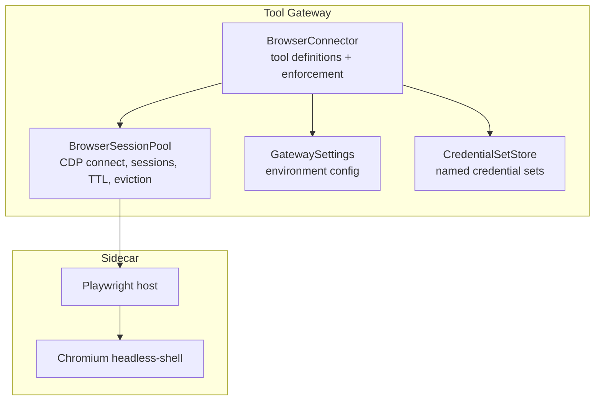
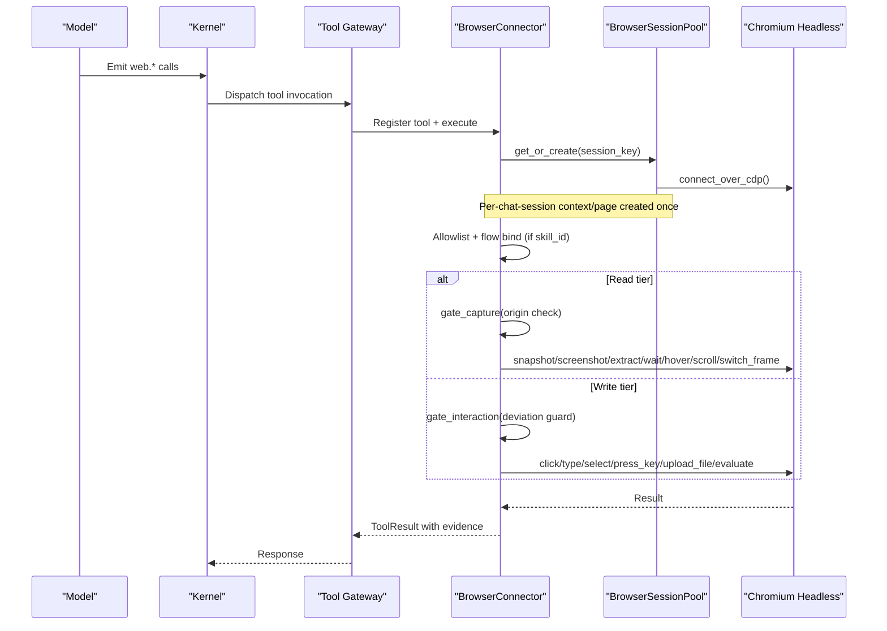
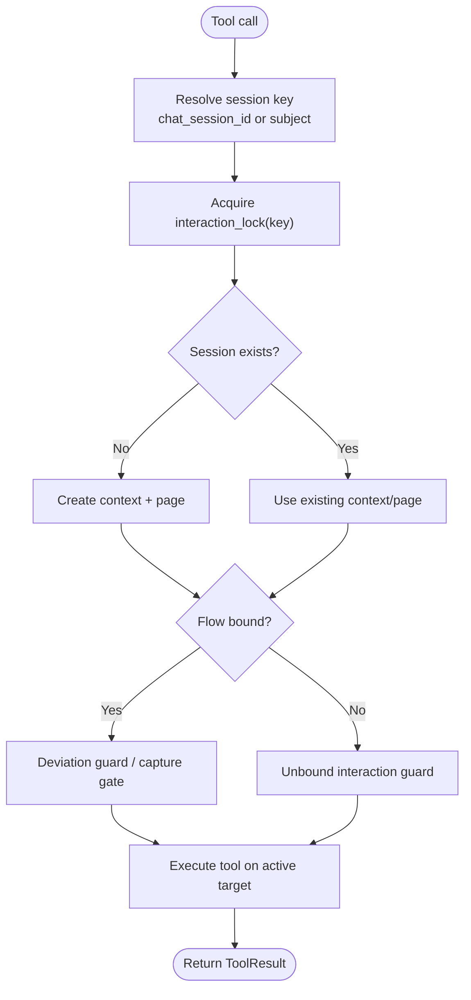
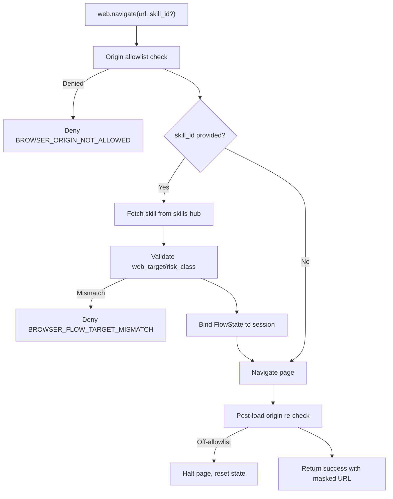
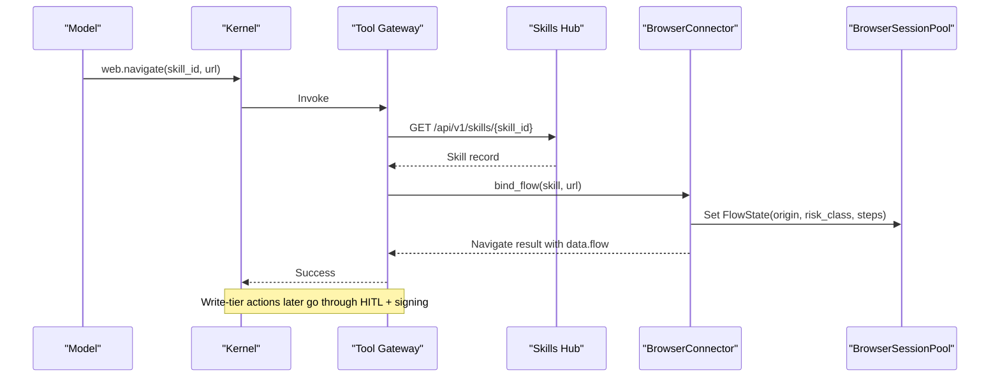
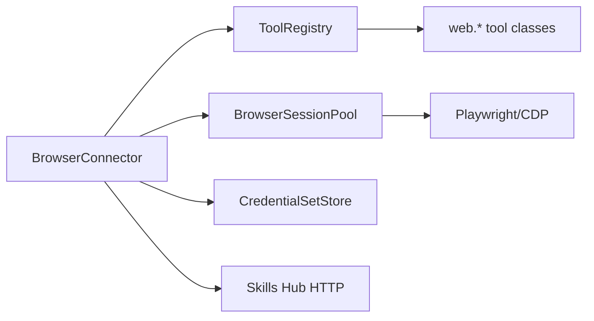

# Browser Connector

<cite>
**Referenced Files in This Document**
- [browser_connector.py](file://products/tool-gateway/src/tool_gateway/tools/browser_connector.py)
- [browser_sessions.py](file://products/tool-gateway/src/tool_gateway/tools/browser_sessions.py)
- [config.py](file://products/tool-gateway/src/tool_gateway/core/config.py)
- [credential_sets.py](file://products/tool-gateway/src/tool_gateway/tools/credential_sets.py)
- [test_browser_connector.py](file://products/tool-gateway/tests/test_browser_connector.py)
- [secret_params.py](file://products/agent-platform/src/agent_service/services/secret_params.py)
- [0007-browser-flow-single-hitl-gate.md](file://docs/adr/0007-browser-flow-single-hitl-gate.md)
- [2026-09-02-spec-049-browser-web-check-tools.md](file://docs/agentic-aiops-platform/release-notes/2026-09-02-spec-049-browser-web-check-tools.md)
- [2026-09-04-browser-flow-hitl-gate-enforcement.md](file://docs/agentic-aiops-platform/release-notes/2026-09-04-browser-flow-hitl-gate-enforcement.md)
- [delivery-roadmap.md](file://docs/agentic-aiops-platform/delivery-roadmap.md)
</cite>

## Table of Contents
1. Introduction
2. Project Structure
3. Core Components
4. Architecture Overview
5. Detailed Component Analysis
6. Dependency Analysis
7. Performance Considerations
8. Troubleshooting Guide
9. Conclusion
10. Appendices

## Introduction
The Browser Connector provides bounded web automation through a Chromium headless sidecar reached via Chrome DevTools Protocol (CDP). It exposes a fixed tool surface split into read-tier and write-tier tools, enforces origin allowlisting, flow binding with skill declarations, step budgets, credential set management, and screenshot masking. Sessions are per-chat-session browser contexts with CDP communication and stateful page interactions. The connector integrates with skills-hub for flow validation and participates in the HITL approval workflow for write operations.

## Project Structure
The Browser Connector lives under the tool-gateway product and is composed of:
- Tool implementations and enforcement logic in the browser connector module.
- A session pool that manages CDP connections, browser contexts, pages, frames, and flow state.
- Configuration loading from environment variables.
- Credential set storage for named username/password sets.
- Tests validating behavior and configuration parsing.

**Diagram sources**
- [browser_connector.py:315-399](file://products/tool-gateway/src/tool_gateway/tools/browser_connector.py#L315-L399)
- [browser_sessions.py:169-344](file://products/tool-gateway/src/tool_gateway/tools/browser_sessions.py#L169-L344)
- [config.py:141-184](file://products/tool-gateway/src/tool_gateway/core/config.py#L141-L184)
- [credential_sets.py:67-102](file://products/tool-gateway/src/tool_gateway/tools/credential_sets.py#L67-L102)

**Section sources**
- [browser_connector.py:1-61](file://products/tool-gateway/src/tool_gateway/tools/browser_connector.py#L1-L61)
- [browser_sessions.py:1-27](file://products/tool-gateway/src/tool_gateway/tools/browser_sessions.py#L1-L27)
- [config.py:141-184](file://products/tool-gateway/src/tool_gateway/core/config.py#L141-L184)

## Core Components
- BrowserConnector: Registers tools, enforces origin allowlist, binds flows, gates interactions and captures, and coordinates sessions.
- BrowserSessionPool: Manages one shared CDP connection, per-chat-session browser contexts/pages, idle TTL, max-cap eviction, and interaction serialization locks.
- FlowState: Tracks bound skill id, origin, risk class, title/description/intent, step budget, and approval flags.
- CredentialSetStore: Loads and serves named credential sets from a secret-mounted JSON file; never leaks values to results or logs.
- Tool classes: One class per web.* tool implementing parameters, execution, error handling, and evidence emission.

Key responsibilities:
- Origin allowlisting before navigation and re-check on reads.
- Flow binding via skills-hub lookup and validation against declared web_target and risk_class.
- Step budget accounting for bound flows.
- Screenshot masking for password-tier values.
- Frame-aware operations with switch_frame and active target selection.

**Section sources**
- [browser_connector.py:315-699](file://products/tool-gateway/src/tool_gateway/tools/browser_connector.py#L315-L699)
- [browser_sessions.py:61-167](file://products/tool-gateway/src/tool_gateway/tools/browser_sessions.py#L61-L167)
- [credential_sets.py:67-102](file://products/tool-gateway/src/tool_gateway/tools/credential_sets.py#L67-L102)

## Architecture Overview
The connector serializes model-emitted tool calls per chat session to avoid concurrent Playwright interactions on a shared page. Each call acquires an interaction lock keyed by the chat session id. Read-tier captures re-validate the live origin before producing snapshots or screenshots. Write-tier interactions pass through the confirmation bridge and signed execution path upstream, then hit deviation guards at the gateway.

**Diagram sources**
- [browser_connector.py:730-863](file://products/tool-gateway/src/tool_gateway/tools/browser_connector.py#L730-L863)
- [browser_connector.py:866-1027](file://products/tool-gateway/src/tool_gateway/tools/browser_connector.py#L866-L1027)
- [browser_connector.py:1079-1141](file://products/tool-gateway/src/tool_gateway/tools/browser_connector.py#L1079-L1141)
- [browser_sessions.py:306-344](file://products/tool-gateway/src/tool_gateway/tools/browser_sessions.py#L306-L344)

## Detailed Component Analysis

### Session Management and CDP Communication
- Identity keying: Uses chat_session_id when present; falls back to verified subject for non-chat callers.
- Connection lifecycle: Eager CDP bootstrap at startup; lazy retry on first use; fails closed with structured errors if sidecar is unreachable.
- Session pool: Idle TTL expiration, max sessions cap with oldest-idle eviction, per-key interaction locks to serialize concurrent calls.
- Frame awareness: Active target resolves to top-level page or last frame in stack; navigate resets frame stack.

**Diagram sources**
- [browser_connector.py:407-443](file://products/tool-gateway/src/tool_gateway/tools/browser_connector.py#L407-L443)
- [browser_connector.py:533-653](file://products/tool-gateway/src/tool_gateway/tools/browser_connector.py#L533-L653)
- [browser_sessions.py:169-344](file://products/tool-gateway/src/tool_gateway/tools/browser_sessions.py#L169-L344)

**Section sources**
- [browser_connector.py:407-443](file://products/tool-gateway/src/tool_gateway/tools/browser_connector.py#L407-L443)
- [browser_sessions.py:169-344](file://products/tool-gateway/src/tool_gateway/tools/browser_sessions.py#L169-L344)

### Security Model
- Origin allowlisting: Deny-by-default; empty list denies all origins. Navigation checks pre- and post-load; read-tier captures re-check live origin.
- Flow binding: On web.navigate with skill_id, fetches skill from skills-hub, validates web_target origin/path and risk_class, binds FlowState to session.
- Deviation guard: Interactions must land on bound origin, respect risk_class, and stay within step budget; unbound writes are gated by live-origin check and authority-provenance staleness backstop.
- Credential sets: Named sets loaded from a secret file; values only injected into Playwright fills; never appear in results, snapshots, evidence, or logs.
- Screenshot masking: Password-tier values masked in screenshots using JS injection; unmask attempted after capture; failures are logged without leaking secrets.

**Diagram sources**
- [browser_connector.py:730-863](file://products/tool-gateway/src/tool_gateway/tools/browser_connector.py#L730-L863)
- [browser_connector.py:445-531](file://products/tool-gateway/src/tool_gateway/tools/browser_connector.py#L445-L531)

**Section sources**
- [browser_connector.py:24-61](file://products/tool-gateway/src/tool_gateway/tools/browser_connector.py#L24-L61)
- [browser_connector.py:402-443](file://products/tool-gateway/src/tool_gateway/tools/browser_connector.py#L402-L443)
- [browser_connector.py:445-531](file://products/tool-gateway/src/tool_gateway/tools/browser_connector.py#L445-L531)
- [browser_connector.py:533-653](file://products/tool-gateway/src/tool_gateway/tools/browser_connector.py#L533-L653)
- [credential_sets.py:67-102](file://products/tool-gateway/src/tool_gateway/tools/credential_sets.py#L67-L102)
- [secret_params.py:37-71](file://products/agent-platform/src/agent_service/services/secret_params.py#L37-L71)

### Tool Surface

#### Read-Tier Tools
- web.navigate
  - Purpose: Open a URL and wait for load; optional skill_id binds flow.
  - Parameters: url (required), skill_id (optional).
  - Behavior: Allowlist check, optional flow binding, navigate, post-load origin re-check, masked URL in result.
  - Response: success with url/title and flow dict when bound; denied/error envelopes otherwise.
  - Errors: INVALID_PARAMETERS, BROWSER_ORIGIN_NOT_ALLOWED, SKILL_NOT_FOUND, SKILLS_UNAVAILABLE, BROWSER_NAVIGATION_ERROR, BROWSER_REDIRECT_NOT_ALLOWED.
  - Section sources
    - [browser_connector.py:730-863](file://products/tool-gateway/src/tool_gateway/tools/browser_connector.py#L730-L863)
    - [browser_connector.py:445-531](file://products/tool-gateway/src/tool_gateway/tools/browser_connector.py#L445-L531)

- web.snapshot
  - Purpose: Text snapshot of current page with interactive elements enumerated as refs.
  - Parameters: none.
  - Behavior: Re-checks live origin, enumerates up to a bounded number of elements, masks sensitive values in snapshot text.
  - Response: success with url/title/elements/snapshot.
  - Errors: BROWSER_SNAPSHOT_ERROR, redirect/capture denials.
  - Section sources
    - [browser_connector.py:866-964](file://products/tool-gateway/src/tool_gateway/tools/browser_connector.py#L866-L964)

- web.screenshot
  - Purpose: Base64-encoded JPEG screenshot with size bounding and credential masking.
  - Parameters: none.
  - Behavior: Re-checks live origin, attempts quality loop then viewport clipping to meet byte cap, masks password-tier values during capture.
  - Response: success with title/url/format/bytes/screenshot.
  - Errors: BROWSER_SCREENSHOT_ERROR, BROWSER_SCREENSHOT_TOO_LARGE, redirect/capture denials.
  - Section sources
    - [browser_connector.py:967-1077](file://products/tool-gateway/src/tool_gateway/tools/browser_connector.py#L967-L1077)

- web.fill_credential
  - Purpose: Fill username or password field from a named credential set.
  - Parameters: ref (required), credential_set (required), field (username|password).
  - Behavior: Resolves value from store, fills element, tracks filled/password values for masking; read tier by design.
  - Response: success with url/filled/credential_set.
  - Errors: INVALID_PARAMETERS, CREDENTIAL_SET_NOT_FOUND, BROWSER_ACTION_ERROR.
  - Section sources
    - [browser_connector.py:1274-1387](file://products/tool-gateway/src/tool_gateway/tools/browser_connector.py#L1274-L1387)
    - [credential_sets.py:67-102](file://products/tool-gateway/src/tool_gateway/tools/credential_sets.py#L67-L102)

- web.extract
  - Purpose: Extract structured data from DOM elements matching a CSS selector; tables return headers/rows; others return text items.
  - Parameters: selector (required), max_rows (optional, capped).
  - Behavior: Re-checks live origin, queries elements, limits rows/columns, returns structured data.
  - Response: success with items/count or headers/rows/count.
  - Errors: BROWSER_EXTRACT_ERROR, invalid parameter errors.
  - Section sources
    - [browser_connector.py:1711-1846](file://products/tool-gateway/src/tool_gateway/tools/browser_connector.py#L1711-L1846)

- web.wait_for
  - Purpose: Wait for an element to reach a state (attached, detached, visible, hidden).
  - Parameters: selector (required), state (optional), timeout_ms (optional, capped).
  - Behavior: Re-checks live origin, waits with timeout, returns minimal text of matched element.
  - Response: success with selector/state/text.
  - Errors: BROWSER_WAIT_TIMEOUT, invalid parameter errors.
  - Section sources
    - [browser_connector.py:1849-1955](file://products/tool-gateway/src/tool_gateway/tools/browser_connector.py#L1849-L1955)

- web.hover
  - Purpose: Hover over an element identified by snapshot ref.
  - Parameters: ref (required).
  - Behavior: Re-checks live origin, hovers element, returns tag.
  - Response: success with url/tag.
  - Errors: BROWSER_ACTION_ERROR, invalid ref.
  - Section sources
    - [browser_connector.py:1958-2025](file://products/tool-gateway/src/tool_gateway/tools/browser_connector.py#L1958-L2025)

- web.scroll
  - Purpose: Scroll by pixel offsets; handles iframe cursor positioning.
  - Parameters: delta_x (optional), delta_y (optional).
  - Behavior: Re-checks live origin, moves cursor to frame center when needed, scrolls via mouse wheel.
  - Response: success with url/delta_x/delta_y.
  - Errors: BROWSER_ACTION_ERROR, invalid parameters.
  - Section sources
    - [browser_connector.py:2236-2322](file://products/tool-gateway/src/tool_gateway/tools/browser_connector.py#L2236-L2322)

- web.switch_frame
  - Purpose: Switch into an iframe; subsequent operations target the frame; navigate resets to main frame.
  - Parameters: selector (required).
  - Behavior: Re-checks live origin, finds frame element, validates frame origin against bound flow, pushes onto frame stack.
  - Response: success with url/frame_depth.
  - Errors: BROWSER_FRAME_NOT_FOUND, BROWSER_FRAME_ORIGIN_MISMATCH.
  - Section sources
    - [browser_connector.py:2325-2439](file://products/tool-gateway/src/tool_gateway/tools/browser_connector.py#L2325-L2439)

#### Write-Tier Tools
- web.click
  - Purpose: Click element by snapshot ref; submitting action requiring operator confirmation.
  - Parameters: ref (required).
  - Behavior: Deviation guard, click handle, account step in bound flow.
  - Response: success with url/steps_used/steps_budget when bound.
  - Errors: BROWSER_ACTION_ERROR, invalid ref, flow denials.
  - Section sources
    - [browser_connector.py:1144-1200](file://products/tool-gateway/src/tool_gateway/tools/browser_connector.py#L1144-L1200)

- web.type
  - Purpose: Type text into element by snapshot ref; write tier because payload is model-chosen.
  - Parameters: ref (required), text (required).
  - Behavior: Deviation guard, fill text, account step in bound flow.
  - Response: success with url/steps_used/steps_budget when bound.
  - Errors: BROWSER_ACTION_ERROR, invalid parameters, invalid ref.
  - Section sources
    - [browser_connector.py:1202-1272](file://products/tool-gateway/src/tool_gateway/tools/browser_connector.py#L1202-L1272)

- web.select
  - Purpose: Select option from <select> by snapshot ref.
  - Parameters: ref (required), value (required).
  - Behavior: Deviation guard, select_option, specific error codes for not-a-select or option-not-found.
  - Response: success with url/selected/steps_used/steps_budget when bound.
  - Errors: BROWSER_SELECT_NOT_A_SELECT, BROWSER_SELECT_OPTION_NOT_FOUND, BROWSER_ACTION_ERROR.
  - Section sources
    - [browser_connector.py:1392-1472](file://products/tool-gateway/src/tool_gateway/tools/browser_connector.py#L1392-L1472)

- web.press_key
  - Purpose: Press keyboard key or combination; optionally focus element by ref first.
  - Parameters: key (required), ref (optional).
  - Behavior: Deviation guard, focus best-effort, press via Page keyboard, account step in bound flow.
  - Response: success with url/key/steps_used/steps_budget when bound.
  - Errors: BROWSER_ACTION_ERROR, invalid parameters.
  - Section sources
    - [browser_connector.py:1475-1587](file://products/tool-gateway/src/tool_gateway/tools/browser_connector.py#L1475-L1587)

- web.upload_file
  - Purpose: Upload a file to <input type=file> by snapshot ref; filename resolved against configured upload directory.
  - Parameters: ref (required), filename (required).
  - Behavior: Deviation guard, validate element type, sanitize filename (no traversal), resolve realpath under allowed dir, set_input_files.
  - Response: success with url/uploaded/steps_used/steps_budget when bound.
  - Errors: BROWSER_UPLOAD_NOT_A_FILE_INPUT, BROWSER_UPLOAD_NOT_CONFIGURED, BROWSER_UPLOAD_PATH_NOT_ALLOWED, BROWSER_UPLOAD_FILE_NOT_FOUND, BROWSER_ACTION_ERROR.
  - Section sources
    - [browser_connector.py:1590-1705](file://products/tool-gateway/src/tool_gateway/tools/browser_connector.py#L1590-L1705)

- web.evaluate
  - Purpose: Execute JavaScript expression in page context and return result; write tier due to arbitrary mutation capability.
  - Parameters: expression (required).
  - Behavior: Mutation pattern pre-check (defense-in-depth), origin re-check, evaluate, serialize and bound result size.
  - Response: success with url/result/bytes.
  - Errors: BROWSER_EVAL_MUTATION_BLOCKED, BROWSER_EVAL_NOT_SERIALIZABLE, BROWSER_EVAL_RESULT_TOO_LARGE, BROWSER_EVAL_ERROR.
  - Section sources
    - [browser_connector.py:2028-2233](file://products/tool-gateway/src/tool_gateway/tools/browser_connector.py#L2028-L2233)

### Flow Binding and HITL Approval Workflow
- Flow binding occurs on web.navigate with skill_id; skills-hub is queried and the skill’s web_target/risk_class/frontmatter are validated and bound to the session.
- For write-tier tools, the kernel’s confirmation bridge and signed execution path gate the call upstream; the gateway deviation guard enforces origin, risk class, and step budget.
- Unbound interactions no longer hard-deny; they park per-action cards and execute once approved, with a staleness backstop refusing stale flow-provenance executions.

**Diagram sources**
- [browser_connector.py:445-531](file://products/tool-gateway/src/tool_gateway/tools/browser_connector.py#L445-L531)
- [browser_connector.py:730-863](file://products/tool-gateway/src/tool_gateway/tools/browser_connector.py#L730-L863)
- [0007-browser-flow-single-hitl-gate.md:119-135](file://docs/adr/0007-browser-flow-single-hitl-gate.md#L119-L135)
- [2026-09-04-browser-flow-hitl-gate-enforcement.md:38-66](file://docs/agentic-aiops-platform/release-notes/2026-09-04-browser-flow-hitl-gate-enforcement.md#L38-L66)

**Section sources**
- [browser_connector.py:445-531](file://products/tool-gateway/src/tool_gateway/tools/browser_connector.py#L445-L531)
- [browser_connector.py:533-653](file://products/tool-gateway/src/tool_gateway/tools/browser_connector.py#L533-L653)
- [0007-browser-flow-single-hitl-gate.md:119-135](file://docs/adr/0007-browser-flow-single-hitl-gate.md#L119-L135)
- [2026-09-04-browser-flow-hitl-gate-enforcement.md:38-66](file://docs/agentic-aiops-platform/release-notes/2026-09-04-browser-flow-hitl-gate-enforcement.md#L38-L66)

## Dependency Analysis
- Tool registration: All web.* tools are registered behind a session serialization wrapper so concurrent model emissions do not race on a single page.
- External dependencies:
  - Skills hub for flow validation via HTTP with client credentials.
  - Playwright/CDP for browser control.
  - Credential set JSON file for login values.
- Internal coupling:
  - BrowserConnector depends on BrowserSessionPool for session management and on CredentialSetStore for secrets.
  - FlowState carries metadata used by both navigator and interaction tools for budget and approval tracking.

**Diagram sources**
- [browser_connector.py:360-399](file://products/tool-gateway/src/tool_gateway/tools/browser_connector.py#L360-L399)
- [browser_sessions.py:169-344](file://products/tool-gateway/src/tool_gateway/tools/browser_sessions.py#L169-L344)
- [credential_sets.py:67-102](file://products/tool-gateway/src/tool_gateway/tools/credential_sets.py#L67-L102)

**Section sources**
- [browser_connector.py:360-399](file://products/tool-gateway/src/tool_gateway/tools/browser_connector.py#L360-L399)
- [browser_sessions.py:169-344](file://products/tool-gateway/src/tool_gateway/tools/browser_sessions.py#L169-L344)

## Performance Considerations
- Snapshot and extraction bounds: Element enumeration and row/column counts are capped to prevent large payloads.
- Screenshot sizing: Quality loop and viewport clipping ensure responses fit within configured byte caps.
- Session TTL and eviction: Idle sessions expire and the pool evicts oldest sessions to keep sidecar memory bounded.
- Interaction serialization: Per-session locks prevent concurrent Playwright calls that could corrupt state or lose budget accounting.

[No sources needed since this section provides general guidance]

## Troubleshooting Guide
Common error patterns and their meanings:
- BROWSER_NO_IDENTITY: No verified caller identity available; ensure chat_session_id or subject is forwarded.
- BROWSER_NOT_READY: Sidecar not reachable; verify CDP endpoint and sidecar availability.
- BROWSER_ORIGIN_NOT_ALLOWED: Navigated to disallowed origin; configure allowlist appropriately.
- BROWSER_REDIRECT_NOT_ALLOWED: Post-load redirect off allowlist; navigate back to allowed target.
- BROWSER_FLOW_TARGET_MISMATCH: URL does not match skill’s declared web_target; adjust skill or URL.
- BROWSER_FLOW_ORIGIN_DEVIATED: Current page origin differs from bound flow; navigate back to flow target.
- BROWSER_FLOW_READ_ONLY: Write-tier tool called on read-class flow; update skill risk_class or use read tools.
- BROWSER_FLOW_EXHAUSTED: Step budget exceeded; increase flow_max_steps or reduce steps.
- BROWSER_REF_UNKNOWN: Invalid or stale snapshot ref; take a fresh snapshot.
- BROWSER_ACTION_ERROR: Generic failure for click/type/select/press_key/upload_file/hover/scroll; inspect logs and inputs.
- BROWSER_EVAL_*: Evaluate-specific errors including mutation blocked, non-serializable result, too large, or evaluation exception.
- BROWSER_FRAME_NOT_FOUND / BROWSER_FRAME_ORIGIN_MISMATCH: Frame selector issues or cross-origin frame access.

Operational checks:
- Verify GATEWAY_BROWSER_ENABLED and GATEWAY_BROWSER_CDP_ENDPOINT.
- Confirm GATEWAY_BROWSER_ALLOW_ORIGINS includes intended targets.
- Ensure GATEWAY_BROWSER_CREDENTIAL_SETS points to a valid JSON file with required fields.
- Check GATEWAY_BROWSER_SESSION_TTL and GATEWAY_BROWSER_MAX_SESSIONS for capacity tuning.
- Review GATEWAY_BROWSER_FLOW_MAX_STEPS for flow budget needs.
- Validate GATEWAY_BROWSER_SCREENSHOT_MAX_BYTES for response size constraints.
- Validate GATEWAY_BROWSER_UPLOAD_DIR for file uploads.

**Section sources**
- [browser_connector.py:425-443](file://products/tool-gateway/src/tool_gateway/tools/browser_connector.py#L425-L443)
- [browser_connector.py:533-653](file://products/tool-gateway/src/tool_gateway/tools/browser_connector.py#L533-L653)
- [browser_connector.py:730-863](file://products/tool-gateway/src/tool_gateway/tools/browser_connector.py#L730-L863)
- [browser_connector.py:866-1027](file://products/tool-gateway/src/tool_gateway/tools/browser_connector.py#L866-L1027)
- [browser_connector.py:1144-1705](file://products/tool-gateway/src/tool_gateway/tools/browser_connector.py#L1144-L1705)
- [browser_connector.py:1711-2439](file://products/tool-gateway/src/tool_gateway/tools/browser_connector.py#L1711-L2439)
- [config.py:141-184](file://products/tool-gateway/src/tool_gateway/core/config.py#L141-L184)
- [test_browser_connector.py:367-396](file://products/tool-gateway/tests/test_browser_connector.py#L367-L396)

## Conclusion
The Browser Connector delivers a secure, bounded web automation surface with strong server-side enforcement. Origin allowlisting, flow binding, step budgets, credential masking, and frame-aware interactions combine to provide safe read and write capabilities. Integration with skills-hub and the HITL approval workflow ensures that mutating actions are authorized and auditable. Operators can tune performance and safety knobs via environment configuration while relying on consistent error surfaces and evidence.

[No sources needed since this section summarizes without analyzing specific files]

## Appendices

### Configuration Reference
Environment variables controlling the Browser Connector:
- GATEWAY_BROWSER_ENABLED: Enable/disable the connector.
- GATEWAY_BROWSER_CDP_ENDPOINT: CDP endpoint for the sidecar.
- GATEWAY_BROWSER_SESSION_TTL: Idle TTL in seconds for sessions.
- GATEWAY_BROWSER_MAX_SESSIONS: Maximum concurrent sessions.
- GATEWAY_BROWSER_ALLOW_ORIGINS: Comma-separated allowlist of origins.
- GATEWAY_BROWSER_FLOW_MAX_STEPS: Maximum steps per bound flow.
- GATEWAY_BROWSER_CREDENTIAL_SETS: Path to credential sets JSON file.
- GATEWAY_BROWSER_SCREENSHOT_MAX_BYTES: Maximum screenshot bytes.
- GATEWAY_BROWSER_UPLOAD_DIR: Allowed upload directory for file uploads.

**Section sources**
- [config.py:141-184](file://products/tool-gateway/src/tool_gateway/core/config.py#L141-L184)
- [test_browser_connector.py:367-396](file://products/tool-gateway/tests/test_browser_connector.py#L367-L396)

### Practical Examples Summary
- web.navigate: Provide url and optional skill_id to bind a flow; expect success with url/title and flow dict when bound; errors include origin not allowed and flow mismatch.
- web.snapshot: Call with no parameters to obtain refs; use refs in subsequent write tools; expect bounded snapshot text and element count.
- web.screenshot: Call with no parameters to obtain base64 JPEG; expect size-bounded output; errors if compression cannot meet cap.
- web.fill_credential: Provide ref, credential_set, and field; expect success without exposing values; errors for missing sets or invalid fields.
- web.extract: Provide selector and optional max_rows; expect structured items or table data; errors for invalid selectors.
- web.wait_for: Provide selector, optional state and timeout; expect success when element reaches state; timeout errors otherwise.
- web.hover: Provide ref; expect success with tag; errors for invalid refs.
- web.scroll: Provide delta_x and delta_y; expect success; errors for invalid parameters.
- web.switch_frame: Provide selector; expect success with frame depth; errors for missing or cross-origin frames.
- web.click: Provide ref; requires approval for write; expect success with step accounting when bound.
- web.type: Provide ref and text; requires approval; expect success with step accounting when bound.
- web.select: Provide ref and value; requires approval; expect success with step accounting when bound.
- web.press_key: Provide key and optional ref; requires approval; expect success with step accounting when bound.
- web.upload_file: Provide ref and filename; requires approval; expect success with step accounting when bound.
- web.evaluate: Provide expression; requires approval; expect bounded serialized result; errors for mutation patterns or non-serializable outputs.

[No sources needed since this section aggregates tool behaviors already cited above]

### References to Specifications and Release Notes
- SPEC-049 introduced the initial six-tool browser surface and core security posture.
- SPEC-050 expanded the surface with additional read and write tools and frame support.
- ADR-0007 documents the single HITL gate for browser flows.
- Delivery roadmap entries summarize feature delivery timelines and scope changes.

**Section sources**
- [2026-09-02-spec-049-browser-web-check-tools.md:34-64](file://docs/agentic-aiops-platform/release-notes/2026-09-02-spec-049-browser-web-check-tools.md#L34-L64)
- [delivery-roadmap.md:339-348](file://docs/agentic-aiops-platform/delivery-roadmap.md#L339-L348)
- [0007-browser-flow-single-hitl-gate.md:119-135](file://docs/adr/0007-browser-flow-single-hitl-gate.md#L119-L135)