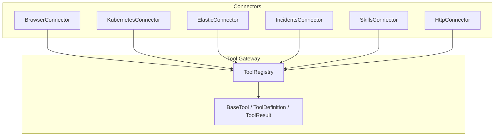
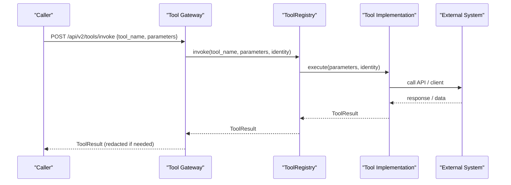
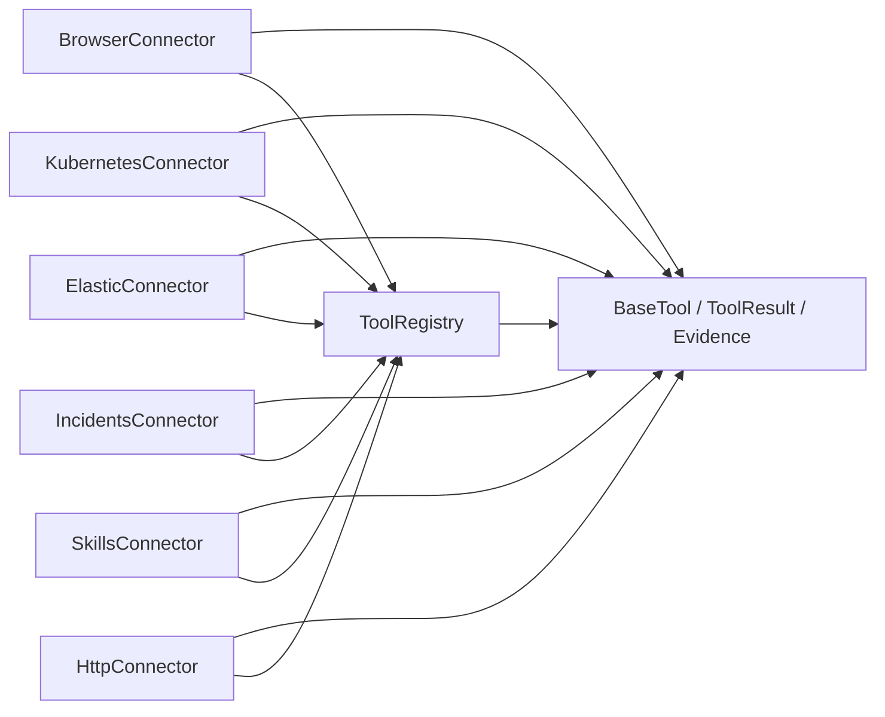

# Built-in Tool Connectors

<cite>
**Referenced Files in This Document**
- [README.md](file://products/tool-gateway/README.md)
- [base.py](file://products/tool-gateway/src/tool_gateway/tools/base.py)
- [registry.py](file://products/tool-gateway/src/tool_gateway/tools/registry.py)
- [browser_connector.py](file://products/tool-gateway/src/tool_gateway/tools/browser_connector.py)
- [k8s_connector.py](file://products/tool-gateway/src/tool_gateway/tools/k8s_connector.py)
- [elastic_connector.py](file://products/tool-gateway/src/tool_gateway/tools/elastic_connector.py)
- [incidents_connector.py](file://products/tool-gateway/src/tool_gateway/tools/incidents_connector.py)
- [skills_connector.py](file://products/tool-gateway/src/tool_gateway/tools/skills_connector.py)
- [http_connector.py](file://products/tool-gateway/src/tool_gateway/tools/http_connector.py)
- [config.py](file://products/tool-gateway/src/tool_gateway/core/config.py)
- [app.py](file://products/tool-gateway/src/tool_gateway/app.py)
- [test_http_connector.py](file://products/tool-gateway/tests/test_http_connector.py)
- [test_browser_connector.py](file://products/tool-gateway/tests/test_browser_connector.py)
- [test_k8s_connector.py](file://products/tool-gateway/tests/test_k8s_connector.py)
- [test_elastic_connector.py](file://products/tool-gateway/tests/test_elastic_connector.py)
</cite>

## Update Summary
**Changes Made**
- Added comprehensive documentation for the new HTTP connector with `http.get` and `http.post` tools
- Updated project structure section to include HTTP connector
- Enhanced architecture overview with HTTP connector integration
- Added detailed HTTP connector component analysis covering security controls, configuration options, and approval system integration
- Updated dependency analysis to include HTTP connector dependencies
- Enhanced troubleshooting guide with HTTP-specific error codes and issues

## Table of Contents
1. [Introduction](#introduction)
2. [Project Structure](#project-structure)
3. [Core Components](#core-components)
4. [Architecture Overview](#architecture-overview)
5. [Detailed Component Analysis](#detailed-component-analysis)
6. [Dependency Analysis](#dependency-analysis)
7. [Performance Considerations](#performance-considerations)
8. [Troubleshooting Guide](#troubleshooting-guide)
9. [Conclusion](#conclusion)

## Introduction
This document describes all built-in tool connectors provided by the Tool Gateway and how to use them safely. The Tool Gateway exposes a uniform tool invocation surface with standardized metadata, evidence envelopes, structured errors, and policy enforcement. It ships connectors for:
- Browser automation (web.*)
- Kubernetes cluster access
- Elasticsearch observability queries
- Incidents service queries
- Skills hub queries
- **HTTP service health checking** (http.get, http.post)

Each connector registers tools with a registry, validates parameters, enforces risk tiers, and returns consistent results that include an evidence envelope.

## Project Structure
The Tool Gateway organizes connectors under a common base framework:
- Base abstractions define tool definitions, results, and evidence.
- A registry holds registered tools and dispatches invocations with risk-tier admission.
- Each connector implements one or more tools and integrates with external systems.

**Diagram sources**
- [base.py:15-123](file://products/tool-gateway/src/tool_gateway/tools/base.py#L15-L123)
- [registry.py:18-89](file://products/tool-gateway/src/tool_gateway/tools/registry.py#L18-L89)
- [browser_connector.py:315-399](file://products/tool-gateway/src/tool_gateway/tools/browser_connector.py#L315-L399)
- [k8s_connector.py:41-92](file://products/tool-gateway/src/tool_gateway/tools/k8s_connector.py#L41-L92)
- [elastic_connector.py:40-103](file://products/tool-gateway/src/tool_gateway/tools/elastic_connector.py#L40-L103)
- [incidents_connector.py:68-84](file://products/tool-gateway/src/tool_gateway/tools/incidents_connector.py#L68-84)
- [skills_connector.py:71-88](file://products/tool-gateway/src/tool_gateway/tools/skills_connector.py#L71-L88)
- [http_connector.py:350-359](file://products/tool-gateway/src/tool_gateway/tools/http_connector.py#L350-L359)

**Section sources**
- [README.md:1-64](file://products/tool-gateway/README.md#L1-L64)
- [base.py:15-123](file://products/tool-gateway/src/tool_gateway/tools/base.py#L15-L123)
- [registry.py:18-89](file://products/tool-gateway/src/tool_gateway/tools/registry.py#L18-L89)

## Core Components
- ToolDefinition: declares name, description, risk_level, category, and parameter schema.
- ToolResult: standard envelope with status, data, evidence, and optional error.
- Evidence: includes execution time, duration, risk level, and source system.
- ToolRegistry: stores tools, enforces risk-tier registration, and invokes tools safely.

Risk tiers:
- read: requires tools:invoke.
- write/admin: additionally require tools:mutate and cannot be auto-approved by the agent.

**Section sources**
- [base.py:15-123](file://products/tool-gateway/src/tool_gateway/tools/base.py#L15-L123)
- [registry.py:18-89](file://products/tool-gateway/src/tool_gateway/tools/registry.py#L18-L89)

## Architecture Overview
The gateway exposes tool discovery and invocation endpoints. Each connector registers tools at startup when enabled via environment flags. Invocations are authenticated and authorized before being dispatched to the appropriate tool implementation. Results are redacted where necessary and accompanied by evidence.

**Diagram sources**
- [registry.py:65-89](file://products/tool-gateway/src/tool_gateway/tools/registry.py#L65-L89)
- [base.py:35-86](file://products/tool-gateway/src/tool_gateway/tools/base.py#L35-L86)
- [README.md:50-64](file://products/tool-gateway/README.md#L50-L64)

## Detailed Component Analysis

### Browser Connector
Capabilities:
- Read tier: web.navigate, web.snapshot, web.screenshot, web.fill_credential, web.extract, web.wait_for, web.hover, web.scroll, web.switch_frame
- Write tier: web.click, web.type, web.select, web.press_key, web.upload_file, web.evaluate

Key behaviors:
- Origin allowlist: navigation and captures are denied unless the origin is allowed; off-origin pages are halted for safety.
- Flow binding: passing skill_id binds a flow validated against skills-hub (web_target/risk_class), enforcing step budgets and deviation guards.
- Credential sets: login values resolve from a secret-mounted file and are masked in snapshots and results.
- Session pool: per-chat-session browser contexts with TTL and eviction; interactions serialized per session.

Configuration highlights:
- Enable connector: GATEWAY_BROWSER_ENABLED
- CDP endpoint: GATEWAY_BROWSER_CDP_ENDPOINT
- Allowlist: GATEWAY_BROWSER_ALLOW_ORIGINS
- Session limits: GATEWAY_BROWSER_SESSION_TTL, GATEWAY_BROWSER_MAX_SESSIONS
- Step budget: GATEWAY_BROWSER_FLOW_MAX_STEPS
- Credentials: GATEWAY_BROWSER_CREDENTIAL_SETS
- Screenshot cap: GATEWAY_BROWSER_SCREENSHOT_MAX_BYTES

Usage patterns:
- Navigate to an allowed URL; optionally bind a skill flow.
- Take snapshots/screenshots to inspect state.
- Interact using refs from snapshots for click/type/select/press_key/upload_file.
- Evaluate JavaScript expressions (write-tier, requires approval).
- Fill credentials from configured sets without exposing secrets in outputs.

Security considerations:
- All origins checked server-side; redirects re-checked on capture.
- Secret query parameters and credential fields are masked in results and evidence.
- Write-tier actions require mutation permission and may park confirmation cards upstream.

Practical example outline:
- Invoke web.navigate with url and optional skill_id.
- Use web.snapshot to obtain element refs.
- Use web.click or web.type with ref to interact.
- Use web.fill_credential to fill username/password from a named set.
- Use web.evaluate only when approved; it takes expression only.

Common responses:
- success with data and evidence
- denied with code such as BROWSER_ORIGIN_NOT_ALLOWED, BROWSER_FLOW_ORIGIN_DEVIATED, BROWSER_FLOW_EXHAUSTED
- error with codes like BROWSER_REF_UNKNOWN, BROWSER_NOT_READY, BROWSER_NO_IDENTITY

**Section sources**
- [browser_connector.py:1-149](file://products/tool-gateway/src/tool_gateway/tools/browser_connector.py#L1-L149)
- [browser_connector.py:315-399](file://products/tool-gateway/src/tool_gateway/tools/browser_connector.py#L315-L399)
- [browser_connector.py:730-800](file://products/tool-gateway/src/tool_gateway/tools/browser_connector.py#L730-L800)
- [test_browser_connector.py:1-200](file://products/tool-gateway/tests/test_browser_connector.py#L1-L200)
- [README.md:125-140](file://products/tool-gateway/README.md#L125-L140)

### Kubernetes Connector
Capabilities:
- k8s.list_pods: list pods with optional label selector
- k8s.get_pod: get detailed pod status
- k8s.get_events: list events with optional field selector
- k8s.get_pod_logs: retrieve recent logs with tail_lines
- k8s.delete_pod: bounded mutating action to delete a single pod (requires mutation permission)

Configuration highlights:
- Enable connector: GATEWAY_K8S_ENABLED
- Default namespace: GATEWAY_K8S_NAMESPACE
- Mutation gate: GATEWAY_MUTATING_TOOLS_ENABLED

Usage patterns:
- List pods filtered by labels.
- Get a specific pod's details and conditions.
- Query events for troubleshooting.
- Retrieve logs with controlled tail size.
- Delete a pod to trigger controller-managed restarts (write-tier).

RBAC integration:
- Uses in-cluster config or kubeconfig.
- Pod deletion requires opt-in RBAC for the service account; failures map to structured codes (e.g., POD_NOT_FOUND, K8S_PERMISSION_DENIED).

Practical example outline:
- Call k8s.list_pods with namespace and label_selector.
- Call k8s.get_pod with name and namespace.
- Call k8s.get_events with namespace and field_selector.
- Call k8s.get_pod_logs with name, optional container, and tail_lines.
- Call k8s.delete_pod with name and namespace (requires mutation permission).

Common responses:
- success with data and evidence
- error with codes K8S_NOT_CONFIGURED, INVALID_PARAMETERS, K8S_API_ERROR, POD_NOT_FOUND, K8S_PERMISSION_DENIED

**Section sources**
- [k8s_connector.py:1-16](file://products/tool-gateway/src/tool_gateway/tools/k8s_connector.py#L1-L16)
- [k8s_connector.py:41-92](file://products/tool-gateway/src/tool_gateway/tools/k8s_connector.py#L41-L92)
- [k8s_connector.py:231-518](file://products/tool-gateway/src/tool_gateway/tools/k8s_connector.py#L231-L518)
- [test_k8s_connector.py:15-74](file://products/tool-gateway/tests/test_k8s_connector.py#L15-L74)
- [test_k8s_connector.py:84-200](file://products/tool-gateway/tests/test_k8s_connector.py#L84-L200)
- [README.md:83-88](file://products/tool-gateway/README.md#L83-L88)

### Elasticsearch Connector
Capabilities:
- elastic.search_logs: search logs using KQL or simple text with index, time range, and result limits
- elastic.get_service_health: aggregated health metrics for a service (request count, error count, error rate, avg latency)
- elastic.get_active_alerts: list active alerts with optional severity filter

Configuration highlights:
- Enable connector: GATEWAY_ELASTIC_ENABLED
- Cluster URL: GATEWAY_ELASTIC_URL
- Authentication: GATEWAY_ELASTIC_API_KEY or GATEWAY_ELASTIC_USERNAME/GATEWAY_ELASTIC_PASSWORD
- TLS verification: GATEWAY_ELASTIC_VERIFY_TLS
- Alerts index pattern: GATEWAY_ELASTIC_ALERTS_INDEX

Usage patterns:
- Search logs within a bounded time window and result limit.
- Compute service health metrics over a time window.
- List active alerts filtered by severity.

Practical example outline:
- Call elastic.search_logs with query, index, time_range_minutes, max_results.
- Call elastic.get_service_health with service_name and time_range_minutes.
- Call elastic.get_active_alerts with optional severity and max_results.

Common responses:
- success with data and evidence
- error with codes ELASTIC_NOT_CONFIGURED, INVALID_PARAMETERS, ELASTIC_CONNECTION_ERROR

**Section sources**
- [elastic_connector.py:1-12](file://products/tool-gateway/src/tool_gateway/tools/elastic_connector.py#L1-L12)
- [elastic_connector.py:40-103](file://products/tool-gateway/src/tool_gateway/tools/elastic_connector.py#L40-L103)
- [elastic_connector.py:287-535](file://products/tool-gateway/src/tool_gateway/tools/elastic_connector.py#L287-L535)
- [test_elastic_connector.py:15-66](file://products/tool-gateway/tests/test_elastic_connector.py#L15-L66)
- [test_elastic_connector.py:68-200](file://products/tool-gateway/tests/test_elastic_connector.py#L68-L200)
- [README.md:95-106](file://products/tool-gateway/README.md#L95-L106)

### Incidents Connector
Capabilities:
- incidents.list: list tracked incidents with filters (status, severity, source) and pagination
- incidents.get: fetch full incident record including triage report and connector outcomes

Configuration highlights:
- Enable connector: GATEWAY_INCIDENTS_SERVICE_URL
- Client credentials: GATEWAY_INCIDENTS_CLIENT_ID, GATEWAY_INCIDENTS_CLIENT_SECRET

Usage patterns:
- List incidents with optional filters and pagination.
- Retrieve a specific incident by id.

Data transformation:
- List entries project a stable subset of fields suitable for portal representation.
- Errors from upstream are mapped to structured codes (INCIDENT_NOT_FOUND, UPSTREAM_ERROR).

Practical example outline:
- Call incidents.list with status/severity/source and limit/offset.
- Call incidents.get with incident_id.

Common responses:
- success with data and evidence
- error with codes INVALID_PARAMETERS, INCIDENT_NOT_FOUND, UPSTREAM_ERROR, TOOL_EXECUTION_ERROR

**Section sources**
- [incidents_connector.py:1-13](file://products/tool-gateway/src/tool_gateway/tools/incidents_connector.py#L1-L13)
- [incidents_connector.py:68-149](file://products/tool-gateway/src/tool_gateway/tools/incidents_connector.py#L68-L149)
- [incidents_connector.py:154-339](file://products/tool-gateway/src/tool_gateway/tools/incidents_connector.py#L154-L339)
- [README.md:119-124](file://products/tool-gateway/README.md#L119-L124)

### Skills Connector
Capabilities:
- skills.search: search team-owned operational skills and runbooks
- skills.get: fetch full body of one skill by id
- skills.list: list skills summaries with filtering and pagination

Configuration highlights:
- Enable connector: GATEWAY_SKILLS_SERVICE_URL
- Client credentials: GATEWAY_SKILLS_CLIENT_ID, GATEWAY_SKILLS_CLIENT_SECRET

Usage patterns:
- Search skills with free-text query and optional source/tag filters.
- Retrieve a skill by namespaced id.
- List skills with source/tag filters and pagination.

Data transformation:
- Search matches project a stable subset of fields.
- List entries project summaries without bodies.

Practical example outline:
- Call skills.search with query, optional source/tag, and limit.
- Call skills.get with skill_id.
- Call skills.list with optional source/tag, limit, offset.

Common responses:
- success with data and evidence
- error with codes SKILL_NOT_FOUND, UPSTREAM_ERROR, TOOL_EXECUTION_ERROR, INVALID_PARAMETERS

**Section sources**
- [skills_connector.py:1-12](file://products/tool-gateway/src/tool_gateway/tools/skills_connector.py#L1-L12)
- [skills_connector.py:71-149](file://products/tool-gateway/src/tool_gateway/tools/skills_connector.py#L71-L149)
- [skills_connector.py:154-419](file://products/tool-gateway/src/tool_gateway/tools/skills_connector.py#L154-L419)
- [README.md:113-118](file://products/tool-gateway/README.md#L113-L118)

### HTTP Connector
**New** - Service health checking and API interaction capabilities:

Capabilities:
- **Read tier**: `http.get` - Fetch URLs over HTTP/HTTPS for health checks and API inspection
- **Write tier**: `http.post` - POST JSON payloads to allowlisted origins for bounded mutations

Key security features:
- **Server-side origin allowlist**: Deny-by-default with explicit origin authorization
- **Redirect protection**: GET follows redirects within allowlist (max 3 hops); POST never follows redirects
- **Credential management**: Reference-based authentication via `credential_set` parameter only
- **Body bounds**: POST requests limited to depth ≤ 2, ≤ 32 keys, and configurable byte limits
- **Secret masking**: Query parameters with sensitive names are automatically masked in responses
- **Header projection**: Only safe headers are returned (content-type, content-length, location, server, date, cache-control)

Configuration highlights:
- Enable connector: `GATEWAY_HTTP_ENABLED`
- Origin allowlist: `GATEWAY_HTTP_ALLOW_ORIGINS` (comma-separated origins)
- Timeout: `GATEWAY_HTTP_TIMEOUT_MS` (default 10000ms, max 30000ms)
- Response size: `GATEWAY_HTTP_MAX_RESPONSE_BYTES` (default 65536 bytes)
- Request size: `GATEWAY_HTTP_MAX_REQUEST_BYTES` (default 4096 bytes)
- Credentials: `GATEWAY_HTTP_CREDENTIAL_SETS` (path to credential file)

Usage patterns:
- Health checking: `http.get` to verify service availability and response format
- API inspection: `http.get` to examine API responses and status codes
- Bounded mutations: `http.post` with small JSON payloads for controlled state changes
- Authenticated requests: Use `credential_set` parameter for Basic authentication

Security considerations:
- Model-supplied URLs are validated server-side before any network connection
- Loopback, link-local, and multicast addresses are always refused
- URL userinfo (user:password@host) is rejected to prevent literal secrets
- POST URLs cannot contain secret-bearing query parameters
- Non-2xx POST responses include `mutation_confirmed: false` marker
- All credentials resolved from reference-only configuration files

Practical example outline:
- Call `http.get` with URL to check service health and response format
- Call `http.get` with `credential_set` for authenticated service checks
- Call `http.post` with URL and small JSON body for bounded mutations
- Handle structured error responses for validation failures and network issues

Common responses:
- success with data containing status, headers, body, and timing information
- denied with code `HTTP_ORIGIN_NOT_ALLOWED` for unauthorized origins
- error with codes: `INVALID_PARAMETERS`, `HTTP_SCHEME_NOT_ALLOWED`, `HTTP_REDIRECT_NOT_ALLOWED`, `HTTP_TIMEOUT`, `HTTP_BODY_TOO_LARGE`, `CREDENTIAL_SET_NOT_FOUND`, `TOOL_EXECUTION_ERROR`, `UPSTREAM_ERROR`

**Section sources**
- [http_connector.py:1-699](file://products/tool-gateway/src/tool_gateway/tools/http_connector.py#L1-L699)
- [test_http_connector.py:1-789](file://products/tool-gateway/tests/test_http_connector.py#L1-L789)
- [config.py:25-90](file://products/tool-gateway/src/tool_gateway/core/config.py#L25-L90)
- [app.py:97-112](file://products/tool-gateway/src/tool_gateway/app.py#L97-L112)

## Dependency Analysis
Connectors depend on:
- Base abstractions for tool definitions, results, and evidence.
- Registry for safe dispatch and risk-tier admission.
- External clients:
  - Kubernetes client for cluster operations
  - Elasticsearch client for observability queries
  - HTTPX for skills, incidents, and HTTP services
  - Playwright via CDP for browser automation

**Diagram sources**
- [base.py:15-123](file://products/tool-gateway/src/tool_gateway/tools/base.py#L15-L123)
- [registry.py:18-89](file://products/tool-gateway/src/tool_gateway/tools/registry.py#L18-L89)
- [browser_connector.py:315-399](file://products/tool-gateway/src/tool_gateway/tools/browser_connector.py#L315-L399)
- [k8s_connector.py:41-92](file://products/tool-gateway/src/tool_gateway/tools/k8s_connector.py#L41-L92)
- [elastic_connector.py:40-103](file://products/tool-gateway/src/tool_gateway/tools/elastic_connector.py#L40-L103)
- [incidents_connector.py:68-84](file://products/tool-gateway/src/tool_gateway/tools/incidents_connector.py#L68-L84)
- [skills_connector.py:71-88](file://products/tool-gateway/src/tool_gateway/tools/skills_connector.py#L71-L88)
- [http_connector.py:350-359](file://products/tool-gateway/src/tool_gateway/tools/http_connector.py#L350-L359)

**Section sources**
- [base.py:15-123](file://products/tool-gateway/src/tool_gateway/tools/base.py#L15-L123)
- [registry.py:18-89](file://products/tool-gateway/src/tool_gateway/tools/registry.py#L18-L89)

## Performance Considerations
- Browser sessions: idle TTL and max sessions prevent resource leaks; screenshots compressed to fit byte caps.
- Kubernetes logs: tail_lines clamped to a maximum to avoid large payloads.
- Elastic queries: time ranges and result counts are bounded to protect performance.
- HTTP requests: timeouts enforced, response sizes capped, redirect chains limited to 3 hops.
- Asynchronous execution: connector sync calls run in executors to avoid blocking the event loop.

## Troubleshooting Guide
Common issues and resolutions:
- Not configured:
  - Kubernetes: ensure in-cluster config or kubeconfig is available; otherwise tools return K8S_NOT_CONFIGURED.
  - Elastic: ensure URL and authentication are set; otherwise tools return ELASTIC_NOT_CONFIGURED.
  - Incidents/Skills: ensure service URLs and client credentials are configured; otherwise tools return TOOL_EXECUTION_ERROR on transport failure.
  - **HTTP connector**: ensure `GATEWAY_HTTP_ENABLED=true` and `GATEWAY_HTTP_ALLOW_ORIGINS` contains target origins.
- Permission denied:
  - Kubernetes delete: missing RBAC yields K8S_PERMISSION_DENIED; grant pod-delete permissions to the service account.
  - **HTTP post**: requires `GATEWAY_MUTATING_TOOLS_ENABLED=true` and `tools:mutate` permission.
- Origin not allowed (browser/HTTP):
  - Ensure target origin is on the allowlist; navigate to an allowed URL first.
  - For HTTP: origins must match scheme + host + port exactly.
- Invalid parameters:
  - Validate required fields and enums; connectors return INVALID_PARAMETERS with descriptive messages.
  - **HTTP connector**: check URL format, body size limits, and timeout values.
- Redaction overflow:
  - If too much output would be redacted, the gateway withholds output with REDACTION_OVERFLOW; reduce sensitive content or adjust thresholds.
- **HTTP-specific issues**:
  - `HTTP_SCHEME_NOT_ALLOWED`: Only http/https schemes supported
  - `HTTP_ORIGIN_NOT_ALLOWED`: Target origin not in allowlist
  - `HTTP_REDIRECT_NOT_ALLOWED`: Too many redirects or redirect to unauthorized origin
  - `HTTP_BODY_TOO_LARGE`: POST body exceeds configured limits
  - `CREDENTIAL_SET_NOT_FOUND`: Named credential set not found in configuration

**Section sources**
- [k8s_connector.py:474-518](file://products/tool-gateway/src/tool_gateway/tools/k8s_connector.py#L474-L518)
- [elastic_connector.py:328-379](file://products/tool-gateway/src/tool_gateway/tools/elastic_connector.py#L328-L379)
- [incidents_connector.py:208-272](file://products/tool-gateway/src/tool_gateway/tools/incidents_connector.py#L208-L272)
- [skills_connector.py:198-245](file://products/tool-gateway/src/tool_gateway/tools/skills_connector.py#L198-L245)
- [browser_connector.py:765-800](file://products/tool-gateway/src/tool_gateway/tools/browser_connector.py#L765-L800)
- [http_connector.py:471-491](file://products/tool-gateway/src/tool_gateway/tools/http_connector.py#L471-L491)
- [README.md:89-92](file://products/tool-gateway/README.md#L89-L92)

## Conclusion
The Tool Gateway provides a secure, standardized interface to multiple backends through typed tools with consistent metadata, evidence, and error handling. Use the connectors to automate web checks, observe clusters, query observability data, perform HTTP service health checks, and collaborate via incidents and skills. Always configure connectors explicitly, respect risk tiers, and handle structured errors returned by each tool. The new HTTP connector enables direct API health checking and bounded mutations with robust security controls, making it ideal for service monitoring and controlled administrative operations.