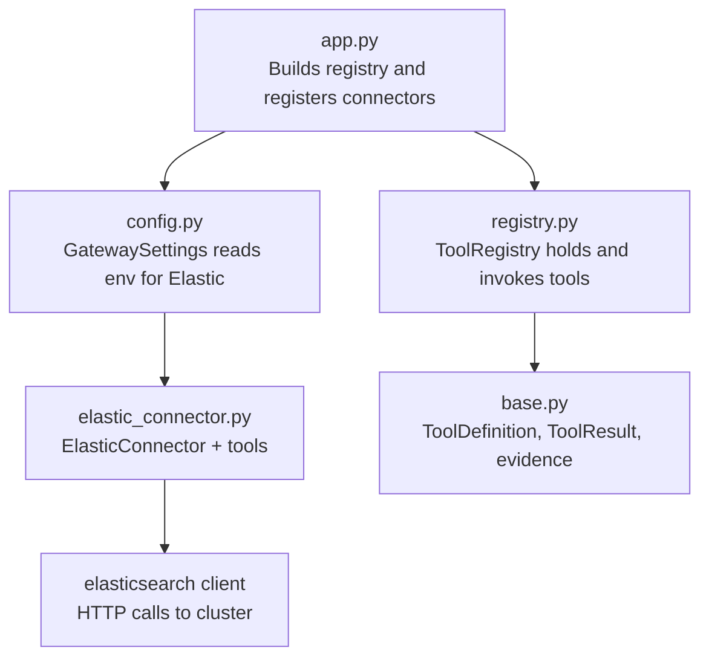
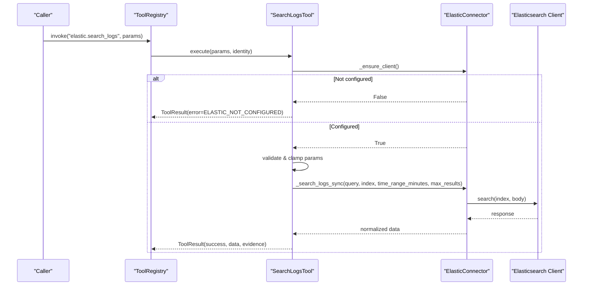
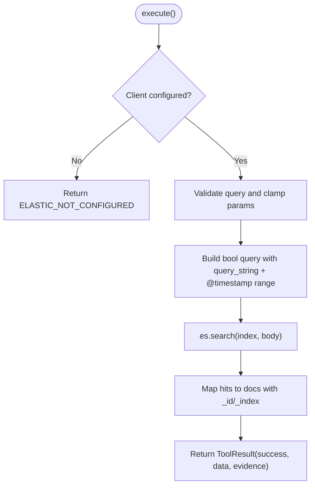
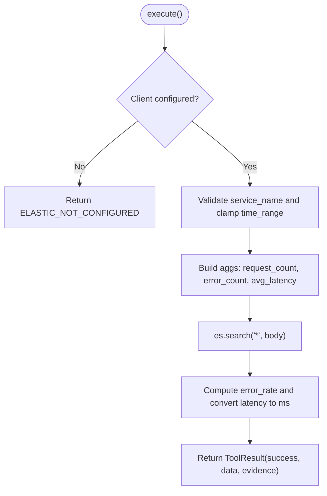
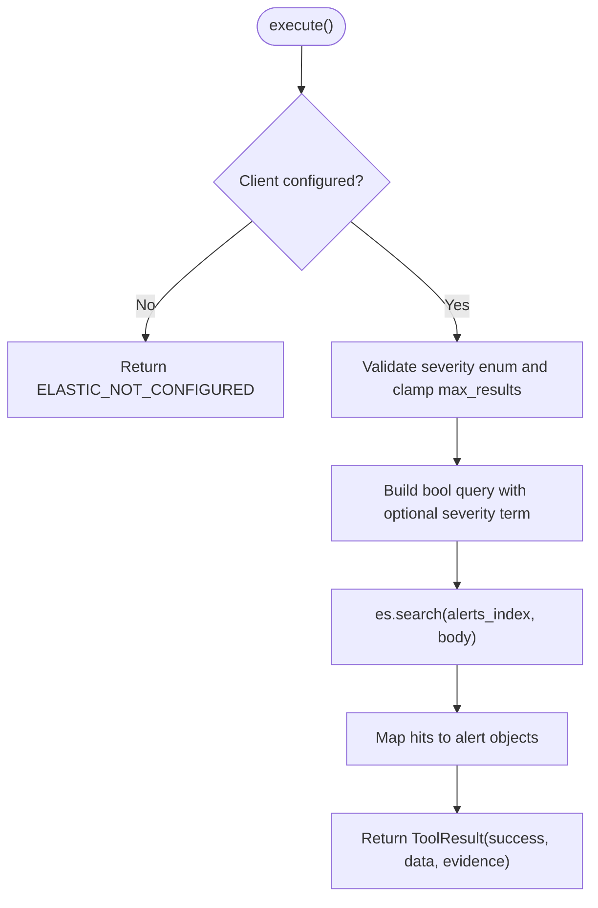
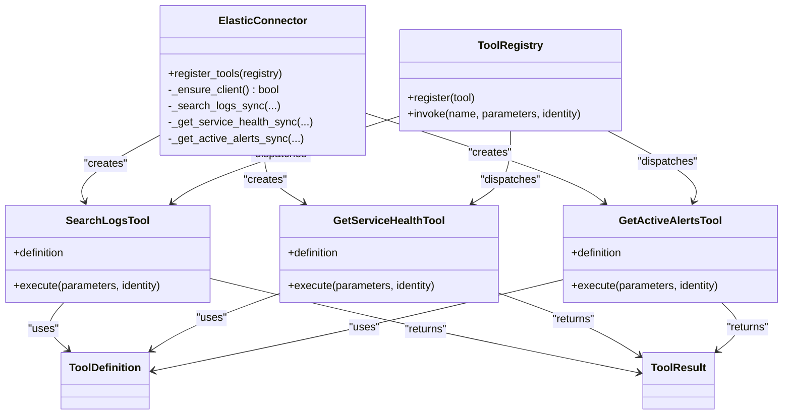

# Elasticsearch Connector

<cite>
**Referenced Files in This Document**
- [elastic_connector.py](file://products/tool-gateway/src/tool_gateway/tools/elastic_connector.py)
- [base.py](file://products/tool-gateway/src/tool_gateway/tools/base.py)
- [registry.py](file://products/tool-gateway/src/tool_gateway/tools/registry.py)
- [config.py](file://products/tool-gateway/src/tool_gateway/core/config.py)
- [app.py](file://products/tool-gateway/src/tool_gateway/app.py)
- [test_elastic_connector.py](file://products/tool-gateway/tests/test_elastic_connector.py)
</cite>

## Table of Contents
1. Introduction
2. Project Structure
3. Core Components
4. Architecture Overview
5. Detailed Component Analysis
6. Dependency Analysis
7. Performance Considerations
8. Troubleshooting Guide
9. Conclusion

## Introduction
This document describes the Elasticsearch Connector that provides read-only search and analytics capabilities over log and metrics data via three tools:
- elastic.search_logs
- elastic.get_service_health
- elastic.get_active_alerts

The connector is optional, enabled by configuration, and integrates with the tool gateway’s registry to expose these tools for invocation. It uses the official elasticsearch Python client and supports API key or basic authentication, with TLS verification configurable.

## Project Structure
The Elasticsearch Connector lives under the tool-gateway product and is wired into the application at startup when enabled. The relevant pieces are:
- Tool definitions and execution logic in the connector module
- Base abstractions for tool metadata and results
- Registry for tool registration and dispatch
- Gateway settings for enabling and configuring the connector
- Application bootstrap that conditionally registers the connector

**Diagram sources**
- [app.py:19-53](file://products/tool-gateway/src/tool_gateway/app.py#L19-L53)
- [config.py:32-127](file://products/tool-gateway/src/tool_gateway/core/config.py#L32-L127)
- [registry.py:18-89](file://products/tool-gateway/src/tool_gateway/tools/registry.py#L18-L89)
- [elastic_connector.py:40-103](file://products/tool-gateway/src/tool_gateway/tools/elastic_connector.py#L40-L103)
- [base.py:15-86](file://products/tool-gateway/src/tool_gateway/tools/base.py#L15-L86)

**Section sources**
- [app.py:19-53](file://products/tool-gateway/src/tool_gateway/app.py#L19-L53)
- [config.py:32-127](file://products/tool-gateway/src/tool_gateway/core/config.py#L32-L127)
- [registry.py:18-89](file://products/tool-gateway/src/tool_gateway/tools/registry.py#L18-L89)
- [elastic_connector.py:40-103](file://products/tool-gateway/src/tool_gateway/tools/elastic_connector.py#L40-L103)
- [base.py:15-86](file://products/tool-gateway/src/tool_gateway/tools/base.py#L15-L86)

## Core Components
- ElasticConnector: Manages lazy client initialization, authentication, TLS settings, and exposes sync operations used by tools.
- SearchLogsTool: Executes a time-bounded log search against an index pattern and returns hits with metadata.
- GetServiceHealthTool: Computes aggregated health metrics (request count, error count/rate, average latency) for a service name.
- GetActiveAlertsTool: Lists active alerts from a configured alerts index, optionally filtered by severity.
- Tool base classes: Provide standardized tool metadata, result envelopes, and evidence generation.

Key behaviors:
- Tools are read-only and tagged as observability category.
- Parameters are validated and clamped to safe ranges.
- Errors are returned as structured ToolResult envelopes with consistent codes.

**Section sources**
- [elastic_connector.py:40-103](file://products/tool-gateway/src/tool_gateway/tools/elastic_connector.py#L40-L103)
- [elastic_connector.py:287-379](file://products/tool-gateway/src/tool_gateway/tools/elastic_connector.py#L287-L379)
- [elastic_connector.py:382-456](file://products/tool-gateway/src/tool_gateway/tools/elastic_connector.py#L382-L456)
- [elastic_connector.py:459-534](file://products/tool-gateway/src/tool_gateway/tools/elastic_connector.py#L459-L534)
- [base.py:15-86](file://products/tool-gateway/src/tool_gateway/tools/base.py#L15-L86)

## Architecture Overview
The connector is registered only when GATEWAY_ELASTIC_ENABLED is true. On first use, the Elasticsearch client is lazily created and connectivity is verified. Each tool validates parameters, runs synchronous work off the event loop, and returns a ToolResult with evidence.

**Diagram sources**
- [app.py:41-53](file://products/tool-gateway/src/tool_gateway/app.py#L41-L53)
- [registry.py:65-89](file://products/tool-gateway/src/tool_gateway/tools/registry.py#L65-L89)
- [elastic_connector.py:61-96](file://products/tool-gateway/src/tool_gateway/tools/elastic_connector.py#L61-L96)
- [elastic_connector.py:106-149](file://products/tool-gateway/src/tool_gateway/tools/elastic_connector.py#L106-L149)
- [elastic_connector.py:328-379](file://products/tool-gateway/src/tool_gateway/tools/elastic_connector.py#L328-L379)

## Detailed Component Analysis

### Connection Configuration
- Enablement: GATEWAY_ELASTIC_ENABLED toggles connector registration.
- Cluster endpoint: GATEWAY_ELASTIC_URL sets the single host list passed to the client.
- Authentication:
  - Preferred: GATEWAY_ELASTIC_API_KEY
  - Fallback: GATEWAY_ELASTIC_USERNAME and GATEWAY_ELASTIC_PASSWORD
- TLS: GATEWAY_ELASTIC_VERIFY_TLS controls certificate verification; disabled when set to false.
- Alerts index: GATEWAY_ELASTIC_ALERTS_INDEX selects the index pattern for alert queries.

Configuration is loaded into GatewaySettings and consumed when constructing ElasticConnector during app startup.

**Section sources**
- [config.py:47-53](file://products/tool-gateway/src/tool_gateway/core/config.py#L47-L53)
- [config.py:113-127](file://products/tool-gateway/src/tool_gateway/core/config.py#L113-L127)
- [app.py:41-53](file://products/tool-gateway/src/tool_gateway/app.py#L41-L53)
- [elastic_connector.py:61-96](file://products/tool-gateway/src/tool_gateway/tools/elastic_connector.py#L61-L96)

### Tools and Query Execution

#### elastic.search_logs
- Purpose: Search logs using KQL or simple text within a bounded time window.
- Parameters:
  - query (required): KQL or text query
  - index (optional, default "*"): Index pattern
  - time_range_minutes (optional, default 15, max 1440): Look-back window
  - max_results (optional, default 50, max 200): Result cap
- Behavior:
  - Builds a bool query combining query_string and @timestamp range.
  - Sorts by @timestamp descending.
  - Returns hits with _id and _index attached, plus total and metadata.
- Pagination:
  - Uses size to limit results; no scroll or search_after support is implemented.
- Response format:
  - data.hits: array of documents with _id and _index
  - data.total: total matching count
  - data.query, data.index, data.time_range_minutes

**Diagram sources**
- [elastic_connector.py:106-149](file://products/tool-gateway/src/tool_gateway/tools/elastic_connector.py#L106-L149)
- [elastic_connector.py:328-379](file://products/tool-gateway/src/tool_gateway/tools/elastic_connector.py#L328-L379)

**Section sources**
- [elastic_connector.py:287-379](file://products/tool-gateway/src/tool_gateway/tools/elastic_connector.py#L287-L379)

#### elastic.get_service_health
- Purpose: Aggregate health metrics for a service identified by service.name.
- Parameters:
  - service_name (required)
  - time_range_minutes (optional, default 15, max 1440)
- Behavior:
  - Searches across all indices with term on service.name and @timestamp range.
  - Aggregations: value_count on _id for request_count, filter-based error_count, avg on event.duration for latency.
  - Converts nanoseconds to milliseconds and computes error_rate.
- Response format:
  - data.service_name, data.time_range_minutes
  - data.request_count, data.error_count, data.error_rate
  - data.avg_latency_ms (nullable)

**Diagram sources**
- [elastic_connector.py:151-211](file://products/tool-gateway/src/tool_gateway/tools/elastic_connector.py#L151-L211)
- [elastic_connector.py:382-456](file://products/tool-gateway/src/tool_gateway/tools/elastic_connector.py#L382-L456)

**Section sources**
- [elastic_connector.py:382-456](file://products/tool-gateway/src/tool_gateway/tools/elastic_connector.py#L382-L456)

#### elastic.get_active_alerts
- Purpose: List active alerts from a configured alerts index, optionally filtered by severity.
- Parameters:
  - severity (optional, enum: critical, warning, info)
  - max_results (optional, default 50, max 200)
- Behavior:
  - Builds a bool query with optional term on kibana.alert.severity.
  - Sorts by severity ascending then @timestamp descending.
  - Maps source fields to a compact alert object.
- Response format:
  - data.alerts: array of {id, severity, status, rule, message, timestamp}
  - data.total, data.severity_filter

**Diagram sources**
- [elastic_connector.py:213-247](file://products/tool-gateway/src/tool_gateway/tools/elastic_connector.py#L213-L247)
- [elastic_connector.py:459-534](file://products/tool-gateway/src/tool_gateway/tools/elastic_connector.py#L459-L534)

**Section sources**
- [elastic_connector.py:459-534](file://products/tool-gateway/src/tool_gateway/tools/elastic_connector.py#L459-L534)

### Security Measures
- Read-only design: All tools are declared risk_level "read" and category "observability".
- Parameter validation: Required fields enforced; enums validated; numeric parameters clamped to safe bounds.
- Authentication: Supports API key or basic auth; TLS verification configurable.
- Policy integration: Mutating tools are blocked by the registry unless explicitly allowed; this connector does not register mutating tools.
- Sensitive data redaction: Redaction is controlled at the gateway level; the connector itself does not perform field-level redaction.

**Section sources**
- [registry.py:18-55](file://products/tool-gateway/src/tool_gateway/tools/registry.py#L18-L55)
- [elastic_connector.py:287-326](file://products/tool-gateway/src/tool_gateway/tools/elastic_connector.py#L287-L326)
- [elastic_connector.py:382-410](file://products/tool-gateway/src/tool_gateway/tools/elastic_connector.py#L382-L410)
- [elastic_connector.py:459-487](file://products/tool-gateway/src/tool_gateway/tools/elastic_connector.py#L459-L487)
- [config.py:47-53](file://products/tool-gateway/src/tool_gateway/core/config.py#L47-L53)

### Practical Examples
Note: These examples describe how to call each tool through the tool gateway. Replace placeholders with your actual values.

- Search recent logs:
  - Tool: elastic.search_logs
  - Parameters: {"query": "error", "index": "logs-*", "time_range_minutes": 15, "max_results": 50}
  - Expected: Success with hits, total, and metadata.

- Service health summary:
  - Tool: elastic.get_service_health
  - Parameters: {"service_name": "web-api", "time_range_minutes": 15}
  - Expected: Success with request_count, error_count, error_rate, avg_latency_ms.

- Active alerts by severity:
  - Tool: elastic.get_active_alerts
  - Parameters: {"severity": "critical", "max_results": 200}
  - Expected: Success with alerts array and totals.

These patterns are validated by unit tests which assert parameter handling, clamping behavior, and response shapes.

**Section sources**
- [test_elastic_connector.py:80-131](file://products/tool-gateway/tests/test_elastic_connector.py#L80-L131)
- [test_elastic_connector.py:133-178](file://products/tool-gateway/tests/test_elastic_connector.py#L133-L178)
- [test_elastic_connector.py:180-226](file://products/tool-gateway/tests/test_elastic_connector.py#L180-L226)

## Dependency Analysis
- App bootstrap conditionally imports and constructs ElasticConnector based on settings.
- ElasticConnector depends on the elasticsearch package and performs a connectivity check on first use.
- Tools depend on base abstractions for metadata and result envelopes.
- Registry enforces risk-tier admission and dispatches invocations.

**Diagram sources**
- [elastic_connector.py:40-103](file://products/tool-gateway/src/tool_gateway/tools/elastic_connector.py#L40-L103)
- [elastic_connector.py:287-534](file://products/tool-gateway/src/tool_gateway/tools/elastic_connector.py#L287-L534)
- [registry.py:18-89](file://products/tool-gateway/src/tool_gateway/tools/registry.py#L18-L89)
- [base.py:15-86](file://products/tool-gateway/src/tool_gateway/tools/base.py#L15-L86)

**Section sources**
- [app.py:19-53](file://products/tool-gateway/src/tool_gateway/app.py#L19-L53)
- [registry.py:18-89](file://products/tool-gateway/src/tool_gateway/tools/registry.py#L18-L89)
- [elastic_connector.py:40-103](file://products/tool-gateway/src/tool_gateway/tools/elastic_connector.py#L40-L103)

## Performance Considerations
- Time range limits: time_range_minutes is clamped to a maximum of 1440 minutes to prevent overly broad scans.
- Result caps: max_results is clamped to a maximum of 200 per query to bound payload sizes.
- Default windows: Defaults favor short look-back windows and modest result counts for typical usage.
- Async execution: Sync Elasticsearch calls run in an executor to avoid blocking the event loop.
- No connection pooling tuning: The connector uses the elasticsearch client defaults; pool sizing is not exposed.
- No explicit query timeouts: The connector does not set client-level timeouts; rely on network and cluster-side timeouts.

[No sources needed since this section provides general guidance]

## Troubleshooting Guide
Common issues and resolutions:

- ELASTIC_NOT_CONFIGURED
  - Cause: Connector not enabled or missing URL.
  - Resolution: Set GATEWAY_ELASTIC_ENABLED=true and provide GATEWAY_ELASTIC_URL. Verify credentials if using API key or username/password.

- ELASTIC_CONNECTION_ERROR
  - Cause: Network errors, invalid endpoints, TLS misconfiguration, or unreachable cluster.
  - Resolution: Check endpoint reachability, TLS settings (GATEWAY_ELASTIC_VERIFY_TLS), and credentials. Inspect logs for underlying exceptions.

- INVALID_PARAMETERS
  - Cause: Missing required fields or invalid values (e.g., non-integer time_range_minutes, unsupported severity).
  - Resolution: Ensure required parameters are provided and within allowed ranges or enums.

- Unexpectedly large responses
  - Cause: Large max_results or broad queries.
  - Resolution: Reduce max_results and narrow queries with specific terms or tighter time ranges.

- High latency
  - Cause: Broad time ranges or heavy aggregations.
  - Resolution: Use smaller time_range_minutes, target specific indices, and avoid wildcard-heavy queries where possible.

Validation and expected behaviors are covered by unit tests for configuration, parameter clamping, authentication modes, and error paths.

**Section sources**
- [test_elastic_connector.py:15-41](file://products/tool-gateway/tests/test_elastic_connector.py#L15-L41)
- [test_elastic_connector.py:99-131](file://products/tool-gateway/tests/test_elastic_connector.py#L99-L131)
- [test_elastic_connector.py:154-178](file://products/tool-gateway/tests/test_elastic_connector.py#L154-L178)
- [test_elastic_connector.py:205-234](file://products/tool-gateway/tests/test_elastic_connector.py#L205-L234)
- [test_elastic_connector.py:240-290](file://products/tool-gateway/tests/test_elastic_connector.py#L240-L290)

## Conclusion
The Elasticsearch Connector provides a secure, read-only interface to search logs, compute service health metrics, and list active alerts. It integrates cleanly with the tool gateway’s configuration, registry, and policy model. By enforcing parameter bounds, supporting robust authentication, and returning structured results with evidence, it enables reliable observability workflows while maintaining safety and performance.