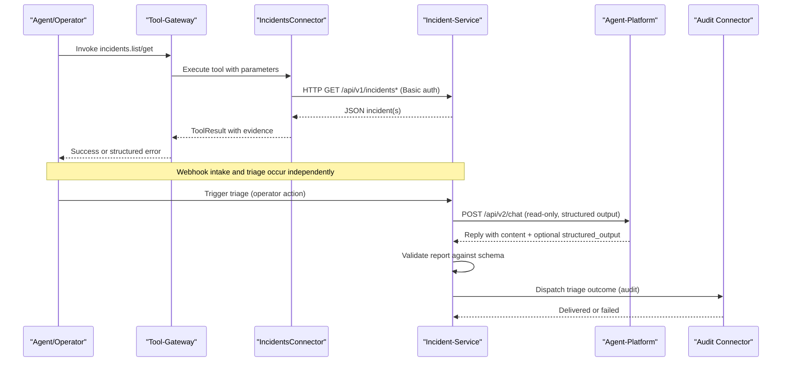
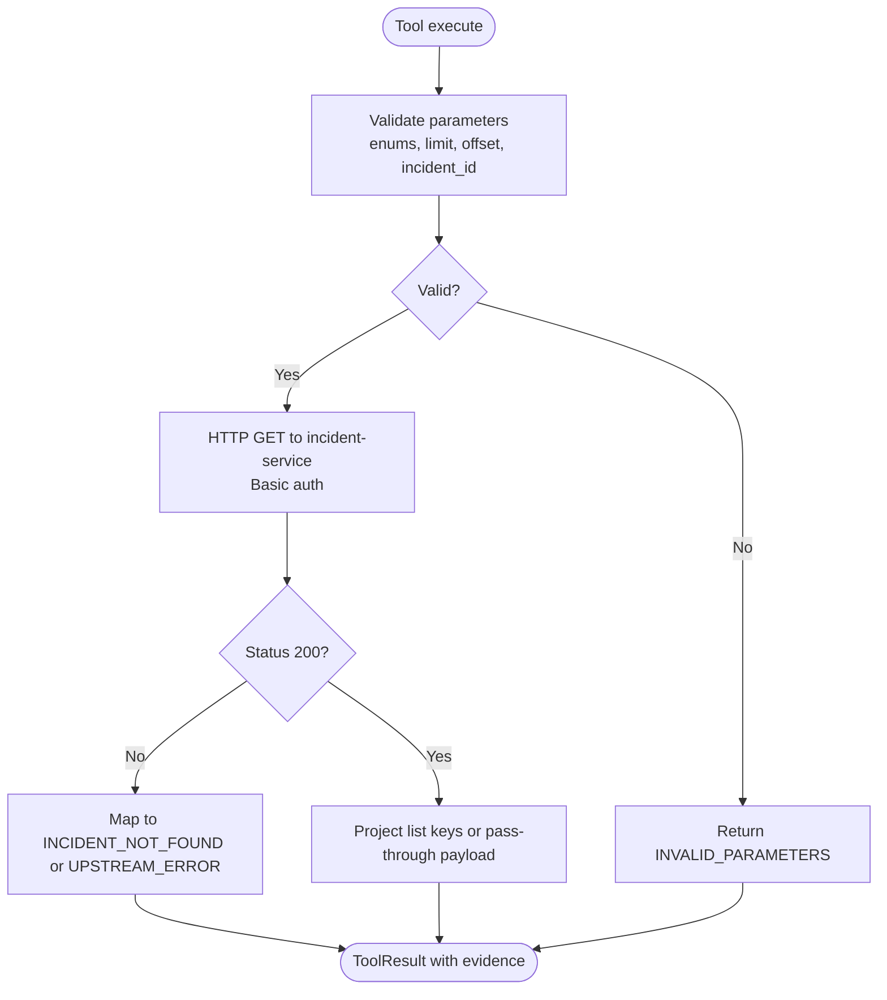
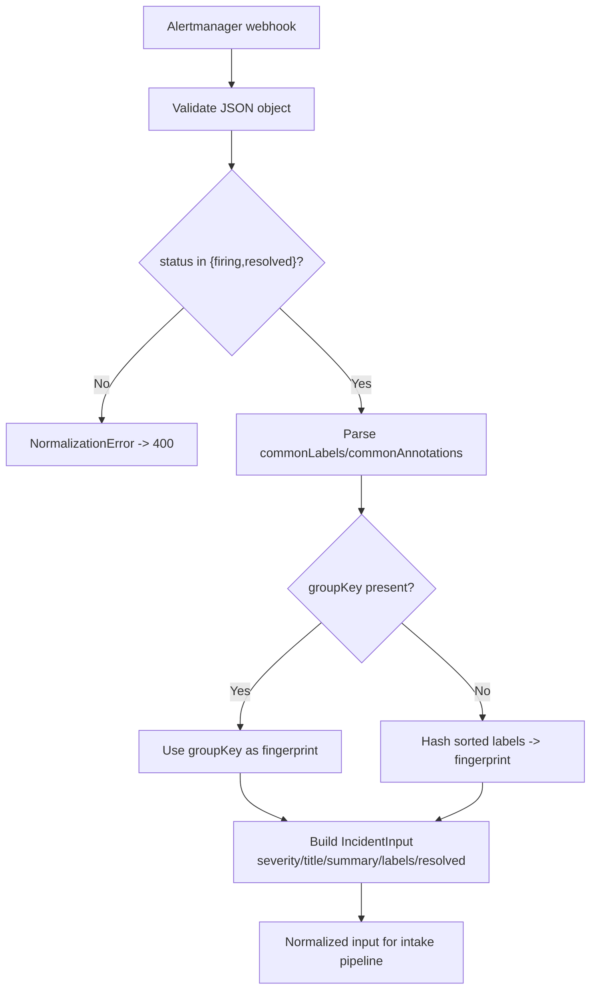
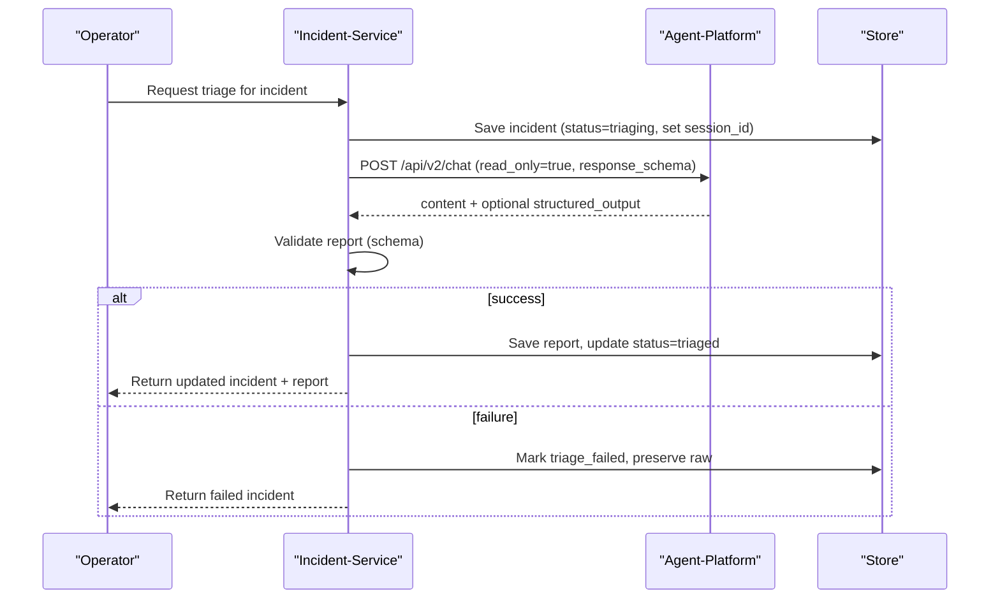
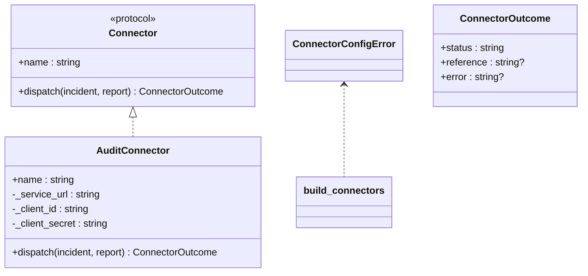
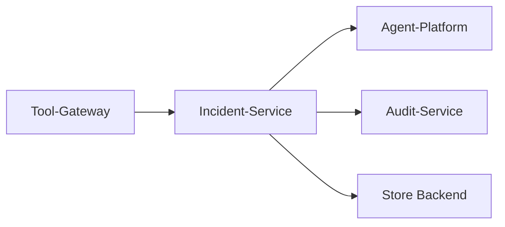

# Incidents Connector

<cite>
**Referenced Files in This Document**
- [incidents_connector.py](file://products/tool-gateway/src/tool_gateway/tools/incidents_connector.py)
- [incident.schema.json](file://shared/shared-contracts/schemas/incident.schema.json)
- [connectors.py](file://products/incident-service/src/incident_service/services/connectors.py)
- [normalization.py](file://products/incident-service/src/incident_service/services/normalization.py)
- [triage.py](file://products/incident-service/src/incident_service/services/triage.py)
- [config.py](file://products/incident-service/src/incident_service/core/config.py)
- [audit_emitter.py](file://products/incident-service/src/incident_service/services/audit_emitter.py)
- [routes/webhooks.py](file://products/incident-service/src/incident_service/api/routes/webhooks.py)
- [routes/incidents.py](file://products/incident-service/src/incident_service/api/routes/incidents.py)
</cite>

## Table of Contents
1. [Introduction](#introduction)
2. [Project Structure](#project-structure)
3. [Core Components](#core-components)
4. [Architecture Overview](#architecture-overview)
5. [Detailed Component Analysis](#detailed-component-analysis)
6. [Dependency Analysis](#dependency-analysis)
7. [Performance Considerations](#performance-considerations)
8. [Troubleshooting Guide](#troubleshooting-guide)
9. [Conclusion](#conclusion)
10. [Appendices](#appendices)

## Introduction
This document describes the Incidents Connector and its role in alert intake, triage, and read-only incident operations within the platform. It explains how tool-gateway exposes read-only incident tools that call incident-service over HTTP using a gateway-held credential, how incident-service normalizes alerts from Alertmanager webhooks, runs operator-initiated agent triage, and dispatches outcomes to configured connectors (currently audit). It also covers authentication, data transformation to the unified incident schema, webhook integration for real-time updates, configuration options, lifecycle examples, error handling, retry behavior, and audit logging.

## Project Structure
The incidents capability spans two services:
- Tool-gateway Incidents Connector: registers read-only tools (list and get) that query incident-service via authenticated HTTP calls.
- Incident Service: provides the canonical incident model, webhook intake, normalization, triage orchestration, connector dispatch, and API routes for queries and webhooks.

```mermaid
graph TB
subgraph "Tool-Gateway"
TG_IC["IncidentsConnector<br/>tools.incidents_connector"]
end
subgraph "Incident-Service"
IS_API["API Routes<br/>api.routes.*"]
IS_NORM["Normalization<br/>services.normalization"]
IS_TRIAGE["Triage Orchestration<br/>services.triage"]
IS_CONN["Connector Framework<br/>services.connectors"]
IS_AUDIT["Audit Connector<br/>services.audit_emitter"]
IS_CFG["Settings<br/>core.config"]
end
TG_IC --> |"HTTP GET /api/v1/incidents*"<br/>Basic auth (client_id, secret)"| IS_API
IS_API --> IS_NORM
IS_API --> IS_TRIAGE
IS_TRIAGE --> IS_CONN
IS_CONN --> IS_AUDIT
IS_CFG -.-> IS_API
IS_CFG -.-> IS_TRIAGE
IS_CFG -.-> IS_CONN
```

**Diagram sources**
- [incidents_connector.py:68-93](file://products/tool-gateway/src/tool_gateway/tools/incidents_connector.py#L68-L93)
- [config.py:72-125](file://products/incident-service/src/incident_service/core/config.py#L72-L125)
- [connectors.py:66-84](file://products/incident-service/src/incident_service/services/connectors.py#L66-L84)
- [audit_emitter.py:30-94](file://products/incident-service/src/incident_service/services/audit_emitter.py#L30-L94)
- [normalization.py:68-109](file://products/incident-service/src/incident_service/services/normalization.py#L68-L109)
- [triage.py:219-276](file://products/incident-service/src/incident_service/services/triage.py#L219-L276)

**Section sources**
- [incidents_connector.py:1-13](file://products/tool-gateway/src/tool_gateway/tools/incidents_connector.py#L1-L13)
- [incident.schema.json:1-95](file://shared/shared-contracts/schemas/incident.schema.json#L1-L95)
- [config.py:72-125](file://products/incident-service/src/incident_service/core/config.py#L72-L125)

## Core Components
- Tool-gateway Incidents Connector:
  - Registers two read-only tools: incidents.list and incidents.get.
  - Uses Basic authentication with a gateway-held client_id and client_secret to call incident-service.
  - Enforces parameter validation and maps upstream errors to structured tool results with evidence envelopes.
- Incident Service:
  - Normalizes Alertmanager v4 webhooks into a canonical IncidentInput.
  - Orchestrates operator-driven triage by calling agent-platform with a dedicated session and validated response schema.
  - Dispatches triage outcomes through configured connectors (audit is built-in).
  - Exposes API routes for querying incidents and receiving webhooks.
- Unified Incident Schema:
  - Canonical envelope defines fields such as incident_id, fingerprint, source, severity, status, title, summary, labels, timestamps, and optional fields like reported_by, session_id, triage_raw, resolved_at.

Key behaviors:
- Read-only tools only; no mutating incident tools are exposed via tool-gateway.
- Webhook intake supports both firing and resolved states, mapping to incident lifecycle transitions.
- Triage failures preserve raw agent output for inspection and mark incidents triage_failed.

**Section sources**
- [incidents_connector.py:68-339](file://products/tool-gateway/src/tool_gateway/tools/incidents_connector.py#L68-L339)
- [normalization.py:68-109](file://products/incident-service/src/incident_service/services/normalization.py#L68-L109)
- [triage.py:290-371](file://products/incident-service/src/incident_service/services/triage.py#L290-L371)
- [incident.schema.json:1-95](file://shared/shared-contracts/schemas/incident.schema.json#L1-L95)

## Architecture Overview
The Incidents Connector integrates three main flows:
- Query flow: tool-gateway tools call incident-service to list or fetch incidents.
- Intake flow: Alertmanager webhooks arrive at incident-service, normalized to the canonical schema.
- Triage flow: operator triggers triage; incident-service calls agent-platform, validates report, persists outcome, and dispatches to connectors.



**Diagram sources**
- [incidents_connector.py:86-93](file://products/tool-gateway/src/tool_gateway/tools/incidents_connector.py#L86-L93)
- [triage.py:219-276](file://products/incident-service/src/incident_service/services/triage.py#L219-L276)
- [connectors.py:87-126](file://products/incident-service/src/incident_service/services/connectors.py#L87-L126)
- [audit_emitter.py:62-94](file://products/incident-service/src/incident_service/services/audit_emitter.py#L62-L94)

## Detailed Component Analysis

### Tool-Gateway Incidents Connector
Responsibilities:
- Register incidents.list and incidents.get tools.
- Validate inputs (limit, offset, enums, incident_id pattern).
- Call incident-service with Basic auth and map responses to ToolResult.
- Attach standard evidence envelope with duration metrics.

Error handling:
- Transport errors return TOOL_EXECUTION_ERROR with details.
- Non-200 responses map to INCIDENT_NOT_FOUND or UPSTREAM_ERROR, preserving upstream code/message when available.

Security:
- Uses gateway-held credentials; never forwards user tokens to incident-service.



**Diagram sources**
- [incidents_connector.py:96-148](file://products/tool-gateway/src/tool_gateway/tools/incidents_connector.py#L96-L148)
- [incidents_connector.py:154-272](file://products/tool-gateway/src/tool_gateway/tools/incidents_connector.py#L154-L272)
- [incidents_connector.py:275-339](file://products/tool-gateway/src/tool_gateway/tools/incidents_connector.py#L275-L339)

**Section sources**
- [incidents_connector.py:68-339](file://products/tool-gateway/src/tool_gateway/tools/incidents_connector.py#L68-L339)

### Incident Service: Webhook Intake and Normalization
Responsibilities:
- Accept Alertmanager v4 webhooks and normalize them to IncidentInput.
- Derive fingerprint from groupKey or label hash, map severity, and construct title/summary/labels.
- Support resolved state to mark intake as resolution.

Data transformation:
- Severity mapping defaults to warning/info when absent or unrecognized.
- Label constraints enforced (count and length limits).



**Diagram sources**
- [normalization.py:68-109](file://products/incident-service/src/incident_service/services/normalization.py#L68-L109)

**Section sources**
- [normalization.py:1-110](file://products/incident-service/src/incident_service/services/normalization.py#L1-L110)
- [incident.schema.json:1-95](file://shared/shared-contracts/schemas/incident.schema.json#L1-L95)

### Incident Service: Triage Orchestration
Responsibilities:
- Establish a dedicated agent session per incident (with per-operator fallback).
- Send a read-only chat turn requesting structured output based on the triage-report schema.
- Validate and finalize report, persisting triaged status or marking triage_failed with preserved raw text.
- Emit metrics and events for observability.

Authentication and authorization:
- Forwards operator bearer token and identity headers to agent-platform.
- Ensures read-only mode so mutating tools cannot execute during triage.



**Diagram sources**
- [triage.py:122-136](file://products/incident-service/src/incident_service/services/triage.py#L122-L136)
- [triage.py:189-216](file://products/incident-service/src/incident_service/services/triage.py#L189-L216)
- [triage.py:219-276](file://products/incident-service/src/incident_service/services/triage.py#L219-L276)
- [triage.py:290-371](file://products/incident-service/src/incident_service/services/triage.py#L290-L371)

**Section sources**
- [triage.py:1-371](file://products/incident-service/src/incident_service/services/triage.py#L1-L371)

### Incident Service: Connector Framework and Audit Dispatch
Responsibilities:
- Provide a pluggable connector protocol and registry.
- Dispatch triage outcomes to configured connectors; isolate failures so triage success is not affected by connector outages.
- Record dispatch outcomes and emit observability logs.

Built-in audit connector:
- Emits an incident_triaged event to audit-service ingest endpoint using configured credentials.
- Includes incident envelope, severity assessment, next steps, and cited skills.



**Diagram sources**
- [connectors.py:31-56](file://products/incident-service/src/incident_service/services/connectors.py#L31-L56)
- [connectors.py:66-84](file://products/incident-service/src/incident_service/services/connectors.py#L66-L84)
- [connectors.py:87-126](file://products/incident-service/src/incident_service/services/connectors.py#L87-L126)
- [audit_emitter.py:30-94](file://products/incident-service/src/incident_service/services/audit_emitter.py#L30-L94)

**Section sources**
- [connectors.py:1-127](file://products/incident-service/src/incident_service/services/connectors.py#L1-L127)
- [audit_emitter.py:1-95](file://products/incident-service/src/incident_service/services/audit_emitter.py#L1-L95)

### Configuration and Authentication
- Tool-gateway Incidents Connector:
  - Requires GATEWAY_INCIDENTS_SERVICE_URL to register tools.
  - Uses Basic auth with client_id and client_secret when calling incident-service.
- Incident Service:
  - INCIDENT_QUERY_CLIENTS configures static query clients for inbound authentication.
  - INCIDENT_WORKLOAD_ISSUER_URL and INCIDENT_WORKLOAD_AUDIENCE configure workload token validation.
  - INCIDENT_CONNECTORS selects active connectors (default audit).
  - INCIDENT_AGENT_SERVICE_URL and INCIDENT_TRIAGE_TIMEOUT_SECONDS control triage behavior.
  - INCIDENT_AUDIT_* settings configure audit-service ingestion.

Environment variables and parsing:
- parse_query_clients, parse_workload_clients, parse_connectors load settings from environment.
- Settings are frozen and cached for runtime use.

**Section sources**
- [incidents_connector.py:1-13](file://products/tool-gateway/src/tool_gateway/tools/incidents_connector.py#L1-L13)
- [config.py:34-69](file://products/incident-service/src/incident_service/core/config.py#L34-L69)
- [config.py:72-125](file://products/incident-service/src/incident_service/core/config.py#L72-L125)

### Webhook Integration and Event-Driven Workflows
- Webhook intake accepts Alertmanager payloads and normalizes them into the canonical incident schema.
- Resolved webmarks intake as resolution; firing creates new incidents.
- Triage outcomes are dispatched to connectors (audit), enabling downstream workflows and auditing.

Operational notes:
- Webhook processing is isolated from triage and connector dispatch; failures do not abort upstream paths.
- Observability events are emitted for triage start/completion/failure and connector dispatch outcomes.

**Section sources**
- [normalization.py:68-109](file://products/incident-service/src/incident_service/services/normalization.py#L68-L109)
- [connectors.py:87-126](file://products/incident-service/src/incident_service/services/connectors.py#L87-L126)
- [triage.py:313-369](file://products/incident-service/src/incident_service/services/triage.py#L313-L369)

## Dependency Analysis
- Tool-gateway depends on incident-service HTTP API and uses Basic auth.
- Incident-service depends on:
  - Agent-platform for triage chat turns.
  - Audit-service for emitting triage events (when configured).
  - Store backend for persistence (memory or DB via settings).
- Connectors are decoupled via a protocol; adding new sinks requires registering a factory.



**Diagram sources**
- [incidents_connector.py:86-93](file://products/tool-gateway/src/tool_gateway/tools/incidents_connector.py#L86-L93)
- [triage.py:219-276](file://products/incident-service/src/incident_service/services/triage.py#L219-L276)
- [audit_emitter.py:62-94](file://products/incident-service/src/incident_service/services/audit_emitter.py#L62-L94)
- [config.py:72-125](file://products/incident-service/src/incident_service/core/config.py#L72-L125)

**Section sources**
- [incidents_connector.py:68-93](file://products/tool-gateway/src/tool_gateway/tools/incidents_connector.py#L68-L93)
- [triage.py:219-276](file://products/incident-service/src/incident_service/services/triage.py#L219-L276)
- [audit_emitter.py:62-94](file://products/incident-service/src/incident_service/services/audit_emitter.py#L62-L94)
- [config.py:72-125](file://products/incident-service/src/incident_service/core/config.py#L72-L125)

## Performance Considerations
- Tool-gateway uses short timeouts for HTTP calls to incident-service to avoid blocking tool execution.
- List tool clamps limit to a maximum and defaults to a reasonable page size to reduce payload sizes.
- Triage timeout is configurable; ensure agent-platform responsiveness aligns with expected triage durations.
- Connector dispatch is fire-and-forget per connector; failures are recorded without impacting triage success.

[No sources needed since this section provides general guidance]

## Troubleshooting Guide
Common issues and resolutions:
- Tool returns INVALID_PARAMETERS:
  - Ensure enum values match allowed sets (status, severity, source).
  - Verify limit is integer >= 1 and offset is integer >= 0.
  - Confirm incident_id matches the required pattern.
- Upstream errors:
  - 404 indicates incident not found; verify id correctness.
  - Other codes indicate upstream issues; inspect incident-service logs and connectivity.
- Triage failures:
  - Check agent-platform availability and response format.
  - Inspect triage_raw for diagnostic context when triage_failed.
- Connector dispatch failures:
  - Verify audit-service URL and credentials if using audit connector.
  - Review connector logs for unreachable or rejected events.

Retry logic:
- Tool-gateway does not implement retries; transport errors surface as structured errors.
- Incident-service connector dispatch isolates exceptions and records failures; no automatic retries are performed in the dispatch path.

Audit logging:
- Triage lifecycle emits events for start, completion, and failure.
- Connector dispatch emits events with result and reference/error details.

**Section sources**
- [incidents_connector.py:125-148](file://products/tool-gateway/src/tool_gateway/tools/incidents_connector.py#L125-L148)
- [incidents_connector.py:208-272](file://products/tool-gateway/src/tool_gateway/tools/incidents_connector.py#L208-L272)
- [incidents_connector.py:301-339](file://products/tool-gateway/src/tool_gateway/tools/incidents_connector.py#L301-L339)
- [triage.py:337-369](file://products/incident-service/src/incident_service/services/triage.py#L337-L369)
- [connectors.py:87-126](file://products/incident-service/src/incident_service/services/connectors.py#L87-L126)
- [audit_emitter.py:62-94](file://products/incident-service/src/incident_service/services/audit_emitter.py#L62-L94)

## Conclusion
The Incidents Connector provides a secure, read-only interface to incident data while incident-service handles intake normalization, operator-driven triage, and connector dispatch. The design enforces clear boundaries: tool-gateway remains read-only, incident-service centralizes state and workflows, and connectors remain pluggable and isolated. Configuration via environment variables enables flexible deployment across platforms, and robust error handling plus audit logging support operational reliability and traceability.

[No sources needed since this section summarizes without analyzing specific files]

## Appendices

### Practical Lifecycle Examples
- Create a new incident:
  - Submit an Alertmanager webhook with status=firing; incident-service normalizes and stores it.
  - Operator triggers triage; incident-service calls agent-platform, validates report, and marks triaged.
- Escalate severity:
  - Update incident severity via internal service-to-service mutation (not exposed via tool-gateway tools).
- Assign responders:
  - Use internal assignment mechanisms outside tool-gateway scope; maintain audit trail via connectors.
- Close resolved events:
  - Submit Alertmanager webhook with status=resolved; incident-service marks intake as resolution.

[No sources needed since this section provides conceptual usage scenarios]

### Configuration Reference
- Tool-gateway:
  - GATEWAY_INCIDENTS_SERVICE_URL: Enables registration of incident tools.
  - Client credentials used for Basic auth to incident-service.
- Incident-service:
  - INCIDENT_WEBHOOK_TOKEN: Secures webhook ingestion.
  - INCIDENT_QUERY_CLIENTS: Static query clients for inbound authentication.
  - INCIDENT_WORKLOAD_ISSUER_URL, INCIDENT_WORKLOAD_AUDIENCE: Workload token validation.
  - INCIDENT_STORE_BACKEND, INCIDENT_DB_URL: Persistence backend selection.
  - INCIDENT_CONNECTORS: Active connectors (default audit).
  - INCIDENT_AGENT_SERVICE_URL, INCIDENT_TRIAGE_TIMEOUT_SECONDS: Triage behavior.
  - INCIDENT_AUDIT_SERVICE_URL, INCIDENT_AUDIT_CLIENT_ID, INCIDENT_AUDIT_CLIENT_SECRET: Audit ingestion.

**Section sources**
- [config.py:34-69](file://products/incident-service/src/incident_service/core/config.py#L34-L69)
- [config.py:72-125](file://products/incident-service/src/incident_service/core/config.py#L72-L125)
- [incidents_connector.py:1-13](file://products/tool-gateway/src/tool_gateway/tools/incidents_connector.py#L1-L13)