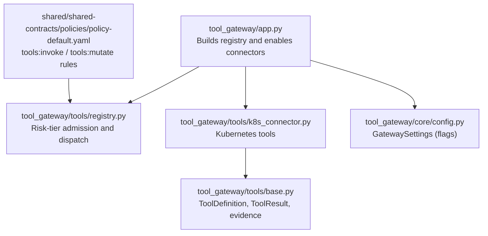
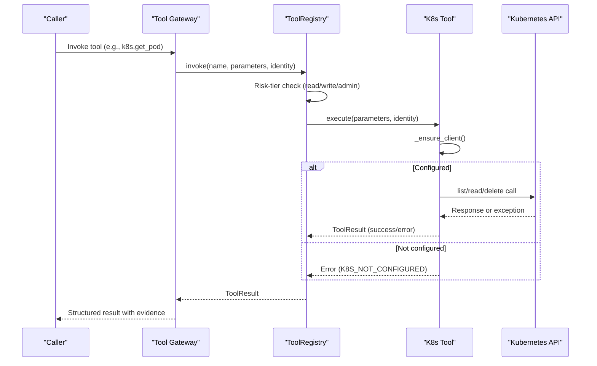
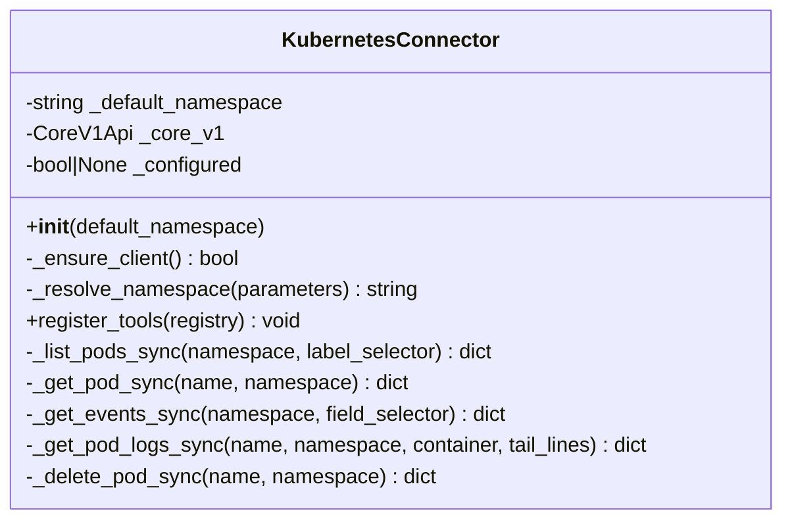
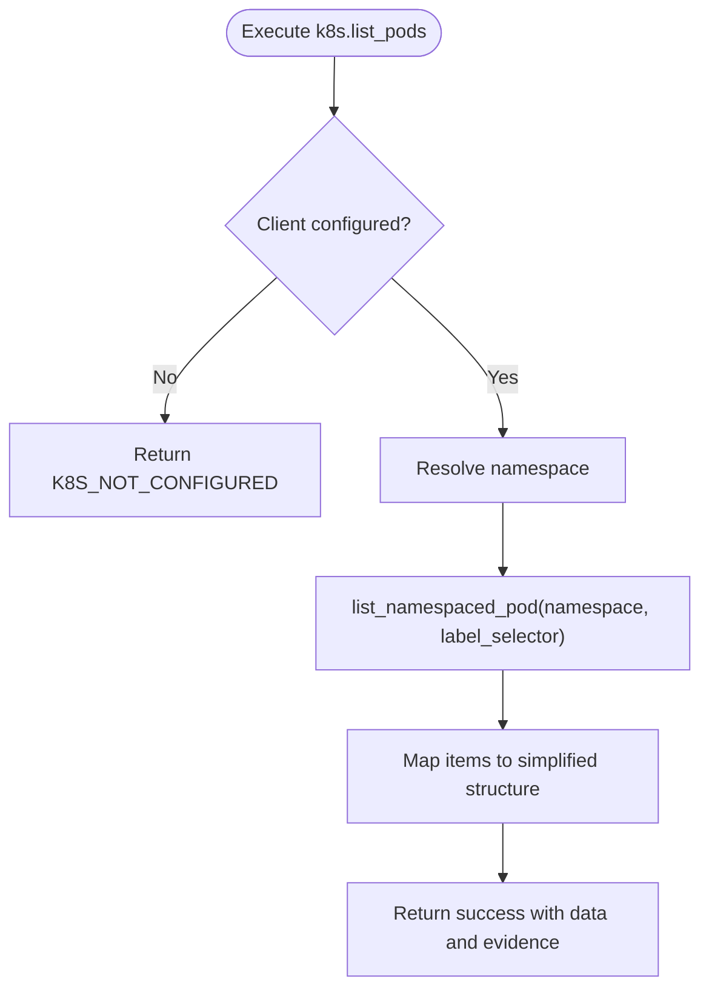
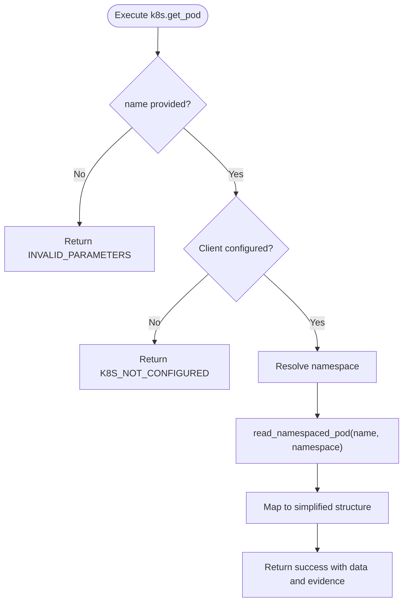
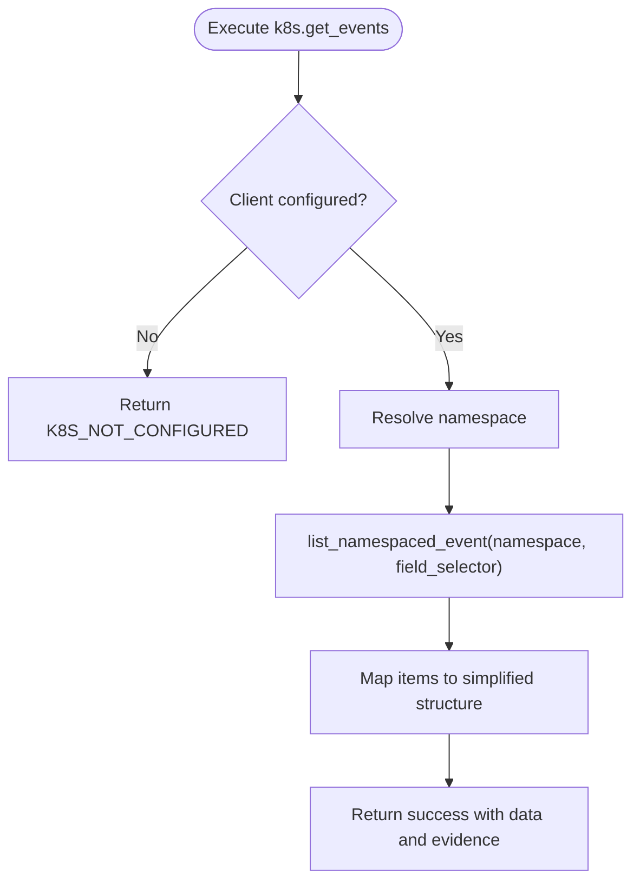
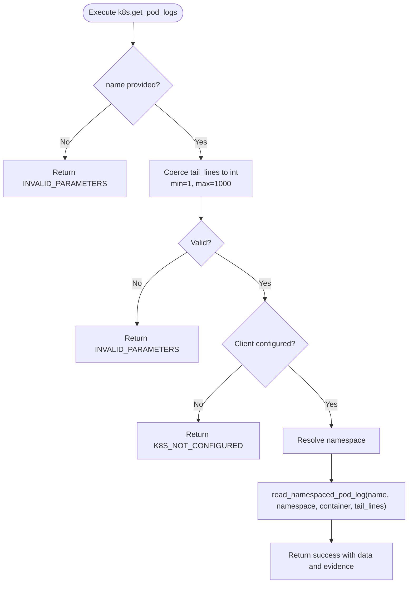
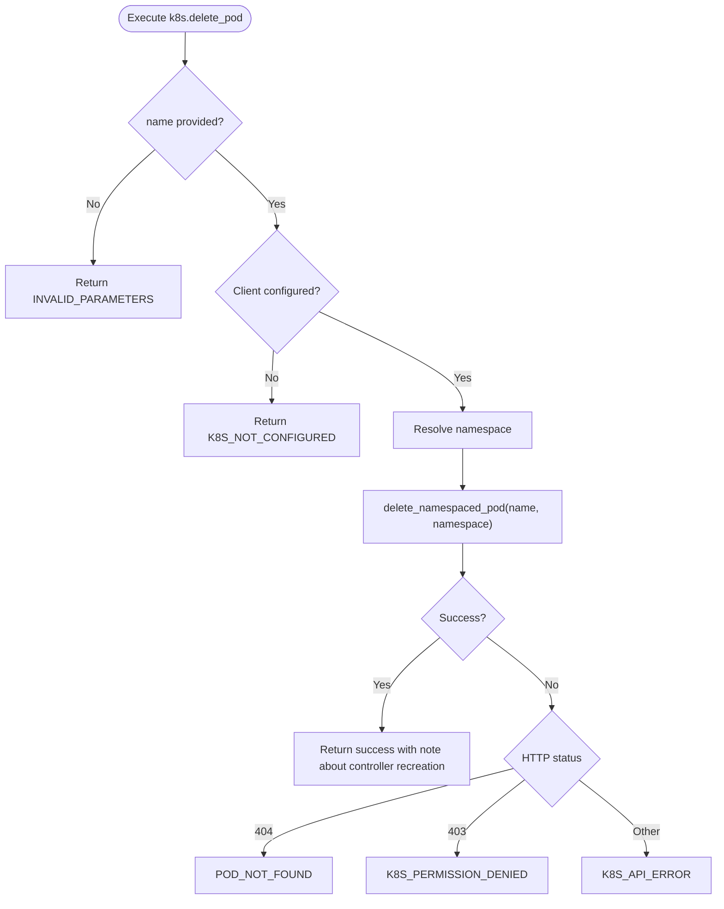
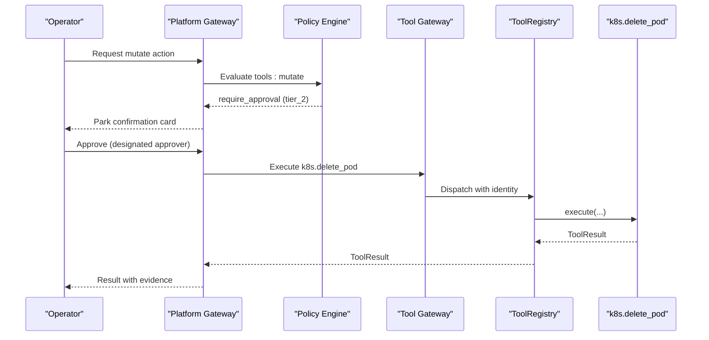
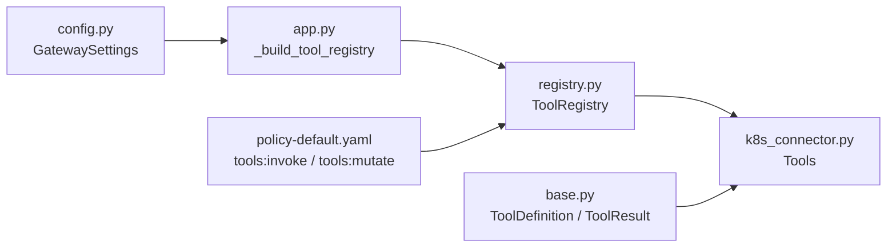

# Kubernetes Connector

<cite>
**Referenced Files in This Document**
- [k8s_connector.py](file://products/tool-gateway/src/tool_gateway/tools/k8s_connector.py)
- [base.py](file://products/tool-gateway/src/tool_gateway/tools/base.py)
- [registry.py](file://products/tool-gateway/src/tool_gateway/tools/registry.py)
- [config.py](file://products/tool-gateway/src/tool_gateway/core/config.py)
- [app.py](file://products/tool-gateway/src/tool_gateway/app.py)
- [policy-default.yaml](file://shared/shared-contracts/policies/policy-default.yaml)
- [test_k8s_connector.py](file://products/tool-gateway/tests/test_k8s_connector.py)
</cite>

## Table of Contents
1. Introduction
2. Project Structure
3. Core Components
4. Architecture Overview
5. Detailed Component Analysis
6. Dependency Analysis
7. Performance Considerations
8. Troubleshooting Guide
9. Conclusion
10. Appendices

## Introduction
The Kubernetes Connector provides bounded, safe operations against a Kubernetes cluster through the Tool Gateway. It exposes read-only tools for inspecting pods and events, retrieving logs, and a single bounded mutating tool to delete a named pod. The connector integrates with the platform’s risk-tiered tool execution model: read tools are always available; write tools require explicit enabling and approval. Authentication to the cluster uses in-cluster configuration when running inside a pod, falling back to kubeconfig for local development. RBAC is enforced by the Kubernetes API using the service account that runs the Tool Gateway process.

## Project Structure
The Kubernetes Connector lives under the Tool Gateway product and registers its tools into a central registry. Configuration flags control whether the connector is enabled and whether mutating tools are admitted.

**Diagram sources**
- [app.py:19-40](file://products/tool-gateway/src/tool_gateway/app.py#L19-L40)
- [registry.py:18-55](file://products/tool-gateway/src/tool_gateway/tools/registry.py#L18-L55)
- [k8s_connector.py:80-91](file://products/tool-gateway/src/tool_gateway/tools/k8s_connector.py#L80-L91)
- [base.py:15-86](file://products/tool-gateway/src/tool_gateway/tools/base.py#L15-L86)
- [config.py:32-105](file://products/tool-gateway/src/tool_gateway/core/config.py#L32-L105)
- [policy-default.yaml:90-151](file://shared/shared-contracts/policies/policy-default.yaml#L90-L151)

**Section sources**
- [app.py:19-40](file://products/tool-gateway/src/tool_gateway/app.py#L19-L40)
- [config.py:32-105](file://products/tool-gateway/src/tool_gateway/core/config.py#L32-L105)

## Core Components
- KubernetesConnector: Manages client lifecycle, resolves namespace, and registers tools.
- Tool definitions: k8s.list_pods, k8s.get_pod, k8s.get_events, k8s.get_pod_logs (read), and k8s.delete_pod (write).
- Registry: Enforces risk tiers and admits mutating tools only when enabled.
- Base abstractions: ToolDefinition, ToolResult, evidence building, error helpers.
- Configuration: Feature flags GATEWAY_K8S_ENABLED, GATEWAY_K8S_NAMESPACE, GATEWAY_MUTATING_TOOLS_ENABLED.
- Policy: tools:invoke for read tools; tools:mutate plus tier-2 approval for write tools.

Key behaviors:
- Read tools return structured results with evidence including duration_ms, risk_level, and source_system.
- Mutating tools are registered but filtered out unless allow_mutating is true.
- Parameter validation includes clamping tail_lines and rejecting invalid types.
- Errors are mapped to stable codes such as K8S_NOT_CONFIGURED, INVALID_PARAMETERS, POD_NOT_FOUND, K8S_PERMISSION_DENIED, K8S_API_ERROR.

**Section sources**
- [k8s_connector.py:41-91](file://products/tool-gateway/src/tool_gateway/tools/k8s_connector.py#L41-L91)
- [k8s_connector.py:231-518](file://products/tool-gateway/src/tool_gateway/tools/k8s_connector.py#L231-L518)
- [registry.py:18-55](file://products/tool-gateway/src/tool_gateway/tools/registry.py#L18-L55)
- [base.py:15-86](file://products/tool-gateway/src/tool_gateway/tools/base.py#L15-L86)
- [config.py:32-105](file://products/tool-gateway/src/tool_gateway/core/config.py#L32-L105)
- [policy-default.yaml:90-151](file://shared/shared-contracts/policies/policy-default.yaml#L90-L151)

## Architecture Overview
The Tool Gateway application builds a registry based on feature flags. When Kubernetes support is enabled, the connector registers its tools. Invocations flow through the registry, which enforces risk-tier admission and dispatches to the appropriate tool. Tools execute synchronous Kubernetes client calls in an executor to avoid blocking the event loop. Results include evidence for auditability.

**Diagram sources**
- [app.py:19-40](file://products/tool-gateway/src/tool_gateway/app.py#L19-L40)
- [registry.py:65-88](file://products/tool-gateway/src/tool_gateway/tools/registry.py#L65-L88)
- [k8s_connector.py:49-75](file://products/tool-gateway/src/tool_gateway/tools/k8s_connector.py#L49-L75)
- [k8s_connector.py:251-326](file://products/tool-gateway/src/tool_gateway/tools/k8s_connector.py#L251-L326)

## Detailed Component Analysis

### KubernetesConnector
Responsibilities:
- Lazy initialization of the Kubernetes client using in-cluster config first, then kubeconfig.
- Namespace resolution from parameters or default.
- Registration of five tools (four read, one write).

Execution pattern:
- Synchronous Kubernetes client calls run in a thread executor via asyncio to prevent blocking the event loop.
- Each tool measures duration and attaches evidence.

Error handling:
- Missing configuration returns K8S_NOT_CONFIGURED.
- API errors return K8S_API_ERROR with message.
- Delete-specific mapping: 404 -> POD_NOT_FOUND; 403 -> K8S_PERMISSION_DENIED.

**Diagram sources**
- [k8s_connector.py:41-195](file://products/tool-gateway/src/tool_gateway/tools/k8s_connector.py#L41-L195)

**Section sources**
- [k8s_connector.py:41-195](file://products/tool-gateway/src/tool_gateway/tools/k8s_connector.py#L41-L195)

### Tool Definitions and Execution

#### k8s.list_pods
- Purpose: List pods in a namespace with optional label selector.
- Parameters: namespace (optional), label_selector (optional).
- Output: pods array with name, namespace, phase, node_name, start_time, containers, labels; count.
- Evidence: read risk level, source system, duration.

**Diagram sources**
- [k8s_connector.py:231-276](file://products/tool-gateway/src/tool_gateway/tools/k8s_connector.py#L231-L276)

**Section sources**
- [k8s_connector.py:231-276](file://products/tool-gateway/src/tool_gateway/tools/k8s_connector.py#L231-L276)

#### k8s.get_pod
- Purpose: Get detailed status of a specific pod.
- Parameters: name (required), namespace (optional).
- Output: name, namespace, phase, node_name, start_time, containers, labels, conditions.

**Diagram sources**
- [k8s_connector.py:278-326](file://products/tool-gateway/src/tool_gateway/tools/k8s_connector.py#L278-L326)

**Section sources**
- [k8s_connector.py:278-326](file://products/tool-gateway/src/tool_gateway/tools/k8s_connector.py#L278-L326)

#### k8s.get_events
- Purpose: List events in a namespace with optional field selector.
- Parameters: namespace (optional), field_selector (optional).
- Output: events array with reason, message, type, count, timestamps, involved_object; count.

**Diagram sources**
- [k8s_connector.py:329-373](file://products/tool-gateway/src/tool_gateway/tools/k8s_connector.py#L329-L373)

**Section sources**
- [k8s_connector.py:329-373](file://products/tool-gateway/src/tool_gateway/tools/k8s_connector.py#L329-L373)

#### k8s.get_pod_logs
- Purpose: Retrieve recent logs from a pod container.
- Parameters: name (required), namespace (optional), container (optional), tail_lines (integer, validated).
- Validation: tail_lines coerced to integer, minimum 1, maximum capped at 1000; non-integer values produce INVALID_PARAMETERS.
- Output: logs string, pod name, container, tail_lines used.

**Diagram sources**
- [k8s_connector.py:376-436](file://products/tool-gateway/src/tool_gateway/tools/k8s_connector.py#L376-L436)
- [k8s_connector.py:211-225](file://products/tool-gateway/src/tool_gateway/tools/k8s_connector.py#L211-L225)

**Section sources**
- [k8s_connector.py:376-436](file://products/tool-gateway/src/tool_gateway/tools/k8s_connector.py#L376-L436)
- [k8s_connector.py:211-225](file://products/tool-gateway/src/tool_gateway/tools/k8s_connector.py#L211-L225)

#### k8s.delete_pod (bounded mutation)
- Purpose: Delete a single named pod. If managed by a controller, it will be recreated automatically, making this a bounded “restart” primitive.
- Parameters: name (required), namespace (optional).
- Risk level: write.
- Admission: Only registered when allow_mutating is true; requires tools:mutate policy and tier-2 approval.
- Error mapping: 404 -> POD_NOT_FOUND; 403 -> K8S_PERMISSION_DENIED; others -> K8S_API_ERROR.

**Diagram sources**
- [k8s_connector.py:439-518](file://products/tool-gateway/src/tool_gateway/tools/k8s_connector.py#L439-L518)

**Section sources**
- [k8s_connector.py:439-518](file://products/tool-gateway/src/tool_gateway/tools/k8s_connector.py#L439-L518)

### Risk Tiers and Approval Flow
- Read tools: require tools:invoke.
- Write tools: require tools:mutate and tier-2 approval by a designated approver distinct from the requester.
- Mutating tools are disabled by default; enable via configuration flag and policy grants.

**Diagram sources**
- [policy-default.yaml:111-151](file://shared/shared-contracts/policies/policy-default.yaml#L111-L151)
- [registry.py:18-55](file://products/tool-gateway/src/tool_gateway/tools/registry.py#L18-L55)
- [k8s_connector.py:439-518](file://products/tool-gateway/src/tool_gateway/tools/k8s_connector.py#L439-L518)

**Section sources**
- [policy-default.yaml:90-151](file://shared/shared-contracts/policies/policy-default.yaml#L90-L151)
- [registry.py:18-55](file://products/tool-gateway/src/tool_gateway/tools/registry.py#L18-L55)

## Dependency Analysis
- Application wiring: app.py conditionally loads the Kubernetes connector based on GATEWAY_K8S_ENABLED and passes default namespace from GATEWAY_K8S_NAMESPACE.
- Registry gating: ToolRegistry refuses write/admin tools unless allow_mutating is set (GATEWAY_MUTATING_TOOLS_ENABLED).
- Policy surface: policy-default.yaml defines tools:invoke and tools:mutate grants and approval requirements.
- Base abstractions: All tools use ToolDefinition and ToolResult to standardize metadata and outcomes.

**Diagram sources**
- [config.py:32-105](file://products/tool-gateway/src/tool_gateway/core/config.py#L32-L105)
- [app.py:19-40](file://products/tool-gateway/src/tool_gateway/app.py#L19-L40)
- [registry.py:18-55](file://products/tool-gateway/src/tool_gateway/tools/registry.py#L18-L55)
- [k8s_connector.py:80-91](file://products/tool-gateway/src/tool_gateway/tools/k8s_connector.py#L80-L91)
- [base.py:15-86](file://products/tool-gateway/src/tool_gateway/tools/base.py#L15-L86)
- [policy-default.yaml:90-151](file://shared/shared-contracts/policies/policy-default.yaml#L90-L151)

**Section sources**
- [app.py:19-40](file://products/tool-gateway/src/tool_gateway/app.py#L19-L40)
- [config.py:32-105](file://products/tool-gateway/src/tool_gateway/core/config.py#L32-L105)
- [registry.py:18-55](file://products/tool-gateway/src/tool_gateway/tools/registry.py#L18-L55)
- [policy-default.yaml:90-151](file://shared/shared-contracts/policies/policy-default.yaml#L90-L151)

## Performance Considerations
- Non-blocking I/O: All Kubernetes client calls run in a thread executor to avoid blocking the async event loop.
- Log volume control: tail_lines is clamped to a maximum of 1000 to prevent excessive payloads.
- Evidence timing: Each tool records duration_ms for observability and performance tracking.
- Conditional loading: Connectors are loaded only when enabled to reduce startup overhead.

[No sources needed since this section provides general guidance]

## Troubleshooting Guide
Common error codes and causes:
- K8S_NOT_CONFIGURED: In-cluster config and kubeconfig both unavailable; ensure the Tool Gateway runs with proper cluster access or configure kubeconfig.
- INVALID_PARAMETERS: Missing required fields (e.g., name) or invalid parameter types (e.g., tail_lines not an integer).
- POD_NOT_FOUND: Pod does not exist in the target namespace.
- K8S_PERMISSION_DENIED: Service account lacks permissions to perform the operation; grant pod-delete RBAC for the Tool Gateway service account.
- K8S_API_ERROR: Generic API failure; inspect logs and underlying exception.

Operational checks:
- Verify GATEWAY_K8S_ENABLED is true and GATEWAY_K8S_NAMESPACE is set if you rely on namespace scoping.
- For mutations, confirm GATEWAY_MUTATING_TOOLS_ENABLED is true and policy grants tools:mutate are present.
- Confirm the Tool Gateway service account has the necessary Kubernetes RBAC roles for the intended operations.

Validation coverage:
- Tests assert behavior for not-configured scenarios, registration filtering, parameter validation, log tail capping, and error code mapping for delete operations.

**Section sources**
- [k8s_connector.py:49-75](file://products/tool-gateway/src/tool_gateway/tools/k8s_connector.py#L49-L75)
- [k8s_connector.py:251-326](file://products/tool-gateway/src/tool_gateway/tools/k8s_connector.py#L251-L326)
- [k8s_connector.py:376-436](file://products/tool-gateway/src/tool_gateway/tools/k8s_connector.py#L376-L436)
- [k8s_connector.py:439-518](file://products/tool-gateway/src/tool_gateway/tools/k8s_connector.py#L439-L518)
- [test_k8s_connector.py:15-50](file://products/tool-gateway/tests/test_k8s_connector.py#L15-L50)
- [test_k8s_connector.py:52-82](file://products/tool-gateway/tests/test_k8s_connector.py#L52-L82)
- [test_k8s_connector.py:84-239](file://products/tool-gateway/tests/test_k8s_connector.py#L84-L239)
- [test_k8s_connector.py:251-324](file://products/tool-gateway/tests/test_k8s_connector.py#L251-L324)

## Conclusion
The Kubernetes Connector delivers a minimal, auditable, and bounded surface for interacting with Kubernetes clusters. It emphasizes safety through risk-tiered tool execution, strict parameter validation, controlled output sizes, and clear error semantics. Read operations are immediately useful for inspection and diagnostics; mutations are intentionally limited to deleting a single pod and gated behind policy and approval workflows. Proper configuration of cluster access and RBAC ensures secure, least-privilege operations aligned with platform governance.

[No sources needed since this section summarizes without analyzing specific files]

## Appendices

### Configuration Reference
- Enable Kubernetes connector: GATEWAY_K8S_ENABLED=true
- Default namespace scope: GATEWAY_K8S_NAMESPACE=<namespace>
- Allow mutating tools: GATEWAY_MUTATING_TOOLS_ENABLED=true
- Policy grants:
  - tools:invoke for read tools
  - tools:mutate for write tools, plus tier-2 approval

**Section sources**
- [config.py:32-105](file://products/tool-gateway/src/tool_gateway/core/config.py#L32-L105)
- [policy-default.yaml:90-151](file://shared/shared-contracts/policies/policy-default.yaml#L90-L151)

### Supported Resource Types
- Pods: full inspection via list and get; logs retrieval; deletion via bounded mutation.
- Events: listing within a namespace with optional field selectors.
- Note: Other resource types (deployments, services, configmaps, secrets) are not exposed by this connector.

**Section sources**
- [k8s_connector.py:231-518](file://products/tool-gateway/src/tool_gateway/tools/k8s_connector.py#L231-L518)

### Practical Examples
- Check deployment status indirectly: list pods with label_selector to infer readiness and phase.
- Scale workloads: use your preferred orchestration method; the connector does not expose scaling endpoints.
- View pod logs: use k8s.get_pod_logs with name, optional container, and tail_lines.
- Inspect resource configurations: use k8s.get_pod to retrieve pod details and conditions.

[No sources needed since this section provides general guidance]

### Timeout and Rate Limiting
- Timeouts: No explicit timeout configuration is implemented in the connector; timeouts depend on the underlying Kubernetes client defaults and network settings.
- Rate limiting: No built-in rate limiting; consider applying cluster-level or gateway-level policies if needed.

[No sources needed since this section provides general guidance]