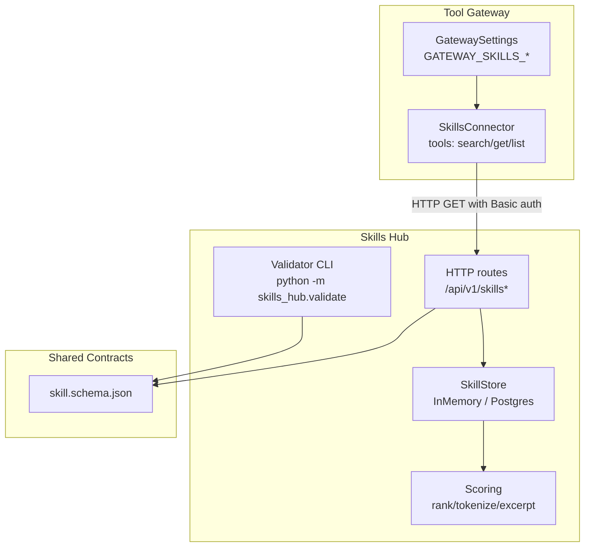
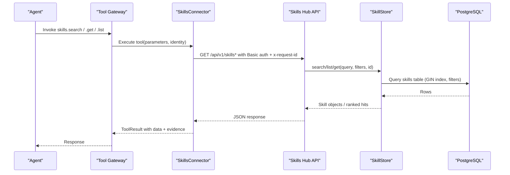
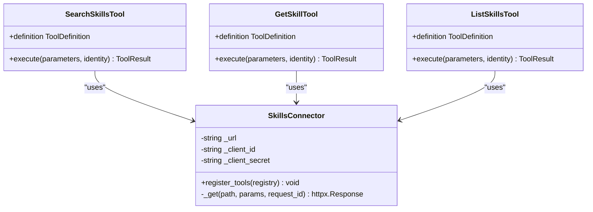
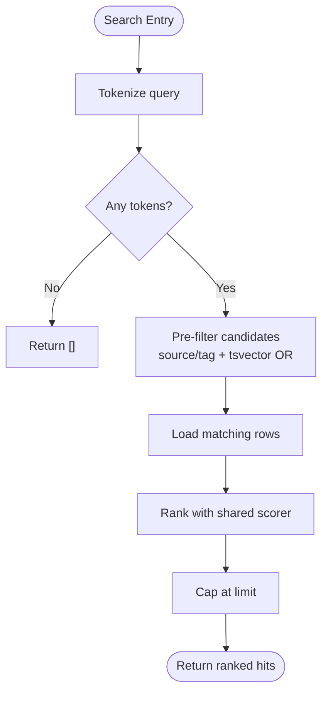
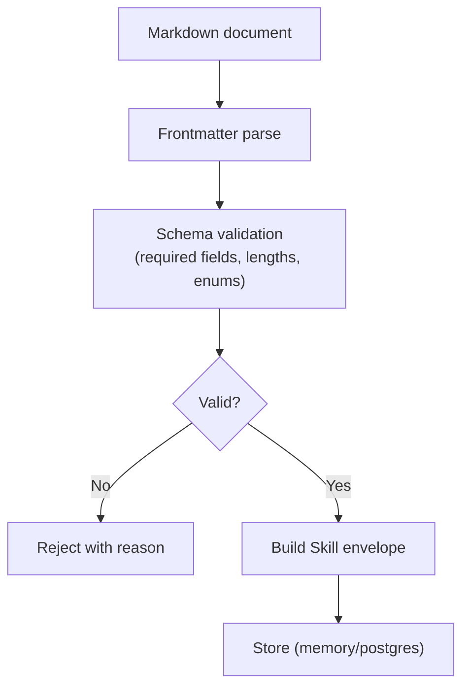
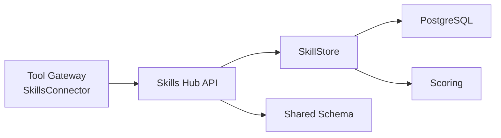

# Skills Connector

<cite>
**Referenced Files in This Document**
- [skills_connector.py](file://products/tool-gateway/src/tool_gateway/tools/skills_connector.py)
- [config.py (tool-gateway)](file://products/tool-gateway/src/tool_gateway/core/config.py)
- [skill_store.py](file://products/skills-hub/src/skills_hub/services/skill_store.py)
- [scoring.py](file://products/skills-hub/src/skills_hub/services/scoring.py)
- [skill.schema.json](file://shared/shared-contracts/schemas/skill.schema.json)
- [validate.py](file://products/skills-hub/src/skills_hub/validate.py)
- [config.py (skills-hub)](file://products/skills-hub/src/skills_hub/core/config.py)
- [skills-guide.md](file://docs/guides/skills-guide.md)
</cite>

## Table of Contents
1. [Introduction](#introduction)
2. [Project Structure](#project-structure)
3. [Core Components](#core-components)
4. [Architecture Overview](#architecture-overview)
5. [Detailed Component Analysis](#detailed-component-analysis)
6. [Dependency Analysis](#dependency-analysis)
7. [Performance Considerations](#performance-considerations)
8. [Troubleshooting Guide](#troubleshooting-guide)
9. [Conclusion](#conclusion)
10. [Appendices](#appendices)

## Introduction
The Skills Connector is the read-only bridge that exposes operational skills and runbooks to agents through the tool gateway. It provides three tools:
- skills.search: search for skills by free-text, source, or tag with a bounded limit.
- skills.get: retrieve the full skill record by its namespaced id.
- skills.list: list skill summaries with pagination and optional filters.

It authenticates to the skills-hub using Basic credentials held by the gateway, validates inputs, maps upstream errors to structured results, and attaches evidence for auditability. The connector is only registered when the gateway’s skills service URL is configured.

**Section sources**
- [skills_connector.py:1-12](file://products/tool-gateway/src/tool_gateway/tools/skills_connector.py#L1-L12)
- [skills_connector.py:71-88](file://products/tool-gateway/src/tool_gateway/tools/skills_connector.py#L71-L88)

## Project Structure
At a high level:
- Tool Gateway hosts the Skills Connector tools and calls the skills-hub over HTTP.
- Skills Hub ingests Markdown skills from local directories or Git repositories, validates them against a shared schema, stores them in memory or PostgreSQL, and serves retrieval endpoints.
- Shared contracts define the canonical skill envelope and validation rules.

**Diagram sources**
- [skills_connector.py:71-108](file://products/tool-gateway/src/tool_gateway/tools/skills_connector.py#L71-L108)
- [config.py (tool-gateway):32-60](file://products/tool-gateway/src/tool_gateway/core/config.py#L32-L60)
- [skill_store.py:30-66](file://products/skills-hub/src/skills_hub/services/skill_store.py#L30-L66)
- [scoring.py:28-96](file://products/skills-hub/src/skills_hub/services/scoring.py#L28-L96)
- [skill.schema.json:1-125](file://shared/shared-contracts/schemas/skill.schema.json#L1-L125)
- [validate.py:23-43](file://products/skills-hub/src/skills_hub/validate.py#L23-L43)

**Section sources**
- [skills_connector.py:1-12](file://products/tool-gateway/src/tool_gateway/tools/skills_connector.py#L1-L12)
- [config.py (tool-gateway):32-60](file://products/tool-gateway/src/tool_gateway/core/config.py#L32-L60)
- [skill_store.py:1-7](file://products/skills-hub/src/skills_hub/services/skill_store.py#L1-L7)
- [skill.schema.json:1-125](file://shared/shared-contracts/schemas/skill.schema.json#L1-L125)

## Core Components
- SkillsConnector: registers and coordinates the three tools; issues authenticated GET requests to skills-hub with request correlation headers.
- SearchSkillsTool: validates query and limit, forwards to /api/v1/skills/search, projects stable match keys.
- GetSkillTool: validates namespaced skill_id via regex, forwards to /api/v1/skills/{id}.
- ListSkillsTool: validates limit and offset, forwards to /api/v1/skills with pagination and optional filters.
- Error mapping: converts upstream HTTP errors into structured tool errors with codes like SKILL_NOT_FOUND and UPSTREAM_ERROR.

Key behaviors:
- Input validation prevents injection into URLs and enforces safe parameter ranges.
- Evidence envelopes are attached to every successful call for auditability.
- Transport failures are captured as TOOL_EXECUTION_ERROR with timing.

**Section sources**
- [skills_connector.py:71-108](file://products/tool-gateway/src/tool_gateway/tools/skills_connector.py#L71-L108)
- [skills_connector.py:111-148](file://products/tool-gateway/src/tool_gateway/tools/skills_connector.py#L111-L148)
- [skills_connector.py:154-245](file://products/tool-gateway/src/tool_gateway/tools/skills_connector.py#L154-L245)
- [skills_connector.py:248-309](file://products/tool-gateway/src/tool_gateway/tools/skills_connector.py#L248-L309)
- [skills_connector.py:312-418](file://products/tool-gateway/src/tool_gateway/tools/skills_connector.py#L312-L418)

## Architecture Overview
The connector performs read-only access to the skills hub. Agents invoke tools through the gateway; the connector authenticates to the hub and returns normalized results.

**Diagram sources**
- [skills_connector.py:90-108](file://products/tool-gateway/src/tool_gateway/tools/skills_connector.py#L90-L108)
- [skill_store.py:378-443](file://products/skills-hub/src/skills_hub/services/skill_store.py#L378-L443)
- [skill_store.py:158-200](file://products/skills-hub/src/skills_hub/services/skill_store.py#L158-L200)

## Detailed Component Analysis

### SkillsConnector and Tools
Responsibilities:
- Register tools with the registry.
- Issue authenticated GETs with timeout and request correlation.
- Validate parameters and map upstream responses to structured errors.
- Project stable fields for search matches and list entries to keep payloads predictable.

Security considerations:
- skill_id is validated against a strict pattern before interpolation into the URL path to prevent path/query injection.
- All outbound calls use Basic authentication derived from gateway settings.

**Diagram sources**
- [skills_connector.py:71-108](file://products/tool-gateway/src/tool_gateway/tools/skills_connector.py#L71-L108)
- [skills_connector.py:154-245](file://products/tool-gateway/src/tool_gateway/tools/skills_connector.py#L154-L245)
- [skills_connector.py:248-309](file://products/tool-gateway/src/tool_gateway/tools/skills_connector.py#L248-L309)
- [skills_connector.py:312-418](file://products/tool-gateway/src/tool_gateway/tools/skills_connector.py#L312-L418)

**Section sources**
- [skills_connector.py:71-108](file://products/tool-gateway/src/tool_gateway/tools/skills_connector.py#L71-L108)
- [skills_connector.py:154-245](file://products/tool-gateway/src/tool_gateway/tools/skills_connector.py#L154-L245)
- [skills_connector.py:248-309](file://products/tool-gateway/src/tool_gateway/tools/skills_connector.py#L248-L309)
- [skills_connector.py:312-418](file://products/tool-gateway/src/tool_gateway/tools/skills_connector.py#L312-L418)

### Skills Hub Storage and Scoring
Storage strategies:
- In-memory store for tests/dev: per-source snapshots with atomic swaps.
- PostgreSQL store for production: durable table with GIN full-text index on title+body, tag pre-filtering, and deterministic re-ranking.

Scoring:
- Deterministic keyword scoring with fixed weights for title, tags, and body occurrences (capped).
- Zero-score records excluded; ties broken by skill_id ascending.
- Excerpts bounded to a maximum length.

**Diagram sources**
- [skill_store.py:417-443](file://products/skills-hub/src/skills_hub/services/skill_store.py#L417-L443)
- [scoring.py:28-96](file://products/skills-hub/src/skills_hub/services/scoring.py#L28-L96)

**Section sources**
- [skill_store.py:72-153](file://products/skills-hub/src/skills_hub/services/skill_store.py#L72-L153)
- [skill_store.py:158-200](file://products/skills-hub/src/skills_hub/services/skill_store.py#L158-L200)
- [skill_store.py:283-443](file://products/skills-hub/src/skills_hub/services/skill_store.py#L283-L443)
- [scoring.py:28-96](file://products/skills-hub/src/skills_hub/services/scoring.py#L28-L96)

### Skill Format Validation and Quality Scoring
Validation:
- The shared JSON schema defines required fields, patterns, and limits for skills, including v2 executable-flow fields (kind, steps, flow_intent, risk_class).
- A CLI validator runs the same ingestion code path used by the service to check documents before publishing.

Quality scoring:
- Deterministic relevance scoring ensures consistent ranking across backends.
- Excerpts provide bounded context for search results.

**Diagram sources**
- [skill.schema.json:1-125](file://shared/shared-contracts/schemas/skill.schema.json#L1-L125)
- [validate.py:23-43](file://products/skills-hub/src/skills_hub/validate.py#L23-L43)

**Section sources**
- [skill.schema.json:1-125](file://shared/shared-contracts/schemas/skill.schema.json#L1-L125)
- [validate.py:23-43](file://products/skills-hub/src/skills_hub/validate.py#L23-L43)
- [scoring.py:28-96](file://products/skills-hub/src/skills_hub/services/scoring.py#L28-L96)

### Authentication and Authorization
- Tool Gateway uses Basic authentication with client_id and client_secret configured via environment variables to call skills-hub.
- Skills Hub supports static query clients configured via environment; these credentials authorize API access.
- Workload clients can be mapped to client IDs for token-based scenarios.

Configuration references:
- Gateway settings include skills_service_url, skills_client_id, and skills_client_secret.
- Skills Hub settings include query_clients, workload_issuer_url, workload_audience, and workload_clients.

**Section sources**
- [skills_connector.py:90-108](file://products/tool-gateway/src/tool_gateway/tools/skills_connector.py#L90-L108)
- [config.py (tool-gateway):32-60](file://products/tool-gateway/src/tool_gateway/core/config.py#L32-L60)
- [config.py (tool-gateway):131-133](file://products/tool-gateway/src/tool_gateway/core/config.py#L131-L133)
- [config.py (skills-hub):34-48](file://products/skills-hub/src/skills_hub/core/config.py#L34-L48)
- [config.py (skills-hub):133-158](file://products/skills-hub/src/skills_hub/core/config.py#L133-L158)
- [config.py (skills-hub):161-203](file://products/skills-hub/src/skills_hub/core/config.py#L161-L203)

### Skill Versioning, Metadata, and Dependency Resolution
- Each skill carries metadata: skill_id (namespaced), source_id, source_path, source_ref, title, description, tags, version, source_url, updated_at, and optional v2 fields (web_target, risk_class, flow_intent, kind, steps).
- Versioning is author-managed via the version field; moves or renames change skill_id intentionally to preserve citation integrity.
- Dependency resolution is not implemented in this slice; skills are independent units served by the hub.

**Section sources**
- [skill.schema.json:1-125](file://shared/shared-contracts/schemas/skill.schema.json#L1-L125)
- [skill_store.py:158-200](file://products/skills-hub/src/skills_hub/services/skill_store.py#L158-L200)

### Practical Usage Examples
- Lookup by ID: Use skills.get with a namespaced skill_id (e.g., sre-alerting/alerts/kubepodnotready).
- Lookup by tags: Use skills.search or skills.list with tag filter.
- Retrieve content: Use skills.get to fetch the full record including body.
- Execute skill steps within workflows: Executable flows declare steps in the skill envelope; execution coordination is outside the connector scope and handled by other components.

Operational examples and verification commands are provided in the operator guide.

**Section sources**
- [skills_connector.py:248-309](file://products/tool-gateway/src/tool_gateway/tools/skills_connector.py#L248-L309)
- [skills_connector.py:154-245](file://products/tool-gateway/src/tool_gateway/tools/skills_connector.py#L154-L245)
- [skills_connector.py:312-418](file://products/tool-gateway/src/tool_gateway/tools/skills_connector.py#L312-L418)
- [skills-guide.md:294-336](file://docs/guides/skills-guide.md#L294-L336)

## Dependency Analysis
Coupling and cohesion:
- The connector depends on the gateway configuration for endpoint and credentials.
- The skills-hub storage layer abstracts backends behind a common protocol, enabling deterministic behavior across environments.
- Scoring is pure and shared between backends to ensure identical ordering.

External dependencies:
- HTTP client for outbound calls.
- PostgreSQL driver for persistent storage.
- Shared JSON schema for validation.

Potential circular dependencies:
- None observed; connector calls hub services, which depend on storage and scoring.

**Diagram sources**
- [skills_connector.py:90-108](file://products/tool-gateway/src/tool_gateway/tools/skills_connector.py#L90-L108)
- [skill_store.py:30-66](file://products/skills-hub/src/skills_hub/services/skill_store.py#L30-L66)
- [skill_store.py:158-200](file://products/skills-hub/src/skills_hub/services/skill_store.py#L158-L200)
- [scoring.py:28-96](file://products/skills-hub/src/skills_hub/services/scoring.py#L28-L96)
- [skill.schema.json:1-125](file://shared/shared-contracts/schemas/skill.schema.json#L1-L125)

**Section sources**
- [skills_connector.py:90-108](file://products/tool-gateway/src/tool_gateway/tools/skills_connector.py#L90-L108)
- [skill_store.py:30-66](file://products/skills-hub/src/skills_hub/services/skill_store.py#L30-L66)
- [scoring.py:28-96](file://products/skills-hub/src/skills_hub/services/scoring.py#L28-L96)

## Performance Considerations
- Timeouts: Outbound requests use a fixed timeout to avoid hanging.
- Limits: Search and list enforce maximum result counts to bound payload sizes.
- Pagination: List supports offset-based pagination to handle large catalogs.
- Indexing: PostgreSQL uses a GIN index on concatenated title/body text for fast full-text search; tags are pre-filtered due to stability constraints.
- Deterministic ranking: Shared scorer ensures consistent performance characteristics and avoids expensive recomputation differences between backends.
- Large payloads: Body size is capped at 64 KiB in the schema; list/search responses omit or excerpt bodies to reduce transfer size.

[No sources needed since this section provides general guidance]

## Troubleshooting Guide
Common issues and resolutions:
- Missing skill: Upstream 404 maps to SKILL_NOT_FOUND; verify skill_id format and existence.
- Version conflicts: Not applicable at connector level; ensure correct skill_id if paths changed.
- Repository connectivity issues: Transport errors map to TOOL_EXECUTION_ERROR; check network, credentials, and skills-hub availability.
- Source sync failures: Check skills-hub status endpoint for per-source last_error and rejections; fix credentials or paths.
- No skills visible: Ensure connector registration by setting GATEWAY_SKILLS_SERVICE_URL and matching query secret.

Operational checks and commands are documented in the operator guide.

**Section sources**
- [skills_connector.py:128-148](file://products/tool-gateway/src/tool_gateway/tools/skills_connector.py#L128-L148)
- [skills_connector.py:219-233](file://products/tool-gateway/src/tool_gateway/tools/skills_connector.py#L219-L233)
- [skills_connector.py:288-302](file://products/tool-gateway/src/tool_gateway/tools/skills_connector.py#L288-L302)
- [skills_connector.py:392-406](file://products/tool-gateway/src/tool_gateway/tools/skills_connector.py#L392-L406)
- [skills-guide.md:338-370](file://docs/guides/skills-guide.md#L338-L370)

## Conclusion
The Skills Connector provides a secure, validated, and efficient interface to the skills hub for discovery, retrieval, and citation of operational guidance. It enforces input safety, standardizes error reporting, and integrates with the platform’s audit and evidence mechanisms. The skills hub offers robust storage and deterministic search, while shared schemas and validators ensure quality and consistency across skill content.

[No sources needed since this section summarizes without analyzing specific files]

## Appendices

### Configuration Examples
- Tool Gateway:
  - Set GATEWAY_SKILLS_SERVICE_URL to point to the skills-hub endpoint.
  - Provide GATEWAY_SKILLS_CLIENT_ID and GATEWAY_SKILLS_CLIENT_SECRET for Basic authentication.
- Skills Hub:
  - Configure SKILLS_SOURCES for local or git-backed skill sources.
  - Optionally set SKILLS_STORE_BACKEND=postgres and SKILLS_DB_URL for persistence.
  - Define SKILLS_QUERY_CLIENTS for API access control.

**Section sources**
- [config.py (tool-gateway):131-133](file://products/tool-gateway/src/tool_gateway/core/config.py#L131-L133)
- [config.py (skills-hub):161-203](file://products/skills-hub/src/skills_hub/core/config.py#L161-L203)
- [skills-guide.md:231-284](file://docs/guides/skills-guide.md#L231-L284)

### Caching Strategies and Fallback Behaviors
- Connector-level caching is not implemented; rely on skills-hub store caching and database indexing for performance.
- Fallback behavior:
  - Failed syncs keep previous snapshots in skills-hub.
  - Connector maps transport errors to structured results rather than failing silently.

**Section sources**
- [skills-guide.md:24-30](file://docs/guides/skills-guide.md#L24-L30)
- [skills_connector.py:219-233](file://products/tool-gateway/src/tool_gateway/tools/skills_connector.py#L219-L233)