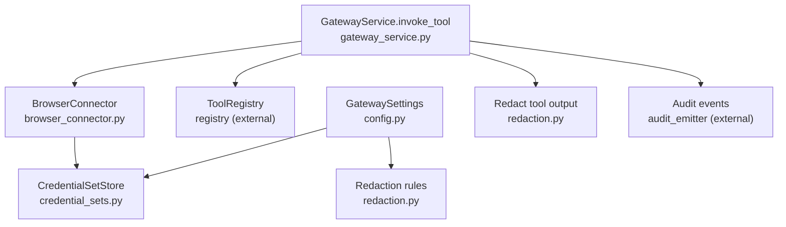
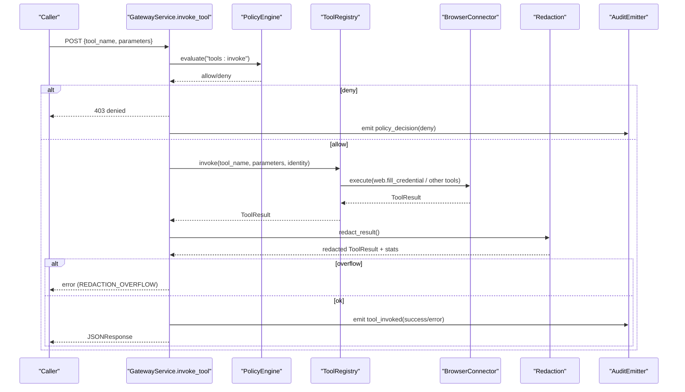
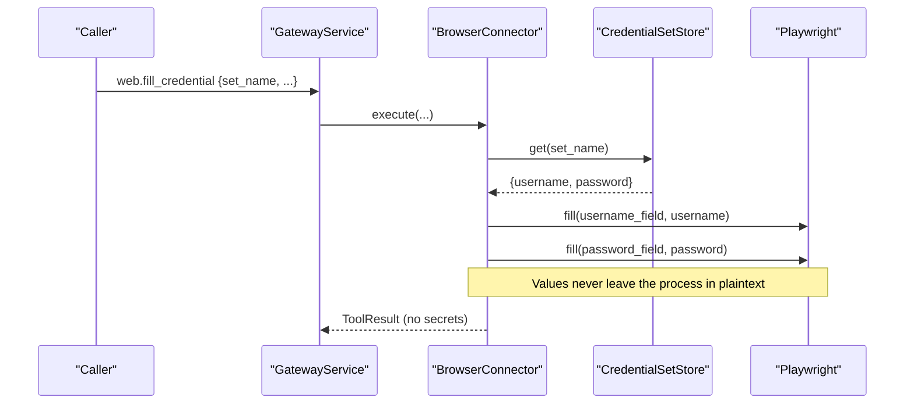
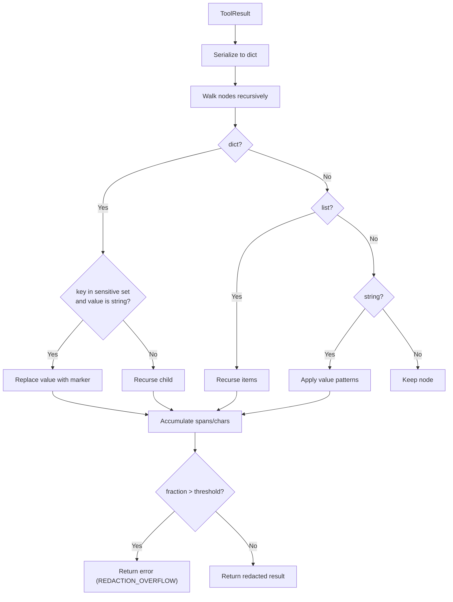
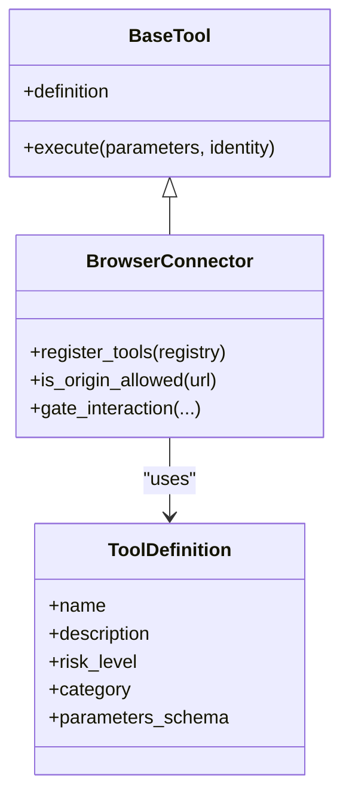
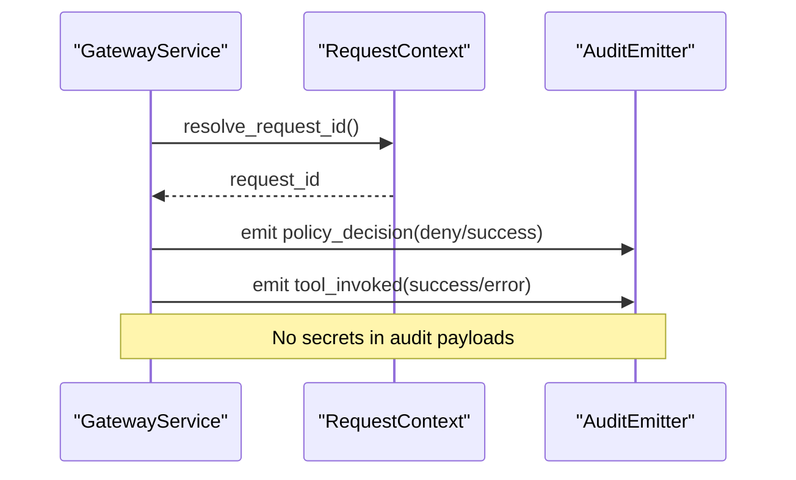
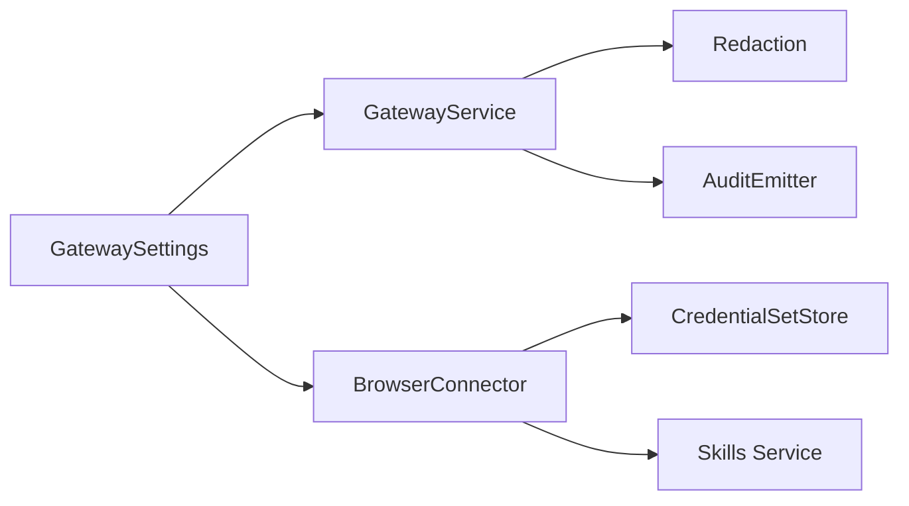

# Credential Management and Security

<cite>
**Referenced Files in This Document**
- [credential_sets.py](file://products/tool-gateway/src/tool_gateway/tools/credential_sets.py)
- [redaction.py](file://products/tool-gateway/src/tool_gateway/tools/redaction.py)
- [gateway_service.py](file://products/tool-gateway/src/tool_gateway/services/gateway_service.py)
- [browser_connector.py](file://products/tool-gateway/src/tool_gateway/tools/browser_connector.py)
- [config.py](file://products/tool-gateway/src/tool_gateway/core/config.py)
- [base.py](file://products/tool-gateway/src/tool_gateway/tools/base.py)
- [request_context.py](file://products/tool-gateway/src/tool_gateway/core/request_context.py)
</cite>

## Table of Contents
1. Introduction
2. Project Structure
3. Core Components
4. Architecture Overview
5. Detailed Component Analysis
6. Dependency Analysis
7. Performance Considerations
8. Troubleshooting Guide
9. Conclusion
10. Appendices

## Introduction
This document explains how the Tool Gateway manages credentials and prevents sensitive data from leaking in tool outputs. It covers:
- The credential set architecture for browser login flows and how credentials are injected into tool invocations.
- The redaction system that detects and masks secrets, tokens, and personal information in tool results.
- Rotation strategies, access controls, audit logging, and best practices for secure credential management.

## Project Structure
The Tool Gateway implements credential handling and output sanitization across a small set of focused modules:
- Credential sets: lazy-loaded JSON secret file with named sets for browser login flows.
- Redaction: deterministic, code-owned pattern matching and key-based masking applied to every tool result before it leaves the gateway.
- Gateway orchestration: policy checks, tool dispatch, redaction, and audit emission at a single choke point.
- Browser connector: bounded web tools that consume credential sets and mask sensitive query parameters and screenshots.
- Configuration: environment-driven settings controlling redaction behavior and browser credential set injection.

**Diagram sources**
- [config.py:32-74](file://products/tool-gateway/src/tool_gateway/core/config.py#L32-L74)
- [credential_sets.py:30-103](file://products/tool-gateway/src/tool_gateway/tools/credential_sets.py#L30-L103)
- [redaction.py:24-57](file://products/tool-gateway/src/tool_gateway/tools/redaction.py#L24-L57)
- [gateway_service.py:158-376](file://products/tool-gateway/src/tool_gateway/services/gateway_service.py#L158-L376)
- [browser_connector.py:315-399](file://products/tool-gateway/src/tool_gateway/tools/browser_connector.py#L315-L399)

**Section sources**
- [config.py:32-74](file://products/tool-gateway/src/tool_gateway/core/config.py#L32-L74)
- [gateway_service.py:158-376](file://products/tool-gateway/src/tool_gateway/services/gateway_service.py#L158-L376)

## Core Components
- CredentialSetStore: Loads a JSON file of named credential sets on demand, validates required fields, and reloads automatically when the file changes.
- Redaction engine: Applies value-pattern matches (e.g., PEM private keys, JWTs, Bearer/Basic headers, AWS access key IDs) and explicit sensitive key names to replace values with a marker. It also tracks spans and character counts to fail-closed if too much of the payload would be redacted.
- GatewayService.invoke_tool: Orchestrates identity resolution, policy enforcement, tool dispatch, redaction, and audit logging. Redaction is applied once, at the gateway boundary, before both response and audit trail.
- BrowserConnector: Provides bounded web.* tools. It uses credential sets for filling credentials and masks secret-bearing URL query parameters and screenshot content to prevent leaks.
- GatewaySettings: Environment-driven configuration for redaction toggles, overflow thresholds, and browser credential set paths.

**Section sources**
- [credential_sets.py:30-103](file://products/tool-gateway/src/tool_gateway/tools/credential_sets.py#L30-L103)
- [redaction.py:24-151](file://products/tool-gateway/src/tool_gateway/tools/redaction.py#L24-L151)
- [gateway_service.py:158-376](file://products/tool-gateway/src/tool_gateway/services/gateway_service.py#L158-L376)
- [browser_connector.py:174-257](file://products/tool-gateway/src/tool_gateway/tools/browser_connector.py#L174-L257)
- [config.py:32-74](file://products/tool-gateway/src/tool_gateway/core/config.py#L32-L74)

## Architecture Overview
The Tool Gateway enforces a strict execution pipeline:
- Identity and policy are resolved first.
- Tools are invoked through a registry; browser tools may use credential sets.
- All tool results pass through redaction before being returned or logged.
- Audit events record decisions and outcomes without leaking secrets.

**Diagram sources**
- [gateway_service.py:158-376](file://products/tool-gateway/src/tool_gateway/services/gateway_service.py#L158-L376)
- [redaction.py:126-151](file://products/tool-gateway/src/tool_gateway/tools/redaction.py#L126-L151)
- [browser_connector.py:315-399](file://products/tool-gateway/src/tool_gateway/tools/browser_connector.py#L315-L399)

## Detailed Component Analysis

### Credential Set Architecture
- Named sets: Each entry maps a human-friendly name to a dictionary containing at least username and password strings.
- Lazy loading: The store reads the file only when needed and caches until mtime changes.
- Validation: Only entries with non-empty username and password are accepted; malformed entries are ignored with warnings.
- Rotation: Because the store reloads on file modification, operators can rotate credentials by updating the mounted secret file without restarting the gateway.
- Safety: Names are safe to expose; values never appear in logs or results and flow only into Playwright fill calls.

**Diagram sources**
- [credential_sets.py:30-103](file://products/tool-gateway/src/tool_gateway/tools/credential_sets.py#L30-L103)

**Section sources**
- [credential_sets.py:30-103](file://products/tool-gateway/src/tool_gateway/tools/credential_sets.py#L30-L103)

### Credential Injection into Tool Invocations
- Browser connector integration: The browser connector holds a CredentialSetStore instance and resolves named sets at fill time.
- Parameter binding: The web.fill_credential tool consumes a named set and injects username/password into the page via Playwright. Values are not serialized into results, snapshots, or evidence.
- Screenshot protection: When capturing screenshots, the connector masks filled password values in the DOM before capture to avoid leaking them in images.
- Query parameter masking: URLs reported in evidence have secret-bearing query parameters masked so they do not leak into results or audit trails.

**Diagram sources**
- [browser_connector.py:315-399](file://products/tool-gateway/src/tool_gateway/tools/browser_connector.py#L315-L399)
- [credential_sets.py:47-103](file://products/tool-gateway/src/tool_gateway/tools/credential_sets.py#L47-L103)

**Section sources**
- [browser_connector.py:174-257](file://products/tool-gateway/src/tool_gateway/tools/browser_connector.py#L174-L257)
- [browser_connector.py:315-399](file://products/tool-gateway/src/tool_gateway/tools/browser_connector.py#L315-L399)
- [credential_sets.py:30-103](file://products/tool-gateway/src/tool_gateway/tools/credential_sets.py#L30-L103)

### Output Redaction System
- Value patterns: Detects and replaces high-confidence secret shapes such as PEM private keys, JWTs, Bearer/Basic authorization values, and AWS-style access key IDs.
- Explicit key list: Replaces string values under known sensitive field names (password, token, secret, api_key, etc.).
- Overflow control: If more than a configured fraction of the payload would be redacted, the gateway returns an error instead of leaking partial secrets.
- Single choke point: Redaction runs once after tool execution and before any response or audit log serialization.

**Diagram sources**
- [redaction.py:24-151](file://products/tool-gateway/src/tool_gateway/tools/redaction.py#L24-L151)
- [gateway_service.py:307-335](file://products/tool-gateway/src/tool_gateway/services/gateway_service.py#L307-L335)

**Section sources**
- [redaction.py:24-151](file://products/tool-gateway/src/tool_gateway/tools/redaction.py#L24-L151)
- [gateway_service.py:307-335](file://products/tool-gateway/src/tool_gateway/services/gateway_service.py#L307-L335)

### Access Controls and Risk Tiers
- Policy enforcement: Every invocation is evaluated against the policy bundle; mutating tools additionally require a mutate permission.
- Risk tiers: Tools declare read/write/admin risk levels; write/admin tools cannot be auto-approved and require explicit authorization.
- Browser-specific guards: Origin allowlists, flow binding, step budgets, and deviation guards ensure interactions stay within approved targets.

**Diagram sources**
- [base.py:15-123](file://products/tool-gateway/src/tool_gateway/tools/base.py#L15-L123)
- [browser_connector.py:315-399](file://products/tool-gateway/src/tool_gateway/tools/browser_connector.py#L315-L399)

**Section sources**
- [base.py:15-123](file://products/tool-gateway/src/tool_gateway/tools/base.py#L15-L123)
- [gateway_service.py:197-291](file://products/tool-gateway/src/tool_gateway/services/gateway_service.py#L197-L291)
- [browser_connector.py:533-698](file://products/tool-gateway/src/tool_gateway/tools/browser_connector.py#L533-L698)

### Audit Logging and Correlation
- Request correlation: A stable request ID is resolved from headers, tracing, or generated UUIDs to correlate events across services.
- Audit events: Both policy decisions and tool invocations are emitted with subject, roles, tool name, status, duration, risk level, and redaction span counts—without secrets.
- Evidence integrity: Tool results are redacted before audit emission to prevent leakage in durable logs.

**Diagram sources**
- [request_context.py:8-35](file://products/tool-gateway/src/tool_gateway/core/request_context.py#L8-L35)
- [gateway_service.py:197-376](file://products/tool-gateway/src/tool_gateway/services/gateway_service.py#L197-L376)

**Section sources**
- [request_context.py:8-35](file://products/tool-gateway/src/tool_gateway/core/request_context.py#L8-L35)
- [gateway_service.py:197-376](file://products/tool-gateway/src/tool_gateway/services/gateway_service.py#L197-L376)

## Dependency Analysis
- Configuration drives behavior:
  - Redaction enabled/disabled and overflow threshold.
  - Browser feature flags, origin allowlist, session limits, and credential set path.
- CredentialSetStore depends on filesystem availability and JSON validity; it degrades gracefully when unreadable.
- BrowserConnector depends on the skills service for flow validation and on Playwright for browser automation.
- GatewayService depends on policy engine, token verifier, and audit emitter; it centralizes redaction and audit emission.

**Diagram sources**
- [config.py:32-74](file://products/tool-gateway/src/tool_gateway/core/config.py#L32-L74)
- [gateway_service.py:158-376](file://products/tool-gateway/src/tool_gateway/services/gateway_service.py#L158-L376)
- [browser_connector.py:315-399](file://products/tool-gateway/src/tool_gateway/tools/browser_connector.py#L315-L399)
- [credential_sets.py:30-103](file://products/tool-gateway/src/tool_gateway/tools/credential_sets.py#L30-L103)

**Section sources**
- [config.py:32-74](file://products/tool-gateway/src/tool_gateway/core/config.py#L32-L74)
- [gateway_service.py:158-376](file://products/tool-gateway/src/tool_gateway/services/gateway_service.py#L158-L376)

## Performance Considerations
- Redaction cost: Pattern scanning and recursive traversal run once per tool result; keep payloads reasonable and tune overflow thresholds to avoid excessive masking.
- Credential set reload: File stat and JSON parse occur only on mtime change; frequent rotations are supported without restarts.
- Browser concurrency: Each chat session serializes interactions to avoid race conditions on shared page state.

[No sources needed since this section provides general guidance]

## Troubleshooting Guide
Common issues and diagnostics:
- Credential sets file unreadable:
  - Symptom: Warnings about unreadable files; last good load retained.
  - Action: Verify file path, permissions, and JSON structure; ensure each set has non-empty username and password.
- Redaction overflow:
  - Symptom: Tool invocation returns an error indicating too much of the result was redacted.
  - Action: Tighten parameters to reduce secret exposure; review tool logic to avoid returning large secret blobs.
- Browser origin not allowed:
  - Symptom: Navigation or interaction denied due to off-allowlist origin.
  - Action: Add the target origin to the allowlist; ensure flow binding matches the intended target.
- Secret-bearing query parameters in evidence:
  - Symptom: URLs in results/evidence contain sensitive query values.
  - Action: Ensure the connector’s URL masking is active; verify that reported URLs go through the masking function.

**Section sources**
- [credential_sets.py:52-103](file://products/tool-gateway/src/tool_gateway/tools/credential_sets.py#L52-L103)
- [redaction.py:60-73](file://products/tool-gateway/src/tool_gateway/tools/redaction.py#L60-L73)
- [gateway_service.py:307-335](file://products/tool-gateway/src/tool_gateway/services/gateway_service.py#L307-L335)
- [browser_connector.py:174-257](file://products/tool-gateway/src/tool_gateway/tools/browser_connector.py#L174-L257)

## Conclusion
The Tool Gateway centralizes credential management and output sanitization to minimize risk:
- Credentials are stored as named sets in a secret-mounted file and injected safely into browser sessions.
- Redaction applies deterministic pattern and key-based masking to all tool outputs, with fail-closed overflow protection.
- Policy enforcement, risk-tier gating, and audit logging provide strong access controls and traceability without leaking secrets.

[No sources needed since this section summarizes without analyzing specific files]

## Appendices

### Example: Defining Custom Credential Sets
- Create a JSON file with named sets, each containing username and password strings.
- Mount the file into the gateway container and configure the credential sets path via environment.
- Reference the set name in web.fill_credential parameters; values are injected into the page but never logged or returned.

**Section sources**
- [credential_sets.py:11-17](file://products/tool-gateway/src/tool_gateway/tools/credential_sets.py#L11-L17)
- [config.py:172-174](file://products/tool-gateway/src/tool_gateway/core/config.py#L172-L174)

### Example: Configuring Redaction Rules
- Enable or disable redaction via environment.
- Tune the overflow fraction to balance safety and usability.
- Review tool implementations to avoid returning large secret payloads that could trigger overflow.

**Section sources**
- [config.py:106-112](file://products/tool-gateway/src/tool_gateway/core/config.py#L106-L112)
- [redaction.py:24-57](file://products/tool-gateway/src/tool_gateway/tools/redaction.py#L24-L57)
- [gateway_service.py:307-335](file://products/tool-gateway/src/tool_gateway/services/gateway_service.py#L307-L335)

### Best Practices for Managing External System Credentials
- Store credentials in secret-mounted files; never inline values in configuration or code.
- Rotate credentials by updating the mounted file; no restart required.
- Limit browser origins to trusted targets and bind flows to declared web targets.
- Rely on policy and risk tiers to restrict mutating actions.
- Monitor audit logs for policy decisions and tool invocations; investigate denials and redaction overflows promptly.

[No sources needed since this section provides general guidance]