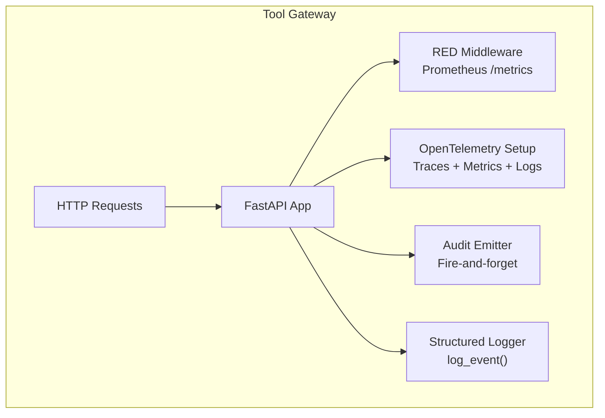
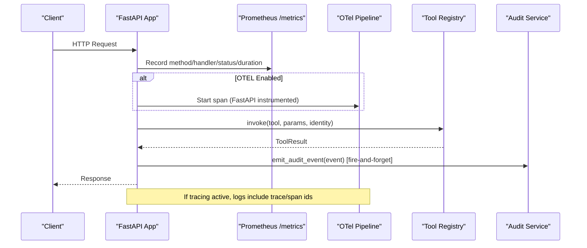
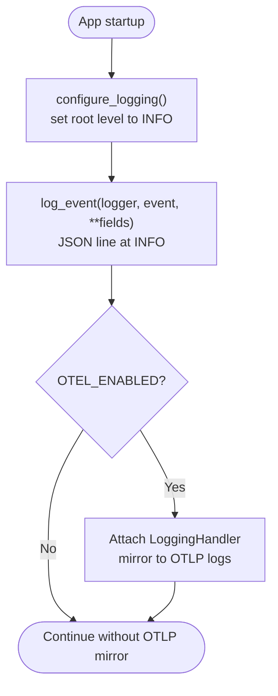
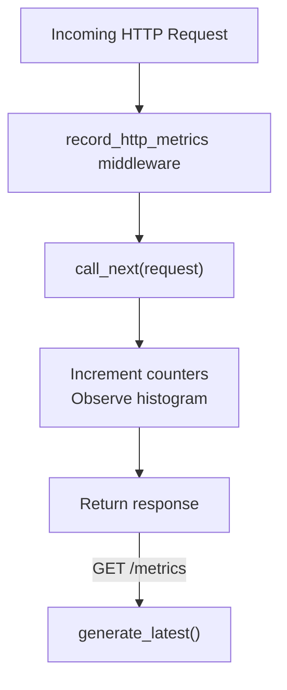
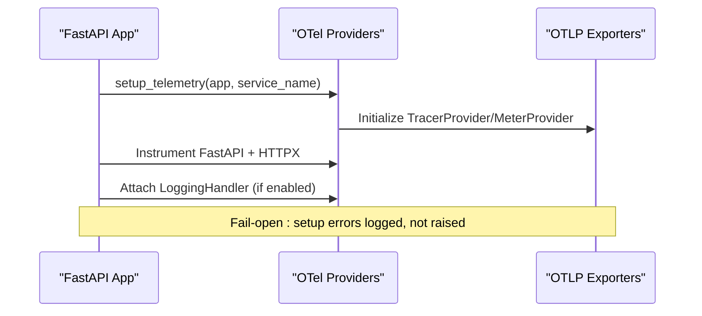
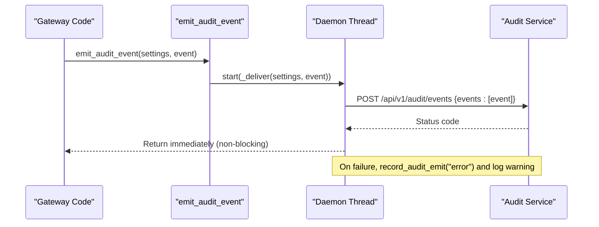
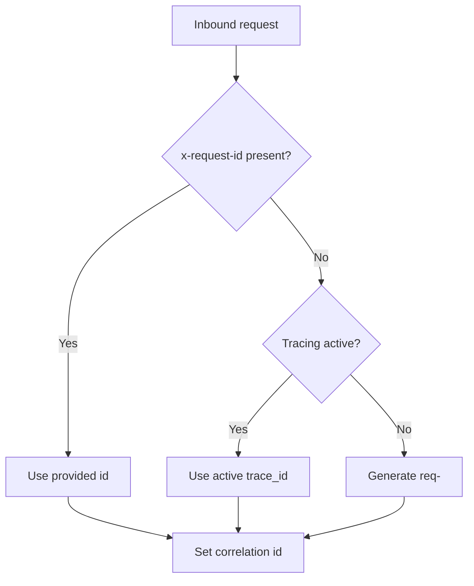
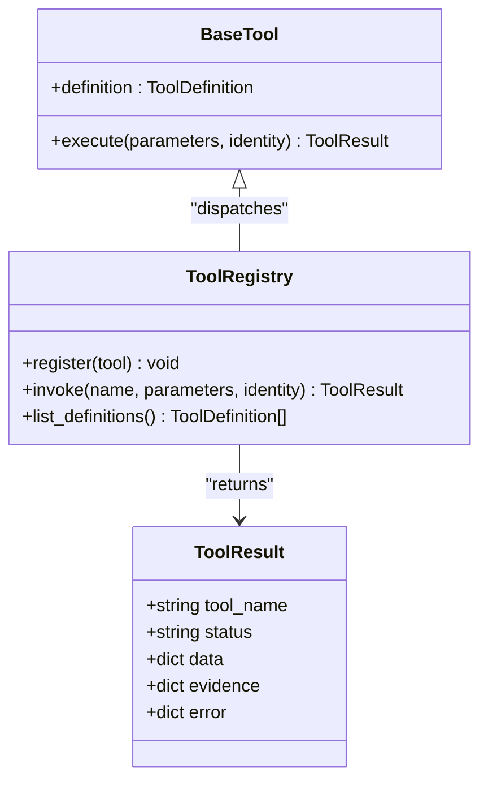
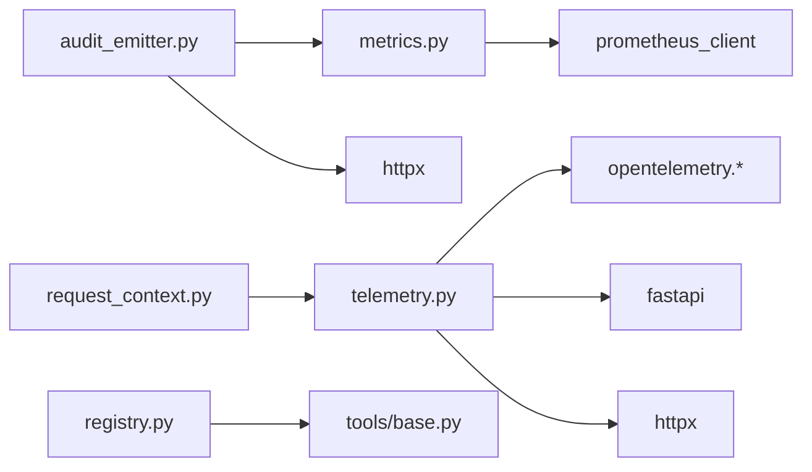

# Monitoring and Observability

<cite>
**Referenced Files in This Document**
- [observability.py](file://products/tool-gateway/src/tool_gateway/core/observability.py)
- [metrics.py](file://products/tool-gateway/src/tool_gateway/core/metrics.py)
- [telemetry.py](file://products/tool-gateway/src/tool_gateway/core/telemetry.py)
- [audit_emitter.py](file://products/tool-gateway/src/tool_gateway/services/audit_emitter.py)
- [request_context.py](file://products/tool-gateway/src/tool_gateway/core/request_context.py)
- [base.py](file://products/tool-gateway/src/tool_gateway/tools/base.py)
- [registry.py](file://products/tool-gateway/src/tool_gateway/tools/registry.py)
- [observability-conventions.md](file://shared/shared-contracts/observability-conventions.md)
</cite>

## Table of Contents
1. Introduction
2. Project Structure
3. Core Components
4. Architecture Overview
5. Detailed Component Analysis
6. Dependency Analysis
7. Performance Considerations
8. Troubleshooting Guide
9. Conclusion
10. Appendices

## Introduction
This document explains the monitoring and observability features implemented in the Tool Gateway. It covers metrics collection for tool invocations, error rates, and performance indicators; distributed tracing integration across service boundaries; audit event emission for compliance and debugging; and guidance for dashboards, alerting, log aggregation, structured logging, and troubleshooting. It also provides examples of how specialized tools can emit custom metrics and traces.

## Project Structure
The Tool Gateway implements a two-surface observability model aligned with platform conventions:
- A pull-based Prometheus /metrics endpoint that is always on and collector-independent.
- An opt-in OpenTelemetry push pipeline that exports traces, metrics, and mirrored logs via OTLP HTTP/protobuf to a configured backend.

Key modules:
- Logging configuration and structured event emission
- Prometheus metrics surface and RED middleware
- OpenTelemetry setup, FastAPI and HTTP client instrumentation, and log bridge
- Audit event emitter (fire-and-forget delivery to the audit service)
- Request correlation helpers that bridge x-request-id and trace context
- Tool base abstractions and registry used by tool implementations

**Diagram sources**
- [metrics.py:68-89](file://products/tool-gateway/src/tool_gateway/core/metrics.py#L68-L89)
- [telemetry.py:69-117](file://products/tool-gateway/src/tool_gateway/core/telemetry.py#L69-L117)
- [audit_emitter.py:67-98](file://products/tool-gateway/src/tool_gateway/services/audit_emitter.py#L67-L98)
- [observability.py:9-24](file://products/tool-gateway/src/tool_gateway/core/observability.py#L9-L24)

**Section sources**
- [observability-conventions.md:9-16](file://shared/shared-contracts/observability-conventions.md#L9-L16)
- [metrics.py:1-11](file://products/tool-gateway/src/tool_gateway/core/metrics.py#L1-L11)
- [telemetry.py:1-13](file://products/tool-gateway/src/tool_gateway/core/telemetry.py#L1-L13)

## Core Components
- Structured logging: configure_logging raises the root logger level so JSON audit events are emitted at INFO; log_event emits single-line JSON records suitable for log aggregation.
- Prometheus metrics: RED middleware records request counts and durations per handler; domain counters track policy decisions, token verification outcomes, redacted spans, and audit emit results; GET /metrics exposes raw Prometheus text.
- Distributed tracing: optional OTel push pipeline initializes TracerProvider, MeterProvider, FastAPI and HTTPX instrumentation, and bridges structured logs to OTLP logs when enabled.
- Audit events: fire-and-forget delivery to the audit service with non-blocking threads, timeouts, and outcome metrics; no degradation to the tool path on failures.
- Request correlation: resolves x-request-id from inbound header, active trace_id, or generated UUID; used consistently across services.

**Section sources**
- [observability.py:9-24](file://products/tool-gateway/src/tool_gateway/core/observability.py#L9-L24)
- [metrics.py:25-108](file://products/tool-gateway/src/tool_gateway/core/metrics.py#L25-L108)
- [telemetry.py:28-133](file://products/tool-gateway/src/tool_gateway/core/telemetry.py#L28-L133)
- [audit_emitter.py:29-98](file://products/tool-gateway/src/tool_gateway/services/audit_emitter.py#L29-L98)
- [request_context.py:8-19](file://products/tool-gateway/src/tool_gateway/core/request_context.py#L8-L19)

## Architecture Overview
The Tool Gateway processes requests through FastAPI, applies RED metrics, optionally instruments with OpenTelemetry, executes tools via the registry, emits audit events asynchronously, and writes structured logs. Outbound calls propagate trace context automatically.

**Diagram sources**
- [metrics.py:68-89](file://products/tool-gateway/src/tool_gateway/core/metrics.py#L68-L89)
- [telemetry.py:69-117](file://products/tool-gateway/src/tool_gateway/core/telemetry.py#L69-L117)
- [registry.py:65-88](file://products/tool-gateway/src/tool_gateway/tools/registry.py#L65-L88)
- [audit_emitter.py:67-98](file://products/tool-gateway/src/tool_gateway/services/audit_emitter.py#L67-L98)

## Detailed Component Analysis

### Structured Logging and Audit Trail
- configure_logging sets the root logger to INFO so JSON audit events survive Uvicorn’s default WARNING level.
- log_event emits a single-line JSON record with an event name and fields; these records form the audit trail and are forwarded to OTLP logs when tracing is enabled.
- The OTLP log bridge attaches a LoggingHandler to the root logger, mirroring structured logs into the OTLP log pipeline while keeping stdout as source of truth.

**Diagram sources**
- [observability.py:9-24](file://products/tool-gateway/src/tool_gateway/core/observability.py#L9-L24)
- [telemetry.py:37-66](file://products/tool-gateway/src/tool_gateway/core/telemetry.py#L37-L66)

**Section sources**
- [observability.py:9-24](file://products/tool-gateway/src/tool_gateway/core/observability.py#L9-L24)
- [telemetry.py:37-66](file://products/tool-gateway/src/tool_gateway/core/telemetry.py#L37-L66)
- [observability-conventions.md:58-69](file://shared/shared-contracts/observability-conventions.md#L58-L69)

### Prometheus Metrics Surface
- RED middleware records http_requests_total and http_request_duration_seconds per method and templated handler, excluding the /metrics endpoint itself.
- Domain counters:
  - gateway_policy_decisions_total{action, decision}
  - gateway_token_verification_total{result}
  - gateway_tool_redacted_spans_total{tool}
  - audit_emits_total{result}
- GET /metrics returns the latest Prometheus format.

**Diagram sources**
- [metrics.py:62-89](file://products/tool-gateway/src/tool_gateway/core/metrics.py#L62-L89)

**Section sources**
- [metrics.py:25-108](file://products/tool-gateway/src/tool_gateway/core/metrics.py#L25-L108)
- [observability-conventions.md:18-45](file://shared/shared-contracts/observability-conventions.md#L18-L45)

### Distributed Tracing Integration
- Gated by OTEL_ENABLED; when disabled, no providers are initialized and there is zero overhead.
- Initializes TracerProvider and MeterProvider once, configures BatchSpanProcessor and PeriodicExportingMetricReader with OTLP HTTP exporters, and instruments FastAPI and HTTPX clients.
- Bridges structured logs to OTLP logs so they join traces via W3C trace context.
- current_trace_id returns the active span’s trace_id when available, enabling correlation with x-request-id.

**Diagram sources**
- [telemetry.py:69-117](file://products/tool-gateway/src/tool_gateway/core/telemetry.py#L69-L117)

**Section sources**
- [telemetry.py:28-133](file://products/tool-gateway/src/tool_gateway/core/telemetry.py#L28-L133)
- [observability-conventions.md:47-57](file://shared/shared-contracts/observability-conventions.md#L47-L57)

### Audit Event Emission
- build_audit_event constructs an envelope matching the shared audit-event schema, including event_id, occurred_at, event_type, service, request_id, outcome, details, and optional identity/session fields.
- emit_audit_event sends events to the audit service over HTTP using a daemon thread with a short timeout; failures are recorded via metrics and warnings but never block the caller.
- When audit service URL is unset, emission is a no-op, preserving historical log-only behavior.

**Diagram sources**
- [audit_emitter.py:29-98](file://products/tool-gateway/src/tool_gateway/services/audit_emitter.py#L29-L98)

**Section sources**
- [audit_emitter.py:29-98](file://products/tool-gateway/src/tool_gateway/services/audit_emitter.py#L29-L98)
- [metrics.py:105-108](file://products/tool-gateway/src/tool_gateway/core/metrics.py#L105-L108)

### Request Correlation and Trace Bridging
- resolve_request_id prefers an inbound x-request-id, then bridges to the active OTel trace_id when tracing is enabled, otherwise generates a UUID-prefixed id.
- This ensures a single correlation key joins logs and traces when tracing is active.

**Diagram sources**
- [request_context.py:8-19](file://products/tool-gateway/src/tool_gateway/core/request_context.py#L8-L19)
- [telemetry.py:120-133](file://products/tool-gateway/src/tool_gateway/core/telemetry.py#L120-L133)

**Section sources**
- [request_context.py:8-19](file://products/tool-gateway/src/tool_gateway/core/request_context.py#L8-L19)
- [observability-conventions.md:71-76](file://shared/shared-contracts/observability-conventions.md#L71-L76)

### Tool Execution and Evidence
- Tools implement BaseTool.execute and return ToolResult with status, data/evidence/error.
- Evidence includes executed_at, duration_ms, risk_level, and source_system, enabling post-execution analysis.
- Registry.invoke wraps execution and converts exceptions into structured error results with consistent codes.

**Diagram sources**
- [base.py:15-123](file://products/tool-gateway/src/tool_gateway/tools/base.py#L15-L123)
- [registry.py:18-89](file://products/tool-gateway/src/tool_gateway/tools/registry.py#L18-L89)

**Section sources**
- [base.py:15-123](file://products/tool-gateway/src/tool_gateway/tools/base.py#L15-L123)
- [registry.py:18-89](file://products/tool-gateway/src/tool_gateway/tools/registry.py#L18-L89)

## Dependency Analysis
- metrics.py depends on prometheus_client and FastAPI; it is independent of OTel.
- telemetry.py conditionally imports OTel SDKs only when enabled; it instruments FastAPI and HTTPX and bridges logs.
- audit_emitter.py depends on httpx and settings; it uses metrics to record outcomes.
- request_context.py depends on telemetry to read the active trace_id.
- registry.py and base.py provide the tool execution contract used by all tools.

**Diagram sources**
- [metrics.py:13-23](file://products/tool-gateway/src/tool_gateway/core/metrics.py#L13-L23)
- [telemetry.py:74-106](file://products/tool-gateway/src/tool_gateway/core/telemetry.py#L74-L106)
- [audit_emitter.py:10-21](file://products/tool-gateway/src/tool_gateway/services/audit_emitter.py#L10-L21)
- [request_context.py:1-5](file://products/tool-gateway/src/tool_gateway/core/request_context.py#L1-L5)
- [registry.py:1-13](file://products/tool-gateway/src/tool_gateway/tools/registry.py#L1-L13)
- [base.py:1-12](file://products/tool-gateway/src/tool_gateway/tools/base.py#L1-L12)

**Section sources**
- [metrics.py:13-23](file://products/tool-gateway/src/tool_gateway/core/metrics.py#L13-L23)
- [telemetry.py:74-106](file://products/tool-gateway/src/tool_gateway/core/telemetry.py#L74-L106)
- [audit_emitter.py:10-21](file://products/tool-gateway/src/tool_gateway/services/audit_emitter.py#L10-L21)
- [request_context.py:1-5](file://products/tool-gateway/src/tool_gateway/core/request_context.py#L1-L5)
- [registry.py:1-13](file://products/tool-gateway/src/tool_gateway/tools/registry.py#L1-L13)
- [base.py:1-12](file://products/tool-gateway/src/tool_gateway/tools/base.py#L1-L12)

## Performance Considerations
- Prometheus /metrics is always on and lightweight; avoid high-cardinality labels per conventions.
- OTel push is off by default; when enabled, batch processors minimize overhead and fail open.
- Audit emission is fire-and-forget with a short timeout; it never blocks tool execution paths.
- Tool implementations should measure their own duration and populate evidence.duration_ms for accurate per-tool performance analysis.

[No sources needed since this section provides general guidance]

## Troubleshooting Guide
- No logs visible: ensure configure_logging() is called at startup and LOG_LEVEL allows INFO.
- Missing OTel signals: verify OTEL_ENABLED and OTEL_EXPORTER_OTLP_ENDPOINT; check that authentication headers are provisioned and reachable.
- High cardinality alerts: review label usage against conventions; use templated handlers instead of raw URLs.
- Audit gaps: confirm GATEWAY_AUDIT_SERVICE_URL is set; inspect audit_emits_total{result} and warnings for delivery failures.
- Slow endpoints: analyze http_request_duration_seconds per handler; correlate with tool execution evidence.duration_ms.

**Section sources**
- [observability.py:9-19](file://products/tool-gateway/src/tool_gateway/core/observability.py#L9-L19)
- [telemetry.py:28-35](file://products/tool-gateway/src/tool_gateway/core/telemetry.py#L28-L35)
- [metrics.py:62-89](file://products/tool-gateway/src/tool_gateway/core/metrics.py#L62-L89)
- [audit_emitter.py:67-98](file://products/tool-gateway/src/tool_gateway/services/audit_emitter.py#L67-L98)
- [observability-conventions.md:18-45](file://shared/shared-contracts/observability-conventions.md#L18-L45)

## Conclusion
The Tool Gateway provides a robust, standards-aligned observability foundation: always-on Prometheus metrics, opt-in OpenTelemetry tracing and log bridging, structured audit trails, and fire-and-forget audit delivery. These components enable reliable dashboards, alerting, and cross-service tracing while preserving performance and fail-open guarantees.

[No sources needed since this section summarizes without analyzing specific files]

## Appendices

### Setting Up Dashboards and Alerting
- Pull metrics from GET /metrics and scrape with your preferred Prometheus-compatible system.
- Build dashboards around:
  - http_requests_total{method, handler, status}
  - http_request_duration_seconds{method, handler}
  - gateway_policy_decisions_total{action, decision}
  - gateway_token_verification_total{result}
  - gateway_tool_redacted_spans_total{tool}
  - audit_emits_total{result}
- Configure alert rules for:
  - Elevated error rates (status >= 5xx) per handler
  - Latency SLO breaches per handler
  - Policy denials spikes
  - Audit emit errors increasing beyond thresholds

[No sources needed since this section provides general guidance]

### Log Aggregation Strategy
- Aggregate single-line JSON logs from stdout at INFO level.
- When OTel is enabled, correlate logs with traces using the same W3C trace_id bound to x-request-id.
- Ensure log levels are not downgraded below INFO to preserve the audit trail.

**Section sources**
- [observability.py:9-24](file://products/tool-gateway/src/tool_gateway/core/observability.py#L9-L24)
- [observability-conventions.md:58-69](file://shared/shared-contracts/observability-conventions.md#L58-L69)

### Custom Metrics and Traces for Specialized Tools
- Add custom counters/histograms in a module-level scope to avoid double registration and follow naming conventions.
- Record tool-specific success/failure and latency in tool.execute and populate evidence.duration_ms.
- When tracing is enabled, spans created by FastAPI and HTTPX instrumentation will automatically capture outbound calls; add additional spans inside tool.execute if needed to capture internal steps.

**Section sources**
- [metrics.py:1-11](file://products/tool-gateway/src/tool_gateway/core/metrics.py#L1-L11)
- [base.py:108-123](file://products/tool-gateway/src/tool_gateway/tools/base.py#L108-L123)
- [telemetry.py:69-117](file://products/tool-gateway/src/tool_gateway/core/telemetry.py#L69-L117)
- [observability-conventions.md:18-45](file://shared/shared-contracts/observability-conventions.md#L18-L45)