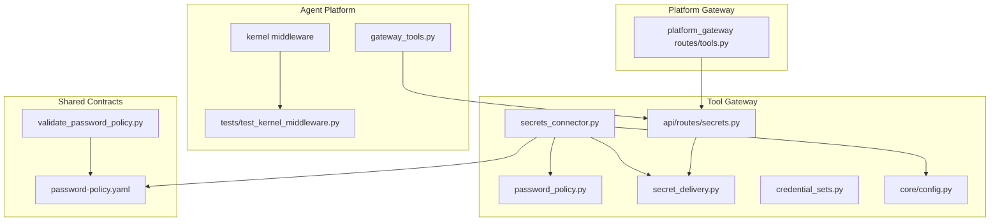
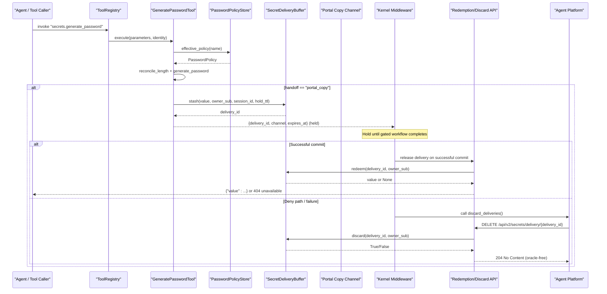
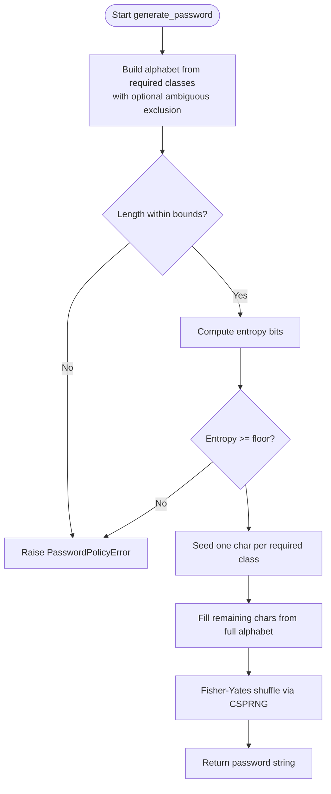
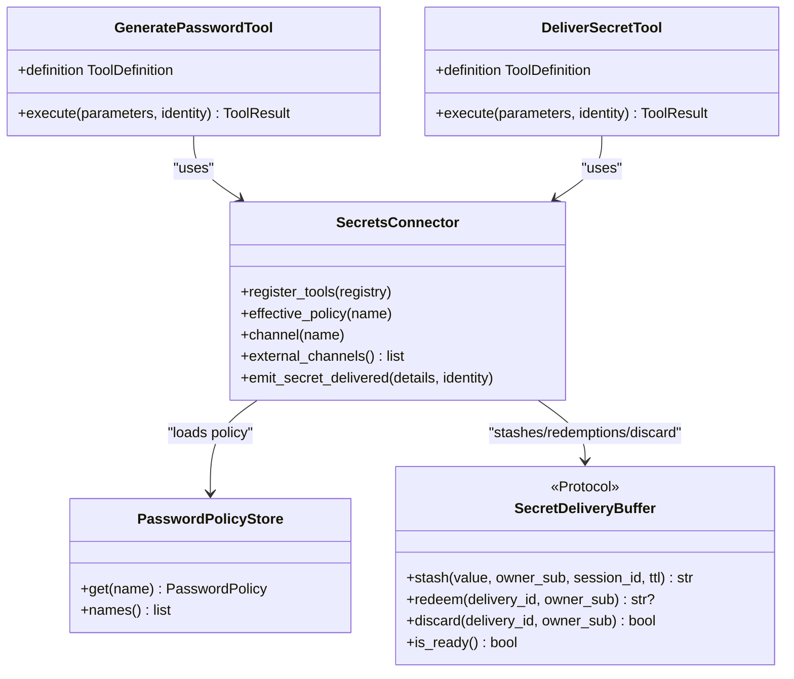
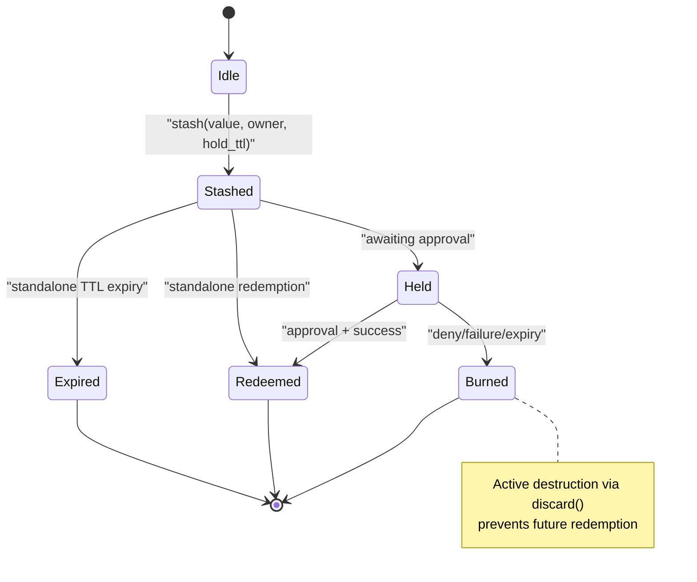
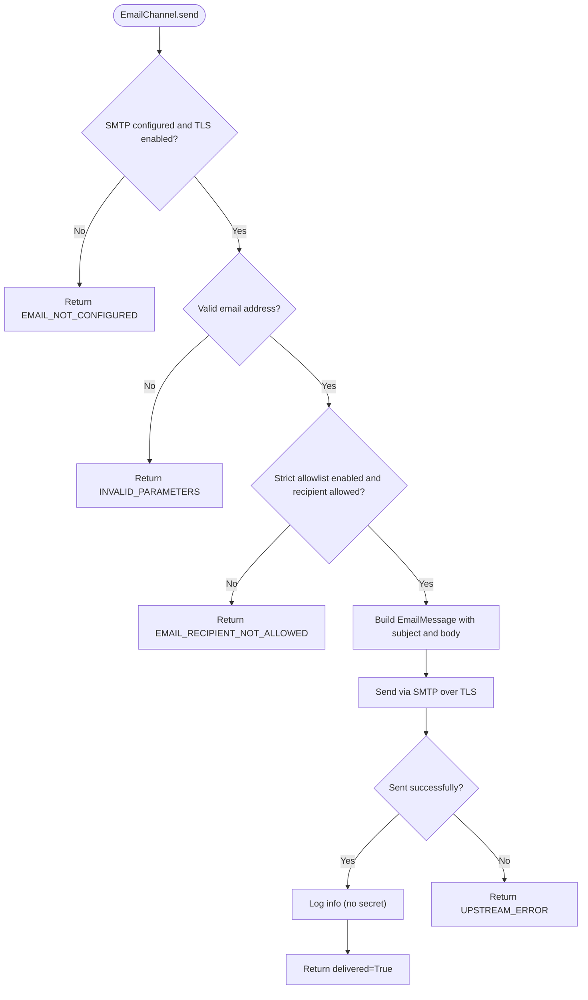
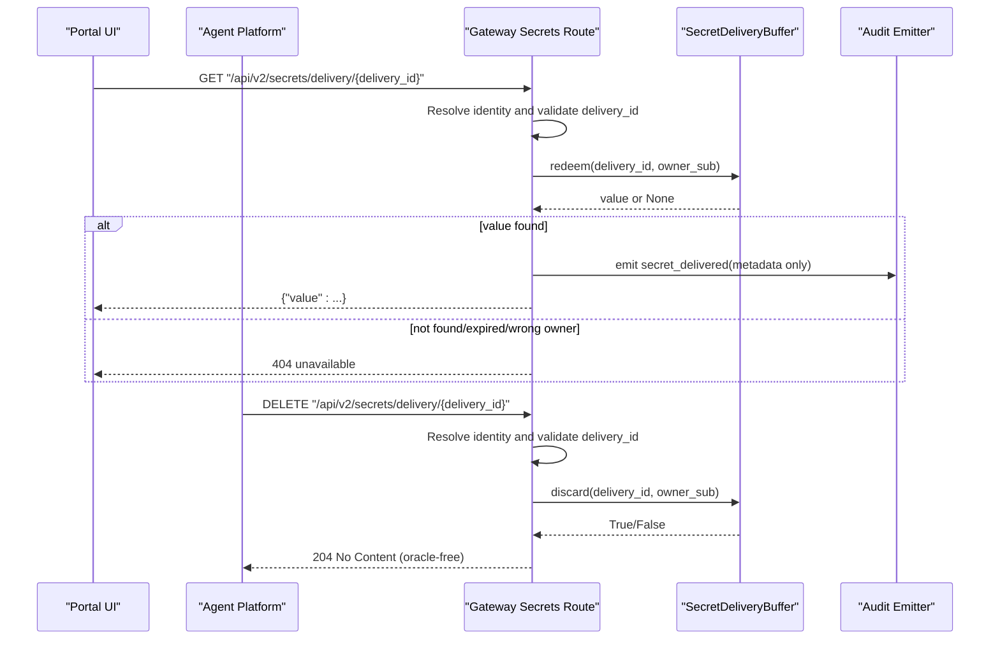
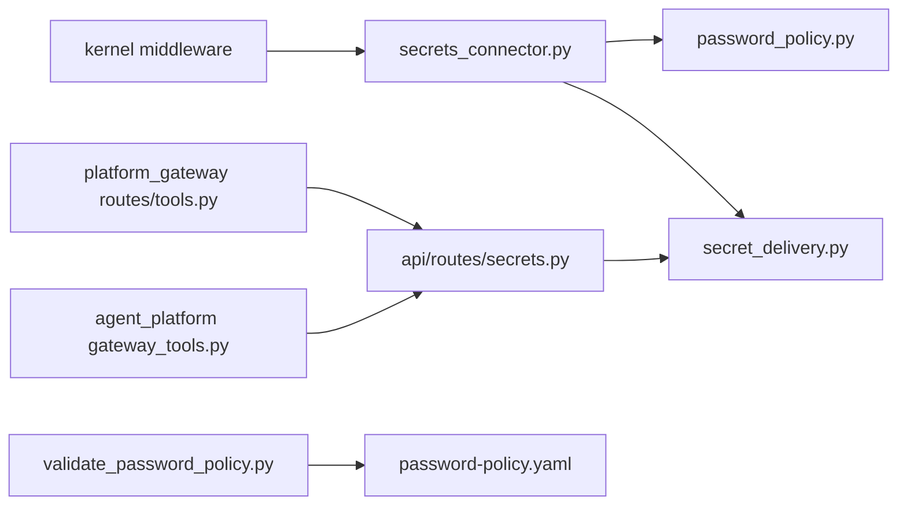

# Secrets Management and Password Generation

<cite>
**Referenced Files in This Document**
- [secrets_connector.py](file://products/tool-gateway/src/tool_gateway/tools/secrets_connector.py)
- [password_policy.py](file://products/tool-gateway/src/tool_gateway/tools/password_policy.py)
- [secret_delivery.py](file://products/tool-gateway/src/tool_gateway/tools/secret_delivery.py)
- [credential_sets.py](file://products/tool-gateway/src/tool_gateway/tools/credential_sets.py)
- [secrets.py](file://products/tool-gateway/src/tool_gateway/api/routes/secrets.py)
- [password-policy.yaml](file://shared/shared-contracts/policies/password-policy.yaml)
- [validate_password_policy.py](file://shared/shared-contracts/scripts/validate_password_policy.py)
- [test_secrets_connector.py](file://products/tool-gateway/tests/test_secrets_connector.py)
- [test_secret_delivery_integration.py](file://products/agent-platform/tests/test_secret_delivery_integration.py)
- [tools.py](file://products/platform-gateway/src/platform_gateway/api/routes/tools.py)
- [config.py](file://products/tool-gateway/src/tool_gateway/core/config.py)
- [test_kernel_middleware.py](file://products/agent-platform/tests/test_kernel_middleware.py)
- [gateway_tools.py](file://products/agent-platform/src/agent_service/tools/gateway_tools.py)
</cite>

## Update Summary
**Changes Made**
- Added comprehensive documentation for reveal-on-commit timing for gated workflows
- Updated secret delivery buffer configuration to include new hold TTL functionality
- Enhanced portal_copy channel handling for human-in-the-loop approval scenarios
- Added detailed explanation of delayed secret delivery mechanisms
- **Updated**: Added active destruction capability with new discard method and DELETE API endpoint for enhanced security posture in SPEC-062 R-3 deny-path hardening
- Updated architecture diagrams to reflect the new reveal-on-commit flow

## Table of Contents
1. [Introduction](#introduction)
2. [Project Structure](#project-structure)
3. [Core Components](#core-components)
4. [Architecture Overview](#architecture-overview)
5. [Detailed Component Analysis](#detailed-component-analysis)
6. [Dependency Analysis](#dependency-analysis)
7. [Performance Considerations](#performance-considerations)
8. [Troubleshooting Guide](#troubleshooting-guide)
9. [Conclusion](#conclusion)

## Introduction
This document explains how the platform generates, stores, and delivers secrets (primarily passwords) securely with enhanced support for human-in-the-loop approval workflows. It focuses on:
- Cryptographically secure password generation governed by a contract-driven policy.
- One-time secret delivery via an authenticated portal handoff with **reveal-on-commit timing** for gated workflows.
- Support for delayed secret delivery in human-in-the-loop approval scenarios using extended TTL windows.
- **Active destruction capability** for held secret deliveries through dedicated discard methods and DELETE API endpoints.
- Strict boundaries that prevent secrets from leaking into transcripts, logs, or renders.
- Extensibility for additional external channels while keeping generation and storage unchanged.

The design ensures that generated values are real only in bounded contexts: transiently in process memory, once in the kernel working context result field, once in a single-use delivery buffer with extended hold TTL for approvals, and once over TLS to SMTP when emailing. Everywhere else, secrets are masked or absent.

## Project Structure
Secrets management spans several modules within the tool-gateway product and shared contracts:
- Policy definition lives in a YAML contract under shared contracts and is consumed by the gateway.
- The connector implements two tools: one for read-tier password generation and one for write-tier external delivery.
- A delivery buffer abstraction supports single-replica in-memory and multi-replica Redis backends with dual TTL support.
- An API route exposes both redemption and active destruction endpoints used by the portal and agent platform.
- Credential sets provide named login credentials for browser flows; they are separate from generated passwords but follow similar secret-handling principles.

**Diagram sources**
- [secrets_connector.py:1-60](file://products/tool-gateway/src/tool_gateway/tools/secrets_connector.py#L1-L60)
- [password_policy.py:1-50](file://products/tool-gateway/src/tool_gateway/tools/password_policy.py#L1-L50)
- [secret_delivery.py:1-40](file://products/tool-gateway/src/tool_gateway/tools/secret_delivery.py#L1-L40)
- [secrets.py:1-30](file://products/tool-gateway/src/tool_gateway/api/routes/secrets.py#L1-L30)
- [config.py:32-48](file://products/tool-gateway/src/tool_gateway/core/config.py#L32-L48)
- [tools.py:39-58](file://products/platform-gateway/src/platform_gateway/api/routes/tools.py#L39-L58)
- [gateway_tools.py:170-220](file://products/agent-platform/src/agent_service/tools/gateway_tools.py#L170-L220)

**Section sources**
- [secrets_connector.py:1-60](file://products/tool-gateway/src/tool_gateway/tools/secrets_connector.py#L1-L60)
- [password_policy.py:1-50](file://products/tool-gateway/src/tool_gateway/tools/password_policy.py#L1-L50)
- [secret_delivery.py:1-40](file://products/tool-gateway/src/tool_gateway/tools/secret_delivery.py#L1-L40)
- [secrets.py:1-30](file://products/tool-gateway/src/tool_gateway/api/routes/secrets.py#L1-L30)
- [config.py:32-48](file://products/tool-gateway/src/tool_gateway/core/config.py#L32-L48)
- [tools.py:39-58](file://products/platform-gateway/src/platform_gateway/api/routes/tools.py#L39-L58)

## Core Components
- PasswordPolicyStore and generate_password enforce a contract-driven strength model with CSPRNG-backed generation, entropy floors, and tightening-only overrides.
- SecretsConnector registers two tools with enhanced reveal-on-commit support:
  - secrets.generate_password: read-tier, returns a generated password and optionally stashes it for portal copy handoff with extended hold TTL.
  - secrets.deliver: write-tier, sends a secret over an external channel (currently email), gated by capability and confirmation.
- SecretDeliveryBuffer provides single-use, owner-scoped, TTL-bounded storage with dual TTL support (standalone vs. hold TTL) for supporting human-in-the-loop approvals, plus **active destruction capability**.
- DeliveryChannel abstracts transports; PortalCopyChannel handles local handoff with reveal-on-commit timing; EmailChannel handles SMTP with strict allowlists and TLS enforcement.
- Redemption API exposes a one-time GET endpoint to retrieve a stashed value for the originating identity.
- **Active Destruction API** exposes a DELETE endpoint to destroy held deliveries without revealing them, called by agent platform during deny paths.
- Kernel middleware manages held deliveries during gated workflows, releasing them only on successful commit and actively destroying them on failures.

**Updated** Added active destruction capability with dedicated discard methods and DELETE API endpoint for enhanced security posture in SPEC-062 R-3 deny-path hardening.

**Section sources**
- [password_policy.py:65-170](file://products/tool-gateway/src/tool_gateway/tools/password_policy.py#L65-L170)
- [secrets_connector.py:292-378](file://products/tool-gateway/src/tool_gateway/tools/secrets_connector.py#L292-L378)
- [secret_delivery.py:50-165](file://products/tool-gateway/src/tool_gateway/tools/secret_delivery.py#L50-L165)
- [secrets_connector.py:120-285](file://products/tool-gateway/src/tool_gateway/tools/secrets_connector.py#L120-L285)
- [secrets.py:47-170](file://products/tool-gateway/src/tool_gateway/api/routes/secrets.py#L47-L170)
- [config.py:370-425](file://products/tool-gateway/src/tool_gateway/core/config.py#L370-L425)

## Architecture Overview
The system separates concerns across policy, generation, delivery, and redemption with enhanced support for gated workflows:
- Policy is loaded from a YAML contract and validated at load time. Overrides can tighten constraints but never weaken them.
- Generation uses a CSPRNG and guarantees required classes and entropy floors.
- Local handoff (portal_copy) stashes the value with extended hold TTL for human-in-the-loop approvals, enabling reveal-on-commit timing.
- External delivery (email) is capability-gated, fail-closed, and enforces recipient allowlists and TLS.
- Redemption is authenticated, single-use, and owner-scoped; it emits audit events without leaking the secret.
- **Active destruction** is available via DELETE endpoint to immediately burn held deliveries on deny paths, preventing any future redemption attempts.
- Kernel middleware manages held deliveries during approval workflows, releasing them only upon successful commit and actively destroying them on failures.

**Updated** Enhanced sequence diagram to show the reveal-on-commit timing mechanism, kernel middleware involvement in gated workflows, and active destruction capability on deny paths.

**Diagram sources**
- [secrets_connector.py:393-521](file://products/tool-gateway/src/tool_gateway/tools/secrets_connector.py#L393-L521)
- [password_policy.py:107-170](file://products/tool-gateway/src/tool_gateway/tools/password_policy.py#L107-L170)
- [secret_delivery.py:89-165](file://products/tool-gateway/src/tool_gateway/tools/secret_delivery.py#L89-L165)
- [secrets.py:47-170](file://products/tool-gateway/src/tool_gateway/api/routes/secrets.py#L47-L170)
- [gateway_tools.py:170-220](file://products/agent-platform/src/agent_service/tools/gateway_tools.py#L170-L220)
- [test_kernel_middleware.py:790-850](file://products/agent-platform/tests/test_kernel_middleware.py#L790-L850)

## Detailed Component Analysis

### Password Policy and Generation
- Policy loading:
  - Loads YAML contract with versioning and validates structure.
  - Enforces default floor constants and known character classes.
  - Supports named policies and additive entries; unknown or invalid contracts refuse generation.
- Generation:
  - Uses CSPRNG to pick characters from required classes first, then fills the rest from the full alphabet.
  - Shuffles via Fisher-Yates driven by CSPRNG to avoid biased positions.
  - Validates entropy against a configured floor before emitting.
- Length reconciliation:
  - Raises requested length to policy minimum if too short.
  - Refuses requests below hard floor or that cannot carry all required classes.
  - Caps maximum length to a safe bound.

**Diagram sources**
- [password_policy.py:138-170](file://products/tool-gateway/src/tool_gateway/tools/password_policy.py#L138-L170)
- [password_policy.py:107-135](file://products/tool-gateway/src/tool_gateway/tools/password_policy.py#L107-L135)

**Section sources**
- [password_policy.py:65-170](file://products/tool-gateway/src/tool_gateway/tools/password_policy.py#L65-L170)
- [password_policy.py:203-245](file://products/tool-gateway/src/tool_gateway/tools/password_policy.py#L203-L245)
- [password-policy.yaml:40-48](file://shared/shared-contracts/policies/password-policy.yaml#L40-L48)

### Secrets Connector Tools
- GeneratePasswordTool:
  - Read-tier tool; validates parameters and policy name.
  - Generates password according to effective policy and optional exclude_ambiguous override.
  - Optionally stashes the value for portal_copy handoff with extended hold TTL and returns delivery metadata.
  - Returns the generated password in a dedicated result field so gateway redaction does not mask it before the kernel receives it; downstream projections still mask it.
- DeliverSecretTool:
  - Write-tier dispatcher for external channels; requires extra capability.
  - Validates channel, password, and recipient types.
  - Delegates to registered channel.send and emits audit events with metadata only.

**Updated** Enhanced to support extended hold TTL for human-in-the-loop approval scenarios.

**Diagram sources**
- [secrets_connector.py:292-378](file://products/tool-gateway/src/tool_gateway/tools/secrets_connector.py#L292-L378)
- [secrets_connector.py:393-521](file://products/tool-gateway/src/tool_gateway/tools/secrets_connector.py#L393-L521)
- [secrets_connector.py:524-654](file://products/tool-gateway/src/tool_gateway/tools/secrets_connector.py#L524-L654)
- [secret_delivery.py:50-79](file://products/tool-gateway/src/tool_gateway/tools/secret_delivery.py#L50-L79)

**Section sources**
- [secrets_connector.py:393-521](file://products/tool-gateway/src/tool_gateway/tools/secrets_connector.py#L393-L521)
- [secrets_connector.py:524-654](file://products/tool-gateway/src/tool_gateway/tools/secrets_connector.py#L524-L654)

### Enhanced Secret Delivery Buffer with Dual TTL Support and Active Destruction
- InMemorySecretDeliveryBuffer:
  - Process-local store with monotonic-clock TTL and max-entry eviction.
  - Single-use redemption; wrong owner or expired handle yields None and destroys the handle.
  - Supports dual TTL modes: standalone TTL for immediate redemption and extended hold TTL for approval workflows.
  - **Active destruction**: New `discard` method that destroys entries without revealing values, owner-scoped and idempotent.
- RedisSecretDeliveryBuffer:
  - Multi-replica support using SET EX for TTL and GETDEL for atomic single-use redemption.
  - Lazy import of redis; connection failure falls open to in-memory with a recorded fallback.
  - **Active destruction**: Owner-scoped deletion that verifies ownership before destroying, maintaining single-use semantics.
- Factory build_secret_delivery_buffer selects backend based on configuration and gracefully degrades.

**Updated** Enhanced with dual TTL support and active destruction capability to accommodate human-in-the-loop approval scenarios where secrets need to remain available throughout the approval window but can be immediately destroyed on deny paths.

**Diagram sources**
- [secret_delivery.py:89-165](file://products/tool-gateway/src/tool_gateway/tools/secret_delivery.py#L89-L165)
- [secret_delivery.py:167-229](file://products/tool-gateway/src/tool_gateway/tools/secret_delivery.py#L167-L229)
- [secret_delivery.py:231-281](file://products/tool-gateway/src/tool_gateway/tools/secret_delivery.py#L231-L281)

**Section sources**
- [secret_delivery.py:89-165](file://products/tool-gateway/src/tool_gateway/tools/secret_delivery.py#L89-L165)
- [secret_delivery.py:167-229](file://products/tool-gateway/src/tool_gateway/tools/secret_delivery.py#L167-L229)
- [secret_delivery.py:231-281](file://products/tool-gateway/src/tool_gateway/tools/secret_delivery.py#L231-L281)

### Reveal-on-Commit Timing for Gated Workflows with Active Destruction
The enhanced secret delivery system now supports reveal-on-commit timing for human-in-the-loop approval scenarios with active destruction capability:

- **Hold TTL Configuration**: New `GATEWAY_SECRET_DELIVERY_HOLD_TTL_SECONDS` environment variable (default 900 seconds = 600s approval timeout + 300s redemption margin) extends the availability window for portal_copy deliveries during approval workflows.
- **Delayed Release**: When a generation is followed by a gated mutation, the secret_delivery frame is withheld at generation and released only after the gate is approved and its call executes successfully.
- **Active Destruction on Deny Paths**: On deny, gated-call failure, or expiry, the held delivery is actively destroyed via DELETE API endpoint rather than waiting for TTL expiration.
- **Kernel Middleware Integration**: The agent platform's kernel middleware manages held deliveries, tracking which calls are part of approved execution requests and releasing or destroying the secret_delivery frame accordingly.
- **Oracle-Free Responses**: The DELETE endpoint returns 204 No Content for all outcomes (found, already-spent, expired, wrong-owner, malformed), providing no information about whether a delivery existed.

**New Section** Added comprehensive documentation for the reveal-on-commit timing mechanism and active destruction capability that enables secure human-in-the-loop approval workflows with immediate denial response.

**Section sources**
- [config.py:370-425](file://products/tool-gateway/src/tool_gateway/core/config.py#L370-L425)
- [secrets.py:122-170](file://products/tool-gateway/src/tool_gateway/api/routes/secrets.py#L122-L170)
- [gateway_tools.py:170-220](file://products/agent-platform/src/agent_service/tools/gateway_tools.py#L170-L220)
- [test_kernel_middleware.py:790-850](file://products/agent-platform/tests/test_kernel_middleware.py#L790-L850)
- [test_secret_delivery_integration.py:392-454](file://products/agent-platform/tests/test_secret_delivery_integration.py#L392-L454)

### Delivery Channels
- PortalCopyChannel:
  - Stashes the value in the delivery buffer for one-time redemption by the originating owner using extended hold TTL.
  - Emits no secret_delivered event at stash time; audit fires at redemption.
  - Integrates with kernel middleware for reveal-on-commit timing in gated workflows.
- EmailChannel:
  - Requires host, sender, and TLS enabled; otherwise fails closed.
  - Validates recipient addresses strictly and enforces recipient allowlist when strict posture is enabled.
  - Sends via SMTP over TLS; transport is swappable for tests.
  - Never logs the secret; errors do not leak values.

**Updated** Enhanced portal_copy channel to support extended hold TTL and reveal-on-commit timing for gated workflows.

**Diagram sources**
- [secrets_connector.py:156-285](file://products/tool-gateway/src/tool_gateway/tools/secrets_connector.py#L156-L285)

**Section sources**
- [secrets_connector.py:120-154](file://products/tool-gateway/src/tool_gateway/tools/secrets_connector.py#L120-L154)
- [secrets_connector.py:156-285](file://products/tool-gateway/src/tool_gateway/tools/secrets_connector.py#L156-L285)

### Redemption and Active Destruction APIs
- **Redemption Endpoint** GET /api/v2/secrets/delivery/{delivery_id}:
  - Authenticates the request and resolves identity.
  - Validates delivery_id format and existence.
  - Performs single-use redemption scoped to the originating owner.
  - Emits secret_delivered audit event with metadata only (no secret).
  - Returns the value once; subsequent attempts return "unavailable".
- **Active Destruction Endpoint** DELETE /api/v2/secrets/delivery/{delivery_id}:
  - **New**: Destroys stashed secrets WITHOUT revealing them (SPEC-062 R-3 deny path).
  - Called by agent platform when gated reset is denied, mutation fails, or park expires.
  - Owner-scoped: a wrong owner discards nothing.
  - Idempotent and oracle-free: found, already-spent, expired, wrong-owner and malformed handles all answer 204 with no body.
  - Best-effort: transport failures degrade to hold-TTL expiry burn (fail-safe).

**Updated** Added comprehensive documentation for the new active destruction API endpoint that provides immediate denial response capability.

**Diagram sources**
- [secrets.py:47-170](file://products/tool-gateway/src/tool_gateway/api/routes/secrets.py#L47-L170)
- [secret_delivery.py:50-79](file://products/tool-gateway/src/tool_gateway/tools/secret_delivery.py#L50-L79)
- [gateway_tools.py:170-220](file://products/agent-platform/src/agent_service/tools/gateway_tools.py#L170-L220)

**Section sources**
- [secrets.py:47-170](file://products/tool-gateway/src/tool_gateway/api/routes/secrets.py#L47-L170)

### Platform Gateway Proxy
- The platform gateway exposes a proxy route that obtains a delegated token and forwards the redemption call to the tool gateway's secrets redemption endpoint.
- If authentication or delegation fails, it returns a generic "unavailable" response.

**Section sources**
- [tools.py:39-58](file://products/platform-gateway/src/platform_gateway/api/routes/tools.py#L39-L58)

### Credential Sets
- Named credential sets for browser login flows are stored in a JSON file and loaded lazily with mtime refresh.
- Each set must contain username and password strings; unknown or malformed sets are ignored safely.
- Values are never logged or serialized into tool results; they flow only into fill operations.

**Section sources**
- [credential_sets.py:1-103](file://products/tool-gateway/src/tool_gateway/tools/credential_sets.py#L1-L103)

## Dependency Analysis
- secrets_connector depends on:
  - password_policy for policy loading and generation.
  - secret_delivery for buffer and channel abstractions with dual TTL support and active destruction.
  - registry for tool registration and invocation.
- secret_delivery defines the buffer protocol and concrete implementations with enhanced hold TTL functionality and active destruction; the factory chooses backend and falls back to in-memory on Redis failure.
- API route depends on request identity resolution and audit emission; it provides both redemption and active destruction endpoints.
- Shared contract validation ensures the packaged policy matches the canonical contract and that connector defaults align with the contract.
- Kernel middleware integrates with the delivery system to manage held deliveries during gated workflows, calling active destruction on deny paths.
- **Agent Platform Integration**: The agent platform's `discard_deliveries` function calls the DELETE endpoint to actively destroy held deliveries on deny paths.

**Updated** Added agent platform dependency for managing reveal-on-commit timing and active destruction in gated workflows.

**Diagram sources**
- [secrets_connector.py:1-60](file://products/tool-gateway/src/tool_gateway/tools/secrets_connector.py#L1-L60)
- [secret_delivery.py:1-40](file://products/tool-gateway/src/tool_gateway/tools/secret_delivery.py#L1-L40)
- [secrets.py:1-30](file://products/tool-gateway/src/tool_gateway/api/routes/secrets.py#L1-L30)
- [validate_password_policy.py:223-260](file://shared/shared-contracts/scripts/validate_password_policy.py#L223-L260)
- [tools.py:39-58](file://products/platform-gateway/src/platform_gateway/api/routes/tools.py#L39-L58)
- [gateway_tools.py:170-220](file://products/agent-platform/src/agent_service/tools/gateway_tools.py#L170-L220)

**Section sources**
- [secrets_connector.py:1-60](file://products/tool-gateway/src/tool_gateway/tools/secrets_connector.py#L1-L60)
- [secret_delivery.py:1-40](file://products/tool-gateway/src/tool_gateway/tools/secret_delivery.py#L1-L40)
- [secrets.py:1-30](file://products/tool-gateway/src/tool_gateway/api/routes/secrets.py#L1-L30)
- [validate_password_policy.py:223-260](file://shared/shared-contracts/scripts/validate_password_policy.py#L223-L260)
- [tools.py:39-58](file://products/platform-gateway/src/platform_gateway/api/routes/tools.py#L39-L58)

## Performance Considerations
- Generation is CPU-bound but lightweight; CSPRNG and shuffling are efficient for typical lengths up to the maximum bound.
- Policy loading is lazy and refreshed on file mtime change; repeated reads avoid unnecessary disk I/O.
- Delivery buffer operations are O(1) for stash/redeem/discard; eviction purges expired entries periodically during access.
- Email sending is offloaded to a thread to avoid blocking async tasks; failures are handled without leaking secrets.
- Redis backend adds network latency; fallback to in-memory ensures availability when Redis is unreachable.
- **Enhanced**: Hold TTL processing adds minimal overhead; the extended TTL window is managed transparently by the buffer layer.
- **Active Destruction**: DELETE endpoint operations are best-effort with no performance impact on normal redemption flows; failures degrade to TTL-based burning.

[No sources needed since this section provides general guidance]

## Troubleshooting Guide
Common issues and their signals:
- Invalid parameters:
  - Generation rejects bad policy names, out-of-range lengths, wrong types, or unsupported handoff values.
  - Delivery rejects unknown channels, missing or invalid password, or non-string recipients.
- Policy unavailability:
  - If the contract is unreadable or invalid, generation refuses and returns an error; no stale fallback is used.
- Email delivery failures:
  - EMAIL_NOT_CONFIGURED when SMTP settings are incomplete or TLS disabled.
  - EMAIL_RECIPIENT_NOT_ALLOWED when strict allowlist is enabled and recipient domain is not permitted.
  - UPSTREAM_ERROR when SMTP send fails; logs warn without leaking secrets.
- Redemption unavailable:
  - 404 "unavailable" for already redeemed, expired, wrong owner, or invalid delivery_id; intentionally indistinguishable to avoid oracle leaks.
- Redis connectivity:
  - If Redis is unreachable, the buffer falls back to in-memory with a warning; functionality remains available in single-replica mode.
- **New**: Hold TTL issues:
  - If portal_copy deliveries expire during approval workflows, check GATEWAY_SECRET_DELIVERY_HOLD_TTL_SECONDS configuration.
  - Verify that the approval timeout (hitl_confirm_timeout) plus redemption margin fits within the hold TTL window.
- **New**: Active destruction issues:
  - If DELETE endpoint returns 401, verify the requester's delegated token has proper authentication.
  - If active destruction fails, the system falls back to TTL-based burning (fail-safe behavior).
  - Monitor for transport failures between agent platform and tool gateway that might prevent immediate destruction.

**Updated** Added troubleshooting guidance for hold TTL configuration, approval workflow timing issues, and active destruction functionality.

Verification and testing:
- Unit tests assert parameter validation, policy tightening, channel behavior, and audit non-leakage.
- Integration tests cover end-to-end scenarios including stream leakage prevention and audit completeness.
- **Enhanced**: Tests verify reveal-on-commit timing behavior, including held delivery release on successful commits, silent burning on failures, and active destruction via DELETE endpoint.
- **New**: Tests validate that active destruction is owner-scoped, idempotent, and oracle-free, returning 204 for all outcomes.

**Section sources**
- [secrets_connector.py:452-488](file://products/tool-gateway/src/tool_gateway/tools/secrets_connector.py#L452-L488)
- [secrets_connector.py:576-654](file://products/tool-gateway/src/tool_gateway/tools/secrets_connector.py#L576-L654)
- [secrets_connector.py:219-285](file://products/tool-gateway/src/tool_gateway/tools/secrets_connector.py#L219-L285)
- [secrets.py:47-170](file://products/tool-gateway/src/tool_gateway/api/routes/secrets.py#L47-L170)
- [secret_delivery.py:231-281](file://products/tool-gateway/src/tool_gateway/tools/secret_delivery.py#L231-L281)
- [test_secrets_connector.py:30-133](file://products/tool-gateway/tests/test_secrets_connector.py#L30-L133)
- [test_secret_delivery_integration.py:159-244](file://products/agent-platform/tests/test_secret_delivery_integration.py#L159-L244)
- [test_kernel_middleware.py:790-850](file://products/agent-platform/tests/test_kernel_middleware.py#L790-L850)

## Conclusion
The secrets management subsystem enforces strong security properties through contract-driven policy, CSPRNG-based generation, single-use owner-scoped delivery, and strict external channel controls. The enhanced reveal-on-commit timing mechanism enables secure human-in-the-loop approval workflows by extending the availability window for portal_copy deliveries during approval processes while maintaining the same strict security posture.

Key enhancements include:
- **Dual TTL Support**: Separate standalone TTL for immediate redemption and extended hold TTL for approval workflows.
- **Reveal-on-Commit Timing**: Secrets are revealed only after successful completion of gated workflows, preventing premature exposure.
- **Active Destruction Capability**: New DELETE API endpoint provides immediate denial response by actively destroying held deliveries without revealing them.
- **Kernel Middleware Integration**: Seamless integration with approval workflows to manage held deliveries, releasing them on success and actively destroying them on failures.
- **Configuration Flexibility**: New GATEWAY_SECRET_DELIVERY_HOLD_TTL_SECONDS configuration allows tuning approval windows.
- **Oracle-Free Security**: All denial responses are indistinguishable, preventing information leakage about delivery existence.

The system minimizes exposure surfaces by ensuring secrets never appear in transcripts, logs, or renders beyond carefully bounded paths. Extensibility is supported via the DeliveryChannel interface, allowing new external channels without altering generation or storage. Validation scripts and tests ensure policy integrity and operational correctness across development and production environments.

[No sources needed since this section summarizes without analyzing specific files]